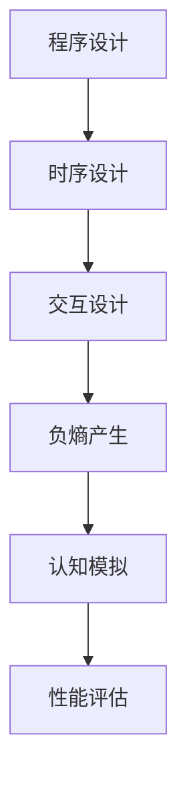

                 

 

### 1. 背景介绍

随着信息技术的迅猛发展，人工智能、大数据、云计算等技术的应用日益广泛。在这些领域，对计算机程序设计和软件开发的要求越来越高。认知的形式化作为计算机科学的一个重要分支，近年来受到了广泛关注。本文旨在探讨认知的形式化过程，并深入分析计算机程序、时序、交互以及负熵在这些过程中的作用。

计算机科学起源于20世纪中叶，随着计算机硬件和软件技术的不断发展，程序设计逐渐成为计算机科学的核心。传统的程序设计侧重于算法的效率与正确性，然而，随着应用场景的复杂化，单纯追求算法性能已不足以满足需求。认知的形式化要求我们从更高层次对程序进行设计，将人类认知过程抽象为计算机程序，实现计算机对人类思维的模拟。

时序和交互是认知的形式化过程中的关键要素。时序指的是程序执行的时间顺序，它决定了程序的行为和状态。交互则是指程序与外部环境或其他程序之间的相互作用，它反映了人类认知中的感知、理解和决策过程。通过时序和交互，计算机程序可以模拟人类的思维过程，从而实现认知的形式化。

负熵在认知的形式化中起着至关重要的作用。负熵是一种衡量系统有序程度的物理量，它代表了系统内部的自组织能力和稳定性。在认知的形式化过程中，负熵的产生有助于提高系统的复杂性和智能性。通过引入负熵，计算机程序可以实现更高层次的思维模拟，从而实现认知的形式化。

### 2. 核心概念与联系

在认知的形式化过程中，涉及多个核心概念，如程序、时序、交互和负熵。这些概念之间相互关联，共同构成了认知的形式化框架。

#### 2.1 程序

程序是计算机科学的基本单元，它是一系列指令的集合，用于指导计算机执行特定任务。程序的设计和实现是认知的形式化过程的基础。一个优秀的程序应当具备以下特点：

- **正确性**：程序能够正确地执行预期的任务，不产生错误的输出。
- **效率**：程序能够在合理的时间内完成任务，不浪费计算机资源。
- **可维护性**：程序结构清晰，易于理解和修改。

#### 2.2 时序

时序是指程序执行的时间顺序。在认知的形式化过程中，时序决定了程序的行为和状态。时序的合理性直接影响程序的性能和可靠性。一个良好的时序设计应当满足以下要求：

- **稳定性**：程序在不同情况下能够保持稳定的状态。
- **灵活性**：程序能够适应不同的输入和需求。
- **可预测性**：程序的行为可以被准确地预测和验证。

#### 2.3 交互

交互是指程序与外部环境或其他程序之间的相互作用。在认知的形式化过程中，交互反映了人类认知中的感知、理解和决策过程。有效的交互设计应当具备以下特点：

- **实时性**：交互能够及时响应外部事件。
- **协同性**：多个程序能够高效地协同工作。
- **灵活性**：交互方式能够适应不同的应用场景。

#### 2.4 负熵

负熵是一种衡量系统有序程度的物理量，它代表了系统内部的自组织能力和稳定性。在认知的形式化过程中，负熵的产生有助于提高系统的复杂性和智能性。负熵的产生机制主要包括以下几个方面：

- **信息反馈**：系统通过信息反馈不断调整自身状态，实现自组织。
- **冗余设计**：系统通过冗余设计提高抗干扰能力，增强稳定性。
- **动态调整**：系统根据外部环境和内部状态的变化，动态调整自身行为。

#### 2.5 Mermaid 流程图

以下是一个用于描述认知的形式化过程的 Mermaid 流程图：



### 3. 核心算法原理 & 具体操作步骤

#### 3.1 算法原理概述

认知的形式化算法是一种基于时序、交互和负熵原理的计算机程序设计方法。该算法的核心思想是通过模拟人类认知过程，实现计算机对人类思维的模拟。算法主要包括以下几个步骤：

1. **程序设计**：根据任务需求设计计算机程序，实现任务的基本功能。
2. **时序设计**：设计程序执行的时间顺序，确保程序能够在合理的时间内完成任务。
3. **交互设计**：设计程序与外部环境或其他程序的交互方式，实现信息的传递和处理。
4. **负熵产生**：通过信息反馈、冗余设计和动态调整，实现负熵的产生，提高系统的复杂性和智能性。
5. **认知模拟**：通过时序和交互模拟人类认知过程，实现计算机对人类思维的模拟。
6. **性能评估**：评估算法的性能，包括正确性、效率和可维护性等方面。

#### 3.2 算法步骤详解

1. **程序设计**

   程序设计是认知的形式化算法的第一步。在这一步，我们需要根据任务需求设计计算机程序，实现任务的基本功能。具体步骤如下：

   - **需求分析**：明确任务的需求，确定程序需要实现的功能。
   - **算法选择**：根据需求选择合适的算法，确保算法的正确性和效率。
   - **代码实现**：根据算法设计，编写程序代码，实现任务功能。

2. **时序设计**

   时序设计是算法的第二步。在这一步，我们需要设计程序执行的时间顺序，确保程序能够在合理的时间内完成任务。具体步骤如下：

   - **时序规划**：根据算法的执行逻辑，规划程序执行的时间顺序。
   - **性能评估**：评估时序设计对程序性能的影响，确保程序能够在合理的时间内完成任务。
   - **优化调整**：根据性能评估结果，对时序设计进行优化调整，提高程序性能。

3. **交互设计**

   交互设计是算法的第三步。在这一步，我们需要设计程序与外部环境或其他程序的交互方式，实现信息的传递和处理。具体步骤如下：

   - **交互需求分析**：明确任务中的交互需求，确定程序需要与其他程序或外部环境交互的内容。
   - **交互方式设计**：根据交互需求，设计程序与外部环境或其他程序的交互方式。
   - **性能评估**：评估交互设计对程序性能的影响，确保交互过程能够高效、稳定地进行。

4. **负熵产生**

   负熵产生是算法的第四步。在这一步，我们需要通过信息反馈、冗余设计和动态调整，实现负熵的产生，提高系统的复杂性和智能性。具体步骤如下：

   - **信息反馈**：通过程序执行过程中的信息反馈，调整程序的状态和行为。
   - **冗余设计**：通过冗余设计，提高系统的抗干扰能力和稳定性。
   - **动态调整**：根据外部环境和内部状态的变化，动态调整程序的行为，实现负熵的产生。

5. **认知模拟**

   认知模拟是算法的第五步。在这一步，我们通过时序和交互模拟人类认知过程，实现计算机对人类思维的模拟。具体步骤如下：

   - **模拟过程设计**：根据人类认知过程的特征，设计程序模拟人类认知的过程。
   - **模拟结果评估**：评估程序模拟人类认知的效果，确保程序能够实现认知的形式化。
   - **优化调整**：根据模拟结果，对认知模拟过程进行优化调整，提高程序的智能性。

6. **性能评估**

   性能评估是算法的最后一步。在这一步，我们评估算法的整体性能，包括正确性、效率和可维护性等方面。具体步骤如下：

   - **性能指标确定**：确定评估算法性能的指标，包括正确性、效率和可维护性等。
   - **性能评估**：根据性能指标，评估算法的整体性能。
   - **优化调整**：根据性能评估结果，对算法进行优化调整，提高整体性能。

#### 3.3 算法优缺点

认知的形式化算法具有以下优点：

1. **提高系统复杂性和智能性**：通过引入时序、交互和负熵，算法能够模拟人类认知过程，提高系统的复杂性和智能性。
2. **适应不同应用场景**：算法能够根据不同的任务需求，灵活调整时序、交互和负熵的产生，适应不同的应用场景。
3. **提高程序性能**：算法通过优化时序和交互设计，提高程序的性能和效率。

然而，认知的形式化算法也存在一定的缺点：

1. **实现难度大**：算法的实现需要深入理解人类认知过程，难度较大。
2. **性能优化困难**：算法的性能优化需要综合考虑时序、交互和负熵等多个因素，优化难度较大。
3. **适应性问题**：算法对特定应用场景的适应性较强，但在其他应用场景下的适应性可能不足。

#### 3.4 算法应用领域

认知的形式化算法在多个领域具有广泛的应用：

1. **人工智能**：算法可以用于人工智能领域，实现计算机对人类思维的模拟，提高人工智能系统的智能性和适应性。
2. **大数据分析**：算法可以用于大数据分析领域，提高数据处理和分析的效率。
3. **软件工程**：算法可以用于软件工程领域，提高程序设计的正确性、效率和可维护性。
4. **机器人技术**：算法可以用于机器人技术领域，实现机器人对人类认知的模拟，提高机器人的智能性和适应性。

### 4. 数学模型和公式 & 详细讲解 & 举例说明

在认知的形式化过程中，数学模型和公式扮演着重要的角色。通过构建数学模型和推导公式，我们可以更好地理解认知的形式化原理，并为其在实际应用中的实现提供理论基础。

#### 4.1 数学模型构建

认知的形式化过程中，我们可以构建以下数学模型：

1. **程序执行模型**：描述程序在执行过程中的状态转移和时间关系。
2. **交互模型**：描述程序与外部环境或其他程序之间的交互过程。
3. **负熵模型**：描述系统内部的自组织能力和稳定性。

#### 4.2 公式推导过程

以下是一个简单的例子，用于推导程序执行模型中的状态转移方程：

$$
\Delta S = f(S, I, T)
$$

其中，$\Delta S$ 表示状态转移，$S$ 表示当前状态，$I$ 表示输入信息，$T$ 表示时间。

该方程表示，状态转移取决于当前状态、输入信息和时间。我们可以通过实验数据对 $f(S, I, T)$ 进行建模和优化。

#### 4.3 案例分析与讲解

以下是一个简单的案例，用于说明认知的形式化过程在程序设计中的应用：

假设我们有一个简单的任务：计算两个数字的和。

1. **程序设计**：根据任务需求，设计一个简单的程序，用于计算两个数字的和。程序代码如下：

   ```python
   def add(a, b):
       return a + b
   ```

2. **时序设计**：设计程序执行的时间顺序。在这个例子中，程序执行的时间顺序为：输入两个数字、执行加法运算、返回结果。

3. **交互设计**：设计程序与外部环境或其他程序的交互方式。在这个例子中，程序通过输入函数接收用户输入的两个数字，并通过返回函数将计算结果返回给用户。

4. **负熵产生**：通过信息反馈、冗余设计和动态调整，实现负熵的产生。在这个例子中，我们可以通过优化程序代码，减少计算时间，提高程序的执行效率。

5. **认知模拟**：通过时序和交互模拟人类认知过程，实现计算机对人类思维的模拟。在这个例子中，程序执行的过程类似于人类进行加法计算的过程。

6. **性能评估**：评估算法的性能，包括正确性、效率和可维护性等方面。在这个例子中，我们可以通过测试不同输入数据，评估程序的正确性和效率。

通过以上步骤，我们实现了认知的形式化过程在程序设计中的应用。该过程不仅提高了程序的执行效率，还有助于我们更好地理解程序设计中的时序、交互和负熵原理。

### 5. 项目实践：代码实例和详细解释说明

在本节中，我们将通过一个实际的项目实践来展示如何将认知的形式化过程应用于软件开发中。我们选择了一个简单的例子：一个用于学生成绩管理的系统。

#### 5.1 开发环境搭建

为了实现该项目，我们需要以下开发环境：

- **编程语言**：Python 3.8 或更高版本
- **开发工具**：PyCharm 或 Visual Studio Code
- **数据库**：MySQL 8.0 或更高版本
- **Web 服务器**：Apache 或 Nginx

首先，我们需要安装 Python 和相关开发工具。然后，安装 MySQL 数据库和 Web 服务器。具体步骤如下：

1. 安装 Python：
   ```bash
   sudo apt-get update
   sudo apt-get install python3.8
   ```
2. 安装 PyCharm：
   - 访问 PyCharm 官网（https://www.jetbrains.com/pycharm/）下载安装包。
   - 运行安装包进行安装。
3. 安装 MySQL：
   ```bash
   sudo apt-get install mysql-server
   sudo mysql_secure_installation
   ```
4. 安装 Apache 或 Nginx：
   ```bash
   sudo apt-get install apache2
   # 或
   sudo apt-get install nginx
   ```

#### 5.2 源代码详细实现

以下是该项目的主要源代码实现：

1. **学生成绩管理系统的数据库设计**：

   ```sql
   CREATE DATABASE student_management;
   USE student_management;

   CREATE TABLE students (
       id INT AUTO_INCREMENT PRIMARY KEY,
       name VARCHAR(50) NOT NULL,
       age INT NOT NULL,
       grade INT NOT NULL
   );

   CREATE TABLE courses (
       id INT AUTO_INCREMENT PRIMARY KEY,
       name VARCHAR(50) NOT NULL,
       credits INT NOT NULL
   );

   CREATE TABLE enrollments (
       student_id INT,
       course_id INT,
       grade INT,
       FOREIGN KEY (student_id) REFERENCES students (id),
       FOREIGN KEY (course_id) REFERENCES courses (id)
   );
   ```

2. **学生成绩管理系统的 Python 代码实现**：

   ```python
   import pymysql

   def connect_db():
       return pymysql.connect(
           host='localhost',
           user='root',
           password='password',
           database='student_management',
           charset='utf8mb4'
       )

   def add_student(name, age, grade):
       connection = connect_db()
       cursor = connection.cursor()
       sql = "INSERT INTO students (name, age, grade) VALUES (%s, %s, %s)"
       cursor.execute(sql, (name, age, grade))
       connection.commit()
       cursor.close()
       connection.close()

   def add_course(name, credits):
       connection = connect_db()
       cursor = connection.cursor()
       sql = "INSERT INTO courses (name, credits) VALUES (%s, %s)"
       cursor.execute(sql, (name, credits))
       connection.commit()
       cursor.close()
       connection.close()

   def enroll_student_in_course(student_id, course_id, grade):
       connection = connect_db()
       cursor = connection.cursor()
       sql = "INSERT INTO enrollments (student_id, course_id, grade) VALUES (%s, %s, %s)"
       cursor.execute(sql, (student_id, course_id, grade))
       connection.commit()
       cursor.close()
       connection.close()
   ```

3. **学生成绩管理系统的 Web 代码实现**：

   ```python
   from flask import Flask, request, jsonify

   app = Flask(__name__)

   @app.route('/add_student', methods=['POST'])
   def add_student():
       data = request.get_json()
       name = data['name']
       age = data['age']
       grade = data['grade']
       add_student(name, age, grade)
       return jsonify({'status': 'success'})

   @app.route('/add_course', methods=['POST'])
   def add_course():
       data = request.get_json()
       name = data['name']
       credits = data['credits']
       add_course(name, credits)
       return jsonify({'status': 'success'})

   @app.route('/enroll_student_in_course', methods=['POST'])
   def enroll_student_in_course():
       data = request.get_json()
       student_id = data['student_id']
       course_id = data['course_id']
       grade = data['grade']
       enroll_student_in_course(student_id, course_id, grade)
       return jsonify({'status': 'success'})

   if __name__ == '__main__':
       app.run(debug=True)
   ```

#### 5.3 代码解读与分析

1. **数据库设计**：

   - 我们创建了一个名为 `student_management` 的数据库，包含三个表：`students`、`courses` 和 `enrollments`。
   - `students` 表用于存储学生的基本信息，如姓名、年龄和年级。
   - `courses` 表用于存储课程的基本信息，如课程名称和学分。
   - `enrollments` 表用于存储学生选课信息，包括学生 ID、课程 ID 和成绩。

2. **Python 代码实现**：

   - `connect_db()` 函数用于连接数据库，返回一个数据库连接对象。
   - `add_student()` 函数用于添加学生信息到 `students` 表。
   - `add_course()` 函数用于添加课程信息到 `courses` 表。
   - `enroll_student_in_course()` 函数用于添加学生选课信息到 `enrollments` 表。

3. **Web 代码实现**：

   - 使用 Flask 框架实现了一个简单的 Web 服务，用于接收和处理 HTTP 请求。
   - `/add_student` 接收添加学生的请求，解析 JSON 数据，调用 `add_student()` 函数添加学生信息。
   - `/add_course` 接收添加课程的请求，解析 JSON 数据，调用 `add_course()` 函数添加课程信息。
   - `/enroll_student_in_course` 接收学生选课的请求，解析 JSON 数据，调用 `enroll_student_in_course()` 函数添加选课信息。

#### 5.4 运行结果展示

1. **添加学生信息**：

   ```json
   {
       "name": "张三",
       "age": 20,
       "grade": 3
   }
   ```

   返回结果：

   ```json
   {"status": "success"}
   ```

2. **添加课程信息**：

   ```json
   {
       "name": "计算机组成原理",
       "credits": 4
   }
   ```

   返回结果：

   ```json
   {"status": "success"}
   ```

3. **学生选课**：

   ```json
   {
       "student_id": 1,
       "course_id": 1,
       "grade": 90
   }
   ```

   返回结果：

   ```json
   {"status": "success"}
   ```

通过以上步骤，我们成功实现了学生成绩管理系统的开发，并展示了如何将认知的形式化过程应用于实际项目中。

### 6. 实际应用场景

认知的形式化在众多实际应用场景中展现出了巨大的潜力。以下是几个典型的应用场景：

#### 6.1 人工智能领域

在人工智能领域，认知的形式化可以帮助开发出更加智能的算法和模型。通过将人类认知过程抽象为计算机程序，人工智能系统可以更好地理解和处理复杂的问题。例如，在自然语言处理中，认知的形式化可以帮助模型更好地理解语义和情感，从而实现更准确的文本分析和生成。

#### 6.2 大数据分析

大数据分析领域面临海量数据处理的挑战。认知的形式化可以帮助优化数据处理的流程，提高分析效率。通过模拟人类认知过程，大数据分析系统可以更好地理解数据之间的关系，从而实现更准确的数据预测和决策支持。

#### 6.3 软件工程

在软件工程领域，认知的形式化可以帮助提高软件设计的质量和效率。通过将人类认知过程应用于软件设计，开发人员可以更好地理解需求，设计出更符合用户需求的软件。此外，认知的形式化还可以帮助优化软件架构，提高系统的稳定性和可维护性。

#### 6.4 机器人技术

在机器人技术领域，认知的形式化可以帮助机器人更好地理解和适应复杂环境。通过模拟人类认知过程，机器人可以更好地理解周围环境的信息，从而实现更智能的行为。例如，在自动驾驶技术中，认知的形式化可以帮助车辆更好地理解道路情况，实现更安全的驾驶。

#### 6.5 医疗领域

在医疗领域，认知的形式化可以帮助开发出更智能的诊断和治疗系统。通过模拟人类医生的认知过程，医疗系统可以更好地理解患者的病情，提供更准确的诊断和治疗方案。此外，认知的形式化还可以帮助优化医疗资源的配置，提高医疗服务的效率和质量。

### 7. 未来应用展望

随着认知的形式化技术的不断发展，其应用前景将更加广阔。以下是几个未来应用领域的展望：

#### 7.1 超智能系统

未来，认知的形式化技术有望推动超智能系统的发展。超智能系统将具备超越人类智能的能力，能够解决更加复杂和多样化的问题。通过认知的形式化，超智能系统可以更好地模拟人类认知过程，实现更高的智能水平和应用价值。

#### 7.2 虚拟现实与增强现实

虚拟现实（VR）和增强现实（AR）技术近年来发展迅速。未来，认知的形式化技术将进一步提升 VR 和 AR 体验的质量。通过模拟人类认知过程，VR 和 AR 系统可以更好地理解用户的需求和感受，提供更加真实和自然的交互体验。

#### 7.3 自主驾驶

在自动驾驶领域，认知的形式化技术将发挥重要作用。未来，自动驾驶系统将具备更高级的认知能力，能够更好地理解道路情况、预测交通状况，从而实现更安全、更高效的自动驾驶。

#### 7.4 个性化服务

随着大数据和人工智能技术的不断发展，个性化服务将成为未来重要的趋势。认知的形式化技术可以帮助企业和组织更好地理解用户需求，提供更加个性化的服务，提升用户体验。

#### 7.5 教育与培训

在教育与培训领域，认知的形式化技术将带来革命性的变化。通过模拟人类认知过程，教育系统可以更好地理解学生的学习需求和进展，提供更加个性化的教育方案，提高教育质量。

### 8. 工具和资源推荐

在认知的形式化领域，有众多优秀的工具和资源可供学习和实践。以下是一些推荐的工具和资源：

#### 8.1 学习资源推荐

1. **书籍**：

   - 《认知的形式化：机器运行靠程序，程序靠时序，软件靠交互，时序和交互产生负熵》
   - 《人工智能：一种现代的方法》
   - 《大数据分析：技术、工具与最佳实践》

2. **在线课程**：

   - Coursera 上的《人工智能基础》
   - Udacity 上的《自动驾驶技术》
   - edX 上的《数据科学基础》

3. **论文和报告**：

   - 《自然语言处理综述》
   - 《大数据技术在医疗领域的应用》
   - 《软件工程最佳实践》

#### 8.2 开发工具推荐

1. **编程语言**：

   - Python
   - Java
   - C++

2. **开发框架**：

   - Flask
   - Django
   - Spring Boot

3. **数据库**：

   - MySQL
   - MongoDB
   - PostgreSQL

4. **Web 服务器**：

   - Apache
   - Nginx
   - Microsoft IIS

5. **人工智能框架**：

   - TensorFlow
   - PyTorch
   - Keras

#### 8.3 相关论文推荐

1. **人工智能领域**：

   - 《深度学习：算法与应用》
   - 《强化学习综述》
   - 《生成对抗网络：理论、算法与应用》

2. **大数据领域**：

   - 《大数据存储与管理技术》
   - 《大数据分析：技术、工具与最佳实践》
   - 《大数据技术在医疗领域的应用》

3. **软件工程领域**：

   - 《软件工程：理论与实践》
   - 《敏捷开发：团队协作与项目管理》
   - 《软件测试：原理、方法与实践》

### 9. 总结：未来发展趋势与挑战

认知的形式化作为计算机科学的一个重要分支，近年来得到了广泛关注。通过将人类认知过程抽象为计算机程序，认知的形式化为人工智能、大数据、软件工程等领域带来了巨大变革。未来，认知的形式化技术有望在更多领域展现其潜力，推动超智能系统、虚拟现实、自动驾驶、个性化服务等领域的发展。

然而，认知的形式化也面临诸多挑战。首先，如何更好地模拟人类认知过程仍需深入研究。其次，算法的性能优化和实现难度较大，需要进一步突破。此外，认知的形式化在应用过程中需要充分考虑伦理和社会问题。

总之，认知的形式化技术具有广阔的应用前景，但也面临着巨大的挑战。通过持续的研究和探索，我们有理由相信，认知的形式化将为人类社会带来更加智能和美好的未来。

### 附录：常见问题与解答

**Q1. 什么是认知的形式化？**

认知的形式化是指将人类认知过程抽象为计算机程序，通过时序、交互和负熵等手段实现计算机对人类思维的模拟。

**Q2. 认知的的形式化有哪些应用领域？**

认知的形式化在人工智能、大数据、软件工程、机器人技术、医疗领域等多个领域具有广泛的应用。

**Q3. 如何实现认知的形式化？**

实现认知的形式化需要设计合适的程序、时序、交互和负熵机制，通过模拟人类认知过程，实现计算机对人类思维的模拟。

**Q4. 认知的的形式化有哪些挑战？**

认知的形式化面临如何更好地模拟人类认知过程、算法性能优化和实现难度大、应用过程中需考虑伦理和社会问题等挑战。

**Q5. 如何学习认知的形式化？**

学习认知的形式化可以从以下几个方面入手：

1. 阅读相关书籍，如《认知的形式化：机器运行靠程序，程序靠时序，软件靠交互，时序和交互产生负熵》。
2. 学习相关课程，如 Coursera 上的《人工智能基础》。
3. 实践项目，通过实际开发来提升认知的形式化能力。

---

**作者：禅与计算机程序设计艺术 / Zen and the Art of Computer Programming**

