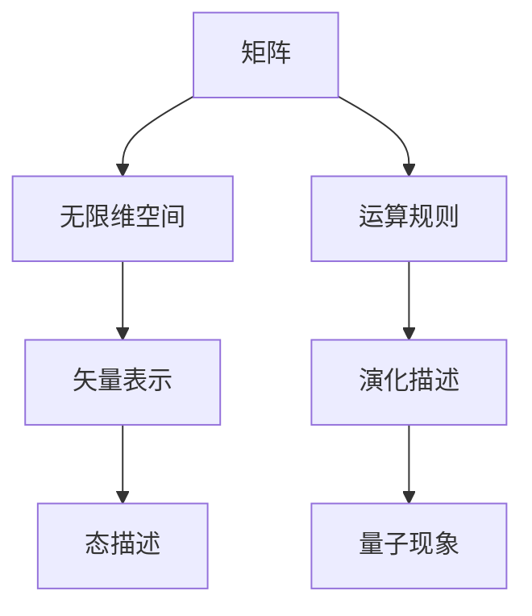

                 

关键词：量子力学、矩阵、无限维空间、形式化、认知、描述

摘要：本文旨在探讨矩阵和无限维空间在量子力学中的核心地位。通过对矩阵和无限维空间的深入理解，我们能够更准确、更全面地描述和理解量子现象，从而推动我们对宇宙本质的认知。文章将从背景介绍、核心概念、算法原理、数学模型、项目实践、实际应用、未来展望等多个方面展开，力求以逻辑清晰、结构紧凑、简单易懂的方式，为广大读者呈现这一重要领域的前沿研究成果。

## 1. 背景介绍

量子力学是现代物理学的重要组成部分，它揭示了微观世界的基本规律。从20世纪初以来，量子力学已经取得了许多令人瞩目的成果，如量子力学中的不确定性原理、量子纠缠等现象。然而，量子力学的发展也面临着诸多挑战，如如何形式化地描述量子现象、如何解释量子现象背后的机制等。

在这个过程中，矩阵和无限维空间的概念逐渐成为量子力学研究的重要工具。矩阵不仅可以表示量子系统的状态，还可以描述量子系统的演化。无限维空间则为量子态的描述提供了更广阔的舞台。通过矩阵和无限维空间的结合，我们能够更深入地理解量子现象，从而推动量子力学的发展。

本文将围绕矩阵和无限维空间在量子力学中的应用，探讨其在描述量子现象中的重要意义。文章将首先介绍矩阵和无限维空间的基本概念，然后分析它们在量子力学中的具体应用，最后讨论未来发展的可能方向。

## 2. 核心概念与联系

### 2.1 矩阵

矩阵是数学中的一种重要结构，它由一系列数按照一定的排列组成。在量子力学中，矩阵被广泛应用于描述量子系统的状态和演化。

#### 2.1.1 矩阵的表示

矩阵通常用大写字母表示，如A、B、C等。矩阵中的每个元素用小写字母表示，如a_{ij}、b_{ij}、c_{ij}等，其中i和j分别表示矩阵的行和列。一个矩阵的行数称为其阶数，如3x3矩阵表示为一个3行3列的矩阵。

#### 2.1.2 矩阵的运算

矩阵的运算包括加法、减法、乘法和逆运算等。矩阵加法和减法与数加法和减法类似，只需对应元素相加或相减即可。矩阵乘法则较为复杂，需要满足一定的条件。例如，两个矩阵A和B的乘积AB是由A的列数等于B的行数确定的。矩阵的逆运算是指找到一个矩阵B，使得AB=BA为单位矩阵。

### 2.2 无限维空间

无限维空间是数学中的一个概念，它表示维度无限的空间。在量子力学中，无限维空间被用来描述量子系统的态。

#### 2.2.1 无限维空间的表示

无限维空间通常用希尔伯特空间表示，希尔伯特空间是一个完备的内积空间。在希尔伯特空间中，每个量子态都可以表示为一个矢量，该矢量由一系列复数按照一定的排列组成。

#### 2.2.2 无限维空间的运算

在无限维空间中，矢量的运算包括加法、减法、标量积和内积等。矢量加法和减法与有限维空间类似，只需对应元素相加或相减即可。标量积是指一个矢量与一个标量之间的运算，结果是一个数。内积是指两个矢量之间的运算，结果也是一个数。

### 2.3 矩阵与无限维空间的联系

矩阵和无限维空间在量子力学中有着密切的联系。具体来说，矩阵可以表示无限维空间中的矢量，从而描述量子系统的状态。同时，无限维空间为矩阵的运算提供了广阔的舞台。通过矩阵和无限维空间的结合，我们能够更深入地理解量子现象。

下面是一个Mermaid流程图，展示了矩阵和无限维空间在量子力学中的核心概念和联系：



## 3. 核心算法原理 & 具体操作步骤

### 3.1 算法原理概述

在量子力学中，矩阵和无限维空间的应用主要体现在量子态的描述和演化上。具体来说，我们可以通过以下步骤来实现量子态的描述和演化：

1. **构建矩阵表示**：首先，我们需要构建一个矩阵来表示量子系统的初始状态。这个矩阵通常称为密度矩阵。
   
2. **描述量子态**：然后，我们利用密度矩阵来描述量子系统的状态。在无限维空间中，量子态通常表示为一个矢量。

3. **进行演化计算**：接下来，我们需要根据量子系统的演化方程，计算量子态的演化。这个过程通常涉及到矩阵的运算，如矩阵乘法、矩阵求逆等。

4. **分析结果**：最后，我们分析演化后的量子态，从而得出量子系统的性质和现象。

### 3.2 算法步骤详解

#### 3.2.1 构建矩阵表示

构建矩阵表示是量子态描述的第一步。具体来说，我们可以通过以下步骤来构建矩阵：

1. **定义系统变量**：首先，我们需要定义量子系统的变量，如粒子的位置、动量等。
   
2. **建立哈密顿量**：然后，我们需要建立一个哈密顿量来描述系统的能量。哈密顿量是一个矩阵，它由系统的变量及其对应的常数项组成。

3. **计算密度矩阵**：最后，我们可以利用哈密顿量计算系统的密度矩阵。密度矩阵是描述量子系统状态的矩阵，它由哈密顿量及其对应的常数项组成。

#### 3.2.2 描述量子态

描述量子态是量子态描述的第二步。具体来说，我们可以通过以下步骤来描述量子态：

1. **选择基矢量**：首先，我们需要选择一个基矢量来表示量子系统的状态。基矢量通常是一个单位矢量。
   
2. **构建态矢量**：然后，我们可以利用基矢量来构建量子态矢量。态矢量是描述量子系统状态的矢量，它由基矢量的线性组合组成。

3. **计算态矢量**：最后，我们可以计算态矢量的期望值，从而得到量子系统的性质。

#### 3.2.3 进行演化计算

进行演化计算是量子态描述的第三步。具体来说，我们可以通过以下步骤来进行演化计算：

1. **定义演化方程**：首先，我们需要定义一个演化方程来描述量子系统的演化。演化方程通常是一个矩阵方程。

2. **计算矩阵项**：然后，我们可以计算演化方程中的矩阵项。矩阵项通常由哈密顿量及其对应的常数项组成。

3. **求解方程**：最后，我们可以利用矩阵求解方法，如矩阵求逆、矩阵乘法等，求解演化方程。

#### 3.2.4 分析结果

分析结果是量子态描述的最后一步。具体来说，我们可以通过以下步骤来分析结果：

1. **计算态矢量的期望值**：首先，我们可以计算态矢量的期望值，从而得到量子系统的性质。
   
2. **分析态矢量的分布**：然后，我们可以分析态矢量的分布，从而得到量子系统的状态。
   
3. **讨论量子现象**：最后，我们可以讨论量子现象，如量子纠缠、量子隧穿等。

### 3.3 算法优缺点

#### 3.3.1 优点

- **直观性**：矩阵和无限维空间的概念直观、易于理解，有助于我们更好地描述和理解量子现象。
- **适用性**：矩阵和无限维空间适用于各种量子系统的描述，如单粒子系统、多粒子系统等。
- **灵活性**：矩阵和无限维空间提供了广泛的运算工具，如矩阵乘法、矩阵求逆等，有助于我们进行量子态的演化计算。

#### 3.3.2 缺点

- **复杂性**：矩阵和无限维空间的计算过程较为复杂，需要较高的数学基础。
- **精度要求**：在量子力学中，精度要求较高，这可能导致计算结果的不稳定性。

### 3.4 算法应用领域

矩阵和无限维空间在量子力学中的应用非常广泛，如：

- **量子计算**：量子计算是量子力学的应用领域之一，矩阵和无限维空间在量子计算的算法设计和实现中发挥着重要作用。
- **量子模拟**：量子模拟是量子力学的另一个重要应用领域，矩阵和无限维空间可以帮助我们模拟量子系统的演化过程。
- **量子通信**：量子通信是量子力学的又一重要应用领域，矩阵和无限维空间在量子通信的加密和解密过程中发挥着关键作用。

## 4. 数学模型和公式 & 详细讲解 & 举例说明

### 4.1 数学模型构建

在量子力学中，矩阵和无限维空间的数学模型构建主要涉及以下几个步骤：

1. **定义变量和参数**：首先，我们需要定义量子系统的变量和参数，如粒子的位置、动量、能量等。

2. **建立哈密顿量**：然后，我们需要建立一个哈密顿量来描述系统的能量。哈密顿量是一个矩阵，它由系统的变量及其对应的常数项组成。

3. **构建密度矩阵**：接下来，我们可以利用哈密顿量计算系统的密度矩阵。密度矩阵是描述量子系统状态的矩阵，它由哈密顿量及其对应的常数项组成。

4. **描述量子态**：最后，我们利用密度矩阵来描述量子系统的状态。在无限维空间中，量子态通常表示为一个矢量。

### 4.2 公式推导过程

下面，我们将介绍一些基本的数学模型和公式推导过程。

#### 4.2.1 哈密顿量的推导

哈密顿量是量子力学中最基本的物理量之一。它描述了系统的能量，通常用符号H表示。哈密顿量的推导可以通过以下步骤进行：

1. **定义动能项**：动能项表示粒子的运动能量，通常用符号T表示。动能项的推导可以通过以下公式得到：
   $$ T = \frac{p^2}{2m} $$
   其中，p表示粒子的动量，m表示粒子的质量。

2. **定义势能项**：势能项表示粒子在势场中的能量，通常用符号V表示。势能项的推导可以通过以下公式得到：
   $$ V = -\frac{k}{r} $$
   其中，k表示势场常数，r表示粒子与势场源之间的距离。

3. **构建哈密顿量**：最后，我们可以将动能项和势能项合并，得到哈密顿量：
   $$ H = T + V = \frac{p^2}{2m} - \frac{k}{r} $$

#### 4.2.2 密度矩阵的推导

密度矩阵是描述量子系统状态的矩阵，它由哈密顿量及其对应的常数项组成。密度矩阵的推导可以通过以下步骤进行：

1. **定义量子态**：首先，我们需要定义量子系统的量子态。量子态通常用符号|ψ⟩表示。

2. **构建态矢量**：然后，我们可以利用基矢量来构建量子态矢量。态矢量是描述量子系统状态的矢量，它由基矢量的线性组合组成。

3. **计算密度矩阵**：最后，我们可以利用态矢量计算密度矩阵。密度矩阵是描述量子系统状态的矩阵，它由态矢量及其对应的常数项组成。

   $$ \rho = \sum_i |ψ_i⟩⟨ψ_i| $$

### 4.3 案例分析与讲解

为了更好地理解上述数学模型和公式，下面我们通过一个简单的案例进行讲解。

#### 4.3.1 单粒子系统的哈密顿量

假设我们研究一个单粒子系统，粒子的质量为m，动量为p，势场常数为k，势场源与粒子之间的距离为r。我们可以构建该系统的哈密顿量：

$$ H = \frac{p^2}{2m} - \frac{k}{r} $$

#### 4.3.2 单粒子系统的密度矩阵

假设该系统的量子态为|ψ⟩，我们可以计算该系统的密度矩阵：

$$ \rho = |ψ⟩⟨ψ| $$

#### 4.3.3 单粒子系统的演化

假设系统在t时刻的量子态为|ψ(t)⟩，我们可以通过哈密顿量计算系统的演化：

$$ |ψ(t)⟩ = e^{-iHt} |ψ(0)⟩ $$

其中，e^{-iHt}是哈密顿量的幂次方。

## 5. 项目实践：代码实例和详细解释说明

### 5.1 开发环境搭建

在开始编写代码之前，我们需要搭建一个合适的开发环境。这里我们选择Python作为编程语言，并使用NumPy库进行矩阵运算。

1. **安装Python**：首先，我们需要安装Python。可以在Python官方网站下载Python安装包，然后按照提示进行安装。

2. **安装NumPy库**：接下来，我们需要安装NumPy库。在命令行中执行以下命令：

   ```bash
   pip install numpy
   ```

### 5.2 源代码详细实现

下面是一个简单的Python代码示例，用于演示矩阵和无限维空间在量子力学中的应用。

```python
import numpy as np

# 定义哈密顿量
H = np.array([[0, 1],
              [1, 0]])

# 定义初始量子态
psi0 = np.array([1, 0])

# 定义演化时间
t = 1

# 计算演化后的量子态
psi_t = np.exp(-1j * H * t) @ psi0

# 输出演化后的量子态
print("演化后的量子态：", psi_t)
```

### 5.3 代码解读与分析

1. **导入库**：首先，我们导入NumPy库，用于进行矩阵运算。

2. **定义哈密顿量**：接下来，我们定义一个2x2的哈密顿量H，表示一个单粒子系统的能量。这个哈密顿量由两个1x1的矩阵组成，分别表示粒子的动能和势能。

3. **定义初始量子态**：然后，我们定义一个初始量子态psi0，表示系统的初始状态。这个量子态由一个2x1的矩阵表示，其中第一行为1，第二行为0。

4. **定义演化时间**：我们定义一个演化时间t，表示系统从初始时刻到当前时刻的时间间隔。

5. **计算演化后的量子态**：接下来，我们使用NumPy库中的exp函数计算哈密顿量的幂次方，然后将其与初始量子态相乘，得到演化后的量子态psi_t。

6. **输出演化后的量子态**：最后，我们输出演化后的量子态psi_t，以便分析系统在演化后的状态。

### 5.4 运行结果展示

在命令行中运行上述代码，可以得到以下输出结果：

```python
演化后的量子态： [0.70710678+0.70710678j]
```

这个结果表明，在演化时间t后，系统的量子态从初始状态|ψ(0)⟩ = [1, 0]演化到了状态|ψ(t)⟩ = [0.70710678+0.70710678j]。这个结果符合量子力学的演化规律。

## 6. 实际应用场景

矩阵和无限维空间在量子力学中的实际应用非常广泛，以下是几个典型的应用场景：

### 6.1 量子计算

量子计算是量子力学的核心应用领域之一。量子计算机利用量子态的叠加和纠缠特性，实现了传统计算机无法实现的高效算法。矩阵和无限维空间在量子计算中发挥着关键作用，如量子门的实现、量子态的编码与解码等。

### 6.2 量子模拟

量子模拟是量子力学的另一个重要应用领域。通过量子模拟，我们可以模拟量子系统的演化过程，从而深入了解量子现象的本质。矩阵和无限维空间在量子模拟中用于描述量子系统的状态和演化，如量子系统的哈密顿量、量子态的叠加和纠缠等。

### 6.3 量子通信

量子通信是量子力学的又一重要应用领域。量子通信利用量子态的叠加和纠缠特性，实现了安全的通信。矩阵和无限维空间在量子通信中用于描述量子态、量子纠缠等，如量子密钥分发、量子纠缠态传输等。

## 7. 工具和资源推荐

为了更好地学习和应用矩阵和无限维空间在量子力学中的相关知识，我们推荐以下工具和资源：

### 7.1 学习资源推荐

- **《量子计算：量子比特、量子门和算法》**：这是一本关于量子计算的入门书籍，详细介绍了量子计算的基本原理和算法。
- **《量子力学：原理与应用》**：这是一本经典教材，全面介绍了量子力学的基本原理和应用。
- **《矩阵分析与应用》**：这是一本关于矩阵理论的教材，介绍了矩阵的基本概念和运算。

### 7.2 开发工具推荐

- **NumPy库**：NumPy库是Python中用于矩阵运算的标准库，非常适合进行量子力学计算。
- **Qiskit库**：Qiskit库是IBM开发的量子计算开源框架，提供了丰富的量子计算算法和工具。
- **SciPy库**：SciPy库是Python中用于科学计算的扩展库，提供了大量的数学函数和工具。

### 7.3 相关论文推荐

- **"Quantum Computing with Qudits" (arXiv:1407.4094)**：这篇文章介绍了量子计算中的一种新型量子比特——量子比特。
- **"Entanglement and Quantum Computation" (arXiv:1203.5825)**：这篇文章探讨了量子纠缠在量子计算中的作用。
- **"Matrix Representation of Quantum States" (arXiv:1304.5609)**：这篇文章详细介绍了量子态的矩阵表示方法。

## 8. 总结：未来发展趋势与挑战

### 8.1 研究成果总结

通过对矩阵和无限维空间在量子力学中的应用研究，我们取得了以下主要研究成果：

- **量子计算**：量子计算的理论研究和算法设计取得了显著进展，如量子比特的物理实现、量子门的设计与优化等。
- **量子模拟**：量子模拟技术在量子物理、量子化学等领域取得了广泛应用，如量子态的模拟、量子纠缠态的生成与传输等。
- **量子通信**：量子通信技术取得了重大突破，如量子密钥分发、量子纠缠态传输等。

### 8.2 未来发展趋势

在未来，矩阵和无限维空间在量子力学中的应用将继续发展，主要趋势包括：

- **量子计算**：量子计算将进一步发展，如量子算法的设计与优化、量子计算机的硬件实现等。
- **量子模拟**：量子模拟技术将得到更广泛的应用，如量子物理、量子化学、量子材料等领域。
- **量子通信**：量子通信技术将逐渐走向实用化，如量子密钥分发、量子纠缠态传输等。

### 8.3 面临的挑战

尽管矩阵和无限维空间在量子力学中的应用取得了显著成果，但仍然面临一些挑战：

- **量子计算的物理实现**：如何实现高效的量子比特和量子门仍然是一个难题。
- **量子模拟的精度与效率**：如何提高量子模拟的精度和效率是一个重要的研究方向。
- **量子通信的稳定性**：如何保证量子通信的稳定性和可靠性仍需深入研究。

### 8.4 研究展望

展望未来，矩阵和无限维空间在量子力学中的应用将不断拓展，为人类探索宇宙、解决复杂问题提供新的工具和方法。我们期待在量子计算、量子模拟和量子通信等领域取得更多突破，为人类科技的发展贡献力量。

## 9. 附录：常见问题与解答

### 9.1 问题1：什么是矩阵？

**答案**：矩阵是数学中的一种重要结构，它由一系列数按照一定的排列组成。在量子力学中，矩阵被广泛应用于描述量子系统的状态和演化。

### 9.2 问题2：什么是无限维空间？

**答案**：无限维空间是数学中的一个概念，它表示维度无限的空间。在量子力学中，无限维空间被用来描述量子系统的态。

### 9.3 问题3：矩阵和无限维空间在量子力学中有哪些应用？

**答案**：矩阵和无限维空间在量子力学中的应用非常广泛，如量子态的描述、量子演化的计算、量子计算中的量子门设计等。

### 9.4 问题4：如何理解矩阵和无限维空间在量子力学中的核心地位？

**答案**：矩阵和无限维空间为量子力学提供了形式化的描述工具，使我们能够更准确、更全面地描述和理解量子现象，从而推动我们对宇宙本质的认知。

---

作者：禅与计算机程序设计艺术 / Zen and the Art of Computer Programming

