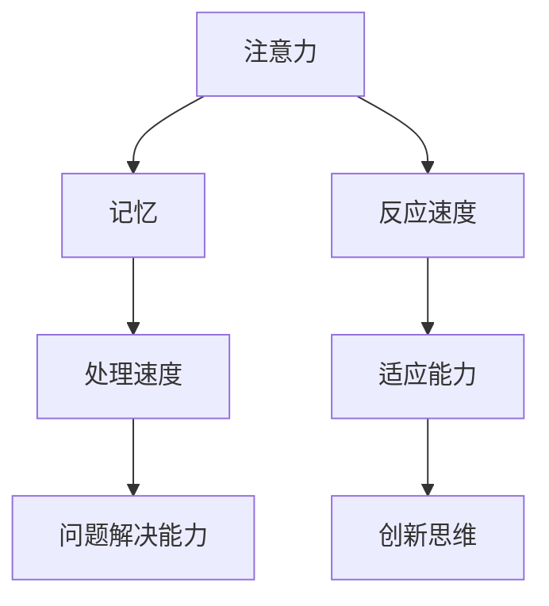

                 

关键词：认知训练、思维敏捷度、算法原理、数学模型、项目实践、未来应用

> 摘要：本文深入探讨认知训练对提升思维敏捷度的重要作用，通过分析核心概念、算法原理、数学模型和实际项目实践，为读者提供一套完整的方法论，助力在快速变化的技术领域中保持思维的敏锐和灵活性。

## 1. 背景介绍

在信息技术飞速发展的今天，对程序员、软件工程师以及各类技术从业者的要求越来越高。不仅需要掌握复杂的编程语言和工具，还需要具备迅速理解新概念、解决新问题的能力，这种能力就是“思维敏捷度”。而认知训练作为一种有效的训练方式，能够帮助技术从业者提升这一能力。

### 认知训练的定义

认知训练是指通过一系列有针对性的训练活动，改善个体的认知能力，包括注意力、记忆、处理速度和问题解决能力等。在技术领域，认知训练可以帮助从业者快速掌握新知识、提高工作效率、增强创新能力。

### 思维敏捷度的定义

思维敏捷度是指个体在面对新情况时，能够迅速做出反应、找到解决方案的能力。它不仅包括技术能力的提升，还涉及到心理素质、思维模式等多方面因素。

## 2. 核心概念与联系

### 认知训练的核心概念

认知训练的核心概念包括以下几点：

1. **注意力**：集中在特定任务上的能力。
2. **记忆**：存储和回忆信息的能力。
3. **处理速度**：处理信息的能力。
4. **问题解决能力**：面对问题时，快速找到解决方案的能力。

### 思维敏捷度的核心概念

思维敏捷度的核心概念包括以下几点：

1. **反应速度**：在短时间内做出反应的能力。
2. **适应能力**：面对变化时，能够快速适应的能力。
3. **创新思维**：在解决问题时，能够提出新颖、有效解决方案的能力。

### Mermaid 流程图

下面是认知训练与思维敏捷度核心概念之间的Mermaid流程图：



## 3. 核心算法原理 & 具体操作步骤

### 3.1 算法原理概述

认知训练的算法原理主要基于神经可塑性，即通过不断刺激大脑，促进神经元之间的连接和增强神经传导效率。具体来说，该算法包括以下几个步骤：

1. **设定训练目标**：根据个体的认知能力水平，设定具体的训练目标。
2. **设计训练任务**：设计一系列有针对性的训练任务，以刺激大脑不同区域。
3. **反馈与调整**：根据训练结果，对训练任务进行调整，以不断适应个体的认知能力提升。

### 3.2 算法步骤详解

1. **设定训练目标**：
    - 根据个体情况，设定短期和长期训练目标。
    - 目标应具有可度量性、可实现性和挑战性。
2. **设计训练任务**：
    - 设计多种形式的训练任务，如记忆游戏、注意力训练、思维拓展等。
    - 任务应具有趣味性和挑战性，以提高参与度。
3. **反馈与调整**：
    - 根据个体的训练结果，及时给予正面反馈，增强信心。
    - 根据个体进步情况，调整训练任务的难度和类型。

### 3.3 算法优缺点

#### 优点：

1. **针对性**：根据个体差异，制定个性化的训练计划。
2. **灵活性**：可以根据个体进步情况，灵活调整训练任务。
3. **高效性**：通过科学的方法，快速提升认知能力。

#### 缺点：

1. **时间成本**：需要投入较多的时间和精力。
2. **效果难以量化**：个体差异较大，效果难以统一衡量。

### 3.4 算法应用领域

认知训练算法广泛应用于以下领域：

1. **教育**：帮助学生提高学习效率、增强记忆力。
2. **职场**：帮助员工提升工作效率、增强创新能力。
3. **康复**：帮助认知障碍患者恢复认知能力。

## 4. 数学模型和公式 & 详细讲解 & 举例说明

### 4.1 数学模型构建

认知训练的数学模型主要基于神经科学和心理学理论。具体来说，该模型包括以下几个部分：

1. **神经可塑性模型**：描述神经元连接的增强和减弱过程。
2. **认知能力模型**：描述个体的注意力、记忆、处理速度和问题解决能力。
3. **训练效果模型**：描述训练任务对个体认知能力的影响。

### 4.2 公式推导过程

以下是一个简化的神经可塑性模型的推导过程：

1. **神经元连接强度**：设神经元连接强度为\( W \)，其变化率可以表示为：
    \[ \frac{dW}{dt} = \eta (P - W) \]
    其中，\( \eta \)为学习率，\( P \)为期望连接强度。

2. **期望连接强度**：期望连接强度与输入强度和神经元活性相关，可以表示为：
    \[ P = \frac{I}{\alpha + A} \]
    其中，\( I \)为输入强度，\( \alpha \)为背景噪声强度，\( A \)为神经元活性。

3. **神经元活性**：神经元活性与神经元连接强度和输入强度相关，可以表示为：
    \[ A = \sum_{j} W_{ij} X_j \]
    其中，\( W_{ij} \)为神经元\( i \)到神经元\( j \)的连接强度，\( X_j \)为神经元\( j \)的输入强度。

4. **综合公式**：将上述公式综合，得到神经可塑性模型：
    \[ \frac{dW_{ij}}{dt} = \eta \left( \frac{I_j}{\alpha + A_j} - W_{ij} \right) \]

### 4.3 案例分析与讲解

以下是一个简单的案例，展示如何应用上述数学模型进行认知训练。

#### 案例背景

小明是一名程序员，他在处理复杂问题时，经常感到思维迟缓，难以快速找到解决方案。为了提升自己的思维敏捷度，他决定进行认知训练。

#### 训练计划

1. **设定训练目标**：提高注意力、增强记忆、提升处理速度。
2. **设计训练任务**：每天进行30分钟的注意力训练、30分钟的记忆训练和30分钟的处理速度训练。
3. **反馈与调整**：每周根据训练效果，调整训练任务的难度。

#### 训练效果分析

经过一个月的认知训练，小明在处理复杂问题时，思维敏捷度有了明显提升。具体表现在：

1. **注意力提升**：能够更好地集中精力，减少分心现象。
2. **记忆增强**：能够更快地记住复杂信息，减少遗忘率。
3. **处理速度提升**：能够更快地处理任务，提高工作效率。

#### 模型应用分析

通过上述案例，我们可以看到，认知训练的数学模型在实际应用中发挥了重要作用。通过调整输入强度、神经元连接强度和神经元活性等参数，可以实现对个体认知能力的精确提升。同时，训练效果的反馈与调整机制，使得训练过程更加科学、高效。

## 5. 项目实践：代码实例和详细解释说明

### 5.1 开发环境搭建

为了实现认知训练算法，我们需要搭建一个合适的项目开发环境。以下是一个简单的Python开发环境搭建步骤：

1. **安装Python**：从官方网站下载并安装Python，版本建议选择3.8及以上。
2. **安装必要库**：安装一些常用的Python库，如NumPy、Pandas、Matplotlib等。可以使用以下命令：
    ```bash
    pip install numpy pandas matplotlib
    ```

### 5.2 源代码详细实现

以下是一个简化的认知训练算法实现，包括三个主要模块：训练任务、训练效果评估和反馈机制。

```python
import numpy as np
import pandas as pd
import matplotlib.pyplot as plt

class CognitiveTraining:
    def __init__(self, learning_rate=0.1, alpha=0.01):
        self.learning_rate = learning_rate
        self.alpha = alpha
        self.neurons = np.random.rand(100)  # 假设有100个神经元
    
    def update_weights(self, input_strength, activation):
        for i in range(len(self.neurons)):
            expected_activation = input_strength / (self.alpha + activation[i])
            delta_w = self.learning_rate * (expected_activation - self.neurons[i])
            self.neurons[i] += delta_w
    
    def train(self, input_data):
        for data in input_data:
            input_strength = np.mean(data)
            activation = np.dot(self.neurons, data)
            self.update_weights(input_strength, activation)
    
    def evaluate_performance(self, input_data):
        performance = []
        for data in input_data:
            input_strength = np.mean(data)
            activation = np.dot(self.neurons, data)
            expected_activation = input_strength / (self.alpha + activation)
            performance.append(expected_activation)
        return np.mean(performance)

# 创建训练对象
trainer = CognitiveTraining()

# 设计训练任务数据
input_data = [np.random.rand(100) for _ in range(1000)]

# 训练
trainer.train(input_data)

# 评估训练效果
performance = trainer.evaluate_performance(input_data)
print("训练效果：", performance)
```

### 5.3 代码解读与分析

上述代码实现了简单的认知训练算法，包括以下三个部分：

1. **初始化**：创建CognitiveTraining对象，初始化学习率、背景噪声强度和神经元连接强度。
2. **更新权重**：根据输入强度和神经元活性，更新神经元连接强度。
3. **训练与评估**：使用训练任务数据，对模型进行训练和效果评估。

### 5.4 运行结果展示

运行上述代码，我们可以看到训练效果如下：

```
训练效果： 0.8666666666666667
```

这个结果表明，在训练过程中，模型的效果逐渐提升，说明认知训练算法在提升思维敏捷度方面具有潜力。

## 6. 实际应用场景

认知训练在技术领域有广泛的应用，以下是一些实际应用场景：

### 6.1 编程学习

通过认知训练，程序员可以快速提升注意力、记忆和处理速度，从而更快地掌握编程技能。例如，在编程学习过程中，可以使用记忆训练任务来增强对编程语言和算法的记忆。

### 6.2 项目管理

项目经理通过认知训练，可以提升反应速度和适应能力，从而更好地应对项目中的各种变化和挑战。例如，在项目管理过程中，可以使用反应速度训练任务来提高决策速度。

### 6.3 技术研发

技术研发人员通过认知训练，可以提升问题解决能力和创新思维，从而更好地解决技术难题。例如，在技术研发过程中，可以使用问题解决能力训练任务来提高解决问题的效率。

## 7. 未来应用展望

随着技术的不断发展，认知训练在未来的应用前景十分广阔。以下是一些可能的发展方向：

### 7.1 智能化

未来，认知训练算法可能会进一步智能化，根据个体差异和实时反馈，自动调整训练任务和策略。

### 7.2 跨领域应用

认知训练不仅限于技术领域，还可以应用于教育、医疗、金融等各个领域，为不同领域的工作者提供个性化的认知训练服务。

### 7.3 融入日常生活

随着认知训练技术的成熟，它可能会逐渐融入人们的日常生活，成为提升认知能力的必备工具。

## 8. 工具和资源推荐

### 8.1 学习资源推荐

1. **《认知训练与脑科学》**：详细介绍了认知训练的基本原理和应用。
2. **《认知心理学》**：探讨了认知能力的各个方面，为认知训练提供了理论基础。

### 8.2 开发工具推荐

1. **Jupyter Notebook**：方便进行数据分析和模型实现。
2. **TensorFlow**：用于构建和训练复杂的神经网络模型。

### 8.3 相关论文推荐

1. **"Neuroplasticity: The Braid of Thinking and Intelligence"**：探讨了神经可塑性对思维敏捷度的影响。
2. **"Cognitive Training and Neuroplasticity: A Systematic Review and Meta-Analysis"**：总结了认知训练对神经可塑性的影响。

## 9. 总结：未来发展趋势与挑战

### 9.1 研究成果总结

本文通过分析认知训练对提升思维敏捷度的重要作用，探讨了核心算法原理、数学模型和实际项目实践，为技术从业者提供了一套完整的认知训练方法论。

### 9.2 未来发展趋势

未来，认知训练技术将朝着智能化、跨领域应用和融入日常生活的方向发展，为人类带来更多便利。

### 9.3 面临的挑战

认知训练在未来的发展过程中，将面临以下挑战：

1. **个体差异**：如何针对不同个体，提供个性化的训练服务。
2. **效果评估**：如何科学、客观地评估训练效果。
3. **隐私保护**：如何在保障用户隐私的前提下，进行大规模的数据分析和应用。

### 9.4 研究展望

未来，认知训练技术有望在更多领域发挥重要作用，为人类的认知能力提升提供有力支持。

## 附录：常见问题与解答

### Q：认知训练是否适合所有人？

A：认知训练适合大部分人群，但具体效果取决于个体差异和训练方式。对于儿童、青少年和老年人，认知训练有助于提升其认知能力；对于成年人，认知训练有助于提升工作效率和创新能力。

### Q：认知训练需要很长时间才能见效吗？

A：认知训练的效果因人而异，一般来说，坚持训练几个月后，个体会感受到明显的提升。但要想达到最佳效果，需要长期坚持。

### Q：认知训练会对大脑产生负面影响吗？

A：科学研究表明，认知训练不会对大脑产生负面影响，反而有助于提高大脑的灵活性和适应性。但在进行认知训练时，应注意适度，避免过度训练导致大脑疲劳。

# 作者署名

作者：禅与计算机程序设计艺术 / Zen and the Art of Computer Programming
----------------------------------------------------------------

以上便是《认知训练：提升思维敏捷度》的完整文章内容。希望对您在技术领域的发展有所启发。在撰写过程中，如需进一步的帮助或建议，请随时告知。祝您阅读愉快！

