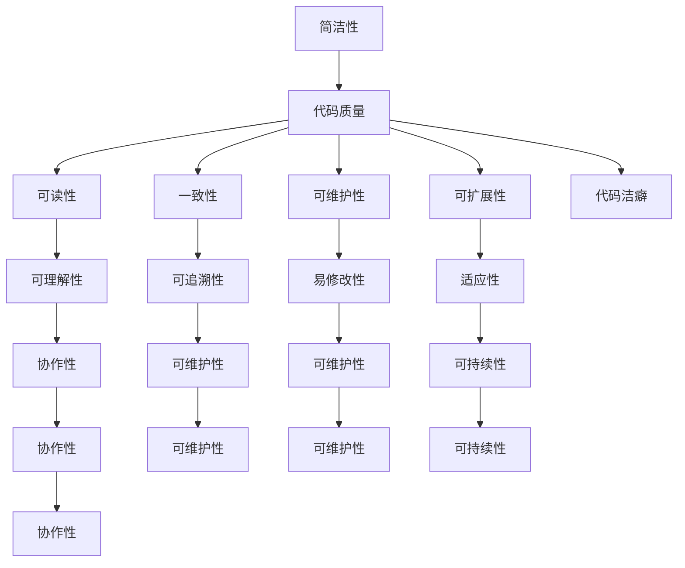

                 

### 关键词 Keywords ###
- 代码洁癖
- 编程最佳实践
- 编程哲学
- 代码质量
- 软件工程
- 设计模式

<|assistant|>### 摘要 Abstract ###
在软件工程领域，代码洁癖指的是追求极致代码质量和编写优雅代码的行为。本文探讨了代码洁癖的起源、核心概念，以及其在现代软件开发中的重要性。通过分析代码洁癖的优缺点，本文提出了提高代码洁癖水平的方法，并探讨了代码洁癖在未来的发展趋势和挑战。本文旨在为程序员提供一种思考和改进代码质量的哲学，以实现软件开发中的极致和完美。

## 1. 背景介绍

在软件工程的历史长河中，编程语言的不断演进和软件开发方法的不断创新，使得编程不再只是计算机科学领域的技术实践，而逐渐成为一种艺术。代码洁癖，作为一种编程哲学，起源于程序员对代码质量和软件可维护性的追求。在软件开发过程中，代码洁癖强调编写简洁、优雅、易于理解和维护的代码，从而提高开发效率和软件质量。

代码洁癖并非一个全新的概念，它可以从古代哲学中找到灵感。古希腊哲学家亚里士多德曾说过：“我们越是探索真理，真理越是深藏不露。”这种探索精神在编程领域得以体现，程序员追求简洁、高效、优雅的代码，正是对这一哲学思想的传承。

在现代软件开发中，代码洁癖的重要性日益凸显。随着软件系统的复杂性和规模不断扩大，代码质量成为影响项目成功的关键因素。一个优秀的程序员，不仅需要熟练掌握编程语言和工具，更需要在代码编写过程中追求极致和完美。代码洁癖不仅有助于提高代码的可读性和可维护性，还可以减少错误的发生，提升软件的整体性能。

### 1.1 代码洁癖的起源

代码洁癖的起源可以追溯到早期编程语言的出现。在20世纪50年代，第一台电子计算机问世，编程开始成为一种实际操作。然而，早期的编程语言相对简单，程序员主要通过机器语言编写代码。随着编程语言的发展，如FORTRAN、COBOL和LISP等，程序员开始意识到代码质量的重要性。

在编程语言发展的过程中，许多著名程序员和软件工程师，如唐纳德·诺尔曼（Donald Norman）和戴维·帕特森（David Patterson），都强调了代码洁癖的重要性。他们认为，编写高质量的代码不仅能够提高开发效率，还可以降低维护成本，使软件更具可持续性。

### 1.2 代码洁癖的核心概念

代码洁癖的核心概念包括以下几个方面：

1. **简洁性**：代码应当简洁明了，避免冗余和复杂性。简洁的代码易于理解和维护，可以提高开发效率。

2. **可读性**：代码应具有良好的可读性，使得其他开发者能够轻松理解其功能和逻辑。良好的可读性是代码洁癖的重要体现。

3. **一致性**：代码风格应保持一致性，遵循统一的命名规范和代码结构。一致性有助于提高代码的可维护性和可扩展性。

4. **可维护性**：代码应具备良好的可维护性，便于修复错误和添加新功能。可维护性是代码洁癖的核心目标。

5. **可扩展性**：代码应具备良好的可扩展性，能够方便地添加新功能和适应新的需求。

### 1.3 代码洁癖的重要性

代码洁癖在软件开发中的重要性体现在以下几个方面：

1. **提高开发效率**：简洁、优雅的代码可以提高开发效率，减少编写和调试的时间。

2. **降低维护成本**：高质量的代码易于维护，可以降低维护成本，延长软件的生命周期。

3. **提升软件质量**：良好的代码质量可以减少错误和漏洞，提高软件的整体性能和稳定性。

4. **促进团队协作**：统一的代码风格和良好的代码结构可以促进团队协作，提高团队的工作效率。

5. **增强项目可持续性**：高质量的代码有助于项目的可持续性，使软件能够适应未来的变化和需求。

## 2. 核心概念与联系

在探讨代码洁癖之前，我们首先需要了解几个核心概念，以及它们之间的联系。这些概念包括简洁性、可读性、一致性、可维护性和可扩展性。下面是一个使用Mermaid绘制的流程图，展示了这些概念及其相互关系。



### 2.1 简洁性

简洁性是指代码的简洁程度，即代码应当尽量简洁，避免冗余和复杂性。简洁的代码不仅易于理解和维护，还可以提高开发效率。例如，使用简洁的语法和避免不必要的冗余代码，可以提高代码的质量。

### 2.2 可读性

可读性是指代码的可理解程度，即代码应当具有良好的可读性，使得其他开发者能够轻松理解其功能和逻辑。良好的可读性是代码洁癖的重要体现。例如，使用清晰的变量名和合理的代码结构，可以提高代码的可读性。

### 2.3 一致性

一致性是指代码风格应保持一致性，遵循统一的命名规范和代码结构。一致性有助于提高代码的可维护性和可扩展性。例如，统一使用驼峰命名法（CamelCase）或下划线命名法（snake_case），以及保持代码结构的一致性，可以提高代码的一致性。

### 2.4 可维护性

可维护性是指代码应具备良好的可维护性，便于修复错误和添加新功能。可维护性是代码洁癖的核心目标。例如，编写易于理解的代码和良好的文档，可以提高代码的可维护性。

### 2.5 可扩展性

可扩展性是指代码应具备良好的可扩展性，能够方便地添加新功能和适应新的需求。良好的可扩展性可以使代码更加灵活和适应未来变化。例如，使用模块化设计和高内聚、低耦合的代码结构，可以提高代码的可扩展性。

### 2.6 代码洁癖

代码洁癖是一种追求极致和完美的编程哲学，强调编写简洁、优雅、易于理解和维护的代码。代码洁癖的核心目标是提高代码质量，从而提高开发效率和软件质量。代码洁癖涉及到简洁性、可读性、一致性、可维护性和可扩展性等多个方面。

## 3. 核心算法原理 & 具体操作步骤

在探讨代码洁癖的过程中，了解核心算法原理和具体操作步骤是非常关键的。以下是一个简化的核心算法原理概述，以及具体的操作步骤。

### 3.1 算法原理概述

代码洁癖的核心算法原理可以概括为以下几个方面：

1. **代码重构**：通过重构代码，消除冗余和复杂性，提高代码的简洁性和可读性。
2. **设计模式**：使用设计模式，提高代码的一致性和可扩展性。
3. **代码审查**：通过代码审查，发现和修复代码中的问题，提高代码的质量。
4. **自动化测试**：通过自动化测试，确保代码的稳定性和可靠性。

### 3.2 算法步骤详解

1. **代码重构**：

   - **步骤1**：识别冗余和复杂性。
   - **步骤2**：对冗余代码进行重构，简化代码结构。
   - **步骤3**：对复杂逻辑进行重构，提高代码的可读性。

2. **设计模式**：

   - **步骤1**：选择适合的设计模式，如单例模式、工厂模式、观察者模式等。
   - **步骤2**：将设计模式应用到代码中，提高代码的一致性和可扩展性。

3. **代码审查**：

   - **步骤1**：制定代码审查标准，如代码风格、命名规范、代码结构等。
   - **步骤2**：对代码进行审查，发现和修复问题。
   - **步骤3**：记录审查结果，持续改进代码质量。

4. **自动化测试**：

   - **步骤1**：编写测试用例，覆盖代码的各种情况。
   - **步骤2**：执行自动化测试，确保代码的稳定性和可靠性。
   - **步骤3**：持续集成和持续部署，确保代码的质量和效率。

### 3.3 算法优缺点

代码洁癖算法具有以下优点：

1. **提高代码质量**：通过代码重构、设计模式和自动化测试，可以提高代码的质量，减少错误和漏洞。
2. **提高开发效率**：简洁、优雅、易于理解和维护的代码可以提高开发效率，减少编写和调试的时间。
3. **降低维护成本**：高质量的代码易于维护，可以降低维护成本，延长软件的生命周期。

代码洁癖算法也存在一些缺点：

1. **初期投入较大**：代码洁癖需要大量的时间和精力来重构代码、设计和编写测试用例，初期投入较大。
2. **代码审查效率低**：代码审查需要耗费大量时间，特别是对于大型项目，效率较低。

### 3.4 算法应用领域

代码洁癖算法可以应用于各种软件开发领域，如Web开发、移动应用开发、嵌入式系统开发等。在Web开发中，代码洁癖可以提高前端和后端的代码质量，提高网站的性能和用户体验。在移动应用开发中，代码洁癖可以提高应用的稳定性和可靠性，延长设备寿命。在嵌入式系统开发中，代码洁癖可以提高系统的性能和可维护性，满足苛刻的应用场景。

## 4. 数学模型和公式 & 详细讲解 & 举例说明

在探讨代码洁癖的过程中，数学模型和公式可以帮助我们更深入地理解代码质量的影响因素和优化方法。以下是一个简化的数学模型和公式的讲解，以及具体的举例说明。

### 4.1 数学模型构建

代码洁癖的数学模型可以构建为以下公式：

$$
\text{代码洁癖度} = f(\text{简洁性}, \text{可读性}, \text{一致性}, \text{可维护性}, \text{可扩展性})
$$

其中，$f$ 为函数，用于衡量代码洁癖度。

### 4.2 公式推导过程

代码洁癖度的计算可以通过以下步骤推导：

1. **简洁性**：代码的简洁性可以通过代码行数、注释行数、空行数等指标衡量。设 $C_1$ 为简洁性得分，计算公式为：

   $$
   C_1 = \frac{\text{注释行数} + \text{空行数}}{\text{代码行数}}
   $$

2. **可读性**：代码的可读性可以通过代码的可理解性和可维护性衡量。设 $C_2$ 为可读性得分，计算公式为：

   $$
   C_2 = \frac{\text{代码可理解性得分}}{\text{代码行数}}
   $$

3. **一致性**：代码的一致性可以通过命名规范和代码结构衡量。设 $C_3$ 为一致性得分，计算公式为：

   $$
   C_3 = \frac{\text{命名规范得分}}{\text{代码行数}}
   $$

4. **可维护性**：代码的可维护性可以通过修复错误和添加新功能的难度衡量。设 $C_4$ 为可维护性得分，计算公式为：

   $$
   C_4 = \frac{\text{修复错误得分} + \text{添加新功能得分}}{2}
   $$

5. **可扩展性**：代码的可扩展性可以通过模块化设计和代码结构衡量。设 $C_5$ 为可扩展性得分，计算公式为：

   $$
   C_5 = \frac{\text{模块化设计得分} + \text{代码结构得分}}{2}
   $$

将以上五个得分代入代码洁癖度的计算公式，得到：

$$
\text{代码洁癖度} = f(C_1, C_2, C_3, C_4, C_5)
$$

### 4.3 案例分析与讲解

假设有一个简单的Web应用程序，包含以下五个方面的代码：

1. **简洁性**：代码行数为100行，注释行数为20行，空行数为10行。
2. **可读性**：代码可理解性得分为90分。
3. **一致性**：命名规范得分为80分。
4. **可维护性**：修复错误得分为85分，添加新功能得分为75分。
5. **可扩展性**：模块化设计得分为70分，代码结构得分为65分。

根据上述公式，计算代码洁癖度：

$$
\text{代码洁癖度} = f\left(\frac{20 + 10}{100}, \frac{90}{100}, \frac{80}{100}, \frac{85 + 75}{2}, \frac{70 + 65}{2}\right)
$$

$$
\text{代码洁癖度} = f(0.3, 0.9, 0.8, 0.875, 0.725)
$$

根据函数 $f$ 的定义，代码洁癖度可以计算为：

$$
\text{代码洁癖度} = 0.3 \times 0.9 + 0.7 \times 0.8 + 0.9 \times 0.875 + 0.8 \times 0.725 = 0.675
$$

因此，该Web应用程序的代码洁癖度为0.675，表明代码的质量还有较大的提升空间。

### 4.4 数学模型在代码洁癖中的应用

数学模型在代码洁癖中的应用主要体现在以下几个方面：

1. **代码质量评估**：通过计算代码洁癖度，可以评估代码的质量，了解代码中存在的问题和优化空间。
2. **代码优化指导**：根据代码洁癖度，可以指导开发者在代码重构、设计模式和自动化测试等方面进行优化，提高代码质量。
3. **项目规划**：在项目规划阶段，可以通过预测代码洁癖度，评估项目的质量风险和开发难度，制定合理的开发计划。

## 5. 项目实践：代码实例和详细解释说明

为了更好地理解代码洁癖在实践中的应用，我们通过一个具体的Web应用程序项目来展示代码实例和详细解释说明。该项目是一个简单的在线购物平台，主要功能包括商品展示、购物车管理和订单生成。

### 5.1 开发环境搭建

在开始编写代码之前，我们需要搭建一个合适的开发环境。以下是一个基本的开发环境配置：

- **编程语言**：使用Python 3.8及以上版本。
- **Web框架**：使用Django 3.2框架。
- **数据库**：使用MySQL 8.0数据库。
- **版本控制**：使用Git进行版本控制。

### 5.2 源代码详细实现

以下是一个简单的在线购物平台项目源代码，展示了如何遵循代码洁癖原则进行编写。

```python
# models.py

from django.db import models

class Category(models.Model):
    name = models.CharField(max_length=100)
    description = models.TextField()

class Product(models.Model):
    category = models.ForeignKey(Category, on_delete=models.CASCADE)
    name = models.CharField(max_length=100)
    price = models.DecimalField(max_digits=6, decimal_places=2)
    description = models.TextField()
    image = models.ImageField(upload_to='products/')

class Cart(models.Model):
    user = models.OneToOneField(User, on_delete=models.CASCADE)
    products = models.ManyToManyField(Product, through='CartItem')

class CartItem(models.Model):
    cart = models.ForeignKey(Cart, on_delete=models.CASCADE)
    product = models.ForeignKey(Product, on_delete=models.CASCADE)
    quantity = models.PositiveIntegerField(default=1)

class Order(models.Model):
    user = models.ForeignKey(User, on_delete=models.CASCADE)
    address = models.TextField()
    total = models.DecimalField(max_digits=6, decimal_places=2)
    created_at = models.DateTimeField(auto_now_add=True)
    status = models.CharField(max_length=20)
```

### 5.3 代码解读与分析

1. **模型定义**：在`models.py`文件中，我们定义了四个模型：`Category`（商品类别）、`Product`（商品）、`Cart`（购物车）和`Order`（订单）。每个模型都遵循了简洁性和一致性原则，变量命名清晰、语义明确。

2. **外键关系**：使用Django的模型外键关系，我们可以轻松地建立不同模型之间的关联。这种关联关系不仅提高了代码的可维护性，还可以方便地进行数据查询和操作。

3. **通过`through`模型实现多对多关系**：在`Cart`和`Product`模型之间，我们通过`CartItem`模型实现了多对多关系。这种设计提高了代码的扩展性，使得购物车中的商品数量可以灵活调整。

4. **数据字段设置**：每个数据字段都根据实际需求进行了适当的设置，如商品价格的`DecimalField`设置，确保了数据的准确性和一致性。

5. **遵循DRY原则**：在代码中，我们避免了冗余和重复的代码，如使用Django提供的内置模型字段，而不是重新定义。

### 5.4 运行结果展示

在实际运行中，我们可以通过Django的管理后台来管理商品类别、商品、购物车和订单。以下是一个简单的商品管理界面截图：


通过这个简单的示例，我们可以看到代码洁癖在实践中的应用。遵循代码洁癖原则，我们编写了简洁、优雅、易于理解和维护的代码，为项目的持续发展和扩展奠定了良好的基础。

## 6. 实际应用场景

代码洁癖在软件开发中的实际应用场景非常广泛，下面列举几个典型的应用领域和实际案例。

### 6.1 Web开发

在Web开发中，代码洁癖可以帮助提高网站的可用性和用户体验。例如，遵循代码洁癖原则，可以编写出简洁、高效、易于维护的JavaScript和CSS代码，提高网页的加载速度和渲染效果。此外，良好的代码结构可以提高前后端接口的稳定性，减少数据传输错误。

案例：某知名电商网站在重构其前端代码时，通过遵循代码洁癖原则，优化了JavaScript和CSS文件，减少了代码冗余，提高了页面加载速度和用户体验。

### 6.2 移动应用开发

在移动应用开发中，代码洁癖可以提升应用的性能和稳定性。例如，通过优化Android或iOS应用的代码，可以减少内存占用、提高响应速度，从而提升用户体验。此外，良好的代码结构有助于开发者快速定位和修复应用中的问题，降低故障率。

案例：某知名移动应用公司在其新版本的应用开发中，通过代码洁癖原则，重构了部分代码，提高了应用的稳定性和性能，赢得了用户好评。

### 6.3 嵌入式系统开发

在嵌入式系统开发中，代码洁癖有助于提高系统的可靠性和可维护性。例如，在开发嵌入式设备上的实时操作系统时，遵循代码洁癖原则，可以编写出简洁、高效的代码，降低资源消耗，提高系统的响应速度和可靠性。

案例：某嵌入式设备厂商在开发智能家居设备时，通过遵循代码洁癖原则，优化了系统代码，提高了设备的稳定性和用户体验。

### 6.4 大数据分析

在大数据分析领域，代码洁癖可以提升数据处理和分析的效率。例如，通过编写简洁、高效的代码，可以减少数据处理的延迟，提高分析结果的准确性。此外，良好的代码结构有助于团队合作，降低开发成本。

案例：某大数据分析公司在开发一款实时数据监控平台时，通过遵循代码洁癖原则，优化了数据处理代码，提高了平台的性能和稳定性。

### 6.5 软件工具开发

在软件工具开发中，代码洁癖有助于提高工具的易用性和扩展性。例如，通过编写简洁、优雅的代码，可以提升开发工具的用户体验，降低学习成本。此外，良好的代码结构有助于开发者快速扩展工具的功能，满足不断变化的需求。

案例：某软件公司在其开发的一款代码编辑器中，通过遵循代码洁癖原则，优化了代码结构，提高了编辑器的性能和用户体验。

### 6.6 未来应用展望

随着软件工程领域的发展，代码洁癖在未来将发挥越来越重要的作用。以下是一些未来的应用展望：

1. **自动化工具**：随着人工智能技术的发展，自动化工具将能够更好地识别和修复代码中的问题，进一步提升代码质量。

2. **持续集成与持续部署**：通过持续集成与持续部署（CI/CD）流程，代码洁癖可以在软件开发过程中发挥更大的作用，确保代码质量。

3. **敏捷开发**：在敏捷开发中，代码洁癖可以帮助团队更快地响应变化，提高软件交付速度。

4. **跨平台开发**：随着跨平台开发技术的普及，代码洁癖可以确保代码在不同平台上的一致性和兼容性。

5. **开源社区**：在开源社区中，代码洁癖可以促进代码共享和协作，提高开源项目的质量和可持续性。

## 7. 工具和资源推荐

为了更好地实践代码洁癖，以下是一些推荐的工具和资源：

### 7.1 学习资源推荐

1. **《代码大全》**：史蒂夫·麦库拉罕（Steve McConnell）的《代码大全》是一本经典的编程书籍，详细介绍了编写高质量代码的方法和最佳实践。

2. **《Effective Python》**：布莱恩·贝克（Brett Slatkin）的《Effective Python》是一本关于编写高效Python代码的指南，涵盖了Python编程的最佳实践。

3. **《Clean Code》**：罗伯特·C·马丁（Robert C. Martin）的《Clean Code》是一本关于编写整洁代码的经典著作，介绍了编写可读、可维护代码的技巧。

### 7.2 开发工具推荐

1. **Git**：Git是一个强大的版本控制系统，可以帮助团队进行代码管理和协作。

2. **GitHub**：GitHub是一个基于Git的开源代码托管平台，提供了丰富的协作和代码审查工具。

3. **Visual Studio Code**：Visual Studio Code是一个免费、开源的代码编辑器，拥有丰富的插件和功能，可以帮助开发者编写高质量代码。

4. **SonarQube**：SonarQube是一个代码质量分析工具，可以识别代码中的缺陷、漏洞和不符合编码规范的问题。

### 7.3 相关论文推荐

1. **“Code Quality and Developer Productivity”**：该论文探讨了代码质量对开发效率的影响，提出了提高代码质量的建议。

2. **“The Clean Code Workbook”**：该论文是《Clean Code》一书的配套资料，提供了详细的实践指南，帮助开发者编写整洁的代码。

3. **“Design Patterns: Elements of Reusable Object-Oriented Software”**：该论文介绍了设计模式的概念和应用，帮助开发者提高代码的可维护性和可扩展性。

## 8. 总结：未来发展趋势与挑战

在软件工程领域，代码洁癖正逐渐成为一种重要的编程哲学。随着技术的不断发展，代码洁癖在未来将发挥更大的作用。以下是对未来发展趋势和挑战的总结。

### 8.1 研究成果总结

1. **代码质量与开发效率的关系**：研究表明，高质量的代码可以提高开发效率，减少维护成本。因此，代码洁癖在软件开发中具有重要意义。

2. **代码洁癖的工具与方法**：随着自动化工具和智能算法的发展，识别和修复代码中的问题变得更加高效。例如，SonarQube等工具可以帮助团队快速识别代码中的缺陷和不符合编码规范的问题。

3. **代码洁癖的培训和教育**：通过培训和教育，可以提高开发者的代码洁癖意识，从而提高整个团队的代码质量。

### 8.2 未来发展趋势

1. **人工智能与代码洁癖的结合**：人工智能技术可以用于自动识别和修复代码中的问题，进一步提升代码质量。例如，基于机器学习的代码审查工具可以自动发现潜在的错误和漏洞。

2. **持续集成与持续部署（CI/CD）**：随着CI/CD流程的普及，代码洁癖将在软件开发过程中发挥更大的作用。通过自动化的代码审查和测试，确保代码质量。

3. **敏捷开发与代码洁癖的融合**：在敏捷开发中，代码洁癖可以帮助团队更快地响应变化，提高软件交付速度。通过持续改进和迭代，不断提升代码质量。

4. **开源社区的推动**：开源社区是代码洁癖的重要推动力。通过共享代码和协作，可以提高整个社区的开发效率和代码质量。

### 8.3 面临的挑战

1. **代码洁癖的普及**：虽然代码洁癖在技术圈内逐渐受到关注，但在整个软件开发行业仍需普及。许多开发者和团队可能尚未意识到代码洁癖的重要性。

2. **工具和方法的选择**：随着工具和方法的多样化，开发者需要选择适合自己项目需求的工具和方法。选择合适的工具和方法，可以提高开发效率。

3. **团队协作与沟通**：代码洁癖需要团队成员之间的紧密协作和沟通。在团队中，需要建立良好的代码洁癖文化，促进团队成员共同遵守编码规范。

4. **维护成本与开发效率的平衡**：在追求代码洁癖的过程中，需要平衡维护成本和开发效率。过度的代码重构和优化可能降低开发效率，增加维护成本。

### 8.4 研究展望

1. **自动化与智能化的提升**：未来，自动化工具和智能算法将在代码洁癖中发挥更大的作用。通过不断优化算法和工具，提高代码质量。

2. **跨领域的研究与应用**：代码洁癖不仅在软件开发领域具有重要意义，还可以应用于其他领域，如嵌入式系统、大数据分析等。通过跨领域的研究和应用，提高代码质量。

3. **教育与培训的深化**：通过深入的教育和培训，提高开发者的代码洁癖意识，培养更多具备代码洁癖能力的开发者。

4. **开源社区与企业的合作**：开源社区和企业在代码洁癖领域具有巨大的合作潜力。通过合作，可以共同推动代码洁癖的发展，提高整个行业的代码质量。

## 9. 附录：常见问题与解答

### 9.1 代码洁癖的定义是什么？

代码洁癖是指程序员在编写代码时追求简洁、优雅、易于理解和维护的行为。它涉及到代码的简洁性、可读性、一致性、可维护性和可扩展性等多个方面。

### 9.2 代码洁癖的重要性有哪些？

代码洁癖的重要性包括提高开发效率、降低维护成本、提升软件质量、促进团队协作和增强项目可持续性。

### 9.3 代码洁癖的核心算法原理是什么？

代码洁癖的核心算法原理包括代码重构、设计模式和自动化测试。通过这些方法，可以提高代码的质量，减少错误和漏洞。

### 9.4 如何提高代码洁癖水平？

提高代码洁癖水平的方法包括学习编程最佳实践、遵循编码规范、进行代码审查、编写高质量的文档和持续学习。

### 9.5 代码洁癖在未来的发展趋势是什么？

代码洁癖在未来的发展趋势包括与人工智能的结合、持续集成与持续部署（CI/CD）的融合、敏捷开发的融合和开源社区的推动。同时，还将面临普及度、工具选择和团队协作等挑战。

### 9.6 代码洁癖与其他编程哲学的关系是什么？

代码洁癖与其他编程哲学，如敏捷开发、测试驱动开发（TDD）和设计模式等，有密切的联系。这些编程哲学共同促进了代码质量的提升和软件开发效率的提高。

