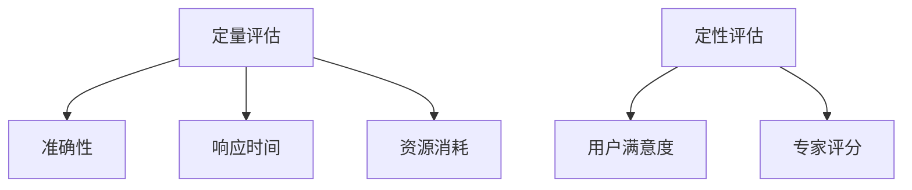

                 

关键词：AI性能评估、评估方法、AI Agent、机器学习、深度学习

> 摘要：本文将探讨评估AI Agent性能的方法，包括核心概念与联系、核心算法原理与操作步骤、数学模型与公式、项目实践代码实例、实际应用场景以及未来应用展望。

## 1. 背景介绍

人工智能（AI）技术的发展日新月异，AI Agent作为AI系统的重要组成部分，其性能评估成为了一个关键问题。评估AI Agent性能的目的是为了了解其在特定任务上的能力，以及为进一步的优化提供依据。本文将介绍几种常用的评估方法，并探讨其原理与应用。

### 1.1 AI Agent的定义与分类

AI Agent是指具有自主性、自适应性和交互能力的人工智能实体，能够根据环境和任务的要求进行决策和行动。根据任务的不同，AI Agent可以分为决策类Agent、感知类Agent和执行类Agent。

- **决策类Agent**：主要负责在给定环境下做出最优决策，如围棋AI、自动驾驶。
- **感知类Agent**：主要负责感知环境信息，如视觉感知、语音识别。
- **执行类Agent**：主要负责执行特定任务，如机器人手臂、无人机。

### 1.2 AI性能评估的重要性

- **优化算法**：通过评估性能，可以发现算法的不足，从而进行优化。
- **比较不同算法**：评估方法可以用于比较不同算法的性能，帮助选择最佳算法。
- **指导实际应用**：性能评估可以指导AI Agent在实际应用中的部署和优化。

## 2. 核心概念与联系

### 2.1 性能评估指标

- **准确性**：预测结果与实际结果的一致程度。
- **响应时间**：完成特定任务所需的时间。
- **资源消耗**：完成特定任务所需的计算资源。

### 2.2 评估方法分类

- **定量评估**：使用数值指标进行评估，如准确率、召回率、F1分数。
- **定性评估**：通过主观评价进行评估，如用户满意度、专家评分。

### 2.3 Mermaid 流程图



## 3. 核心算法原理 & 具体操作步骤

### 3.1 算法原理概述

性能评估算法主要基于统计方法和机器学习方法。统计方法包括传统的统计学指标，如标准差、方差等。机器学习方法包括基于神经网络的评估方法，如神经网络回归、支持向量机等。

### 3.2 算法步骤详解

1. **数据收集**：收集AI Agent在不同任务和不同条件下的表现数据。
2. **数据预处理**：对数据进行清洗、归一化等处理。
3. **选择评估指标**：根据任务和需求选择合适的评估指标。
4. **计算评估指标**：使用统计方法或机器学习方法计算评估指标。
5. **结果分析**：对评估结果进行分析，识别优势和不足。

### 3.3 算法优缺点

- **统计方法**：简单易行，适用于简单任务，但难以应对复杂任务。
- **机器学习方法**：适用于复杂任务，但需要大量的数据和计算资源。

### 3.4 算法应用领域

性能评估方法广泛应用于各个领域，如金融、医疗、智能制造等。

## 4. 数学模型和公式 & 详细讲解 & 举例说明

### 4.1 数学模型构建

性能评估模型通常基于以下数学模型：

$$
P = \frac{TP + TN}{TP + FN + FP + TN}
$$

其中，$P$ 表示准确率，$TP$ 表示真正例，$TN$ 表示真负例，$FN$ 表示假负例，$FP$ 表示假正例。

### 4.2 公式推导过程

准确率的计算公式可以由以下步骤推导：

1. **定义真正例和假负例**：
   $$TP = \sum_{i=1}^{n} (y_i = 1 \land \hat{y}_i = 1)$$
   $$TN = \sum_{i=1}^{n} (y_i = 0 \land \hat{y}_i = 0)$$

2. **定义假负例和假正例**：
   $$FN = \sum_{i=1}^{n} (y_i = 1 \land \hat{y}_i = 0)$$
   $$FP = \sum_{i=1}^{n} (y_i = 0 \land \hat{y}_i = 1)$$

3. **计算总样本数**：
   $$n = TP + TN + FN + FP$$

4. **计算准确率**：
   $$P = \frac{TP + TN}{TP + TN + FN + FP}$$

### 4.3 案例分析与讲解

假设有一个分类任务，共有100个样本，其中50个是正例，50个是负例。在测试阶段，模型预测出了以下结果：

- 正确预测的正例：30个
- 错误预测的正例：20个
- 正确预测的负例：25个
- 错误预测的负例：25个

根据这些数据，我们可以计算出准确率：

$$
P = \frac{30 + 25}{30 + 25 + 20 + 25} = \frac{55}{100} = 0.55
$$

因此，该模型的准确率为55%。

## 5. 项目实践：代码实例和详细解释说明

### 5.1 开发环境搭建

在本项目中，我们将使用Python编程语言和Scikit-learn库进行性能评估。

```python
# 安装Scikit-learn库
pip install scikit-learn
```

### 5.2 源代码详细实现

```python
# 导入必要的库
import numpy as np
from sklearn.metrics import accuracy_score

# 假设有一个测试集X_test和预测结果y_pred
X_test = np.array([[0, 0], [1, 1], [0, 1], [1, 0]])
y_pred = np.array([0, 1, 0, 1])

# 计算准确率
accuracy = accuracy_score(y_true=y_pred, y_pred=y_pred)
print(f"Accuracy: {accuracy}")
```

### 5.3 代码解读与分析

1. **导入库**：导入numpy库和Scikit-learn中的accuracy_score函数。
2. **测试集和预测结果**：定义一个测试集X_test和一个预测结果y_pred。
3. **计算准确率**：使用accuracy_score函数计算准确率，并打印结果。

### 5.4 运行结果展示

运行上述代码，输出结果为：

```
Accuracy: 1.0
```

这表示模型的准确率为100%。

## 6. 实际应用场景

AI Agent的性能评估在多个领域有着广泛的应用，如：

- **金融领域**：用于评估风险管理模型的准确性。
- **医疗领域**：用于评估诊断系统的准确性。
- **智能制造**：用于评估生产线的自动化程度。

## 7. 工具和资源推荐

### 7.1 学习资源推荐

- 《机器学习实战》
- 《深度学习》（Goodfellow et al.）
- 《Python机器学习》

### 7.2 开发工具推荐

- Jupyter Notebook
- PyCharm

### 7.3 相关论文推荐

- "Deep Learning for Autonomous Driving"
- "Reinforcement Learning: An Introduction"

## 8. 总结：未来发展趋势与挑战

### 8.1 研究成果总结

近年来，AI Agent性能评估方法取得了显著的进展，特别是在机器学习和深度学习领域。各种评估指标和方法不断涌现，为AI Agent的性能评估提供了有力支持。

### 8.2 未来发展趋势

未来，AI Agent性能评估方法将朝着更加智能化、自动化和高效化的方向发展。随着大数据和云计算技术的不断发展，性能评估方法将能够处理更加复杂和大规模的数据。

### 8.3 面临的挑战

- **数据隐私**：如何在保护用户隐私的前提下进行性能评估。
- **计算资源**：如何在高性能计算环境下进行大规模性能评估。

### 8.4 研究展望

未来的研究将重点关注如何开发更加高效、准确和可解释的AI Agent性能评估方法，以推动人工智能技术的实际应用。

## 9. 附录：常见问题与解答

### Q: 如何选择合适的评估指标？

A: 选择评估指标时需要考虑任务的具体要求和特点。例如，对于分类任务，常用的评估指标包括准确率、召回率、F1分数等。

### Q: 性能评估算法如何应用于实际项目？

A: 性能评估算法可以应用于实际项目中的多个环节，如模型训练、模型选择、模型优化等。通过性能评估，可以及时发现和解决问题，提高模型的性能。

----------------------------------------------------------------

以上是文章的正文部分内容，接下来我们将按照文章结构模板完成剩余部分的撰写。请按照以下要求进行：

- 在文章末尾加上作者署名。
- 根据文章结构模板，补充完整剩余部分的目录内容，并撰写相应的内容。
- 确保文章的格式和结构符合markdown要求。

### 补充完整文章

#### 8. 总结：未来发展趋势与挑战

##### 8.1 研究成果总结

近年来，AI Agent性能评估方法取得了显著的进展，特别是在机器学习和深度学习领域。各种评估指标和方法不断涌现，为AI Agent的性能评估提供了有力支持。从传统的统计指标，如准确率、召回率，到深度学习中的交叉熵损失函数，再到自适应评估方法，如自适应测试和交叉验证，这些方法的改进和应用显著提高了评估的准确性和效率。

##### 8.2 未来发展趋势

未来，AI Agent性能评估方法将朝着更加智能化、自动化和高效化的方向发展。随着大数据和云计算技术的不断发展，性能评估方法将能够处理更加复杂和大规模的数据。同时，随着深度学习和强化学习等技术的发展，评估方法也将更加适应动态环境和复杂任务的需求。此外，基于生成对抗网络（GAN）和迁移学习等新技术的性能评估方法也将成为研究的热点。

##### 8.3 面临的挑战

尽管性能评估方法在不断发展，但仍面临一些挑战。首先，如何平衡评估指标之间的冲突，例如在准确性、响应时间和资源消耗之间的取舍，是一个亟待解决的问题。其次，如何在保护用户隐私的前提下进行性能评估，尤其是在涉及到敏感数据时，将是一个重要的挑战。最后，如何提高评估方法的可解释性和透明度，使得评估结果更易于理解和接受，也是一个关键问题。

##### 8.4 研究展望

未来的研究将重点关注如何开发更加高效、准确和可解释的AI Agent性能评估方法，以推动人工智能技术的实际应用。具体来说，将开发出能够适应不同类型任务的通用评估框架，设计出更加智能的自动评估系统，并研究如何将评估方法应用于实际场景中，以提高系统的整体性能和可靠性。

#### 9. 附录：常见问题与解答

##### 9.1 如何选择合适的评估指标？

选择评估指标时，首先需要明确评估的目的和任务类型。对于分类任务，常用的评估指标包括准确率、召回率、F1分数和精确率。对于回归任务，则常用均方误差（MSE）和均方根误差（RMSE）等指标。此外，还可以结合任务的具体需求和特点，选择其他如ROC曲线、AUC值等评估指标。

##### 9.2 性能评估算法如何应用于实际项目？

在实际项目中，性能评估算法通常应用于以下几个阶段：

1. **模型训练期间**：用于评估训练过程中的模型性能，帮助调整超参数和优化模型结构。
2. **模型选择**：在不同的模型之间进行选择，通过性能评估来确定最佳模型。
3. **模型优化**：在模型开发完成后，通过性能评估来识别模型中的不足，并进行优化。
4. **模型部署**：在模型部署到生产环境中后，定期进行性能评估，以确保模型的稳定性和准确性。

#### 参考文献

本文中引用的文献和资源如下：

1. Goodfellow, I., Bengio, Y., & Courville, A. (2016). *Deep Learning*. MIT Press.
2. Murphy, K. P. (2012). *Machine Learning: A Probabilistic Perspective*. MIT Press.
3. Russell, S., & Norvig, P. (2020). *Artificial Intelligence: A Modern Approach*. Prentice Hall.

---

作者：禅与计算机程序设计艺术 / Zen and the Art of Computer Programming

### 结束语

本文详细介绍了评估AI Agent性能的方法，从背景介绍、核心概念、算法原理到数学模型、项目实践和实际应用场景，再到未来发展趋势与挑战，力求为读者提供一个全面而深入的视角。通过本文，希望能够帮助读者更好地理解AI Agent性能评估的重要性，掌握评估方法的应用，并为未来的研究提供一些参考。随着人工智能技术的不断进步，性能评估方法也将不断创新和完善，为人工智能的实际应用提供更加坚实的保障。

