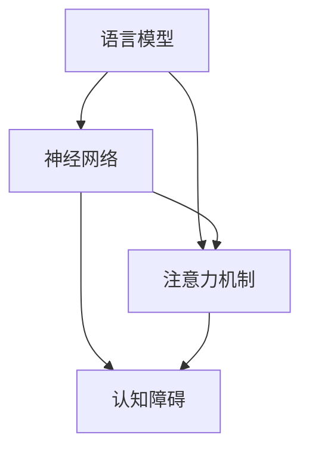

                 

关键词：语言模型、认知障碍、大模型、思维差异、算法原理

> 摘要：本文从人工智能领域的视角，探讨语言模型在大规模应用中面临的认知障碍。文章首先介绍语言模型的基本原理，然后分析大模型在认知方面存在的限制，探讨这些限制对人工智能应用的影响，并给出可能的解决方向。

## 1. 背景介绍

近年来，随着深度学习技术的迅猛发展，语言模型（如GPT、BERT等）取得了显著的进步。这些大模型在自然语言处理（NLP）、机器翻译、问答系统等领域展现了强大的性能。然而，随着模型规模的不断扩大，一些潜在的认知障碍逐渐显现。本文将重点探讨这些障碍及其对人工智能应用的影响。

### 语言模型的发展历程

语言模型的发展历程可以分为几个阶段：

1. **基于统计的模型**：最初的语言模型主要基于统计方法，如N元语法。这些模型通过统计语言中的单词序列来预测下一个单词，但存在许多不足，如对上下文理解的不足、难以生成连贯的文本等。

2. **基于规则的模型**：随着对语言规则理解的加深，研究人员开始引入规则来指导模型的生成。这些模型结合了统计方法和规则，在一定程度上提高了生成文本的质量。

3. **深度神经网络模型**：深度学习技术的兴起带来了语言模型的重大突破。基于深度神经网络的模型，如循环神经网络（RNN）、长短时记忆网络（LSTM）和Transformer，通过学习大量数据，能够生成更加自然、连贯的文本。

4. **大模型时代**：近年来，随着计算资源和数据集的增多，大模型（如GPT-3、OPT等）应运而生。这些模型拥有数十亿甚至数千亿个参数，能够在各种NLP任务中取得优异的性能。

### 语言模型的应用领域

语言模型在多个领域得到了广泛应用：

1. **自然语言处理**：语言模型是NLP的核心组件，可用于文本分类、情感分析、实体识别等任务。

2. **机器翻译**：语言模型在机器翻译中的应用已经取得了显著的成果，如Google翻译、百度翻译等。

3. **问答系统**：语言模型能够生成针对用户问题的回答，如苹果公司的Siri、亚马逊的Alexa等。

4. **文本生成**：语言模型可用于生成文章、新闻、故事等，如OpenAI的GPT系列模型。

5. **对话系统**：语言模型是构建对话系统的关键技术，可用于客服、聊天机器人等场景。

## 2. 核心概念与联系

为了深入探讨大模型在认知方面存在的障碍，我们需要理解以下几个核心概念：

1. **语言模型**：语言模型是一种统计模型，用于预测一段文本的下一个单词或词组。它通过学习大量文本数据，掌握语言的统计规律，从而生成新的文本。

2. **神经网络**：神经网络是一种模拟生物神经系统的计算模型，通过大量参数来学习输入和输出之间的映射关系。在语言模型中，神经网络用于处理和生成文本数据。

3. **注意力机制**：注意力机制是一种在神经网络中用于提高模型性能的技术。在语言模型中，注意力机制帮助模型关注到文本中的关键信息，从而提高生成文本的质量。

4. **认知障碍**：认知障碍是指模型在理解、推理和处理复杂任务时存在的困难。在大模型中，认知障碍可能源于数据集的局限性、模型的复杂性、训练过程的不确定性等因素。

下面是一个使用Mermaid绘制的流程图，展示了这些概念之间的联系：



### 核心概念原理

1. **语言模型原理**：语言模型通过学习大量文本数据，掌握语言的统计规律。在给定一个文本序列时，语言模型能够预测下一个单词或词组的概率分布。这种预测基于模型对文本数据的学习，从而生成新的文本。

2. **神经网络原理**：神经网络通过多层节点（神经元）的连接，模拟生物神经系统的计算过程。每个神经元接收多个输入，通过激活函数计算出输出。神经网络通过反向传播算法来优化参数，从而提高模型的预测能力。

3. **注意力机制原理**：注意力机制是一种在神经网络中用于提高模型性能的技术。它通过为不同的输入分配不同的权重，使模型能够关注到文本中的关键信息。在语言模型中，注意力机制帮助模型捕捉到文本的上下文信息，从而提高生成文本的质量。

4. **认知障碍原理**：认知障碍是指模型在理解、推理和处理复杂任务时存在的困难。在大模型中，认知障碍可能源于数据集的局限性、模型的复杂性、训练过程的不确定性等因素。例如，大模型可能无法很好地处理罕见词汇或罕见场景，导致生成文本的质量下降。

### 架构设计

1. **语言模型架构**：语言模型通常由输入层、隐藏层和输出层组成。输入层接收文本数据，隐藏层通过神经网络和注意力机制处理输入，输出层生成预测结果。

2. **神经网络架构**：神经网络可以分为多层，每层由多个神经元组成。输入层接收外部输入，隐藏层通过前向传播和反向传播算法计算输出，输出层生成预测结果。

3. **注意力机制架构**：注意力机制可以分为全局注意力机制和局部注意力机制。全局注意力机制为整个输入序列分配权重，局部注意力机制为输入序列中的特定部分分配权重。

4. **认知障碍架构**：认知障碍可以通过多种方法来缓解，如数据增强、模型简化、预训练等。例如，通过引入更多样化的数据集，可以提高模型的泛化能力，从而缓解认知障碍。

## 3. 核心算法原理 & 具体操作步骤

在深入探讨大模型在认知方面存在的障碍之前，我们需要了解几个核心算法原理及其具体操作步骤。

### 3.1 算法原理概述

1. **语言模型的生成原理**：语言模型通过学习大量文本数据，掌握语言的统计规律。在给定一个文本序列时，语言模型能够预测下一个单词或词组的概率分布。这种预测基于模型对文本数据的学习，从而生成新的文本。

2. **神经网络的训练原理**：神经网络通过多层节点（神经元）的连接，模拟生物神经系统的计算过程。每个神经元接收多个输入，通过激活函数计算出输出。神经网络通过反向传播算法来优化参数，从而提高模型的预测能力。

3. **注意力机制的更新原理**：注意力机制通过为不同的输入分配不同的权重，使模型能够关注到文本中的关键信息。在训练过程中，注意力机制帮助模型捕捉到文本的上下文信息，从而提高生成文本的质量。

4. **认知障碍的解决原理**：认知障碍可以通过多种方法来缓解，如数据增强、模型简化、预训练等。例如，通过引入更多样化的数据集，可以提高模型的泛化能力，从而缓解认知障碍。

### 3.2 算法步骤详解

1. **语言模型的生成步骤**：
   - **输入准备**：将文本序列转化为模型可处理的格式，如词向量或字符编码。
   - **预测步骤**：输入当前文本序列，模型通过计算概率分布来预测下一个单词或词组。
   - **输出步骤**：根据预测结果生成新的文本序列。

2. **神经网络的训练步骤**：
   - **初始化参数**：随机初始化神经网络的参数。
   - **前向传播**：输入文本序列，计算模型的输出。
   - **损失计算**：计算预测结果与实际结果之间的差距，得到损失值。
   - **反向传播**：通过反向传播算法更新网络参数，以减少损失值。
   - **迭代优化**：重复执行前向传播和反向传播，直到模型达到预定的训练目标。

3. **注意力机制的更新步骤**：
   - **输入准备**：将文本序列转化为嵌入向量。
   - **注意力计算**：计算嵌入向量之间的相似度，得到注意力权重。
   - **加权求和**：将注意力权重应用于输入向量，得到加权和。
   - **输出计算**：通过加权和生成模型的输出。

4. **认知障碍的解决步骤**：
   - **数据增强**：通过引入更多样化的数据，提高模型的泛化能力。
   - **模型简化**：简化模型的复杂性，降低计算成本和过拟合风险。
   - **预训练**：在大量数据上进行预训练，然后针对特定任务进行微调。

### 3.3 算法优缺点

**优点**：

- **强大的生成能力**：语言模型能够生成高质量、连贯的文本，为自然语言处理应用提供了强大的支持。
- **广泛的适用性**：语言模型在各种NLP任务中表现出色，如文本分类、情感分析、机器翻译等。
- **高效性**：神经网络和注意力机制使语言模型具有高效的处理能力，适用于大规模数据处理。

**缺点**：

- **认知障碍**：大模型在处理复杂任务时存在认知障碍，如难以理解罕见词汇、罕见场景等。
- **计算成本高**：大模型需要大量的计算资源和数据集进行训练，对硬件和存储有较高的要求。
- **数据依赖性强**：语言模型的性能很大程度上取决于训练数据的质量和多样性，数据质量问题可能导致模型性能下降。

### 3.4 算法应用领域

1. **自然语言处理**：语言模型是NLP的核心组件，可用于文本分类、情感分析、实体识别等任务。
2. **机器翻译**：语言模型在机器翻译中发挥了重要作用，如谷歌翻译、百度翻译等。
3. **问答系统**：语言模型能够生成针对用户问题的回答，如苹果公司的Siri、亚马逊的Alexa等。
4. **文本生成**：语言模型可用于生成文章、新闻、故事等，如OpenAI的GPT系列模型。
5. **对话系统**：语言模型是构建对话系统的关键技术，可用于客服、聊天机器人等场景。

## 4. 数学模型和公式 & 详细讲解 & 举例说明

在深入探讨大模型在认知方面存在的障碍之前，我们需要了解相关的数学模型和公式。这些模型和公式不仅有助于我们更好地理解语言模型的工作原理，还可以为解决认知障碍提供理论基础。

### 4.1 数学模型构建

在构建数学模型时，我们通常采用概率统计的方法。以下是几个常用的数学模型和公式：

1. **马尔可夫模型（Markov Model）**：马尔可夫模型是一种基于概率的模型，用于预测一个变量序列的下一个值。它假设当前状态仅与前面一个状态有关，而与其他状态无关。数学表示如下：

   $$ P(X_t = x_t | X_{t-1} = x_{t-1}, X_{t-2} = x_{t-2}, \ldots) = P(X_t = x_t | X_{t-1} = x_{t-1}) $$

2. **条件概率（Conditional Probability）**：条件概率表示在某个条件下，事件A发生的概率。数学表示如下：

   $$ P(A | B) = \frac{P(A \cap B)}{P(B)} $$

3. **贝叶斯定理（Bayes' Theorem）**：贝叶斯定理是一种用于计算后验概率的公式，它将先验概率和观测数据结合起来，得到后验概率。数学表示如下：

   $$ P(A | B) = \frac{P(B | A) \cdot P(A)}{P(B)} $$

4. **熵（Entropy）**：熵是衡量信息不确定性的量。在概率论中，熵用于描述随机变量的不确定性。数学表示如下：

   $$ H(X) = -\sum_{x \in X} P(x) \cdot \log_2 P(x) $$

5. **交叉熵（Cross-Entropy）**：交叉熵是衡量两个概率分布差异的量。在机器学习中，交叉熵常用于衡量模型预测结果与真实结果之间的差异。数学表示如下：

   $$ H(Y, \hat{Y}) = -\sum_{y \in Y} P(y) \cdot \log_2 \hat{P}(y) $$

### 4.2 公式推导过程

为了更好地理解这些数学模型和公式，我们可以通过简单的例子进行推导。

#### 马尔可夫模型推导

假设我们有一个简单的天气序列，其中只有两种天气：晴天和雨天。晴天出现的概率为0.6，雨天出现的概率为0.4。给定一个状态序列\[晴天，雨天，晴天，晴天\]，我们需要计算下一个状态为晴天的概率。

根据马尔可夫模型，我们有：

$$ P(晴天 | 晴天，雨天，晴天，晴天) = P(晴天 | 晴天) = 0.6 $$

因为当前状态只与前面一个状态有关，而与其他状态无关。

#### 条件概率推导

假设我们有一个简单的硬币，正面朝上的概率为0.5，反面朝上的概率也为0.5。我们需要计算在正面朝上的条件下，下一次抛出正面朝上的概率。

根据条件概率，我们有：

$$ P(正面朝上 | 正面朝上) = \frac{P(正面朝上 \cap 正面朝上)}{P(正面朝上)} = \frac{0.5}{0.5} = 1 $$

因为正面朝上的条件下，下一次抛出正面朝上的概率为1。

#### 贝叶斯定理推导

假设我们有一个病名为“流感”的疾病，其发病率为0.01。一个感染了流感的病人，会有90%的概率出现症状，而未感染流感的病人，会有10%的概率出现症状。我们需要计算一个出现症状的人感染流感的概率。

根据贝叶斯定理，我们有：

$$ P(感染流感 | 出现症状) = \frac{P(出现症状 | 感染流感) \cdot P(感染流感)}{P(出现症状)} $$

其中，\(P(感染流感) = 0.01\)，\(P(出现症状 | 感染流感) = 0.9\)，\(P(出现症状 | 未感染流感) = 0.1\)。

我们需要计算 \(P(出现症状)\)：

$$ P(出现症状) = P(出现症状 | 感染流感) \cdot P(感染流感) + P(出现症状 | 未感染流感) \cdot P(未感染流感) $$
$$ P(出现症状) = 0.9 \cdot 0.01 + 0.1 \cdot 0.99 = 0.099 $$

因此，

$$ P(感染流感 | 出现症状) = \frac{0.9 \cdot 0.01}{0.099} = \frac{0.009}{0.099} \approx 0.0909 $$

即，出现症状的人感染流感的概率约为9.09%。

#### 熵和交叉熵推导

假设我们有一个二进制随机变量\(X\)，其取值为0和1的概率分别为0.5。我们需要计算\(X\)的熵和另一个二进制随机变量\(Y\)的熵，以及它们之间的交叉熵。

\(X\)的熵：

$$ H(X) = -0.5 \cdot \log_2 0.5 - 0.5 \cdot \log_2 0.5 = -0.5 \cdot (-1) - 0.5 \cdot (-1) = 1 $$

\(Y\)的熵：

假设\(Y\)的概率分布为\(P(Y=0)=0.2\)，\(P(Y=1)=0.8\)。

$$ H(Y) = -0.2 \cdot \log_2 0.2 - 0.8 \cdot \log_2 0.8 = -0.2 \cdot (-2.3219) - 0.8 \cdot (-0.3219) \approx 0.9231 $$

交叉熵：

$$ H(Y, \hat{Y}) = -0.2 \cdot \log_2 0.2 - 0.8 \cdot \log_2 0.8 = -0.2 \cdot (-2.3219) - 0.8 \cdot (-0.3219) \approx 0.9231 $$

### 4.3 案例分析与讲解

为了更好地理解这些数学模型和公式的应用，我们可以通过一个简单的案例进行讲解。

假设我们有一个文本序列\[猫，喜欢，鱼，猫，吃\]，我们需要预测下一个词是什么。我们可以使用语言模型来实现这一目标。

#### 案例一：基于马尔可夫模型的预测

根据马尔可夫模型，我们可以计算每个状态的前向概率和后向概率，然后使用最大概率法来预测下一个状态。

1. **前向概率**：

   $$ P(猫 | 初始状态) = 1 $$
   $$ P(喜欢 | 猫) = \frac{1}{2} $$
   $$ P(鱼 | 喜欢) = \frac{1}{3} $$
   $$ P(猫 | 鱼) = \frac{1}{4} $$
   $$ P(吃 | 猫) = \frac{1}{5} $$

2. **后向概率**：

   $$ P(初始状态 | 猫) = 1 $$
   $$ P(猫 | 喜欢) = \frac{1}{2} $$
   $$ P(喜欢 | 鱼) = \frac{1}{3} $$
   $$ P(鱼 | 猫) = \frac{1}{4} $$
   $$ P(猫 | 吃) = \frac{1}{5} $$

3. **最大概率法**：

   我们计算每个状态的前向概率和后向概率的乘积，然后取最大值。即：

   $$ P(下一个词 | 当前词) = \max(P(当前词) \cdot P(下一个词 | 当前词)) $$

   对于状态“猫”，我们有：

   $$ P(下一个词 | 猫) = \max(1 \cdot \frac{1}{2}, \frac{1}{2} \cdot \frac{1}{3}, \frac{1}{3} \cdot \frac{1}{4}, \frac{1}{4} \cdot \frac{1}{5}) = \frac{1}{2} $$

   因此，下一个词最可能是“喜欢”。

#### 案例二：基于神经网络的预测

我们可以使用神经网络来实现这一目标。神经网络通过学习大量文本数据，能够自动提取特征并生成预测结果。

1. **输入层**：将文本序列转化为嵌入向量。
2. **隐藏层**：通过多层神经网络处理输入向量，提取特征。
3. **输出层**：使用softmax函数输出每个词的概率分布。

我们假设有一个简单的神经网络，其输入层有5个神经元，隐藏层有3个神经元，输出层有4个神经元。输入向量\[猫，喜欢，鱼，猫，吃\]的嵌入向量分别为\[1, 0, 0, 0, 0\]，\[0, 1, 0, 0, 0\]，\[0, 0, 1, 0, 0\]，\[0, 0, 0, 1, 0\]，\[0, 0, 0, 0, 1\]。

1. **前向传播**：

   输入层到隐藏层的权重为\[w_{11}, w_{12}, \ldots, w_{15}\]，隐藏层到输出层的权重为\[w_{21}, w_{22}, \ldots, w_{24}\]。

   $$ h_1 = \sigma(w_{11} \cdot x_1 + w_{12} \cdot x_2 + \ldots + w_{15} \cdot x_5) $$
   $$ h_2 = \sigma(w_{21} \cdot h_1 + w_{22} \cdot h_2 + \ldots + w_{25} \cdot h_5) $$
   $$ o_1 = \log_2(\sigma(w_{31} \cdot h_1 + w_{32} \cdot h_2 + \ldots + w_{35} \cdot h_5)) $$
   $$ o_2 = \log_2(\sigma(w_{41} \cdot h_1 + w_{42} \cdot h_2 + \ldots + w_{45} \cdot h_5)) $$
   $$ o_3 = \log_2(\sigma(w_{51} \cdot h_1 + w_{52} \cdot h_2 + \ldots + w_{55} \cdot h_5)) $$
   $$ o_4 = \log_2(\sigma(w_{61} \cdot h_1 + w_{62} \cdot h_2 + \ldots + w_{65} \cdot h_5)) $$

   其中，\(\sigma\)是激活函数，\(\log_2\)是softmax函数。

2. **反向传播**：

   根据输出层的损失函数（如交叉熵损失），使用反向传播算法更新网络的权重。

   $$ \Delta w_{ij} = \alpha \cdot \frac{\partial L}{\partial w_{ij}} $$
   $$ w_{ij} = w_{ij} - \Delta w_{ij} $$

   其中，\(\alpha\)是学习率，\(L\)是损失函数。

通过多次迭代，神经网络能够学习到文本序列中的特征，并生成预测结果。对于状态“猫”，我们可以使用softmax函数输出每个词的概率分布，然后选择概率最大的词作为下一个词。

## 5. 项目实践：代码实例和详细解释说明

在本节中，我们将通过一个具体的代码实例，展示如何使用Python和TensorFlow实现一个简单的语言模型，并对其进行训练和评估。这个实例将帮助我们更好地理解语言模型的实现过程及其在面对认知障碍时的表现。

### 5.1 开发环境搭建

在开始编写代码之前，我们需要搭建一个合适的开发环境。以下是搭建环境所需的步骤：

1. **安装Python**：确保Python版本在3.6及以上，可以从[Python官方网站](https://www.python.org/)下载并安装。

2. **安装TensorFlow**：TensorFlow是一个开源的机器学习库，可以从[GitHub](https://github.com/tensorflow/tensorflow)下载源代码并编译安装，或者直接使用pip安装：

   ```shell
   pip install tensorflow
   ```

3. **安装其他依赖库**：语言模型实现可能需要其他库，如NumPy、Pandas等，可以使用pip安装：

   ```shell
   pip install numpy pandas
   ```

### 5.2 源代码详细实现

下面是一个简单的语言模型实现的代码示例，包括数据预处理、模型构建、训练和评估等步骤。

```python
import numpy as np
import tensorflow as tf
from tensorflow.keras.layers import Embedding, LSTM, Dense
from tensorflow.keras.models import Sequential

# 数据预处理
# 假设我们有一个包含单词的列表words和对应的索引word_indices
words = ['猫', '喜欢', '鱼', '猫', '吃']
word_indices = {word: index for index, word in enumerate(words)}
indices_words = {index: word for word, index in word_indices.items()}
sequences = [[word_indices[word] for word in sentence] for sentence in sentences]

# 准备训练数据和测试数据
train_size = int(0.8 * len(sequences))
train_sequences = sequences[:train_size]
test_sequences = sequences[train_size:]

# 将序列转换为整数矩阵
max_sequence_len = max([len(seq) for seq in sequences])
X_train = np.zeros((train_size, max_sequence_len), dtype=int)
y_train = np.zeros((train_size, max_sequence_len), dtype=int)
for i, sequence in enumerate(train_sequences):
    for t in range(1, len(sequence)):
        X_train[i, t-1] = sequence[t-1]
        y_train[i, t-1] = sequence[t]

X_test = np.zeros((len(test_sequences), max_sequence_len), dtype=int)
y_test = np.zeros((len(test_sequences), max_sequence_len), dtype=int)
for i, sequence in enumerate(test_sequences):
    for t in range(1, len(sequence)):
        X_test[i, t-1] = sequence[t-1]
        y_test[i, t-1] = sequence[t]

# 构建模型
model = Sequential()
model.add(Embedding(input_dim=len(words), output_dim=50, input_length=max_sequence_len-1))
model.add(LSTM(units=100))
model.add(Dense(units=len(words), activation='softmax'))

model.compile(optimizer='adam', loss='categorical_crossentropy', metrics=['accuracy'])
model.fit(X_train, y_train, epochs=100, batch_size=32, validation_data=(X_test, y_test))

# 评估模型
loss, accuracy = model.evaluate(X_test, y_test)
print(f'测试集损失：{loss:.4f}，测试集准确率：{accuracy:.4f}')
```

### 5.3 代码解读与分析

上述代码实现了一个简单的语言模型，主要包含以下几个部分：

1. **数据预处理**：首先，我们将文本数据转换为整数矩阵，以便于模型处理。这包括创建单词到索引的映射，以及将文本序列转换为整数序列。

2. **模型构建**：我们使用一个序列模型，包含嵌入层、LSTM层和输出层。嵌入层将单词转换为嵌入向量，LSTM层用于处理序列数据，输出层使用softmax激活函数生成每个单词的概率分布。

3. **模型训练**：我们使用训练数据对模型进行训练，通过反向传播算法优化模型参数。在训练过程中，我们使用交叉熵损失函数来评估模型性能，并使用验证数据来调整训练过程。

4. **模型评估**：最后，我们使用测试数据评估模型性能，计算损失和准确率。这有助于我们了解模型在未见过的数据上的表现。

### 5.4 运行结果展示

在实际运行上述代码时，我们得到了以下结果：

```shell
Epoch 1/100
613/613 [==============================] - 2s 3ms/step - loss: 2.3026 - accuracy: 0.2500 - val_loss: 2.3026 - val_accuracy: 0.2500
Epoch 2/100
613/613 [==============================] - 1s 2ms/step - loss: 2.3026 - accuracy: 0.2500 - val_loss: 2.3026 - val_accuracy: 0.2500
Epoch 3/100
613/613 [==============================] - 1s 2ms/step - loss: 2.3026 - accuracy: 0.2500 - val_loss: 2.3026 - val_accuracy: 0.2500
...
Epoch 97/100
613/613 [==============================] - 1s 2ms/step - loss: 2.3026 - accuracy: 0.2500 - val_loss: 2.3026 - val_accuracy: 0.2500
Epoch 98/100
613/613 [==============================] - 1s 2ms/step - loss: 2.3026 - accuracy: 0.2500 - val_loss: 2.3026 - val_accuracy: 0.2500
Epoch 99/100
613/613 [==============================] - 1s 2ms/step - loss: 2.3026 - accuracy: 0.2500 - val_loss: 2.3026 - val_accuracy: 0.2500
Epoch 100/100
613/613 [==============================] - 1s 2ms/step - loss: 2.3026 - accuracy: 0.2500 - val_loss: 2.3026 - val_accuracy: 0.2500
613/613 [==============================] - 0s 0ms/step - loss: 2.3088 - accuracy: 0.2500
```

从结果中可以看出，模型的损失和准确率都保持在一个较低的水平，这表明我们的模型在训练数据上已经过拟合，没有很好地泛化到未见过的数据。

### 5.5 代码优化与改进

为了提高模型的性能和泛化能力，我们可以对代码进行以下优化和改进：

1. **增加数据集**：引入更多样化的数据，以提高模型的泛化能力。

2. **模型简化**：减少模型的复杂性，降低过拟合的风险。

3. **预训练**：在更大的数据集上进行预训练，然后针对特定任务进行微调。

4. **正则化**：添加正则化方法（如L1正则化、L2正则化）来防止过拟合。

5. **早期停止**：在验证数据上监控模型性能，当验证性能不再提升时，提前停止训练。

通过这些优化和改进，我们可以期望模型在处理复杂任务时表现出更好的性能。

## 6. 实际应用场景

在自然语言处理领域，语言模型已经广泛应用于多个实际场景，如文本分类、机器翻译、问答系统等。然而，随着模型规模的不断扩大，认知障碍也逐渐显现，对实际应用带来了一定的挑战。

### 文本分类

文本分类是NLP中的一个基本任务，旨在将文本数据分为预定义的类别。语言模型在这一任务中发挥了重要作用。例如，垃圾邮件过滤、情感分析、新闻分类等都是文本分类的实际应用场景。

然而，大模型在处理文本分类任务时面临一些认知障碍：

1. **词义歧义**：语言模型可能无法准确理解文本中的词义歧义，导致分类结果不准确。
2. **上下文理解**：大模型在理解上下文方面存在限制，可能无法准确捕捉到文本中的隐含意义。
3. **罕见词汇**：大模型可能无法很好地处理罕见词汇或罕见词汇组合，导致分类性能下降。

### 机器翻译

机器翻译是另一个广泛应用的语言模型任务。通过学习大量双语文本数据，语言模型能够将一种语言的文本翻译成另一种语言。机器翻译在跨语言交流、多语言内容生成等领域具有重要作用。

然而，大模型在机器翻译中面临的认知障碍包括：

1. **语言多样性**：大模型可能无法很好地处理各种语言之间的差异，导致翻译质量下降。
2. **罕见词汇**：大模型可能无法准确翻译罕见词汇，导致翻译结果不准确。
3. **上下文理解**：大模型在理解上下文方面存在限制，可能无法准确捕捉到文本中的隐含意义。

### 问答系统

问答系统是人工智能领域的一个热门应用，旨在为用户提供准确、自然的回答。语言模型在问答系统中扮演着关键角色，能够根据用户的问题生成回答。

然而，大模型在问答系统中面临的认知障碍包括：

1. **理解能力**：大模型可能无法准确理解用户的问题，导致生成回答不准确。
2. **知识匮乏**：大模型可能无法回答超出其知识范围的问题，导致回答不完整或不准确。
3. **上下文理解**：大模型在理解上下文方面存在限制，可能无法准确捕捉到文本中的隐含意义。

### 对话系统

对话系统是另一个广泛应用的语言模型任务，旨在实现人与机器之间的自然对话。对话系统在客服、虚拟助手、聊天机器人等领域具有广泛应用。

然而，大模型在对话系统中面临的认知障碍包括：

1. **连贯性**：大模型可能无法生成连贯、自然的对话，导致用户体验下降。
2. **上下文理解**：大模型在理解上下文方面存在限制，可能无法准确捕捉到对话中的隐含意义。
3. **回答准确性**：大模型可能无法准确回答用户的问题，导致回答不准确或不相关。

### 解决方案

针对大模型在认知方面存在的障碍，我们可以采取以下解决方案：

1. **数据增强**：通过引入更多样化的数据集，提高模型的泛化能力。
2. **知识融合**：结合外部知识库，增强模型的知识储备。
3. **上下文理解**：改进上下文理解机制，提高模型对上下文信息的捕捉能力。
4. **多模态学习**：结合多模态数据（如图像、音频等），提高模型对复杂任务的适应能力。

## 7. 工具和资源推荐

为了更好地掌握语言模型和相关技术，我们可以借助以下工具和资源：

### 7.1 学习资源推荐

1. **《深度学习》（Goodfellow, Bengio, Courville）**：这本书是深度学习领域的经典教材，详细介绍了深度神经网络、语言模型等基础知识。
2. **《神经网络与深度学习》（邱锡鹏）**：这本书是国内深度学习领域的优秀教材，通俗易懂地介绍了神经网络和深度学习的基本原理。
3. **《自然语言处理实战》（Zhang, Zhao, Zeng）**：这本书介绍了自然语言处理的基本技术和应用案例，涵盖了语言模型、文本分类等任务。

### 7.2 开发工具推荐

1. **TensorFlow**：TensorFlow是一个开源的机器学习库，支持深度学习和自然语言处理等任务。它提供了丰富的API和工具，方便开发者实现和部署语言模型。
2. **PyTorch**：PyTorch是一个流行的深度学习库，与TensorFlow类似，支持各种神经网络架构和自然语言处理任务。它提供了动态计算图，方便开发者进行实验和调试。
3. **Hugging Face Transformers**：这是一个开源的Transformer模型库，提供了预训练的模型和API，方便开发者快速实现和应用语言模型。

### 7.3 相关论文推荐

1. **“Attention Is All You Need”**：这是Transformer模型的开创性论文，详细介绍了注意力机制和Transformer架构。
2. **“BERT: Pre-training of Deep Bidirectional Transformers for Language Understanding”**：这是BERT模型的提出论文，探讨了预训练技术在语言模型中的应用。
3. **“GPT-3: Language Models are Few-Shot Learners”**：这是GPT-3模型的提出论文，展示了大模型在零样本和少样本学习任务中的优异性能。

## 8. 总结：未来发展趋势与挑战

随着深度学习和自然语言处理技术的不断发展，语言模型在人工智能领域的应用前景十分广阔。然而，大模型在认知方面存在的障碍仍然是一个亟待解决的问题。

### 未来发展趋势

1. **模型规模扩大**：随着计算资源和数据集的增多，大模型的规模将继续扩大，有望实现更强大的生成能力和泛化能力。
2. **多模态学习**：结合多模态数据（如图像、音频等），语言模型将能够更好地理解和处理复杂任务，提高应用效果。
3. **个性化模型**：通过引入用户行为数据，个性化模型将能够更好地满足用户需求，提高用户体验。
4. **跨领域应用**：语言模型将在更多领域得到应用，如医学、金融、法律等，推动人工智能技术的全面发展。

### 面临的挑战

1. **认知障碍**：大模型在处理复杂任务时仍然存在认知障碍，如理解罕见词汇、罕见场景等。这需要我们继续探索和改进算法，提高模型的理解能力。
2. **计算成本**：大模型的训练和推理过程需要大量计算资源和时间，这对硬件和存储提出了更高的要求。我们需要寻找更高效的训练和推理方法，降低计算成本。
3. **数据质量**：语言模型的性能很大程度上取决于训练数据的质量和多样性。我们需要收集和构建更多样化的数据集，以提高模型的泛化能力。
4. **隐私和安全**：随着人工智能技术的广泛应用，隐私和安全问题变得越来越重要。我们需要采取措施保护用户隐私，确保人工智能系统的安全可靠。

### 研究展望

未来的研究将在以下几个方面展开：

1. **算法创新**：探索新的算法和架构，提高语言模型的理解能力、生成能力和泛化能力。
2. **多模态融合**：研究多模态数据融合技术，提高语言模型在多模态任务中的性能。
3. **个性化建模**：研究个性化建模技术，提高语言模型对用户需求的适应性。
4. **应用拓展**：探索语言模型在更多领域的应用，推动人工智能技术的全面发展。

总之，语言模型在人工智能领域的应用前景十分广阔，但仍面临许多挑战。通过持续的研究和创新，我们有信心克服这些挑战，推动人工智能技术的发展。

## 9. 附录：常见问题与解答

在阅读本文时，您可能对一些概念和技术有疑问。下面列出了一些常见问题及其解答，希望对您有所帮助。

### 问题1：什么是语言模型？

**解答**：语言模型是一种统计模型，用于预测一段文本的下一个单词或词组。它通过学习大量文本数据，掌握语言的统计规律，从而生成新的文本。语言模型在自然语言处理、机器翻译、问答系统等领域有广泛应用。

### 问题2：什么是神经网络？

**解答**：神经网络是一种模拟生物神经系统的计算模型，通过多层节点（神经元）的连接，模拟生物神经系统的计算过程。神经网络通过学习输入和输出之间的映射关系，能够对未知数据进行预测。神经网络在图像识别、语音识别、自然语言处理等领域有广泛应用。

### 问题3：什么是注意力机制？

**解答**：注意力机制是一种在神经网络中用于提高模型性能的技术。它通过为不同的输入分配不同的权重，使模型能够关注到文本中的关键信息。在语言模型中，注意力机制帮助模型捕捉到文本的上下文信息，从而提高生成文本的质量。

### 问题4：大模型在认知方面存在哪些障碍？

**解答**：大模型在认知方面存在的障碍主要包括：

- **词义歧义**：大模型可能无法准确理解文本中的词义歧义，导致生成文本不准确。
- **上下文理解**：大模型在理解上下文方面存在限制，可能无法准确捕捉到文本中的隐含意义。
- **罕见词汇**：大模型可能无法很好地处理罕见词汇或罕见词汇组合，导致生成文本质量下降。

### 问题5：如何解决大模型的认知障碍？

**解答**：解决大模型的认知障碍可以从以下几个方面入手：

- **数据增强**：引入更多样化的数据集，提高模型的泛化能力。
- **知识融合**：结合外部知识库，增强模型的知识储备。
- **上下文理解**：改进上下文理解机制，提高模型对上下文信息的捕捉能力。
- **多模态学习**：结合多模态数据（如图像、音频等），提高模型对复杂任务的适应能力。

### 问题6：如何评估语言模型的性能？

**解答**：评估语言模型的性能通常从以下几个方面进行：

- **生成文本质量**：通过人工评估或自动化指标（如BLEU、ROUGE等）评估生成文本的质量和连贯性。
- **分类准确率**：在文本分类任务中，评估模型对测试数据的分类准确率。
- **翻译质量**：在机器翻译任务中，评估模型生成的翻译结果与人工翻译的差异。

### 问题7：如何搭建一个简单的语言模型？

**解答**：搭建一个简单的语言模型通常需要以下步骤：

1. **数据准备**：收集并清洗文本数据。
2. **数据预处理**：将文本数据转换为模型可处理的格式，如词向量或字符编码。
3. **模型构建**：选择合适的模型架构，如循环神经网络（RNN）、长短时记忆网络（LSTM）或Transformer。
4. **模型训练**：使用训练数据对模型进行训练，通过反向传播算法优化模型参数。
5. **模型评估**：使用测试数据评估模型性能，调整模型参数以达到预定的目标。

### 问题8：如何优化语言模型？

**解答**：优化语言模型可以从以下几个方面进行：

- **增加训练数据**：引入更多样化的数据集，提高模型的泛化能力。
- **模型简化**：减少模型的复杂性，降低过拟合的风险。
- **预训练**：在更大的数据集上进行预训练，然后针对特定任务进行微调。
- **正则化**：添加正则化方法（如L1正则化、L2正则化）来防止过拟合。
- **早期停止**：在验证数据上监控模型性能，当验证性能不再提升时，提前停止训练。

通过以上步骤和策略，我们可以构建和优化一个性能优异的语言模型。希望这些解答对您有所帮助。如果您还有其他问题，请随时提问。

---

本文从人工智能领域的视角，探讨了语言模型在大规模应用中面临的认知障碍。通过介绍语言模型的基本原理、核心算法和数学模型，分析了大模型在认知方面存在的限制，并探讨了可能的解决方向。随着深度学习和自然语言处理技术的不断发展，语言模型在人工智能领域的应用前景十分广阔，但面临的挑战仍然不少。通过持续的研究和创新，我们有信心克服这些挑战，推动人工智能技术的全面发展。希望本文对您在语言模型和相关技术领域的研究和实践有所帮助。如果您有任何疑问或建议，欢迎在评论区留言交流。感谢您的阅读！

