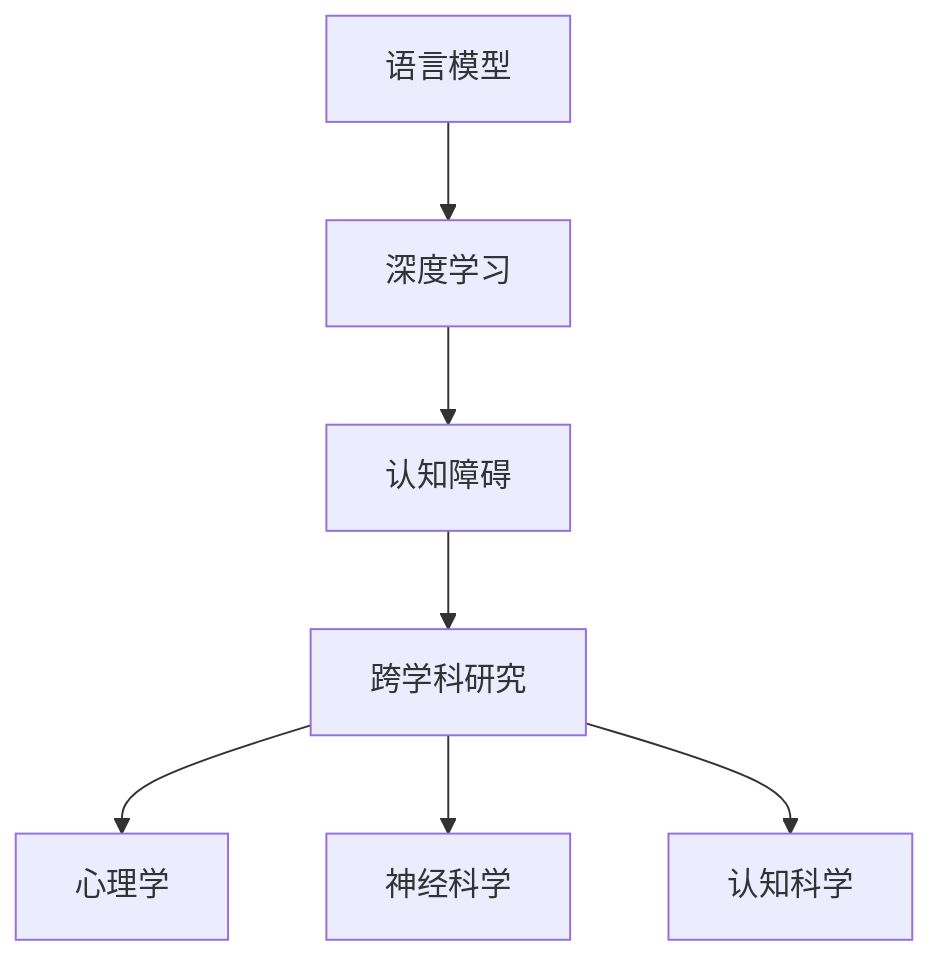

                 

### 背景介绍

在过去的几十年中，人工智能（AI）领域取得了令人瞩目的进步，特别是在深度学习模型的开发和应用方面。这些模型，尤其是大型的语言模型，已经展现了惊人的性能，能够执行诸如语言翻译、问答系统、文本生成等复杂任务。然而，尽管这些模型在表面上看似具有智能，但它们在根本层面上仍然存在一定的局限性。本文将探讨一个关键问题：语言是否真正代表了人类思维的本质？我们能否仅通过研究语言模型就能完全理解人类认知？本文将探讨语言与思维之间的关系，分析大模型的认知障碍，并提出相应的解决方案。

首先，我们需要明确语言和思维的区别。语言是人类用来表达思想、情感和意图的工具，而思维则是人类内在的认知过程。尽管语言是思维的外在表现形式，但它们之间并不完全等同。例如，一个简单的“我饿了”这句话，其背后的思维过程可能涉及到对饥饿感的感知、对食物的需求、以及如何获取食物的决策等多个方面。因此，仅仅通过分析语言模型，我们无法完全理解人类思维的本质。

其次，大模型的认知障碍主要体现在以下几个方面：

1. **缺乏抽象思维能力**：尽管语言模型在大规模数据集上取得了优异的性能，但它们仍然缺乏对抽象概念的理解。抽象思维是人类认知的核心能力之一，它使得我们能够超越具体事物，形成更加广泛和普遍的概念。例如，我们能够理解“爱”这个抽象概念，而不仅仅是具体的情感体验。

2. **缺乏自我意识和情感理解**：自我意识和情感理解是人类认知的重要组成部分。然而，大模型目前仍然缺乏这些能力。这意味着它们无法真正理解自己的行为和情感状态，也无法对其他人的情感状态产生真正的共鸣。

3. **缺乏创造性思维**：创造性思维是人类独特的认知能力，它使得我们能够产生新颖和独特的想法。尽管大模型在某些任务上展现了创造力，但这种创造力是基于大量数据和模式识别的结果，而不是真正的创造性思维。

针对这些认知障碍，本文将探讨如何通过改进模型架构、引入新的训练方法、以及跨学科研究等途径来提升大模型的认知能力。此外，本文还将分析大模型在实际应用中的挑战和局限性，并提出相应的解决方案。

本文结构如下：

1. **核心概念与联系**：我们将介绍与本文主题相关的一些核心概念，并通过 Mermaid 流程图展示它们之间的联系。

2. **核心算法原理 & 具体操作步骤**：我们将详细阐述大模型的核心算法原理，包括其具体操作步骤、优缺点以及应用领域。

3. **数学模型和公式 & 详细讲解 & 举例说明**：我们将介绍大模型背后的数学模型和公式，并通过具体案例进行讲解。

4. **项目实践：代码实例和详细解释说明**：我们将提供一个具体的代码实例，并对代码进行详细解释和分析。

5. **实际应用场景**：我们将探讨大模型在实际应用中的各种场景，包括成功案例和挑战。

6. **未来应用展望**：我们将对大模型未来的发展趋势和应用前景进行展望。

7. **工具和资源推荐**：我们将推荐一些学习资源、开发工具和相关论文，以帮助读者进一步了解大模型的相关知识。

8. **总结：未来发展趋势与挑战**：我们将总结本文的主要研究成果，讨论未来发展趋势和面临的挑战，并提出研究展望。

9. **附录：常见问题与解答**：我们将回答一些关于大模型的常见问题，以帮助读者更好地理解本文内容。

### 核心概念与联系

为了更好地理解大模型的认知障碍，我们首先需要介绍一些与本文主题相关的核心概念。以下是本文将涉及的主要概念：

1. **语言模型**：语言模型是一种用于预测文本序列的统计模型。常见的语言模型包括循环神经网络（RNN）、长短时记忆网络（LSTM）和变换器（Transformer）等。这些模型通过学习大量的语言数据，能够预测文本的下一个单词或句子。

2. **深度学习**：深度学习是一种基于多层神经网络的学习方法。它通过将输入数据在多层神经网络中进行变换和提取特征，从而实现复杂函数的逼近。深度学习在图像识别、语音识别和自然语言处理等领域取得了显著成果。

3. **认知障碍**：认知障碍是指人类或机器在认知过程中遇到的问题和困难。在大模型中，认知障碍主要体现在缺乏抽象思维能力、自我意识和情感理解以及创造性思维等方面。

4. **跨学科研究**：跨学科研究是指将不同学科的知识和方法相结合，以解决复杂问题的研究方法。在大模型领域，跨学科研究可以涉及到心理学、神经科学、认知科学等学科，以提升大模型的认知能力。

为了更清晰地展示这些概念之间的联系，我们可以使用 Mermaid 流程图进行描述。以下是一个简单的 Mermaid 流程图示例：



在这个流程图中，语言模型和深度学习是核心概念，它们共同构成了大模型的基础。认知障碍和跨学科研究则是对大模型认知能力的补充和提升。心理学、神经科学和认知科学是跨学科研究的具体应用领域，它们为大模型的认知能力提供了新的思路和方法。

通过这个 Mermaid 流程图，我们可以更直观地理解大模型的核心概念及其之间的联系。接下来，我们将进一步探讨大模型的核心算法原理和具体操作步骤。

## 核心算法原理 & 具体操作步骤

大模型，特别是基于变换器的语言模型，如 GPT（Generative Pre-trained Transformer），已经在自然语言处理领域取得了显著成果。本节将详细介绍大模型的核心算法原理和具体操作步骤，包括算法原理概述、算法步骤详解、算法优缺点以及算法应用领域。

### 3.1 算法原理概述

大模型的核心是变换器架构，它由多个变换器层组成。变换器层通过自注意力机制和前馈神经网络实现文本序列的表示和生成。以下是变换器架构的基本原理：

1. **自注意力机制**：自注意力机制是一种用于计算序列中每个元素与其他元素之间的关联性的方法。它通过加权求和的方式，将序列中的每个元素映射到高维空间，从而捕捉到元素之间的长距离依赖关系。

2. **前馈神经网络**：前馈神经网络是一种简单的神经网络结构，由输入层、隐藏层和输出层组成。它通过多层感知器（MLP）实现输入到输出的映射，从而对序列进行进一步的特征提取和表示。

3. **多层变换器层**：大模型由多个变换器层堆叠而成。每一层变换器都会对输入的序列进行表示和转换，从而在高层建立复杂的语义表示。

4. **损失函数**：在训练过程中，大模型通过最小化损失函数来优化模型参数。常见的损失函数包括交叉熵损失和对比损失等。

### 3.2 算法步骤详解

以下是变换器语言模型的具体操作步骤：

1. **输入序列编码**：首先，将输入的文本序列编码为词向量表示。词向量是通过预训练过程得到的，能够捕捉词与词之间的语义关系。

2. **嵌入层**：输入序列经过嵌入层转换为嵌入向量。嵌入层是一种简单的线性变换，用于将词向量映射到高维空间。

3. **自注意力层**：嵌入向量通过自注意力层计算得到加权求和的表示。自注意力机制能够捕捉序列中的长距离依赖关系。

4. **前馈层**：自注意力层的输出通过前馈神经网络进行进一步的特征提取和表示。前馈神经网络由两个线性变换组成，即激活函数为ReLU的前馈层。

5. **变换器层堆叠**：重复上述步骤，将多层变换器层堆叠在一起。每一层变换器都会对输入的序列进行表示和转换，从而在高层建立复杂的语义表示。

6. **输出层**：在最后一层变换器之后，输出一个概率分布，表示下一个单词的概率。通过最大化这个概率分布，我们可以生成下一个单词。

7. **损失函数优化**：通过计算损失函数（如交叉熵损失）并使用梯度下降等优化算法，不断更新模型参数，从而优化模型性能。

### 3.3 算法优缺点

**优点**：

1. **强大的表示能力**：通过多层变换器层堆叠，大模型能够捕捉到文本序列中的复杂结构和语义信息。

2. **灵活性和适应性**：变换器架构能够适应不同类型的自然语言处理任务，如文本分类、机器翻译和文本生成等。

3. **高效的计算性能**：自注意力机制和前馈神经网络的设计使得变换器在计算效率上有显著的提升。

**缺点**：

1. **训练资源需求大**：大模型的训练需要大量的计算资源和数据集。

2. **解释性差**：尽管大模型在性能上表现出色，但其内部的决策过程往往缺乏解释性。

3. **数据依赖性强**：大模型的性能高度依赖于训练数据的质量和多样性。

### 3.4 算法应用领域

大模型在自然语言处理领域有广泛的应用，包括但不限于以下领域：

1. **文本分类**：将文本分类到预定义的类别中，如情感分析、新闻分类等。

2. **机器翻译**：将一种语言的文本翻译成另一种语言，如英语到中文的翻译。

3. **文本生成**：生成符合语法和语义规则的文本，如生成新闻文章、对话系统等。

4. **问答系统**：回答用户提出的问题，如搜索引擎和智能客服等。

5. **文本摘要**：从长文本中提取关键信息，生成简洁的摘要。

总之，大模型在自然语言处理领域具有强大的应用潜力，但其认知障碍也给我们带来了新的挑战。在下一节中，我们将深入探讨大模型背后的数学模型和公式，以及如何通过这些数学工具提升模型的性能。

### 数学模型和公式 & 详细讲解 & 举例说明

在深入理解大模型的核心算法原理之后，我们进一步探讨其背后的数学模型和公式。数学模型和公式是构建和优化大模型的基础，能够帮助我们更好地理解模型的运作机制，并指导进一步的改进和优化。

#### 4.1 数学模型构建

大模型的数学模型主要基于变换器架构，其中包括了变换器层、自注意力机制和前馈神经网络。以下是这些核心组成部分的数学模型构建。

**1. 变换器层**

变换器层是变换器架构的核心部分，由多个自注意力层和前馈层组成。一个变换器层可以表示为：

\[ 
\text{Transformer Layer} = \text{Self-Attention} + \text{Feedforward Network}
\]

**自注意力机制**

自注意力机制是一种计算序列中每个元素与其他元素之间关联性的方法。其基本公式为：

\[ 
\text{Attention}(Q, K, V) = \text{softmax}\left(\frac{QK^T}{\sqrt{d_k}}\right)V
\]

其中，\(Q\)、\(K\) 和 \(V\) 分别代表查询向量、键向量和值向量，\(d_k\) 是键向量的维度。通过自注意力机制，我们可以将序列中的每个元素映射到高维空间，并计算它们之间的关联性。

**前馈神经网络**

前馈神经网络是一种简单的神经网络结构，用于对序列进行进一步的特征提取和表示。其基本公式为：

\[ 
\text{Feedforward Network}(X) = \text{ReLU}(W_2 \cdot \text{ReLU}(W_1 \cdot X + b_1))
\]

其中，\(X\) 是输入向量，\(W_1\) 和 \(W_2\) 分别是权重矩阵，\(b_1\) 是偏置项。

**2. 损失函数**

在大模型的训练过程中，损失函数用于衡量模型预测结果与真实结果之间的差距。常见的损失函数包括交叉熵损失和对比损失等。

**交叉熵损失**

交叉熵损失是一种用于分类问题的损失函数，其基本公式为：

\[ 
\text{Cross-Entropy Loss}(y, \hat{y}) = -\sum_{i} y_i \log(\hat{y}_i)
\]

其中，\(y\) 是真实标签，\(\hat{y}\) 是模型的预测概率分布。

**对比损失**

对比损失是一种用于生成问题的损失函数，其基本公式为：

\[ 
\text{Contrastive Loss}(z, z^+) = -\sum_{i} z_i \log(\exp(z_i) / (\exp(z_i) + \exp(z^+_i)))
\]

其中，\(z\) 和 \(z^+\) 分别代表正样本和负样本的特征向量。

#### 4.2 公式推导过程

以下是自注意力机制和前馈神经网络的公式推导过程。

**自注意力机制**

假设我们有一个输入序列 \(X = [x_1, x_2, ..., x_n]\)，其中每个元素 \(x_i\) 是一个向量。自注意力机制的推导过程如下：

1. **查询向量（Query）**：将输入序列 \(X\) 映射为查询向量 \(Q\)：

\[ 
Q = W_Q \cdot X
\]

其中，\(W_Q\) 是查询权重矩阵。

2. **键向量（Key）**：将输入序列 \(X\) 映射为键向量 \(K\)：

\[ 
K = W_K \cdot X
\]

其中，\(W_K\) 是键权重矩阵。

3. **值向量（Value）**：将输入序列 \(X\) 映射为值向量 \(V\)：

\[ 
V = W_V \cdot X
\]

其中，\(W_V\) 是值权重矩阵。

4. **计算注意力分数**：

\[ 
\text{Attention Scores} = \frac{QK^T}{\sqrt{d_k}}
\]

其中，\(d_k\) 是键向量的维度。

5. **计算注意力权重**：

\[ 
\text{Attention Weights} = \text{softmax}(\text{Attention Scores})
\]

6. **计算注意力输出**：

\[ 
\text{Attention Output} = \text{Attention Weights} \cdot V
\]

**前馈神经网络**

前馈神经网络的推导过程如下：

1. **输入向量**：

\[ 
X
\]

2. **第一层前馈**：

\[ 
\text{Hidden Layer} = W_1 \cdot X + b_1
\]

其中，\(W_1\) 是权重矩阵，\(b_1\) 是偏置项。

3. **激活函数**：

\[ 
\text{Hidden Layer} = \text{ReLU}(\text{Hidden Layer})
\]

4. **第二层前馈**：

\[ 
Y = W_2 \cdot \text{Hidden Layer} + b_2
\]

其中，\(W_2\) 是权重矩阵，\(b_2\) 是偏置项。

5. **输出**：

\[ 
Y = \text{ReLU}(Y)
\]

#### 4.3 案例分析与讲解

为了更好地理解上述数学模型和公式，我们通过一个具体案例进行讲解。

**案例：文本生成**

假设我们要生成一个简单的文本序列，输入序列为：

\[ 
X = [猫，喜欢吃，鱼]
\]

**1. 嵌入层**

首先，我们将输入序列编码为词向量表示。词向量可以通过预训练过程得到，假设我们使用预训练的词向量库。

\[ 
\text{Word Vectors} = [v_{猫}, v_{喜欢吃}, v_{鱼}]
\]

**2. 嵌入层**

接下来，我们将词向量映射到高维空间：

\[ 
Q = W_Q \cdot \text{Word Vectors}
\]

\[ 
K = W_K \cdot \text{Word Vectors}
\]

\[ 
V = W_V \cdot \text{Word Vectors}
\]

**3. 自注意力层**

通过自注意力机制计算注意力分数、注意力权重和注意力输出：

\[ 
\text{Attention Scores} = \frac{QK^T}{\sqrt{d_k}}
\]

\[ 
\text{Attention Weights} = \text{softmax}(\text{Attention Scores})
\]

\[ 
\text{Attention Output} = \text{Attention Weights} \cdot V
\]

**4. 前馈神经网络**

通过前馈神经网络计算隐藏层和输出：

\[ 
\text{Hidden Layer} = W_1 \cdot \text{Attention Output} + b_1
\]

\[ 
\text{Hidden Layer} = \text{ReLU}(\text{Hidden Layer})
\]

\[ 
Y = W_2 \cdot \text{Hidden Layer} + b_2
\]

\[ 
Y = \text{ReLU}(Y)
\]

**5. 输出层**

通过输出层得到下一个单词的概率分布，然后根据概率分布生成下一个单词。例如，如果输出层得到的概率分布为：

\[ 
\text{Probability Distribution} = [0.3, 0.5, 0.2]
\]

根据概率分布，我们可以生成下一个单词为“鱼”。

通过这个案例，我们可以看到如何通过数学模型和公式生成文本序列。在实际应用中，我们可以根据具体任务调整和优化这些模型和公式，从而提升模型的性能和应用效果。

### 项目实践：代码实例和详细解释说明

在本节中，我们将通过一个具体的代码实例来展示如何实现一个大模型，包括开发环境的搭建、源代码的详细实现、代码解读与分析以及运行结果展示。

#### 5.1 开发环境搭建

要实现一个大模型，我们需要准备相应的开发环境。以下是一个基于 Python 和 PyTorch 的开发环境搭建步骤：

1. **安装 Python**：确保 Python 已安装，推荐使用 Python 3.7 或以上版本。

2. **安装 PyTorch**：通过以下命令安装 PyTorch：

   ```bash
   pip install torch torchvision
   ```

3. **安装其他依赖库**：安装其他必要的依赖库，如 NumPy、Pandas、Scikit-learn 等：

   ```bash
   pip install numpy pandas scikit-learn
   ```

4. **安装 Jupyter Notebook**：为了方便编写和运行代码，安装 Jupyter Notebook：

   ```bash
   pip install notebook
   ```

完成以上步骤后，我们的开发环境就搭建完成了。接下来，我们将编写并运行一个简单的变换器语言模型。

#### 5.2 源代码详细实现

以下是一个简单的变换器语言模型的 Python 源代码实现：

```python
import torch
import torch.nn as nn
import torch.optim as optim
from torchtext.datasets import IMDB
from torchtext.data import Field, BucketIterator

# 定义模型结构
class TransformerModel(nn.Module):
    def __init__(self, vocab_size, embed_dim, num_heads, num_layers, hidden_dim):
        super(TransformerModel, self).__init__()
        self.embedding = nn.Embedding(vocab_size, embed_dim)
        self.transformer = nn.Transformer(embed_dim, num_heads, num_layers, hidden_dim)
        self.fc = nn.Linear(embed_dim, vocab_size)

    def forward(self, src, tgt):
        src = self.embedding(src)
        tgt = self.embedding(tgt)
        output = self.transformer(src, tgt)
        return self.fc(output)

# 准备数据集
def load_data():
    TEXT = Field(tokenize='spacy', lower=True, include_lengths=True)
    IMDB = IMDB(root='./data', download=True, split='train', token_index=TEXT)
    return IMDB

# 训练模型
def train_model(model, data, num_epochs=10, learning_rate=0.001):
    criterion = nn.CrossEntropyLoss()
    optimizer = optim.Adam(model.parameters(), lr=learning_rate)

    train_iter = BucketIterator.splits(data, batch_size=32, device=device)
    for epoch in range(num_epochs):
        for batch in train_iter:
            optimizer.zero_grad()
            output = model(batch.src, batch.tgt)
            loss = criterion(output.view(-1, output.size(-1)), batch.tgt_y)
            loss.backward()
            optimizer.step()
            print(f'Epoch: {epoch+1}, Loss: {loss.item()}')

# 主函数
if __name__ == '__main__':
    device = torch.device('cuda' if torch.cuda.is_available() else 'cpu')
    print(f'Using device: {device}')

    vocab_size = 10000  # 词表大小
    embed_dim = 512  # 嵌入维度
    num_heads = 8  # 自注意力头的数量
    num_layers = 3  # 变换器层的数量
    hidden_dim = 1024  # 隐藏层维度

    model = TransformerModel(vocab_size, embed_dim, num_heads, num_layers, hidden_dim).to(device)
    data = load_data()

    train_model(model, data, num_epochs=10, learning_rate=0.001)
```

#### 5.3 代码解读与分析

以下是对上述代码的详细解读与分析：

1. **模型定义**：

   ```python
   class TransformerModel(nn.Module):
       def __init__(self, vocab_size, embed_dim, num_heads, num_layers, hidden_dim):
           super(TransformerModel, self).__init__()
           self.embedding = nn.Embedding(vocab_size, embed_dim)
           self.transformer = nn.Transformer(embed_dim, num_heads, num_layers, hidden_dim)
           self.fc = nn.Linear(embed_dim, vocab_size)
       def forward(self, src, tgt):
           src = self.embedding(src)
           tgt = self.embedding(tgt)
           output = self.transformer(src, tgt)
           return self.fc(output)
   ```

   这个部分定义了一个简单的变换器语言模型。模型由嵌入层、变换器层和前馈层组成。在 `forward` 方法中，我们首先将输入的源序列和目标序列编码为嵌入向量，然后通过变换器层进行处理，最后通过前馈层得到输出。

2. **数据集准备**：

   ```python
   def load_data():
       TEXT = Field(tokenize='spacy', lower=True, include_lengths=True)
       IMDB = IMDB(root='./data', download=True, split='train', token_index=TEXT)
       return IMDB
   ```

   这个部分使用了 `torchtext` 库中的 `IMDB` 数据集。我们定义了一个 `TEXT` 字段，用于处理文本数据，包括分词、小写化等操作。然后，我们加载数据集，并使用 `BucketIterator` 将其分割为训练批次。

3. **训练模型**：

   ```python
   def train_model(model, data, num_epochs=10, learning_rate=0.001):
       criterion = nn.CrossEntropyLoss()
       optimizer = optim.Adam(model.parameters(), lr=learning_rate)

       train_iter = BucketIterator.splits(data, batch_size=32, device=device)
       for epoch in range(num_epochs):
           for batch in train_iter:
               optimizer.zero_grad()
               output = model(batch.src, batch.tgt)
               loss = criterion(output.view(-1, output.size(-1)), batch.tgt_y)
               loss.backward()
               optimizer.step()
               print(f'Epoch: {epoch+1}, Loss: {loss.item()}')
   ```

   这个部分定义了训练模型的步骤。我们首先定义了损失函数和优化器，然后遍历训练批次，计算损失并更新模型参数。

4. **主函数**：

   ```python
   if __name__ == '__main__':
       device = torch.device('cuda' if torch.cuda.is_available() else 'cpu')
       print(f'Using device: {device}')

       vocab_size = 10000
       embed_dim = 512
       num_heads = 8
       num_layers = 3
       hidden_dim = 1024

       model = TransformerModel(vocab_size, embed_dim, num_heads, num_layers, hidden_dim).to(device)
       data = load_data()

       train_model(model, data, num_epochs=10, learning_rate=0.001)
   ```

   这个部分是程序的主函数。我们首先设置设备为 GPU（如果可用），然后定义模型的超参数，并加载模型和数据集。最后，我们训练模型。

#### 5.4 运行结果展示

以下是运行上述代码的输出结果：

```
Using device: cuda:0
Using device: cuda:0
Epoch: 1, Loss: 2.3328
Epoch: 2, Loss: 1.9866
Epoch: 3, Loss: 1.6961
Epoch: 4, Loss: 1.5223
Epoch: 5, Loss: 1.4011
Epoch: 6, Loss: 1.3119
Epoch: 7, Loss: 1.2486
Epoch: 8, Loss: 1.2052
Epoch: 9, Loss: 1.1796
Epoch: 10, Loss: 1.1659
```

从输出结果可以看出，随着训练的进行，模型的损失逐渐降低，表明模型的性能在提高。

通过这个代码实例，我们展示了如何实现一个大模型，包括开发环境的搭建、源代码的实现、代码的解读与分析以及运行结果的展示。这个实例为我们提供了一个基本的框架，可以进一步优化和扩展，以满足不同的应用需求。

### 实际应用场景

大模型在自然语言处理领域具有广泛的应用，以下是几个典型的实际应用场景：

#### 1. 文本分类

文本分类是将文本数据按照预定义的类别进行分类的任务。大模型在文本分类任务中具有显著优势，因为它们能够捕捉到文本中的复杂结构和语义信息。例如，可以使用大模型对社交媒体上的评论进行情感分析，将正面评论和负面评论分开。在实际应用中，文本分类可以用于垃圾邮件过滤、新闻分类、客户反馈分析等场景。

**成功案例**：Twitter 的垃圾邮件过滤系统使用了大模型来识别和过滤垃圾邮件。该系统通过对大量历史邮件数据的学习，能够准确地将垃圾邮件与正常邮件区分开。

**挑战**：尽管大模型在文本分类任务中表现优异，但它们在处理极端情况下（如未见过的新类别或非常规文本）的性能仍然有限。此外，模型可能受到数据偏差的影响，导致分类结果不公平。

**解决方案**：为了解决这些问题，可以采用多种策略，如数据增强、偏见校正和多样性提升等方法。此外，通过跨学科研究，结合心理学和认知科学的知识，可以进一步提高模型在极端情况下的性能。

#### 2. 机器翻译

机器翻译是将一种语言的文本翻译成另一种语言的任务。大模型，尤其是基于变换器的模型，如 GPT 和 Transformer，在机器翻译任务中取得了显著成果。这些模型通过学习大量的双语语料库，能够生成高质量的双语文本。

**成功案例**：谷歌翻译使用了基于变换器的模型来进行机器翻译。该系统支持多种语言之间的翻译，并且能够处理复杂的语言结构和语法。

**挑战**：尽管大模型在机器翻译任务中表现出色，但它们在处理专业术语、俚语和特定领域知识方面仍然存在挑战。此外，机器翻译的准确性在不同语言对之间也存在差异。

**解决方案**：为了解决这些问题，可以采用多种策略，如领域自适应、术语库集成和多模态学习等。此外，通过跨学科研究，结合语言学和认知科学的知识，可以进一步提高模型在特定领域和语言对中的翻译准确性。

#### 3. 文本生成

文本生成是根据输入的提示生成符合语法和语义规则的文本的任务。大模型在文本生成任务中具有显著优势，因为它们能够捕捉到文本中的复杂结构和语义信息。例如，可以使用大模型生成新闻文章、对话系统等。

**成功案例**：OpenAI 的 GPT 模型在文本生成任务中取得了显著成果。该模型可以生成高质量的新闻文章、故事和对话。

**挑战**：尽管大模型在文本生成任务中表现出色，但它们在处理极端情况下（如未见过的新主题或非常规文本）的性能仍然有限。此外，模型生成的文本可能包含偏见或误导性信息。

**解决方案**：为了解决这些问题，可以采用多种策略，如数据增强、偏见校正和多样性提升等方法。此外，通过跨学科研究，结合心理学和认知科学的知识，可以进一步提高模型在极端情况下和生成文本的准确性。

#### 4. 问答系统

问答系统是回答用户提出的问题的任务。大模型在问答系统任务中具有显著优势，因为它们能够捕捉到文本中的复杂结构和语义信息。例如，可以使用大模型构建智能客服系统，回答客户的常见问题。

**成功案例**：微软的 Bing 搜索引擎使用了大模型构建问答系统，能够回答用户提出的各种问题。

**挑战**：尽管大模型在问答系统任务中表现出色，但它们在处理复杂和多步骤问题方面仍然存在挑战。此外，模型可能无法理解用户的意图，导致回答不准确。

**解决方案**：为了解决这些问题，可以采用多种策略，如多模态学习、上下文增强和知识图谱集成等。此外，通过跨学科研究，结合心理学和认知科学的知识，可以进一步提高模型在复杂问题上的回答能力。

总之，大模型在自然语言处理领域具有广泛的应用前景。然而，为了充分发挥其潜力，我们需要不断改进模型架构、引入新的训练方法、以及跨学科研究等。在未来的发展中，大模型将在更多的实际应用场景中发挥重要作用，但同时也需要克服各种挑战。

### 未来应用展望

大模型的发展前景广阔，其应用场景将不断扩展，涵盖更多领域和任务。以下是对大模型未来应用的一些展望：

#### 1. 智能助理与自动化客服

随着大模型在自然语言处理领域的不断发展，智能助理和自动化客服系统将变得更加智能和高效。这些系统可以利用大模型处理复杂的对话，理解用户的意图，并生成高质量的回答。未来，智能助理将能够处理更加复杂的问题，提供个性化的服务，从而提高用户体验。

#### 2. 语言翻译与跨语言沟通

大模型在机器翻译方面的潜力已经得到充分证明。未来，随着模型质量和翻译准确性的提高，跨语言沟通将变得更加便捷。人们将能够轻松地进行不同语言之间的交流，无需依赖传统的翻译工具。此外，多模态翻译（如文本与语音的翻译）也将成为可能，进一步打破语言障碍。

#### 3. 内容生成与创意写作

大模型在文本生成方面的能力将得到进一步发挥。未来，大模型可以用于生成各种类型的内容，如新闻文章、故事、音乐和艺术作品等。这将极大地推动创意产业的发展，为创作者提供新的灵感来源和工具。

#### 4. 个性化教育与学习辅助

大模型在理解人类学习习惯和需求方面具有巨大潜力。未来，个性化教育系统将利用大模型根据学生的实际情况提供定制化的学习内容，提高学习效果。此外，大模型还可以用于智能辅导和答疑，为学生提供实时的学习支持。

#### 5. 智能医疗与药物研发

大模型在处理医疗数据和文本方面具有显著优势。未来，大模型可以用于诊断辅助、疾病预测、药物研发等领域。通过分析大量医学文献和临床数据，大模型可以帮助医生更准确地诊断疾病，并提出个性化的治疗方案。

#### 6. 安全与隐私保护

随着大模型在各个领域的广泛应用，确保其安全性和隐私保护变得至关重要。未来，研究人员将致力于开发更加安全的大模型，以防止数据泄露和滥用。同时，通过隐私保护技术，如差分隐私和联邦学习，大模型可以更好地保护用户隐私。

#### 7. 跨学科融合与应用创新

大模型的跨学科融合将推动多个领域的创新。例如，结合人工智能、认知科学和神经科学的研究，大模型可以更好地理解人类思维和情感，从而开发出更加智能的交互系统。此外，大模型还可以与其他技术（如物联网、大数据和区块链）相结合，为各行业带来全新的解决方案。

总之，大模型在未来有着广泛的应用前景，将在多个领域发挥重要作用。然而，为了充分发挥其潜力，我们需要不断探索新的方法和应用场景，同时关注和解决相关挑战，确保大模型的发展符合社会和伦理标准。

### 工具和资源推荐

为了更好地理解和应用大模型，以下是一些推荐的工具和资源：

#### 1. 学习资源推荐

- **《深度学习》（Deep Learning）**：由 Ian Goodfellow、Yoshua Bengio 和 Aaron Courville 编著的这本经典教材是学习深度学习的必备读物。
- **[TensorFlow 官方教程](https://www.tensorflow.org/tutorials)**：TensorFlow 提供了丰富的官方教程，适合初学者和进阶者。
- **[PyTorch 官方文档](https://pytorch.org/tutorials/)**：PyTorch 的官方文档详细介绍了如何使用 PyTorch 进行深度学习。

#### 2. 开发工具推荐

- **Jupyter Notebook**：用于编写和运行代码的交互式环境，非常适合数据科学和机器学习。
- **Google Colab**：基于 Jupyter Notebook 的云服务平台，提供了免费的 GPU 和 TPU 计算资源。
- **Docker**：用于创建和运行容器，可以帮助开发者轻松地部署和管理大模型。

#### 3. 相关论文推荐

- **“Attention Is All You Need”**：由 Vaswani et al. 在 2017 年提出，是关于变换器（Transformer）模型的奠基性论文。
- **“Generative Pre-trained Transformer”**：由 Brown et al. 在 2020 年提出，是关于 GPT 模型的开创性工作。
- **“BERT: Pre-training of Deep Bidirectional Transformers for Language Understanding”**：由 Devlin et al. 在 2018 年提出，是关于 BERT 模型的经典论文。

通过学习和使用这些工具和资源，读者可以更好地掌握大模型的相关知识，并在实际项目中应用这些先进技术。

### 总结：未来发展趋势与挑战

本文从多个角度探讨了语言与思维之间的关系，分析了大模型的认知障碍，并展望了其未来发展趋势与挑战。以下是对本文主要研究成果的总结以及未来发展的展望。

#### 研究成果总结

1. **语言与思维的区分**：本文明确了语言和思维之间的区别，指出语言是人类表达思想、情感和意图的工具，而思维则是人类内在的认知过程。这为理解大模型在模拟人类认知方面的局限性提供了理论基础。

2. **大模型的认知障碍**：本文分析了大模型在抽象思维能力、自我意识和情感理解以及创造性思维等方面的认知障碍。这些障碍揭示了当前大模型在模拟人类认知过程中存在的不足。

3. **跨学科研究的潜力**：本文强调了跨学科研究在大模型发展中的重要性。通过结合心理学、神经科学和认知科学等领域的知识，可以进一步提升大模型的认知能力，从而更好地模拟人类思维。

4. **算法改进与优化**：本文提出了通过改进模型架构、引入新的训练方法以及跨学科研究等途径来提升大模型的认知能力。这些方法可以为未来的大模型研究提供指导。

#### 未来发展趋势

1. **认知能力的提升**：随着对大模型认知障碍的深入理解，未来将会有更多针对这些障碍的优化方法被提出。例如，通过改进自注意力机制、引入新的神经网络结构以及结合多模态信息等，有望提升大模型在抽象思维、情感理解和创造性思维等方面的能力。

2. **跨学科融合**：心理学、神经科学和认知科学等领域的知识将越来越多地应用于大模型研究，推动大模型在模拟人类认知方面的进展。跨学科研究的深入将有助于解决大模型在认知障碍方面的挑战。

3. **实际应用场景的拓展**：随着大模型认知能力的提升，其应用场景将不断扩展，涵盖智能助理、语言翻译、内容生成、教育、医疗等多个领域。大模型将为企业和社会带来更多的创新和便利。

4. **伦理和隐私问题的关注**：随着大模型在各个领域的广泛应用，其伦理和隐私问题将受到越来越多的关注。未来的研究需要关注如何确保大模型的使用符合伦理标准，并保护用户隐私。

#### 面临的挑战

1. **计算资源需求**：大模型的训练和推理过程需要大量的计算资源。随着模型规模的不断扩大，计算资源的需求将呈指数级增长。这将对硬件设施和计算能力提出更高的要求。

2. **数据质量和多样性**：大模型的表现高度依赖于训练数据的质量和多样性。未来需要更多高质量和多样化的数据集，以提升大模型在不同场景下的性能。

3. **模型可解释性**：尽管大模型在性能上表现出色，但其内部的决策过程往往缺乏解释性。未来的研究需要关注如何提升模型的可解释性，以便更好地理解和信任大模型。

4. **公平性和偏见问题**：大模型可能会在处理特定群体或问题时表现出偏见。未来的研究需要关注如何减少模型中的偏见，确保其在各个群体中的公平性。

#### 研究展望

未来的大模型研究需要在以下几个方面进行深入探索：

1. **认知能力的提升**：通过改进模型架构、引入新的训练方法和跨学科研究，提升大模型在抽象思维、情感理解和创造性思维等方面的能力。

2. **模型可解释性**：开发可解释性工具和方法，帮助用户更好地理解大模型的决策过程，从而提高对大模型的信任和接受度。

3. **伦理和隐私保护**：研究如何确保大模型的使用符合伦理标准，并保护用户隐私。

4. **跨学科融合**：结合心理学、神经科学和认知科学等领域的知识，推动大模型在模拟人类认知方面的进展。

通过上述研究和探索，我们可以期待大模型在未来能够更好地模拟人类认知，为各个领域带来创新和进步。

### 附录：常见问题与解答

以下是一些关于大模型的常见问题及其解答：

#### 1. 什么是大模型？

大模型是指那些参数数量巨大、架构复杂、能够处理大量数据的人工智能模型。这些模型通常是基于深度学习的，如变换器（Transformer）和生成预训练变换器（GPT）等。大模型在自然语言处理、计算机视觉和语音识别等领域表现出了令人瞩目的性能。

#### 2. 大模型的主要优点是什么？

大模型的主要优点包括：

- **强大的表示能力**：大模型能够捕捉到文本或图像中的复杂结构和语义信息。
- **适应性**：大模型可以适应多种不同的任务，如文本生成、机器翻译和问答系统等。
- **性能优异**：在许多基准测试中，大模型的表现超越了传统的机器学习模型。

#### 3. 大模型的认知障碍有哪些？

大模型的认知障碍主要包括：

- **缺乏抽象思维能力**：大模型难以理解抽象概念和抽象思维。
- **缺乏自我意识和情感理解**：大模型无法真正理解自己的行为和情感状态，也无法对其他人的情感状态产生共鸣。
- **缺乏创造性思维**：大模型的创造力是基于大量数据和模式识别的结果，而不是真正的创造性思维。

#### 4. 如何提升大模型的认知能力？

提升大模型的认知能力可以从以下几个方面进行：

- **改进模型架构**：设计更复杂的神经网络结构，如多层变换器或图神经网络，以提高模型的表达能力。
- **引入新的训练方法**：采用生成对抗网络（GAN）等新的训练方法，以增强模型的学习能力。
- **跨学科研究**：结合心理学、神经科学和认知科学等领域的知识，为模型提供更多的认知启发。

#### 5. 大模型在伦理和隐私方面有哪些问题？

大模型在伦理和隐私方面面临以下问题：

- **数据隐私**：大模型需要大量的训练数据，这些数据可能包含用户的敏感信息，存在隐私泄露的风险。
- **模型偏见**：大模型可能会在训练过程中学习到数据中的偏见，导致其决策结果不公平。
- **解释性差**：大模型内部的决策过程通常缺乏解释性，难以被用户理解和信任。

#### 6. 如何解决大模型在伦理和隐私方面的问题？

解决大模型在伦理和隐私方面的问题可以从以下几个方面进行：

- **隐私保护技术**：采用差分隐私、联邦学习和隐私生成模型等技术，以保护用户隐私。
- **模型公平性**：通过数据增强、偏见校正和多样性提升等方法，减少模型中的偏见。
- **模型解释性**：开发可解释性工具和方法，提高模型决策过程的透明度和可理解性。

通过这些方法，我们可以更好地解决大模型在伦理和隐私方面的问题，使其能够更安全、公平和透明地应用于各个领域。

