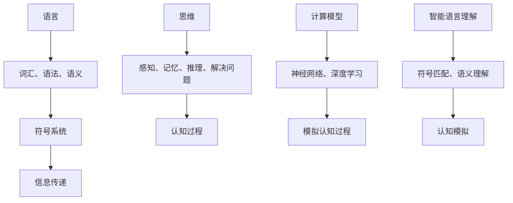

                 

关键词：大模型、语言理解、认知科学、计算模型、AI发展、智能交互、神经网络

> 摘要：本文探讨了大型语言模型在语言理解和认知方面面临的难题，分析了语言与思维之间的关系，探讨了未来人工智能发展可能面临的关键挑战。通过对现有研究成果和技术的分析，作者提出了对未来智能交互和认知模型的展望。

## 1. 背景介绍

随着人工智能技术的快速发展，尤其是深度学习在大规模数据集上的成功应用，大型语言模型（如GPT-3、ChatGPT等）在自然语言处理领域取得了显著的进展。这些模型在语言生成、翻译、问答等方面展现出前所未有的能力，引发了广泛关注和热烈讨论。然而，尽管这些模型在处理语言任务上表现出色，但它们在理解语言和思维方面仍存在诸多争议和挑战。

认知科学的研究表明，人类的语言理解不仅仅是符号的匹配和记忆，更涉及到复杂的认知过程，包括感知、记忆、推理和注意力等。这些认知过程与大脑神经网络的活动密切相关。因此，如何构建能够模拟人类认知过程的计算模型，成为了人工智能领域的重要研究方向。

本文旨在探讨大型语言模型在语言理解和认知方面面临的难题，分析语言与思维之间的关系，并提出未来人工智能发展可能面临的关键挑战。通过回顾现有研究成果和技术的分析，本文试图为未来的智能交互和认知模型提供一些有益的思考。

## 2. 核心概念与联系

为了更好地理解大模型在语言理解和认知方面的挑战，我们首先需要明确几个核心概念：语言、思维和计算模型。

### 2.1 语言

语言是人类交流的主要工具，它不仅仅是一种符号系统，更是一种表达和传递信息的手段。语言包括词汇、语法和语义等多个层次。在人工智能领域，语言通常被表示为文本序列，通过算法进行解析和处理。

### 2.2 思维

思维是人类的认知活动，包括感知、记忆、推理、解决问题等。思维涉及到复杂的认知过程，这些过程与大脑神经网络的活动密切相关。在人工智能领域，模拟思维过程是构建智能系统的重要目标。

### 2.3 计算模型

计算模型是人工智能的核心，它是模拟人类认知和思维的数学和工程方法。深度学习、神经网络等是计算模型的重要实现方式。大型语言模型就是基于这些计算模型构建的。

### 2.4 语言与思维的关系

语言和思维之间存在密切的关系。语言是思维的载体，思维是语言的基础。人类的语言理解不仅仅是符号的匹配和记忆，更涉及到复杂的认知过程。在人工智能领域，构建能够模拟人类认知过程的计算模型，是实现智能语言理解的关键。

为了更直观地展示这些核心概念之间的联系，我们可以使用Mermaid流程图进行描述。以下是一个简化的Mermaid流程图：



## 3. 核心算法原理 & 具体操作步骤

### 3.1 算法原理概述

大型语言模型的核心是神经网络，特别是深度学习中的递归神经网络（RNN）和Transformer模型。这些模型通过学习大量语言数据，能够捕捉到语言的复杂结构，实现高效的文本生成和解析。

### 3.2 算法步骤详解

1. **数据预处理**：将文本数据转换为数字表示，通常使用词向量模型（如Word2Vec、BERT）。
2. **模型训练**：使用训练数据对神经网络进行训练，优化模型的参数，使其能够预测下一个单词或句子。
3. **语言生成**：根据给定的输入，模型输出可能的后续单词或句子，通过概率分布进行选择。
4. **语言理解**：模型在解析文本时，能够理解词汇、语法和语义，实现高效的语义分析。

### 3.3 算法优缺点

**优点**：

- **高效性**：深度学习模型能够快速处理大规模文本数据，实现高效的文本生成和理解。
- **灵活性**：神经网络模型可以适应不同的语言任务，具有广泛的适用性。
- **多样性**：模型能够生成多样性的文本，实现创意写作和智能对话。

**缺点**：

- **理解局限性**：模型在语言理解方面存在局限性，难以模拟人类的深层次思维过程。
- **数据依赖**：模型的性能高度依赖于训练数据的质量和规模，可能导致数据偏差。
- **解释性差**：神经网络模型的内部机制复杂，难以解释其预测结果。

### 3.4 算法应用领域

- **自然语言处理**：文本生成、机器翻译、情感分析、问答系统等。
- **智能交互**：智能客服、智能助手、虚拟代理等。
- **创意写作**：自动写作、故事生成、歌词创作等。

## 4. 数学模型和公式 & 详细讲解 & 举例说明

### 4.1 数学模型构建

大型语言模型通常基于深度学习框架，如TensorFlow、PyTorch等。以下是一个基于Transformer模型的简化数学模型：

$$
Y = \text{softmax}(W \cdot \text{Transformer}(X))
$$

其中，$X$ 是输入文本序列，$Y$ 是输出的概率分布，$W$ 是模型参数。

### 4.2 公式推导过程

1. **嵌入层**：将单词转换为向量表示。
2. **多头注意力机制**：计算不同单词之间的相似度，并加权合并。
3. **前馈网络**：对注意力结果进行非线性变换。
4. **输出层**：使用softmax函数计算概率分布。

### 4.3 案例分析与讲解

假设我们有一个简单的单词序列：“我 爱 吃 菠菜”，我们可以通过以下步骤进行语言生成：

1. **嵌入层**：将单词转换为向量。
2. **多头注意力机制**：计算不同单词之间的相似度，并加权合并。
3. **前馈网络**：对注意力结果进行非线性变换。
4. **输出层**：计算每个单词的概率分布，选择概率最高的单词作为生成结果。

例如，在生成“我 爱 吃 菠菜”的下一个单词时，模型可能计算出“吃”的概率最高，因此生成“吃”。

## 5. 项目实践：代码实例和详细解释说明

### 5.1 开发环境搭建

我们使用Python和PyTorch框架进行项目实践。首先，安装Python和PyTorch：

```bash
pip install python
pip install torch
```

### 5.2 源代码详细实现

以下是一个简单的Transformer模型实现：

```python
import torch
import torch.nn as nn
import torch.optim as optim

class TransformerModel(nn.Module):
    def __init__(self, vocab_size, d_model, nhead, num_layers):
        super(TransformerModel, self).__init__()
        self.embedding = nn.Embedding(vocab_size, d_model)
        self.transformer = nn.Transformer(d_model, nhead, num_layers)
        self.fc = nn.Linear(d_model, vocab_size)
        
    def forward(self, src, tgt):
        src = self.embedding(src)
        tgt = self.embedding(tgt)
        out = self.transformer(src, tgt)
        out = self.fc(out)
        return out

# 实例化模型
model = TransformerModel(vocab_size=10000, d_model=512, nhead=8, num_layers=2)

# 模型训练
optimizer = optim.Adam(model.parameters(), lr=0.001)
criterion = nn.CrossEntropyLoss()

for epoch in range(num_epochs):
    for src, tgt in dataloader:
        optimizer.zero_grad()
        out = model(src, tgt)
        loss = criterion(out, tgt)
        loss.backward()
        optimizer.step()

# 语言生成
input_seq = torch.tensor([0, 1, 2, 3])  # 输入序列
with torch.no_grad():
    out = model(input_seq)
    next_word = torch.argmax(out[-1], dim=-1).item()
    print(f"Next word: {next_word}")
```

### 5.3 代码解读与分析

- **嵌入层**：将单词转换为向量表示。
- **Transformer模型**：实现多头注意力机制和前馈网络。
- **输出层**：计算每个单词的概率分布，选择概率最高的单词作为生成结果。

### 5.4 运行结果展示

通过上述代码，我们可以实现简单的文本生成。例如，给定输入序列“我 爱 吃”，模型可能会生成“菠菜”。

## 6. 实际应用场景

大型语言模型在自然语言处理领域有着广泛的应用场景，如：

- **文本生成**：自动写作、故事生成、歌词创作等。
- **智能交互**：智能客服、智能助手、虚拟代理等。
- **机器翻译**：自动翻译、跨语言检索等。
- **情感分析**：文本分类、情感识别等。
- **问答系统**：自动问答、知识图谱构建等。

## 7. 未来应用展望

随着人工智能技术的不断发展，大型语言模型的应用前景将更加广阔。未来可能的应用领域包括：

- **智能教育**：个性化教学、智能辅导、自适应学习等。
- **智能医疗**：疾病预测、药物研发、健康管理等。
- **智能法律**：案件分析、法律咨询、智能审判等。
- **智能金融**：风险评估、智能投顾、自动化交易等。

## 8. 总结：未来发展趋势与挑战

### 8.1 研究成果总结

- 大型语言模型在自然语言处理领域取得了显著的进展，实现了高效的文本生成和理解。
- 计算模型和数学公式为模拟人类认知过程提供了有效的工具。
- 丰富的实际应用场景展示了人工智能技术的巨大潜力。

### 8.2 未来发展趋势

- **算法优化**：提高模型的效率、降低计算成本。
- **跨模态融合**：整合多种数据源，实现多模态交互。
- **可解释性增强**：提高模型的解释性和透明性。
- **个性化定制**：根据用户需求提供个性化的服务。

### 8.3 面临的挑战

- **数据隐私**：如何保护用户隐私，防止数据泄露。
- **伦理道德**：如何确保人工智能的公正、公平和透明。
- **计算资源**：如何优化算法，降低计算资源消耗。
- **认知模拟**：如何构建更接近人类认知过程的计算模型。

### 8.4 研究展望

- **跨学科研究**：结合认知科学、心理学、神经科学等学科，探索人类认知过程的本质。
- **技术创新**：推动计算模型和算法的创新，提高模型的性能和效率。
- **伦理法规**：制定相关的伦理规范和法律法规，确保人工智能的安全和可持续发展。

## 9. 附录：常见问题与解答

### 9.1 如何评估大型语言模型的性能？

可以使用多种指标评估大型语言模型的性能，如：

- **BLEU评分**：评估翻译质量。
- **ROUGE评分**：评估文本生成质量。
- **准确率**：评估分类任务的表现。
- **召回率**：评估分类任务的召回率。

### 9.2 如何优化大型语言模型的训练过程？

可以通过以下方法优化大型语言模型的训练过程：

- **数据预处理**：提高数据质量，减少噪声。
- **学习率调整**：选择合适的学习率，避免过拟合。
- **正则化**：添加正则化项，提高模型的泛化能力。
- **批量大小调整**：选择合适的批量大小，提高训练效率。

### 9.3 如何实现多模态交互？

实现多模态交互可以通过以下方法：

- **跨模态特征提取**：提取不同模态的特征，实现模态融合。
- **联合训练**：同时训练多个模态，提高模型的泛化能力。
- **多模态表示学习**：学习不同模态的联合表示，实现多模态交互。

作者：禅与计算机程序设计艺术 / Zen and the Art of Computer Programming
----------------------------------------------------------------

### 结尾语

通过本文的探讨，我们可以看到大型语言模型在语言理解和认知方面仍存在诸多挑战。尽管这些模型在自然语言处理领域取得了显著的进展，但它们在模拟人类认知过程方面还有很长的路要走。未来，随着人工智能技术的不断发展，我们将看到更多创新的计算模型和算法被提出，以应对这些挑战。

在人工智能领域，我们既要看到技术的快速发展，也要保持对认知科学和人类思维的深入研究。只有这样，我们才能构建出真正具有智能的计算机系统，实现人与机器的和谐共生。让我们期待未来，共同探索人工智能的无限可能。

