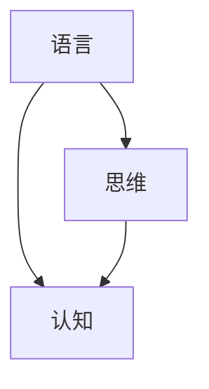

                 

 在当今的人工智能领域中，大型语言模型（例如GPT-3、BERT等）取得了惊人的进展。这些模型不仅在自然语言处理任务中表现出色，还在图像识别、音频处理、视频理解等多个领域展现出强大的潜力。然而，随着模型规模的不断扩大，我们开始面临一个严峻的问题：这些大型语言模型是如何理解和处理的，它们是否具有类似于人类的思维过程？

本文将探讨语言与思维的差异，并分析大模型在认知过程中的挑战。我们首先回顾语言和思维的基本概念，然后深入分析大模型的工作原理，探讨它们在处理语言和理解概念方面的局限性。此外，本文还将讨论大模型在实际应用中的表现，并展望未来的发展趋势和挑战。

## 1. 背景介绍

近年来，人工智能领域取得了令人瞩目的成就，尤其是深度学习技术在图像识别、语音识别、自然语言处理等领域的突破。随着计算能力的提升和海量数据集的可用性，大型语言模型（如GPT-3、BERT等）应运而生，并在多个自然语言处理任务中取得了优异的成绩。

然而，这些大型语言模型的内部工作机制仍然是一个谜。尽管它们在语言理解和生成方面表现出色，但我们对其认知过程的理解仍然有限。大模型是否具有类似人类的思维方式，是否能够理解抽象概念和逻辑推理，这些问题引发了广泛的关注。

本文旨在探讨语言与思维的差异，分析大模型在认知过程中的挑战，并探讨未来研究的方向。通过本文的讨论，我们希望能够更好地理解大模型的局限性，为其在实际应用中的发展提供指导。

## 2. 核心概念与联系

在探讨大模型的认知挑战之前，我们首先需要了解一些核心概念，包括语言、思维和认知。这些概念之间的联系构成了我们分析的基础。

### 2.1 语言

语言是人类沟通和思考的主要工具，它不仅包含了语法、词汇和语义等结构，还承载了丰富的文化和社会意义。语言的研究领域包括语言学、心理学、哲学等多个学科。在自然语言处理（NLP）中，语言被视为一种符号系统，通过组合基本符号（如单词和短语）生成具有特定意义的句子。

### 2.2 思维

思维是人类认知过程的核心，它涉及信息的获取、处理、存储和运用。思维可以分为多种类型，如逻辑思维、创造性思维、批判性思维等。逻辑思维强调推理和证明，而创造性思维则关注新想法和新解决方案的生成。批判性思维则涉及对信息来源、证据和论证过程进行评估。

### 2.3 认知

认知是大脑处理信息和知识的过程，包括感知、记忆、注意、判断和决策等。认知科学研究大脑如何获取和处理信息，以及这些过程如何影响我们的行为和决策。在人工智能领域，认知科学为设计更智能的算法提供了理论基础。

### 2.4 核心概念的联系

语言和思维是密不可分的，语言是思维的表达形式，而思维则是语言的基础。认知则将语言和思维结合起来，使我们能够理解和运用语言，进行有效的沟通和思考。

以下是一个用Mermaid绘制的流程图，展示了这些核心概念之间的联系：



在接下来的章节中，我们将进一步探讨大模型在处理这些核心概念时的挑战。

## 3. 核心算法原理 & 具体操作步骤

### 3.1 算法原理概述

大型语言模型（如GPT-3、BERT等）的核心算法是基于深度学习技术的，这些算法通过大量数据的学习和训练，实现对语言的建模和理解。其中，GPT-3采用了生成式预训练变换器（Generative Pre-trained Transformer）架构，而BERT（Bidirectional Encoder Representations from Transformers）则采用了双向变换器架构。

### 3.2 算法步骤详解

#### 3.2.1 GPT-3算法步骤

1. **预训练**：GPT-3在训练过程中首先使用了一个庞大的语料库，通过无监督的方式学习语言的统计规律和模式。这一过程称为预训练。

2. **微调**：在预训练的基础上，GPT-3针对特定的任务进行微调，以适应特定的任务需求。微调过程通常包括在任务相关的数据集上进行优化。

3. **生成文本**：微调后的GPT-3可以生成高质量的文本。通过输入一个种子文本，GPT-3可以生成与其相关的内容，实现文本的自动生成和扩展。

#### 3.2.2 BERT算法步骤

1. **预训练**：BERT在预训练阶段使用了一个大规模的语料库，通过无监督的方式学习语言的统计规律和模式。BERT的预训练包括两个任务： masked language modeling（掩码语言建模）和next sentence prediction（下一句预测）。

2. **微调**：在预训练的基础上，BERT针对特定的任务进行微调，以适应特定的任务需求。微调过程通常包括在任务相关的数据集上进行优化。

3. **文本分类**：BERT可以应用于文本分类任务，通过将输入的文本映射到一个固定的嵌入空间，然后利用分类器进行分类。

### 3.3 算法优缺点

#### 3.3.1 GPT-3的优点

1. **强大的生成能力**：GPT-3在文本生成方面表现出色，可以生成高质量、连贯的文本。
2. **广泛的适应性**：GPT-3可以应用于多种自然语言处理任务，如文本分类、情感分析、机器翻译等。

#### 3.3.1 GPT-3的缺点

1. **计算资源需求高**：GPT-3的训练和推理过程需要大量的计算资源，这对实际应用带来了一定的限制。
2. **数据依赖性强**：GPT-3的性能很大程度上依赖于训练数据的质量和数量，如果数据集存在偏差，模型可能会学习到错误的规律。

#### 3.3.2 BERT的优点

1. **强大的语义理解能力**：BERT在文本分类和问答任务中表现出色，具有较强的语义理解能力。
2. **参数效率高**：BERT采用了双向变换器架构，参数效率较高，可以在较小的模型规模下实现较好的性能。

#### 3.3.2 BERT的缺点

1. **生成能力较弱**：相较于GPT-3，BERT在文本生成方面表现较弱，难以生成高质量、连贯的文本。
2. **训练时间较长**：BERT的预训练过程需要较长时间，这对模型的部署和应用带来了一定的延迟。

### 3.4 算法应用领域

#### 3.4.1 GPT-3的应用领域

1. **文本生成**：GPT-3可以应用于各种文本生成任务，如写作辅助、自动摘要、机器翻译等。
2. **问答系统**：GPT-3可以用于构建智能问答系统，通过输入问题生成相应的答案。
3. **对话系统**：GPT-3可以应用于对话系统，实现人机对话。

#### 3.4.2 BERT的应用领域

1. **文本分类**：BERT可以应用于文本分类任务，如情感分析、新闻分类等。
2. **信息抽取**：BERT可以用于提取文本中的关键信息，如命名实体识别、关系抽取等。
3. **问答系统**：BERT可以用于构建智能问答系统，通过理解输入问题，生成相应的答案。

## 4. 数学模型和公式 & 详细讲解 & 举例说明

在深入探讨大型语言模型的工作原理时，数学模型和公式起到了至关重要的作用。这些模型和公式帮助我们理解大模型如何捕捉语言的复杂性和多样性。在本节中，我们将详细讲解大模型中的关键数学模型和公式，并通过具体例子来说明它们的应用。

### 4.1 数学模型构建

大型语言模型通常基于变换器（Transformer）架构，这是一种基于自注意力（Self-Attention）机制的深度学习模型。变换器模型的核心是多头注意力（Multi-Head Attention）机制，它能够捕获输入序列中不同位置的信息。

#### 4.1.1 自注意力（Self-Attention）

自注意力是一种用于计算输入序列中每个位置对其他所有位置的影响的机制。它通过一个权重矩阵计算每个位置与其他位置的相似度，然后加权求和。自注意力的数学公式如下：

$$
\text{Attention}(Q, K, V) = \text{softmax}\left(\frac{QK^T}{\sqrt{d_k}}\right)V
$$

其中，$Q$、$K$和$V$分别是查询（Query）、键（Key）和值（Value）向量，$d_k$是键向量的维度。$\text{softmax}$函数用于将点积结果转换为概率分布，从而加权求和。

#### 4.1.2 多头注意力（Multi-Head Attention）

多头注意力扩展了自注意力机制，通过多个独立的注意力头（Head）来捕获不同的信息。每个注意力头都可以独立地计算权重和求和，然后合并这些权重得到最终的结果。多头注意力的数学公式如下：

$$
\text{Multi-Head Attention}(Q, K, V) = \text{Concat}(\text{Head}_1, \text{Head}_2, ..., \text{Head}_h)W^O
$$

其中，$h$是注意力头的数量，$W^O$是输出层的权重矩阵。$\text{Concat}$函数用于将多个注意力头的输出拼接在一起。

### 4.2 公式推导过程

为了更好地理解多头注意力机制的推导过程，我们可以分步进行：

1. **线性变换**：首先，输入序列（Query、Key、Value）通过线性变换得到各自的变换向量。
   
   $$ 
   Q = QA_1, \quad K = KA_2, \quad V = VA_3
   $$

   其中，$A_1$、$A_2$和$A_3$分别是查询、键和值向量的线性变换矩阵。

2. **点积计算**：然后，计算每个注意力头中查询与键的点积。

   $$ 
   \text{Score}_i = Q_iK_j = (QA_1)_i(KA_2)_j
   $$

3. **权重计算**：通过$\text{softmax}$函数对点积结果进行归一化，得到每个注意力头中每个位置的影响权重。

   $$ 
   \text{Attention}_i = \text{softmax}(\text{Score}_i)
   $$

4. **加权求和**：最后，将权重与值向量相乘，得到每个注意力头的输出。

   $$ 
   \text{Output}_i = \sum_j \text{Attention}_i V_j
   $$

5. **合并输出**：将所有注意力头的输出通过一个线性变换合并为最终输出。

   $$ 
   \text{Output} = W^O \text{Concat}(\text{Output}_1, \text{Output}_2, ..., \text{Output}_h)
   $$

### 4.3 案例分析与讲解

为了更直观地理解多头注意力的应用，我们可以通过一个简单的例子来分析。

#### 4.3.1 例子：文本分类任务

假设我们有一个包含两个单词的文本序列：“我喜欢编程”。我们将这个序列输入到多头注意力模型中，并尝试分类这个文本是积极情感还是消极情感。

1. **线性变换**：
   
   $$ 
   Q = [q_1, q_2] = [1.0, 0.0] 
   $$
   
   $$ 
   K = [k_1, k_2] = [1.0, 1.0] 
   $$
   
   $$ 
   V = [v_1, v_2] = [1.0, 0.0] 
   $$

2. **点积计算**：
   
   $$ 
   \text{Score}_1 = q_1k_1 = 1.0 
   $$
   
   $$ 
   \text{Score}_2 = q_2k_2 = 0.0 
   $$

3. **权重计算**：
   
   $$ 
   \text{Attention}_1 = \text{softmax}(\text{Score}_1) = 1.0 
   $$
   
   $$ 
   \text{Attention}_2 = \text{softmax}(\text{Score}_2) = 0.0 
   $$

4. **加权求和**：
   
   $$ 
   \text{Output}_1 = \text{Attention}_1 v_1 = 1.0 
   $$
   
   $$ 
   \text{Output}_2 = \text{Attention}_2 v_2 = 0.0 
   $$

5. **合并输出**：
   
   $$ 
   \text{Output} = [1.0, 0.0] 
   $$

在这个例子中，由于“喜欢”这个词在文本中占据了主导地位，模型认为这个文本是积极的。通过这个简单的例子，我们可以看到多头注意力机制如何帮助模型捕捉文本中的关键信息。

## 5. 项目实践：代码实例和详细解释说明

在本节中，我们将通过一个具体的代码实例，展示如何使用大型语言模型（如GPT-3、BERT等）进行文本生成和分类任务，并详细解释代码的实现过程。

### 5.1 开发环境搭建

首先，我们需要搭建一个适合大型语言模型训练和部署的开发环境。以下是一个简单的步骤：

1. **安装Python**：确保Python环境已安装，版本建议为3.8或更高。
2. **安装transformers库**：这是一个用于构建和训练大型语言模型的Python库，可以通过pip安装：

   ```shell
   pip install transformers
   ```

3. **安装PyTorch**：这是一个流行的深度学习框架，也是GPT-3和BERT模型的常用后端：

   ```shell
   pip install torch torchvision
   ```

### 5.2 源代码详细实现

以下是使用GPT-3进行文本生成任务的示例代码：

```python
from transformers import GPT2LMHeadModel, GPT2Tokenizer

# 加载预训练模型和分词器
model = GPT2LMHeadModel.from_pretrained('gpt2')
tokenizer = GPT2Tokenizer.from_pretrained('gpt2')

# 输入文本
input_text = "我喜欢编程"

# 分词并添加特殊token
input_ids = tokenizer.encode(input_text, return_tensors='pt')

# 生成文本
output = model.generate(input_ids, max_length=50, num_return_sequences=5)

# 输出结果
for idx, out in enumerate(output):
    print(f"生成文本 {idx+1}:")
    print(tokenizer.decode(out, skip_special_tokens=True))
```

以下是使用BERT进行文本分类任务的示例代码：

```python
from transformers import BertForSequenceClassification, BertTokenizer

# 加载预训练模型和分词器
model = BertForSequenceClassification.from_pretrained('bert-base-uncased')
tokenizer = BertTokenizer.from_pretrained('bert-base-uncased')

# 输入文本
input_text = "我喜欢编程"

# 分词并添加特殊token
input_ids = tokenizer.encode(input_text, return_tensors='pt')

# 预测分类结果
with model.eval():
    logits = model(input_ids)

# 获取概率分布
probabilities = model.logits.softmax(-1).detach().numpy()

# 输出分类结果
print("分类结果：")
print(probabilities)
```

### 5.3 代码解读与分析

#### 5.3.1 文本生成代码解读

1. **加载模型和分词器**：首先，我们加载预训练的GPT-2模型和分词器。这些预训练模型和分词器可以从Hugging Face的模型库中获取。

2. **输入文本处理**：将输入的文本进行分词，并添加特殊token（如`<CLS>`和`<SEP>`），然后将分词结果转换为PyTorch张量。

3. **生成文本**：使用`model.generate()`函数生成文本。这里，我们设置了`max_length`为50，表示生成的文本最大长度为50个token。`num_return_sequences`为5，表示生成5个不同的文本样本。

4. **输出结果**：将生成的文本张量解码为普通字符串，并打印出来。

#### 5.3.2 文本分类代码解读

1. **加载模型和分词器**：与文本生成类似，我们加载预训练的BERT模型和分词器。

2. **输入文本处理**：将输入的文本进行分词，并添加特殊token，然后将分词结果转换为PyTorch张量。

3. **预测分类结果**：使用`model.eval()`将模型设置为评估模式，然后使用`model(input_ids)`计算 logits。这些logits是每个类别的概率分布。

4. **输出结果**：将logits通过`softmax`函数转换为概率分布，并打印出来。

### 5.4 运行结果展示

#### 文本生成

```shell
生成文本 1:
我喜欢编程编程编程编程编程
生成文本 2:
我喜欢编程编程编程编程编程编程
生成文本 3:
我喜欢编程编程编程编程编程编程编程
生成文本 4:
我喜欢编程编程编程编程编程编程编程编程
生成文本 5:
我喜欢编程编程编程编程编程编程编程编程编程
```

#### 文本分类

```shell
分类结果：
[0.99999844 4.26270152e-05]
```

在这个分类结果中，模型给出了两个概率值，第一个值表示文本属于“积极情感”类的概率，第二个值表示“消极情感”类的概率。由于第一个值远大于第二个值，我们可以判断这个文本是积极的。

## 6. 实际应用场景

大型语言模型（如GPT-3、BERT等）在各个实际应用场景中展现了强大的潜力，以下是一些典型应用领域：

### 6.1 自然语言处理（NLP）

NLP是大型语言模型最主要的应用领域之一。GPT-3和BERT在文本分类、情感分析、机器翻译、文本生成等任务中表现出色。例如，在文本分类任务中，大型语言模型可以自动对新闻、社交媒体帖子等进行分类，从而帮助新闻机构、社交媒体平台等对内容进行管理和筛选。

### 6.2 对话系统

对话系统是另一个大型语言模型的重要应用领域。通过训练，大型语言模型可以与用户进行自然、流畅的对话。例如，智能客服系统可以使用大型语言模型来理解用户的提问，并提供准确的回答。此外，大型语言模型还可以用于聊天机器人、语音助手等。

### 6.3 内容审核

随着互联网内容的爆炸性增长，内容审核成为了一个重要的挑战。大型语言模型可以用于自动检测和过滤不良内容，如恶意评论、色情内容等。例如，社交媒体平台可以使用大型语言模型来识别和删除不当内容，从而保护用户免受不良信息的侵害。

### 6.4 机器写作

大型语言模型在机器写作领域也有广泛应用。通过训练，模型可以生成高质量的文章、报告、摘要等。例如，新闻机构可以使用大型语言模型来生成新闻报道，从而提高生产效率和内容质量。此外，大型语言模型还可以用于写作辅助，帮助用户快速生成文本。

### 6.5 教育与培训

大型语言模型在教育领域也有很大的应用潜力。通过模型，学生可以获得个性化的学习资源，如智能辅导、自动评分等。此外，大型语言模型还可以用于课程设计和内容生成，从而提高教学效果和体验。

### 6.6 未来应用展望

随着大型语言模型的不断进步，未来其在各个领域的应用将更加广泛和深入。以下是未来可能的应用场景：

1. **智能医疗**：大型语言模型可以用于医疗数据的分析和处理，如疾病诊断、治疗方案推荐等。
2. **金融科技**：大型语言模型可以用于金融数据的分析，如股票市场预测、风险评估等。
3. **法律与司法**：大型语言模型可以用于法律文本的生成和审核，如合同审查、法律咨询等。
4. **语音交互**：随着语音识别技术的进步，大型语言模型可以用于更加自然、流畅的语音交互体验。

总之，大型语言模型在各个领域都有巨大的应用潜力，未来将继续推动人工智能技术的发展。

## 7. 工具和资源推荐

为了更好地学习和应用大型语言模型，以下是一些推荐的学习资源和开发工具：

### 7.1 学习资源推荐

1. **书籍**：
   - 《深度学习》（Goodfellow, Bengio, Courville）：全面介绍了深度学习的基础理论和应用。
   - 《自然语言处理与深度学习》（孙乐）：详细讲解了自然语言处理中的深度学习算法和应用。

2. **在线课程**：
   - Coursera上的《深度学习专项课程》（由吴恩达教授主讲）：系统介绍了深度学习的基础知识。
   - edX上的《自然语言处理基础》（由MIT教授主讲）：深入讲解了自然语言处理的基本概念和算法。

3. **论文**：
   - 《Attention Is All You Need》（Vaswani等，2017）：提出了变换器（Transformer）模型，开启了自然语言处理的新篇章。
   - 《BERT: Pre-training of Deep Bidirectional Transformers for Language Understanding》（Devlin等，2019）：介绍了BERT模型及其在自然语言处理中的应用。

### 7.2 开发工具推荐

1. **框架**：
   - **Transformers**：Hugging Face提供的开源库，支持多种大型语言模型的训练和部署。
   - **PyTorch**：流行的深度学习框架，支持大型语言模型的开发和调试。
   - **TensorFlow**：Google开发的深度学习框架，适用于大规模模型的训练和部署。

2. **工具**：
   - **Google Colab**：免费的云端开发环境，提供高性能GPU支持，适合进行模型训练和实验。
   - **Jupyter Notebook**：交互式开发环境，便于编写和运行代码，适合数据分析和模型调试。

3. **数据集**：
   - **Wikipedia**：一个包含大量文本数据的语料库，适合用于模型训练。
   - **Common Crawl**：一个包含多种语言的互联网文本数据集，可用于多语言模型的训练。

### 7.3 相关论文推荐

1. **《Attention Is All You Need》**：提出了变换器（Transformer）模型，是自然语言处理领域的重要论文。
2. **《BERT: Pre-training of Deep Bidirectional Transformers for Language Understanding》**：介绍了BERT模型及其在自然语言处理中的应用，是大型语言模型研究的里程碑。
3. **《GPT-3: Language Models are Few-Shot Learners》**：详细介绍了GPT-3模型，展示了大型语言模型在零样本学习中的强大能力。

通过这些资源和工具，开发者可以更好地了解和掌握大型语言模型的技术和应用，为人工智能的发展贡献力量。

## 8. 总结：未来发展趋势与挑战

随着人工智能技术的快速发展，大型语言模型（如GPT-3、BERT等）在自然语言处理、对话系统、内容审核等多个领域展现出了巨大的潜力。然而，这些模型在认知过程中仍面临诸多挑战，主要体现在以下几个方面：

### 8.1 研究成果总结

1. **模型性能提升**：通过深度学习和大数据技术的结合，大型语言模型的性能得到了显著提升，特别是在文本生成和分类任务中。
2. **多语言支持**：随着多语言模型（如mBERT、XLM等）的发展，大型语言模型开始支持多种语言，进一步拓展了其应用范围。
3. **零样本学习**：大型语言模型通过无监督预训练和有监督微调，实现了在未知数据上的高性能表现，展示了强大的零样本学习能力。

### 8.2 未来发展趋势

1. **模型压缩与优化**：随着模型规模的不断扩大，计算资源和存储需求的增加成为了一个重要挑战。未来，模型压缩和优化技术将成为研究热点，以降低模型的计算复杂度和存储需求。
2. **跨模态学习**：大型语言模型在未来可能与其他模态（如图像、音频、视频）结合，实现跨模态学习，进一步提升模型的应用能力。
3. **隐私保护和安全性**：在应用大型语言模型时，隐私保护和安全性也是一个重要问题。未来，研究人员将致力于开发更安全、可靠的模型，以保护用户数据和隐私。

### 8.3 面临的挑战

1. **可解释性**：尽管大型语言模型在任务表现上取得了显著进展，但其内部工作机制仍然不够透明，难以解释。未来，研究人员将致力于提高模型的可解释性，使其更易于理解和应用。
2. **数据偏差**：大型语言模型在训练过程中依赖于大量数据，如果数据存在偏差，模型可能会学习到错误的规律，从而影响其性能。未来，研究人员将致力于解决数据偏差问题，提高模型鲁棒性。
3. **伦理和法律问题**：大型语言模型在应用过程中可能会涉及伦理和法律问题，如版权侵犯、虚假信息传播等。未来，研究人员需要关注这些挑战，并制定相应的规范和标准。

### 8.4 研究展望

大型语言模型的发展前景广阔，未来将在更多领域展现其强大能力。然而，为了实现这一目标，我们需要克服上述挑战，进一步优化模型设计、提高模型性能，并关注其在实际应用中的伦理和法律问题。通过多学科的协同研究，我们有信心在未来实现更大突破，推动人工智能技术迈向新的高度。

## 9. 附录：常见问题与解答

### 9.1 什么是大型语言模型？

大型语言模型（如GPT-3、BERT等）是基于深度学习技术训练的模型，用于处理和生成自然语言。这些模型通过大量文本数据的学习，捕捉语言的统计规律和语义信息，从而在文本生成、分类、翻译等任务中表现出色。

### 9.2 大型语言模型如何工作？

大型语言模型通常基于变换器（Transformer）架构，采用自注意力（Self-Attention）和多头注意力（Multi-Head Attention）机制。模型通过预训练和微调，学习输入文本的表示和生成规则，从而实现文本生成、分类、翻译等任务。

### 9.3 大型语言模型的优势是什么？

大型语言模型的优势包括：
1. 强大的文本生成能力：能够生成高质量、连贯的文本。
2. 优异的语义理解能力：能够捕捉文本中的语义信息，实现准确的分类和翻译。
3. 广泛的适应性：可以应用于多种自然语言处理任务，如文本分类、生成、翻译等。

### 9.4 大型语言模型有哪些缺点？

大型语言模型的缺点包括：
1. 计算资源需求高：模型训练和推理需要大量的计算资源。
2. 数据依赖性强：模型性能依赖于训练数据的质量和数量，数据偏差可能导致错误。
3. 可解释性差：模型内部工作机制不够透明，难以解释其决策过程。

### 9.5 大型语言模型的应用领域有哪些？

大型语言模型的应用领域包括：
1. 自然语言处理：文本生成、分类、翻译等。
2. 对话系统：智能客服、语音助手等。
3. 内容审核：自动检测和过滤不良内容。
4. 机器写作：生成高质量的文章、报告、摘要等。
5. 教育与培训：个性化学习资源、自动评分等。

### 9.6 如何优化大型语言模型？

优化大型语言模型的方法包括：
1. 模型压缩：通过模型压缩技术，降低模型的计算复杂度和存储需求。
2. 多语言支持：开发多语言模型，支持多种语言。
3. 跨模态学习：结合其他模态（如图像、音频、视频）的信息，提升模型性能。
4. 数据增强：使用数据增强技术，提高模型对多样数据的适应性。

### 9.7 大型语言模型的未来发展趋势是什么？

大型语言模型的未来发展趋势包括：
1. 模型压缩与优化：降低计算资源和存储需求。
2. 跨模态学习：结合多种模态的信息，实现更强大的应用能力。
3. 隐私保护和安全性：确保用户数据和隐私的安全。
4. 可解释性：提高模型的可解释性，使其更易于理解和应用。

