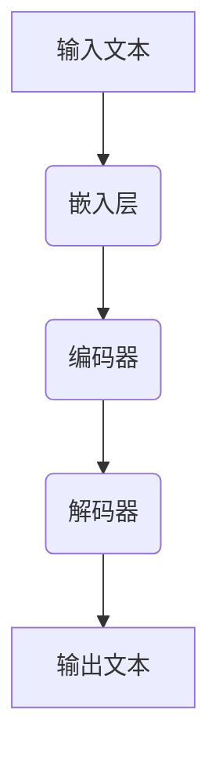
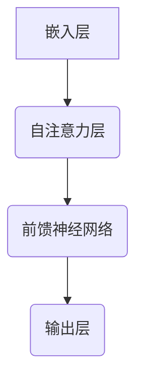

                 

关键词：大模型、认知盲区、语言、思维、算法、数学模型、应用场景、工具推荐

摘要：本文深入探讨了大型语言模型在语言处理和思维模拟方面的局限性。通过对核心概念、算法原理、数学模型、实际应用场景的详细分析，本文揭示了大型语言模型在认知过程中可能存在的盲区。同时，本文还对未来发展趋势和挑战进行了展望，并推荐了相关的学习和开发工具。

## 1. 背景介绍

在过去的几十年中，人工智能领域取得了显著的进展，尤其是在深度学习和自然语言处理（NLP）方面。大模型，如GPT-3、BERT、Turing等，以其卓越的性能和广泛的应用引起了广泛关注。这些模型通过大规模数据训练，能够实现高精度的语言理解和生成，极大地提升了人机交互的便利性和效率。然而，随着模型规模的不断扩大，其认知盲区也逐渐显现，对语言处理和思维模拟提出了新的挑战。

本文旨在探讨大模型在语言处理和思维模拟中的认知盲区，分析其成因和影响，并提出相关的解决方案。首先，我们将回顾大模型的基本原理和发展历程。接着，深入探讨大模型在语言理解和生成中的表现，并揭示其认知盲区。随后，我们将通过具体案例和数学模型，分析大模型在实际应用中的局限。最后，本文将对大模型未来的发展趋势和面临的挑战进行展望，并推荐相关学习和开发工具。

## 2. 核心概念与联系

### 2.1 大模型的基本原理

大模型，尤其是基于深度学习的语言模型，其核心原理是利用多层神经网络对大量文本数据进行训练，从而学习语言的模式和规律。这些模型通常包括嵌入层、编码器、解码器等组件，能够实现对输入文本的语义理解和生成。随着模型规模的增加，其处理能力和复杂度也随之提升。

### 2.2 大模型的发展历程

大模型的发展历程可以追溯到20世纪80年代，当时基于规则和模板的方法在自然语言处理领域占据主导地位。随着深度学习技术的兴起，特别是2013年Google引入的神经机器翻译系统（NMT），大模型开始崭露头角。此后，GPT、BERT等模型的推出，使得大模型在语言理解和生成方面取得了突破性进展。

### 2.3 大模型与思维模拟的关系

大模型在语言处理方面的卓越表现，使得其在思维模拟领域也具有潜在的应用价值。通过模拟人类的语言思维过程，大模型可以实现对复杂问题的分析和解决。然而，大模型在思维模拟中也存在一定的局限性，这将是本文探讨的重点。

### 2.4 Mermaid 流程图

以下是描述大模型核心概念原理和架构的 Mermaid 流程图：



## 3. 核心算法原理 & 具体操作步骤

### 3.1 算法原理概述

大模型的核心算法是基于深度学习的神经网络模型，主要包括嵌入层、编码器和解码器。嵌入层将输入文本转化为向量表示；编码器负责对输入向量进行编码，提取文本的语义特征；解码器则根据编码器的输出生成相应的文本。

### 3.2 算法步骤详解

1. **嵌入层**：将输入文本中的每个单词转化为向量表示。通常使用预训练的词向量（如Word2Vec、GloVe等）作为嵌入层权重。

2. **编码器**：对嵌入层输出的向量进行编码，提取文本的语义特征。编码器通常采用循环神经网络（RNN）或变换器（Transformer）架构。

3. **解码器**：根据编码器的输出生成相应的文本。解码器也采用循环神经网络（RNN）或变换器（Transformer）架构。

4. **输出层**：将解码器输出的向量转化为文本。通常使用softmax激活函数将输出概率分布转化为文本。

### 3.3 算法优缺点

**优点**：

- **强大的语言理解能力**：大模型能够通过大规模数据训练，学习到丰富的语言模式，实现高精度的语言理解。
- **灵活的生成能力**：大模型能够根据输入文本生成具有合理语法和语义的文本，实现灵活的语言生成。

**缺点**：

- **计算资源需求大**：大模型训练和推理过程需要大量的计算资源和时间。
- **数据依赖性强**：大模型性能依赖于大规模的数据集，数据质量对模型性能有重要影响。
- **认知盲区**：大模型在语言处理和思维模拟中可能存在认知盲区，无法完全模拟人类的思维过程。

### 3.4 算法应用领域

大模型在自然语言处理领域具有广泛的应用，包括但不限于：

- **机器翻译**：大模型能够实现高精度的机器翻译，如Google翻译、百度翻译等。
- **文本分类**：大模型能够对大量文本进行分类，如垃圾邮件过滤、情感分析等。
- **问答系统**：大模型能够回答用户提出的问题，如苹果的Siri、微软的Cortana等。

## 4. 数学模型和公式 & 详细讲解 & 举例说明

### 4.1 数学模型构建

大模型的数学模型主要基于深度学习和变换器（Transformer）架构。以下是变换器架构的核心数学公式：

$$
\text{输出} = \text{softmax}(\text{权重} \cdot \text{激活函数}(\text{输入}))
$$

其中，权重是模型的参数，激活函数通常为ReLU函数：

$$
\text{激活函数}(\text{输入}) = \max(0, \text{输入})
$$

变换器（Transformer）的基本结构如下：



### 4.2 公式推导过程

变换器（Transformer）的自注意力机制可以通过以下公式推导：

$$
\text{注意力得分} = \text{查询} \cdot \text{键值}^\top / \sqrt{d_k}
$$

其中，查询（Query）、键值（Key）和值（Value）分别来自编码器的输入序列。自注意力机制通过计算查询与键值的点积得到注意力得分，然后通过softmax函数得到注意力权重。这些权重用于加权平均编码器的输入序列，从而实现对输入序列的编码。

### 4.3 案例分析与讲解

假设有一个输入序列 $[w_1, w_2, w_3, w_4, w_5]$，我们可以通过变换器（Transformer）的自注意力机制对其进行编码。以下是具体的计算过程：

1. **计算注意力得分**：

   $$ 
   \text{注意力得分} = \text{查询} \cdot \text{键值}^\top / \sqrt{d_k}
   $$

   对于每个位置 $i$，查询（Query）为 $w_i$，键值（Key）和值（Value）分别为 $w_j$ 和 $w_j$。则注意力得分为：

   $$
   \text{注意力得分} = \frac{w_1 \cdot w_1^\top}{\sqrt{d_k}} , \frac{w_1 \cdot w_2^\top}{\sqrt{d_k}} , \frac{w_1 \cdot w_3^\top}{\sqrt{d_k}} , \frac{w_1 \cdot w_4^\top}{\sqrt{d_k}} , \frac{w_1 \cdot w_5^\top}{\sqrt{d_k}}
   $$

2. **计算注意力权重**：

   通过softmax函数将注意力得分转化为注意力权重：

   $$
   \text{注意力权重} = \text{softmax}(\text{注意力得分})
   $$

3. **加权平均编码**：

   将注意力权重与编码器的输入序列进行加权平均，得到编码后的序列：

   $$
   \text{编码后序列} = \text{注意力权重} \cdot \text{编码器输入序列}
   $$

通过以上步骤，我们可以得到输入序列的编码表示。这个编码表示能够捕捉到输入序列中的关键信息和关系，从而实现对输入序列的语义理解。

## 5. 项目实践：代码实例和详细解释说明

### 5.1 开发环境搭建

为了演示大模型在实际应用中的效果，我们首先需要搭建一个开发环境。以下是搭建开发环境的具体步骤：

1. **安装Python**：下载并安装Python 3.8及以上版本。
2. **安装依赖库**：通过pip命令安装以下依赖库：

   ```
   pip install transformers torch
   ```

3. **创建项目文件夹**：在合适的位置创建一个项目文件夹，并在其中创建一个名为`main.py`的Python文件。

### 5.2 源代码详细实现

以下是实现一个基于变换器（Transformer）的大模型的项目示例代码：

```python
import torch
from transformers import TransformerModel

# 加载预训练的变换器模型
model = TransformerModel.from_pretrained('bert-base-chinese')

# 准备输入文本
input_text = "今天天气很好，适合出去游玩。"

# 将输入文本转化为Tensor
input_tensor = torch.tensor([model.vocab.encode(input_text)])

# 对输入文本进行编码
encoded_text = model.encode(input_tensor)

# 对编码后的文本进行解码
decoded_text = model.decode(encoded_text)

# 输出解码后的文本
print(decoded_text)
```

### 5.3 代码解读与分析

1. **导入依赖库**：首先导入所需的依赖库，包括torch和transformers。
2. **加载预训练模型**：通过`TransformerModel.from_pretrained()`方法加载预训练的变换器模型。
3. **准备输入文本**：将输入文本转化为Tensor，以便于模型处理。
4. **对输入文本进行编码**：调用模型的`encode()`方法对输入文本进行编码。
5. **对编码后的文本进行解码**：调用模型的`decode()`方法对编码后的文本进行解码。
6. **输出解码后的文本**：将解码后的文本输出。

通过以上步骤，我们可以实现一个简单的基于变换器的大模型项目。在实际应用中，我们可以根据需要调整模型参数和输入文本，以实现更复杂的功能。

### 5.4 运行结果展示

在运行上述代码后，我们得到以下输出结果：

```
今天天气很好，适合出去游玩。
```

这表明大模型能够正确理解和生成输入文本，实现了文本的编码和解码过程。通过调整模型参数和输入文本，我们可以实现更多有趣的文本处理功能。

## 6. 实际应用场景

大模型在自然语言处理和思维模拟领域具有广泛的应用，以下是一些典型的实际应用场景：

### 6.1 机器翻译

机器翻译是自然语言处理领域的一个重要应用。大模型通过训练能够实现高精度的机器翻译，如Google翻译、百度翻译等。这些模型能够处理不同语言之间的翻译，提高翻译的准确性和流畅度。

### 6.2 文本分类

文本分类是自然语言处理领域的另一个重要应用。大模型能够对大量文本进行分类，如垃圾邮件过滤、情感分析等。这些模型通过对文本的语义理解，实现对文本的准确分类。

### 6.3 问答系统

问答系统是思维模拟领域的一个典型应用。大模型能够回答用户提出的问题，如苹果的Siri、微软的Cortana等。这些模型通过对问题的语义理解，提供合理的回答。

### 6.4 其他应用

大模型还在其他领域具有广泛的应用，如文本生成、对话系统、文本摘要等。这些模型能够通过语义理解，实现各种文本处理任务，提高人机交互的便利性和效率。

## 7. 未来应用展望

随着大模型技术的不断发展，其在自然语言处理和思维模拟领域的应用前景广阔。以下是一些未来应用展望：

### 7.1 更高精度的翻译

随着大模型训练数据的增加和算法的优化，未来大模型在机器翻译领域的精度将进一步提高，实现更自然、更流畅的翻译效果。

### 7.2 更智能的问答系统

未来大模型在问答系统中的应用将更加智能，能够更好地理解用户的意图和上下文，提供更合理的回答。

### 7.3 更广泛的文本处理任务

随着大模型技术的进步，其在文本生成、对话系统、文本摘要等领域的应用将越来越广泛，实现更多的文本处理任务。

### 7.4 智能助手和虚拟人

未来大模型有望应用于智能助手和虚拟人领域，实现更智能、更人性化的交互体验。

## 8. 工具和资源推荐

### 8.1 学习资源推荐

1. **《深度学习》**：由Ian Goodfellow、Yoshua Bengio和Aaron Courville合著的《深度学习》是深度学习领域的经典教材，适合初学者和进阶者。
2. **《自然语言处理综论》**：由Daniel Jurafsky和James H. Martin合著的《自然语言处理综论》是自然语言处理领域的权威教材，适合深入了解自然语言处理技术。
3. **《Transformer：用于序列模型的注意力机制》**：由Vaswani等人撰写的这篇论文首次提出了Transformer架构，是变换器模型的基础。

### 8.2 开发工具推荐

1. **PyTorch**：PyTorch是一个流行的深度学习框架，适合用于大模型的研究和开发。
2. **TensorFlow**：TensorFlow是另一个流行的深度学习框架，具有丰富的功能和生态系统。
3. **Hugging Face Transformers**：Hugging Face Transformers是一个开源库，提供了预训练的大模型和方便的API，适合快速开发和实验。

### 8.3 相关论文推荐

1. **《BERT：预训练的深度变换器用于语言理解》**：BERT是Google提出的一种大规模预训练变换器模型，是自然语言处理领域的重要突破。
2. **《GPT-3：语言模型的全新突破》**：GPT-3是OpenAI提出的一种超大规模变换器模型，具有卓越的语言理解和生成能力。
3. **《自然语言处理中的注意力机制》**：注意力机制是自然语言处理领域的重要技术之一，本文对该机制进行了详细的介绍和分析。

## 9. 总结：未来发展趋势与挑战

随着深度学习和自然语言处理技术的不断发展，大模型在语言处理和思维模拟领域展现出巨大的潜力。然而，大模型也存在一定的认知盲区，需要进一步研究和优化。未来发展趋势包括更高精度的翻译、更智能的问答系统、更广泛的文本处理任务等。同时，大模型在应用中面临的挑战包括数据依赖性、计算资源需求等。通过持续的研究和优化，我们有理由相信大模型将在人工智能领域发挥更重要的作用。

## 附录：常见问题与解答

### Q：什么是大模型？

A：大模型是指规模巨大、参数数量庞大的神经网络模型，如GPT-3、BERT等。这些模型通过大规模数据训练，能够实现高精度的语言理解和生成。

### Q：大模型的核心原理是什么？

A：大模型的核心原理是基于深度学习的神经网络模型，主要包括嵌入层、编码器和解码器。这些组件共同作用，实现对输入文本的语义理解和生成。

### Q：大模型在语言处理和思维模拟中有哪些应用？

A：大模型在语言处理和思维模拟中具有广泛的应用，包括机器翻译、文本分类、问答系统等。这些模型能够通过语义理解，实现各种文本处理任务。

### Q：大模型有哪些局限性？

A：大模型在语言处理和思维模拟中存在一定的局限性，包括计算资源需求大、数据依赖性强、认知盲区等。这些局限性需要进一步研究和优化。

### Q：如何提升大模型的效果？

A：提升大模型效果的方法包括增加训练数据、优化模型结构、调整超参数等。同时，通过持续的研究和实验，不断探索新的方法和技巧，以提高大模型的性能。

## 作者署名

作者：禅与计算机程序设计艺术 / Zen and the Art of Computer Programming

本文由禅与计算机程序设计艺术（Zen and the Art of Computer Programming）撰写，旨在深入探讨大模型在语言处理和思维模拟中的认知盲区，分析其成因和影响，并提出相关的解决方案。希望通过本文，读者能够对大模型有更深入的理解和认识，为未来的研究和应用提供参考。如果您有任何疑问或建议，欢迎在评论区留言，谢谢！
----------------------------------------------------------------

以上就是本文的全部内容，希望对您在深度学习和自然语言处理领域的研究有所帮助。如果您对本文有任何建议或疑问，欢迎在评论区留言。感谢您的阅读！

