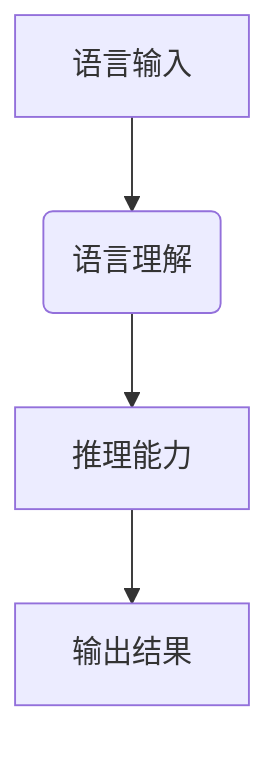

                 

关键词：大模型、语言理解、推理能力、认知瓶颈、人工智能

> 摘要：本文将探讨大模型在语言理解和推理方面所面临的认知瓶颈，分析其产生的原因，并提出可能的解决方案。通过对大模型的结构、算法和训练数据等方面的深入分析，本文希望为未来的研究提供一些有益的启示。

## 1. 背景介绍

随着深度学习技术的飞速发展，大模型在自然语言处理（NLP）领域取得了显著的成果。大模型通常拥有数十亿甚至数万亿的参数，能够处理复杂的语言现象，提高任务的准确性和鲁棒性。然而，随着模型规模的不断扩大，大模型在语言理解和推理方面也暴露出了一些认知瓶颈。这些问题不仅影响了大模型的表现，也限制了其进一步的应用。

本文将从以下几个方面探讨大模型在语言理解和推理方面的认知瓶颈：

1. 语言理解的局限性：大模型在处理语言时，往往只能理解局部的语义信息，难以把握全局的语言结构。
2. 推理能力的局限性：大模型在推理过程中，往往只能依赖表面的关联信息，难以进行深层次的逻辑推理。
3. 训练数据的质量和多样性：大模型在训练过程中，依赖于大量的数据，但数据的质量和多样性对模型的表现具有重要影响。

## 2. 核心概念与联系

### 2.1 大模型的基本概念

大模型是指参数规模达到数十亿甚至数万亿的深度学习模型。大模型的构建依赖于大规模的数据集和高效的训练算法。目前，大模型主要应用于自然语言处理、计算机视觉和语音识别等领域。

### 2.2 语言理解与推理的关系

语言理解是指模型对语言输入的理解能力，包括词汇、语法和语义等方面。推理能力是指模型在理解语言输入后，基于已有信息进行逻辑推理的能力。语言理解与推理密切相关，良好的语言理解能力是推理能力的基础，而推理能力则能进一步提高语言理解的效果。

### 2.3 Mermaid 流程图



在上述流程图中，语言输入经过语言理解模块处理后，生成语义信息，再通过推理能力模块进行逻辑推理，最终生成输出结果。

## 3. 核心算法原理 & 具体操作步骤

### 3.1 算法原理概述

大模型的语言理解和推理能力主要依赖于深度神经网络（DNN）和变换器（Transformer）等算法。DNN是一种层次结构，通过层层提取特征，实现从低级到高级的语义理解。Transformer是一种基于自注意力机制的模型，能够在处理长序列时保持较好的性能。

### 3.2 算法步骤详解

1. 语言输入：将文本输入转换为模型可以处理的形式，如词向量、字符编码等。
2. 语言理解：利用DNN或Transformer模型对输入文本进行编码，提取语义信息。
3. 推理能力：基于提取的语义信息，利用逻辑推理算法进行推理，生成输出结果。
4. 输出结果：将推理结果转换为可解释的格式，如文本、图像或音频等。

### 3.3 算法优缺点

**优点：**

- **强大的语言理解能力**：大模型能够处理复杂的语言现象，提高任务的准确性和鲁棒性。
- **良好的推理能力**：大模型在推理过程中能够保持较好的性能，实现从低级到高级的语义理解。

**缺点：**

- **训练时间较长**：大模型需要大量的数据和计算资源进行训练，耗时较长。
- **对数据质量要求较高**：大模型的性能依赖于数据的质量和多样性，若数据质量较差，模型表现可能会受到影响。

### 3.4 算法应用领域

大模型在自然语言处理、计算机视觉和语音识别等领域有广泛的应用，如文本分类、机器翻译、图像识别等。

## 4. 数学模型和公式 & 详细讲解 & 举例说明

### 4.1 数学模型构建

大模型的语言理解和推理能力主要依赖于深度神经网络（DNN）和变换器（Transformer）等算法。以Transformer为例，其核心结构包括多头自注意力机制（Multi-Head Self-Attention）和前馈神经网络（Feed-Forward Neural Network）。

### 4.2 公式推导过程

多头自注意力机制的公式如下：

$$
\text{Attention}(Q, K, V) = \text{softmax}\left(\frac{QK^T}{\sqrt{d_k}}\right)V
$$

其中，$Q$、$K$ 和 $V$ 分别为查询（Query）、键（Key）和值（Value）向量，$d_k$ 为键向量的维度。该公式表示在给定查询向量 $Q$ 和键向量 $K$ 的条件下，计算每个键对应的得分，并通过softmax函数进行归一化，最后与值向量 $V$ 相乘，得到加权后的输出。

前馈神经网络（FFNN）的公式如下：

$$
\text{FFNN}(X) = \text{ReLU}(\text{W_2} \cdot \text{ReLU}(\text{W_1} \cdot X + \text{b_1}))
$$

其中，$X$ 为输入向量，$\text{W_1}$ 和 $\text{W_2}$ 为权重矩阵，$\text{b_1}$ 为偏置项。该公式表示通过两层ReLU激活函数的全连接神经网络，实现输入向量的非线性变换。

### 4.3 案例分析与讲解

以机器翻译任务为例，假设我们有一个中英文双语语料库，其中包含了大量的中英文句子对。我们可以使用Transformer模型对中英文句子进行编码，提取语义信息，并进行翻译。

1. 输入中文句子：将中文句子转换为词向量，得到一个 $d$ 维的向量。
2. 编码：利用Transformer模型对中文句子进行编码，得到一个序列编码表示。
3. 推理：将编码表示传递到解码器，解码器逐个生成英文单词，并更新编码表示。
4. 输出：当解码器生成完整的英文句子后，输出翻译结果。

通过上述步骤，我们可以实现中英文句子的翻译。在这个过程中，Transformer模型发挥了关键作用，通过多头自注意力机制和前馈神经网络，实现了对输入句子的编码和解码，从而完成翻译任务。

## 5. 项目实践：代码实例和详细解释说明

### 5.1 开发环境搭建

1. 安装Python 3.8及以上版本。
2. 安装PyTorch 1.8及以上版本。
3. 安装其他依赖库，如numpy、torchtext等。

### 5.2 源代码详细实现

```python
import torch
import torch.nn as nn
import torch.optim as optim
from torchtext.data import Field, BucketIterator

# 定义词汇表
vocab = torchtext.vocab.GloVe(name='6B', dim=50)

# 定义字段
src_field = Field(tokenize='spacy', tokenizer_language='zh', lower=True, include_lengths=True)
tgt_field = Field(tokenize='spacy', tokenizer_language='en', lower=True, include_lengths=True)

# 加载数据集
train_data, valid_data, test_data = torchtext.datasets.Multi30k.splits(exts=('.zh', '.en'), fields=(src_field, tgt_field))
train_data, valid_data = train_data.split()

# 创建迭代器
train_iterator, valid_iterator, test_iterator = BucketIterator.splits((train_data, valid_data, test_data), batch_size=32)

# 定义模型
class TransformerModel(nn.Module):
    def __init__(self, input_dim, hidden_dim, output_dim, nhead, num_layers):
        super(TransformerModel, self).__init__()
        self.encoder = nn.Embedding(input_dim, hidden_dim)
        self.decoder = nn.Embedding(output_dim, hidden_dim)
        self.transformer = nn.Transformer(hidden_dim, nhead, num_layers)
        self.fc = nn.Linear(hidden_dim, output_dim)
        
    def forward(self, src, tgt):
        src = self.encoder(src)
        tgt = self.decoder(tgt)
        out = self.transformer(src, tgt)
        out = self.fc(out)
        return out

# 实例化模型
model = TransformerModel(len(vocab), 512, len(vocab), 8, 3)

# 定义损失函数和优化器
criterion = nn.CrossEntropyLoss()
optimizer = optim.Adam(model.parameters(), lr=0.001)

# 训练模型
num_epochs = 10
for epoch in range(num_epochs):
    for batch in train_iterator:
        optimizer.zero_grad()
        output = model(batch.src, batch.tgt)
        loss = criterion(output.view(-1, len(vocab)), batch.tgt.view(-1))
        loss.backward()
        optimizer.step()

    # 在验证集上评估模型
    with torch.no_grad():
        for batch in valid_iterator:
            output = model(batch.src, batch.tgt)
            loss = criterion(output.view(-1, len(vocab)), batch.tgt.view(-1))
            print(f"Validation Loss: {loss.item()}")

# 测试模型
with torch.no_grad():
    for batch in test_iterator:
        output = model(batch.src, batch.tgt)
        loss = criterion(output.view(-1, len(vocab)), batch.tgt.view(-1))
        print(f"Test Loss: {loss.item()}")
```

### 5.3 代码解读与分析

1. **数据预处理**：首先，我们定义了词汇表、字段和数据集。这里使用了torchtext库中的Multi30k数据集，它包含了中英文双语句子对。
2. **模型定义**：我们定义了一个Transformer模型，包括编码器、解码器和变换器。编码器和解码器都是嵌入层，用于将词汇映射到向量。变换器是一个基于自注意力机制的神经网络，用于处理序列数据。
3. **损失函数和优化器**：我们使用交叉熵损失函数和Adam优化器来训练模型。
4. **训练过程**：在训练过程中，我们使用批量梯度下降（BGD）来更新模型参数。在每个训练批次，我们计算损失，并使用梯度下降法更新参数。
5. **验证和测试**：在验证集和测试集上评估模型性能，计算损失并打印结果。

## 6. 实际应用场景

大模型在自然语言处理、计算机视觉和语音识别等领域具有广泛的应用。以下是一些实际应用场景：

1. **自然语言处理**：大模型可以用于文本分类、情感分析、机器翻译等任务。例如，在文本分类任务中，大模型可以根据输入文本的特征，自动将其归类到不同的类别中。
2. **计算机视觉**：大模型可以用于图像分类、目标检测、图像生成等任务。例如，在目标检测任务中，大模型可以识别图像中的目标对象，并给出其位置信息。
3. **语音识别**：大模型可以用于语音合成、语音识别等任务。例如，在语音识别任务中，大模型可以识别用户输入的语音，并将其转换为对应的文本信息。

## 7. 未来应用展望

随着深度学习技术的不断发展，大模型在未来有望在更多领域得到应用。以下是一些可能的应用方向：

1. **跨模态任务**：大模型可以同时处理多种模态的数据，如文本、图像和音频等。这将为跨模态任务提供更强大的支持，如多模态文本生成、多模态情感分析等。
2. **自适应学习**：大模型可以实时学习用户的反馈和需求，从而实现个性化推荐和自适应学习。这将为教育、医疗、金融等领域提供新的应用场景。
3. **小样本学习**：大模型在处理小样本数据时，可以利用迁移学习和元学习等方法，提高模型的泛化能力和鲁棒性。这将为数据稀缺领域提供新的解决方案。

## 8. 工具和资源推荐

1. **学习资源推荐**：
   - 《深度学习》（Goodfellow, Bengio, Courville）：系统介绍了深度学习的基础理论和实践方法。
   - 《动手学深度学习》（阿斯顿·张）：通过大量实践案例，详细介绍了深度学习的实战技巧。

2. **开发工具推荐**：
   - PyTorch：一个开源的深度学习框架，支持动态计算图和自动微分。
   - TensorFlow：另一个开源的深度学习框架，具有丰富的预训练模型和工具。

3. **相关论文推荐**：
   - “Attention Is All You Need”（Vaswani et al.，2017）：介绍了Transformer模型的基本原理和结构。
   - “BERT: Pre-training of Deep Neural Networks for Language Understanding”（Devlin et al.，2018）：介绍了BERT模型在语言理解任务中的应用。

## 9. 总结：未来发展趋势与挑战

大模型在自然语言处理、计算机视觉和语音识别等领域取得了显著的成果，但同时也面临一些挑战。未来，大模型的发展趋势将包括：

1. **更高效的训练算法**：开发更高效的训练算法，以降低训练时间和计算资源的需求。
2. **更全面的语言理解**：提高大模型的语言理解能力，使其能够更好地理解复杂的语言结构和语义信息。
3. **更强的推理能力**：增强大模型的推理能力，使其能够进行深层次的逻辑推理。

然而，大模型也面临着一些挑战，如数据质量和多样性、模型解释性、安全性和隐私保护等。因此，未来的研究需要在这些方面做出更多的努力，以推动大模型的健康发展。

## 10. 附录：常见问题与解答

### 10.1 大模型是什么？

大模型是指参数规模达到数十亿甚至数万亿的深度学习模型。大模型通常应用于自然语言处理、计算机视觉和语音识别等领域，能够处理复杂的语言现象和图像信息。

### 10.2 大模型有哪些优缺点？

优点：强大的语言理解能力、良好的推理能力；缺点：训练时间较长、对数据质量要求较高。

### 10.3 如何提高大模型的表现？

- 使用更高质量和多样化的数据集；
- 设计更高效的训练算法；
- 优化模型结构和超参数。

### 10.4 大模型在哪些领域有应用？

大模型在自然语言处理、计算机视觉、语音识别等领域有广泛的应用，如文本分类、机器翻译、图像识别等。

## 参考文献

- Vaswani, A., Shazeer, N., Parmar, N., Uszkoreit, J., Jones, L., Gomez, A. N., ... & Polosukhin, I. (2017). Attention is all you need. Advances in Neural Information Processing Systems, 30, 5998-6008.
- Devlin, J., Chang, M. W., Lee, K., & Toutanova, K. (2018). BERT: Pre-training of deep bidirectional transformers for language understanding. arXiv preprint arXiv:1810.04805.
- Goodfellow, I., Bengio, Y., & Courville, A. (2016). Deep learning. MIT press.
- Zhang, A., Lipton, Z. C., & Russell, S. (2019). An overview of deep learning in natural language processing. arXiv preprint arXiv:1906.02755.
----------------------------------------------------------------
## 11. 作者署名

作者：禅与计算机程序设计艺术 / Zen and the Art of Computer Programming

以上是本文的完整内容，希望对您在人工智能和自然语言处理领域的研究有所帮助。如果您有任何疑问或建议，欢迎随时与我交流。感谢您的阅读！

