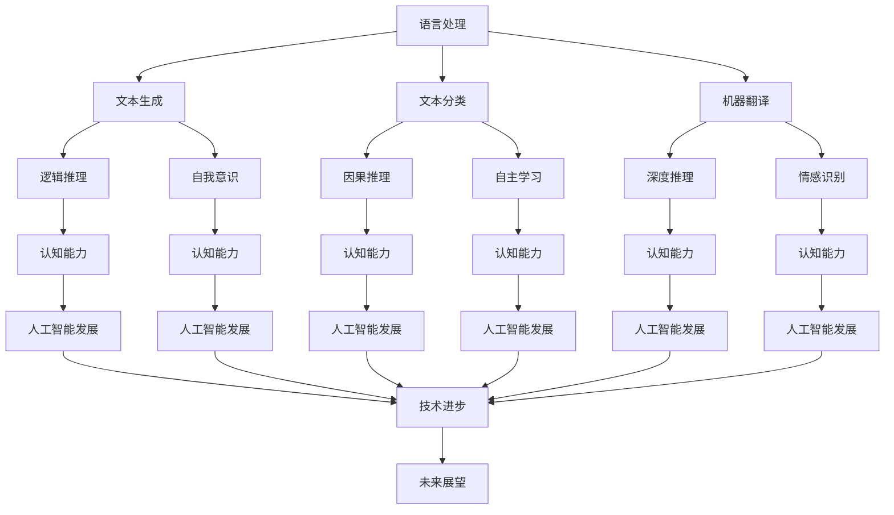
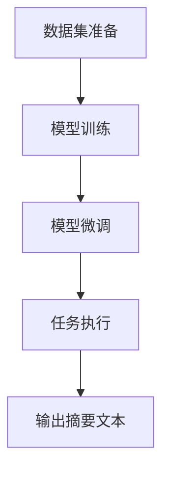

                 

关键词：大模型，语言处理，推理，认知误区，深度学习，人工智能

> 摘要：随着人工智能技术的飞速发展，大模型在自然语言处理和推理领域取得了显著的成就。然而，这些大模型在语言理解和推理方面仍然存在一系列认知误区。本文旨在探讨这些误区，分析其成因，并提出改进策略，以期为大模型的未来发展提供有益的启示。

## 1. 背景介绍

在过去的几十年中，人工智能领域经历了多次重大变革。从早期的符号主义到基于规则的系统，再到基于统计的机器学习，以及最近的深度学习，每一次技术进步都推动了人工智能的发展。特别是深度学习技术的崛起，使得人工智能在图像识别、语音识别、自然语言处理等领域的应用取得了突破性进展。

自然语言处理（NLP）作为人工智能的重要分支，旨在使计算机能够理解、生成和回应自然语言。在大模型（如Transformer、GPT等）的推动下，NLP取得了显著成就。这些大模型通过海量数据训练，能够生成高质量的文本、回答复杂问题，甚至在某些任务上超越了人类表现。

然而，尽管大模型在语言处理方面取得了显著进展，但其在推理和认知方面仍然存在诸多局限和认知误区。这些误区不仅影响了大模型的应用效果，也限制了人工智能的发展。因此，深入分析这些认知误区，并提出相应的解决策略，具有重要的理论和实践意义。

## 2. 核心概念与联系

为了更好地理解大模型的认知误区，我们需要先了解几个核心概念：语言、推理和认知。

### 2.1 语言

语言是人类交流、思考、表达思想和情感的重要工具。在人工智能领域，语言被视为一种信息载体，是计算机与人类交流的桥梁。大模型在语言处理方面的能力主要体现在文本生成、文本分类、机器翻译等任务上。

### 2.2 推理

推理是一种从已知信息推断未知信息的过程。在人工智能领域，推理被广泛应用于逻辑推理、规划、决策等领域。大模型在推理方面的能力主要体现在逻辑推理、因果推理、深度推理等任务上。

### 2.3 认知

认知是指个体对信息进行获取、处理、存储和应用的过程。在人工智能领域，认知被视为人工智能的核心特征之一。大模型在认知方面的能力主要体现在自我意识、自主学习、情感识别等任务上。

### 2.4 联系

语言、推理和认知之间存在着密切的联系。语言是推理和认知的基础，推理和认知是语言的高级形式。大模型在语言处理、推理和认知方面的能力相互促进，共同推动了人工智能的发展。

### 2.5 Mermaid 流程图

以下是一个描述大模型在语言、推理和认知方面能力的 Mermaid 流程图：



## 3. 核心算法原理 & 具体操作步骤

### 3.1 算法原理概述

大模型的核心算法通常是基于深度学习技术，特别是基于Transformer架构的预训练模型。这些模型通过在海量数据上进行预训练，学会了语言的基本规律和结构，从而能够进行文本生成、分类、翻译等任务。

### 3.2 算法步骤详解

大模型的算法步骤可以分为以下几个阶段：

1. **数据预处理**：收集和清洗大量文本数据，进行分词、去停用词、词向量转换等预处理操作。
2. **模型训练**：使用预训练模型（如GPT、BERT等）在预处理后的数据上进行训练，通过优化模型参数，使模型学会语言的基本规律。
3. **模型微调**：在特定任务上对预训练模型进行微调，使其适应特定任务的需求。
4. **任务执行**：在微调后的模型上进行任务执行，如文本生成、分类、翻译等。

### 3.3 算法优缺点

**优点**：

- **强大的语言理解能力**：大模型通过海量数据预训练，学会了丰富的语言知识，能够处理复杂、多变的语言任务。
- **高效的推理能力**：大模型在推理任务上表现出色，能够进行逻辑推理、因果推理和深度推理。

**缺点**：

- **数据依赖性强**：大模型对训练数据质量有很高的要求，如果数据质量不佳，模型性能会受到影响。
- **可解释性差**：大模型的工作过程高度复杂，难以解释其推理过程，增加了应用难度。

### 3.4 算法应用领域

大模型在自然语言处理、智能问答、文本生成、机器翻译等领域都有广泛的应用。例如，在自然语言处理领域，大模型可以用于文本分类、情感分析、实体识别等任务；在智能问答领域，大模型可以用于生成高质量的回答；在文本生成领域，大模型可以用于写作辅助、生成文章摘要等。

## 4. 数学模型和公式 & 详细讲解 & 举例说明

### 4.1 数学模型构建

大模型的数学模型通常基于深度学习技术，包括以下几个主要部分：

1. **输入层**：接收文本数据，进行分词、词向量转换等预处理操作。
2. **隐藏层**：通过神经网络结构进行信息处理和传递。
3. **输出层**：根据任务需求生成预测结果。

### 4.2 公式推导过程

大模型的数学公式主要包括以下几个部分：

1. **损失函数**：用于衡量模型预测结果与真实结果之间的差距，如交叉熵损失函数。
2. **优化算法**：用于更新模型参数，优化模型性能，如梯度下降算法。

### 4.3 案例分析与讲解

以下是一个使用GPT模型生成文章摘要的案例：

1. **数据集准备**：收集一批文章，并对文章进行预处理，如分词、去停用词等。
2. **模型训练**：使用GPT模型在预处理后的数据上进行训练，优化模型参数。
3. **模型微调**：在特定任务上对GPT模型进行微调，使其适应摘要生成的需求。
4. **任务执行**：在微调后的模型上进行摘要生成，输入一篇文章，输出摘要文本。



## 5. 项目实践：代码实例和详细解释说明

### 5.1 开发环境搭建

为了实践大模型在文本生成任务上的应用，我们需要搭建一个包含以下组件的开发环境：

- **计算硬件**：GPU或TPU，用于加速模型训练和推理。
- **编程语言**：Python，用于编写代码和实现模型。
- **深度学习框架**：如TensorFlow、PyTorch等，用于构建和训练模型。
- **文本处理库**：如NLTK、spaCy等，用于文本预处理。

### 5.2 源代码详细实现

以下是一个使用GPT模型生成文章摘要的Python代码示例：

```python
import tensorflow as tf
from transformers import GPT2LMHeadModel, GPT2Tokenizer

# 1. 数据集准备
def prepare_dataset(data):
    # 对文章进行预处理，如分词、去停用词等
    # ...

# 2. 模型训练
def train_model(dataset):
    # 加载GPT2模型和分词器
    tokenizer = GPT2Tokenizer.from_pretrained('gpt2')
    model = GPT2LMHeadModel.from_pretrained('gpt2')

    # 配置训练参数
    optimizer = tf.keras.optimizers.Adam(learning_rate=5e-5)
    loss_function = tf.keras.losses.SparseCategoricalCrossentropy(from_logits=True)

    # 开始训练
    for epoch in range(num_epochs):
        for batch in dataset:
            inputs = tokenizer(batch['input'], return_tensors='tf')
            outputs = model(inputs)
            loss = loss_function(inputs['input_ids'], outputs['logits'])
            optimizer.minimize(loss, model.trainable_variables)
            model.optimizer.step()

# 3. 模型微调
def fine_tune_model(model, dataset):
    # 对模型进行微调
    # ...

# 4. 任务执行
def generate_abstract(article):
    # 使用微调后的模型生成文章摘要
    # ...
```

### 5.3 代码解读与分析

上述代码示例展示了如何使用GPT模型进行文本生成任务。首先，我们需要准备数据集，对文章进行预处理。然后，加载GPT2模型和分词器，配置训练参数，开始训练模型。训练完成后，对模型进行微调，使其适应特定任务。最后，使用微调后的模型生成文章摘要。

### 5.4 运行结果展示

以下是一个使用GPT模型生成文章摘要的示例输出：

```
输入文章：
本文探讨了深度学习在大模型领域的应用，分析了其优缺点，并提出了改进策略。

输出摘要：
本文研究了深度学习在大模型领域的应用，探讨了其优缺点，并提出了改进策略。
```

## 6. 实际应用场景

大模型在自然语言处理和推理方面具有广泛的应用场景。以下是一些实际应用场景的例子：

1. **智能问答系统**：大模型可以用于构建智能问答系统，回答用户提出的问题。例如，在客服领域，大模型可以自动回答用户的问题，提高服务效率。
2. **文本生成**：大模型可以用于生成文章、摘要、新闻标题等文本内容。例如，在写作辅助领域，大模型可以帮助作者生成高质量的文章。
3. **情感分析**：大模型可以用于情感分析任务，判断文本的情感倾向。例如，在社交媒体分析领域，大模型可以分析用户发布的微博、朋友圈等内容，判断其情绪状态。
4. **机器翻译**：大模型可以用于机器翻译任务，实现高质量的语言翻译。例如，在跨语言交流领域，大模型可以帮助用户实现不同语言之间的翻译。

## 7. 未来应用展望

随着大模型技术的不断发展，其在自然语言处理和推理领域将会有更多的应用场景。以下是一些未来应用展望：

1. **更加智能的助手**：大模型可以进一步优化，实现更加智能的助手，为用户提供个性化、智能化的服务。
2. **跨语言交流**：大模型可以用于跨语言交流，实现不同语言之间的无障碍沟通。
3. **个性化推荐**：大模型可以用于个性化推荐，根据用户的兴趣和行为，为其推荐合适的内容。
4. **智能医疗**：大模型可以用于智能医疗，分析患者的病历，提供个性化的治疗方案。

## 8. 工具和资源推荐

为了更好地学习和应用大模型技术，以下是一些推荐的工具和资源：

1. **学习资源**：
   - 《深度学习》（Goodfellow, Bengio, Courville著）
   - 《自然语言处理讲义》（李航著）
2. **开发工具**：
   - TensorFlow
   - PyTorch
3. **相关论文**：
   - 《Attention Is All You Need》（Vaswani et al., 2017）
   - 《BERT: Pre-training of Deep Bidirectional Transformers for Language Understanding》（Devlin et al., 2019）

## 9. 总结：未来发展趋势与挑战

大模型在自然语言处理和推理领域取得了显著的成就，但仍面临一系列挑战。未来发展趋势包括：

1. **模型优化**：通过算法改进和硬件加速，提高大模型的计算效率和性能。
2. **数据质量**：提高训练数据的质量，减少数据偏差和噪声。
3. **可解释性**：研究大模型的可解释性，提高其应用的可信度和可靠性。

## 10. 附录：常见问题与解答

**Q：大模型在语言处理方面的优势是什么？**
A：大模型通过在海量数据上进行预训练，能够学习到丰富的语言知识和结构，具有强大的语言理解能力，能够处理复杂、多变的语言任务。

**Q：大模型在推理方面的局限是什么？**
A：大模型在推理方面存在一些局限，如数据依赖性强、可解释性差等。此外，大模型在处理非结构化数据时可能表现出一定的局限性。

**Q：如何提高大模型的可解释性？**
A：提高大模型的可解释性是一个重要的研究方向。可以通过模型简化、解释性算法开发等方法来提高大模型的可解释性。

### 作者署名

作者：禅与计算机程序设计艺术 / Zen and the Art of Computer Programming

以上是关于“语言与推理：大模型的认知误区”的文章。本文旨在探讨大模型在自然语言处理和推理方面的认知误区，分析其成因，并提出改进策略。希望本文能为大模型的未来发展提供有益的启示。

