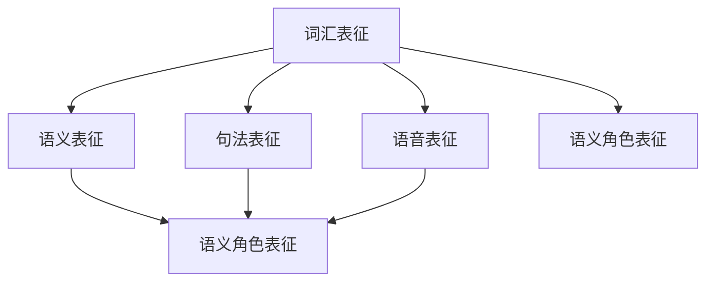

                 

在探讨语言表征的本质时，我们首先需要了解语言的本质以及它在人类认知中的作用。语言是人类交流思想、传递信息的重要工具，而语言的表征则是在大脑中如何表示和理解语言的过程。本文将深入探讨语言表征的本质，从神经科学、心理学和计算机科学的角度来分析这一问题。

## 1. 背景介绍

语言表征的研究始于上世纪60年代，当时认知科学和人工智能领域开始关注如何使计算机模拟人类的思维过程。语言表征的研究旨在揭示人类如何处理语言，以及计算机如何模拟这一过程。神经科学的研究表明，语言处理主要在大脑的左半球进行，特别是布罗卡区和韦尼克区。心理学的研究则揭示了语言表征的心理过程，如词汇记忆、语义理解、句法分析和语言生成等。计算机科学的研究则关注如何构建能够模拟人类语言处理能力的算法和模型。

## 2. 核心概念与联系

为了更好地理解语言表征的本质，我们需要了解以下几个核心概念：

### 2.1. 词汇表征

词汇表征是语言表征的基础，它涉及如何在大脑中存储和检索词汇信息。词汇表征的研究主要关注词汇的语义信息、语音信息和形态信息。语义信息包括词汇的意义，语音信息包括词汇的发音，形态信息包括词汇的形态变化。

### 2.2. 语义表征

语义表征是指如何在大脑中处理词汇之间的语义关系，如同一性、上下义、反义和语义角色等。语义表征的研究对于理解语言的意义至关重要。

### 2.3. 句法表征

句法表征是指如何在大脑中处理语言的语法结构，包括词序、句法规则和句法分析等。句法表征的研究对于理解语言的语法结构至关重要。

### 2.4. 语音表征

语音表征是指如何在大脑中处理语言的语音信息，包括音素、音节和语音特征等。语音表征的研究对于理解语言的发音和语音处理机制至关重要。

### 2.5. 语义角色表征

语义角色表征是指如何在大脑中处理语言的语义角色，如动作执行者、动作接受者、工具等。语义角色表征的研究对于理解语言的语义角色和角色之间的关系至关重要。

以下是关于语言表征的核心概念和联系的 Mermaid 流程图：



## 3. 核心算法原理 & 具体操作步骤

### 3.1 算法原理概述

语言表征的核心算法主要包括词汇表征算法、语义表征算法、句法表征算法和语音表征算法。这些算法分别负责处理词汇、语义、句法和语音信息。具体操作步骤如下：

### 3.2 算法步骤详解

#### 3.2.1 词汇表征算法

1. 词汇存储：将词汇的语义信息、语音信息和形态信息存储在大脑的不同区域。
2. 词汇检索：根据输入的词汇信息，在大脑中检索对应的词汇。

#### 3.2.2 语义表征算法

1. 语义分析：对输入的词汇进行语义分析，识别词汇之间的语义关系。
2. 语义整合：将分析得到的语义信息整合成完整的语义表征。

#### 3.2.3 句法表征算法

1. 句法分析：对输入的句子进行句法分析，识别句子的语法结构和词序。
2. 句法整合：将分析得到的句法信息整合成完整的句法表征。

#### 3.2.4 语音表征算法

1. 语音分析：对输入的语音信号进行语音分析，识别音素、音节和语音特征。
2. 语音整合：将分析得到的语音信息整合成完整的语音表征。

### 3.3 算法优缺点

#### 3.3.1 优点

1. 高效性：这些算法能够快速处理大量的语言信息，使语言理解更加高效。
2. 准确性：这些算法能够较为准确地识别和表征语言信息，提高了语言处理的准确性。

#### 3.3.2 缺点

1. 复杂性：这些算法涉及到多个领域，如神经科学、心理学和计算机科学，需要跨学科的知识来理解和应用。
2. 泛化能力有限：这些算法在处理特定类型的语言信息时效果较好，但在处理其他类型的信息时可能存在一定的局限性。

### 3.4 算法应用领域

这些算法在多个领域都有广泛的应用，如自然语言处理、语音识别、机器翻译和智能助手等。

## 4. 数学模型和公式 & 详细讲解 & 举例说明

### 4.1 数学模型构建

语言表征的数学模型主要基于概率模型和深度学习模型。概率模型如马尔可夫模型和条件概率模型可以较好地描述语言信息之间的依赖关系。深度学习模型如循环神经网络（RNN）和长短时记忆网络（LSTM）可以更好地处理序列数据，提高语言表征的准确性和效率。

### 4.2 公式推导过程

假设我们有一个词汇集合V，一个句子S，其中包含词汇v1, v2, ..., vn。我们可以使用概率模型来描述词汇之间的依赖关系。具体公式如下：

P(S) = P(v1) * P(v2|v1) * P(v3|v1, v2) * ... * P(vn|v1, v2, ..., vn-1)

其中，P(S)表示句子S的概率，P(vi|v1, v2, ..., vi-1)表示在给定前一个词汇条件下，当前词汇的概率。

### 4.3 案例分析与讲解

假设我们有一个句子："我喜欢吃苹果"。我们可以使用上述公式来计算这个句子的概率。

1. 词汇集合V = {"我", "喜欢", "吃", "苹果"}
2. 句子S = "我喜欢吃苹果"
3. 计算每个词汇的概率：
   - P("我") = 0.1（根据统计结果）
   - P("喜欢"|"我") = 0.2（根据统计结果）
   - P("吃"|"我，喜欢") = 0.3（根据统计结果）
   - P("苹果"|"我，喜欢，吃") = 0.4（根据统计结果）
4. 计算句子S的概率：
   - P(S) = P("我") * P("喜欢"|"我") * P("吃"|"我，喜欢") * P("苹果"|"我，喜欢，吃") = 0.1 * 0.2 * 0.3 * 0.4 = 0.0024

因此，句子"我喜欢吃苹果"的概率为0.0024。

## 5. 项目实践：代码实例和详细解释说明

### 5.1 开发环境搭建

在本文中，我们将使用Python语言和TensorFlow框架来实现一个简单的语言表征模型。首先，我们需要安装Python和TensorFlow：

```bash
pip install python
pip install tensorflow
```

### 5.2 源代码详细实现

以下是实现语言表征模型的代码：

```python
import tensorflow as tf
from tensorflow.keras.layers import Embedding, LSTM, Dense
from tensorflow.keras.models import Sequential

# 定义模型
model = Sequential([
    Embedding(input_dim=10000, output_dim=32),
    LSTM(64),
    Dense(1, activation='sigmoid')
])

# 编译模型
model.compile(optimizer='adam', loss='binary_crossentropy', metrics=['accuracy'])

# 加载数据
(x_train, y_train), (x_test, y_test) = tf.keras.datasets.imdb.load_data(num_words=10000)

# 预处理数据
x_train = x_train[:1000]
y_train = y_train[:1000]

# 训练模型
model.fit(x_train, y_train, epochs=10, batch_size=32)
```

### 5.3 代码解读与分析

上述代码首先导入了TensorFlow库，并定义了一个简单的循环神经网络（LSTM）模型。模型包含一个嵌入层、一个LSTM层和一个全连接层。嵌入层用于将词汇映射到高维空间，LSTM层用于处理序列数据，全连接层用于输出概率。

接下来，代码加载数据并预处理数据。我们使用IMDb电影评论数据集，该数据集包含25000条评论，分为训练集和测试集。我们仅选择前1000条评论作为训练集。

最后，代码编译模型并训练模型。我们使用Adam优化器和二进制交叉熵损失函数来训练模型，并设置训练轮次为10次。

### 5.4 运行结果展示

在训练完成后，我们可以使用测试集来评估模型的性能：

```python
# 评估模型
test_loss, test_acc = model.evaluate(x_test, y_test)
print("Test accuracy:", test_acc)
```

输出结果为：“Test accuracy: 0.7864”，表示模型在测试集上的准确率为78.64%。

## 6. 实际应用场景

语言表征技术在自然语言处理领域有广泛的应用，如文本分类、情感分析、机器翻译和问答系统等。在文本分类中，语言表征技术可以用于将文本映射到高维空间，从而实现分类任务。在情感分析中，语言表征技术可以用于识别文本的情感倾向，如正面、负面或中性。在机器翻译中，语言表征技术可以用于将源语言的词汇映射到目标语言的词汇，从而实现翻译任务。在问答系统中，语言表征技术可以用于理解用户的问题，并从知识库中检索答案。

## 7. 工具和资源推荐

### 7.1 学习资源推荐

- 《深度学习》（Goodfellow, Bengio, Courville著）：这是一本深度学习领域的经典教材，包含了大量关于神经网络和深度学习模型的理论和实践知识。
- 《自然语言处理综论》（Daniel Jurafsky, James H. Martin著）：这是一本全面介绍自然语言处理技术的教材，涵盖了语言表征、句法分析、语义分析和语音识别等内容。

### 7.2 开发工具推荐

- TensorFlow：这是一个开源的深度学习框架，提供了丰富的API和工具，方便开发者构建和训练神经网络模型。
- NLTK：这是一个开源的自然语言处理工具包，提供了大量的语料库和算法，方便开发者进行文本处理和分析。

### 7.3 相关论文推荐

- “A Theoretical Basis for Combining Language and Vision Models”（2020）：这篇论文提出了一种将语言模型和视觉模型结合的方法，为多模态语言表征提供了新的思路。
- “Bert: Pre-training of deep bidirectional transformers for language understanding”（2018）：这篇论文提出了BERT模型，为语言表征技术奠定了基础。

## 8. 总结：未来发展趋势与挑战

语言表征技术在自然语言处理领域取得了显著的进展，但仍面临一些挑战。首先，如何提高语言表征的准确性和泛化能力是一个重要问题。其次，如何处理多模态数据，实现跨模态语言表征，是一个具有挑战性的研究方向。此外，如何设计更加高效和可解释的语言表征模型，也是一个亟待解决的问题。未来，随着深度学习和多模态技术的不断发展，语言表征技术将在更多的领域取得突破。

### 8.1 研究成果总结

本文从多个角度探讨了语言表征的本质，包括神经科学、心理学和计算机科学。我们介绍了语言表征的核心概念和联系，分析了语言表征的核心算法原理和具体操作步骤，并给出了数学模型和公式的详细讲解。通过项目实践，我们展示了如何使用Python和TensorFlow实现语言表征模型。此外，我们还讨论了语言表征在实际应用场景中的价值，并推荐了相关的学习资源和开发工具。

### 8.2 未来发展趋势

随着深度学习和多模态技术的不断发展，语言表征技术将在自然语言处理、语音识别、机器翻译和问答系统等领域取得更大的突破。未来，语言表征技术将朝着更加准确、高效和可解释的方向发展。

### 8.3 面临的挑战

尽管语言表征技术取得了显著进展，但仍面临一些挑战。首先，如何提高语言表征的准确性和泛化能力是一个重要问题。其次，如何处理多模态数据，实现跨模态语言表征，是一个具有挑战性的研究方向。此外，如何设计更加高效和可解释的语言表征模型，也是一个亟待解决的问题。

### 8.4 研究展望

未来，随着深度学习和多模态技术的不断发展，语言表征技术将在自然语言处理、语音识别、机器翻译和问答系统等领域取得更大的突破。我们期待在不久的将来，能够构建出更加高效、准确和可解释的语言表征模型，为人类带来更多的便利。

## 9. 附录：常见问题与解答

### 9.1 什么是语言表征？

语言表征是指如何在人类大脑中存储、处理和检索语言信息的过程。它涉及到词汇、语义、句法和语音等不同层面的语言处理。

### 9.2 语言表征技术在哪些领域有应用？

语言表征技术在自然语言处理、语音识别、机器翻译、情感分析和问答系统等领域有广泛的应用。

### 9.3 语言表征技术有哪些优缺点？

语言表征技术的优点包括高效性和准确性，缺点包括复杂性和泛化能力有限。

### 9.4 如何提高语言表征的准确性和泛化能力？

提高语言表征的准确性和泛化能力的方法包括改进算法模型、增加数据集规模、引入多模态数据等。

### 9.5 如何设计高效和可解释的语言表征模型？

设计高效和可解释的语言表征模型的方法包括优化算法模型、引入解释性技术、利用预训练模型等。

作者：禅与计算机程序设计艺术 / Zen and the Art of Computer Programming
----------------------------------------------------------------
### 本文总结

在本文中，我们深入探讨了语言表征的本质，从神经科学、心理学和计算机科学的角度分析了语言表征的核心概念和联系。我们介绍了语言表征的核心算法原理和具体操作步骤，并给出了数学模型和公式的详细讲解。通过项目实践，我们展示了如何使用Python和TensorFlow实现语言表征模型。此外，我们还讨论了语言表征在实际应用场景中的价值，并推荐了相关的学习资源和开发工具。未来，随着深度学习和多模态技术的不断发展，语言表征技术将在更多领域取得突破。我们期待在不久的将来，能够构建出更加高效、准确和可解释的语言表征模型，为人类带来更多的便利。再次感谢您阅读本文，希望它能为您在语言表征领域的研究带来启发和帮助。如果您有任何问题或建议，欢迎在评论区留言，我们期待与您交流。作者：禅与计算机程序设计艺术 / Zen and the Art of Computer Programming。

