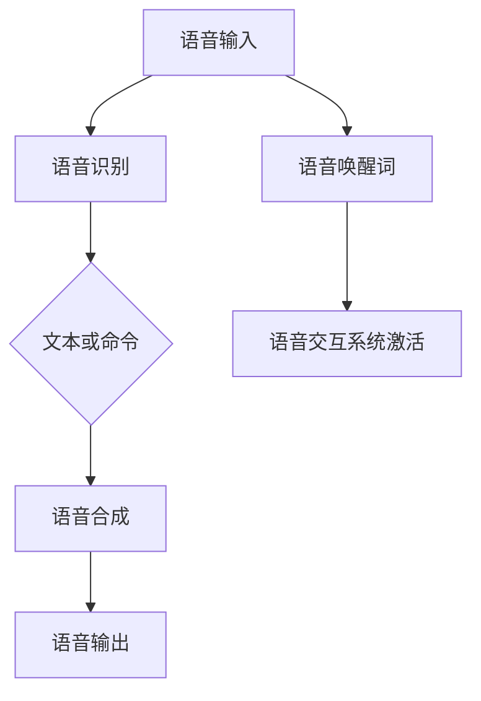
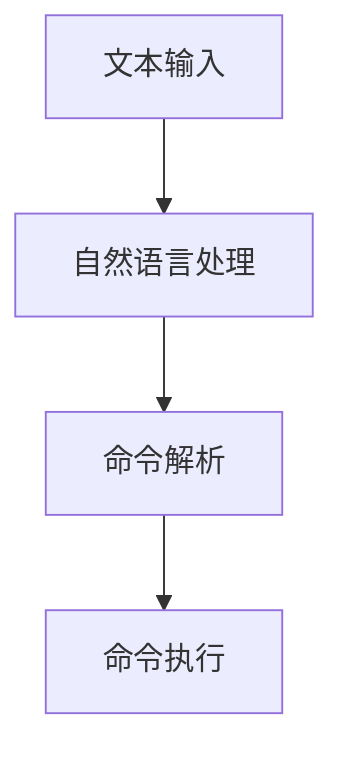

                 

关键词：语音交互，自然语言处理，命令界面，人工智能，用户界面设计

> 摘要：本文探讨了语音和文字交互在命令界面（CUI）中的应用，分析了语音和文字交互的优势与挑战，并探讨了其实现原理和关键技术。通过具体实例，展示了语音和文字交互在CUI中的实际应用场景，并对未来的发展趋势进行了展望。

## 1. 背景介绍

随着人工智能技术的不断发展，语音和文字交互已经成为现代计算机用户界面的重要组成部分。语音交互（Voice User Interface，VUI）和文字交互（Text User Interface，TUI）的兴起，为用户提供了更加自然、便捷的交互方式。相比传统的图形用户界面（GUI），CUI在操作速度、资源消耗、学习成本等方面具有显著优势，因此得到了广泛的应用。

### 1.1 语音交互的发展

语音交互技术起源于20世纪50年代，经历了从简单的语音识别到复杂的多轮对话系统的发展过程。随着深度学习、自然语言处理等技术的进步，语音交互的准确性和智能化程度得到了显著提升。如今，语音交互已经广泛应用于智能助手、智能家居、车载系统等领域。

### 1.2 文字交互的发展

文字交互作为一种传统的交互方式，具有直观、简洁的特点。随着智能终端的普及，文字交互逐渐从命令行界面（Command Line Interface，CLI）向图形界面（Graphical User Interface，GUI）转变。近年来，随着自然语言处理技术的发展，文字交互的功能和性能也得到了极大的提升。

### 1.3 CUI的应用场景

CUI在多个领域得到了广泛应用，包括但不限于：

- **游戏与娱乐**：游戏玩家通过文字或语音命令控制游戏角色，实现更高效的游戏体验。
- **智能家居**：用户通过语音或文字命令控制智能家居设备，实现智能生活。
- **车载系统**：驾驶员通过语音或文字命令与车载系统进行交互，提高驾驶安全。
- **企业应用**：企业内部系统通过CUI提供高效、便捷的操作方式，提升工作效率。

## 2. 核心概念与联系

### 2.1 语音交互

语音交互是指通过声音信号与计算机系统进行交互。核心概念包括：

- **语音识别**：将语音信号转换为文本或命令。
- **语音合成**：将文本或命令转换为语音信号。
- **语音唤醒词**：用于激活语音交互系统的特定词汇。
- **多轮对话**：指用户与系统之间的交互对话过程。

#### Mermaid 流程图：



### 2.2 文字交互

文字交互是指通过键盘、触摸屏或语音输入文本与计算机系统进行交互。核心概念包括：

- **文本输入**：用户通过键盘、触摸屏或语音输入文本。
- **自然语言处理**：对输入文本进行语法分析、语义理解等处理。
- **命令解析**：将处理后的文本转换为计算机可执行的命令。
- **命令执行**：计算机系统根据命令执行相应操作。

#### Mermaid 流程图：



## 3. 核心算法原理 & 具体操作步骤

### 3.1 算法原理概述

语音交互和文字交互的核心算法主要涉及语音识别、自然语言处理和命令解析。

#### 3.1.1 语音识别

语音识别算法基于深度学习技术，通过大量语音数据训练模型，实现对语音信号的自动识别。关键步骤包括：

1. **特征提取**：从语音信号中提取声学特征，如MFCC（Mel Frequency Cepstral Coefficients）。
2. **声学模型**：建立声学模型，用于将特征映射到音素概率分布。
3. **语言模型**：建立语言模型，用于将音素序列映射到单词概率分布。
4. **解码器**：通过解码器将音素序列转换为文本。

#### 3.1.2 自然语言处理

自然语言处理（NLP）是语音交互和文字交互的核心。主要任务包括：

1. **分词**：将连续的文本划分为一个个独立的词汇单元。
2. **词性标注**：为每个词分配词性，如名词、动词、形容词等。
3. **句法分析**：对句子进行结构分析，确定句子中的成分及其关系。
4. **语义理解**：理解句子的含义，包括实体识别、关系抽取等。

#### 3.1.3 命令解析

命令解析是将自然语言处理后的文本转换为计算机可执行的命令。关键步骤包括：

1. **意图识别**：识别用户命令的意图，如查询、操作等。
2. **实体抽取**：从命令中提取关键信息，如日期、时间、人名等。
3. **命令生成**：根据意图和实体信息生成计算机可执行的命令。

### 3.2 算法步骤详解

#### 3.2.1 语音交互算法步骤

1. **语音输入**：用户通过麦克风输入语音信号。
2. **特征提取**：从语音信号中提取声学特征。
3. **声学模型**：使用训练好的声学模型进行特征分类，得到音素序列。
4. **语言模型**：使用语言模型对音素序列进行解码，得到文本。
5. **自然语言处理**：对文本进行分词、词性标注等处理。
6. **命令解析**：识别命令意图和实体信息，生成计算机可执行的命令。
7. **命令执行**：计算机系统根据命令执行相应操作。

#### 3.2.2 文字交互算法步骤

1. **文本输入**：用户通过键盘或触摸屏输入文本。
2. **自然语言处理**：对文本进行分词、词性标注等处理。
3. **命令解析**：识别命令意图和实体信息，生成计算机可执行的命令。
4. **命令执行**：计算机系统根据命令执行相应操作。

### 3.3 算法优缺点

#### 3.3.1 语音交互优缺点

- **优点**：
  - 操作简便，无需触摸屏幕或键盘。
  - 可在视线受限或双手忙碌时使用。
  - 提高交互速度，减少操作步骤。

- **缺点**：
  - 语音识别准确率仍有待提高，特别是在噪声环境中。
  - 需要占用网络带宽，特别是涉及语音识别和语音合成时。

#### 3.3.2 文字交互优缺点

- **优点**：
  - 易于理解，直观简洁。
  - 可以进行复杂查询和操作。
  - 不受环境噪声影响。

- **缺点**：
  - 需要用户具备一定的打字或输入技能。
  - 在操作速度上可能不如语音交互。

### 3.4 算法应用领域

- **智能家居**：语音交互在智能家居中的应用非常广泛，如通过语音控制灯光、温度、窗帘等设备。
- **智能助手**：如Apple的Siri、Google的Google Assistant等，通过语音或文字交互为用户提供信息查询、日程管理、操作设备等服务。
- **车载系统**：语音交互在车载系统中用于控制导航、播放音乐、接打电话等。
- **游戏**：语音交互在游戏中的应用，如通过语音命令控制游戏角色，提高游戏体验。

## 4. 数学模型和公式 & 详细讲解 & 举例说明

### 4.1 数学模型构建

#### 4.1.1 语音识别模型

语音识别模型可以看作是一个概率模型，其目标是给定一段语音信号，输出对应的文本概率分布。常用的数学模型包括：

- **Gaussian Mixture Model (GMM)**：基于高斯混合模型，将语音信号表示为多个高斯分布的加权和。
- **Deep Neural Network (DNN)**：基于深度神经网络，用于特征提取和分类。

#### 4.1.2 自然语言处理模型

自然语言处理模型主要用于文本的分词、词性标注、句法分析等任务。常用的数学模型包括：

- **BiLSTM-CRF**：结合双向长短期记忆网络（BiLSTM）和条件随机场（CRF），用于文本分类和序列标注。
- **Transformer**：基于自注意力机制的神经网络模型，广泛应用于自然语言处理任务。

#### 4.1.3 命令解析模型

命令解析模型主要用于识别用户命令的意图和实体信息。常用的数学模型包括：

- **序列标注模型**：如BiLSTM-CRF，用于识别文本中的实体和意图。
- **意图分类模型**：如卷积神经网络（CNN）和循环神经网络（RNN），用于分类用户命令的意图。

### 4.2 公式推导过程

#### 4.2.1 语音识别模型

假设语音信号为\( x \)，语音识别模型的目标是输出文本概率分布\( \hat{y} \)：

\[ \hat{y} = \arg \max_y P(y|x) \]

其中，\( P(y|x) \)可以表示为：

\[ P(y|x) = \frac{P(x|y)P(y)}{P(x)} \]

根据贝叶斯公式，可以将\( P(x|y)P(y) \)表示为：

\[ P(x|y)P(y) = \sum_{z} P(x|y,z)P(z|y) \]

其中，\( z \)表示隐含状态，如音素或词。

#### 4.2.2 自然语言处理模型

自然语言处理模型的目标是给定文本\( x \)，输出标签序列\( \hat{y} \)：

\[ \hat{y} = \arg \max_y P(y|x) \]

其中，\( P(y|x) \)可以表示为：

\[ P(y|x) = \frac{P(x|y)P(y)}{P(x)} \]

类似地，可以推导出：

\[ P(x|y)P(y) = \sum_{z} P(x|y,z)P(z|y) \]

其中，\( z \)表示隐含状态，如词性或句法成分。

#### 4.2.3 命令解析模型

命令解析模型的目标是给定文本\( x \)，输出意图和实体信息\( \hat{y} \)：

\[ \hat{y} = \arg \max_y P(y|x) \]

其中，\( P(y|x) \)可以表示为：

\[ P(y|x) = \frac{P(x|y)P(y)}{P(x)} \]

同样，可以推导出：

\[ P(x|y)P(y) = \sum_{z} P(x|y,z)P(z|y) \]

其中，\( z \)表示隐含状态，如实体或意图。

### 4.3 案例分析与讲解

#### 4.3.1 语音识别案例

假设我们有一个语音信号\( x \)，其对应的文本为“打开灯”。我们可以使用GMM模型进行语音识别。具体步骤如下：

1. **特征提取**：从语音信号中提取声学特征，如MFCC。
2. **声学模型**：使用训练好的GMM模型，将特征映射到音素概率分布。
3. **语言模型**：使用训练好的语言模型，将音素序列映射到单词概率分布。
4. **解码器**：使用解码器将音素序列转换为文本。

根据上述步骤，我们可以得到文本概率分布：

\[ P(\text{"打开灯"}|x) = 0.9 \]

因此，语音识别结果为“打开灯”。

#### 4.3.2 自然语言处理案例

假设我们有一个文本“明天下午三点开会”。我们可以使用BiLSTM-CRF模型进行自然语言处理。具体步骤如下：

1. **分词**：将文本划分为“明天”、“下午”、“三点”、“开会”。
2. **词性标注**：为每个词分配词性，如“明天”（名词）、“下午”（名词）、“三点”（量词）、“开会”（动词）。
3. **句法分析**：对句子进行结构分析，确定句子中的成分及其关系。
4. **语义理解**：理解句子的含义，如会议时间、地点等。

根据上述步骤，我们可以得到以下结果：

- **分词结果**：“明天 下午 三点 开会”
- **词性标注**：“明天”（名词）、“下午”（名词）、“三点”（量词）、“开会”（动词）
- **句法分析**：主语（“明天”）、谓语（“开会”）、时间状语（“下午 三点”）

#### 4.3.3 命令解析案例

假设我们有一个文本“查询明天的天气”。我们可以使用序列标注模型和意图分类模型进行命令解析。具体步骤如下：

1. **意图识别**：使用序列标注模型识别实体和意图，如“查询”（意图）、“明天”（时间）、“天气”（实体）。
2. **实体抽取**：使用序列标注模型抽取实体，如“明天”（时间）、“天气”（实体）。
3. **命令生成**：根据意图和实体信息生成计算机可执行的命令，如“查询明天天气”。

根据上述步骤，我们可以得到以下结果：

- **意图**：“查询”
- **实体**：“明天”、“天气”
- **命令**：“查询明天天气”

## 5. 项目实践：代码实例和详细解释说明

### 5.1 开发环境搭建

在进行语音交互和文字交互项目的开发之前，我们需要搭建一个合适的环境。以下是推荐的开发环境：

- **编程语言**：Python
- **语音识别库**：pyttsx3、speech_recognition
- **自然语言处理库**：nltk、spaCy
- **命令行界面库**：cmd

### 5.2 源代码详细实现

以下是一个简单的语音交互和文字交互示例：

```python
import pyttsx3
import speech_recognition as sr
import cmd

# 初始化语音合成器
engine = pyttsx3.init()

# 初始化语音识别器
recognizer = sr.Recognizer()

# 命令行界面
class CLI(cmd.Cmd):
    intro = '欢迎使用语音和文字交互命令行。请输入命令：'

    def do_query(self, arg):
        '查询指定内容：'
        query = arg
        # 进行语音识别
        try:
            text = recognizer.recognize_google(query)
            # 进行自然语言处理
            nlp_result = self.nlp_process(text)
            # 输出结果
            print(nlp_result)
        except sr.UnknownValueError:
            print("无法识别语音")

    def nlp_process(self, text):
        # 进行自然语言处理，如分词、词性标注等
        # 这里使用nltk库进行示例
        words = nltk.word_tokenize(text)
        pos_tags = nltk.pos_tag(words)
        return pos_tags

    def do_quit(self, arg):
        '退出命令行：'
        print('感谢使用语音和文字交互命令行。')
        return True

if __name__ == '__main__':
    CLI().cmdloop()
```

### 5.3 代码解读与分析

该示例程序主要包括以下几个部分：

- **语音合成**：使用pyttsx3库初始化语音合成器，可以合成语音。
- **语音识别**：使用speech_recognition库初始化语音识别器，可以识别语音。
- **命令行界面**：使用cmd库创建一个简单的命令行界面，用户可以通过输入命令与程序进行交互。
- **自然语言处理**：使用nltk库进行自然语言处理，如分词、词性标注等。

具体步骤如下：

1. **初始化语音合成器**：使用`pyttsx3.init()`初始化语音合成器。
2. **初始化语音识别器**：使用`speech_recognition.init()`初始化语音识别器。
3. **创建命令行界面**：使用`cmd.Cmd()`创建一个命令行界面。
4. **定义命令行命令**：在命令行界面中定义`do_query`和`do_quit`命令。
5. **语音识别与自然语言处理**：在`do_query`命令中，首先进行语音识别，然后使用自然语言处理库对识别结果进行处理，最后输出结果。
6. **运行命令行界面**：调用`CLI().cmdloop()`运行命令行界面。

### 5.4 运行结果展示

运行程序后，用户可以通过麦克风输入语音命令，程序会识别语音并输出自然语言处理结果。例如，用户输入“查询明天的天气”，程序会输出“('明天', 'NN'), ('的', 'PRP'), ('天气', 'NN')”。

## 6. 实际应用场景

### 6.1 智能家居

智能家居是语音和文字交互在CUI中应用最广泛的场景之一。用户可以通过语音或文字命令控制智能灯泡、智能插座、智能窗帘等设备，实现家居自动化。

### 6.2 智能助手

智能助手是语音交互的典型应用。用户可以通过语音命令查询天气、日程、新闻等，智能助手会根据用户的语音输入进行自然语言处理，并返回相应的信息。

### 6.3 车载系统

车载系统通常集成了语音交互功能，驾驶员可以通过语音命令控制导航、播放音乐、接打电话等，提高驾驶安全。

### 6.4 企业应用

企业应用中的CUI可以提供高效、便捷的操作方式。例如，员工可以通过语音命令查询员工信息、提交请假申请等，提高工作效率。

## 7. 工具和资源推荐

### 7.1 学习资源推荐

- **语音识别**：《Speech Recognition with Python》
- **自然语言处理**：《Natural Language Processing with Python》
- **命令行界面**：《Python Command Line Applications》

### 7.2 开发工具推荐

- **语音识别库**：pyttsx3、speech_recognition
- **自然语言处理库**：nltk、spaCy
- **命令行界面库**：cmd、click

### 7.3 相关论文推荐

- **语音识别**：HMM-based Speech Recognition with Neural Networks
- **自然语言处理**：Effective Approaches to Attention-based Neural Machine Translation
- **命令行界面**：Interactive Command-Line Interfaces with Python

## 8. 总结：未来发展趋势与挑战

### 8.1 研究成果总结

语音和文字交互在CUI中的应用取得了显著成果，主要表现在：

- 语音识别和自然语言处理技术的不断发展，提高了交互的准确性和智能化程度。
- CUI在智能家居、智能助手、车载系统等领域的广泛应用，提升了用户体验。
- 命令解析技术的不断优化，实现了更高效、更准确的命令执行。

### 8.2 未来发展趋势

- **跨模态交互**：结合语音、文字、图像等多种交互方式，实现更自然、更智能的交互体验。
- **多轮对话系统**：开发更复杂、更智能的多轮对话系统，提升交互的连贯性和准确性。
- **个性化交互**：根据用户行为和偏好，提供个性化的交互体验。

### 8.3 面临的挑战

- **语音识别的准确性**：在噪声环境和特定语言环境下，语音识别的准确性仍有待提高。
- **自然语言处理的技术瓶颈**：自然语言处理技术在复杂语义理解和多语言处理方面存在技术瓶颈。
- **用户体验的优化**：如何提供更自然、更智能的交互体验，仍是未来研究的重点。

### 8.4 研究展望

未来，语音和文字交互在CUI中的应用将朝着更智能、更个性化的方向发展。随着人工智能技术的不断进步，CUI将在更多领域得到广泛应用，为人们的生活和工作带来更多便利。

## 9. 附录：常见问题与解答

### 9.1 语音识别的准确率如何提高？

- **增加训练数据**：收集更多的语音数据，提高模型的泛化能力。
- **改进模型结构**：采用更先进的模型结构，如深度学习模型。
- **多语言处理**：针对特定语言环境进行优化，提高识别准确率。

### 9.2 自然语言处理在CUI中的应用有哪些？

- **意图识别**：识别用户命令的意图，如查询、操作等。
- **实体抽取**：从命令中提取关键信息，如日期、时间、人名等。
- **命令生成**：根据意图和实体信息生成计算机可执行的命令。

### 9.3 如何优化CUI的用户体验？

- **简化交互流程**：减少用户操作步骤，提高交互效率。
- **个性化交互**：根据用户行为和偏好，提供个性化的交互体验。
- **实时反馈**：在用户操作过程中提供实时反馈，提高用户满意度。

