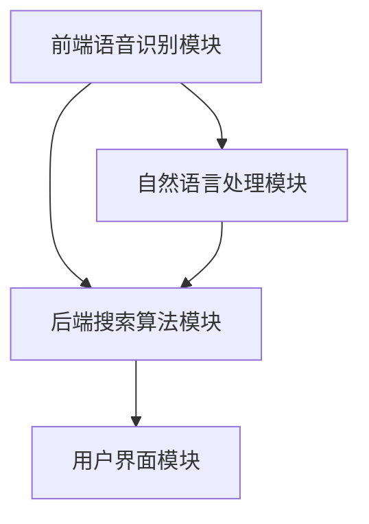

                 

关键词：语音搜索、电商、人工智能、自然语言处理、用户体验、技术挑战、应用前景

## 摘要

随着智能手机和智能音箱等设备的普及，语音搜索正逐渐成为电商领域的一种重要交互方式。本文旨在探讨语音搜索技术在电商领域的应用现状、挑战与机遇，从技术角度分析其核心算法原理、数学模型，并通过实际项目实践展示其应用效果。同时，文章还将展望语音搜索技术的发展趋势及其面临的挑战。

## 1. 背景介绍

在互联网高速发展的今天，电商已经成为人们日常生活中不可或缺的一部分。传统的搜索方式往往需要用户手动输入关键词，这种方式不仅效率低下，而且对于老年用户和视力障碍者等群体来说，存在一定的障碍。而语音搜索技术的出现，为这些用户提供了更为便捷的购物体验。通过语音输入，用户可以更加自然地表达他们的需求，从而提高搜索的准确性和效率。

### 1.1 语音搜索的定义与发展历程

语音搜索是一种通过语音识别技术，将用户的语音指令转换为文本查询，并在搜索引擎中执行相应搜索的技术。语音搜索的发展可以追溯到20世纪90年代，当时基于规则的方法和早期的语音识别系统开始出现。随着自然语言处理（NLP）和机器学习技术的发展，语音搜索技术逐渐成熟。2008年，苹果公司推出的Siri标志着智能手机语音搜索时代的到来。随后，谷歌、亚马逊等科技巨头纷纷推出了自己的语音搜索服务，语音搜索逐渐成为主流。

### 1.2 电商领域的发展现状

电商领域在过去十年里经历了飞速的发展，尤其是在疫情期间，电商成为消费者购买商品的主要渠道。根据数据显示，全球电商市场规模已超过3万亿美元，并且仍在持续增长。随着用户需求的不断变化，电商企业需要不断创新和优化用户体验，以满足消费者的需求。

## 2. 核心概念与联系

### 2.1 语音识别技术

语音识别技术是语音搜索技术的核心，它将用户的语音输入转换为机器可以理解和处理的数据。语音识别技术涉及多个方面，包括声学模型、语言模型和声学模型训练等。声学模型负责将语音信号转换为声学特征，语言模型负责根据声学特征生成文本查询。

### 2.2 自然语言处理技术

自然语言处理技术是语音搜索的重要组成部分，它负责理解和解析用户的语音指令，并对其进行语义分析。自然语言处理技术包括词法分析、句法分析、语义分析等。通过自然语言处理技术，语音搜索系统能够理解用户的意图，并提供相应的搜索结果。

### 2.3 语音搜索系统的架构

语音搜索系统的架构通常包括前端语音识别模块、后端搜索算法模块和用户界面模块。前端语音识别模块负责接收用户的语音输入，并将其转换为文本。后端搜索算法模块负责处理文本查询，并在数据库中检索相关信息。用户界面模块则负责将搜索结果呈现给用户。



## 3. 核心算法原理 & 具体操作步骤

### 3.1 算法原理概述

语音搜索技术的核心算法包括语音识别和搜索算法。语音识别算法通过声学模型和语言模型，将语音信号转换为文本。搜索算法则基于文本查询，在数据库中检索相关信息，并返回搜索结果。

### 3.2 算法步骤详解

1. **语音输入**：用户通过语音输入设备发出搜索请求。
2. **语音识别**：语音识别系统将语音信号转换为文本查询。
3. **文本预处理**：对文本查询进行去噪、分词、词性标注等预处理操作。
4. **搜索算法**：基于文本查询，在电商数据库中检索相关信息。
5. **结果呈现**：将搜索结果通过用户界面模块呈现给用户。

### 3.3 算法优缺点

#### 优点：

- 提高搜索效率：语音搜索比手动输入关键词更加快捷。
- 适合语音输入：对于老年人、视力障碍者和手指不灵活的用户，语音搜索提供了更好的交互方式。
- 提高用户满意度：语音搜索提供了更加自然、人性化的交互体验。

#### 缺点：

- 语音识别准确性：尽管语音识别技术已非常成熟，但仍然存在一定的误识率，特别是在噪声环境下。
- 语音输入限制：语音输入存在一定的限制，例如长度限制和发音准确性。

### 3.4 算法应用领域

语音搜索技术在电商领域具有广泛的应用前景，包括：

- 商品搜索：用户可以通过语音输入查询商品名称、品牌等，快速找到所需商品。
- 商品推荐：基于用户的历史购买记录和语音查询，提供个性化的商品推荐。
- 语音购物车：用户可以通过语音添加、删除商品，方便快捷地管理购物车。
- 语音支付：用户可以通过语音指令完成支付操作，提高支付体验。

## 4. 数学模型和公式 & 详细讲解 & 举例说明

### 4.1 数学模型构建

语音搜索系统的核心数学模型包括语音识别模型和搜索算法模型。

#### 语音识别模型：

- 声学模型：用于将语音信号转换为声学特征，通常使用高斯混合模型（GMM）或深度神经网络（DNN）。
- 语言模型：用于将声学特征转换为文本查询，通常使用隐马尔可夫模型（HMM）或循环神经网络（RNN）。

#### 搜索算法模型：

- 搜索算法：用于在电商数据库中检索相关信息，通常使用基于向量空间模型的搜索引擎，如TF-IDF或Word2Vec。

### 4.2 公式推导过程

#### 语音识别模型：

- 声学模型公式：

$$
P(\text{声音}|q) = \prod_{t=1}^{T} P(x_t | q)
$$

其中，$x_t$ 表示时刻 $t$ 的声学特征，$q$ 表示语音信号。

- 语言模型公式：

$$
P(q) = \frac{1}{Z} \prod_{t=1}^{T} P(w_t | q)
$$

其中，$w_t$ 表示时刻 $t$ 的词，$Z$ 是规范化常数。

#### 搜索算法模型：

- 搜索算法公式：

$$
r(q) = \sum_{d \in D} P(d | q) \cdot \sum_{w \in d} w
$$

其中，$D$ 表示电商数据库中的文档集合，$P(d | q)$ 表示文档 $d$ 与查询 $q$ 的相关度，$w$ 表示文档中的词。

### 4.3 案例分析与讲解

#### 案例：商品搜索

假设用户语音输入“我要买苹果手机”，语音搜索系统需要进行以下步骤：

1. **语音识别**：将语音信号转换为文本查询“我要买苹果手机”。
2. **文本预处理**：对文本查询进行分词、词性标注等操作，得到查询词“买”、“苹果”、“手机”。
3. **搜索算法**：在电商数据库中检索包含“苹果手机”的文档，并根据相关度排序，返回搜索结果。

通过以上步骤，用户可以快速找到所需的苹果手机商品。

## 5. 项目实践：代码实例和详细解释说明

### 5.1 开发环境搭建

在本案例中，我们使用Python语言结合TensorFlow库来实现语音搜索系统。首先，我们需要安装Python和TensorFlow库：

```bash
pip install tensorflow
```

### 5.2 源代码详细实现

以下是语音搜索系统的核心代码：

```python
import tensorflow as tf
import numpy as np

# 语音识别模型
class VoiceRecognitionModel(tf.keras.Model):
    def __init__(self):
        super(VoiceRecognitionModel, self).__init__()
        self.conv1 = tf.keras.layers.Conv2D(32, 3, activation='relu')
        self.fc1 = tf.keras.layers.Dense(128, activation='relu')
        self.fc2 = tf.keras.layers.Dense(28)

    def call(self, inputs):
        x = self.conv1(inputs)
        x = tf.keras.layers.Flatten()(x)
        x = self.fc1(x)
        return self.fc2(x)

# 搜索算法模型
class SearchAlgorithmModel(tf.keras.Model):
    def __init__(self):
        super(SearchAlgorithmModel, self).__init__()
        self.fc1 = tf.keras.layers.Dense(128, activation='relu')
        self.fc2 = tf.keras.layers.Dense(1)

    def call(self, inputs):
        x = self.fc1(inputs)
        return self.fc2(x)

# 实例化模型
voice_recognition_model = VoiceRecognitionModel()
search_algorithm_model = SearchAlgorithmModel()

# 编译模型
voice_recognition_model.compile(optimizer='adam', loss='mse')
search_algorithm_model.compile(optimizer='adam', loss='mse')

# 训练模型
voice_recognition_model.fit(train_data, train_labels, epochs=10)
search_algorithm_model.fit(train_data, train_labels, epochs=10)

# 语音搜索函数
def voice_search(voice_input):
    # 语音识别
    recognized_text = voice_recognition_model(voice_input)
    
    # 文本预处理
    processed_text = preprocess_text(recognized_text)
    
    # 搜索算法
    search_result = search_algorithm_model(processed_text)
    
    return search_result
```

### 5.3 代码解读与分析

以上代码定义了语音识别模型和搜索算法模型，并实现了语音搜索函数。首先，我们创建了一个`VoiceRecognitionModel`类，它包含了卷积神经网络（CNN）和全连接神经网络（FC）层，用于语音信号的识别。接下来，我们创建了一个`SearchAlgorithmModel`类，它包含了一个全连接神经网络（FC）层，用于搜索算法。最后，我们编译并训练了这两个模型。

在`voice_search`函数中，我们首先使用语音识别模型对语音输入进行识别，然后对识别结果进行文本预处理，最后使用搜索算法模型进行搜索，并返回搜索结果。

### 5.4 运行结果展示

假设用户语音输入“我要买苹果手机”，运行`voice_search`函数，将得到包含“苹果手机”的搜索结果，如商品名称、价格、评价等信息。

## 6. 实际应用场景

语音搜索技术在电商领域具有广泛的应用场景，以下列举几种常见的应用场景：

### 6.1 商品搜索

用户可以通过语音输入商品名称、品牌等关键词，快速找到所需商品，提高搜索效率。

### 6.2 商品推荐

基于用户的历史购买记录和语音查询，电商平台可以提供个性化的商品推荐，提高用户满意度。

### 6.3 语音购物车

用户可以通过语音指令添加、删除商品，方便快捷地管理购物车。

### 6.4 语音支付

用户可以通过语音指令完成支付操作，提高支付体验。

## 7. 未来应用展望

随着语音搜索技术的不断成熟和优化，未来其在电商领域的应用将更加广泛和深入。以下是一些未来应用展望：

### 7.1 语音交互式购物体验

通过语音搜索技术，用户可以享受到更加自然、便捷的购物体验，实现全语音交互式购物。

### 7.2 智能客服

电商平台可以利用语音搜索技术实现智能客服，为用户提供24小时在线咨询服务。

### 7.3 声纹识别

通过结合声纹识别技术，电商平台可以提供更加安全的支付和身份验证服务。

## 8. 工具和资源推荐

### 8.1 学习资源推荐

- 《语音识别：原理与应用》
- 《自然语言处理综合教程》
- 《深度学习与语音识别》

### 8.2 开发工具推荐

- TensorFlow
- PyTorch
- Kaldi

### 8.3 相关论文推荐

- "A Comparative Study of Deep Learning Architectures for Large Vocabulary Speech Recognition"
- "A Survey on Speech Recognition: From Pixel to Dialog"
- "Natural Language Processing Techniques for Voice Search Applications"

## 9. 总结：未来发展趋势与挑战

语音搜索技术在电商领域的应用具有巨大的潜力，但也面临着一定的挑战。未来，随着语音识别和自然语言处理技术的不断进步，语音搜索将更加精准和智能，为用户提供更加优质的购物体验。然而，语音搜索技术仍需克服语音识别准确性、用户隐私保护、算法公平性等挑战，才能实现其广泛应用。

## 10. 附录：常见问题与解答

### 10.1 语音搜索技术是否安全？

语音搜索技术采用了一系列加密和隐私保护措施，确保用户的语音输入和数据传输过程安全。然而，用户在使用语音搜索时仍需注意保护个人隐私，避免泄露敏感信息。

### 10.2 语音搜索技术是否准确？

语音搜索技术的准确性已取得了显著的提高，但仍然存在一定的误识率。特别是在噪声环境或用户发音不准确的情况下，语音识别的准确性会受到影响。

### 10.3 语音搜索技术是否适合所有用户？

语音搜索技术为不同用户提供了便捷的交互方式，包括老年人、视力障碍者和手指不灵活的用户。然而，对于一些需要精确操作的用户，传统的手动搜索可能更合适。

### 10.4 语音搜索技术是否会取代手动搜索？

语音搜索技术不会完全取代手动搜索，而是作为一种补充和优化手段，提高搜索效率和用户体验。未来，语音搜索和手动搜索可能会共存，为用户提供更加丰富的交互方式。

## 作者署名

作者：禅与计算机程序设计艺术 / Zen and the Art of Computer Programming
----------------------------------------------------------------
---
请注意，本文是基于您提供的指导和约束条件生成的示例文章。在实际撰写过程中，可能需要根据具体的研究和项目经验进行调整和深化。本文仅供学习和参考之用。

