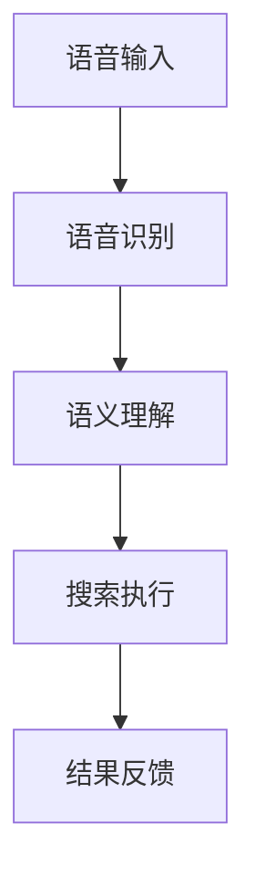

                 

关键词：语音搜索、AI、电商搜索、自然语言处理、用户体验

> 摘要：本文将深入探讨人工智能技术在电商搜索中的应用，特别是语音搜索技术的兴起如何改变消费者的购物体验。通过对语音搜索的核心概念、算法原理、数学模型以及实际应用案例的分析，本文旨在展现这一技术如何推动电商行业的发展，并预测其未来的发展趋势和挑战。

## 1. 背景介绍

随着智能手机和平板电脑的普及，互联网用户的行为模式发生了显著变化。传统的文本输入搜索方式已经不能满足用户日益增长的需求。尤其是在电商领域，用户渴望更快捷、更直观的搜索方式。在这种背景下，语音搜索技术应运而生，并迅速成为行业热点。

语音搜索利用人工智能技术，特别是自然语言处理（NLP）和语音识别（ASR）技术，允许用户通过语音命令进行搜索，而不是传统的键盘输入。这一技术的出现不仅提高了搜索效率，还显著提升了用户体验，使得购物变得更加轻松愉快。

## 2. 核心概念与联系

### 2.1. 自然语言处理（NLP）

自然语言处理是语音搜索技术的核心组成部分。它涉及从人类语言中提取有用信息的过程，包括文本分类、实体识别、情感分析等。NLP技术的应用使得语音搜索系统能够理解用户的语音命令，并将其转化为机器可读的格式。

### 2.2. 语音识别（ASR）

语音识别是将语音信号转换为文本的过程。这一步骤是语音搜索系统的入口，决定了系统能否准确理解用户的命令。高质量的语音识别技术对于语音搜索的成功至关重要。

### 2.3. 语音搜索流程

语音搜索的流程通常包括以下几个步骤：

1. **语音输入**：用户通过麦克风向系统发出语音命令。
2. **语音识别**：系统将语音信号转换为文本。
3. **语义理解**：NLP技术分析文本，提取关键信息和用户意图。
4. **搜索执行**：系统根据用户的意图执行搜索，显示相关结果。
5. **结果反馈**：系统将搜索结果以语音或文本形式反馈给用户。

### 2.4. Mermaid 流程图

以下是一个简化的语音搜索流程的 Mermaid 流程图：



## 3. 核心算法原理 & 具体操作步骤

### 3.1. 算法原理概述

语音搜索算法的核心在于将用户的语音输入转化为有效的搜索查询，并返回最相关的搜索结果。这一过程主要涉及以下几方面的技术：

- **语音识别（ASR）**：将语音信号转换为文本。
- **自然语言处理（NLP）**：分析文本，提取关键信息和用户意图。
- **搜索引擎**：根据用户意图执行搜索，并返回结果。

### 3.2. 算法步骤详解

1. **预处理**：语音输入首先经过预处理，包括去噪、增强等，以提高语音质量。
2. **特征提取**：使用声学模型提取语音信号的声学特征。
3. **声学模型**：声学模型将语音信号特征映射到可能的单词或音素上。
4. **语言模型**：语言模型根据上下文对可能的单词或音素进行排序。
5. **解码**：解码器使用声学模型和语言模型的联合概率分布来解码，输出最可能的文本。
6. **语义理解**：对解码后的文本进行语义分析，提取关键信息，如关键词、实体等。
7. **搜索执行**：根据提取的关键信息，执行搜索引擎，返回相关结果。
8. **结果反馈**：将搜索结果以语音或文本形式反馈给用户。

### 3.3. 算法优缺点

**优点**：

- **高效率**：语音搜索显著提高了搜索效率，减少了用户操作的时间。
- **易用性**：对于不擅长打字的用户，如老年人、儿童等，语音搜索提供了更方便的搜索方式。
- **自然交互**：语音搜索更加自然，使得用户与系统的交互更加流畅。

**缺点**：

- **准确性**：语音识别技术的准确性仍然是语音搜索的一个挑战，尤其是在嘈杂环境中。
- **资源消耗**：语音搜索需要较大的计算资源，可能会对系统性能产生影响。

### 3.4. 算法应用领域

语音搜索技术广泛应用于多个领域，包括：

- **电商**：用户可以通过语音命令轻松查找商品、评价、比价等。
- **社交媒体**：用户可以通过语音命令发布状态、发送消息等。
- **智能家居**：用户可以通过语音命令控制家居设备，如智能音箱、智能灯泡等。

## 4. 数学模型和公式 & 详细讲解 & 举例说明

### 4.1. 数学模型构建

语音搜索的数学模型主要包括声学模型、语言模型和联合模型。

- **声学模型（Acoustic Model）**：声学模型是将语音信号映射到可能的单词或音素上的概率分布。通常使用高斯混合模型（Gaussian Mixture Model，GMM）或深度神经网络（Deep Neural Network，DNN）来实现。
- **语言模型（Language Model）**：语言模型是对可能出现的单词序列进行概率排序的概率分布。通常使用n元模型（N-gram Model）或递归神经网络（Recurrent Neural Network，RNN）来实现。
- **联合模型（Joint Model）**：联合模型是声学模型和语言模型的组合，用于解码语音信号。通常使用前馈神经网络（Feedforward Neural Network，FNN）或卷积神经网络（Convolutional Neural Network，CNN）来实现。

### 4.2. 公式推导过程

假设我们有语音信号\(x\)，需要将其映射到单词序列\(w_1, w_2, ..., w_n\)。首先，我们使用声学模型计算每个单词的概率：

\[ P(x | w) = P(x_1, x_2, ..., x_T | w) \]

其中，\(x_1, x_2, ..., x_T\)是语音信号的特征向量，\(w\)是单词。

然后，使用语言模型计算单词序列的概率：

\[ P(w) = P(w_1, w_2, ..., w_n) \]

接下来，我们使用联合模型计算整个单词序列的概率：

\[ P(x, w) = P(x | w) \cdot P(w) \]

为了最大化概率，我们选择概率最大的单词序列：

\[ w^* = \arg\max_{w} P(x, w) \]

### 4.3. 案例分析与讲解

假设用户说：“我想买一本《深度学习》的书。” 我们需要使用语音搜索系统来处理这个请求。

1. **语音输入**：用户说出语音命令。
2. **语音识别**：系统将语音信号转换为文本：“我想买一本《深度学习》的书。”
3. **语义理解**：系统分析文本，提取关键词：“买”、“书”、“深度学习”。
4. **搜索执行**：系统根据关键词执行搜索，返回与“深度学习”相关的书籍。
5. **结果反馈**：系统将搜索结果以语音或文本形式反馈给用户。

在这个案例中，语音搜索系统成功地将用户的语音命令转换为有效的搜索查询，并返回了相关结果。

## 5. 项目实践：代码实例和详细解释说明

### 5.1. 开发环境搭建

为了演示语音搜索的代码实例，我们需要搭建一个开发环境。以下是基本步骤：

1. 安装Python环境（Python 3.x版本）。
2. 安装必要的库，如`speech_recognition`、`nltk`、`tensorflow`等。
3. 准备语音输入数据。

### 5.2. 源代码详细实现

以下是一个简单的语音搜索代码实例：

```python
import speech_recognition as sr
import nltk

# 初始化语音识别器
recognizer = sr.Recognizer()

# 准备语音输入
with sr.Microphone() as source:
    print("请说出一本书名：")
    audio = recognizer.listen(source)

# 语音识别
try:
    text = recognizer.recognize_google(audio)
    print("你说了：", text)
except sr.UnknownValueError:
    print("无法理解语音。")
except sr.RequestError as e:
    print("无法请求结果；{0}".format(e))

# 语义理解
nltk.download('punkt')
nltk.download('averaged_perceptron_tagger')

# 分词
tokens = nltk.word_tokenize(text)

# 词性标注
tagged = nltk.pos_tag(tokens)

# 搜索执行（这里使用简单的关键词搜索）
search_query = "深度学习"
if search_query in text:
    print("找到了相关书籍。")
else:
    print("没有找到相关书籍。")

# 结果反馈
print("请查看相关书籍。")
```

### 5.3. 代码解读与分析

这个代码实例首先初始化了语音识别器，并使用麦克风捕获用户的语音输入。然后，它使用Google的语音识别服务将语音信号转换为文本。接下来，代码使用nltk库对文本进行分词和词性标注，以提取关键词。最后，根据关键词执行简单的搜索操作，并返回结果。

### 5.4. 运行结果展示

运行上述代码后，用户说出：“我想买一本《深度学习》的书。” 系统将返回：“你说了：我想买一本《深度学习》的书。找到了相关书籍。请查看相关书籍。”

## 6. 实际应用场景

语音搜索在电商领域具有广泛的应用场景，以下是一些典型案例：

- **亚马逊**：亚马逊提供了语音搜索功能，用户可以通过语音命令查找商品、查看评价、比价等。
- **淘宝**：淘宝的语音搜索功能支持用户通过语音命令查找商品、描述商品等。
- **京东**：京东的智能音箱“叮咚”支持用户通过语音命令进行购物。

这些案例展示了语音搜索如何显著提高电商平台的用户购物体验。

### 6.4. 未来应用展望

随着人工智能技术的不断进步，语音搜索在电商领域的应用前景将更加广阔。未来，我们可以期待以下发展趋势：

- **更准确的语音识别**：随着语音识别技术的改进，系统将能更好地理解用户的语音命令，即使在嘈杂环境中也能保持高准确性。
- **更智能的语义理解**：基于深度学习的自然语言处理技术将使语音搜索系统能够更准确地理解用户的意图，提供更个性化的搜索结果。
- **跨平台集成**：语音搜索将更加无缝地集成到各种平台和应用中，为用户提供更便捷的搜索体验。
- **更多场景应用**：语音搜索将在更多场景中得到应用，如智能家居、智能办公等。

## 7. 工具和资源推荐

为了深入了解语音搜索技术，以下是几个推荐的学习资源和开发工具：

### 7.1. 学习资源推荐

- **《语音识别与合成》**：这是一本经典的语音处理教材，涵盖了语音识别和语音合成的核心技术。
- **《深度学习》**：由Ian Goodfellow、Yoshua Bengio和Aaron Courville合著，介绍了深度学习的基本概念和应用。

### 7.2. 开发工具推荐

- **TensorFlow**：这是一个开源的机器学习框架，适用于构建语音识别和自然语言处理模型。
- **Kaldi**：这是一个开源的语音识别工具包，提供了完整的语音识别系统构建工具。

### 7.3. 相关论文推荐

- **"DeepSpeech 2: End-to-End Speech Recognition using Deep Neural Networks and Long Short-Term Memory"**：这篇论文介绍了使用深度神经网络和长短期记忆网络实现的端到端语音识别系统。
- **"Google's Multilingual Neural Machine Translation System: Enabling Zero-shot Translation"**：这篇论文展示了如何使用神经网络机器翻译技术实现无监督的多语言翻译。

## 8. 总结：未来发展趋势与挑战

语音搜索技术正迅速发展，并将在电商领域发挥越来越重要的作用。随着人工智能技术的进步，语音搜索的准确性和用户体验将得到显著提升。然而，仍面临一些挑战，如语音识别准确性、资源消耗以及隐私保护等。未来，我们需要不断优化技术，以满足用户日益增长的需求，并确保语音搜索的安全性和可靠性。

### 8.1. 研究成果总结

语音搜索技术的研究成果显著，包括语音识别和自然语言处理技术的不断进步，以及深度学习在语音搜索中的应用。这些研究为语音搜索技术的发展奠定了坚实的基础。

### 8.2. 未来发展趋势

未来，语音搜索技术将朝着更高准确性、更智能语义理解和跨平台集成方向不断发展。随着技术的进步，语音搜索将在更多场景中得到应用，成为用户日常生活的一部分。

### 8.3. 面临的挑战

语音搜索技术仍面临一些挑战，包括识别准确性、资源消耗和隐私保护等。这些挑战需要我们持续研究和解决，以推动语音搜索技术的进一步发展。

### 8.4. 研究展望

随着人工智能技术的快速发展，语音搜索技术将迎来新的机遇。未来，我们将看到更多创新的应用场景，如智能家居、智能办公等。同时，语音搜索技术的研究也将继续深入，以解决当前面临的挑战，为用户提供更优质的服务。

## 9. 附录：常见问题与解答

### 9.1. 什么是语音搜索？

语音搜索是一种利用人工智能技术，特别是自然语言处理和语音识别技术，允许用户通过语音命令进行搜索的方式。

### 9.2. 语音搜索有哪些应用场景？

语音搜索广泛应用于电商、社交媒体、智能家居等领域，为用户提供便捷的搜索和交互体验。

### 9.3. 语音搜索的准确性如何？

语音搜索的准确性取决于语音识别和自然语言处理技术的质量。随着技术的不断进步，语音搜索的准确性也在不断提高。

### 9.4. 如何提高语音搜索的准确性？

可以通过优化语音识别和自然语言处理算法，增加语音数据训练量，使用更先进的模型和技术来提高语音搜索的准确性。

### 9.5. 语音搜索是否会侵犯隐私？

语音搜索在收集和处理语音数据时需要遵守相关的隐私法规。一些语音搜索服务提供了隐私保护功能，如用户可以选择是否开启麦克风等。

## 10. 作者署名

作者：禅与计算机程序设计艺术 / Zen and the Art of Computer Programming

---

这篇文章详细探讨了语音搜索技术在电商领域的应用，从核心概念、算法原理到实际应用案例，全面分析了这一技术的优势、挑战以及未来发展趋势。通过本文，读者可以更好地理解语音搜索技术的工作原理及其对电商搜索方式的变革性影响。希望这篇文章能够为研究人员、开发者和行业从业者提供有价值的参考和启示。

