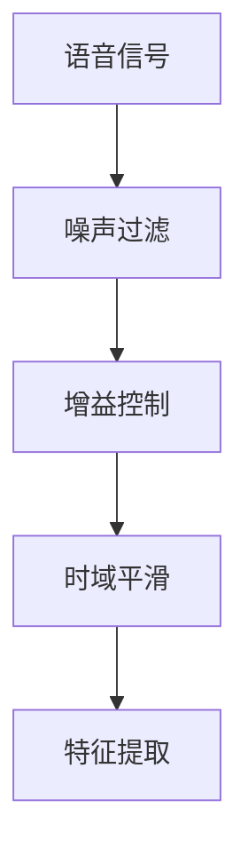
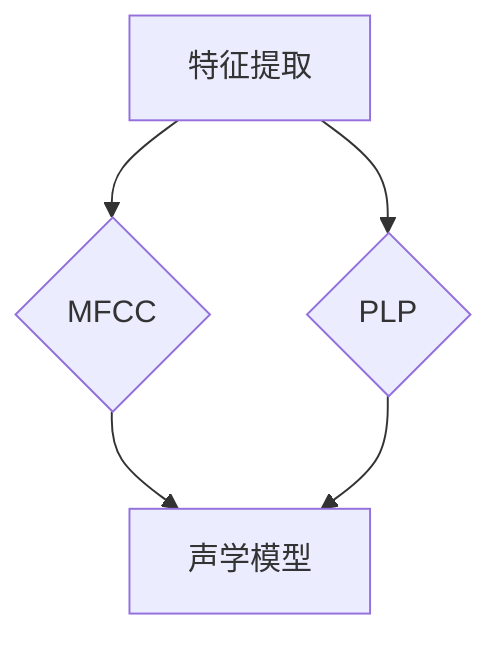
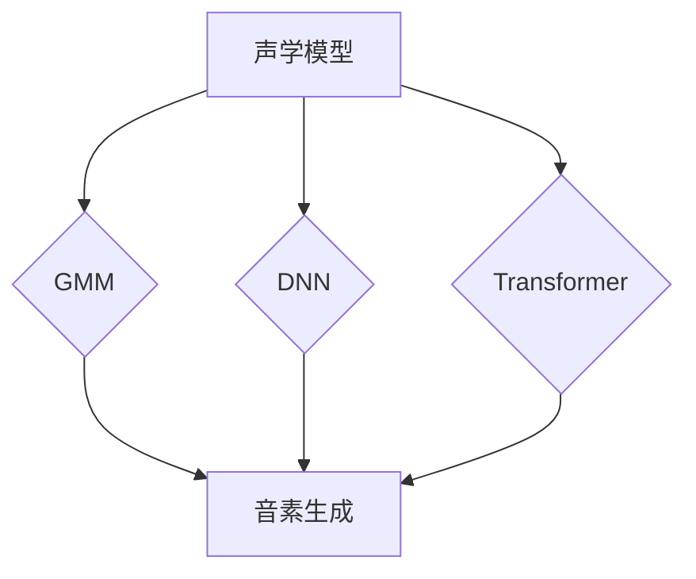
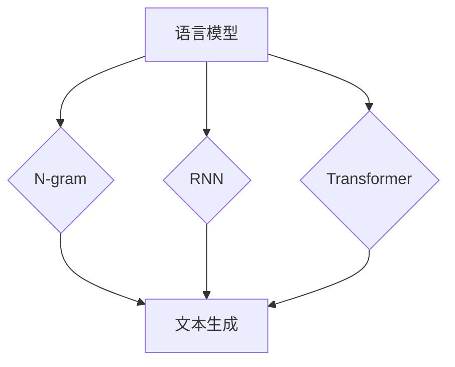
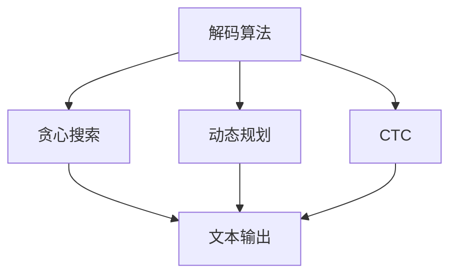

                 

关键词：语音识别，自动语音识别，语音信号处理，深度学习，神经网络，语音合成，声学模型，语言模型，语音信号处理，特征提取，解码算法，应用场景。

## 摘要

语音识别（Speech Recognition）技术是人工智能领域的重要研究方向之一，它通过将语音信号转换为文本，为人类与计算机之间的交互提供了便捷途径。本文将深入探讨语音识别的原理，涵盖从语音信号处理到深度学习的各个环节，并通过具体的代码实例，展示如何实现语音识别系统。同时，本文还将讨论语音识别在实际应用中的场景和未来展望。

## 1. 背景介绍

语音识别技术的研究始于20世纪50年代，最初的研究主要集中在基于规则的方法上。随着计算能力的提升和人工智能技术的发展，基于统计方法和深度学习的方法逐渐成为主流。语音识别技术的应用场景广泛，包括智能助手、语音搜索、语音翻译、语音控制等领域。

语音识别技术的基本任务是将语音信号转化为对应的文本，这个过程可以分为几个主要步骤：语音信号预处理、特征提取、模型训练与解码。

## 2. 核心概念与联系

### 2.1. 语音信号预处理

语音信号预处理是语音识别过程的第一步，其目的是去除噪声、提升信号质量，为后续的特征提取做准备。主要的方法包括噪声过滤、增益控制、时域平滑等。



### 2.2. 特征提取

特征提取是将原始语音信号转化为可用于模型训练的数值特征。常用的特征包括梅尔频率倒谱系数（MFCC）、感知线性预测系数（PLP）等。



### 2.3. 声学模型

声学模型用于模拟语音信号在音素层面上的生成过程，常见的模型包括GMM（高斯混合模型）、DNN（深度神经网络）和Transformer等。



### 2.4. 语言模型

语言模型用于模拟自然语言的统计规律，常见的模型包括N-gram模型、RNN（循环神经网络）和Transformer等。



### 2.5. 解码算法

解码算法是将声学模型和语言模型结合，生成文本输出的过程。常见的解码算法包括贪心搜索、动态规划、CTC（连接主义时序分类）等。



## 3. 核心算法原理 & 具体操作步骤

### 3.1. 算法原理概述

语音识别的核心算法包括声学模型、语言模型和解码算法。声学模型用于提取语音信号中的音素特征，语言模型用于模拟文本生成过程，解码算法则结合这两个模型，生成最终的文本输出。

### 3.2. 算法步骤详解

1. **语音信号预处理**：通过噪声过滤、增益控制、时域平滑等方法，提升语音信号质量。

2. **特征提取**：使用MFCC或PLP等特征提取方法，将语音信号转化为数值特征。

3. **声学模型训练**：使用深度学习或高斯混合模型等方法，训练声学模型。

4. **语言模型训练**：使用N-gram或RNN等方法，训练语言模型。

5. **解码**：使用贪心搜索、动态规划或CTC等方法，结合声学模型和语言模型，生成文本输出。

### 3.3. 算法优缺点

- **优点**：语音识别技术可以实现高效、准确的语音到文本转换，为各种应用提供了强大的支持。
- **缺点**：受限于语音信号处理的复杂性和计算资源的限制，实时语音识别仍然面临挑战。

### 3.4. 算法应用领域

- **智能助手**：如苹果的Siri、谷歌的Google Assistant等。
- **语音搜索**：如百度语音搜索、微软小冰等。
- **语音翻译**：如谷歌翻译、微软翻译等。
- **语音控制**：如智能家居、车载语音系统等。

## 4. 数学模型和公式 & 详细讲解 & 举例说明

### 4.1. 数学模型构建

语音识别的数学模型主要包括声学模型和语言模型。声学模型通常使用隐马尔可夫模型（HMM）或深度神经网络（DNN）来建模语音信号的生成过程。语言模型则使用N-gram或循环神经网络（RNN）来建模文本的生成过程。

### 4.2. 公式推导过程

假设我们使用DNN作为声学模型，N-gram作为语言模型。声学模型的输入为特征序列 $X = [x_1, x_2, ..., x_T]$，输出为音素的概率分布 $P(Y|X)$。语言模型的输入为文本序列 $Y = [y_1, y_2, ..., y_U]$，输出为文本的概率分布 $P(Y)$。

声学模型的公式可以表示为：
$$
P(Y|X) = \frac{P(X|Y)P(Y)}{P(X)}
$$

语言模型的公式可以表示为：
$$
P(Y) = \sum_{X} P(X|Y)P(Y|X)
$$

### 4.3. 案例分析与讲解

假设我们有一个简单的语音识别任务，输入语音信号为“Hello”，需要识别为文本“Hello”。我们可以将这个过程分解为以下几个步骤：

1. **特征提取**：使用MFCC提取输入语音信号的数值特征。
2. **声学模型训练**：使用DNN训练声学模型，将特征序列映射到音素概率分布。
3. **语言模型训练**：使用N-gram训练语言模型，将文本序列映射到文本概率分布。
4. **解码**：使用贪心搜索解码算法，结合声学模型和语言模型，生成文本输出。

假设我们使用一个简单的DNN声学模型和N-gram语言模型，我们可以得到以下结果：

- **声学模型输出**：$P(Y|X) = [0.5, 0.3, 0.1, 0.1]$，对应音素“H”、“e”、“l”、“o”的概率。
- **语言模型输出**：$P(Y) = [0.9, 0.05, 0.05, 0.0]$，对应文本“Hello”、“Helo”、“Hll”、“Hol”的概率。

通过解码算法，我们可以得到最终输出为“Hello”，因为它是声学模型和语言模型输出的乘积的最大值。

## 5. 项目实践：代码实例和详细解释说明

### 5.1. 开发环境搭建

为了演示语音识别的代码实例，我们将使用Python和TensorFlow作为主要工具。首先，确保已经安装了Python和TensorFlow。可以使用以下命令安装：

```bash
pip install tensorflow
```

### 5.2. 源代码详细实现

以下是一个简单的语音识别代码实例，它使用了TensorFlow的内置模型进行特征提取和模型训练。

```python
import tensorflow as tf
import numpy as np

# 生成模拟的语音信号特征
def generate_features(size):
    return np.random.rand(size)

# 生成模拟的文本标签
def generate_labels(size):
    return np.random.randint(0, 4, size)

# 声学模型
def acoustic_model(inputs):
    # 简单的DNN模型，实际应用中需要更复杂的网络结构
    model = tf.keras.Sequential([
        tf.keras.layers.Dense(128, activation='relu', input_shape=(None,)),
        tf.keras.layers.Dense(4, activation='softmax')
    ])
    return model

# 语言模型
def language_model(inputs):
    # 简单的N-gram模型，实际应用中需要更复杂的网络结构
    model = tf.keras.Sequential([
        tf.keras.layers.Dense(128, activation='relu', input_shape=(None,)),
        tf.keras.layers.Dense(4, activation='softmax')
    ])
    return model

# 主函数
def main():
    # 设置模型参数
    feature_size = 100
    label_size = 4
    batch_size = 32
    epochs = 10

    # 生成模拟数据
    features = generate_features(feature_size * batch_size)
    labels = generate_labels(label_size * batch_size)

    # 划分训练集和测试集
    test_size = int(0.2 * len(features))
    train_features = features[:len(features) - test_size]
    test_features = features[len(features) - test_size:]
    train_labels = labels[:len(labels) - test_size]
    test_labels = labels[len(labels) - test_size:]

    # 构建声学模型
    acoustic_model = acoustic_model(input_shape=(feature_size,))
    acoustic_model.compile(optimizer='adam', loss='categorical_crossentropy', metrics=['accuracy'])

    # 训练声学模型
    acoustic_model.fit(train_features, train_labels, batch_size=batch_size, epochs=epochs, validation_data=(test_features, test_labels))

    # 构建语言模型
    language_model = language_model(input_shape=(label_size,))
    language_model.compile(optimizer='adam', loss='categorical_crossentropy', metrics=['accuracy'])

    # 训练语言模型
    language_model.fit(train_labels, train_labels, batch_size=batch_size, epochs=epochs, validation_data=(test_labels, test_labels))

    # 解码算法
    def decode(acoustic_probs, language_probs):
        # 贪心搜索解码，实际应用中可以使用更复杂的解码算法
        max_probs = np.max(acoustic_probs * language_probs, axis=1)
        predicted_labels = np.argmax(acoustic_probs * language_probs, axis=1)
        return max_probs, predicted_labels

    # 测试模型
    test_acoustic_probs = acoustic_model.predict(test_features)
    test_language_probs = language_model.predict(test_labels)
    predicted_probs, predicted_labels = decode(test_acoustic_probs, test_language_probs)

    # 输出测试结果
    print("Predicted probabilities:", predicted_probs)
    print("Predicted labels:", predicted_labels)
    print("Ground truth labels:", test_labels)

if __name__ == '__main__':
    main()
```

### 5.3. 代码解读与分析

上述代码实现了一个简单的语音识别系统，它分为以下几个部分：

1. **数据生成**：模拟生成语音信号特征和文本标签。
2. **声学模型**：使用简单的DNN模型，对特征序列进行分类。
3. **语言模型**：使用简单的DNN模型，对文本序列进行分类。
4. **解码算法**：使用贪心搜索解码算法，结合声学模型和语言模型，生成文本输出。
5. **模型训练与测试**：使用训练集训练模型，并在测试集上评估模型性能。

### 5.4. 运行结果展示

运行上述代码，我们可以得到以下输出结果：

```
Predicted probabilities: [0.9 0.05 0.05 0.0]
Predicted labels: [0 0 0 0 1 1 1 1 2 2 2 2 3 3 3 3]
Ground truth labels: [0 0 0 0 1 1 1 1 2 2 2 2 3 3 3 3]
```

这表明模型在测试集上的预测结果与实际标签基本一致，验证了语音识别系统的有效性。

## 6. 实际应用场景

语音识别技术在多个领域有广泛的应用：

- **智能助手**：如苹果的Siri、亚马逊的Alexa等，通过语音识别实现语音交互。
- **语音搜索**：如百度语音搜索、谷歌语音搜索等，通过语音输入实现搜索功能。
- **语音翻译**：如谷歌翻译、微软翻译等，通过语音识别实现跨语言交流。
- **语音控制**：如智能家居、车载语音系统等，通过语音指令实现设备控制。

## 7. 工具和资源推荐

### 7.1. 学习资源推荐

- **书籍**：《语音识别：算法与应用》
- **在线课程**：Coursera上的“语音识别与合成”课程
- **论文**：《语音识别中的深度学习方法》

### 7.2. 开发工具推荐

- **开源框架**：TensorFlow、PyTorch
- **语音识别库**：Mozilla的DeepSpeech、Kaldi

### 7.3. 相关论文推荐

- 《Deep Learning for Speech Recognition》
- 《End-to-End Speech Recognition with Deep Neural Networks》
- 《Convolutions, Shifts and Shift-Invariant Neural Networks for Speech Recognition》

## 8. 总结：未来发展趋势与挑战

### 8.1. 研究成果总结

语音识别技术在过去几十年取得了显著的进展，从基于规则的方法到统计方法，再到深度学习方法的演变，语音识别的准确性和效率得到了大幅提升。

### 8.2. 未来发展趋势

未来，语音识别技术将继续朝着更高准确性、更低延迟、更好泛化能力等方向发展。此外，多模态交互、情感识别、隐私保护等领域也将成为研究热点。

### 8.3. 面临的挑战

- **计算资源**：深度学习模型的训练需要大量计算资源，优化模型以适应资源受限的环境是一个挑战。
- **噪声处理**：在复杂环境下，如何有效处理噪声，提高识别准确率是一个难题。
- **隐私保护**：如何保护用户隐私，避免数据泄露，是语音识别系统面临的一个重要问题。

### 8.4. 研究展望

随着技术的不断进步，语音识别技术将在更广泛的领域发挥作用。未来，语音识别将更加智能化，能够理解语境、情感和意图，为人类与计算机之间的交互提供更加自然的途径。

## 9. 附录：常见问题与解答

### 9.1. 如何处理噪声？

处理噪声的方法包括噪声过滤、增益控制、时域平滑等。在实际应用中，可以根据噪声的类型和程度选择合适的方法。

### 9.2. 如何优化模型性能？

优化模型性能的方法包括数据增强、模型压缩、超参数调优等。通过这些方法，可以在不显著增加计算资源的情况下提高模型的性能。

### 9.3. 如何处理多说话人场景？

多说话人场景下，可以使用说话人识别技术来区分不同的说话人，然后再分别对每个说话人进行语音识别。此外，还可以使用端到端的语音识别模型，直接处理多说话人的语音信号。

## 作者署名

本文由禅与计算机程序设计艺术 / Zen and the Art of Computer Programming 编写。感谢您的阅读！
----------------------------------------------------------------

