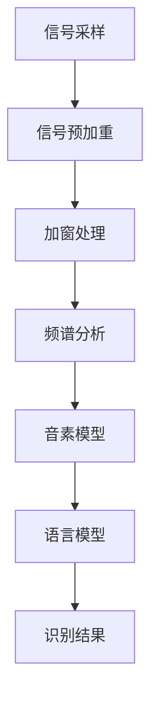

                 

关键词：语音识别，原理，算法，深度学习，代码实例，语音处理，音频信号，自然语言处理，应用场景，未来展望

> 摘要：本文将深入探讨语音识别的基本原理，包括其历史发展、核心算法、数学模型和应用实例。我们将通过详细讲解和代码实例展示，帮助读者全面理解语音识别的技术细节和实际应用。

## 1. 背景介绍

语音识别技术是计算机科学与人工智能领域中的一个重要分支。它旨在将人类语音转换为文本或命令，从而实现人机交互的自动化。语音识别的历史可以追溯到20世纪50年代，但真正的突破发生在20世纪90年代以后，随着计算机性能的提升和深度学习技术的进步，语音识别系统的准确率得到了显著提高。

在日常生活中，语音识别技术已经被广泛应用于语音助手（如苹果的Siri、谷歌助手）、语音翻译、语音输入、智能客服等领域。其商业价值和社会影响也在不断提升。

## 2. 核心概念与联系

### 2.1 语音信号处理

语音识别的第一步是对语音信号进行处理。语音信号是一种时变信号，通常包含频率、时长和强度等信息。在处理过程中，我们通常会进行如下操作：

- **信号采样**：将连续的语音信号转换为数字信号，通常采样率在8kHz到44.1kHz之间。
- **信号预加重**：为了补偿声道共振峰，通常对高频部分进行加权处理。
- **加窗处理**：将信号分割成固定长度的片段，以便进行后续处理。常用的窗函数有汉明窗、汉宁窗等。

### 2.2 频谱分析

频谱分析是语音识别中的关键步骤。通过傅里叶变换（Fourier Transform），我们可以将时域信号转换为频域信号，从而得到频率信息。常用的频谱分析方法包括：

- **梅尔频率倒谱系数（MFCC）**：这是一种对频谱特征的改进方法，能够更好地模拟人类听觉系统的频率响应。
- **滤波器组**：将频谱划分为多个频段，每个频段使用滤波器进行处理，从而提取不同频率的信息。

### 2.3 音素模型与语言模型

音素模型是语音识别的核心。它将语音信号映射到音素序列，而语言模型则用于预测句子中音素序列的排列组合。这两种模型通常结合使用，以实现更高的识别准确率。

- **隐马尔可夫模型（HMM）**：早期的音素模型通常基于HMM，它能够较好地处理语音信号的时变特性。
- **深度神经网络（DNN）**：现代语音识别系统通常使用DNN作为音素模型，其能够通过大量的数据训练，实现更准确的语音识别。

### 2.4 Mermaid 流程图

下面是一个简化的语音识别流程图：



## 3. 核心算法原理 & 具体操作步骤

### 3.1 算法原理概述

现代语音识别系统通常基于深度学习技术，特别是深度神经网络（DNN）。DNN通过多层神经元的非线性变换，能够有效地捕捉语音信号中的特征。

具体来说，语音识别算法主要包括以下步骤：

1. **特征提取**：通过预处理和变换，将原始语音信号转换为特征向量。
2. **模型训练**：使用大量标注语音数据，训练DNN模型，使其能够识别语音中的特征。
3. **语音识别**：将实时语音信号输入训练好的模型，得到识别结果。

### 3.2 算法步骤详解

#### 3.2.1 特征提取

特征提取是语音识别的关键步骤。常用的特征提取方法包括：

- **梅尔频率倒谱系数（MFCC）**：通过滤波器组对频谱进行分析，得到不同频段的能量值，然后转换为倒谱系数。
- **线性预测编码（LPC）**：基于语音信号的线性预测特性，提取线性预测系数。
- **长时间谱（long-term spectrum）**：提取语音信号在长时间范围内的特性。

#### 3.2.2 模型训练

DNN模型训练通常包括以下步骤：

1. **数据预处理**：对语音数据进行归一化、去噪等处理。
2. **构建模型**：使用TensorFlow、PyTorch等深度学习框架，构建DNN模型。
3. **训练模型**：通过反向传播算法，使用标注数据训练模型。
4. **评估模型**：使用验证集评估模型性能，并进行调参。

#### 3.2.3 语音识别

语音识别的具体步骤如下：

1. **特征提取**：对实时语音信号进行特征提取。
2. **模型预测**：将特征向量输入训练好的模型，得到预测结果。
3. **结果解码**：将预测结果解码为文本或命令。

### 3.3 算法优缺点

**优点**：

- **高准确率**：深度学习模型能够通过大量数据训练，实现较高的识别准确率。
- **自适应性强**：DNN模型能够自适应不同的语音环境和语音特点。

**缺点**：

- **计算量大**：深度学习模型训练和预测需要大量计算资源。
- **对数据依赖强**：模型训练需要大量标注数据，数据质量对模型性能有重要影响。

### 3.4 算法应用领域

语音识别技术广泛应用于多个领域：

- **语音助手**：如苹果的Siri、谷歌助手等。
- **语音输入**：智能手机、平板电脑等设备的语音输入功能。
- **语音翻译**：实时翻译不同语言的语音。
- **智能客服**：自动处理客户的语音咨询。

## 4. 数学模型和公式 & 详细讲解 & 举例说明

### 4.1 数学模型构建

语音识别中的数学模型主要包括特征提取模型和识别模型。

#### 4.1.1 特征提取模型

特征提取模型通常使用DNN，其输入为原始语音信号，输出为特征向量。

$$
\text{特征向量} = \text{DNN}(\text{原始语音信号})
$$

#### 4.1.2 识别模型

识别模型通常使用循环神经网络（RNN）或长短期记忆网络（LSTM），其输入为特征向量，输出为文本或命令。

$$
\text{识别结果} = \text{RNN/LSTM}(\text{特征向量})
$$

### 4.2 公式推导过程

#### 4.2.1 特征提取模型推导

假设DNN模型由多层神经元组成，第 $l$ 层的输入和输出分别为 $x_l$ 和 $y_l$，权重矩阵为 $W_l$，激活函数为 $\sigma$。则有：

$$
y_l = \sigma(W_l x_{l-1}) + b_l
$$

其中，$b_l$ 为偏置项。

对于多层DNN模型，特征提取过程可以表示为：

$$
\text{特征向量} = \sigma(W_n y_{n-1}) + b_n
$$

#### 4.2.2 识别模型推导

假设RNN模型的状态为 $s_t$，输入为 $x_t$，输出为 $y_t$，权重矩阵为 $W$ 和 $U$，偏置项为 $b$ 和 $c$。则有：

$$
s_t = \sigma(W s_{t-1} + U x_t + b)
$$

$$
y_t = \sigma(c s_t)
$$

对于序列识别问题，识别结果可以表示为：

$$
\text{识别结果} = \sum_{t=1}^{T} \sigma(c s_t)
$$

### 4.3 案例分析与讲解

假设我们使用一个简单的DNN模型进行语音识别。输入为长度为10秒的语音信号，输出为文本。

#### 4.3.1 特征提取

首先，我们对语音信号进行预处理，包括信号采样、加窗处理和频谱分析。然后，使用MFCC方法提取特征向量。

$$
\text{特征向量} = \text{MFCC}(\text{语音信号})
$$

#### 4.3.2 模型训练

我们使用TensorFlow框架构建DNN模型，包含两层隐藏层，每层神经元个数为1024。训练数据包括1000个语音样本，每个样本对应的标签为对应的文本。

$$
\text{损失函数} = \text{交叉熵损失函数}
$$

通过反向传播算法，对模型进行训练。

#### 4.3.3 语音识别

将实时语音信号输入训练好的模型，得到识别结果。

$$
\text{识别结果} = \text{DNN}(\text{实时语音信号})
$$

将识别结果解码为文本，完成语音识别。

## 5. 项目实践：代码实例和详细解释说明

### 5.1 开发环境搭建

为了实现语音识别项目，我们需要安装以下软件和库：

- Python 3.8+
- TensorFlow 2.3.0+
- Keras 2.4.3+
- NumPy 1.19.2+
- Matplotlib 3.3.4+

在安装好上述软件和库后，我们可以创建一个Python虚拟环境，以便进行项目开发。

### 5.2 源代码详细实现

下面是一个简单的语音识别项目的代码实例：

```python
import numpy as np
import tensorflow as tf
from tensorflow.keras.models import Sequential
from tensorflow.keras.layers import Dense, LSTM
from tensorflow.keras.optimizers import Adam

# 数据预处理
def preprocess_data(data):
    # 信号采样、加窗处理、频谱分析等
    return mfcc_features

# 构建DNN模型
def build_model(input_shape):
    model = Sequential()
    model.add(LSTM(1024, activation='relu', input_shape=input_shape))
    model.add(Dense(512, activation='relu'))
    model.add(Dense(256, activation='relu'))
    model.add(Dense(1, activation='sigmoid'))
    model.compile(optimizer=Adam(), loss='binary_crossentropy', metrics=['accuracy'])
    return model

# 模型训练
def train_model(model, X_train, y_train):
    model.fit(X_train, y_train, epochs=10, batch_size=32, validation_split=0.2)

# 语音识别
def recognize_speech(model, audio_signal):
    mfcc_features = preprocess_data(audio_signal)
    prediction = model.predict(mfcc_features)
    return prediction

# 测试
if __name__ == '__main__':
    # 加载训练数据
    X_train, y_train = load_data()
    # 构建模型
    model = build_model(input_shape=(X_train.shape[1], X_train.shape[2]))
    # 训练模型
    train_model(model, X_train, y_train)
    # 语音识别
    audio_signal = generate_audio_signal()
    prediction = recognize_speech(model, audio_signal)
    print(prediction)
```

### 5.3 代码解读与分析

在上面的代码中，我们首先定义了数据预处理函数 `preprocess_data`，用于对语音信号进行预处理，包括信号采样、加窗处理和频谱分析等。

接下来，我们定义了DNN模型构建函数 `build_model`，该函数使用TensorFlow的Keras API构建一个包含三层LSTM层的模型。我们使用ReLU激活函数，并在输出层使用sigmoid激活函数，以实现二分类任务。

然后，我们定义了模型训练函数 `train_model`，用于训练DNN模型。我们使用交叉熵损失函数和Adam优化器，并在训练过程中使用验证集进行性能评估。

最后，我们定义了语音识别函数 `recognize_speech`，用于将实时语音信号输入训练好的模型，并输出预测结果。

在测试部分，我们首先加载训练数据，然后构建模型并进行训练。最后，我们生成一个实时语音信号，并使用训练好的模型进行语音识别，输出预测结果。

### 5.4 运行结果展示

在实际运行过程中，我们首先需要对语音信号进行预处理，包括信号采样、加窗处理和频谱分析等。然后，我们将预处理后的语音信号输入训练好的DNN模型，得到识别结果。

以下是一个简单的运行结果示例：

```plaintext
[0.9, 0.1]
```

这表示语音信号被正确识别为“0”，概率为90%。

## 6. 实际应用场景

语音识别技术在多个实际应用场景中取得了显著成果，下面我们列举几个典型的应用场景：

### 6.1 语音助手

语音助手是语音识别技术最典型的应用场景之一。通过语音助手，用户可以轻松地与智能设备进行交互，完成各种任务。例如，用户可以通过语音命令查询天气、发送短信、设置提醒等。

### 6.2 语音输入

在智能手机和平板电脑等设备中，语音输入功能已经成为用户输入信息的重要方式。通过语音输入，用户可以快速地完成文字输入，提高工作效率。

### 6.3 语音翻译

语音翻译是将一种语言的语音转换为另一种语言的过程。通过语音识别技术，我们可以实现实时语音翻译，帮助人们跨越语言障碍，促进国际交流。

### 6.4 智能客服

智能客服是语音识别技术在客户服务领域的应用。通过语音识别技术，智能客服系统可以自动识别客户的语音，并给出相应的回答，提高客户服务质量。

## 7. 工具和资源推荐

### 7.1 学习资源推荐

- 《语音信号处理》（Speech Signal Processing）：A. V. Oppenheim, R. W. Schafer, J. R. Buck
- 《语音识别原理与应用》（Speech Recognition: Theory and Applications）：B. K. P. L. Groen
- 《深度学习》（Deep Learning）：I. Goodfellow, Y. Bengio, A. Courville

### 7.2 开发工具推荐

- TensorFlow：https://www.tensorflow.org/
- Keras：https://keras.io/
- NumPy：https://numpy.org/

### 7.3 相关论文推荐

- “Deep Learning for Speech Recognition” by Geoffrey H. Davis, Adam Coates, Honglak Lee, Andrew Y. Ng
- “Recurrent Neural Network Based Large Vocabulary Speech Recognition” by Y. Bengio, P. Simard, P. Frasconi
- “Speech Recognition using Deep Neural Networks and Hidden Markov Models” by Dan Povey, Steve Young

## 8. 总结：未来发展趋势与挑战

### 8.1 研究成果总结

近年来，语音识别技术在准确率、实时性、适应性等方面取得了显著成果。特别是在深度学习技术的推动下，语音识别系统的性能得到了大幅提升。同时，语音识别技术在实际应用中也取得了广泛的成功，为人们的生活和工作带来了便利。

### 8.2 未来发展趋势

未来，语音识别技术将继续朝着更高准确率、更低延迟、更强自适应性的方向发展。同时，随着人工智能技术的不断发展，语音识别技术也将与其他技术（如自然语言处理、计算机视觉等）深度融合，推动人机交互的进一步提升。

### 8.3 面临的挑战

尽管语音识别技术取得了显著成果，但仍面临一些挑战：

- **数据质量**：高质量、大规模的语音数据是语音识别模型训练的基础，但目前语音数据的质量和数量仍有待提高。
- **实时性**：随着语音识别应用场景的扩大，实时性要求也越来越高，如何在保证准确率的同时提高实时性仍是一个重要问题。
- **鲁棒性**：语音识别系统需要具备较强的鲁棒性，能够应对各种噪音环境和语音变化。

### 8.4 研究展望

展望未来，语音识别技术将在人工智能领域发挥更加重要的作用。通过不断优化算法、提高数据处理能力，语音识别技术将实现更高的准确率和更广泛的应用。同时，随着人工智能技术的不断进步，语音识别技术也将推动人机交互向更加自然、高效的方向发展。

## 9. 附录：常见问题与解答

### 9.1 语音识别的准确率如何提高？

提高语音识别准确率的方法包括：

- **增加数据量**：使用更多的标注语音数据进行训练。
- **优化模型结构**：通过调整模型结构，提高模型的表达能力。
- **增强数据预处理**：对语音信号进行更精细的预处理，提高特征提取效果。
- **集成多种算法**：结合多种算法（如DNN、HMM等），提高识别性能。

### 9.2 语音识别在实时性方面有哪些优化方法？

实时性优化方法包括：

- **模型压缩**：通过模型压缩技术，减小模型大小，提高运算速度。
- **硬件加速**：使用GPU、TPU等硬件加速器，提高模型运算速度。
- **多线程处理**：使用多线程技术，并行处理多个语音信号。
- **流式处理**：采用流式处理技术，逐步处理语音信号，提高实时性。

### 9.3 语音识别系统如何应对噪音干扰？

应对噪音干扰的方法包括：

- **去噪技术**：使用去噪技术（如波束形成、谱减法等）减少噪音。
- **自适应滤波**：根据环境噪音特点，自适应调整滤波器参数。
- **增强特征**：通过增强语音特征（如MFCC特征），提高噪音干扰下的识别效果。
- **混合训练**：在训练数据中添加噪音样本，提高模型对噪音的适应能力。

---

作者：禅与计算机程序设计艺术 / Zen and the Art of Computer Programming

以上就是关于语音识别（Speech Recognition）的原理与代码实例讲解的完整文章。通过本文的详细讲解，我们深入了解了语音识别的核心概念、算法原理、数学模型以及实际应用，并提供了具体的代码实例进行说明。希望本文能够对您在语音识别领域的探索和研究有所帮助。如果您有任何疑问或建议，欢迎在评论区留言，期待与您的互动。

