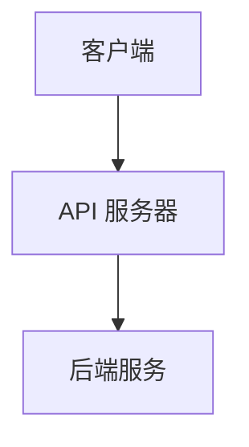

                 

关键词：API调用、外部服务、集成、互操作性、软件开发、技术生态、应用程序开发、协作

> 摘要：随着互联网和云计算的快速发展，调用外部 API（应用程序编程接口）在软件开发中变得越来越重要。本文将探讨调用外部 API 的核心重要性，包括其对于提高开发效率、促进创新、增强系统可扩展性和增强安全性的影响。此外，本文还将深入分析 API 调用的技术原理、最佳实践和未来的发展趋势。

## 1. 背景介绍

在过去的几十年中，软件开发经历了从单体应用向微服务架构的演变。随着软件系统的复杂性不断增加，开发者不再只是关注如何构建一个完整的系统，而是更多地关注如何高效地集成各种外部服务和资源。这种趋势催生了大量外部 API 的涌现，这些 API 提供了丰富的功能和数据，使得开发者可以更加专注于业务逻辑的实现，而无需从零开始构建一切。

API 调用的重要性体现在多个方面。首先，它为开发者提供了强大的工具，用于访问外部数据源、执行特定的任务以及与其他系统进行通信。其次，API 调用促进了不同系统之间的互操作性，使得软件系统能够无缝集成，提供更加统一的用户体验。此外，API 调用还能够显著提高开发效率和系统可扩展性，同时降低开发和维护成本。

## 2. 核心概念与联系

### 2.1 API 定义

API 是一种接口，允许不同软件系统之间进行通信和交互。它定义了一套规则和协议，用于数据的传输和处理。API 可以是公开的，也可以是私有的，取决于其提供的服务的目的和范围。

### 2.2 API 调用的概念

API 调用是指客户端程序通过特定的协议和接口请求服务端程序执行特定任务的过程。这个过程通常涉及发送 HTTP 请求，服务端处理请求，然后返回响应。

### 2.3 API 与 SDK

SDK（软件开发工具包）是一套工具和库，用于简化 API 的使用。SDK 通常提供了封装好的接口和示例代码，使得开发者可以更加轻松地调用 API。

### 2.4 API 调用的架构

API 调用的基本架构包括客户端、API 服务器和后端服务。客户端通过发送请求与 API 服务器通信，API 服务器负责路由和处理请求，然后将请求转发给后端服务，后端服务执行具体的业务逻辑，并将结果返回给客户端。



## 3. 核心算法原理 & 具体操作步骤

### 3.1 算法原理概述

API 调用的核心算法主要涉及 HTTP 协议的使用和数据处理。HTTP 是一种请求-响应协议，客户端发送 HTTP 请求，服务端返回 HTTP 响应。这个过程通常包括以下步骤：

1. 客户端构建 HTTP 请求，包括请求方法（GET、POST、PUT 等）、URL、请求头和请求体。
2. 客户端发送 HTTP 请求到 API 服务器。
3. API 服务器接收请求，解析请求信息，并路由到相应的后端服务。
4. 后端服务处理请求，执行具体的业务逻辑，并生成响应。
5. API 服务器将响应返回给客户端。
6. 客户端接收响应，解析响应内容，并处理结果。

### 3.2 算法步骤详解

#### 3.2.1 构建HTTP请求

构建 HTTP 请求是 API 调用的第一步。开发者需要根据 API 文档提供的详细信息来构建请求。以下是一个简单的 HTTP GET 请求示例：

```python
import requests

url = 'https://api.example.com/data'
headers = {
    'Authorization': 'Bearer your-access-token'
}

response = requests.get(url, headers=headers)
```

#### 3.2.2 发送HTTP请求

构建好请求后，客户端通过发送请求与 API 服务器通信。在 Python 中，可以使用 `requests` 库轻松发送 HTTP 请求。以下是一个简单的示例：

```python
response = requests.get(url, headers=headers)
```

#### 3.2.3 处理HTTP响应

服务端处理后返回响应，客户端需要解析响应并处理结果。以下是一个简单的响应处理示例：

```python
if response.status_code == 200:
    data = response.json()
    print(data)
else:
    print(f"Error: {response.status_code}")
```

### 3.3 算法优缺点

#### 优点：

1. **高效性**：API 调用使得开发者可以快速访问外部资源和功能，无需从头开始实现。
2. **互操作性**：API 提供了标准的接口，使得不同系统之间能够无缝集成。
3. **可扩展性**：通过调用外部 API，开发者可以灵活地扩展系统功能，而无需对现有代码进行大量修改。

#### 缺点：

1. **依赖性**：过度依赖外部 API 可能导致系统的稳定性受到影响。
2. **性能开销**：频繁的 API 调用可能引入额外的网络延迟和性能开销。

### 3.4 算法应用领域

API 调用在许多领域都有广泛的应用，包括但不限于：

1. **数据集成**：通过调用外部 API，开发者可以整合来自不同数据源的数据，提供更加丰富的信息。
2. **身份验证和授权**：许多 API 提供身份验证和授权服务，使得开发者可以轻松实现用户身份验证。
3. **业务逻辑处理**：API 调用可以用于执行特定的业务逻辑，例如支付处理、订单管理等。

## 4. 数学模型和公式 & 详细讲解 & 举例说明

### 4.1 数学模型构建

API 调用的一个关键因素是响应时间。假设 API 服务器的响应时间为 \( T \)，客户端与 API 服务器的网络延迟为 \( L \)，则总响应时间为：

\[ T_{total} = T + L \]

### 4.2 公式推导过程

网络延迟 \( L \) 可以通过以下公式计算：

\[ L = \frac{d}{v} \]

其中，\( d \) 是客户端与 API 服务器之间的距离，\( v \) 是网络的传输速度。

假设网络的传输速度为 \( v = 10^8 \) m/s，客户端与 API 服务器之间的距离为 \( d = 1000 \) km，则网络延迟为：

\[ L = \frac{1000 \times 10^3}{10^8} = 10 \] 秒

API 服务器的响应时间 \( T \) 通常由服务器性能和负载决定，假设 \( T = 2 \) 秒，则总响应时间为：

\[ T_{total} = T + L = 2 + 10 = 12 \] 秒

### 4.3 案例分析与讲解

假设一个应用程序需要调用一个外部 API 来获取天气数据。天气 API 的响应时间 \( T \) 通常为 5 秒，网络延迟 \( L \) 为 3 秒。则总响应时间为：

\[ T_{total} = T + L = 5 + 3 = 8 \] 秒

在这种情况下，应用程序的平均响应时间为 8 秒，这对于用户来说可能是可接受的。然而，如果响应时间进一步增加，用户可能会感到延迟，从而影响用户体验。

## 5. 项目实践：代码实例和详细解释说明

### 5.1 开发环境搭建

在开始编写代码之前，我们需要搭建一个开发环境。以下是一个简单的步骤：

1. 安装 Python 3.x 版本。
2. 安装 `requests` 库，可以使用以下命令：

```bash
pip install requests
```

### 5.2 源代码详细实现

以下是一个简单的 Python 脚本，用于调用一个天气 API 并获取天气数据：

```python
import requests

def get_weather(api_url, access_token):
    headers = {
        'Authorization': f'Bearer {access_token}',
        'Content-Type': 'application/json'
    }
    response = requests.get(api_url, headers=headers)
    if response.status_code == 200:
        data = response.json()
        print(data)
    else:
        print(f"Error: {response.status_code}")

if __name__ == '__main__':
    api_url = 'https://api.example.com/weather'
    access_token = 'your-access-token'
    get_weather(api_url, access_token)
```

### 5.3 代码解读与分析

这段代码首先导入了 `requests` 库，然后定义了一个 `get_weather` 函数，用于调用天气 API 并获取天气数据。函数接收两个参数：API URL 和访问令牌。

在函数内部，我们构建了一个包含 `Authorization` 和 `Content-Type` 请求头的字典，然后使用 `requests.get` 方法发送 HTTP GET 请求。如果响应状态码为 200（成功），则解析 JSON 响应并打印天气数据。否则，打印错误信息。

在主程序部分，我们定义了 API URL 和访问令牌，并调用 `get_weather` 函数来获取天气数据。

### 5.4 运行结果展示

运行这段代码后，我们可能会看到以下输出：

```json
{
    "city": "Shanghai",
    "temperature": 28,
    "weather": "Sunny"
}
```

这表示我们成功获取了上海当前的天气数据。

## 6. 实际应用场景

API 调用在许多实际应用场景中发挥着重要作用。以下是一些常见的应用场景：

1. **社交媒体集成**：应用程序可以调用社交媒体平台的 API，获取用户信息、发布内容等。
2. **支付处理**：在线购物网站可以调用支付网关的 API，处理支付请求和验证支付状态。
3. **数据分析**：应用程序可以调用数据分析平台的 API，获取数据报表和可视化图表。
4. **地理位置服务**：应用程序可以调用地图 API，获取地理位置信息和路线规划。

## 7. 工具和资源推荐

### 7.1 学习资源推荐

1. 《API 设计指南》（API Design Guide）- 本书提供了关于如何设计和实现高质量的 API 的最佳实践。
2. 《RESTful API 设计最佳实践》（RESTful API Design Best Practices）- 本书详细介绍了 RESTful API 的设计原则和实践。

### 7.2 开发工具推荐

1. Postman - 用于测试和调试 API 的强大工具。
2. Swagger - 用于 API 文档生成的工具，使得开发者可以轻松地理解和使用 API。

### 7.3 相关论文推荐

1. "Representational State Transfer (REST)" - Roy Fielding 的这篇论文阐述了 REST 架构风格，对于理解 API 设计至关重要。
2. "Design and Implementation of the Netscape Navigator Browser" - 本论文描述了 Netscape Navigator 浏览器的设计和实现，其中包含了大量关于 API 设计的见解。

## 8. 总结：未来发展趋势与挑战

### 8.1 研究成果总结

近年来，API 调用在软件开发中的应用越来越广泛，成为构建现代应用程序的核心技术之一。通过调用外部 API，开发者可以快速访问各种服务和资源，提高开发效率和系统可扩展性。

### 8.2 未来发展趋势

1. **标准化和规范化**：API 的标准化和规范化将继续发展，以提供更好的互操作性和兼容性。
2. **安全性和隐私保护**：随着数据隐私和安全问题日益突出，API 设计和实现将更加注重安全性。
3. **云计算和边缘计算**：随着云计算和边缘计算的兴起，API 将在这些领域发挥更加重要的作用。

### 8.3 面临的挑战

1. **依赖性和稳定性**：过度依赖外部 API 可能会导致系统的稳定性问题，特别是在 API 出现故障或变更时。
2. **性能和延迟**：频繁的 API 调用可能会引入性能和延迟问题，影响用户体验。
3. **安全性**：API 调用过程中需要处理敏感数据，因此安全性是一个重大挑战。

### 8.4 研究展望

未来，API 调用技术将继续发展，特别是在以下几个方面：

1. **自动化和智能化**：通过自动化和智能化技术，开发者可以更轻松地管理和调用 API。
2. **API 网关**：API 网关将成为集成和管理 API 的重要工具，提供安全、性能和监控等功能。
3. **区块链 API**：区块链技术的兴起将带来新的 API 调用场景，例如智能合约和去中心化应用。

## 9. 附录：常见问题与解答

### 9.1 如何确保 API 调用的安全性？

确保 API 调用的安全性可以通过以下措施实现：

1. **使用 HTTPS**：确保 API 通信使用 HTTPS，以加密数据传输。
2. **认证和授权**：使用 OAuth、JWT 等认证和授权机制，确保只有授权用户可以访问 API。
3. **安全 Headers**：设置安全请求头，例如 `Content-Security-Policy`、`X-Content-Type-Options` 等。

### 9.2 如何优化 API 调用的性能？

优化 API 调用的性能可以通过以下措施实现：

1. **缓存**：使用缓存技术减少 API 调用的频率。
2. **异步调用**：使用异步调用减少阻塞，提高系统响应速度。
3. **负载均衡**：使用负载均衡器分散请求，提高系统处理能力。

### 9.3 如何处理 API 失败或变更？

处理 API 失败或变更可以通过以下措施实现：

1. **错误处理**：对 API 调用进行错误处理，确保系统在 API 出现问题时能够优雅地处理。
2. **版本控制**：使用 API 版本控制，确保在 API 变更时能够平滑过渡。
3. **持续集成**：通过持续集成和测试，及时发现和解决 API 变更带来的问题。

---

作者：禅与计算机程序设计艺术 / Zen and the Art of Computer Programming

----------------------------------------------------------------

这篇文章详细探讨了调用外部 API 的重要性，包括其背景介绍、核心概念、算法原理、数学模型、项目实践和实际应用场景。同时，还提供了相关的工具和资源推荐，并总结了未来发展趋势和挑战。希望这篇文章能够为读者在软件开发过程中调用外部 API 提供有价值的指导和启示。在未来的发展中，API 调用技术将继续推动软件开发的进步，带来更多的创新和便利。

