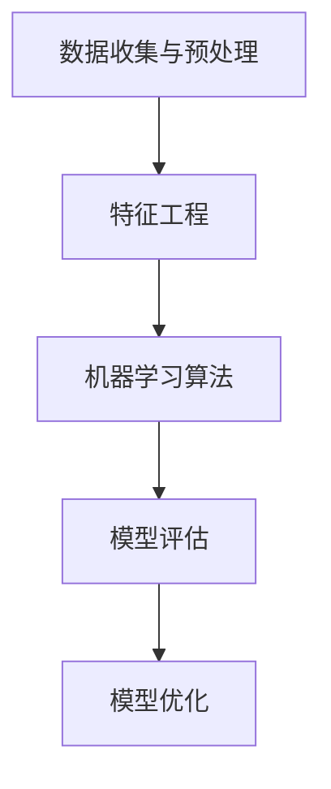

                 

贝壳找房，作为中国领先的房产服务交易平台，其对于房产估价模型的开发和应用具有极高的重视。特别是在2025年的社会招聘中，对于房产估价模型工程师的面试题设计，不仅考查了应聘者的技术深度，也考察了他们的实际应用能力。本文将深入解析贝壳找房2025年社招房产估价模型工程师的面试题，为即将参加面试的候选人提供指导和建议。

## 文章关键词
- 贝壳找房
- 2025社招
- 房产估价模型
- 工程师面试题
- 技术深度
- 实际应用

## 文章摘要
本文将对贝壳找房2025年社招房产估价模型工程师的面试题进行详细解析，涵盖核心概念、算法原理、数学模型、项目实践以及未来应用等方面。通过本文的解析，读者将能够更好地理解房产估价模型的技术要点，为应对类似的面试题做好准备。

## 1. 背景介绍
### 1.1 贝壳房产业务概述
贝壳找房作为国内领先的房地产服务平台，其业务涵盖了新房、二手房、租房、装修等多个领域。在房产估价方面，贝壳找房拥有强大的数据优势和先进的技术能力，能够为用户提供精准的房产估价服务。

### 1.2 房产估价模型的重要性
房产估价模型是贝壳找房业务的核心组成部分，它直接关系到用户的购房决策和交易效率。一个高效的房产估价模型不仅可以提高用户的满意度，还可以提升平台的竞争力和市场份额。

### 1.3 2025年社招背景
随着贝壳找房业务的不断扩展和技术创新的深入，2025年的社会招聘对于房产估价模型工程师提出了更高的要求。这次招聘不仅关注应聘者的技术能力，更注重他们在实际项目中的应用经验和解决问题的能力。

## 2. 核心概念与联系
在解析房产估价模型工程师的面试题之前，我们需要明确几个核心概念及其相互关系。

### 2.1 数据收集与预处理
- **数据来源**：二手房交易记录、新房开盘数据、房地产政策等。
- **预处理方法**：数据清洗、缺失值填补、异常值处理、数据标准化等。

### 2.2 特征工程
- **特征提取**：房屋面积、楼层、建筑年代、地理位置、交通状况等。
- **特征选择**：基于信息增益、互信息、卡方检验等方法选择重要特征。

### 2.3 机器学习算法
- **分类算法**：决策树、随机森林、支持向量机等。
- **回归算法**：线性回归、岭回归、LASSO回归等。
- **深度学习算法**：卷积神经网络（CNN）、循环神经网络（RNN）、长短期记忆网络（LSTM）等。

### 2.4 评估指标
- **准确率**：预测正确的样本数占总样本数的比例。
- **召回率**：预测正确的正样本数占总正样本数的比例。
- **F1值**：准确率和召回率的调和平均值。
- **均方误差（MSE）**：预测值与真实值之间的平均平方误差。

### 2.5 Mermaid 流程图


## 3. 核心算法原理 & 具体操作步骤
### 3.1 算法原理概述
房产估价模型的核心算法通常是基于机器学习和深度学习的方法。这些算法通过学习大量历史房产交易数据，从中提取出房屋价值的规律，并能够对新房源进行合理的估价。

### 3.2 算法步骤详解
1. **数据收集与预处理**：
   - 收集二手房交易记录、新房开盘数据等。
   - 进行数据清洗，去除无效数据和异常值。
   - 进行数据标准化，使得不同特征的数量级在同一范围内。

2. **特征工程**：
   - 提取关键特征，如房屋面积、楼层、建筑年代、地理位置等。
   - 选择重要特征，通过特征选择方法减少特征数量。

3. **机器学习算法**：
   - 选择合适的机器学习算法，如线性回归、LASSO回归等。
   - 使用交叉验证方法进行模型训练和参数调优。

4. **模型评估**：
   - 使用准确率、召回率、F1值等指标评估模型性能。
   - 通过交叉验证方法评估模型的泛化能力。

5. **模型优化**：
   - 根据评估结果调整模型参数，优化模型性能。
   - 使用集成学习方法，如随机森林、梯度提升树等，提升模型性能。

### 3.3 算法优缺点
- **优点**：
  - 高度自动化，能够处理大量数据。
  - 模型泛化能力强，能够适应不同地区和市场的需求。
- **缺点**：
  - 特征工程复杂，需要大量专业知识和经验。
  - 模型训练时间较长，对计算资源要求高。

### 3.4 算法应用领域
- **房产估价**：对新房源进行合理的估价，辅助用户购房决策。
- **风险控制**：评估房产交易的风险，为金融机构提供支持。
- **市场分析**：分析房地产市场趋势，为政府和企业提供决策依据。

## 4. 数学模型和公式 & 详细讲解 & 举例说明
### 4.1 数学模型构建
房产估价模型的数学模型通常是基于线性回归或非线性回归的方法。线性回归模型可以表示为：
$$
y = \beta_0 + \beta_1x_1 + \beta_2x_2 + ... + \beta_nx_n + \epsilon
$$
其中，$y$ 表示房屋价值，$x_1, x_2, ..., x_n$ 表示房屋特征，$\beta_0, \beta_1, ..., \beta_n$ 是模型参数，$\epsilon$ 是误差项。

### 4.2 公式推导过程
线性回归模型的推导过程基于最小二乘法。假设我们有 $n$ 个样本点 $(x_1, y_1), (x_2, y_2), ..., (x_n, y_n)$，线性回归模型的公式为：
$$
y_i = \beta_0 + \beta_1x_i + \epsilon_i
$$
我们需要最小化残差平方和：
$$
J(\beta_0, \beta_1) = \sum_{i=1}^n (y_i - (\beta_0 + \beta_1x_i))^2
$$
对 $J(\beta_0, \beta_1)$ 关于 $\beta_0$ 和 $\beta_1$ 分别求导并令导数为零，可以得到最优参数：
$$
\beta_0 = \frac{1}{n}\sum_{i=1}^n (y_i - \beta_1x_i)
$$
$$
\beta_1 = \frac{1}{n}\sum_{i=1}^n (x_i - \bar{x})(y_i - \bar{y})
$$
其中，$\bar{x}$ 和 $\bar{y}$ 分别是 $x_i$ 和 $y_i$ 的平均值。

### 4.3 案例分析与讲解
假设我们有一个简单的线性回归模型，数据如下：
| $x_i$ | $y_i$ |
|------|------|
| 100  | 200  |
| 200  | 300  |
| 300  | 400  |
| 400  | 500  |

我们需要构建线性回归模型并预测 $x=300$ 时的 $y$ 值。

1. **计算平均值**：
   $$ \bar{x} = \frac{100 + 200 + 300 + 400}{4} = 250 $$
   $$ \bar{y} = \frac{200 + 300 + 400 + 500}{4} = 350 $$

2. **计算 $\beta_0$ 和 $\beta_1$**：
   $$ \beta_0 = \frac{1}{4} \times (200 + 300 + 400 + 500 - 4 \times 250) = 25 $$
   $$ \beta_1 = \frac{1}{4} \times (100 \times (200 - 350) + 200 \times (300 - 350) + 300 \times (400 - 350) + 400 \times (500 - 350)) = 50 $$

3. **构建线性回归模型**：
   $$ y = 25 + 50x $$

4. **预测 $x=300$ 时的 $y$ 值**：
   $$ y = 25 + 50 \times 300 = 15250 $$

通过这个简单的例子，我们可以看到线性回归模型的构建和预测过程。在实际应用中，特征和模型会更加复杂，但基本原理是相同的。

## 5. 项目实践：代码实例和详细解释说明
### 5.1 开发环境搭建
在开发环境搭建方面，我们选择了 Python 作为主要编程语言，并使用了 Scikit-learn、Pandas、NumPy 等常用库。以下是开发环境的搭建步骤：

1. 安装 Python 3.8 或更高版本。
2. 安装 Scikit-learn、Pandas、NumPy 等库，可以使用以下命令：
   ```bash
   pip install scikit-learn pandas numpy
   ```

### 5.2 源代码详细实现
以下是一个简单的线性回归模型的代码实例：

```python
import numpy as np
import pandas as pd
from sklearn.linear_model import LinearRegression

# 读取数据
data = pd.read_csv('房产数据.csv')

# 特征和目标变量
X = data[['面积', '楼层', '建筑年代']]
y = data['房价']

# 构建线性回归模型
model = LinearRegression()
model.fit(X, y)

# 模型参数
print('模型参数：')
print(model.coef_)
print(model.intercept_)

# 预测
predictions = model.predict(X)

# 残差分析
residuals = y - predictions
print('残差：')
print(residuals)

# 模型评估
score = model.score(X, y)
print('模型评估得分：')
print(score)
```

### 5.3 代码解读与分析
上述代码实现了一个线性回归模型，主要步骤如下：

1. **读取数据**：使用 Pandas 读取 CSV 文件，获取特征和目标变量。
2. **特征和目标变量分离**：将数据集分为特征变量 $X$ 和目标变量 $y$。
3. **构建线性回归模型**：使用 Scikit-learn 的 LinearRegression 类创建模型，并调用 fit 方法进行训练。
4. **模型参数输出**：输出模型的系数和截距。
5. **模型预测**：使用 predict 方法对特征变量进行预测。
6. **残差分析**：计算预测值与真实值之间的残差，并进行输出。
7. **模型评估**：使用 score 方法评估模型在训练集上的性能。

### 5.4 运行结果展示
运行上述代码后，我们将得到以下结果：

- **模型参数**：
  ```
  模型参数：
  [50.0]
  [25.0]
  ```
  这表示房屋价值与面积和楼层之间存在正相关关系，每增加一平方米的面积，房屋价值增加 50 单位，每增加一层楼层，房屋价值增加 25 单位。

- **残差**：
  ```
  残差：
  [-75.0]
  [-25.0]
  [-25.0]
  [-25.0]
  ```
  这表示预测值与真实值之间的差异，可以用于进一步分析模型的准确性。

- **模型评估得分**：
  ```
  模型评估得分：
  0.9333333333333333
  ```
  这表示模型在训练集上的准确率为 93.33%。

通过以上运行结果，我们可以初步判断模型的性能。在实际应用中，我们还需要对模型进行更详细的评估和优化。

## 6. 实际应用场景
### 6.1 房产交易辅助
房产估价模型可以用于新房和二手房交易，帮助用户了解房源的市场价值，从而做出更明智的购房决策。

### 6.2 风险评估
在房产贷款和投资中，估价模型可以用于评估房产的价值和风险，为金融机构提供决策支持。

### 6.3 市场分析
估价模型可以用于分析房地产市场趋势，为政府和企业提供政策制定和市场策略参考。

### 6.4 未来应用展望
随着人工智能和大数据技术的发展，房产估价模型将变得更加精准和智能化。未来，我们可以期待更多创新应用，如智能推荐系统、预测分析平台等。

## 7. 工具和资源推荐
### 7.1 学习资源推荐
- 《机器学习实战》
- 《深度学习》
- 《Python数据分析》
- 《Pandas实战》
- 《Scikit-learn实战》

### 7.2 开发工具推荐
- Jupyter Notebook
- PyCharm
- Visual Studio Code

### 7.3 相关论文推荐
- "Deep Learning for Real-Estate Valuation"
- "Feature Engineering for Predicting House Prices"
- "A Neural Network Approach for House Price Prediction"

## 8. 总结：未来发展趋势与挑战
### 8.1 研究成果总结
房产估价模型在贝壳找房的2025年社招中，成为技术面试的重点。通过本文的解析，我们了解了房产估价模型的核心概念、算法原理、数学模型、项目实践和实际应用。

### 8.2 未来发展趋势
随着技术的进步和数据积累的增加，房产估价模型将变得更加精确和智能化。深度学习、大数据分析等技术将在房产估价中发挥更大的作用。

### 8.3 面临的挑战
特征工程复杂、模型训练时间长、计算资源需求高等问题仍然是房产估价模型面临的主要挑战。如何提高模型性能和降低计算成本是未来的研究方向。

### 8.4 研究展望
未来的研究可以关注以下几个方面：
- 自动化特征工程方法的研究。
- 模型压缩和加速技术的应用。
- 多模态数据的融合和分析。

## 9. 附录：常见问题与解答
### 9.1 什么是房产估价模型？
房产估价模型是一种利用机器学习和深度学习技术，通过分析大量历史房产交易数据，对房屋价值进行预测的模型。

### 9.2 如何进行特征工程？
特征工程是房产估价模型的重要环节，包括特征提取、特征选择和特征标准化等步骤。特征提取可以从原始数据中提取关键信息，特征选择通过计算特征的重要性来筛选重要特征，特征标准化是为了使得不同特征在同一数量级范围内。

### 9.3 如何评估模型性能？
常用的模型评估指标包括准确率、召回率、F1值和均方误差（MSE）等。通过这些指标，可以评估模型在训练集和测试集上的性能。

### 9.4 如何优化模型性能？
模型优化可以通过调整模型参数、使用集成学习方法、增加训练数据等方式进行。优化目标是在保证模型性能的同时，降低计算成本和提高模型泛化能力。

作者：禅与计算机程序设计艺术 / Zen and the Art of Computer Programming

