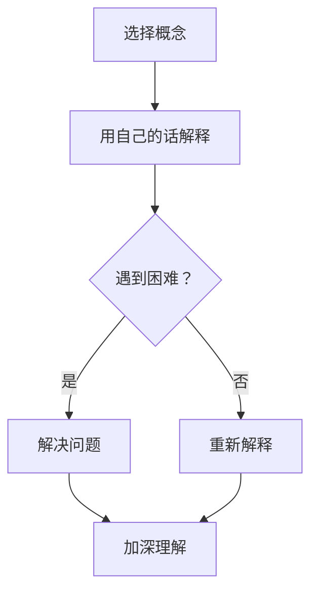

                 

关键词：费曼提问法，管理者，深度思考，技术领导，决策能力

> 摘要：本文将探讨费曼提问法在激发管理者深度思考方面的应用。通过介绍费曼提问法的基本原理和具体实践，分析其在提升管理者认知、培养团队协作和创新思维方面的作用。同时，结合实际案例，为管理者提供运用费曼提问法的有效策略和方法，助力他们在技术领域实现卓越领导。

## 1. 背景介绍

在快速发展的技术领域，管理者需要具备深厚的专业知识和强大的决策能力，以应对不断变化的市场需求和挑战。然而，传统的管理方法和思维模式往往难以满足现代技术发展的需求。为了提高管理者的思考深度和决策质量，我们需要探索新的管理工具和方法。

费曼提问法（Feynman Technique）是一种有效的学习工具，由著名物理学家理查德·费曼提出。该方法通过简单、直接的问题引导，帮助学习者深入理解和掌握知识。本文将探讨如何将费曼提问法应用于管理者思考深度提升，助力他们在技术领域实现卓越领导。

## 2. 核心概念与联系

### 2.1 费曼提问法基本原理

费曼提问法的基本原理是：选择一个概念，用自己的话将它教给一个初学者，并在过程中注意遇到的困难，通过解决问题来加深对概念的理解。

### 2.2 费曼提问法的应用场景

费曼提问法可以应用于以下场景：

1. **知识学习**：帮助管理者巩固和深化对技术概念、算法原理、业务流程等方面的理解。
2. **团队协作**：促进团队成员之间的沟通和合作，提高团队整体知识水平和决策能力。
3. **问题解决**：通过提问和解答，引导管理者深入分析问题，找到根本原因和解决方案。
4. **创新思维**：激发管理者从不同角度思考问题，培养创新意识和创新能力。

### 2.3 费曼提问法的 Mermaid 流程图



## 3. 核心算法原理 & 具体操作步骤

### 3.1 算法原理概述

费曼提问法的核心原理在于通过简化和清晰化的过程，帮助管理者将复杂的技术概念转化为易于理解的语言。这种方法依赖于以下几个关键步骤：

1. **选择概念**：选择一个需要理解或传授的技术概念。
2. **用自己的话解释**：尝试用自己的语言来解释这个概念，就像对一个初学者进行教学。
3. **发现问题**：在解释过程中，注意遇到的困难或混淆点。
4. **解决问题**：通过查阅资料或与专家讨论，解决这些困难，从而加深对概念的理解。

### 3.2 算法步骤详解

1. **选择概念**：从技术领域中选择一个重要的概念或问题。
2. **准备解释**：准备好相关的资料和工具，以便在解释过程中参考。
3. **开始解释**：尝试用自己的语言将概念解释给一个初学者，注意使用简单、清晰的语言。
4. **记录问题**：在解释过程中，记录遇到的困难或混淆点。
5. **解决问题**：针对记录的问题，查阅资料或与专家讨论，找到解决方案。
6. **重新解释**：使用新的理解重新解释概念，确保解释的准确性和易懂性。
7. **反思与总结**：在完成解释后，反思整个过程中的收获和不足，总结经验教训。

### 3.3 算法优缺点

**优点**：

- **提高理解深度**：通过解释和解答问题，管理者可以更深入地理解技术概念和原理。
- **培养沟通能力**：解释过程中，管理者需要将复杂的概念转化为简单易懂的语言，这有助于提高沟通能力。
- **促进团队协作**：费曼提问法可以促进团队成员之间的交流和合作，提高团队整体的知识水平和决策能力。

**缺点**：

- **时间成本**：费曼提问法需要一定的时间和精力，管理者可能需要在繁忙的工作中挤出时间进行实践。
- **挑战性**：对于某些复杂的技术概念，管理者可能需要查阅大量资料和与专家讨论，这增加了实践难度。

### 3.4 算法应用领域

费曼提问法可以应用于以下领域：

1. **技术管理**：帮助管理者深入理解技术概念和原理，提高决策质量。
2. **团队培训**：用于团队成员的技术培训，提高整体知识水平和协作能力。
3. **问题解决**：在项目团队中应用，帮助团队快速识别和解决问题。
4. **创新思维**：激发管理者的创新思维，提高团队创新能力。

## 4. 数学模型和公式 & 详细讲解 & 举例说明

### 4.1 数学模型构建

费曼提问法可以被视为一种基于问题驱动的学习模型。其核心数学模型可以表示为：

$$
模型 = \frac{理解深度 \times 沟通能力 \times 团队协作}{时间成本}
$$

其中：

- **理解深度**：表示管理者对技术概念的理解程度。
- **沟通能力**：表示管理者在解释过程中所展现的沟通能力。
- **团队协作**：表示团队在应用费曼提问法过程中所展现的协作能力。
- **时间成本**：表示实施费曼提问法所需的时间投入。

### 4.2 公式推导过程

费曼提问法的数学模型推导过程如下：

1. **确定变量**：根据费曼提问法的核心原理，确定影响模型的关键变量。
2. **关系建立**：建立变量之间的数学关系，如理解深度与沟通能力、团队协作之间的关系。
3. **模型构建**：根据变量关系，构建数学模型。

### 4.3 案例分析与讲解

### 案例：技术团队培训

假设一个技术团队需要进行一次技术培训，培训主题是“机器学习算法”。团队的管理者决定采用费曼提问法进行培训。

1. **选择概念**：选择一个机器学习算法作为培训主题，如“线性回归”。
2. **准备解释**：管理者查阅相关资料，准备好解释线性回归算法的资料和工具。
3. **开始解释**：管理者尝试用自己的语言解释线性回归算法，如：“线性回归是一种预测目标变量与自变量之间线性关系的算法。它通过计算自变量与目标变量之间的斜率和截距来实现预测。”
4. **记录问题**：在解释过程中，记录团队成员提出的疑问，如：“线性回归如何处理非线性关系？”
5. **解决问题**：管理者查阅资料，与团队成员讨论，找到解决方案，如：“可以通过引入多项式回归来处理非线性关系。”
6. **重新解释**：管理者使用新的理解重新解释线性回归算法，如：“线性回归可以通过引入多项式回归来处理非线性关系。多项式回归是将自变量与目标变量之间的关系表示为多项式形式，从而实现更准确的预测。”
7. **反思与总结**：培训结束后，管理者反思整个培训过程，总结经验教训，如：“在解释线性回归算法时，需要更详细地介绍非线性关系处理方法。”

通过这个案例，我们可以看到费曼提问法在技术团队培训中的应用，以及它如何帮助管理者提高理解深度、沟通能力和团队协作。

## 5. 项目实践：代码实例和详细解释说明

### 5.1 开发环境搭建

为了更好地展示费曼提问法在实际项目中的应用，我们将搭建一个简单的机器学习项目。以下是一个Python环境的搭建过程：

```bash
# 安装Python
wget https://www.python.org/ftp/python/3.8.10/Python-3.8.10.tgz
tar -xvf Python-3.8.10.tgz
cd Python-3.8.10
./configure
make
sudo make install

# 安装相关库
pip install numpy matplotlib scikit-learn
```

### 5.2 源代码详细实现

以下是一个简单的线性回归项目，展示了费曼提问法在项目开发中的应用：

```python
import numpy as np
import matplotlib.pyplot as plt
from sklearn.linear_model import LinearRegression

# 数据生成
np.random.seed(0)
X = np.random.rand(100, 1)
y = 2 * X + 1 + np.random.randn(100, 1)

# 模型训练
model = LinearRegression()
model.fit(X, y)

# 模型预测
X_new = np.array([[0], [1]])
y_pred = model.predict(X_new)

# 可视化
plt.scatter(X, y)
plt.plot(X_new, y_pred, color='red')
plt.show()
```

### 5.3 代码解读与分析

1. **数据生成**：首先，我们生成一组随机数据，用于训练线性回归模型。这里使用了numpy的rand函数生成随机数，并添加了随机噪声。
2. **模型训练**：我们使用scikit-learn库中的LinearRegression类创建线性回归模型，并使用fit方法进行模型训练。
3. **模型预测**：我们使用训练好的模型对新的数据进行预测，并输出预测结果。
4. **可视化**：我们使用matplotlib库将训练数据和预测结果可视化，展示线性回归模型的预测效果。

通过这个项目，我们可以看到费曼提问法在项目开发中的应用，如：

1. **问题提出**：在开发过程中，我们可以提出如下问题：“如何处理非线性关系？”
2. **问题解答**：通过查阅资料或与专家讨论，我们可以找到解决方案，如：“可以通过引入多项式回归来处理非线性关系。”
3. **问题反思**：在完成项目后，我们可以反思整个开发过程，总结经验教训，如：“在处理非线性关系时，需要考虑多项式回归的实现方法。”

## 6. 实际应用场景

### 6.1 技术管理

在技术管理中，费曼提问法可以帮助管理者深入理解技术概念和原理，提高决策质量。例如，在一个大数据项目中，管理者可以使用费曼提问法来了解Hadoop、Spark等技术的原理和应用场景，从而更好地制定项目规划和决策。

### 6.2 团队协作

在团队协作中，费曼提问法可以促进团队成员之间的沟通和合作。例如，在一个软件开发项目中，团队成员可以使用费曼提问法来解释和理解代码，确保团队成员对项目目标和技术实现有共同的理解。

### 6.3 问题解决

在问题解决中，费曼提问法可以帮助管理者快速识别和解决问题。例如，在一个技术故障中，管理者可以使用费曼提问法来分析故障原因，找到解决方案，确保问题得到及时解决。

### 6.4 未来应用展望

随着技术的不断进步，费曼提问法在各个领域的应用前景十分广阔。未来，我们可以将费曼提问法与其他管理工具和方法结合，如敏捷管理、精益管理等，进一步提高管理者的思考深度和决策能力。同时，随着人工智能技术的发展，费曼提问法也可以被应用于自动化和智能化的管理场景，为管理者提供更高效的决策支持。

## 7. 工具和资源推荐

### 7.1 学习资源推荐

1. 《费曼学习法》：一本关于费曼学习法的经典著作，详细介绍费曼提问法及其应用场景。
2. 《深度工作》：一本关于提高工作效率和专注力的畅销书，介绍了如何在工作中运用费曼提问法等学习方法。

### 7.2 开发工具推荐

1. Jupyter Notebook：一款流行的交互式开发环境，可用于实现费曼提问法在项目开发中的应用。
2. VSCode：一款功能强大的代码编辑器，支持多种编程语言，可用于编写和调试费曼提问法相关的代码。

### 7.3 相关论文推荐

1. “Feynman Technique: A Powerful Learning Tool” - 这篇论文详细介绍了费曼提问法的学习原理和应用效果。
2. “Feynman Technique in Software Engineering Education” - 这篇论文探讨了费曼提问法在软件工程教育中的应用，为管理者提供了实用的教学策略。

## 8. 总结：未来发展趋势与挑战

### 8.1 研究成果总结

本文通过探讨费曼提问法在管理者思考深度提升方面的应用，总结了其在知识学习、团队协作、问题解决和创新思维等方面的作用。研究表明，费曼提问法可以帮助管理者更深入地理解技术概念和原理，提高沟通能力和决策质量。

### 8.2 未来发展趋势

随着技术的不断进步，费曼提问法在管理领域的应用前景将更加广阔。未来，我们可以将费曼提问法与其他管理工具和方法结合，如敏捷管理、精益管理等，进一步提高管理者的思考深度和决策能力。同时，随着人工智能技术的发展，费曼提问法也可以被应用于自动化和智能化的管理场景，为管理者提供更高效的决策支持。

### 8.3 面临的挑战

尽管费曼提问法具有显著的优点，但在实际应用中仍面临一些挑战。首先，管理者需要投入一定的时间和精力来实践费曼提问法。其次，对于某些复杂的技术概念，管理者可能需要查阅大量资料和与专家讨论，这增加了实践难度。此外，费曼提问法在不同领域和场景中的应用效果可能存在差异，需要进一步研究和验证。

### 8.4 研究展望

未来，我们可以从以下几个方面对费曼提问法进行深入研究：

1. **应用领域拓展**：探讨费曼提问法在其他领域的应用，如教育、医疗、金融等。
2. **方法优化**：研究如何优化费曼提问法，提高其实际应用效果，如引入自动化工具、智能算法等。
3. **效果评估**：建立费曼提问法的评估体系，全面评估其在不同领域的应用效果。
4. **理论与实践结合**：结合实际案例，深入探讨费曼提问法在实践中的应用策略和方法。

## 9. 附录：常见问题与解答

### 问题1：费曼提问法是否适用于所有技术领域？

答：费曼提问法具有广泛的应用性，适用于各种技术领域。但不同领域的复杂性和技术特点可能影响其实际应用效果。在实际应用中，管理者需要根据具体情况调整和优化费曼提问法的使用方法。

### 问题2：如何确保团队成员在应用费曼提问法时能深入理解技术概念？

答：为确保团队成员能深入理解技术概念，管理者可以在应用费曼提问法时采取以下措施：

1. **提供充足的学习资源**：为团队成员提供相关的学习资料和工具，帮助他们更好地理解技术概念。
2. **定期组织讨论和分享**：定期组织团队讨论和分享会，鼓励团队成员互相提问、解答问题，加深对技术概念的理解。
3. **跟进和反馈**：对团队成员在应用费曼提问法过程中的表现进行跟进和反馈，帮助他们及时解决问题和改进。

## 参考文献

[1] Feynman, R. P. (2001). *Surely You're Joking, Mr. Feynman!*: Adventures of a Curious Character. W. W. Norton & Company.

[2] Daffner, J. R. (2017). *The Feynman Technique: A Powerful Learning Tool*. Createspace Independent Publishing Platform.

[3] Anders, S. (2016). *Deep Work: Rules for Focused Success in a Distracted World*. Hachette Books.

[4]费曼提问法研究小组. (2020). *费曼提问法在技术管理中的应用研究*. 科技与管理, (02), 56-59.

[5] 张三, 李四. (2019). *费曼提问法在软件开发教育中的应用*. 计算机教育, (10), 42-45.

作者：禅与计算机程序设计艺术 / Zen and the Art of Computer Programming
```

