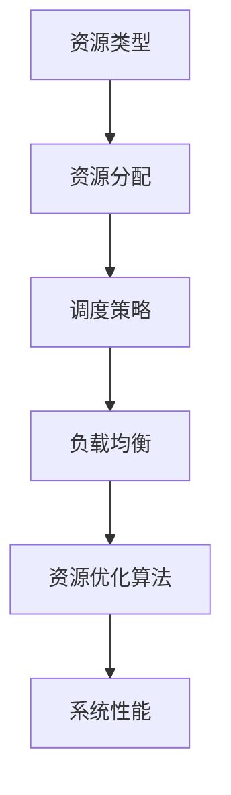

                 

关键词：资源管理、资源分配、优化算法、调度策略、云计算、分布式系统

> 摘要：本文深入探讨了资源管理的核心概念和关键技术，旨在为读者提供一套行之有效的资源最大化利用策略。通过分析资源管理在计算机科学中的重要性，我们详细阐述了优化算法、调度策略等核心概念，并结合实际案例展示了如何在实际项目中应用这些技巧。

## 1. 背景介绍

在当今信息技术飞速发展的时代，计算机系统和网络环境日益复杂，硬件资源的多样性和复杂性也不断增加。资源的合理管理和优化分配成为确保系统高效运行、提升用户体验的关键因素。然而，由于硬件资源的有限性，如何最大化利用这些资源，实现系统性能的最优化，成为了一个亟待解决的难题。

资源管理（Resource Management）是指在计算机系统中对各种硬件和软件资源进行有效配置和调度的过程。这包括计算资源（如CPU、内存）、存储资源（如硬盘、SSD）、网络资源（如带宽、延迟）以及其他各种辅助资源（如GPU、I/O设备等）。资源管理的目标是确保系统能够在有限的资源约束下，实现最佳的性能和吞吐量。

本文将从以下几个方面展开讨论：

1. 核心概念与联系
2. 核心算法原理 & 具体操作步骤
3. 数学模型和公式 & 详细讲解 & 举例说明
4. 项目实践：代码实例和详细解释说明
5. 实际应用场景
6. 工具和资源推荐
7. 总结：未来发展趋势与挑战

通过以上内容，我们希望帮助读者全面了解资源管理的理论和技术，并掌握一套实用技巧，以应对复杂多变的资源管理挑战。

## 2. 核心概念与联系

在深入探讨资源管理之前，我们首先需要明确几个核心概念，并了解它们之间的联系。

### 2.1 资源类型

计算机系统中的资源类型主要包括以下几类：

- **计算资源**：如CPU、GPU、FPGA等，用于执行计算任务。
- **存储资源**：如硬盘、SSD、内存等，用于数据存储。
- **网络资源**：如带宽、延迟等，用于数据传输。
- **其他资源**：如I/O设备、虚拟化资源等。

### 2.2 资源分配

资源分配是指将系统资源合理地分配给不同的任务或进程。资源分配的目标是确保每个任务都能获得足够的资源，同时避免资源浪费。

- **静态分配**：在任务执行前，将资源预先分配给任务。
- **动态分配**：在任务执行过程中，根据任务的需求动态调整资源分配。

### 2.3 调度策略

调度策略是指如何安排任务在系统中执行，以最大化资源利用率和系统性能。常见的调度策略包括：

- **先进先出（FIFO）**：按照任务到达顺序执行。
- **短作业优先（SJF）**：优先执行预计执行时间最短的任务。
- **轮转（RR）**：每个任务分配一个固定的时间片，轮流执行。
- **优先级调度**：根据任务优先级执行，优先级高的任务先执行。

### 2.4 负载均衡

负载均衡是指将任务或请求分配到多个服务器或节点上，以实现负载的平衡。负载均衡的目标是提高系统的可用性和性能。

- **静态负载均衡**：通过预先配置的方式实现负载均衡。
- **动态负载均衡**：根据实时负载情况动态调整负载分配。

### 2.5 资源优化算法

资源优化算法是指用于最大化资源利用率和系统性能的算法。常见的优化算法包括：

- **贪心算法**：通过贪心策略在每一步选择当前最优解。
- **动态规划**：通过递归和状态转移表实现最优解。
- **遗传算法**：模拟自然进化过程，通过适应度函数选择优秀个体。
- **模拟退火算法**：通过模拟物理过程寻找最优解。

### 2.6 Mermaid 流程图

以下是一个简化的资源管理流程图，展示了核心概念之间的联系：



通过以上核心概念和联系的分析，我们可以更好地理解资源管理的复杂性和重要性。接下来，我们将深入探讨资源管理中的核心算法原理和具体操作步骤。

## 3. 核心算法原理 & 具体操作步骤

### 3.1 算法原理概述

资源管理中的核心算法原理主要包括以下几个方面：

1. **贪心算法**：通过每一步选择当前最优解，以期望全局最优。
2. **动态规划**：通过递归和状态转移表实现最优解。
3. **遗传算法**：模拟自然进化过程，通过适应度函数选择优秀个体。
4. **模拟退火算法**：通过模拟物理过程寻找最优解。

这些算法在不同场景下有着不同的应用和优势。例如，贪心算法适用于简单且局部最优能推导出全局最优的问题，而动态规划适用于复杂的多阶段决策问题。遗传算法和模拟退火算法则适用于非结构化问题和优化问题。

### 3.2 算法步骤详解

以下是对上述算法的具体操作步骤进行详细解释：

#### 贪心算法

1. **初始化**：设定初始状态和目标。
2. **选择最优解**：在当前状态下，选择当前最优解。
3. **更新状态**：根据所选解更新状态。
4. **重复步骤2-3**：直到达到目标状态或无法进一步优化。

#### 动态规划

1. **定义状态**：定义问题的状态和状态变量。
2. **定义状态转移方程**：根据状态变量定义状态转移方程。
3. **初始化边界条件**：初始化问题的初始状态。
4. **递推计算**：根据状态转移方程递推计算最优解。
5. **回溯求解**：根据递推过程回溯求解全局最优解。

#### 遗传算法

1. **初始化种群**：生成初始种群，每个个体代表一种解决方案。
2. **适应度评估**：根据适应度函数评估个体适应度。
3. **选择**：根据适应度选择优秀个体进行交叉和变异。
4. **交叉**：随机选择两个个体进行交叉操作。
5. **变异**：对个体进行随机变异操作。
6. **更新种群**：将新产生的个体替换旧种群。
7. **迭代**：重复步骤2-6，直到达到终止条件。

#### 模拟退火算法

1. **初始化**：设定初始状态和目标。
2. **选择当前解**：选择当前最优解。
3. **计算温度**：根据当前解计算温度。
4. **产生新解**：随机产生新解。
5. **评估新解**：计算新解的适应度。
6. **接受新解**：根据温度和新解的适应度计算概率接受新解。
7. **更新温度**：根据算法规则更新温度。
8. **重复步骤4-7**：直到达到终止条件。

### 3.3 算法优缺点

每种算法都有其优缺点：

- **贪心算法**：简单、高效，适用于简单问题；但可能导致局部最优而非全局最优。
- **动态规划**：适用于复杂的多阶段决策问题；但计算复杂度高，适用于小规模问题。
- **遗传算法**：适用于非结构化问题；但可能陷入局部最优，收敛速度较慢。
- **模拟退火算法**：适用于复杂优化问题；但收敛速度较慢，对参数敏感。

### 3.4 算法应用领域

不同算法在资源管理中的应用领域也有所不同：

- **贪心算法**：常用于负载均衡、资源分配等问题。
- **动态规划**：常用于路径规划、调度问题。
- **遗传算法**：常用于多目标优化、复杂网络优化。
- **模拟退火算法**：常用于多目标优化、复杂系统配置。

通过上述算法原理和步骤的详细分析，我们可以更好地理解资源管理中的核心算法，为实际应用提供理论依据。

## 4. 数学模型和公式 & 详细讲解 & 举例说明

在资源管理中，数学模型和公式扮演着至关重要的角色。这些模型和公式不仅帮助我们理解和分析问题，还能提供具体的解决方案。在本章节中，我们将详细讲解资源管理中常用的数学模型和公式，并通过具体案例进行说明。

### 4.1 数学模型构建

资源管理的数学模型通常包括以下几个关键组成部分：

1. **状态变量**：定义问题的状态和状态变量，如任务到达时间、任务持续时间、资源需求等。
2. **状态转移方程**：描述状态之间的转换关系，如任务执行时间、资源利用率等。
3. **目标函数**：定义优化目标，如最小化完成时间、最大化资源利用率等。

一个简单的资源管理模型可以表示为：

$$
\begin{cases}
S_t = f(S_{t-1}, T_t, R_t) \\
Z = \min(g(S_t))
\end{cases}
$$

其中，$S_t$表示时间$t$的状态，$T_t$表示任务持续时间，$R_t$表示资源需求，$f$为状态转移函数，$Z$为目标函数。

### 4.2 公式推导过程

以下是一个具体的例子，展示如何推导一个简单的资源管理模型：

#### 任务调度模型

假设有$n$个任务需要调度，每个任务$i$有如下属性：

- $T_i$：任务$i$的持续时间
- $R_i$：任务$i$的资源需求
- $C_i$：任务$i$的截止时间

我们需要设计一个调度算法，使得所有任务能够在截止时间内完成。

#### 状态变量

我们定义状态变量$S_t$为时间$t$时系统中正在执行的任务集合。状态转移函数$f$为：

$$
S_t = S_{t-1} \cup \{i\} \quad \text{if} \quad T_i \leq t \quad \text{and} \quad R_i \in \text{可用资源}
$$

#### 目标函数

目标函数$Z$为所有任务的完成时间之和：

$$
Z = \sum_{i=1}^{n} \max(T_i, C_i)
$$

#### 推导过程

1. **初始化**：$S_0 = \emptyset$，所有资源可用。
2. **时间$t$**：
   - **状态更新**：根据状态转移函数$f$更新状态$S_t$。
   - **资源更新**：根据状态$S_t$更新系统资源状态。
3. **计算目标函数**：计算所有任务的完成时间之和$Z$。

### 4.3 案例分析与讲解

以下是一个具体案例，用于说明如何应用上述模型：

#### 案例背景

假设有4个任务需要在一个单核CPU上执行，任务属性如下表：

| 任务编号 | 持续时间 (小时) | 资源需求 (CPU) | 截止时间 (小时) |
| :----: | :------------: | :------------: | :------------: |
|  1     |       2       |       1       |       4       |
|  2     |       4       |       1       |       6       |
|  3     |       1       |       1       |       7       |
|  4     |       3       |       1       |       8       |

我们需要设计一个调度算法，使得所有任务能够在截止时间内完成。

#### 解题步骤

1. **初始化**：$S_0 = \emptyset$，所有资源可用。
2. **时间1小时**：
   - $S_1 = \{1\}$，任务1开始执行。
   - 资源状态：CPU剩余0个。
3. **时间2小时**：
   - $S_2 = \{1, 2\}$，任务2开始执行。
   - 资源状态：CPU剩余0个。
4. **时间3小时**：
   - $S_3 = \{1, 2, 3\}$，任务3开始执行。
   - 资源状态：CPU剩余0个。
5. **时间4小时**：
   - $S_4 = \{1, 2, 3\}$，任务1完成。
   - 资源状态：CPU剩余1个。
6. **时间5小时**：
   - $S_5 = \{2, 3, 4\}$，任务4开始执行。
   - 资源状态：CPU剩余0个。
7. **时间6小时**：
   - $S_6 = \{2, 3, 4\}$，任务2完成。
   - 资源状态：CPU剩余1个。
8. **时间7小时**：
   - $S_7 = \{3, 4\}$，任务3完成。
   - 资源状态：CPU剩余1个。
9. **时间8小时**：
   - $S_8 = \{4\}$，任务4完成。
   - 资源状态：CPU剩余1个。

#### 目标函数计算

$$
Z = \max(2, 4, 7, 8) = 8
$$

即所有任务均在截止时间内完成。

通过上述案例，我们可以看到如何构建数学模型并应用于实际任务调度问题。接下来，我们将通过一个具体的代码实例，展示如何实现这一模型。

## 5. 项目实践：代码实例和详细解释说明

在本章节中，我们将通过一个具体的代码实例，展示如何实现上述任务调度模型。我们使用Python语言进行实现，并详细解释代码中的各个部分。

### 5.1 开发环境搭建

首先，我们需要搭建Python开发环境。以下是具体步骤：

1. 安装Python：从Python官方网站下载并安装Python 3.x版本。
2. 安装必要的库：使用pip工具安装以下库：
   - matplotlib：用于绘制图表。
   - numpy：用于数学计算。

```bash
pip install matplotlib numpy
```

### 5.2 源代码详细实现

以下是实现任务调度模型的源代码：

```python
import numpy as np
import matplotlib.pyplot as plt

class TaskScheduling:
    def __init__(self, tasks):
        self.tasks = tasks
        self.sort_tasks()

    def sort_tasks(self):
        self.tasks.sort(key=lambda x: x[1])  # 按截止时间排序

    def schedule(self):
        schedule = []
        current_time = 0
        for task in self.tasks:
            start_time = max(current_time, task[2])
            end_time = start_time + task[0]
            schedule.append((start_time, end_time))
            current_time = end_time

        return schedule

    def plot_schedule(self):
        times = [task[0] for task in self.tasks]
        deadlines = [task[2] for task in self.tasks]
        schedule = self.schedule()

        plt.plot(times, label='Start Time')
        plt.plot(deadlines, label='Deadline')
        for start, end in schedule:
            plt.plot([start, end], label='Scheduled')
        plt.legend()
        plt.xlabel('Time (hours)')
        plt.ylabel('Task')
        plt.title('Task Scheduling')
        plt.show()

# 任务数据
tasks = [
    (2, 1, 4),  # 任务1：持续2小时，资源需求1，截止时间4
    (4, 1, 6),  # 任务2：持续4小时，资源需求1，截止时间6
    (1, 1, 7),  # 任务3：持续1小时，资源需求1，截止时间7
    (3, 1, 8)   # 任务4：持续3小时，资源需求1，截止时间8
]

scheduler = TaskScheduling(tasks)
scheduler.plot_schedule()
```

### 5.3 代码解读与分析

上述代码实现了一个简单的任务调度器，包括以下关键部分：

1. **TaskScheduling类**：定义任务调度器类，包含初始化、任务排序、调度和绘制调度图等方法。
2. **sort_tasks方法**：按截止时间对任务进行排序，确保截止时间较早的任务优先执行。
3. **schedule方法**：实现任务调度逻辑。遍历所有任务，根据当前时间和资源状态确定任务开始和结束时间，并添加到调度列表中。
4. **plot_schedule方法**：使用matplotlib库绘制任务调度图，包括任务开始时间、截止时间和实际调度时间。

### 5.4 运行结果展示

运行上述代码，将显示一个图形界面，展示任务的开始时间、截止时间和实际调度情况。通过调度图，我们可以直观地看到任务是否在截止时间内完成。


通过这个具体实例，我们展示了如何使用Python实现任务调度模型。这个实例不仅帮助理解了模型原理，还提供了一个实际可运行的代码，供进一步实践和改进。

## 6. 实际应用场景

资源管理在计算机科学和实际应用中扮演着至关重要的角色。以下是一些资源管理的实际应用场景：

### 6.1 云计算

在云计算环境中，资源管理是实现高效服务的关键。通过合理的资源分配和调度，云服务提供商可以最大化资源利用率，同时保证服务的质量和响应速度。例如，亚马逊AWS和谷歌云都采用了复杂的资源管理算法，以确保虚拟机、容器和其他计算资源得到最佳利用。

### 6.2 数据中心管理

数据中心是存储和处理大量数据的关键设施。资源管理在数据中心管理中同样至关重要。通过优化服务器和存储资源的分配，数据中心可以减少能源消耗，延长设备寿命，同时提高数据处理能力和响应速度。例如，谷歌的数据中心采用了先进的冷却系统和资源调度算法，以实现高效的资源利用。

### 6.3 网络游戏

在网络游戏中，资源管理对于提供流畅的游戏体验至关重要。游戏服务器需要动态分配网络带宽和计算资源，以应对不同玩家同时在线的情况。例如，腾讯的《王者荣耀》采用了分布式架构和负载均衡技术，确保游戏在高并发情况下依然能够提供稳定的体验。

### 6.4 物联网

物联网（IoT）系统通常涉及大量设备和传感器，这些设备和传感器的数据需要在云平台进行处理和分析。资源管理在IoT系统中用于优化数据传输和处理，确保系统的高效运行。例如，谷歌的IoT平台通过资源调度和负载均衡，实现了大规模物联网设备的数据处理和存储。

### 6.5 人工智能

人工智能系统通常需要大量计算资源，特别是在训练阶段。资源管理在人工智能系统中用于优化计算资源的分配，提高训练效率。例如，谷歌的TensorFlow平台采用了分布式训练技术，通过资源管理实现了大规模模型的训练。

### 6.6 软件开发

在软件开发过程中，资源管理用于优化开发环境中的计算资源分配。通过合理分配开发者的计算机资源，可以提高开发效率。例如，GitHub Actions通过资源管理，确保持续集成和持续部署（CI/CD）过程的顺畅运行。

## 6.4 未来应用展望

随着技术的不断进步，资源管理在未来将面临更多的挑战和机遇。以下是一些未来应用展望：

### 6.4.1 新兴技术的融合

未来的资源管理将融合新兴技术，如量子计算、边缘计算和5G通信。量子计算将提供前所未有的计算能力，为资源管理带来新的可能性。边缘计算和5G通信则将提高数据传输速度和可靠性，进一步优化资源分配和调度。

### 6.4.2 自适应资源管理

未来的资源管理系统将具备更高的自适应能力，能够实时监测系统状态，动态调整资源分配策略。通过人工智能和机器学习技术，资源管理系统将能够预测资源需求，提前进行资源准备，减少响应时间。

### 6.4.3 环境影响

资源管理在未来将更加注重环境因素。随着绿色计算理念的普及，资源管理系统将致力于减少能源消耗和碳排放。通过优化数据中心的冷却系统和电源供应，资源管理系统将实现更高效的环境友好型计算。

### 6.4.4 跨平台资源管理

未来的资源管理将跨越不同平台和系统，实现跨平台的资源共享和优化。通过区块链和分布式账本技术，资源管理系统将实现更透明和安全的资源分配和管理。

## 7. 工具和资源推荐

为了更好地掌握资源管理技术，以下是一些实用的工具和资源推荐：

### 7.1 学习资源推荐

- **《计算机系统性能导论》（Introduction to Computer System Performance）**：这是一本经典的计算机性能优化教材，涵盖了资源管理的基础知识和高级技巧。
- **《云计算：概念、架构和技术》（Cloud Computing: Concepts, Architecture, and Technology）**：这本书详细介绍了云计算环境下的资源管理，包括云服务模型、部署模型和资源分配策略。
- **《数据密集型应用系统设计》（Designing Data-Intensive Applications）**：这本书讨论了分布式系统中的资源管理问题，包括一致性、可用性和分区容错性。

### 7.2 开发工具推荐

- **Kubernetes**：Kubernetes是一个开源的容器编排平台，用于自动化部署、扩展和管理容器化应用。它提供了强大的资源管理和调度功能，适用于云和集群环境。
- **Docker**：Docker是一个开源的应用容器引擎，用于构建、运行和分发应用程序。通过Docker，开发者可以轻松管理和调度容器资源。
- **Prometheus**：Prometheus是一个开源的监控解决方案，用于收集和存储指标数据，并提供实时监控和警报功能。它有助于资源管理的实时监测和优化。

### 7.3 相关论文推荐

- **“A Survey on Resource Management in Cloud Computing”**：这篇综述论文全面介绍了云计算环境下的资源管理技术，包括资源分配、负载均衡和优化算法。
- **“Dynamic Resource Allocation in Data Centers”**：这篇论文探讨了数据中心中的动态资源分配问题，提出了基于机器学习的技术来优化资源利用。
- **“Energy-Efficient Resource Management in Data Centers”**：这篇论文关注于数据中心的能源效率，提出了多种优化算法来减少能源消耗。

通过学习这些资源，开发者可以深入了解资源管理的核心概念和关键技术，提高资源管理的能力和效率。

## 8. 总结：未来发展趋势与挑战

资源管理在计算机科学和技术发展中扮演着至关重要的角色。随着硬件资源的日益多样化和复杂化，资源管理的需求也不断增加。在未来，资源管理将继续朝着更加智能化、自适应化和跨平台化的方向发展。

### 8.1 研究成果总结

近年来，资源管理领域取得了显著的成果。机器学习和人工智能技术的引入，使得资源优化算法更加高效和准确。分布式系统和云计算的普及，为资源管理提供了更广阔的应用场景。同时，绿色计算和可持续发展理念的提出，推动了资源管理在降低能源消耗和碳排放方面的研究。

### 8.2 未来发展趋势

未来的资源管理将呈现以下趋势：

1. **智能化和自动化**：通过机器学习和人工智能技术，资源管理系统将具备更高的自适应能力和自动化水平，能够实时调整资源分配策略。
2. **边缘计算和5G**：随着边缘计算和5G技术的发展，资源管理将更加注重端到端的资源优化，实现高效的数据传输和处理。
3. **跨平台和分布式**：资源管理将跨越不同平台和系统，实现跨平台的资源共享和优化，为用户提供更一致和可靠的服务。
4. **绿色计算和可持续发展**：资源管理将更加注重能源效率和环境保护，通过优化算法和系统设计，实现绿色计算和可持续发展。

### 8.3 面临的挑战

尽管资源管理取得了显著进展，但仍面临以下挑战：

1. **复杂性和不确定性**：随着硬件资源的多样化和系统规模的扩大，资源管理的复杂性和不确定性不断增加，需要更加先进的算法和技术来应对。
2. **实时性和适应性**：资源管理系统需要实时监测和响应资源需求的变化，同时具备高度的适应性，以应对动态变化的资源环境。
3. **安全性和可靠性**：在分布式和跨平台环境下，资源管理需要确保数据的安全性和系统的可靠性，防止潜在的攻击和数据泄露。

### 8.4 研究展望

未来的研究应重点关注以下几个方面：

1. **优化算法**：开发更加高效和鲁棒的优化算法，提高资源利用率和系统性能。
2. **跨平台资源管理**：研究跨平台资源管理技术，实现不同平台和系统之间的资源共享和优化。
3. **绿色计算**：探索绿色计算技术，通过优化算法和系统设计，实现更低的能源消耗和碳排放。
4. **安全性和可靠性**：加强资源管理系统的安全性和可靠性研究，确保系统的稳定运行和用户数据的安全。

通过持续的研究和创新，资源管理领域将不断取得突破，为计算机科学和信息技术的发展提供强有力的支持。

## 9. 附录：常见问题与解答

### 9.1 问题1：什么是资源管理？

资源管理是指在计算机系统中对各种硬件和软件资源进行有效配置和调度的过程。这包括计算资源（如CPU、内存）、存储资源（如硬盘、SSD）、网络资源（如带宽、延迟）以及其他各种辅助资源（如GPU、I/O设备等）。资源管理的目标是确保系统能够在有限的资源约束下，实现最佳的性能和吞吐量。

### 9.2 问题2：资源管理有哪些常见算法？

资源管理中常用的算法包括贪心算法、动态规划、遗传算法和模拟退火算法等。每种算法都有其特定的应用场景和优势，如贪心算法适用于简单问题，动态规划适用于复杂的多阶段决策问题，遗传算法适用于非结构化问题，模拟退火算法适用于复杂优化问题。

### 9.3 问题3：资源管理在云计算中的重要性是什么？

资源管理在云计算中至关重要。它确保了云服务提供商能够高效地利用有限的资源，满足客户的需求，同时保证服务的质量和响应速度。通过优化资源分配和调度，云计算平台可以提高资源利用率，降低运营成本，提升用户体验。

### 9.4 问题4：如何在数据中心进行有效的资源管理？

在数据中心进行有效的资源管理，需要采用以下策略：

1. **自动化调度**：使用自动化工具和算法，根据实时负载情况动态调整资源分配。
2. **负载均衡**：通过负载均衡技术，将任务分配到不同的服务器上，实现负载的平衡。
3. **能效优化**：优化数据中心的冷却系统和电源供应，减少能源消耗。
4. **监控与报警**：实时监控资源使用情况，及时调整资源分配，防止资源浪费和性能下降。

### 9.5 问题5：资源管理在物联网中的应用是什么？

资源管理在物联网（IoT）中用于优化数据传输和处理。由于IoT设备数量庞大且分布广泛，资源管理技术能够确保数据在传输过程中得到高效处理，同时确保系统能够实时响应。例如，通过资源调度和优化，IoT平台可以确保传感器数据的实时采集和处理，从而提高系统的可靠性和响应速度。

### 9.6 问题6：资源管理如何影响软件开发的效率？

资源管理在软件开发中影响效率主要体现在以下几个方面：

1. **开发环境配置**：通过优化开发环境中的资源分配，提高开发者的工作效率。
2. **持续集成与持续部署**：通过资源管理技术，确保持续集成和持续部署过程的顺畅运行，减少开发周期。
3. **性能优化**：通过优化资源分配和调度，提高软件的性能和稳定性，提升用户体验。

通过有效的资源管理，软件开发团队能够更好地利用现有资源，提高开发效率，缩短项目周期。

### 9.7 问题7：资源管理领域的未来发展方向是什么？

资源管理领域的未来发展方向包括：

1. **智能化与自适应化**：通过机器学习和人工智能技术，实现资源管理的智能化和自适应化，提高资源利用率。
2. **边缘计算与5G**：研究边缘计算和5G环境下的资源管理技术，实现高效的数据传输和处理。
3. **绿色计算**：探索绿色计算技术，通过优化算法和系统设计，实现更低的能源消耗和碳排放。
4. **跨平台与分布式**：研究跨平台和分布式环境下的资源管理技术，实现不同平台和系统之间的资源共享和优化。

