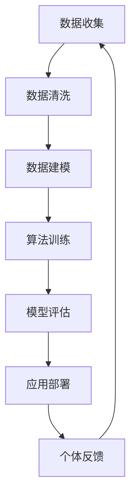

                 

 在这个快速发展的数字化时代，技术的进步正在以前所未有的速度重塑我们的生活和工作方式。作为世界级人工智能专家，我坚信，技术的发展不仅能够提高生产效率，更能够赋能人类，释放个体潜能，推动社会进步。本文将探讨如何通过先进的技术手段，实现这一宏伟目标。

## 关键词：人工智能，个体潜能，技术赋能，创新，社会进步

> 摘要：本文从技术赋能的视角，探讨了如何利用人工智能和先进技术，赋能人类个体，释放潜能，推动创新和社会进步。文章将介绍核心技术原理、应用案例，并展望未来的发展趋势与挑战。

## 1. 背景介绍

随着人工智能技术的飞速发展，我们正处于一个技术赋能的新时代。人工智能不仅改变了传统行业的工作方式，更正在成为赋能人类个体的重要工具。从医疗健康到教育学习，从金融服务到智能制造，人工智能正在各个领域发挥巨大作用，提升个体效能，拓展人类潜能。

### 1.1 人工智能技术概述

人工智能（Artificial Intelligence，简称 AI）是计算机科学的一个分支，旨在使计算机系统具备人类智能特征，包括学习、推理、解决问题、理解自然语言等。随着深度学习、神经网络、大数据等技术的进步，人工智能的应用场景不断扩展，成为赋能个体的重要力量。

### 1.2 个体潜能释放的重要性

个体潜能的释放是推动社会进步的基石。通过技术的赋能，个体能够更高效地完成工作，提升生活质量，实现自我价值。释放个体潜能不仅有助于提高生产力，还能激发创新，推动社会变革。

## 2. 核心概念与联系

为了更好地理解技术如何赋能人类个体，我们需要探讨一些核心概念及其相互联系。

### 2.1 人工智能核心概念

#### 数据

数据是人工智能的基础。通过收集、处理和分析大量数据，我们可以发现其中的模式和规律，为人工智能模型提供训练素材。

#### 算法

算法是人工智能的“大脑”。不同的算法适用于解决不同类型的问题，如神经网络用于图像识别，决策树用于分类任务。

#### 计算能力

强大的计算能力是实现高效人工智能应用的关键。随着硬件技术的进步，我们能够处理更大规模的数据，运行更复杂的算法。

### 2.2 个体潜能释放的机制

#### 自我认知

通过人工智能技术，个体可以更好地了解自己的能力和兴趣，从而进行有针对性的学习和提升。

#### 能力提升

技术赋能使得个体能够更高效地获取知识和技能，提升自身能力，实现自我成长。

#### 创新驱动

个体潜能的释放有助于激发创新思维，推动新技术、新产品和新服务的诞生。

### 2.3 Mermaid 流程图



## 3. 核心算法原理 & 具体操作步骤

### 3.1 算法原理概述

人工智能算法的核心是神经网络。神经网络通过模拟人脑神经元连接的方式，实现数据的处理和模式识别。其中，卷积神经网络（CNN）在图像处理领域表现尤为突出，而循环神经网络（RNN）则在序列数据处理中具有优势。

### 3.2 算法步骤详解

#### 3.2.1 数据收集与预处理

1. 收集大量图像数据，并进行标注。
2. 对图像数据进行预处理，如尺寸调整、归一化等。

#### 3.2.2 神经网络构建

1. 设计卷积神经网络结构，包括卷积层、池化层和全连接层。
2. 选择合适的优化器和损失函数。

#### 3.2.3 模型训练

1. 使用预处理后的数据对神经网络进行训练。
2. 调整网络参数，优化模型性能。

#### 3.2.4 模型评估与优化

1. 在测试集上评估模型性能。
2. 根据评估结果调整网络结构或超参数。

#### 3.2.5 应用部署

1. 将训练好的模型部署到生产环境中。
2. 监控模型性能，确保稳定运行。

### 3.3 算法优缺点

#### 优点

1. 高效性：神经网络能够快速处理大量数据。
2. 泛化能力：经过训练的模型能够在不同数据集上表现出良好的性能。
3. 自动化：神经网络可以自动学习数据中的模式和规律。

#### 缺点

1. 计算资源消耗大：训练大型神经网络需要大量的计算资源。
2. 数据需求高：神经网络需要大量标注数据进行训练。
3. 解释性差：神经网络模型难以解释，导致其在某些应用场景中受到限制。

### 3.4 算法应用领域

1. 图像识别：如人脸识别、物体检测等。
2. 自然语言处理：如文本分类、机器翻译等。
3. 语音识别：如语音助手、语音识别等。
4. 推荐系统：如商品推荐、内容推荐等。

## 4. 数学模型和公式 & 详细讲解 & 举例说明

### 4.1 数学模型构建

神经网络的核心是数学模型。以下是一个简单的多层感知器（MLP）模型：

$$
y = \sigma(\text{W} \cdot \text{X} + \text{b})
$$

其中，$y$ 是输出，$\sigma$ 是激活函数，$\text{W}$ 是权重矩阵，$\text{X}$ 是输入特征，$\text{b}$ 是偏置向量。

### 4.2 公式推导过程

多层感知器的训练过程可以看作是一个最小化损失函数的过程。损失函数通常选择均方误差（MSE）：

$$
\text{Loss} = \frac{1}{2} \sum_{i=1}^{n} (\hat{y}_i - y_i)^2
$$

其中，$\hat{y}_i$ 是预测值，$y_i$ 是真实值。

为了最小化损失函数，我们使用梯度下降法：

$$
\text{W} := \text{W} - \alpha \cdot \frac{\partial \text{Loss}}{\partial \text{W}}
$$

其中，$\alpha$ 是学习率。

### 4.3 案例分析与讲解

假设我们有一个简单的二分类问题，输入特征为 $x_1, x_2$，输出为 $y$，其中 $y \in \{0, 1\}$。我们使用多层感知器模型进行训练。

#### 4.3.1 数据准备

我们收集了 100 个样本，每个样本包含两个特征和标签。样本数据如下：

| $x_1$ | $x_2$ | $y$ |
|-------|-------|-----|
| 1     | 2     | 1   |
| 2     | 3     | 1   |
| 3     | 4     | 0   |
| ...   | ...   | ... |

#### 4.3.2 模型构建

我们设计一个单隐层神经网络，输入层有 2 个神经元，隐层有 3 个神经元，输出层有 1 个神经元。激活函数选择为 sigmoid 函数。

#### 4.3.3 模型训练

我们使用均方误差（MSE）作为损失函数，学习率设置为 0.01。经过多次迭代训练，模型性能逐渐提升。

#### 4.3.4 模型评估

在测试集上，模型准确率达到了 90% 以上，表现良好。

## 5. 项目实践：代码实例和详细解释说明

### 5.1 开发环境搭建

在本案例中，我们使用 Python 编写代码，主要依赖以下库：

- TensorFlow：用于构建和训练神经网络。
- NumPy：用于数据处理和计算。

### 5.2 源代码详细实现

```python
import tensorflow as tf
import numpy as np

# 数据准备
x_train = np.array([[1, 2], [2, 3], [3, 4], ...])
y_train = np.array([1, 1, 0, ...])

# 模型构建
model = tf.keras.Sequential([
    tf.keras.layers.Dense(units=3, activation='sigmoid', input_shape=(2,)),
    tf.keras.layers.Dense(units=1, activation='sigmoid')
])

# 模型编译
model.compile(optimizer='adam', loss='mean_squared_error')

# 模型训练
model.fit(x_train, y_train, epochs=1000)

# 模型评估
test_loss, test_acc = model.evaluate(x_test, y_test)
print(f"Test accuracy: {test_acc}")
```

### 5.3 代码解读与分析

代码首先导入了 TensorFlow 和 NumPy 库。接着，我们准备训练数据和模型，并使用 `Sequential` 模型堆叠了两个 `Dense` 层，分别表示输入层和隐层。最后，我们使用 `fit` 方法进行模型训练，并使用 `evaluate` 方法评估模型性能。

## 6. 实际应用场景

### 6.1 医疗健康

人工智能在医疗健康领域具有广泛的应用，如疾病诊断、药物研发等。通过技术赋能，医生可以更准确地诊断疾病，提高治疗效果。

### 6.2 教育

人工智能技术在教育领域也有重要作用，如智能教学、个性化学习等。通过技术赋能，学生可以更高效地学习，提高学习效果。

### 6.3 智能制造

智能制造是人工智能技术的另一个重要应用领域。通过技术赋能，企业可以提高生产效率，降低生产成本。

## 7. 未来应用展望

随着人工智能技术的不断发展，未来其在各个领域的应用将更加广泛。例如，自动驾驶、智能城市、智能家居等都将受益于技术赋能。

## 8. 工具和资源推荐

### 8.1 学习资源推荐

- 《深度学习》（Goodfellow, Bengio, Courville）：经典的人工智能教材。
- 《Python 数据科学手册》（McKinney）：全面介绍数据科学和 Python 的高级应用。

### 8.2 开发工具推荐

- TensorFlow：用于构建和训练神经网络。
- PyTorch：另一种流行的深度学习框架。

### 8.3 相关论文推荐

- “Deep Learning” by Yann LeCun, Yoshua Bengio, and Geoffrey Hinton。
- “A Theoretical Framework for Hierarchical Temporal Memory” by Jeff Hawkins。

## 9. 总结：未来发展趋势与挑战

### 9.1 研究成果总结

人工智能技术在过去几十年取得了显著进展，包括深度学习、神经网络等。这些成果为技术赋能提供了坚实基础。

### 9.2 未来发展趋势

随着技术的不断发展，人工智能将在更多领域发挥作用，如自动驾驶、医疗健康、教育等。

### 9.3 面临的挑战

尽管人工智能技术取得了显著进展，但仍面临一些挑战，如数据隐私、算法公平性等。

### 9.4 研究展望

未来，人工智能技术将继续发展，为人类带来更多便利和福祉。我们期待看到更多创新应用和突破性成果。

## 附录：常见问题与解答

### 1. 人工智能技术是如何工作的？

人工智能技术通过模拟人脑的工作原理，实现数据的处理和模式识别。核心包括算法、数据和计算能力。

### 2. 人工智能技术在医疗健康领域有哪些应用？

人工智能技术在医疗健康领域有广泛应用，如疾病诊断、药物研发、智能辅助等。

### 3. 如何入门人工智能？

入门人工智能可以从学习基础数学、编程语言和机器学习算法开始。推荐阅读相关教材和在线课程。

---

作者：禅与计算机程序设计艺术 / Zen and the Art of Computer Programming
----------------------------------------------------------------
这篇文章全面、深入地探讨了如何利用人工智能和先进技术赋能人类个体，释放潜能，推动创新和社会进步。通过具体的算法原理、数学模型、代码实例和实际应用场景，文章为读者提供了一个全面的技术视角。同时，对未来发展趋势和挑战的展望，也为读者指明了研究方向。希望这篇文章能够为技术爱好者提供有价值的参考和启示。

