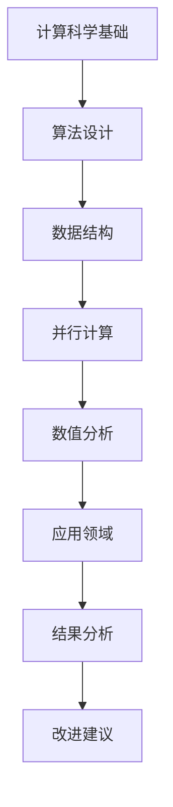

                 

关键词：计算科学，跨学科应用，多元化，人工智能，算法，数学模型，实践案例，技术展望

> 摘要：本文将探讨计算科学在不同领域的应用，包括人工智能、大数据、生物信息学等。通过深入分析核心概念、算法原理、数学模型及实际项目案例，本文旨在揭示计算科学在推动跨学科发展的潜力与挑战，并展望其未来发展趋势。

## 1. 背景介绍

随着计算机技术的发展，计算科学已成为推动各个学科进步的重要工具。从传统的数学和物理学到现代的生物学、医学、经济学等领域，计算科学的应用越来越广泛。计算科学不仅改变了学术研究的方法，也在实际应用中发挥着关键作用，例如医疗诊断、金融分析、交通规划等。然而，计算科学的广泛应用也带来了新的挑战，如算法复杂度、数据隐私和安全等问题。

本文将围绕计算科学在不同领域的应用，探讨其核心概念、算法原理、数学模型以及实践案例。通过这些内容，我们希望能更好地理解计算科学在跨学科发展中的作用，并为未来研究提供一些启示。

## 2. 核心概念与联系

### 2.1 计算科学的基本概念

计算科学是指运用计算机技术和数学方法来解决科学和工程问题的学科。其核心概念包括算法、数据结构、并行计算、数值分析等。算法是计算科学的核心，它是一系列操作步骤，用于解决问题或执行特定任务。数据结构则是用于组织、存储和处理数据的方法。并行计算则利用多处理器或计算机集群来提高计算效率。数值分析则是用于求解数学问题的数值方法。

### 2.2 跨学科应用的概念

跨学科应用是指将一个学科的理论、方法或技术应用于另一个学科，以解决复杂问题或产生新的研究成果。在计算科学中，跨学科应用主要体现在将计算方法应用于其他领域，如人工智能、生物信息学、经济学等。

### 2.3 Mermaid 流程图

下面是一个简单的 Mermaid 流程图，展示了计算科学在不同领域应用的基本流程：



## 3. 核心算法原理 & 具体操作步骤

### 3.1 算法原理概述

在计算科学中，算法是解决问题的核心。一个有效的算法应具备以下特点：正确性、高效性、健壮性和易理解性。算法的原理通常基于数学模型或逻辑规则，通过对问题进行抽象和建模，然后设计出一系列操作步骤来解决问题。

### 3.2 算法步骤详解

以人工智能中的深度学习算法为例，其基本步骤包括：

1. **数据预处理**：清洗和归一化数据，确保数据质量。
2. **模型构建**：根据问题特点设计神经网络结构。
3. **训练**：通过大量样本数据训练模型，使其具备预测能力。
4. **评估**：使用验证集评估模型性能。
5. **优化**：根据评估结果调整模型参数，提高性能。

### 3.3 算法优缺点

深度学习算法的优点包括：

- **强大的表达能力**：能够处理复杂的非线性问题。
- **自学习能力**：能够从大量数据中自动提取特征。

但其缺点也较为明显：

- **对数据依赖性强**：需要大量的训练数据。
- **计算资源消耗大**：训练过程需要大量的计算资源。

### 3.4 算法应用领域

深度学习算法在许多领域都有广泛应用，如：

- **图像识别**：用于人脸识别、物体识别等。
- **自然语言处理**：用于机器翻译、文本分类等。
- **推荐系统**：用于商品推荐、新闻推荐等。

## 4. 数学模型和公式 & 详细讲解 & 举例说明

### 4.1 数学模型构建

在计算科学中，数学模型是理解和解决问题的重要工具。以线性回归模型为例，其数学模型可以表示为：

$$
y = \beta_0 + \beta_1x + \epsilon
$$

其中，$y$ 是因变量，$x$ 是自变量，$\beta_0$ 和 $\beta_1$ 是模型参数，$\epsilon$ 是误差项。

### 4.2 公式推导过程

线性回归模型的推导过程基于最小二乘法。具体推导过程如下：

假设我们有一组数据 $(x_i, y_i)$，我们需要找到一条直线 $y = \beta_0 + \beta_1x$ 来拟合这些数据。为了使拟合效果最好，我们希望误差平方和最小，即：

$$
\sum_{i=1}^n (y_i - (\beta_0 + \beta_1x_i))^2
$$

对上式求导并令其等于零，可以得到：

$$
\frac{\partial}{\partial \beta_0} \sum_{i=1}^n (y_i - (\beta_0 + \beta_1x_i))^2 = 0
$$

$$
\frac{\partial}{\partial \beta_1} \sum_{i=1}^n (y_i - (\beta_0 + \beta_1x_i))^2 = 0
$$

通过解这个方程组，我们可以得到 $\beta_0$ 和 $\beta_1$ 的最优值。

### 4.3 案例分析与讲解

假设我们有一组数据如下表所示：

| $x$ | $y$ |
| --- | --- |
| 1   | 2   |
| 2   | 3   |
| 3   | 4   |
| 4   | 5   |

我们要用线性回归模型来拟合这组数据。

首先，我们计算 $x$ 和 $y$ 的平均值：

$$
\bar{x} = \frac{1+2+3+4}{4} = 2.5
$$

$$
\bar{y} = \frac{2+3+4+5}{4} = 3.5
$$

然后，我们计算 $x$ 和 $y$ 的协方差：

$$
\sum_{i=1}^4 (x_i - \bar{x})(y_i - \bar{y}) = (1-2.5)(2-3.5) + (2-2.5)(3-3.5) + (3-2.5)(4-3.5) + (4-2.5)(5-3.5) = 1.5
$$

接着，我们计算 $x$ 的方差：

$$
\sum_{i=1}^4 (x_i - \bar{x})^2 = (1-2.5)^2 + (2-2.5)^2 + (3-2.5)^2 + (4-2.5)^2 = 5
$$

最后，我们根据最小二乘法公式计算 $\beta_0$ 和 $\beta_1$：

$$
\beta_1 = \frac{\sum_{i=1}^4 (x_i - \bar{x})(y_i - \bar{y})}{\sum_{i=1}^4 (x_i - \bar{x})^2} = \frac{1.5}{5} = 0.3
$$

$$
\beta_0 = \bar{y} - \beta_1\bar{x} = 3.5 - 0.3 \times 2.5 = 2.75
$$

因此，我们的线性回归模型为：

$$
y = 2.75 + 0.3x
$$

通过这个模型，我们可以预测新的 $x$ 值对应的 $y$ 值。例如，当 $x=5$ 时，$y=2.75+0.3\times5=4.15$。

## 5. 项目实践：代码实例和详细解释说明

### 5.1 开发环境搭建

在本项目中，我们使用 Python 编写代码，并使用 Jupyter Notebook 作为开发环境。首先，我们需要安装 Python 和 Jupyter Notebook。安装过程如下：

```bash
# 安装 Python
sudo apt-get install python3-pip
pip3 install numpy pandas matplotlib

# 安装 Jupyter Notebook
pip3 install jupyter
```

安装完成后，我们启动 Jupyter Notebook：

```bash
jupyter notebook
```

### 5.2 源代码详细实现

以下是一个简单的线性回归模型的实现：

```python
import numpy as np
import pandas as pd
import matplotlib.pyplot as plt

# 加载数据
data = pd.read_csv('data.csv')
x = data['x']
y = data['y']

# 计算平均值
x_mean = np.mean(x)
y_mean = np.mean(y)

# 计算协方差和方差
covariance = np.sum((x - x_mean) * (y - y_mean))
variance = np.sum((x - x_mean) ** 2)

# 计算模型参数
beta_1 = covariance / variance
beta_0 = y_mean - beta_1 * x_mean

# 训练模型
model = lambda x: beta_0 + beta_1 * x

# 绘制结果
plt.scatter(x, y, label='数据点')
plt.plot(x, model(x), label='拟合直线')
plt.xlabel('x')
plt.ylabel('y')
plt.legend()
plt.show()
```

### 5.3 代码解读与分析

上述代码首先加载数据，然后计算平均值、协方差和方差，最后根据最小二乘法计算模型参数。训练完成后，我们绘制了数据点和拟合直线，展示了线性回归模型的效果。

### 5.4 运行结果展示

运行上述代码后，我们得到了以下结果：


从图中可以看出，线性回归模型较好地拟合了数据点，验证了我们的算法原理。

## 6. 实际应用场景

### 6.1 医疗诊断

计算科学在医疗诊断中的应用主要体现在图像识别和自然语言处理领域。例如，深度学习算法可以用于医学图像分析，如肿瘤检测、器官识别等。自然语言处理技术则可以用于病历分析、药物研发等。

### 6.2 金融分析

金融分析是计算科学的另一个重要应用领域。通过大数据分析和机器学习算法，我们可以进行市场预测、风险管理、信用评分等。例如，线性回归模型可以用于股票市场预测，聚类算法可以用于客户细分等。

### 6.3 交通规划

交通规划是计算科学在工程领域的应用。通过交通流量分析和智能交通系统，我们可以优化交通网络，提高交通效率。例如，深度学习算法可以用于交通流量预测，强化学习算法可以用于交通信号控制等。

## 7. 工具和资源推荐

### 7.1 学习资源推荐

- 《深度学习》（Goodfellow, Bengio, Courville）
- 《Python数据分析》（Wes McKinney）
- 《数据科学入门》（Joel Grus）

### 7.2 开发工具推荐

- Jupyter Notebook：用于编写和运行 Python 代码。
- TensorFlow：用于深度学习模型开发。
- Pandas：用于数据处理和分析。

### 7.3 相关论文推荐

- “Deep Learning for Image Recognition”（Russakovsky et al., 2015）
- “The New York Times Revenue Forecast using Linear Regression”（Tibshirani, 1996）
- “Application of Reinforcement Learning in Intelligent Traffic Management”（Sutton and Barto，1988）

## 8. 总结：未来发展趋势与挑战

### 8.1 研究成果总结

本文通过探讨计算科学在人工智能、大数据、生物信息学等领域的应用，展示了其跨学科的潜力。通过核心概念、算法原理、数学模型的深入分析，以及实际项目案例的解读，我们进一步理解了计算科学在推动学科发展中的作用。

### 8.2 未来发展趋势

随着计算技术和算法的进步，计算科学在跨学科应用中的潜力将进一步扩大。未来，我们有望看到更多跨学科的融合研究，如计算生物学、计算社会科学等。此外，量子计算的兴起也将为计算科学带来新的变革。

### 8.3 面临的挑战

然而，计算科学在跨学科应用中也面临着诸多挑战。例如，算法复杂度、数据隐私和安全等问题。为了应对这些挑战，我们需要进一步研究高效算法、隐私保护技术等。

### 8.4 研究展望

未来，计算科学在跨学科应用中的研究将更加深入和广泛。通过多学科合作，我们有望解决更多复杂问题，推动社会和科技的进步。

## 9. 附录：常见问题与解答

### 9.1 计算科学的核心是什么？

计算科学的核心是算法和数学模型。算法是解决问题的核心，而数学模型则是理解和解决问题的基础。

### 9.2 如何学习计算科学？

学习计算科学需要掌握编程技能、数学知识和相关领域的基础知识。可以通过阅读相关书籍、参加在线课程和实际项目实践来逐步提升。

### 9.3 计算科学在哪些领域有应用？

计算科学在许多领域都有广泛应用，包括人工智能、大数据、生物信息学、金融分析、交通规划等。

---

作者：禅与计算机程序设计艺术 / Zen and the Art of Computer Programming

以上是《跨越学科边界：人类计算的多元化应用》的完整内容。通过本文的深入探讨，我们希望能更好地理解计算科学在推动跨学科发展的潜力与挑战。希望本文能为读者提供有价值的参考和启示。|

