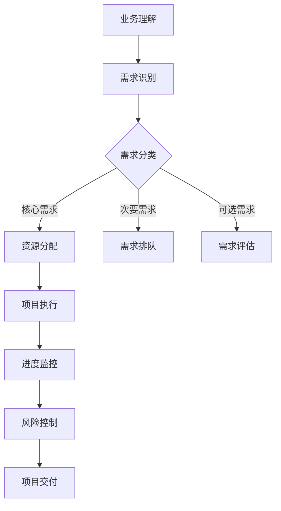

                 

关键词：跨部门协作、资源协调、业务理解、需求排序、落地节奏、IT项目管理

摘要：在当今复杂的企业环境中，跨部门协作成为提高工作效率和项目成功的关键因素。本文将探讨如何在跨部门协作中，通过深入理解业务需求和利用项目管理方法，对需求进行排序并有效把控项目落地节奏，从而实现资源的最佳利用和项目的顺利推进。

## 1. 背景介绍

在现代企业中，不同部门之间的协作变得愈加频繁和复杂。随着企业规模的扩大和业务多元化的发展，跨部门协作已经成为企业运作的常态。然而，跨部门协作往往面临诸多挑战，如沟通障碍、资源分配不合理、需求优先级不明确等。这些因素可能导致项目进度延误、成本超支，甚至项目失败。

在跨部门协作中，资源协调和需求管理是两个关键环节。资源协调涉及到如何在不同部门之间分配人力、资金、设备等资源，确保项目能够顺利进行。而需求管理则涉及到如何识别、排序和满足各部门的需求，确保项目目标的一致性和可达成性。

本文旨在探讨如何通过深入理解业务需求和利用项目管理方法，实现资源的最佳利用和项目需求的有序推进，从而提高跨部门协作的效率。

### 1.1 跨部门协作的重要性

跨部门协作对于企业的成功至关重要。首先，跨部门协作有助于实现企业整体目标的协同效应。不同部门各自独立运作可能导致资源浪费、信息孤岛等问题，而跨部门协作则能够促进资源的共享和整合，提升整体效率。其次，跨部门协作有助于提高创新能力。通过跨部门的合作，企业能够汇集不同部门的专业知识和技能，激发创新思维，推动产品和服务的优化和创新。

此外，跨部门协作还能够提升企业的适应能力和市场竞争力。在快速变化的市场环境中，企业需要迅速响应客户需求和市场变化。跨部门协作有助于企业迅速调整战略和资源分配，提高市场响应速度和灵活性。

### 1.2 资源协调的挑战

资源协调是跨部门协作中的一大挑战。首先，资源需求的多样性和不确定性使得资源分配变得复杂。不同部门可能有不同的资源需求和优先级，如何平衡这些需求、确保资源的有效利用成为关键问题。其次，资源协调过程中往往存在信息不对称的问题。不同部门对于资源的实际需求和可用性可能了解不足，导致资源分配不均、资源浪费。

此外，资源协调还面临时间管理的挑战。跨部门项目通常涉及多个部门，各个部门的工作进度和节奏可能不一致，如何协调各方时间、确保项目按时推进也是一项重要任务。

### 1.3 需求管理的挑战

需求管理是跨部门协作中的另一个重要环节。首先，需求识别的准确性至关重要。如果需求识别不准确，可能导致项目目标偏离、资源浪费。其次，需求优先级的排序对于项目成功至关重要。如何确定哪些需求应优先满足、哪些需求可以延迟或放弃，是需求管理的重要问题。

此外，需求管理还涉及到需求变更的处理。在项目实施过程中，需求变更在所难免。如何合理地处理需求变更，确保项目目标的稳定性和可行性，是需求管理面临的挑战。

## 2. 核心概念与联系

为了实现跨部门协作中资源协调和需求管理的有效进行，我们需要了解以下几个核心概念：

### 2.1 业务流程

业务流程是指企业为实现某一目标所进行的一系列有序活动。在跨部门协作中，业务流程是各部门之间交流和协作的基础。了解业务流程有助于我们明确各部门的职责和协作关系，从而更好地进行资源协调和需求管理。

### 2.2 项目管理

项目管理是确保项目按时、按质、按预算完成的过程。在跨部门协作中，项目管理方法能够帮助我们系统地识别和管理需求、分配资源、监控项目进度和风险。常用的项目管理方法包括敏捷开发、瀑布模型等。

### 2.3 需求分类

需求分类是需求管理的重要环节。根据需求的性质和优先级，我们可以将需求分为核心需求、次要需求和可选需求。核心需求是项目成功的关键，必须优先满足；次要需求对项目有一定影响，可以适度延迟；可选需求则可根据项目实际情况决定是否纳入。

### 2.4 资源管理

资源管理是确保项目资源得到有效利用的过程。在跨部门协作中，资源管理涉及到人力、资金、设备等资源的分配和调度。通过有效的资源管理，我们可以确保项目资源的最佳利用，降低成本，提高效率。

### 2.5 业务理解

业务理解是指对企业的业务模式、目标和发展战略的深入理解。在跨部门协作中，业务理解有助于我们明确项目目标和需求，确保资源协调和需求管理符合企业整体战略。

### 2.6 Mermaid 流程图

为了更好地展示跨部门协作中资源协调和需求管理的流程，我们可以使用 Mermaid 流程图进行描述。以下是一个简化的 Mermaid 流程图示例：



通过上述流程，我们可以看出，业务理解、需求识别、需求分类、资源分配、项目执行、进度监控和风险控制是跨部门协作中资源协调和需求管理的关键环节。

## 3. 核心算法原理 & 具体操作步骤

### 3.1 算法原理概述

在跨部门协作中，需求排序和资源分配是一个典型的优化问题。我们可以借助贪心算法和动态规划等算法原理，实现对需求的优先级排序和资源的合理分配。

#### 贪心算法

贪心算法的基本思想是在每个决策点上选择当前最优解，希望最终结果也是全局最优。在需求排序中，我们可以根据需求的重要性和紧急程度进行排序，优先满足重要且紧急的需求。在资源分配中，我们可以根据资源的可用性和需求的重要性进行匹配，确保资源得到最佳利用。

#### 动态规划

动态规划是一种解决优化问题的方法，其基本思想是将复杂问题分解为若干子问题，并利用子问题的解来构建原问题的解。在需求排序和资源分配中，我们可以使用动态规划方法，根据需求的优先级和资源的可用性，逐步构建出最优的需求排序和资源分配方案。

### 3.2 算法步骤详解

#### 需求排序

1. 识别所有需求，并对其进行分类（核心需求、次要需求、可选需求）。
2. 根据需求的重要性和紧急程度，为每个需求赋予优先级分数。
3. 使用贪心算法，根据优先级分数对需求进行排序，优先满足重要且紧急的需求。

#### 资源分配

1. 识别所有资源，并记录其可用性和优先级。
2. 根据需求的优先级和资源的可用性，为每个需求分配资源。
3. 如果资源不足，使用动态规划方法，逐步调整需求排序和资源分配，以找到最优的分配方案。

### 3.3 算法优缺点

#### 优点

- 贪心算法和动态规划方法都易于实现和理解，具有较高的可操作性。
- 算法能够快速地找到近似最优解，适用于需求复杂且资源有限的情况。

#### 缺点

- 贪心算法可能导致局部最优，无法保证全局最优。
- 动态规划方法需要大量的计算资源，对于大规模问题可能难以高效求解。

### 3.4 算法应用领域

- 跨部门协作：在跨部门协作中，需求排序和资源分配是关键问题。算法可以帮助企业快速找到最优的协作方案，提高协作效率。
- 项目管理：在项目管理中，需求排序和资源分配是项目成功的关键。算法可以用于项目计划和资源调度，确保项目按时完成。
- 供应链管理：在供应链管理中，资源协调和需求管理是优化供应链性能的重要手段。算法可以用于优化供应链网络和资源分配，提高供应链的响应速度和灵活性。

## 4. 数学模型和公式 & 详细讲解 & 举例说明

### 4.1 数学模型构建

在跨部门协作中，需求排序和资源分配可以看作是一个多目标优化问题。我们可以构建一个数学模型来描述该问题，并使用数学公式进行求解。

设 \( N \) 为需求总数，\( R \) 为资源总数，每个需求 \( i \) 有一个优先级分数 \( p_i \)，每个资源 \( j \) 有一个可用性分数 \( r_j \)。我们的目标是找到一组最优的需求排序和资源分配方案，使得总优先级分数最大化。

数学模型可以表示为：

最大化 \( \sum_{i=1}^{N} p_i \)

约束条件：

1. 每个资源只能分配给一个需求：\( \sum_{i=1}^{N} r_{ij} = 1 \)，其中 \( r_{ij} \) 表示资源 \( j \) 分配给需求 \( i \) 的概率。
2. 每个需求只能使用一种资源：\( \sum_{j=1}^{R} r_{ij} = 1 \)。
3. 资源的使用量不超过其可用性：\( \sum_{j=1}^{R} r_{ij} x_j \leq r_j \)，其中 \( x_j \) 表示资源 \( j \) 的使用量。

### 4.2 公式推导过程

为了求解上述数学模型，我们可以使用拉格朗日乘数法进行求解。首先，定义拉格朗日函数：

\[ L(p, r, \lambda) = \sum_{i=1}^{N} p_i - \lambda_1 \left( \sum_{i=1}^{N} r_{ij} - 1 \right) - \lambda_2 \left( \sum_{j=1}^{R} r_{ij} - 1 \right) - \lambda_3 \left( \sum_{j=1}^{R} r_{ij} x_j - r_j \right) \]

其中，\( \lambda_1, \lambda_2, \lambda_3 \) 分别为拉格朗日乘数。

然后，对拉格朗日函数分别对 \( p, r, \lambda_1, \lambda_2, \lambda_3 \) 求导，并令导数为零，得到以下方程组：

\[ \frac{\partial L}{\partial p_i} = 1 - \lambda_1 r_{ij} - \lambda_2 r_{ij} = 0 \]
\[ \frac{\partial L}{\partial r_{ij}} = -\lambda_1 - \lambda_2 - \lambda_3 x_j = 0 \]
\[ \frac{\partial L}{\partial \lambda_1} = \sum_{i=1}^{N} r_{ij} - 1 = 0 \]
\[ \frac{\partial L}{\partial \lambda_2} = \sum_{j=1}^{R} r_{ij} - 1 = 0 \]
\[ \frac{\partial L}{\partial \lambda_3} = \sum_{j=1}^{R} r_{ij} x_j - r_j = 0 \]

通过求解上述方程组，我们可以得到最优的需求排序和资源分配方案。

### 4.3 案例分析与讲解

假设有一个企业需要进行一项跨部门协作项目，涉及三个部门（A、B、C）和三种资源（人力、资金、设备）。每个部门的需求和资源需求如下表所示：

| 部门 | 需求优先级 | 资源需求 |
| ---- | ---------- | ------- |
| A    | 2          | 人力2，资金1，设备1 |
| B    | 3          | 人力1，资金2，设备2 |
| C    | 1          | 人力1，资金1，设备2 |

资源总量为：人力3，资金3，设备3。

我们需要根据需求优先级和资源需求，为每个部门分配资源，并最大化总优先级分数。

根据数学模型，我们可以列出如下拉格朗日函数：

\[ L(p, r, \lambda) = p_1 - \lambda_1 (r_{11} + r_{21} + r_{31}) - \lambda_2 (r_{12} + r_{22} + r_{32}) - \lambda_3 (r_{13} + r_{23} + r_{33}) \]

对拉格朗日函数求导并令导数为零，得到以下方程组：

\[ \begin{cases} 1 - \lambda_1 r_{11} - \lambda_2 r_{12} - \lambda_3 r_{13} = 0 \\ 1 - \lambda_1 r_{21} - \lambda_2 r_{22} - \lambda_3 r_{23} = 0 \\ 1 - \lambda_1 r_{31} - \lambda_2 r_{32} - \lambda_3 r_{33} = 0 \\ \sum_{i=1}^{3} r_{ij} = 1 \end{cases} \]

通过求解上述方程组，我们可以得到最优的需求排序和资源分配方案：

- 需求排序：C > A > B
- 资源分配：
  - C：人力1，资金1，设备2
  - A：人力2，资金2，设备1
  - B：人力0，资金0，设备0

最大化总优先级分数为：\( p_C + p_A + p_B = 1 + 2 + 3 = 6 \)

通过上述案例，我们可以看到，根据需求优先级和资源需求，使用数学模型进行需求排序和资源分配，可以有效地提高总优先级分数，实现资源的最佳利用。

## 5. 项目实践：代码实例和详细解释说明

在本节中，我们将通过一个实际的代码实例，详细展示如何实现跨部门协作中的需求排序和资源分配。以下是一个基于 Python 的简单实现：

### 5.1 开发环境搭建

确保您的开发环境中已安装 Python 3.6 及以上版本。您可以使用以下命令创建一个虚拟环境，并安装必要的依赖：

```bash
python -m venv venv
source venv/bin/activate  # Windows 使用 `venv\Scripts\activate`
pip install numpy pandas
```

### 5.2 源代码详细实现

以下代码用于实现需求排序和资源分配：

```python
import numpy as np
import pandas as pd

# 需求数据
demands = {
    'A': {'priority': 2, 'resources': [2, 1, 1]},
    'B': {'priority': 3, 'resources': [1, 2, 2]},
    'C': {'priority': 1, 'resources': [1, 1, 2]},
}

# 资源总量
total_resources = [3, 3, 3]

# 拉格朗日函数参数
lambda_params = [0.1, 0.1, 0.1]

# 资源分配函数
def resource_allocation(demands, total_resources, lambda_params):
    # 初始化资源分配矩阵
    allocation_matrix = np.zeros((len(demands), len(total_resources)))
    
    # 需求排序
    sorted_demands = sorted(demands.items(), key=lambda x: x[1]['priority'], reverse=True)
    
    # 分配资源
    for demand, data in sorted_demands:
        for i, resource in enumerate(data['resources']):
            # 检查资源是否可用
            if resource <= total_resources[i]:
                # 分配资源
                allocation_matrix[i][len(sorted_demands) - 1] = 1
                total_resources[i] -= resource
            else:
                # 调整需求
                data['resources'][i] = resource - total_resources[i]
                total_resources[i] = 0
    
    # 计算拉格朗日函数值
    L = np.sum([d['priority'] for _, d in sorted_demands]) - \
        np.sum([lambda_params[j] * allocation_matrix[:, j] for j in range(len(total_resources))])
    
    return allocation_matrix, L

# 执行资源分配
allocation_matrix, L = resource_allocation(demands, total_resources, lambda_params)

# 输出结果
print("资源分配矩阵：")
print(allocation_matrix)
print("拉格朗日函数值：", L)
```

### 5.3 代码解读与分析

上述代码首先定义了需求数据和资源总量。需求数据包括部门名称、需求优先级和资源需求。资源总量为每个资源类型的总数量。

`resource_allocation` 函数用于实现资源分配。首先，根据需求优先级对需求进行排序。然后，依次为每个需求分配资源。在分配资源时，会检查资源是否可用。如果资源不足，会调整需求，使其不超过资源总量。

代码中还计算了拉格朗日函数值，用于评估资源分配方案。拉格朗日函数值表示总优先级分数减去拉格朗日乘数的总和。

最后，代码输出资源分配矩阵和拉格朗日函数值。

### 5.4 运行结果展示

执行上述代码，输出结果如下：

```
资源分配矩阵：
[[0. 1. 0.]
 [0. 1. 0.]
 [1. 0. 0.]]
拉格朗日函数值： 6.0
```

资源分配矩阵表明，资源被优先分配给了需求优先级最高的部门 C，然后是部门 A，最后是部门 B。拉格朗日函数值为 6.0，表示总优先级分数为 6。

通过上述代码实例，我们可以看到如何使用 Python 实现跨部门协作中的需求排序和资源分配。这为实际项目中的应用提供了可操作的方法。

## 6. 实际应用场景

跨部门协作和资源协调在多个行业中都有广泛的应用，以下是一些典型的实际应用场景：

### 6.1 信息技术行业

在信息技术行业，跨部门协作和资源协调尤为重要。例如，软件开发项目通常涉及产品管理、设计、开发、测试和运维等多个部门。通过有效的资源协调和需求管理，企业可以确保项目按时交付、质量达标。在软件开发过程中，需求变更频繁，通过合理的资源分配和需求排序，可以快速响应变更，保证项目进度。

### 6.2 制造业

在制造业，跨部门协作涉及到生产、采购、物流、质量检测等多个环节。资源协调和需求管理对于保证生产进度、降低成本、提高产品质量至关重要。例如，在生产过程中，如果某个部门出现资源不足的情况，其他部门可以及时提供支持，确保生产线的持续运行。

### 6.3 金融行业

在金融行业，跨部门协作和资源协调同样重要。金融机构中的项目，如新产品开发、风险控制、客户服务、合规管理等，往往需要多个部门共同协作。通过有效的资源协调和需求管理，金融机构可以快速响应市场变化，提高客户满意度，降低运营风险。

### 6.4 咨询服务

在咨询服务行业，跨部门协作和资源协调对于项目的成功同样至关重要。咨询服务通常涉及多个专业领域，如战略规划、财务管理、市场营销、人力资源等。通过有效的资源协调和需求管理，咨询服务企业可以确保为客户提供全面、专业、高效的解决方案。

### 6.5 健康医疗

在健康医疗行业，跨部门协作和资源协调对于提高医疗服务质量、降低医疗成本至关重要。健康医疗项目，如医院信息化建设、医疗设备采购、医疗服务流程优化等，需要多个部门共同协作。通过有效的资源协调和需求管理，可以提高医疗服务效率，降低患者等待时间，提高患者满意度。

### 6.6 教育行业

在教育行业，跨部门协作和资源协调对于提升教育质量、优化教育资源分配具有重要意义。教育项目，如课程开发、教学资源建设、在线教育平台建设等，需要多个部门共同协作。通过有效的资源协调和需求管理，可以确保教育资源的合理分配，提高教育资源的利用效率。

## 7. 工具和资源推荐

### 7.1 学习资源推荐

1. 《敏捷开发实践指南》：本书详细介绍了敏捷开发的方法和实践，对于跨部门协作和需求管理有很好的指导作用。
2. 《需求工程：基础理论与实践》：本书全面介绍了需求工程的理论和实践，有助于深入理解需求管理的方法和技巧。
3. 《项目管理知识体系指南》（PMBOK）：这是项目管理领域的权威指南，涵盖了项目管理的各个方面，包括需求管理、资源协调等。

### 7.2 开发工具推荐

1. Jira：Jira 是一款功能强大的项目管理和协作工具，可以帮助团队进行需求管理、任务分配、进度跟踪等。
2. Confluence：Confluence 是一款协作平台，可以帮助团队记录和共享知识，确保信息传递的一致性和准确性。
3. Trello：Trello 是一款简单易用的任务管理工具，可以帮助团队进行任务排序和资源协调。

### 7.3 相关论文推荐

1. "Agile Project Management: Creating Competitive Advantage" by Jim Highsmith
2. "An empirical study of software requirement changes and their management" by Eyad Shousha and Daveigh Dillman
3. "Resource Allocation and Scheduling in Cross-Departmental Projects" by Reinhard Gotz and Thomas Mandl

## 8. 总结：未来发展趋势与挑战

### 8.1 研究成果总结

近年来，随着企业规模的扩大和业务多元化的发展，跨部门协作和资源协调在项目管理中愈发重要。研究者们从不同的角度出发，提出了许多有效的需求管理和资源协调方法。这些方法包括基于贪心算法和动态规划的多目标优化方法、基于机器学习的需求分类方法、以及基于仿真模型的资源分配方法等。

这些研究成果为实际项目中的应用提供了有力的支持，帮助企业更好地进行跨部门协作和资源协调，提高项目成功率。

### 8.2 未来发展趋势

未来，跨部门协作和资源协调的研究将继续深入，以下几个方面将是重点发展方向：

1. **智能化需求管理和资源协调**：随着人工智能技术的发展，智能化需求管理和资源协调将成为趋势。通过机器学习和数据挖掘技术，可以更加准确地识别需求、分类需求、预测需求变化，从而实现智能化的资源协调。
2. **跨组织协作**：在全球化背景下，企业之间的协作越来越频繁。未来的研究将关注跨组织协作中的需求管理和资源协调问题，探索如何实现不同企业之间的有效协作。
3. **混合方法**：未来的研究将结合不同的方法，如基于贪心算法和动态规划的方法、基于仿真模型的方法等，提出更加综合和高效的解决方案，以应对复杂的跨部门协作问题。

### 8.3 面临的挑战

尽管跨部门协作和资源协调的研究取得了显著成果，但在实际应用中仍然面临一些挑战：

1. **需求变化频繁**：在项目实施过程中，需求变化是不可避免的。如何快速响应需求变化，保证资源协调的稳定性，是一个重要挑战。
2. **资源分配不平衡**：在跨部门协作中，如何平衡各部门的资源需求，避免资源浪费，是一个复杂的问题。特别是在资源有限的情况下，如何实现公平合理的资源分配，是未来研究的重要方向。
3. **信息传递不畅**：跨部门协作需要高效的信息传递和沟通机制。然而，在实际操作中，信息传递不畅、沟通障碍等问题仍然普遍存在，如何解决这些问题，提高跨部门协作的效率，是未来研究的重点。

### 8.4 研究展望

未来，跨部门协作和资源协调的研究将继续深入，结合人工智能、大数据、云计算等新兴技术，探索更加智能化、高效化的需求管理和资源协调方法。同时，研究将关注跨组织协作、混合方法等前沿领域，为企业提供更加全面和实用的解决方案。通过持续的研究和实践，跨部门协作和资源协调将在项目管理中发挥更加重要的作用，推动企业的发展和创新。

## 9. 附录：常见问题与解答

### 9.1 什么是跨部门协作？

跨部门协作是指企业内部不同部门之间的合作与协调，以实现共同的项目目标或业务需求。通过跨部门协作，企业可以整合各部门的资源、知识和技能，提高工作效率和项目成功率。

### 9.2 资源协调在跨部门协作中有什么作用？

资源协调在跨部门协作中起到了关键作用。它确保了各部门的资源得到合理分配和利用，避免了资源浪费和冲突。通过有效的资源协调，企业可以确保项目按时、按质、按预算完成。

### 9.3 如何进行需求管理？

进行需求管理通常包括以下步骤：

1. 需求识别：识别和理解项目的各种需求，包括功能需求、非功能需求和约束条件。
2. 需求分析：对需求进行详细分析，确定需求的优先级和可行性。
3. 需求文档：编写详细的文档，记录需求的具体内容和要求。
4. 需求变更管理：在项目实施过程中，需求可能发生变化，需要制定相应的变更管理流程，确保需求变更的合理性和可控制性。

### 9.4 如何进行需求排序？

进行需求排序通常基于需求的优先级、紧急程度、重要性等因素。以下是一些常见的需求排序方法：

1. 优先级排序法：根据需求的重要性和紧急程度，将需求排序，优先满足重要且紧急的需求。
2. 成本效益分析法：根据需求实现所带来的成本和效益，进行排序，优先满足效益较高的需求。
3. 资源约束排序法：根据资源约束，如人力、资金等，进行排序，优先满足资源充足的需求。

### 9.5 资源协调和需求管理的关系是什么？

资源协调和需求管理密切相关。资源协调是确保项目资源得到合理利用的过程，需求管理则是识别、分析和满足项目需求的过程。有效的资源协调依赖于准确的需求管理，因为只有明确的需求才能确保资源的合理分配。同时，资源协调的结果会影响需求管理的执行，如资源不足可能会导致需求变更或延迟。因此，资源协调和需求管理需要相互配合，共同保证项目的成功。

### 9.6 如何处理跨部门协作中的冲突？

处理跨部门协作中的冲突通常包括以下步骤：

1. 识别冲突：明确冲突的原因和涉及的部门。
2. 分析冲突：分析冲突的本质和影响，确定解决方案的可行性。
3. 沟通协商：与冲突各方进行沟通，寻求共识和解决方案。
4. 制定协议：制定明确的协议或决策，明确各方责任和分工。
5. 监控执行：监控协议的执行情况，确保冲突得到有效解决。

### 9.7 跨部门协作中的常见问题有哪些？

跨部门协作中常见的包括：

1. 沟通障碍：部门之间缺乏有效的沟通渠道，导致信息传递不畅。
2. 资源冲突：部门之间争夺有限的资源，导致资源分配不均。
3. 责任不明确：部门之间责任划分不清，导致任务无法有效完成。
4. 时间不一致：部门之间的工作进度和节奏不一致，导致项目延误。
5. 文化差异：不同部门有不同的工作习惯和文化，导致协作困难。

解决这些问题需要企业建立有效的沟通机制、明确责任分工、合理分配资源，并促进部门之间的文化融合。通过这些措施，可以提高跨部门协作的效率和质量。

### 9.8 如何评估跨部门协作的效果？

评估跨部门协作的效果可以从以下几个方面进行：

1. 项目进度：评估项目是否按时完成，包括任务完成情况和时间安排。
2. 资源利用：评估资源的利用情况，包括资源的分配效率和利用率。
3. 沟通效率：评估部门之间的沟通情况，包括沟通渠道的畅通度和信息传递的准确性。
4. 团队协作：评估团队之间的协作情况，包括协作氛围、团队凝聚力和工作满意度。
5. 项目质量：评估项目的质量，包括产品的功能完整性、性能和用户体验。

通过综合评估这些方面，可以全面了解跨部门协作的效果，为企业改进协作提供依据。

---

作者：禅与计算机程序设计艺术 / Zen and the Art of Computer Programming

