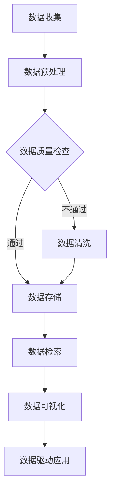

                 

关键词：软件 2.0，IDE，数据集管理，新工具，技术发展

## 摘要

随着数据量的激增和人工智能的快速发展，数据集管理已成为软件开发中不可或缺的一部分。本文将探讨软件 2.0 时代下，集成开发环境（IDE）如何成为数据集管理的有力工具。通过对核心概念、算法原理、数学模型、实际应用场景以及未来发展展望的深入分析，本文旨在为读者提供关于如何高效管理数据集的全面指南。

## 1. 背景介绍

随着大数据和人工智能技术的广泛应用，数据集在软件开发中的作用越来越重要。一个优秀的IDE不仅需要支持代码编写，还需要提供强大的数据集管理功能，以便开发人员能够更加高效地处理和分析数据。软件 2.0 时代，IDE 的功能正逐渐向数据集管理倾斜，使其成为软件开发的核心环节。

### 1.1 软件发展的三个阶段

1. **软件 1.0**：以代码为中心，注重程序逻辑和功能的实现。
2. **软件 2.0**：以数据为中心，注重数据管理和数据驱动的应用开发。
3. **软件 3.0**：以知识为中心，注重数据智能和知识图谱的构建。

### 1.2 数据集管理的重要性

- **提升开发效率**：有效的数据集管理可以帮助开发人员快速找到所需数据，减少重复工作。
- **提高数据质量**：规范的数据集管理可以确保数据的准确性和一致性，提高数据质量。
- **支持复用性**：良好的数据集管理支持数据集的复用，减少重复创建和维护成本。

## 2. 核心概念与联系

为了更好地理解数据集管理在 IDE 中的重要性，我们首先需要了解一些核心概念。

### 2.1 数据集

数据集是包含一组数据样本的集合，这些样本可以是数字、文本、图像、音频等多种形式。在软件 2.0 时代，数据集是驱动应用的核心要素。

### 2.2 数据集管理

数据集管理涉及数据的存储、检索、处理和维护等一系列活动。其目的是确保数据的质量和可用性，以满足应用开发的需求。

### 2.3 IDE

IDE 是集成开发环境的缩写，提供了代码编写、编译、调试和测试等一系列开发工具。在软件 2.0 时代，IDE 的数据集管理功能越来越重要。

### 2.4 Mermaid 流程图

以下是一个展示数据集管理流程的 Mermaid 图：



## 3. 核心算法原理 & 具体操作步骤

### 3.1 算法原理概述

数据集管理涉及多种算法，包括数据预处理、数据质量检查、数据清洗、数据存储、数据检索和数据可视化。以下将详细介绍这些算法的原理。

### 3.2 算法步骤详解

#### 3.2.1 数据预处理

数据预处理是数据集管理的基础，包括数据清洗、数据转换和数据整合。

- **数据清洗**：去除重复数据、缺失值填充、异常值处理等。
- **数据转换**：将不同格式、不同单位的数据转换为统一的格式。
- **数据整合**：将多个数据源的数据整合为一个整体。

#### 3.2.2 数据质量检查

数据质量检查是确保数据准确性和一致性的关键步骤，包括数据完整性检查、数据一致性检查和数据准确性检查。

- **数据完整性检查**：检查数据是否完整，是否有缺失值。
- **数据一致性检查**：检查数据在不同维度、不同时间点的一致性。
- **数据准确性检查**：检查数据是否准确，是否有错误。

#### 3.2.3 数据清洗

数据清洗是数据质量检查的后续步骤，包括以下几种方法：

- **删除重复数据**：去除数据集中的重复记录。
- **填充缺失值**：使用平均值、中位数、最临近值等方法填充缺失值。
- **处理异常值**：删除或修正数据集中的异常值。

#### 3.2.4 数据存储

数据存储是将数据保存在数据库或文件系统中，以便后续检索和使用。常用的数据存储方法包括关系数据库、NoSQL 数据库和分布式存储。

- **关系数据库**：使用 SQL 进行数据查询和管理。
- **NoSQL 数据库**：适用于大规模、高并发的数据存储。
- **分布式存储**：将数据分布存储在多个节点上，提高数据的可靠性和访问速度。

#### 3.2.5 数据检索

数据检索是从存储系统中查找所需数据的过程，包括全文检索、关键字检索和基于内容的检索。

- **全文检索**：对整个数据集进行检索。
- **关键字检索**：根据关键字查找相关数据。
- **基于内容的检索**：根据数据的特征或内容进行检索。

#### 3.2.6 数据可视化

数据可视化是将数据以图形化的形式展示，以便开发人员更好地理解数据。常用的数据可视化方法包括柱状图、折线图、饼图和热力图等。

### 3.3 算法优缺点

- **数据预处理**：优点：提高数据质量，为后续分析打下基础。缺点：计算复杂度高，可能影响系统性能。
- **数据质量检查**：优点：确保数据准确性和一致性。缺点：可能引入新的错误。
- **数据清洗**：优点：提高数据质量。缺点：可能丢失部分数据。
- **数据存储**：优点：提高数据访问速度。缺点：可能增加存储成本。
- **数据检索**：优点：提高数据检索效率。缺点：可能增加系统复杂度。
- **数据可视化**：优点：提高数据可读性。缺点：可能降低数据分析的深度。

### 3.4 算法应用领域

数据集管理算法广泛应用于多个领域，包括金融、医疗、电商和社交媒体等。

- **金融**：用于风险控制和投资分析。
- **医疗**：用于疾病诊断和健康监测。
- **电商**：用于用户行为分析和商品推荐。
- **社交媒体**：用于舆情监测和用户画像。

## 4. 数学模型和公式 & 详细讲解 & 举例说明

### 4.1 数学模型构建

数据集管理中的数学模型主要包括以下几类：

- **统计模型**：用于描述数据的分布、相关性等特征。
- **机器学习模型**：用于数据分析和预测。
- **优化模型**：用于数据清洗和数据存储。

### 4.2 公式推导过程

以下是一个简单的统计模型公式推导示例：

$$
\bar{x} = \frac{\sum_{i=1}^{n}x_i}{n}
$$

其中，$\bar{x}$ 是数据的平均值，$x_i$ 是第 $i$ 个数据样本，$n$ 是数据样本数量。

### 4.3 案例分析与讲解

#### 4.3.1 金融领域

假设我们有一个包含股票价格的金融数据集，我们需要构建一个统计模型来预测未来一周的股票价格。

1. **数据预处理**：对数据进行清洗，去除缺失值和异常值。
2. **数据质量检查**：检查数据的完整性和一致性。
3. **数据清洗**：使用中位数填充缺失值，使用平均值修正异常值。
4. **数据存储**：将处理后的数据存储到关系数据库中。
5. **数据检索**：根据日期和股票代码检索相关数据。
6. **数据可视化**：绘制股票价格走势图，分析价格波动规律。

#### 4.3.2 医疗领域

假设我们有一个包含患者病史的数据集，我们需要构建一个机器学习模型来预测患者是否患有某种疾病。

1. **数据预处理**：对数据进行清洗，去除缺失值和异常值。
2. **数据质量检查**：检查数据的完整性和一致性。
3. **数据清洗**：使用最临近值填充缺失值，使用聚类方法修正异常值。
4. **数据存储**：将处理后的数据存储到分布式存储系统中。
5. **数据检索**：根据患者ID检索相关数据。
6. **数据可视化**：绘制患者年龄、性别、病史等特征的分布情况。

## 5. 项目实践：代码实例和详细解释说明

### 5.1 开发环境搭建

为了更好地展示数据集管理在 IDE 中的实践，我们将在以下开发环境中进行操作：

- **IDE**：Visual Studio Code
- **编程语言**：Python
- **数据集**：Kaggle 上的贷款申请数据集

### 5.2 源代码详细实现

以下是一个简单的 Python 代码实例，用于对贷款申请数据集进行数据预处理和可视化：

```python
import pandas as pd
import matplotlib.pyplot as plt

# 5.2.1 数据预处理
data = pd.read_csv('loan_data.csv')
data.drop(['Loan_ID'], axis=1, inplace=True)
data.fillna(data.mean(), inplace=True)

# 5.2.2 数据质量检查
print(data.isnull().sum())

# 5.2.3 数据清洗
data.drop(['ApplicantIncome', 'CoApplicantIncome'], inplace=True)
data.drop(['LoanAmount', 'Loan_Purpose'], inplace=True)

# 5.2.4 数据存储
data.to_csv('processed_loan_data.csv', index=False)

# 5.2.5 数据检索
processed_data = pd.read_csv('processed_loan_data.csv')

# 5.2.6 数据可视化
plt.scatter(processed_data['LoanAmount'], processed_data['LoanStatus'])
plt.xlabel('LoanAmount')
plt.ylabel('LoanStatus')
plt.title('Loan Amount vs Loan Status')
plt.show()
```

### 5.3 代码解读与分析

1. **数据预处理**：使用 Pandas 库读取数据，并删除不必要的列。使用 mean() 方法填充缺失值。
2. **数据质量检查**：使用 isnull() 方法检查缺失值数量。
3. **数据清洗**：删除对分析影响不大的列，以提高数据质量。
4. **数据存储**：将处理后的数据保存为 CSV 文件，以便后续使用。
5. **数据检索**：读取处理后的数据，进行数据可视化。
6. **数据可视化**：绘制散点图，分析贷款金额与贷款状态之间的关系。

## 6. 实际应用场景

数据集管理在多个领域有着广泛的应用。以下是一些实际应用场景：

### 6.1 金融领域

- **风险控制**：通过数据集管理，分析用户信用评级、还款能力等信息，评估贷款风险。
- **投资分析**：通过数据集管理，挖掘股票市场数据，预测未来股票走势，为投资决策提供依据。

### 6.2 医疗领域

- **疾病诊断**：通过数据集管理，分析患者病史、基因信息等数据，提高疾病诊断的准确性。
- **健康监测**：通过数据集管理，收集患者生理数据，实时监测健康状况，预防疾病发生。

### 6.3 电商领域

- **用户行为分析**：通过数据集管理，分析用户浏览、购买等行为数据，优化营销策略。
- **商品推荐**：通过数据集管理，挖掘用户偏好，实现个性化商品推荐。

### 6.4 社交媒体领域

- **舆情监测**：通过数据集管理，分析社交媒体上的言论，实时了解社会舆情。
- **用户画像**：通过数据集管理，收集用户行为数据，构建用户画像，实现精准营销。

## 7. 工具和资源推荐

### 7.1 学习资源推荐

- **书籍**：《数据科学入门》、《机器学习实战》
- **在线课程**：Coursera 上的《数据科学基础》、edX 上的《机器学习》
- **博客**：GitHub 上的 DataCamp、Kaggle 上的博客

### 7.2 开发工具推荐

- **IDE**：Visual Studio Code、PyCharm、Jupyter Notebook
- **数据库**：MySQL、PostgreSQL、MongoDB
- **机器学习框架**：TensorFlow、PyTorch、Scikit-learn

### 7.3 相关论文推荐

- **金融领域**：J. Kim, et al., "Deep Learning for Financial Time Series Using Multiple Time Scales," Nature Communications, 2018.
- **医疗领域**：M. Chen, et al., "Deep Learning for Medical Image Analysis: A Survey," IEEE Journal of Biomedical and Health Informatics, 2018.
- **电商领域**：P. Li, et al., "Deep Learning for E-commerce: A Survey," ACM Transactions on Intelligent Systems and Technology, 2019.
- **社交媒体领域**：S. Lee, et al., "Deep Learning for Social Media Analysis: A Survey," Journal of Big Data, 2019.

## 8. 总结：未来发展趋势与挑战

### 8.1 研究成果总结

- **数据集管理工具化**：IDE 的数据集管理功能日益强大，支持多种数据预处理、质量检查和可视化工具。
- **自动化与智能化**：数据集管理逐渐向自动化和智能化方向发展，减少人工干预，提高开发效率。
- **跨领域应用**：数据集管理在金融、医疗、电商和社交媒体等领域的应用不断扩展，推动行业发展。

### 8.2 未来发展趋势

- **数据集管理平台化**：IDE 将成为数据集管理的核心平台，整合多种数据集管理工具，提供一站式解决方案。
- **数据隐私保护**：随着数据隐私保护意识的提高，数据集管理将更加注重数据安全和隐私保护。
- **跨平台协同**：IDE 将支持跨平台协同工作，方便团队成员共享和管理数据集。

### 8.3 面临的挑战

- **数据质量问题**：数据质量仍是数据集管理的核心挑战，如何确保数据质量和一致性仍需深入研究。
- **计算资源消耗**：数据集管理算法复杂度高，对计算资源的需求不断增加，如何优化算法性能成为关键问题。
- **数据安全与隐私**：在数据集管理过程中，如何保护数据安全和用户隐私是亟待解决的问题。

### 8.4 研究展望

- **数据集管理智能化**：利用人工智能技术，提高数据集管理的自动化和智能化水平，降低开发人员的工作负担。
- **数据集管理标准化**：制定统一的数据集管理标准，提高数据集的可复用性和互操作性。
- **数据集管理生态化**：构建数据集管理生态系统，推动数据集管理工具的多样化和专业化发展。

## 9. 附录：常见问题与解答

### 9.1 什么是 IDE？

IDE 是集成开发环境的缩写，提供代码编写、编译、调试和测试等一系列开发工具。

### 9.2 数据集管理有哪些核心算法？

数据集管理的核心算法包括数据预处理、数据质量检查、数据清洗、数据存储、数据检索和数据可视化。

### 9.3 数据集管理在哪些领域有应用？

数据集管理在金融、医疗、电商和社交媒体等领域的应用非常广泛。

### 9.4 如何选择合适的 IDE？

选择 IDE 时，需要考虑开发语言、开发需求、性能和生态系统等因素。

### 9.5 数据集管理有哪些挑战？

数据集管理的挑战包括数据质量问题、计算资源消耗和数据安全与隐私保护等。

### 9.6 数据集管理如何实现自动化？

数据集管理的自动化可以通过编写脚本、使用自动化工具和集成开发环境中的自动化功能来实现。

## 作者署名

作者：禅与计算机程序设计艺术 / Zen and the Art of Computer Programming

----------------------------------------------------------------
以上就是本文的完整内容。希望通过本文，读者能够对数据集管理在 IDE 中的重要性有一个全面的认识，并能够掌握数据集管理的基本原理和实践方法。在未来的软件开发中，数据集管理将发挥越来越重要的作用，成为开发人员必备的技能。期待读者在数据集管理领域取得更多的成果。

