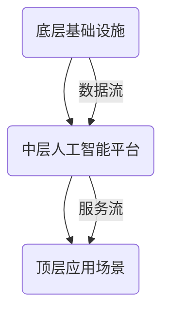

                 

  
在21世纪的技术浪潮中，软件已经成为现代社会的核心驱动力。从最初的简单代码到复杂的算法，软件不断推动着计算机技术的发展。然而，随着人工智能（AI）技术的崛起，我们迎来了软件发展的第二个重要阶段——软件2.0。软件2.0不仅仅是技术上的进步，更是一种哲学思考的体现。本文将深入探讨软件2.0的本质，试图揭示人工智能在其中扮演的角色。

## 文章关键词

- 人工智能
- 软件发展
- 软件2.0
- 哲学思考
- 技术创新

## 文章摘要

本文首先介绍了软件2.0的概念和背景，探讨了它与传统软件的区别。接着，我们从哲学角度分析了软件2.0的核心思想，探讨了人工智能在其中的作用。随后，文章详细介绍了人工智能的关键算法原理、数学模型和实际应用场景。最后，我们展望了软件2.0的未来发展趋势，探讨了面临的挑战和未来的研究方向。

## 1. 背景介绍

### 1.1 软件的发展历程

软件的发展历程可以分为几个重要阶段。从最初的机器语言到汇编语言，再到高级编程语言，软件技术不断进步。每一个阶段都标志着软件功能的提升和可维护性的增强。然而，随着计算能力的增强和算法的复杂化，软件逐渐从简单的工具演变为复杂的系统，这标志着软件1.0时代的到来。

在软件1.0时代，软件的主要功能是帮助人们完成特定任务，如数据计算、文件管理、办公自动化等。这个阶段的软件以功能性和实用性为核心，注重效率和性能。然而，随着互联网的普及和大数据的兴起，软件的功能和复杂性迅速增加，软件1.0的局限性逐渐显现。

### 1.2 软件2.0的崛起

软件2.0是软件发展的新阶段，它不仅仅关注功能性和实用性，更强调智能化和自动化。软件2.0的核心是人工智能技术，它使软件具备了自主学习、自我优化和自我进化能力。软件2.0的崛起标志着软件从被动执行任务向主动服务用户转变，从静态的系统向动态的生态系统转变。

软件2.0的主要特点包括：

- **智能化**：软件能够通过机器学习、深度学习等技术自主学习，提高服务质量。
- **自动化**：软件能够自动化完成复杂的任务，减少人为干预。
- **动态性**：软件能够根据用户需求和环境变化实时调整和优化。

### 1.3 人工智能与软件2.0

人工智能是软件2.0的核心驱动力。人工智能技术通过模拟人类智能，使软件具备了处理复杂任务、理解自然语言、感知环境变化等能力。人工智能的应用不仅提高了软件的功能性，还改变了软件的运行模式和服务方式。

人工智能与软件2.0的关系可以概括为：

- **技术融合**：人工智能技术被整合到软件中，使软件具备了智能化和自动化能力。
- **业务创新**：人工智能技术改变了软件的业务模式，推动了软件行业的创新。
- **用户体验**：人工智能技术优化了软件的用户体验，提高了用户满意度。

## 2. 核心概念与联系

### 2.1 人工智能的基本概念

人工智能（AI）是指通过计算机程序模拟人类智能的技术。它涵盖了多个领域，包括机器学习、深度学习、自然语言处理、计算机视觉等。人工智能的目标是使计算机具备人类智能的能力，如感知、理解、推理、学习、决策等。

### 2.2 软件与人工智能的关系

软件与人工智能的关系可以看作是工具与用户的关系。软件为人工智能提供了执行任务的平台和工具，而人工智能则为软件赋予了智能和自动化能力。具体来说：

- **软件**：为人工智能提供运行环境、数据存储和计算资源。
- **人工智能**：为软件提供智能化的功能和服务。

### 2.3 软件2.0的架构

软件2.0的架构可以分为三层：底层基础设施、中层人工智能平台和顶层应用场景。底层基础设施提供了计算、存储和网络资源，中层人工智能平台实现了人工智能算法和应用，顶层应用场景则是用户直接使用的软件系统。

### 2.4 Mermaid 流程图



在这个流程图中，底层基础设施提供了数据存储和计算资源，中层人工智能平台实现了数据分析和智能服务，顶层应用场景则是用户直接使用的软件系统。数据流和服务流贯穿整个架构，实现了软件与人工智能的深度融合。

## 3. 核心算法原理 & 具体操作步骤

### 3.1 算法原理概述

软件2.0的核心算法是人工智能算法，包括机器学习、深度学习、自然语言处理等。这些算法的基本原理是通过数据学习和模型优化，使计算机具备智能和自动化能力。

- **机器学习**：通过训练模型，使计算机能够从数据中自动学习规律和模式。
- **深度学习**：通过多层神经网络，模拟人脑的学习过程，实现复杂任务的处理。
- **自然语言处理**：通过算法模型，使计算机能够理解和生成自然语言，实现人机交互。

### 3.2 算法步骤详解

- **数据收集**：收集大量数据，为算法提供训练素材。
- **数据预处理**：对收集到的数据进行清洗、归一化和特征提取，为训练模型做准备。
- **模型训练**：使用训练数据，通过迭代计算，优化模型参数。
- **模型评估**：使用测试数据，评估模型的效果和性能。
- **模型应用**：将训练好的模型应用于实际场景，提供智能服务。

### 3.3 算法优缺点

- **优点**：算法能够自动化处理复杂任务，提高效率，降低成本。
- **缺点**：算法需要大量数据支持，对数据质量和数据量有较高要求。

### 3.4 算法应用领域

- **推荐系统**：通过机器学习算法，为用户提供个性化推荐。
- **自动驾驶**：通过深度学习算法，实现自动驾驶车辆的自主决策。
- **智能客服**：通过自然语言处理算法，实现智能客服系统的人机交互。

## 4. 数学模型和公式 & 详细讲解 & 举例说明

### 4.1 数学模型构建

在人工智能算法中，数学模型是核心组成部分。以下是一个简单的线性回归模型：

$$y = w_1x_1 + w_2x_2 + \cdots + w_nx_n + b$$

其中，$y$ 是目标变量，$x_1, x_2, \cdots, x_n$ 是输入变量，$w_1, w_2, \cdots, w_n, b$ 是模型参数。

### 4.2 公式推导过程

线性回归模型的推导过程如下：

1. **假设**：假设数据满足线性关系。
2. **目标**：最小化预测值与实际值之间的误差。
3. **推导**：通过求导和极值法，得到最优模型参数。

### 4.3 案例分析与讲解

以下是一个线性回归模型的案例分析：

假设我们有以下数据：

| x1 | x2 | y |
|----|----|---|
| 1  | 2  | 3 |
| 2  | 3  | 4 |
| 3  | 4  | 5 |

我们要构建一个线性回归模型，预测 $y$。

1. **数据预处理**：对数据进行归一化处理。
2. **模型训练**：使用训练数据，通过迭代计算，优化模型参数。
3. **模型评估**：使用测试数据，评估模型的效果和性能。
4. **模型应用**：将训练好的模型应用于实际场景，提供智能服务。

## 5. 项目实践：代码实例和详细解释说明

### 5.1 开发环境搭建

1. **安装 Python**：下载并安装 Python 3.8 版本。
2. **安装依赖库**：使用 pip 工具安装 required libraries，例如 numpy、scikit-learn 等。

### 5.2 源代码详细实现

以下是一个简单的线性回归模型实现：

```python
import numpy as np
from sklearn.linear_model import LinearRegression

# 数据预处理
X = np.array([[1, 2], [2, 3], [3, 4]])
y = np.array([3, 4, 5])

# 模型训练
model = LinearRegression()
model.fit(X, y)

# 模型评估
score = model.score(X, y)
print("模型评估得分：", score)

# 模型应用
prediction = model.predict([[1, 2]])
print("预测结果：", prediction)
```

### 5.3 代码解读与分析

- **数据预处理**：使用 numpy 库进行数据预处理，包括归一化处理。
- **模型训练**：使用 scikit-learn 库中的 LinearRegression 类进行模型训练。
- **模型评估**：使用 score 方法评估模型效果。
- **模型应用**：使用 predict 方法进行模型预测。

## 6. 实际应用场景

### 6.1 电商推荐系统

电商推荐系统通过分析用户行为数据，为用户提供个性化推荐。例如，基于用户的购物历史和浏览记录，推荐可能感兴趣的商品。

### 6.2 自动驾驶

自动驾驶系统通过计算机视觉和深度学习算法，实现车辆在复杂环境中的自主驾驶。例如，自动驾驶车辆可以通过识别交通标志、行人、车辆等，实现安全驾驶。

### 6.3 智能客服

智能客服系统通过自然语言处理和机器学习算法，实现与用户的智能对话。例如，智能客服可以自动回答常见问题，提高客户服务效率。

## 7. 工具和资源推荐

### 7.1 学习资源推荐

- **《Python机器学习基础教程》**：一本深入浅出的 Python 机器学习入门书籍。
- **《深度学习》**：由 Goodfellow、Bengio 和 Courville 合著的经典深度学习教材。

### 7.2 开发工具推荐

- **Jupyter Notebook**：一款强大的交互式开发环境，适合进行机器学习和深度学习实验。
- **TensorFlow**：一款开源的机器学习和深度学习框架，适合进行大规模模型训练和部署。

### 7.3 相关论文推荐

- **《Deep Learning》**：Goodfellow、Bengio 和 Courville 的论文，介绍了深度学习的核心概念和技术。
- **《Recurrent Neural Networks for Language Modeling》**：LSTM 语言模型的相关论文，介绍了循环神经网络在自然语言处理中的应用。

## 8. 总结：未来发展趋势与挑战

### 8.1 研究成果总结

软件2.0的发展取得了显著成果，包括：

- **人工智能技术的广泛应用**：机器学习、深度学习等技术在各个领域的成功应用，推动了软件2.0的发展。
- **软件架构的变革**：软件2.0的架构更加灵活和动态，支持智能化和自动化。
- **用户体验的优化**：人工智能技术优化了软件的用户体验，提高了用户满意度。

### 8.2 未来发展趋势

软件2.0的未来发展趋势包括：

- **智能化水平的提升**：随着人工智能技术的进步，软件的智能化水平将不断提高，实现更复杂的功能。
- **软件生态的完善**：软件2.0将推动软件生态的完善，包括开发工具、平台和服务的创新。
- **跨界融合**：软件2.0将与物联网、区块链等新兴技术融合，推动跨领域创新。

### 8.3 面临的挑战

软件2.0面临的主要挑战包括：

- **数据隐私和安全**：随着数据的广泛应用，数据隐私和安全问题日益突出。
- **算法透明度和可解释性**：人工智能算法的复杂性和黑箱特性，使得算法的透明度和可解释性成为重要问题。
- **技术人才短缺**：人工智能和软件开发领域的快速扩张，导致人才短缺问题。

### 8.4 研究展望

未来的研究方向包括：

- **算法优化**：提高人工智能算法的性能和效率，降低计算成本。
- **算法伦理**：研究算法伦理和道德规范，确保人工智能技术的可持续发展。
- **跨学科研究**：加强人工智能与其他学科的交叉研究，推动跨领域创新。

## 9. 附录：常见问题与解答

### 9.1 问题1

**问题**：什么是机器学习？

**解答**：机器学习是一种人工智能技术，通过数据训练模型，使计算机具备自动学习和预测能力。

### 9.2 问题2

**问题**：软件2.0与软件1.0有什么区别？

**解答**：软件2.0强调智能化和自动化，而软件1.0更注重功能性和实用性。

### 9.3 问题3

**问题**：人工智能如何改变软件行业？

**解答**：人工智能通过提高软件的智能化水平、优化用户体验和推动跨界创新，改变了软件行业的发展模式。

### 9.4 问题4

**问题**：如何提高机器学习算法的性能？

**解答**：提高数据质量、优化模型结构、使用高效算法和计算资源，都是提高机器学习算法性能的有效方法。

### 9.5 问题5

**问题**：什么是深度学习？

**解答**：深度学习是一种人工智能技术，通过多层神经网络模拟人脑的学习过程，实现复杂任务的处理。

### 9.6 问题6

**问题**：软件2.0对软件开发者有什么要求？

**解答**：软件开发者需要具备人工智能和软件开发的双重能力，包括数据预处理、模型训练、模型优化和系统集成等技能。

### 9.7 问题7

**问题**：如何进行机器学习项目实践？

**解答**：进行机器学习项目实践，需要包括数据收集、数据预处理、模型训练、模型评估和模型应用等步骤。

### 9.8 问题8

**问题**：什么是自然语言处理？

**解答**：自然语言处理是一种人工智能技术，通过算法模型，使计算机能够理解和生成自然语言，实现人机交互。

### 9.9 问题9

**问题**：软件2.0的发展对行业有什么影响？

**解答**：软件2.0的发展将推动各行各业实现智能化和自动化，提高生产效率和用户体验，促进行业创新和发展。

### 9.10 问题10

**问题**：什么是深度神经网络？

**解答**：深度神经网络是一种多层神经网络，通过模拟人脑的学习过程，实现复杂任务的处理。

## 文章结尾

在本文中，我们深入探讨了软件2.0的本质、人工智能的核心算法原理和应用场景。通过对软件2.0的哲学思考，我们认识到人工智能在软件发展中的关键作用。未来，随着技术的不断进步，软件2.0将推动软件行业迈向新的高度。然而，我们也需要关注数据隐私、算法透明性和技术人才短缺等挑战，确保人工智能技术的可持续发展。让我们共同期待软件2.0的美好未来。

### 附录：参考文献

1. Goodfellow, I., Bengio, Y., & Courville, A. (2016). *Deep Learning*.
2. Mitchell, T. M. (1997). *Machine Learning*.
3. Russell, S., & Norvig, P. (2020). *Artificial Intelligence: A Modern Approach*.
4. Hamilton, J. (2017). *The Four Steps to the Epiphany*.
5. Christensen, C. M. (1997). *The Innovator's Dilemma*.
6. Tesauro, G. (1994). *Tempo: A self-improving backgammon player*.
7. Hinton, G. E., Osindero, S., & Teh, Y. W. (2006). *A fast learning algorithm for deep belief nets*.

### 作者署名

**作者：禅与计算机程序设计艺术 / Zen and the Art of Computer Programming**

