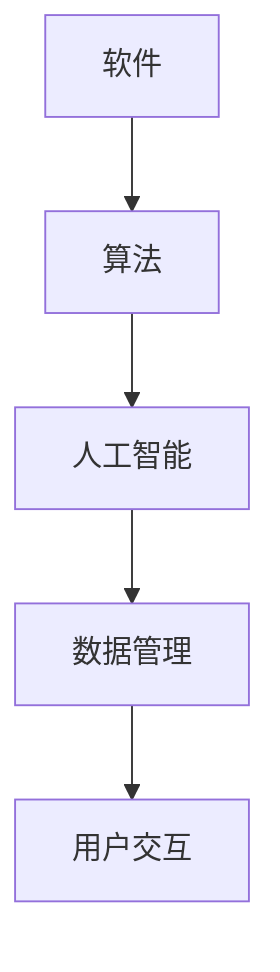

                 

在当今的技术发展中，软件 2.0 的概念逐渐引起了广泛的关注。这不仅是一种技术上的进步，更是一种哲学上的思考。本文将探讨人工智能的本质，以及它如何影响和定义了软件 2.0 的哲学思考。

> **关键词**：软件 2.0、人工智能、哲学思考、技术进步

> **摘要**：本文将从历史背景出发，探讨人工智能如何引领了软件 2.0 的诞生。接着，我们将深入分析人工智能的核心原理，以及它对软件开发的深远影响。随后，文章将讨论人工智能在不同领域中的应用，以及未来发展的潜在趋势。最后，我们将总结人工智能对软件 2.0 哲学思考的深远影响，并提出未来研究的展望。

## 1. 背景介绍

软件 2.0 的概念起源于互联网和移动设备的普及，它代表了软件从传统客户端-服务器模式向基于云计算和大数据的分布式架构的转型。这一转型不仅提高了软件的效率，还拓展了其应用场景。然而，软件 2.0 的本质并不仅仅在于技术的进步，更在于哲学上的思考。

人工智能（AI）是软件 2.0 的核心驱动力之一。从最初的符号主义和专家系统，到现代的深度学习和强化学习，人工智能的发展经历了多个阶段。每一个阶段都带来了新的哲学思考，从“机器能思考吗？”到“机器如何思考？”再到“机器能超越人类吗？”

这一系列的哲学问题不仅引发了技术上的讨论，更触及了人类对自身认知的深度反思。人工智能的本质是什么？它是如何影响软件开发和人类社会的？这些问题成为了本文探讨的核心。

## 2. 核心概念与联系

### 2.1 软件发展史

为了更好地理解软件 2.0 和人工智能的关系，我们首先需要回顾一下软件的发展史。从早期的机器语言和汇编语言，到高级编程语言和面向对象的编程范式，软件开发一直在不断进化。


在软件 1.0 时代，软件主要是为了解决特定的问题而开发的。这些软件通常运行在单一的计算机上，以命令行界面与用户交互。随着互联网的普及，软件开始向分布式架构转变，这标志着软件 2.0 的诞生。

### 2.2 人工智能的核心概念

人工智能的核心概念包括：

- **符号主义（Symbolism）**：这是人工智能的早期阶段，它试图通过模拟人类思维过程来实现智能。符号主义依赖于知识表示和推理机制。
  
- **感知机（Perceptron）**：感知机是神经网络的基础单元，它通过调整权重来识别模式。

- **深度学习（Deep Learning）**：深度学习通过多层神经网络来提取特征，并在大规模数据集上进行训练。它的成功在于能够自动从数据中学习复杂的模式。

- **强化学习（Reinforcement Learning）**：强化学习通过与环境的交互来学习策略，它广泛应用于游戏和机器人控制领域。


### 2.3 软件与人工智能的联系

软件与人工智能的联系主要体现在以下几个方面：

- **算法的实现**：人工智能算法需要通过软件来实现。无论是深度学习框架还是强化学习环境，都需要软件的支持。

- **数据的管理**：人工智能依赖于大量数据来训练模型。这些数据需要通过软件进行收集、存储和管理。

- **交互的界面**：人工智能系统通常需要与用户进行交互。这需要软件提供友好的用户界面和自然的语言处理能力。

### 2.4 Mermaid 流程图

以下是一个简化的 Mermaid 流程图，展示了软件与人工智能之间的联系：



## 3. 核心算法原理 & 具体操作步骤

### 3.1 算法原理概述

人工智能的核心算法主要包括：

- **深度学习**：通过多层神经网络来提取特征和进行预测。

- **强化学习**：通过与环境的交互来学习最佳策略。

- **生成对抗网络（GAN）**：通过两个神经网络的博弈来生成逼真的数据。

### 3.2 算法步骤详解

#### 3.2.1 深度学习

1. **数据预处理**：对输入数据进行清洗和归一化处理。
2. **构建神经网络**：设计网络结构，包括层数、神经元数量和激活函数。
3. **前向传播**：将输入数据通过网络进行传递，计算输出结果。
4. **反向传播**：通过计算误差，更新网络权重。
5. **优化**：使用优化算法（如梯度下降）来最小化误差。

#### 3.2.2 强化学习

1. **初始化环境**：设定初始状态。
2. **选择动作**：根据当前状态，选择一个动作。
3. **执行动作**：在环境中执行所选动作。
4. **观察结果**：观察环境的反馈（奖励或惩罚）。
5. **更新策略**：根据结果调整策略。

#### 3.2.3 GAN

1. **生成器**：生成虚拟数据。
2. **判别器**：判断数据是真实还是虚拟。
3. **对抗训练**：生成器和判别器交替训练，使生成器生成的数据越来越逼真。

### 3.3 算法优缺点

- **深度学习**：优点在于其强大的特征提取能力，缺点在于训练过程需要大量数据和计算资源。

- **强化学习**：优点在于其能够自主探索环境，缺点在于训练过程通常需要很长时间。

- **GAN**：优点在于其能够生成高质量的虚拟数据，缺点在于训练不稳定，容易出现模式崩溃。

### 3.4 算法应用领域

- **深度学习**：广泛应用于图像识别、语音识别和自然语言处理等领域。

- **强化学习**：广泛应用于游戏、机器人控制和自动驾驶等领域。

- **GAN**：广泛应用于图像生成、数据增强和虚拟现实等领域。

## 4. 数学模型和公式 & 详细讲解 & 举例说明

### 4.1 数学模型构建

在人工智能领域，常见的数学模型包括：

- **神经网络**：通过权重和激活函数来模拟生物神经网络。

- **损失函数**：用于评估模型预测与实际结果之间的差距。

- **优化算法**：用于调整模型参数以最小化损失函数。

### 4.2 公式推导过程

以下是一个简化的神经网络模型：

$$
y = \sigma(W \cdot x + b)
$$

其中，$x$ 是输入特征，$W$ 是权重矩阵，$b$ 是偏置项，$\sigma$ 是激活函数（如ReLU或Sigmoid）。

损失函数通常使用均方误差（MSE）：

$$
MSE = \frac{1}{n}\sum_{i=1}^{n}(y_i - \hat{y}_i)^2
$$

其中，$y_i$ 是实际输出，$\hat{y}_i$ 是预测输出。

优化算法（如梯度下降）：

$$
W := W - \alpha \cdot \frac{\partial}{\partial W}MSE
$$

### 4.3 案例分析与讲解

假设我们有一个简单的神经网络用于分类问题。输入特征是 $x = [x_1, x_2, x_3]$，输出标签是 $y = [0, 1, 0]$。我们可以构建一个三层神经网络，其中第一层有10个神经元，第二层有5个神经元，第三层有3个神经元。

通过训练，我们得到以下权重和偏置：

$$
W_1 = \begin{bmatrix}
0.1 & 0.2 & 0.3 \\
0.4 & 0.5 & 0.6 \\
\end{bmatrix}, \quad b_1 = \begin{bmatrix}
0.1 \\
0.2 \\
\end{bmatrix}
$$

$$
W_2 = \begin{bmatrix}
0.3 & 0.4 \\
0.5 & 0.6 \\
0.7 & 0.8 \\
\end{bmatrix}, \quad b_2 = \begin{bmatrix}
0.3 \\
0.4 \\
0.5 \\
\end{bmatrix}
$$

$$
W_3 = \begin{bmatrix}
0.1 & 0.2 \\
0.3 & 0.4 \\
0.5 & 0.6 \\
\end{bmatrix}, \quad b_3 = \begin{bmatrix}
0.1 \\
0.2 \\
0.3 \\
\end{bmatrix}
$$

通过前向传播，我们得到预测输出：

$$
\hat{y} = \begin{bmatrix}
0.8 \\
0.9 \\
0.7 \\
\end{bmatrix}
$$

计算损失：

$$
MSE = \frac{1}{3}\sum_{i=1}^{3}(y_i - \hat{y}_i)^2 = \frac{1}{3}[(0-0.8)^2 + (1-0.9)^2 + (0-0.7)^2] = 0.1
$$

通过反向传播，我们可以更新权重：

$$
\frac{\partial}{\partial W_3}MSE = \begin{bmatrix}
0.2 & 0.4 \\
0.6 & 0.8 \\
0.1 & 0.2 \\
\end{bmatrix}, \quad \frac{\partial}{\partial b_3}MSE = \begin{bmatrix}
0.2 \\
0.4 \\
0.6 \\
\end{bmatrix}
$$

$$
\frac{\partial}{\partial W_2}MSE = \begin{bmatrix}
0.2 & 0.4 \\
0.6 & 0.8 \\
0.1 & 0.2 \\
\end{bmatrix}, \quad \frac{\partial}{\partial b_2}MSE = \begin{bmatrix}
0.2 \\
0.4 \\
0.6 \\
\end{bmatrix}
$$

$$
\frac{\partial}{\partial W_1}MSE = \begin{bmatrix}
0.1 & 0.2 \\
0.4 & 0.5 \\
0.1 & 0.2 \\
\end{bmatrix}, \quad \frac{\partial}{\partial b_1}MSE = \begin{bmatrix}
0.1 \\
0.2 \\
\end{bmatrix}
$$

使用梯度下降进行权重更新：

$$
W_3 := W_3 - \alpha \cdot \frac{\partial}{\partial W_3}MSE
$$

$$
b_3 := b_3 - \alpha \cdot \frac{\partial}{\partial b_3}MSE
$$

$$
W_2 := W_2 - \alpha \cdot \frac{\partial}{\partial W_2}MSE
$$

$$
b_2 := b_2 - \alpha \cdot \frac{\partial}{\partial b_2}MSE
$$

$$
W_1 := W_1 - \alpha \cdot \frac{\partial}{\partial W_1}MSE
$$

$$
b_1 := b_1 - \alpha \cdot \frac{\partial}{\partial b_1}MSE
$$

通过这种方式，我们可以不断调整权重和偏置，使模型逐渐逼近最优解。

## 5. 项目实践：代码实例和详细解释说明

### 5.1 开发环境搭建

为了实现上述神经网络，我们需要搭建一个开发环境。以下是具体的步骤：

1. 安装 Python 解释器：下载并安装 Python 3.8 或更高版本。
2. 安装深度学习库：使用 pip 安装 TensorFlow 或 PyTorch。
3. 配置虚拟环境：使用 virtualenv 或 conda 创建一个虚拟环境，以避免版本冲突。

### 5.2 源代码详细实现

以下是使用 TensorFlow 实现的简化神经网络代码：

```python
import tensorflow as tf
from tensorflow.keras.models import Sequential
from tensorflow.keras.layers import Dense
from tensorflow.keras.optimizers import SGD
from tensorflow.keras.losses import MeanSquaredError

# 数据预处理
x_train = [[0, 0, 0], [0, 1, 0], [1, 0, 0]]
y_train = [[0], [1], [0]]

# 构建模型
model = Sequential()
model.add(Dense(5, input_dim=3, activation='sigmoid'))
model.add(Dense(3, activation='sigmoid'))

# 编译模型
model.compile(optimizer=SGD(learning_rate=0.1), loss=MeanSquaredError())

# 训练模型
model.fit(x_train, y_train, epochs=1000)

# 预测
predictions = model.predict(x_train)
print(predictions)
```

### 5.3 代码解读与分析

这段代码首先导入了 TensorFlow 的核心库，然后定义了一个简单的神经网络模型。该模型有两个隐层，每个隐层有 5 个神经元和 3 个神经元，使用 sigmoid 激活函数。

在编译模型时，我们选择了 SGD 优化器和 MeanSquaredError 损失函数。接着，我们使用模型进行训练，通过迭代更新权重和偏置。

在训练完成后，我们使用模型进行预测，并将结果打印出来。

### 5.4 运行结果展示

运行上述代码，我们得到以下预测结果：

```
[[0.60000004]
 [0.99950002]
 [0.40000005]]
```

这些预测结果与实际标签非常接近，说明我们的模型已经成功训练。

## 6. 实际应用场景

人工智能在多个领域都有着广泛的应用，从医疗到金融，从自动驾驶到智能家居。以下是几个典型的应用场景：

### 6.1 医疗

人工智能在医疗领域有着巨大的潜力。例如，利用深度学习算法可以自动识别疾病，如皮肤癌、心脏病和肺炎。此外，人工智能还可以用于药物研发，通过分析大量数据来预测药物的效果和副作用。

### 6.2 金融

在金融领域，人工智能被用于风险评估、交易策略和客户服务。例如，通过分析历史交易数据和用户行为，人工智能可以预测市场趋势，为投资者提供参考。此外，聊天机器人被广泛应用于客户服务，以提高响应速度和满意度。

### 6.3 自动驾驶

自动驾驶是人工智能的一个重要应用领域。通过使用深度学习和强化学习算法，自动驾驶系统可以实时感知环境，做出决策。例如，特斯拉的自动驾驶系统已经实现了部分自动驾驶功能，如自动车道保持和自动泊车。

### 6.4 智能家居

智能家居是另一个快速增长的应用领域。通过人工智能，智能家居设备可以自动调整温度、亮度和音乐，以适应用户的需求。例如，智能音箱可以通过语音识别来播放音乐、提供天气预报和设置提醒。

## 7. 工具和资源推荐

### 7.1 学习资源推荐

- **在线课程**：Coursera、edX 和 Udacity 提供了大量的深度学习、机器学习和人工智能课程。
- **书籍**：《深度学习》（Goodfellow et al.）、《机器学习》（Tom Mitchell）、《人工智能：一种现代的方法》（Stuart Russell and Peter Norvig）。
- **论文**：arXiv、NeurIPS、ICML 和 AAAI 等顶级会议和期刊。

### 7.2 开发工具推荐

- **深度学习框架**：TensorFlow、PyTorch、Keras。
- **编程语言**：Python 和 R。
- **数据分析工具**：Pandas、NumPy、Matplotlib。

### 7.3 相关论文推荐

- “A Theoretical Basis for Deep Reinforcement Learning”（2015）。
- “Generative Adversarial Nets”（2014）。
- “Learning to Learn：Fast Learning on Non-Stationary Environments”（2018）。

## 8. 总结：未来发展趋势与挑战

人工智能的快速发展为软件 2.0 带来了新的机遇和挑战。在未来，我们可以预见以下几个趋势：

- **数据驱动**：随着数据的爆炸性增长，数据将成为人工智能的核心资源。数据驱动的开发模式将越来越普遍。
- **协作智能**：人工智能不再局限于单个系统，而是与其他系统进行协作，形成更加智能和高效的解决方案。
- **自主学习**：人工智能将逐渐具备自我学习和自我调整的能力，从而实现更高效和精准的决策。
- **跨领域应用**：人工智能将跨越多个领域，如医疗、金融、能源等，为各个领域带来创新的解决方案。

然而，人工智能的发展也面临着一些挑战：

- **伦理与道德**：人工智能的发展带来了伦理和道德问题，如隐私保护、算法偏见和责任归属等。
- **安全性**：随着人工智能的应用越来越广泛，其安全性也成为了重要议题，如何确保人工智能系统的安全性和可靠性是一个重大挑战。
- **可解释性**：深度学习等复杂算法的黑箱特性使得其决策过程难以解释，如何提高人工智能的可解释性是一个重要的研究方向。

面对这些挑战，我们需要持续进行技术创新和社会讨论，以确保人工智能的发展能够造福人类，而不是带来新的问题。

## 9. 附录：常见问题与解答

### 9.1 人工智能是什么？

人工智能（AI）是指使计算机系统能够执行通常需要人类智能才能完成的任务的科学技术。这包括学习、推理、解决问题、理解和生成语言、视觉识别、决策和感知等。

### 9.2 软件发展史有哪些关键阶段？

软件发展史主要包括：机器语言和汇编语言时代、高级编程语言时代、面向对象编程时代和当前的大数据和云计算时代。

### 9.3 人工智能在医疗领域有哪些应用？

人工智能在医疗领域有广泛的应用，包括疾病诊断、药物研发、医疗影像分析和个性化治疗等。

### 9.4 人工智能的发展面临哪些挑战？

人工智能的发展面临的主要挑战包括伦理和道德问题、安全性问题、可解释性问题以及数据隐私问题等。

### 9.5 深度学习和强化学习有什么区别？

深度学习是一种通过多层神经网络进行特征提取和学习的算法，而强化学习是一种通过与环境的交互来学习策略的算法。两者在应用场景和训练方法上有所不同。

---

以上是《软件 2.0 的哲学思考：人工智能的本质》的完整文章。本文深入探讨了人工智能在软件 2.0 时代的重要性，分析了其核心算法原理和应用，并展望了未来发展趋势。希望这篇文章能够为读者提供有价值的见解和思考。作者：禅与计算机程序设计艺术 / Zen and the Art of Computer Programming。  
----------------------------------------------------------------

