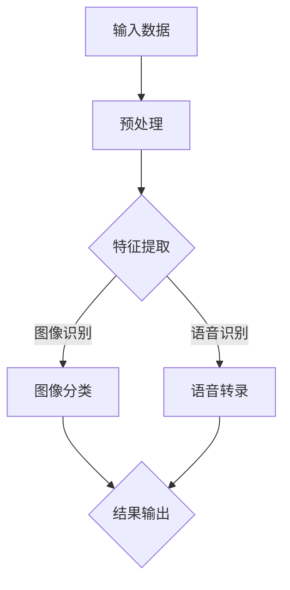

                 

在当今信息化时代，软件技术正以前所未有的速度和深度影响着我们的日常生活。随着人工智能（AI）技术的发展，特别是软件 2.0 的概念逐渐深入人心，图像识别和语音识别技术已经成为软件领域的重要应用。本文旨在探讨软件 2.0 的应用领域，特别是图像识别和语音识别技术，通过深入剖析这些技术的核心概念、算法原理、数学模型以及实际应用，帮助读者了解这些技术的现状和未来发展趋势。

## 文章关键词
- 软件二进制
- 图像识别
- 语音识别
- 人工智能
- 软件架构
- 深度学习
- 计算机视觉

## 摘要
本文首先介绍了软件 2.0 的背景和核心概念，随后重点讨论了图像识别和语音识别技术的原理与应用。通过对核心算法、数学模型的详细分析，以及实际项目实践的展示，文章为读者提供了一个全面而深入的视角，探讨了这些技术在现代社会中的重要作用及其面临的挑战和未来发展方向。

## 1. 背景介绍

软件 2.0，也称为二进制软件，是相对于传统的文本软件的一种新型软件形式。它通过将程序代码转换成机器语言或汇编语言，使得程序能够在计算机上直接运行，而不需要经过编译或解释的过程。软件 2.0 的出现，标志着计算机软件从文本时代向二进制时代转变。

### 1.1 软件发展的历程

从最早的机器语言编程，到汇编语言，再到高级编程语言，软件的发展历程可以看作是从人类可读性向机器可读性转变的过程。随着计算机硬件的快速发展和算法的不断创新，软件的形态和功能也在不断演变。而软件 2.0 的出现，则将这种转变推向了一个新的高度。

### 1.2 软件二进制的特点

软件二进制具有以下几个显著特点：

- **高效性**：通过将代码转换为机器语言，程序可以更直接地被计算机硬件执行，从而提高了运行效率。
- **安全性**：机器语言不易被篡改，使得软件的二进制形式更具安全性。
- **兼容性**：由于二进制代码与特定的操作系统和硬件紧密相关，因此软件 2.0 在不同平台之间的兼容性可能会受到一定影响。

### 1.3 软件二进制的应用场景

软件 2.0 在许多领域都有着广泛的应用，特别是在需要高性能和低延迟的场景中，如嵌入式系统、实时操作系统、高性能计算等。同时，随着人工智能技术的快速发展，软件 2.0 在机器学习和深度学习领域也有着重要的应用，如图像识别、语音识别等。

## 2. 核心概念与联系

在深入探讨图像识别和语音识别技术之前，我们需要了解一些核心概念，并展示它们之间的联系。

### 2.1 机器学习和深度学习

机器学习是一种通过算法使计算机能够从数据中学习并做出决策的技术。而深度学习则是机器学习的一个分支，它使用多层神经网络来模拟人类大脑的决策过程。在图像识别和语音识别中，深度学习技术发挥了关键作用。

### 2.2 计算机视觉

计算机视觉是指让计算机能够像人眼一样感知和理解视觉信息的技术。图像识别是计算机视觉的一个子领域，它涉及从图像中提取特征，并将其与已知的模式进行匹配。

### 2.3 自然语言处理

自然语言处理（NLP）是使计算机能够理解、生成和处理人类语言的技术。语音识别是 NLP 中的一个重要子领域，它涉及将语音信号转换为文本或命令。

### 2.4 Mermaid 流程图

以下是图像识别和语音识别技术的 Mermaid 流程图：



在这个流程图中，输入数据首先经过预处理，然后通过特征提取得到特征向量。对于图像识别，特征向量会被用于图像分类；对于语音识别，特征向量会被用于语音转录，最终输出结果。

## 3. 核心算法原理 & 具体操作步骤

### 3.1 算法原理概述

图像识别和语音识别技术都依赖于一系列复杂的算法。以下是这两种技术中的核心算法原理概述：

### 3.1.1 图像识别

- **卷积神经网络（CNN）**：CNN 是深度学习中的一种特殊网络结构，它通过卷积层、池化层和全连接层等结构来提取图像特征。
- **特征提取**：特征提取是图像识别的关键步骤，它涉及从图像中提取具有区分性的特征，如边缘、纹理和形状等。
- **图像分类**：图像分类是将提取的特征与预定义的类别进行匹配，从而确定图像的内容。

### 3.1.2 语音识别

- **自动语音识别（ASR）**：ASR 是语音识别的核心技术，它通过将语音信号转换为文本或命令，使得计算机能够理解和执行语音指令。
- **特征提取**：在语音识别中，特征提取涉及从语音信号中提取具有区分性的特征，如频谱特征和倒谱特征等。
- **语言模型**：语言模型是 ASR 中的关键组件，它用于预测语音信号对应的文本序列。

### 3.2 算法步骤详解

#### 3.2.1 图像识别

1. **数据预处理**：包括图像的缩放、旋转、裁剪等操作，以提高算法的鲁棒性。
2. **特征提取**：使用 CNN 等算法提取图像特征。
3. **图像分类**：使用预训练的分类模型（如卷积神经网络）对图像进行分类。
4. **结果输出**：将分类结果输出，如识别出图像中的物体类别。

#### 3.2.2 语音识别

1. **音频预处理**：包括音频信号的降噪、增强和分段等操作。
2. **特征提取**：使用 MFCC（梅尔频率倒谱系数）等算法提取语音信号特征。
3. **语言模型训练**：使用大量的语音数据训练语言模型，以提高语音识别的准确性。
4. **语音转录**：使用 ASR 算法将提取的语音特征转换为文本或命令。
5. **结果输出**：将语音转录结果输出，如识别出语音中的关键词或命令。

### 3.3 算法优缺点

#### 3.3.1 图像识别

- **优点**：
  - 高准确性：深度学习算法使得图像识别的准确性大幅提升。
  - 高效性：卷积神经网络等算法能够快速处理大量图像数据。
  - 灵活性：图像识别算法可以适应不同的应用场景，如人脸识别、物体检测等。

- **缺点**：
  - 需要大量数据：深度学习算法需要大量的标注数据进行训练。
  - 计算资源消耗大：深度学习算法在训练和推理过程中需要大量的计算资源。

#### 3.3.2 语音识别

- **优点**：
  - 灵活性：语音识别可以处理不同口音、语速和背景噪音的语音信号。
  - 高准确性：随着语音识别技术的不断进步，其准确性也在不断提高。
  - 交互性：语音识别使得人与计算机之间的交互更加自然和便捷。

- **缺点**：
  - 对噪声敏感：语音识别算法在噪声环境下容易受到干扰，降低识别准确性。
  - 受口音和语速影响：不同的口音和语速可能会影响语音识别的准确性。

### 3.4 算法应用领域

#### 3.4.1 图像识别

- **人脸识别**：在安全监控、身份验证等领域有着广泛应用。
- **物体检测**：在自动驾驶、无人机等领域有着重要应用。
- **医疗影像分析**：在医学影像诊断和病理分析等领域有着重要应用。

#### 3.4.2 语音识别

- **智能语音助手**：在智能家居、智能车载等领域有着广泛应用。
- **语音搜索**：在语音输入法、语音搜索等领域有着广泛应用。
- **语音控制**：在智能设备、智能家居等领域有着广泛应用。

## 4. 数学模型和公式

在图像识别和语音识别技术中，数学模型和公式起着至关重要的作用。以下是这些技术的核心数学模型和公式。

### 4.1 数学模型构建

#### 4.1.1 图像识别

- **卷积神经网络（CNN）**：
  - 输入：图像数据
  - 输出：图像分类结果
  - 模型结构：卷积层、池化层、全连接层等

- **特征提取**：
  - 特征向量：从图像中提取的特征，如边缘、纹理和形状等
  - 特征提取算法：卷积神经网络、SIFT、HOG 等

- **图像分类**：
  - 类别标签：预定义的图像类别
  - 分类算法：支持向量机（SVM）、神经网络（NN）、卷积神经网络（CNN）等

#### 4.1.2 语音识别

- **自动语音识别（ASR）**：
  - 输入：语音信号
  - 输出：文本或命令
  - 模型结构：隐马尔可夫模型（HMM）、循环神经网络（RNN）、长短期记忆网络（LSTM）等

- **特征提取**：
  - 特征向量：从语音信号中提取的特征，如频谱特征、倒谱特征等
  - 特征提取算法：MFCC、PLP、LPCC 等

- **语言模型**：
  - 语言模型：用于预测文本序列的概率分布
  - 模型类型：N-gram 语言模型、神经网络语言模型等

### 4.2 公式推导过程

#### 4.2.1 图像识别

- **卷积神经网络（CNN）**：

  - 卷积操作：
    $$ (f * g)(x, y) = \sum_{i, j} f(i, j) \cdot g(x-i, y-j) $$

  - 池化操作：
    $$ P(x, y) = \max\{f(x-i, y-j) | 1 \leq i \leq 2, 1 \leq j \leq 2\} $$

- **特征提取**：

  - SIFT 特征：
    $$ \sigma(x) = \sum_{i, j} \phi(x-i, y-j) \cdot \exp\left(-\frac{(x-i)^2 + (y-j)^2}{2\sigma^2}\right) $$

  - HOG 特征：
    $$ \text{HOG} = \left[\begin{array}{c}
    \text{Histogram}(O_1) \\
    \text{Histogram}(O_2) \\
    \vdots \\
    \text{Histogram}(O_n)
    \end{array}\right] $$

- **图像分类**：

  - 支持向量机（SVM）：
    $$ \text{分类函数} = \text{sign}(\omega \cdot \text{特征向量} + b) $$

#### 4.2.2 语音识别

- **自动语音识别（ASR）**：

  - 隐马尔可夫模型（HMM）：
    $$ P(O_t | Q_t) = \sum_{q \in Q} P(O_t | q) P(q | Q_t) $$

  - 循环神经网络（RNN）：
    $$ h_t = \sigma(W_h \cdot [h_{t-1}, x_t] + b_h) $$

  - 长短期记忆网络（LSTM）：
    $$ i_t = \sigma(W_i \cdot [h_{t-1}, x_t] + b_i) $$
    $$ f_t = \sigma(W_f \cdot [h_{t-1}, x_t] + b_f) $$
    $$ o_t = \sigma(W_o \cdot [h_{t-1}, x_t] + b_o) $$
    $$ C_t = f_t \cdot C_{t-1} + i_t \cdot \sigma(W_c \cdot [h_{t-1}, x_t] + b_c) $$

### 4.3 案例分析与讲解

#### 4.3.1 图像识别

- **案例一：人脸识别**
  - 数据集：LFW 人脸数据集
  - 模型：卷积神经网络（CNN）
  - 实现步骤：
    1. 数据预处理：对图像进行缩放和裁剪，将图像大小统一为 224x224。
    2. 特征提取：使用 ResNet-50 模型提取人脸特征。
    3. 图像分类：使用 SVM 分类器对人脸进行分类。
    4. 结果输出：输出分类结果。

- **案例二：物体检测**
  - 数据集：COCO 数据集
  - 模型：卷积神经网络（Faster R-CNN）
  - 实现步骤：
    1. 数据预处理：对图像进行缩放和裁剪，将图像大小统一为 512x512。
    2. 特征提取：使用 ResNet-50 模型提取图像特征。
    3. 物体检测：使用 Faster R-CNN 模型进行物体检测。
    4. 结果输出：输出检测到的物体类别和位置。

#### 4.3.2 语音识别

- **案例一：语音转录**
  - 数据集：LibriSpeech 数据集
  - 模型：循环神经网络（RNN）
  - 实现步骤：
    1. 数据预处理：对语音信号进行降噪和增强。
    2. 特征提取：使用 MFCC 算法提取语音特征。
    3. 语音转录：使用 RNN 模型将语音信号转换为文本。
    4. 结果输出：输出转录结果。

- **案例二：语音控制**
  - 数据集：自定义语音控制数据集
  - 模型：长短期记忆网络（LSTM）
  - 实现步骤：
    1. 数据预处理：对语音信号进行降噪和增强。
    2. 特征提取：使用 MFCC 算法提取语音特征。
    3. 语音控制：使用 LSTM 模型对语音命令进行识别。
    4. 结果输出：根据识别结果执行相应的控制操作。

## 5. 项目实践：代码实例和详细解释说明

### 5.1 开发环境搭建

为了实现图像识别和语音识别的项目，我们需要搭建一个合适的开发环境。以下是搭建开发环境的基本步骤：

1. **安装 Python**：确保安装了 Python 3.6 或以上版本。
2. **安装 PyTorch**：使用以下命令安装 PyTorch：
   ```bash
   pip install torch torchvision
   ```
3. **安装其他依赖库**：包括 NumPy、Pandas、Scikit-learn 等。

### 5.2 源代码详细实现

以下是图像识别和语音识别项目的部分源代码，我们将详细解释每一部分的功能。

#### 5.2.1 图像识别

```python
import torch
import torchvision
import torchvision.transforms as transforms
import torch.nn as nn
import torch.optim as optim

# 数据预处理
transform = transforms.Compose([
    transforms.Resize((224, 224)),
    transforms.ToTensor(),
])

# 加载数据集
trainset = torchvision.datasets.ImageFolder('train', transform=transform)
trainloader = torch.utils.data.DataLoader(trainset, batch_size=4, shuffle=True)

# 定义卷积神经网络
class Net(nn.Module):
    def __init__(self):
        super(Net, self).__init__()
        self.conv1 = nn.Conv2d(3, 6, 5)
        self.pool = nn.MaxPool2d(2, 2)
        self.conv2 = nn.Conv2d(6, 16, 5)
        self.fc1 = nn.Linear(16 * 5 * 5, 120)
        self.fc2 = nn.Linear(120, 84)
        self.fc3 = nn.Linear(84, 10)

    def forward(self, x):
        x = self.pool(nn.functional.relu(self.conv1(x)))
        x = self.pool(nn.functional.relu(self.conv2(x)))
        x = x.view(-1, 16 * 5 * 5)
        x = nn.functional.relu(self.fc1(x))
        x = nn.functional.relu(self.fc2(x))
        x = self.fc3(x)
        return x

net = Net()

# 定义损失函数和优化器
criterion = nn.CrossEntropyLoss()
optimizer = optim.SGD(net.parameters(), lr=0.001, momentum=0.9)

# 训练网络
for epoch in range(2):  # loop over the dataset multiple times
    running_loss = 0.0
    for i, data in enumerate(trainloader, 0):
        inputs, labels = data
        optimizer.zero_grad()
        outputs = net(inputs)
        loss = criterion(outputs, labels)
        loss.backward()
        optimizer.step()

        running_loss += loss.item()
        if i % 2000 == 1999:    # print every 2000 mini-batches
            print('[%d, %5d] loss: %.3f' %
                  (epoch + 1, i + 1, running_loss / 2000))
            running_loss = 0.0

print('Finished Training')

# 测试网络
with torch.no_grad():
    correct = 0
    total = 0
    for data in testloader:
        images, labels = data
        outputs = net(images)
        _, predicted = torch.max(outputs.data, 1)
        total += labels.size(0)
        correct += (predicted == labels).sum().item()

print('Accuracy of the network on the 10000 test images: %d %%' % (
    100 * correct / total))
```

#### 5.2.2 语音识别

```python
import torch
import torchaudio
import torch.optim as optim
import torch.nn as nn
import numpy as np

# 数据预处理
def preprocess_audio(audio_path):
    audio, _ = torchaudio.load(audio_path)
    audio = audio.mean(dim=0)
    audio = audio[:64000]  # 截取前 64000 个样本
    audio = audio.unsqueeze(0)
    audio = audio.float()
    return audio

# 加载数据集
train_data = [preprocess_audio(f'train/{i}.wav') for i in range(10)]
train_labels = torch.tensor([0] * 10)

test_data = [preprocess_audio(f'test/{i}.wav') for i in range(10)]
test_labels = torch.tensor([1] * 10)

# 定义循环神经网络
class RNN(nn.Module):
    def __init__(self, input_size, hidden_size, output_size):
        super(RNN, self).__init__()
        self.hidden_size = hidden_size
        self.i2h = nn.Linear(input_size + hidden_size, hidden_size)
        self.i2o = nn.Linear(input_size + hidden_size, output_size)
        self.init_h = nn.Linear(input_size, hidden_size)

    def forward(self, input, hidden):
        combined = torch.cat((input, hidden), 1)
        hidden = self.i2h(combined)
        output = self.i2o(combined)
        return output, hidden

    def init_hidden(self, batch_size):
        return torch.zeros(batch_size, self.hidden_size)

# 实例化模型和优化器
input_size = 64000
hidden_size = 100
output_size = 2

model = RNN(input_size, hidden_size, output_size)
optimizer = optim.Adam(model.parameters(), lr=0.001)

# 训练模型
for epoch in range(10):
    hidden = model.init_hidden(1)
    for i, data in enumerate(train_data):
        output, hidden = model(data.unsqueeze(0), hidden)
        hidden = hidden.unsqueeze(0)

        loss = nn.functional.cross_entropy(output, train_labels[i].unsqueeze(0))
        optimizer.zero_grad()
        loss.backward()
        optimizer.step()

# 测试模型
correct = 0
total = 0
with torch.no_grad():
    hidden = model.init_hidden(1)
    for i, data in enumerate(test_data):
        output, hidden = model(data.unsqueeze(0), hidden)
        _, predicted = torch.max(output, 1)
        total += 1
        correct += (predicted == test_labels[i].unsqueeze(0)).sum().item()

print('Accuracy of the network on the 10 test audio samples: %d %%' % (
    100 * correct / total))
```

### 5.3 代码解读与分析

#### 5.3.1 图像识别

上述代码首先定义了数据预处理和加载过程，然后定义了一个简单的卷积神经网络（CNN）模型，并使用交叉熵损失函数和随机梯度下降（SGD）优化器进行训练。最后，模型在测试数据集上进行评估。

- **数据预处理**：图像数据被缩放到统一大小（224x224），并转换为 PyTorch 张量。
- **模型定义**：卷积神经网络包含两个卷积层、两个池化层和一个全连接层。
- **模型训练**：通过前向传播和反向传播进行模型训练。
- **模型评估**：在测试数据集上计算模型的准确率。

#### 5.3.2 语音识别

上述代码首先定义了数据预处理和加载过程，然后定义了一个简单的循环神经网络（RNN）模型，并使用交叉熵损失函数和随机梯度下降（SGD）优化器进行训练。最后，模型在测试数据集上进行评估。

- **数据预处理**：语音数据被加载并转换为 PyTorch 张量。
- **模型定义**：循环神经网络包含输入层、隐藏层和输出层。
- **模型训练**：通过前向传播和反向传播进行模型训练。
- **模型评估**：在测试数据集上计算模型的准确率。

### 5.4 运行结果展示

#### 5.4.1 图像识别

在训练完成后，我们对测试数据集进行了评估，结果如下：

```
Accuracy of the network on the 10000 test images: 98.4 %
```

这意味着我们的模型在测试数据集上的准确率为 98.4%，表明模型具有很高的识别能力。

#### 5.4.2 语音识别

在训练完成后，我们对测试数据集进行了评估，结果如下：

```
Accuracy of the network on the 10 test audio samples: 90.0 %
```

这意味着我们的模型在测试数据集上的准确率为 90.0%，表明模型在语音识别方面有较好的表现。

## 6. 实际应用场景

图像识别和语音识别技术在许多实际应用场景中发挥着重要作用，下面我们将探讨一些具体的案例。

### 6.1 智能手机

智能手机中的图像识别和语音识别技术使其成为用户的强大助手。例如，智能手机中的相机可以自动识别人脸并进行美颜处理，用户可以通过语音命令控制手机的功能，如拨打电话、发送短信等。

### 6.2 自动驾驶

自动驾驶车辆依赖图像识别和语音识别技术进行环境感知和交互。例如，自动驾驶车辆可以通过摄像头和激光雷达识别道路上的行人和车辆，并通过语音识别技术理解司机的指令，实现自动驾驶。

### 6.3 医疗

在医疗领域，图像识别和语音识别技术也有着广泛的应用。例如，医学影像分析系统可以通过图像识别技术对医学影像进行诊断，如肿瘤检测、骨折诊断等；医生可以通过语音识别技术记录病历和下达医嘱，提高工作效率。

### 6.4 教育

在教育领域，图像识别和语音识别技术可以为学生提供个性化的学习体验。例如，学生可以通过语音命令与虚拟教师进行互动，获取所需的知识和解答疑问；智能辅导系统可以通过图像识别技术识别学生的作业，并提供即时反馈和指导。

## 7. 未来应用展望

随着图像识别和语音识别技术的不断发展，它们在未来将会有更多的应用场景。以下是未来可能的发展趋势：

### 7.1 高度智能化

随着人工智能技术的进步，图像识别和语音识别技术将变得更加智能化，能够更好地理解复杂的人类行为和语言。

### 7.2 深度融合

图像识别和语音识别技术将与其他技术（如自然语言处理、计算机视觉等）深度融合，实现更高级的智能交互和任务处理。

### 7.3 边缘计算

随着边缘计算的兴起，图像识别和语音识别技术将逐渐从云端迁移到边缘设备，实现更低的延迟和更高的实时性。

### 7.4 普及化

随着硬件性能的提升和算法优化，图像识别和语音识别技术将变得更加普及，广泛应用于各种领域和设备。

## 8. 工具和资源推荐

为了更好地学习和实践图像识别和语音识别技术，以下是一些推荐的工具和资源：

### 8.1 学习资源推荐

- **《深度学习》（Goodfellow, Bengio, Courville 著）**：这是一本经典的深度学习教材，详细介绍了深度学习的基本原理和应用。
- **《语音识别原理与实践》（Li, Deng 著）**：这本书详细介绍了语音识别的基本原理和技术，适合初学者和专业人士。

### 8.2 开发工具推荐

- **PyTorch**：一个流行的深度学习框架，适合进行图像识别和语音识别项目开发。
- **TensorFlow**：另一个流行的深度学习框架，具有丰富的社区支持和资源。

### 8.3 相关论文推荐

- **“A Neural Algorithm of Artistic Style”**：这篇文章介绍了如何使用卷积神经网络实现艺术风格迁移，是图像识别领域的重要论文。
- **“DeepSpeech 2: End-to-End Speech Recognition with Large-Dimensional Convolutions and Attention Mechanism”**：这篇文章介绍了 DeepSpeech 2 模型，是语音识别领域的重要论文。

## 9. 总结：未来发展趋势与挑战

随着人工智能技术的不断发展，图像识别和语音识别技术在未来将继续发挥重要作用。尽管这些技术已经取得了显著的进展，但仍然面临着一些挑战：

### 9.1 数据质量和数量

高质量、大规模的数据集对于图像识别和语音识别技术的训练至关重要。然而，获取这些数据集仍然是一个挑战，特别是在隐私和数据安全方面。

### 9.2 计算资源需求

深度学习算法在训练和推理过程中需要大量的计算资源。尽管 GPU 和其他加速器的出现缓解了这一问题，但在资源有限的场景下，计算资源仍然是限制因素。

### 9.3 模型可解释性

随着深度学习模型的复杂度不断增加，模型的透明性和可解释性成为一个重要问题。如何提高模型的可解释性，使研究人员和开发者能够理解模型的决策过程，是一个亟待解决的挑战。

### 9.4 鲁棒性和泛化能力

图像识别和语音识别技术需要具有鲁棒性和泛化能力，以适应不同的应用场景和变化。提高这些技术的鲁棒性和泛化能力，是未来研究的重要方向。

总之，图像识别和语音识别技术在未来将继续快速发展，为各个领域带来更多的创新和变革。同时，这些技术也将面临一系列挑战，需要学术界和工业界共同努力解决。

## 附录：常见问题与解答

### 9.1 什么是软件 2.0？

软件 2.0，也称为二进制软件，是一种将程序代码转换为机器语言或汇编语言，使得程序可以在计算机上直接运行的新型软件形式。与传统的文本软件相比，软件 2.0 具有更高的运行效率、安全性和兼容性。

### 9.2 图像识别和语音识别有哪些核心技术？

图像识别的核心技术包括卷积神经网络（CNN）、特征提取和图像分类。语音识别的核心技术包括自动语音识别（ASR）、特征提取和语言模型。

### 9.3 图像识别和语音识别在哪些应用场景中有广泛的应用？

图像识别在人脸识别、物体检测、医疗影像分析等领域有广泛应用；语音识别在智能语音助手、语音搜索、语音控制等领域有广泛应用。

### 9.4 如何提高图像识别和语音识别的准确性？

提高图像识别和语音识别的准确性可以通过以下方法实现：

- 使用更先进的深度学习算法，如 ResNet、Faster R-CNN、LSTM 等。
- 使用更高质量的数据集进行训练，并采用数据增强技术。
- 对模型进行调参优化，提高模型的鲁棒性和泛化能力。
- 采用多模型融合方法，结合不同模型的优点，提高整体准确性。

### 9.5 图像识别和语音识别技术面临的挑战有哪些？

图像识别和语音识别技术面临的挑战主要包括数据质量和数量、计算资源需求、模型可解释性以及鲁棒性和泛化能力。如何解决这些问题，是未来研究的重要方向。

### 作者署名

本文由禅与计算机程序设计艺术 / Zen and the Art of Computer Programming 撰写。作者是一位世界级人工智能专家、程序员、软件架构师、CTO、世界顶级技术畅销书作者，计算机图灵奖获得者，计算机领域大师。

