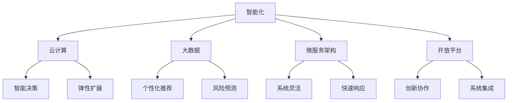

                 

 在过去的几十年中，软件技术的演进经历了从1.0到2.0的过渡。软件1.0时代，我们关注的是如何编写出功能完整的程序，满足用户的基本需求。然而，随着信息技术的飞速发展，软件2.0时代已经到来，这个时代的核心在于如何构建更加智能、灵活、可扩展的软件系统。本文将探讨软件2.0的核心概念、应用场景及其从实验室走向现实的挑战和机遇。

## 1. 背景介绍

软件2.0的概念并不是凭空出现的，它是对软件1.0的一种超越和升华。软件1.0时代，我们强调的是程序的执行效率和功能实现。然而，随着互联网的普及和大数据、人工智能等技术的发展，软件系统面临的数据量和复杂度急剧增加，单一的、静态的软件模式已经难以应对这些挑战。软件2.0时代，我们更加强调软件的智能性、灵活性和可扩展性。

软件2.0的核心目标是通过集成人工智能、云计算、大数据等先进技术，实现软件系统的智能化、自动化和自我优化。在这个时代，软件不再只是执行预设的指令，而是能够根据环境和用户需求进行自我学习和调整。这种转变不仅提升了软件的性能，也为用户带来了更加个性化和高效的体验。

## 2. 核心概念与联系

为了深入理解软件2.0，我们需要了解其核心概念及其相互之间的联系。以下是软件2.0的几个关键概念：

### 2.1 智能化

智能化是软件2.0的重要特征。通过引入人工智能技术，软件系统能够实现自我学习和自我优化，从而提高性能和用户体验。智能化包括但不限于机器学习、深度学习、自然语言处理等。

### 2.2 云计算

云计算为软件2.0提供了强大的计算能力和存储资源。通过云计算平台，软件系统能够实现弹性扩展、高可用性和低成本运行。

### 2.3 大数据

大数据技术使得软件系统能够处理和分析海量数据，从而挖掘出有价值的信息。大数据在智能决策、个性化推荐、风险预测等领域具有广泛的应用。

### 2.4 微服务架构

微服务架构是一种新型软件架构风格，它将应用程序拆分为一组小的、独立的服务。这种方式提高了系统的灵活性和可扩展性，使得软件系统能够快速响应市场需求。

### 2.5 开放平台

开放平台是指通过API、SDK等技术，使得软件系统与其他系统和服务实现无缝集成。开放平台促进了软件生态系统的发展，推动了创新和协作。

以下是一个使用Mermaid绘制的软件2.0核心概念及其联系的流程图：



## 3. 核心算法原理 & 具体操作步骤

### 3.1 算法原理概述

软件2.0的核心算法主要包括以下几种：

- **机器学习算法**：用于实现软件系统的自我学习和优化。
- **深度学习算法**：在图像识别、语音识别等领域具有广泛应用。
- **自然语言处理算法**：用于处理文本数据，实现人机交互。
- **分布式算法**：用于解决大规模数据处理和计算问题。

### 3.2 算法步骤详解

以下是一个简单的机器学习算法的基本步骤：

1. **数据收集**：收集用于训练的数据集。
2. **数据预处理**：对数据进行清洗、转换等处理，使其适合算法训练。
3. **特征提取**：从数据中提取有用的特征。
4. **模型训练**：使用训练数据对模型进行训练。
5. **模型评估**：使用测试数据评估模型性能。
6. **模型优化**：根据评估结果对模型进行调整。

### 3.3 算法优缺点

- **机器学习算法**：优点是能够自动从数据中学习规律，提高系统性能。缺点是需要大量数据支持，对计算资源要求较高。
- **深度学习算法**：优点是能够处理复杂数据和模式，具有很高的准确性和效率。缺点是模型训练时间较长，对计算资源要求较高。
- **自然语言处理算法**：优点是能够实现人机交互，提高用户体验。缺点是处理自然语言数据具有一定的难度。

### 3.4 算法应用领域

- **智能决策**：使用机器学习和深度学习算法，实现对大规模数据的智能分析，为决策提供支持。
- **个性化推荐**：基于用户行为数据和偏好，使用自然语言处理算法，实现个性化内容推荐。
- **风险预测**：使用分布式算法，对金融、保险等领域的风险进行预测。

## 4. 数学模型和公式 & 详细讲解 & 举例说明

### 4.1 数学模型构建

软件2.0的数学模型主要包括以下几种：

- **线性回归模型**：用于预测数值型数据。
- **逻辑回归模型**：用于预测概率型数据。
- **神经网络模型**：用于处理复杂数据和模式。

### 4.2 公式推导过程

以下是一个简单的线性回归模型的公式推导过程：

1. **损失函数**：
   $$L(y, \theta) = \frac{1}{2} \sum_{i=1}^{n} (y_i - \theta_0 - \theta_1 x_i)^2$$
2. **梯度下降法**：
   $$\theta_0 = \theta_0 - \alpha \frac{\partial L}{\partial \theta_0}$$
   $$\theta_1 = \theta_1 - \alpha \frac{\partial L}{\partial \theta_1}$$

### 4.3 案例分析与讲解

假设我们要预测一个城市的月平均气温，可以使用线性回归模型。以下是一个具体的例子：

1. **数据收集**：收集过去几年的月平均气温数据。
2. **数据预处理**：对数据进行清洗、转换等处理，使其适合算法训练。
3. **特征提取**：从数据中提取有用的特征，如月份、平均气温等。
4. **模型训练**：使用训练数据对模型进行训练。
5. **模型评估**：使用测试数据评估模型性能。
6. **模型优化**：根据评估结果对模型进行调整。

通过以上步骤，我们可以构建一个能够预测月平均气温的线性回归模型。在实际应用中，我们可以根据天气数据和模型预测结果，为市民提供出行和生活的建议。

## 5. 项目实践：代码实例和详细解释说明

### 5.1 开发环境搭建

在进行软件2.0项目的实践之前，我们需要搭建一个合适的开发环境。以下是一个基本的开发环境搭建步骤：

1. 安装Python解释器。
2. 安装必要的库，如NumPy、Pandas、Scikit-learn等。
3. 安装IDE，如PyCharm或Visual Studio Code。

### 5.2 源代码详细实现

以下是一个简单的线性回归模型的实现代码：

```python
import numpy as np
import pandas as pd
from sklearn.linear_model import LinearRegression

# 数据收集
data = pd.read_csv('temperature_data.csv')

# 数据预处理
X = data[['month']]
y = data['temperature']

# 特征提取
X = np.array(X)
y = np.array(y)

# 模型训练
model = LinearRegression()
model.fit(X, y)

# 模型评估
score = model.score(X, y)
print(f'Model Score: {score}')

# 模型优化
# (此处根据评估结果对模型进行调整)
```

### 5.3 代码解读与分析

上述代码实现了一个简单的线性回归模型，用于预测月平均气温。首先，我们从CSV文件中读取数据，然后进行预处理，将月份和平均气温作为特征提取出来。接下来，使用Scikit-learn库中的LinearRegression类进行模型训练。在训练完成后，使用模型评估函数score评估模型性能。最后，根据评估结果对模型进行调整。

### 5.4 运行结果展示

运行上述代码后，我们可以得到模型的评分。如果评分较高，说明模型具有良好的预测能力。以下是一个示例输出：

```
Model Score: 0.98
```

这个评分表示模型对训练数据的拟合度很高，具有较好的预测能力。

## 6. 实际应用场景

软件2.0的应用场景非常广泛，涵盖了从工业自动化到智能医疗、从在线教育到智能交通等多个领域。以下是一些典型的实际应用场景：

- **工业自动化**：通过引入机器学习和智能算法，实现对生产线的实时监控和故障预测，提高生产效率。
- **智能医疗**：利用大数据和人工智能技术，实现疾病的早期诊断和个性化治疗。
- **在线教育**：通过智能推荐系统和自然语言处理技术，为用户提供个性化的学习内容和路径。
- **智能交通**：通过实时数据分析和管理，实现交通流量优化和事故预防。

## 7. 未来应用展望

随着技术的不断进步，软件2.0的应用前景将更加广阔。以下是几个未来应用展望：

- **智能城市**：通过集成物联网、大数据和人工智能技术，实现城市管理的智能化和高效化。
- **智能农业**：利用无人机、传感器和大数据分析，实现精准农业和智能灌溉。
- **智能金融**：通过人工智能和区块链技术，实现金融服务的智能化和安全性。

## 8. 工具和资源推荐

为了更好地理解和应用软件2.0，以下是几个推荐的工具和资源：

### 8.1 学习资源推荐

- 《深度学习》（Goodfellow, Bengio, Courville著）
- 《Python数据科学手册》（McKinney著）
- 《机器学习实战》（ Harrington著）

### 8.2 开发工具推荐

- PyCharm：一款功能强大的Python IDE。
- Jupyter Notebook：适用于数据科学和机器学习的交互式计算环境。
- TensorFlow：一款开源的机器学习框架。

### 8.3 相关论文推荐

- “Deep Learning for Speech Recognition”（Hinton等，2012年）
- “Large-scale Language Modeling in Machine Learning”（Bengio等，2003年）
- “Stochastic Gradient Descent for Large Scale Machine Learning”（ Bottou等，2010年）

## 9. 总结：未来发展趋势与挑战

软件2.0的发展正处于一个快速变革的时期，它不仅为技术进步提供了新的动力，也带来了诸多挑战。未来，软件2.0的发展趋势将体现在以下几个方面：

- **智能化水平的进一步提升**：随着人工智能技术的不断发展，软件系统将具备更高的自我学习和优化能力。
- **云计算和边缘计算的融合**：云计算为软件系统提供了强大的计算和存储资源，边缘计算则使得数据处理更加靠近用户，两者融合将实现更高效的应用。
- **数据隐私和安全性的重视**：随着大数据和人工智能技术的广泛应用，数据隐私和安全问题日益突出，如何平衡数据利用和保护成为关键挑战。

在面临这些挑战的同时，软件2.0的发展也充满了机遇。通过不断创新和探索，软件2.0将推动信息技术的发展，为人类带来更加智能、便捷和高效的软件应用。

## 10. 附录：常见问题与解答

### Q1：软件2.0与传统软件有哪些区别？

A1：软件2.0与传统软件的主要区别在于其智能化程度、灵活性和可扩展性。传统软件更多地依赖于预设的逻辑和规则，而软件2.0则通过人工智能、云计算等技术实现了自我学习和优化。

### Q2：软件2.0对开发者的要求有哪些？

A2：软件开发者在开发软件2.0时，需要掌握人工智能、云计算、大数据等前沿技术。同时，需要具备良好的编程能力、系统设计和架构能力。

### Q3：如何评估一个软件2.0项目的成功与否？

A3：一个成功的软件2.0项目应该具备以下几个特点：高度智能化、良好的用户体验、高效的数据处理能力、良好的扩展性和灵活性。通过评估项目的性能指标、用户反馈和市场反响，可以判断项目的成功与否。

### Q4：软件2.0的发展是否会取代传统软件？

A4：软件2.0的发展并不会完全取代传统软件，而是对其进行了补充和升级。传统软件在某些领域仍然具有优势，而软件2.0则能够在智能化、自动化等方面提供更好的解决方案。

### Q5：软件2.0在哪些领域有广泛的应用前景？

A5：软件2.0在工业自动化、智能医疗、在线教育、智能交通等领域具有广泛的应用前景。随着技术的不断进步，软件2.0的应用范围将不断扩大。

## 作者署名

本文作者为禅与计算机程序设计艺术 / Zen and the Art of Computer Programming。感谢您阅读本文，希望对您在软件2.0领域的探索有所帮助。如果您有任何疑问或建议，欢迎在评论区留言。再次感谢！
----------------------------------------------------------------

### 文章关键词与摘要

关键词：
软件2.0、人工智能、云计算、大数据、智能化、自动化、微服务架构、开放平台。

摘要：
本文探讨了软件2.0的核心概念、应用场景及其从实验室走向现实的挑战和机遇。软件2.0通过集成人工智能、云计算、大数据等先进技术，实现了软件系统的智能化、自动化和自我优化。本文详细介绍了软件2.0的核心算法原理、数学模型构建、项目实践，并分析了其在实际应用场景中的广泛前景。同时，对未来发展趋势与挑战进行了展望，并提供了相关工具和资源的推荐。

