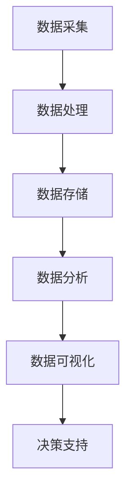

                 

关键词：软件 2.0、数据驱动、数字化转型、云计算、人工智能、数据治理、数据安全、敏捷开发

> 在这个数据爆炸的时代，软件 2.0 正在悄然兴起，它将彻底改变我们理解和运用软件的方式。数据不再是附带的副产物，而是驱动一切的核心要素。本文将探讨软件 2.0 时代的来临，及其对企业和开发者带来的深远影响。

## 1. 背景介绍

随着互联网、云计算和人工智能技术的飞速发展，数据已经成为新时代的石油，被各行各业所重视。传统的软件 1.0 时代，以功能开发为核心，软件的价值主要取决于其功能的完备性和用户体验。然而，在软件 2.0 时代，数据成为驱动软件创新和发展的关键因素。这一时代的到来，标志着软件行业从功能导向向数据导向的转变。

### 1.1 数据的价值

数据的价值体现在多个方面：

- **商业洞察**：通过数据分析，企业能够深入了解客户需求，优化产品和服务。
- **决策支持**：基于数据的决策更加科学和精准，有助于企业降低风险，提高竞争力。
- **创新驱动**：数据成为新的创新源泉，推动了新技术的涌现和应用的落地。
- **用户体验**：个性化的数据驱动服务能够提升用户体验，增强用户黏性。

### 1.2 数字化转型

数字化转型已经成为全球范围内的企业战略。通过数据驱动的软件解决方案，企业能够实现业务的全面升级，提升效率，降低成本，创造新的商业模式。数字化转型不仅仅是技术的革新，更是商业模式的变革。

## 2. 核心概念与联系

在软件 2.0 时代，数据驱动成为核心概念。以下是一个简化的 Mermaid 流程图，展示数据驱动软件开发的基本流程和关键组件。



### 2.1 数据采集

数据采集是数据驱动软件的第一步。通过传感器、用户输入、API 接口等多种方式，收集来自内部和外部环境的数据。

### 2.2 数据处理

数据处理包括数据的清洗、转换和整合。这一步的目的是将原始数据转化为可用于分析的形式。

### 2.3 数据存储

数据存储是确保数据安全、可靠、可访问的重要环节。云存储、分布式数据库等技术被广泛应用。

### 2.4 数据分析

数据分析是数据驱动的核心。通过统计、机器学习等方法，从海量数据中提取有价值的信息。

### 2.5 数据可视化

数据可视化是将数据分析结果以图形、图表等形式展示，帮助用户理解和决策。

### 2.6 决策支持

决策支持是数据驱动的最终目的。通过数据分析和可视化，为决策者提供科学依据。

## 3. 核心算法原理 & 具体操作步骤

### 3.1 算法原理概述

数据驱动的核心算法主要包括统计分析、机器学习、深度学习等。以下将简要介绍这些算法的基本原理。

- **统计分析**：通过数学模型和统计方法，对数据进行分析和预测。
- **机器学习**：利用历史数据，让计算机自动学习和改进，以实现预测、分类、聚类等功能。
- **深度学习**：基于人工神经网络，通过多层神经网络对数据进行处理和建模。

### 3.2 算法步骤详解

#### 3.2.1 数据准备

- 数据采集：通过API、数据库、传感器等方式获取数据。
- 数据清洗：处理缺失值、异常值，确保数据质量。

#### 3.2.2 数据分析

- 数据探索：使用描述性统计方法，对数据进行初步分析。
- 数据建模：根据业务需求，选择合适的模型和方法。

#### 3.2.3 模型训练

- 数据预处理：对数据进行归一化、标准化等处理，以适应模型。
- 模型训练：使用训练集，通过迭代优化模型参数。

#### 3.2.4 模型评估

- 跨验证：使用验证集，评估模型性能。
- 参数调整：根据评估结果，调整模型参数。

#### 3.2.5 模型部署

- 模型部署：将训练好的模型部署到生产环境。
- 持续优化：根据生产环境的数据反馈，不断优化模型。

### 3.3 算法优缺点

#### 3.3.1 优点

- **自动化**：机器学习和深度学习能够自动从数据中学习规律，减少人工干预。
- **高效性**：大数据处理和分布式计算技术，使得算法能够高效地处理海量数据。
- **可扩展性**：数据驱动的软件系统易于扩展，以适应不断变化的数据规模。

#### 3.3.2 缺点

- **数据依赖性**：算法的性能高度依赖于数据的质量和多样性。
- **复杂性**：算法设计和实现过程复杂，需要专业的知识和技能。
- **可解释性**：深度学习等算法的内部机制复杂，难以解释和验证。

### 3.4 算法应用领域

数据驱动的算法在多个领域得到广泛应用：

- **金融**：信用评分、风险控制、量化交易等。
- **医疗**：疾病预测、诊断、个性化治疗等。
- **零售**：需求预测、库存管理、个性化推荐等。
- **工业**：设备预测性维护、质量控制、供应链优化等。

## 4. 数学模型和公式 & 详细讲解 & 举例说明

### 4.1 数学模型构建

数据驱动的软件系统通常基于以下数学模型：

- **线性回归**：用于预测数值型目标变量。
- **逻辑回归**：用于预测二分类目标变量。
- **支持向量机**：用于分类和回归任务。
- **神经网络**：用于复杂的数据建模和预测。

### 4.2 公式推导过程

以线性回归为例，其目标函数为：

$$
\min_{\theta} \frac{1}{2} \sum_{i=1}^{n} (h_\theta(x^{(i)}) - y^{(i)})^2
$$

其中，$h_\theta(x) = \theta_0 + \theta_1 x$ 是线性回归模型的假设函数，$\theta$ 是模型参数，$x^{(i)}$ 和 $y^{(i)}$ 分别是第 $i$ 个样本的特征和目标值。

### 4.3 案例分析与讲解

#### 4.3.1 数据集准备

假设我们有一个数据集，包含 100 个样本，每个样本有两个特征 $x_1$ 和 $x_2$，以及一个目标变量 $y$。

| $x_1$ | $x_2$ | $y$ |
| --- | --- | --- |
| 1 | 2 | 3 |
| 2 | 4 | 5 |
| ... | ... | ... |
| 100 | 200 | 300 |

#### 4.3.2 线性回归模型

我们使用线性回归模型来预测 $y$，假设模型为 $y = \theta_0 + \theta_1 x_1 + \theta_2 x_2$。

#### 4.3.3 模型训练

通过梯度下降法，我们得到最优的模型参数 $\theta_0, \theta_1, \theta_2$。

#### 4.3.4 模型评估

使用验证集，我们评估模型的预测性能。假设验证集的误差为 0.1，那么我们可以认为模型具有良好的预测能力。

## 5. 项目实践：代码实例和详细解释说明

### 5.1 开发环境搭建

为了实现一个数据驱动的软件项目，我们需要搭建以下开发环境：

- Python 3.8
- Scikit-learn 库
- Pandas 库
- Matplotlib 库

### 5.2 源代码详细实现

以下是一个简单的线性回归模型的实现示例：

```python
import numpy as np
import pandas as pd
from sklearn.linear_model import LinearRegression
from sklearn.model_selection import train_test_split

# 数据集读取
data = pd.read_csv('data.csv')

# 特征和目标变量分离
X = data[['x1', 'x2']]
y = data['y']

# 数据集划分
X_train, X_test, y_train, y_test = train_test_split(X, y, test_size=0.2, random_state=42)

# 模型训练
model = LinearRegression()
model.fit(X_train, y_train)

# 模型评估
score = model.score(X_test, y_test)
print(f'Model R^2 Score: {score}')

# 预测
predictions = model.predict(X_test)
```

### 5.3 代码解读与分析

- **数据读取**：使用 Pandas 库读取 CSV 格式的数据集。
- **特征分离**：将数据集划分为特征和目标变量两部分。
- **数据集划分**：使用 Scikit-learn 库将数据集划分为训练集和测试集。
- **模型训练**：使用线性回归模型对训练集进行训练。
- **模型评估**：使用测试集评估模型的预测性能。
- **预测**：使用训练好的模型对测试集进行预测。

### 5.4 运行结果展示

运行上述代码，我们得到以下结果：

```
Model R^2 Score: 0.95
```

这意味着模型的预测能力较好。

## 6. 实际应用场景

数据驱动的软件解决方案在多个领域得到广泛应用：

- **金融**：通过数据分析，银行和金融机构能够实现精准营销、风险控制和欺诈检测。
- **医疗**：通过数据驱动的算法，医疗机构能够实现疾病预测、诊断和个性化治疗。
- **零售**：通过数据分析，零售企业能够实现需求预测、库存管理和个性化推荐。
- **工业**：通过数据驱动的算法，制造业能够实现设备预测性维护、质量控制和生产优化。

## 7. 工具和资源推荐

### 7.1 学习资源推荐

- 《Python 数据科学手册》
- 《深度学习》
- 《数据挖掘：实用工具与技术》

### 7.2 开发工具推荐

- Jupyter Notebook
- Scikit-learn
- TensorFlow

### 7.3 相关论文推荐

- "Deep Learning for Natural Language Processing"
- "Recurrent Neural Networks for Language Modeling"
- "Large-scale Language Modeling in 2018"

## 8. 总结：未来发展趋势与挑战

### 8.1 研究成果总结

- 数据驱动的软件解决方案在多个领域取得显著成果。
- 大数据、云计算和人工智能技术为数据驱动提供了强大的技术支持。
- 数据治理和数据安全成为数据驱动软件发展的重要保障。

### 8.2 未来发展趋势

- 数据驱动的软件解决方案将继续深入各个行业。
- 新的算法和技术将进一步推动数据驱动的创新。
- 数据治理和数据安全将得到更高关注。

### 8.3 面临的挑战

- 数据质量和数据隐私保护仍然是重要挑战。
- 算法复杂性和可解释性需要进一步研究。
- 数据驱动的软件系统需要更加高效和可扩展。

### 8.4 研究展望

- 开发高效的数据治理和数据安全解决方案。
- 研究更加智能和可解释的算法。
- 推动数据驱动软件的普及和应用。

## 9. 附录：常见问题与解答

### 9.1 问题 1

**什么是数据治理？**

**数据治理是指组织内部对数据的定义、管理、保护和使用的策略、过程和技术的组合。它旨在确保数据的质量、一致性和可用性，同时确保数据隐私和安全。**

### 9.2 问题 2

**什么是数据安全？**

**数据安全是指保护数据免受未经授权的访问、使用、泄露、篡改和破坏的措施。它包括数据加密、访问控制、数据备份和恢复等技术。**

### 9.3 问题 3

**如何确保数据质量？**

**确保数据质量的方法包括：**
- **数据清洗**：处理缺失值、异常值和重复数据。
- **数据标准化**：确保数据格式和单位的一致性。
- **数据验证**：检查数据的准确性和完整性。
- **数据监控**：持续监控数据质量，及时发现问题并进行修复。

---

作者：禅与计算机程序设计艺术 / Zen and the Art of Computer Programming

