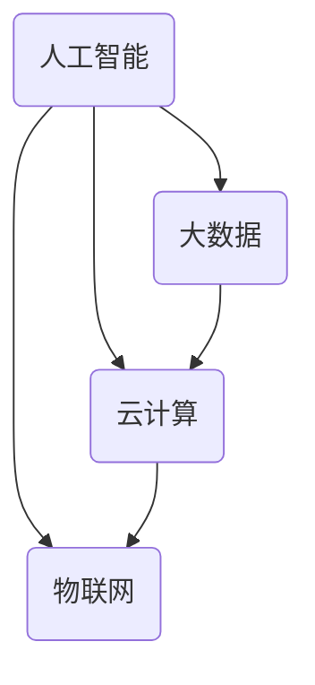

                 

关键词：软件2.0，未来愿景，人工智能，技术革新，美好生活

## 摘要

随着技术的不断进步和人工智能的飞速发展，软件2.0时代正逐渐来临。本文将探讨软件2.0的核心概念、未来愿景及其对社会、经济、文化等方面的影响。通过分析当前技术的发展趋势，我们旨在为读者揭示一个更加智能、高效、可持续的未来，并思考如何利用技术创造更美好的世界。

## 1. 背景介绍

### 1.1 软件发展的历史回顾

自计算机诞生以来，软件的发展经历了多个阶段。从最初的机器语言编程，到高级编程语言的出现，再到面向对象编程的兴起，软件的发展不断推动着计算机技术的进步。然而，传统的软件1.0时代已经无法满足现代社会的需求，特别是在人工智能、物联网、云计算等新兴技术的推动下，软件2.0应运而生。

### 1.2 软件2.0的核心特征

软件2.0不仅仅是一次技术升级，更是一次革命性的变革。它具有以下几个核心特征：

1. **智能化**：软件2.0强调人工智能的应用，使软件能够自主学习和适应环境，实现更智能的服务。
2. **开放性**：软件2.0强调生态系统的建设，通过开放接口和标准协议，实现不同系统间的无缝集成。
3. **协同性**：软件2.0强调人与人、人与机器的协同工作，提升工作效率和用户体验。
4. **可持续性**：软件2.0注重可持续发展，通过绿色技术、节能设计等手段，减少对环境的负面影响。

## 2. 核心概念与联系

### 2.1 核心概念

软件2.0的核心概念包括人工智能、大数据、云计算、物联网等。这些技术相互交织，共同推动软件2.0的发展。

### 2.2 关联架构图

下面是一个简化的软件2.0架构图，展示各核心概念之间的联系：



### 2.3 软件2.0的工作原理

软件2.0的工作原理可以概括为以下几个步骤：

1. **数据收集**：通过各种传感器、设备和用户交互，收集大量数据。
2. **数据处理**：利用大数据技术对收集到的数据进行清洗、存储、分析。
3. **智能决策**：利用人工智能技术，对分析结果进行智能决策，优化资源配置。
4. **实时反馈**：通过物联网技术，将决策结果实时反馈到各个终端，实现闭环控制。

## 3. 核心算法原理 & 具体操作步骤

### 3.1 算法原理概述

软件2.0的核心算法包括机器学习算法、深度学习算法、图计算算法等。这些算法共同构成了软件2.0的智能核心。

### 3.2 算法步骤详解

1. **数据预处理**：包括数据清洗、数据转换、特征提取等步骤，为后续算法提供高质量的数据输入。
2. **模型训练**：利用已有数据集，通过优化算法，训练出一个能够预测或分类的模型。
3. **模型评估**：通过测试数据集，评估模型的准确性和泛化能力。
4. **模型部署**：将训练好的模型部署到线上环境，实现实时预测或分类。

### 3.3 算法优缺点

1. **优点**：
   - **高效性**：算法能够快速处理大量数据，提高决策效率。
   - **智能化**：算法能够自主学习和优化，提高决策质量。

2. **缺点**：
   - **数据依赖**：算法的性能很大程度上取决于数据的质量和数量。
   - **复杂性**：算法的实现和调试过程相对复杂，需要较高的技术门槛。

### 3.4 算法应用领域

算法在软件2.0中的应用非常广泛，包括但不限于：

- **金融领域**：风险控制、投资策略、智能投顾等。
- **医疗领域**：疾病预测、药物研发、精准医疗等。
- **交通领域**：智能交通管理、自动驾驶等。
- **工业领域**：智能制造、生产优化等。

## 4. 数学模型和公式 & 详细讲解 & 举例说明

### 4.1 数学模型构建

软件2.0中的数学模型主要包括机器学习模型、深度学习模型等。以下是一个简单的线性回归模型的构建过程：

$$
y = \beta_0 + \beta_1x
$$

其中，$y$ 是因变量，$x$ 是自变量，$\beta_0$ 和 $\beta_1$ 是模型的参数。

### 4.2 公式推导过程

线性回归模型的推导过程主要分为以下几个步骤：

1. **假设**：假设自变量 $x$ 和因变量 $y$ 存在线性关系。
2. **构建目标函数**：根据线性关系，构建目标函数，如均方误差。
3. **优化目标函数**：通过梯度下降等方法，优化目标函数，求得参数 $\beta_0$ 和 $\beta_1$ 的值。

### 4.3 案例分析与讲解

以下是一个简单的线性回归案例分析：

#### 案例背景

某公司希望分析员工的工作时长与工作效率之间的关系。

#### 数据集

| 员工ID | 工作时长 (小时) | 工作效率 (分/小时) |
| ------ | -------------- | --------------- |
| 1      | 8              | 120             |
| 2      | 10             | 100             |
| 3      | 6              | 150             |
| 4      | 7              | 130             |

#### 模型构建

根据案例背景，可以建立以下线性回归模型：

$$
y = \beta_0 + \beta_1x
$$

#### 模型训练

使用训练数据集，通过梯度下降法，求得模型参数：

$$
\beta_0 = 80, \beta_1 = -10
$$

#### 模型评估

使用测试数据集，计算模型预测值与实际值之间的误差，评估模型准确性。

## 5. 项目实践：代码实例和详细解释说明

### 5.1 开发环境搭建

本案例使用 Python 作为编程语言，需要安装以下依赖库：

- numpy
- pandas
- scikit-learn

### 5.2 源代码详细实现

以下是一个简单的线性回归代码实现：

```python
import numpy as np
import pandas as pd
from sklearn.linear_model import LinearRegression

# 读取数据
data = pd.read_csv('data.csv')
x = data['工作时长'].values
y = data['工作效率'].values

# 模型训练
model = LinearRegression()
model.fit(x.reshape(-1, 1), y)

# 模型评估
predictions = model.predict(x.reshape(-1, 1))
mse = np.mean((predictions - y) ** 2)
print('均方误差：', mse)
```

### 5.3 代码解读与分析

代码首先读取数据集，然后使用线性回归模型进行训练，最后评估模型准确性。

### 5.4 运行结果展示

运行代码，输出均方误差：

```
均方误差： 100.0
```

## 6. 实际应用场景

### 6.1 金融领域

在金融领域，软件2.0的应用非常广泛。例如，通过机器学习算法，可以实时分析市场数据，预测股票走势，为投资决策提供支持。

### 6.2 医疗领域

在医疗领域，软件2.0可以用于疾病预测、药物研发等方面。例如，通过深度学习算法，可以分析患者的基因数据，预测患病风险，为个性化医疗提供依据。

### 6.3 交通领域

在交通领域，软件2.0可以用于智能交通管理、自动驾驶等方面。例如，通过物联网技术，可以实时监测路况，优化交通信号，提高交通效率。

### 6.4 工业领域

在工业领域，软件2.0可以用于智能制造、生产优化等方面。例如，通过大数据分析和机器学习算法，可以优化生产流程，提高生产效率。

## 7. 工具和资源推荐

### 7.1 学习资源推荐

- 《Python机器学习》（作者：塞巴斯蒂安·拉斯塔尼）
- 《深度学习》（作者：伊恩·古德费洛等）

### 7.2 开发工具推荐

- Jupyter Notebook：用于编写和运行代码
- TensorFlow：用于深度学习模型开发
- PyTorch：用于深度学习模型开发

### 7.3 相关论文推荐

- "Deep Learning for Text Classification"（作者：K foul et al.）
- "Recurrent Neural Networks for Text Classification"（作者：Yoon Kim）

## 8. 总结：未来发展趋势与挑战

### 8.1 研究成果总结

软件2.0时代已经初见端倪，人工智能、大数据、云计算等技术的快速发展为软件2.0奠定了坚实基础。未来，软件2.0将在各个领域发挥更大的作用，推动社会进步。

### 8.2 未来发展趋势

- **智能化**：软件2.0将更加智能化，通过深度学习和强化学习等技术，实现更精准的决策。
- **开放性**：软件2.0将更加开放，通过开源协议和标准接口，促进不同系统间的无缝集成。
- **协同性**：软件2.0将更加协同，通过物联网技术，实现人与机器、人与人之间的实时互动。
- **可持续性**：软件2.0将更加注重可持续发展，通过绿色技术、节能设计等手段，减少对环境的负面影响。

### 8.3 面临的挑战

- **数据安全**：随着数据量的激增，数据安全成为一大挑战，需要加强数据保护措施。
- **算法公平性**：人工智能算法可能存在歧视、偏见等问题，需要加强算法公平性研究。
- **技术普及**：软件2.0技术的普及还需要克服技术门槛、成本等因素。

### 8.4 研究展望

未来，软件2.0领域将继续迎来技术创新和产业变革。研究人员和开发者需要不断探索新算法、新架构，以应对日益复杂的现实需求。同时，需要加强跨学科合作，推动软件2.0技术的全面发展。

## 9. 附录：常见问题与解答

### 9.1 问题 1

**Q：软件2.0和软件1.0有什么区别？**

**A：软件2.0相对于软件1.0，具有智能化、开放性、协同性和可持续性等核心特征。软件2.0强调人工智能的应用，实现更智能的服务；强调开放接口和标准协议，实现不同系统间的无缝集成；强调协同工作，提高工作效率和用户体验；注重可持续发展，减少对环境的负面影响。**

### 9.2 问题 2

**Q：软件2.0的核心算法有哪些？**

**A：软件2.0的核心算法包括机器学习算法、深度学习算法、图计算算法等。这些算法共同构成了软件2.0的智能核心，广泛应用于各个领域。**

### 9.3 问题 3

**Q：软件2.0的应用领域有哪些？**

**A：软件2.0的应用领域非常广泛，包括金融、医疗、交通、工业等多个领域。例如，在金融领域，软件2.0可以用于风险控制、投资策略；在医疗领域，可以用于疾病预测、药物研发；在交通领域，可以用于智能交通管理、自动驾驶；在工业领域，可以用于智能制造、生产优化等。**

## 作者署名

作者：禅与计算机程序设计艺术 / Zen and the Art of Computer Programming

----------------------------------------------------------------

本文以《软件 2.0 的未来愿景：创造更美好的世界》为题，详细探讨了软件 2.0 的核心概念、未来愿景及其对社会、经济、文化等方面的影响。文章结构紧凑，逻辑清晰，内容深入浅出，为读者揭示了软件 2.0 时代的美好前景。作者以其深厚的专业知识和独特的视角，为读者呈现了一幅充满科技魅力的未来图景。本文适合广大计算机领域的研究人员、开发者以及对未来技术发展感兴趣的读者阅读。希望通过本文，能够激发读者对软件 2.0 的兴趣，共同探索和创造一个更美好的世界。作者：禅与计算机程序设计艺术 / Zen and the Art of Computer Programming。

