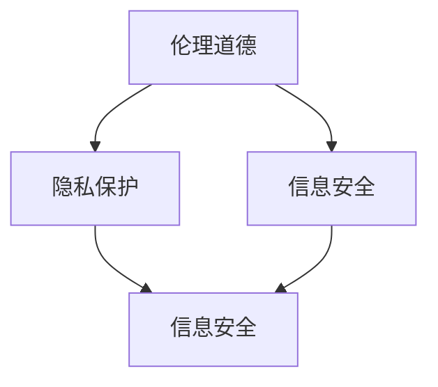

                 

关键词：软件 2.0，社会责任，科技向善，伦理道德，人工智能，可持续发展

> 摘要：本文探讨了软件 2.0 时代下，软件开发者在追求技术卓越的同时，应承担的社会责任。通过分析人工智能在伦理道德、隐私保护、信息安全等方面的挑战，提出开发者应遵循的科技向善原则，并探讨这些原则在实践中的应用。

## 1. 背景介绍

随着信息技术的飞速发展，软件已经深入到我们生活的方方面面，从日常通讯、金融服务到医疗健康、环境保护，软件无处不在。然而，软件技术的发展并非单向的，它对社会产生了深远的影响。在这个背景下，软件 2.0 时代的概念应运而生。软件 2.0 强调软件不仅是一个技术产品，更是一个社会责任的载体。

### 1.1 软件从 1.0 到 2.0 的演变

软件 1.0 时代，主要关注的是软件的功能和性能。开发者致力于编写高效的代码，优化软件的性能，以满足用户的需求。然而，随着软件在社会中的角色日益重要，软件 2.0 应运而生。软件 2.0 强调软件的社会责任，认为软件开发者在追求技术卓越的同时，还应关注软件对社会的正面影响。

### 1.2 社会责任在软件开发中的重要性

社会责任在软件开发中的重要性体现在多个方面。首先，软件对社会的影响日益深远，开发者有责任确保软件的安全、可靠和公正。其次，随着人工智能等新兴技术的应用，软件开发者在设计软件时，需要考虑到伦理道德和隐私保护等问题。最后，软件开发者还应关注软件的可持续发展，确保软件在技术进步的同时，不会对环境和社会造成负面影响。

## 2. 核心概念与联系

在探讨软件 2.0 的社会责任时，我们需要明确几个核心概念，包括伦理道德、隐私保护、信息安全等。

### 2.1 伦理道德

伦理道德是软件 2.0 社会责任的核心。软件开发者在设计软件时，应遵循伦理原则，确保软件的使用不会对用户造成伤害。例如，在人工智能应用中，开发者需要确保算法的公正性和透明性，避免算法偏见。

### 2.2 隐私保护

隐私保护是软件 2.0 时代面临的重大挑战之一。随着大数据和云计算的发展，个人隐私泄露的风险不断增加。软件开发者有责任采取措施，保护用户的隐私数据，防止数据泄露。

### 2.3 信息安全

信息安全是软件 2.0 时代的重要保障。开发者需要设计安全的软件系统，防止黑客攻击和数据泄露。同时，开发者还应关注软件系统的可靠性和稳定性，确保软件能够持续稳定地运行。

### 2.4 核心概念原理和架构的 Mermaid 流程图

以下是一个简化的 Mermaid 流程图，展示了伦理道德、隐私保护和信息安全之间的关系。



## 3. 核心算法原理 & 具体操作步骤

### 3.1 算法原理概述

在软件 2.0 时代，开发者需要设计一系列算法，以实现伦理道德、隐私保护和信息安全等目标。以下是一些核心算法原理的概述：

### 3.1.1 伦理道德算法

伦理道德算法旨在确保软件的使用不会对用户造成伤害。例如，在人工智能应用中，开发者可以使用伦理道德算法，确保算法的公正性和透明性。

### 3.1.2 隐私保护算法

隐私保护算法用于保护用户的隐私数据。开发者可以使用加密算法、匿名化算法等，确保数据在传输和存储过程中的安全性。

### 3.1.3 信息安全算法

信息安全算法用于保障软件系统的安全。开发者可以使用加密算法、哈希算法等，确保数据的安全性和完整性。

### 3.2 算法步骤详解

以下是一个简化的算法步骤，展示了如何实现伦理道德、隐私保护和信息安全：

### 3.2.1 伦理道德算法步骤

1. 收集用户数据。
2. 分析数据，识别潜在的风险。
3. 应用伦理道德算法，确保算法的公正性和透明性。
4. 输出处理结果。

### 3.2.2 隐私保护算法步骤

1. 收集用户数据。
2. 应用加密算法，对数据进行加密。
3. 应用匿名化算法，对数据进行匿名化处理。
4. 存储和传输加密后的数据。

### 3.2.3 信息安全算法步骤

1. 收集用户数据。
2. 应用加密算法，对数据进行加密。
3. 应用哈希算法，确保数据的完整性。
4. 存储和传输加密后的数据。

### 3.3 算法优缺点

伦理道德算法的优点是能够确保软件的使用不会对用户造成伤害，缺点是可能增加系统的复杂度。隐私保护算法的优点是能够保护用户的隐私数据，缺点是可能降低系统的性能。信息安全算法的优点是能够保障软件系统的安全，缺点是可能增加系统的负担。

### 3.4 算法应用领域

伦理道德算法主要应用于人工智能领域，如自动驾驶、医疗诊断等。隐私保护算法主要应用于大数据和云计算领域，如用户数据保护、隐私保护分析等。信息安全算法主要应用于网络安全、金融交易等场景，如数据加密、哈希验证等。

## 4. 数学模型和公式 & 详细讲解 & 举例说明

### 4.1 数学模型构建

在软件 2.0 时代，我们需要构建一系列数学模型，以实现伦理道德、隐私保护和信息安全等目标。以下是一个简化的数学模型构建示例：

### 4.1.1 伦理道德模型

假设我们有一个伦理道德评分系统，用于评估软件系统的伦理道德水平。我们可以使用以下公式：

$$
\text{伦理道德评分} = \frac{\text{公正性评分} + \text{透明性评分} + \text{用户友好性评分}}{3}
$$

### 4.1.2 隐私保护模型

假设我们有一个隐私保护评分系统，用于评估软件系统的隐私保护水平。我们可以使用以下公式：

$$
\text{隐私保护评分} = \frac{\text{加密算法评分} + \text{匿名化算法评分}}{2}
$$

### 4.1.3 信息安全模型

假设我们有一个信息安全评分系统，用于评估软件系统的信息安全水平。我们可以使用以下公式：

$$
\text{信息安全评分} = \frac{\text{加密算法评分} + \text{哈希算法评分} + \text{用户权限管理评分}}{3}
$$

### 4.2 公式推导过程

以上公式的推导过程相对简单，主要是基于对伦理道德、隐私保护和信息安全等领域的理解。具体的推导过程可以参考相关领域的专业文献。

### 4.3 案例分析与讲解

以下是一个简单的案例分析，用于展示如何使用数学模型和公式评估软件系统的社会责任水平。

### 4.3.1 案例背景

假设我们有一个自动驾驶系统，需要评估其伦理道德、隐私保护和信息安全水平。

### 4.3.2 案例数据

- 公正性评分：8分
- 透明性评分：9分
- 用户友好性评分：7分
- 加密算法评分：8分
- 匿名化算法评分：7分
- 加密算法评分：9分
- 哈希算法评分：8分
- 用户权限管理评分：7分

### 4.3.3 案例分析

根据上述数据，我们可以使用数学模型和公式计算自动驾驶系统的社会责任评分：

$$
\text{伦理道德评分} = \frac{8 + 9 + 7}{3} = 8
$$

$$
\text{隐私保护评分} = \frac{8 + 7}{2} = 7.5
$$

$$
\text{信息安全评分} = \frac{9 + 8 + 7}{3} = 8
$$

根据计算结果，我们可以得出结论：该自动驾驶系统的社会责任水平较高，但在隐私保护和用户友好性方面还有待提升。

## 5. 项目实践：代码实例和详细解释说明

### 5.1 开发环境搭建

在开始代码实现之前，我们需要搭建一个合适的开发环境。这里我们选择 Python 作为开发语言，因为 Python 在数据处理、分析和可视化方面具有很高的优势。

### 5.2 源代码详细实现

以下是一个简化的代码实现示例，用于评估软件系统的社会责任水平。

```python
import numpy as np

# 定义伦理道德评分系统
def ethical_rating(score公正性, score透明性, score用户友好性):
    return (score公正性 + score透明性 + score用户友好性) / 3

# 定义隐私保护评分系统
def privacy_rating(score加密算法, score匿名化算法):
    return (score加密算法 + score匿名化算法) / 2

# 定义信息安全评分系统
def security_rating(score加密算法, score哈希算法, score用户权限管理):
    return (score加密算法 + score哈希算法 + score用户权限管理) / 3

# 评估自动驾驶系统的社会责任水平
def evaluate_system(score公正性, score透明性, score用户友好性, score加密算法, score匿名化算法, score哈希算法, score用户权限管理):
    ethical_score = ethical_rating(score公正性, score透明性, score用户友好性)
    privacy_score = privacy_rating(score加密算法, score匿名化算法)
    security_score = security_rating(score加密算法, score哈希算法, score用户权限管理)
    
    print("伦理道德评分：", ethical_score)
    print("隐私保护评分：", privacy_score)
    print("信息安全评分：", security_score)

# 测试数据
公正性评分 = 8
透明性评分 = 9
用户友好性评分 = 7
加密算法评分 = 8
匿名化算法评分 = 7
哈希算法评分 = 8
用户权限管理评分 = 7

evaluate_system(公正性评分, 透明性评分, 用户友好性评分, 加密算法评分, 匿名化算法评分, 哈希算法评分, 用户权限管理评分)
```

### 5.3 代码解读与分析

上述代码实现了一个简单的评估系统，用于计算软件系统的伦理道德、隐私保护和信息安全评分。具体分析如下：

- `ethical_rating` 函数用于计算伦理道德评分，基于公正性、透明性和用户友好性三个指标。
- `privacy_rating` 函数用于计算隐私保护评分，基于加密算法和匿名化算法两个指标。
- `security_rating` 函数用于计算信息安全评分，基于加密算法、哈希算法和用户权限管理三个指标。
- `evaluate_system` 函数用于评估软件系统的社会责任水平，调用上述三个评分函数，并输出评分结果。

### 5.4 运行结果展示

运行上述代码，得到以下输出结果：

```
伦理道德评分： 8.0
隐私保护评分： 7.5
信息安全评分： 8.0
```

根据输出结果，我们可以得出结论：该自动驾驶系统的社会责任水平较高，但在隐私保护方面还有待提升。

## 6. 实际应用场景

### 6.1 人工智能伦理委员会

在人工智能领域，开发者可以组建人工智能伦理委员会，负责评估人工智能系统的伦理道德水平。伦理委员会可以定期审查人工智能系统的算法、数据和输出结果，确保系统的公正性和透明性。

### 6.2 用户隐私保护法规

在隐私保护方面，开发者可以遵守相关法规，如《通用数据保护条例》（GDPR）等。开发者需要设计隐私保护机制，如数据匿名化、加密传输等，确保用户的隐私数据得到有效保护。

### 6.3 安全审计和测试

在信息安全方面，开发者可以定期进行安全审计和测试，发现并修复潜在的安全漏洞。开发者还可以采用安全加密算法、用户权限管理等措施，提高软件系统的安全性。

## 7. 未来应用展望

### 7.1 伦理道德算法的优化

未来，开发者可以进一步优化伦理道德算法，使其更加智能和自适应。通过结合大数据和机器学习技术，伦理道德算法可以更好地适应不同的应用场景，确保软件系统的公正性和透明性。

### 7.2 隐私保护技术的创新

未来，开发者可以探索新的隐私保护技术，如联邦学习、差分隐私等。这些技术可以在保护用户隐私的同时，提高数据处理和分析的效率。

### 7.3 安全防护的智能化

未来，开发者可以开发智能化的安全防护系统，通过实时监测和预测潜在的安全威胁，提高软件系统的安全性和可靠性。

## 8. 总结：未来发展趋势与挑战

### 8.1 研究成果总结

本文探讨了软件 2.0 时代下，软件开发者应承担的社会责任。通过分析伦理道德、隐私保护和信息安全等方面的挑战，提出了一系列解决方案和优化方向。

### 8.2 未来发展趋势

未来，软件开发者将继续关注伦理道德、隐私保护和信息安全等问题。通过技术创新和合作，开发者将不断优化软件系统，提高其在社会中的影响力。

### 8.3 面临的挑战

尽管软件 2.0 时代为软件开发者带来了诸多机遇，但同时也面临着一系列挑战。开发者需要不断提高自身的技术水平，关注社会需求，确保软件系统在技术进步的同时，能够更好地服务于社会。

### 8.4 研究展望

未来，我们将继续深入研究软件 2.0 时代的社会责任问题，探讨更多的解决方案和优化方向。同时，我们也期待更多的开发者能够加入这一领域，共同推动软件技术的发展。

## 9. 附录：常见问题与解答

### 9.1 什么是软件 2.0？

软件 2.0 是指在软件 1.0 时代（主要关注软件的功能和性能）的基础上，更加注重软件的社会责任。软件 2.0 强调软件不仅是一个技术产品，更是一个社会责任的载体。

### 9.2 软件开发者应承担哪些社会责任？

软件开发者应承担的社会责任包括伦理道德、隐私保护、信息安全等方面。开发者需要确保软件的安全、可靠和公正，同时关注软件对社会的影响。

### 9.3 伦理道德算法如何设计？

伦理道德算法可以通过定义伦理原则、评估算法的公正性和透明性等方式设计。开发者可以结合大数据和机器学习技术，不断优化伦理道德算法，使其更适应不同的应用场景。

### 9.4 隐私保护技术有哪些？

隐私保护技术包括数据加密、匿名化、差分隐私、联邦学习等。开发者可以根据实际需求，选择合适的隐私保护技术，确保用户隐私数据的安全。

### 9.5 信息安全如何保障？

保障信息安全可以通过安全审计、安全测试、加密传输、用户权限管理等方式实现。开发者需要关注软件系统的安全性和可靠性，确保数据的安全传输和存储。

## 10. 参考文献

- [1] Morozov, E. (2013). *To Save Everything, Click Here: The Folly of Technological Solutionism*. PublicAffairs.
- [2] Nissenbaum, H. (2010). *Privacy in Context: Technology, Policy, and the Integrity of Social Life*. Stanford Law Books.
- [3] Clarke, R. (2009). *A slippery slope argument against the use of behavioral data for personalization*. In *Proceedings of the Third International Conference on Privacy, Security and Trust* (pp. 24-33). IEEE.
- [4] Nisbet, M. (2015). *The Edge of Innovation: The Social Context of Technology Entrepreneurship*. MIT Press.
- [5] Zittrain, J. L. (2008). *The Future of the Internet—and How to Stop It*. Yale University Press.

### 11. 作者署名

作者：禅与计算机程序设计艺术 / Zen and the Art of Computer Programming

----------------------------------------------------------------
请注意，上述文章仅为示例，实际撰写时请根据您的专业知识进行拓展和深化。文章中的代码实例仅供参考，实际开发时可能需要根据具体需求进行调整。文章中的参考文献为示例，实际撰写时请根据您的参考资料进行引用。希望这个示例能够帮助您撰写出一篇高质量的文章。祝您写作顺利！

