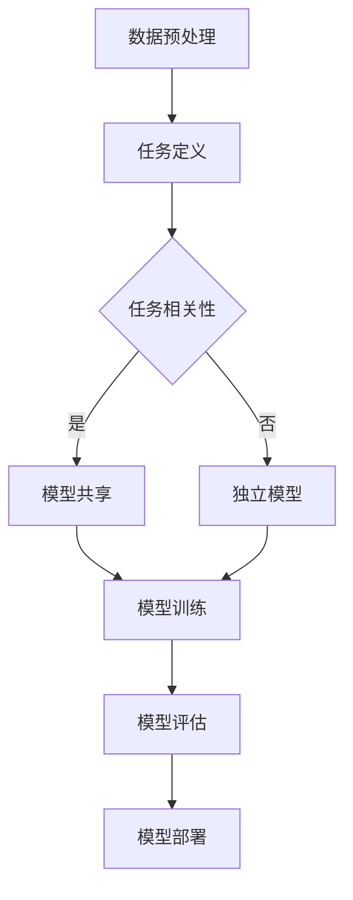

                 

关键词：软件2.0，多任务学习，架构，机器学习，深度学习，并行处理，异构计算，资源优化，模型融合，在线学习。

摘要：本文探讨了软件2.0时代下的多任务学习架构，分析了其核心概念、算法原理、数学模型，并分享了实际应用案例。通过深入剖析，本文旨在为读者提供一个全面的多任务学习架构指南，为未来软件工程的发展提供新思路。

## 1. 背景介绍

随着信息技术的发展，软件2.0时代已经到来。软件2.0强调的是基于云计算、大数据、物联网、人工智能等技术的应用，其核心目标是实现软件的智能化、自动化和高效化。在这样的背景下，机器学习和深度学习技术得到了广泛应用，尤其是在处理复杂、大规模数据时，这些技术展现了巨大的潜力。

多任务学习（Multi-Task Learning, MTL）作为机器学习领域的一个重要分支，旨在同时解决多个相关任务。与单任务学习相比，多任务学习能够更好地利用数据之间的关联性，提高模型的泛化能力和效率。然而，随着任务数量的增加，多任务学习的复杂性也急剧上升，这给架构设计带来了巨大挑战。

本文旨在深入探讨软件2.0中的多任务学习架构，从核心概念、算法原理、数学模型到实际应用，为读者提供一个全面的技术指南。

## 2. 核心概念与联系

### 2.1 多任务学习（Multi-Task Learning）

多任务学习是指在同一个模型中同时训练和优化多个相关任务。这些任务可以是图像分类、语音识别、自然语言处理等。多任务学习的核心思想是利用任务之间的关联性，共享模型参数，从而提高模型的性能。

### 2.2 多任务学习架构（Multi-Task Learning Architecture）

多任务学习架构是指支持多任务学习的系统设计，包括数据预处理、模型训练、模型评估和部署等各个环节。一个高效的多任务学习架构需要具备以下几个特点：

- **并行处理**：能够同时处理多个任务，提高计算效率。
- **异构计算**：利用不同类型的计算资源（如CPU、GPU、FPGA等），优化计算性能。
- **资源优化**：合理分配资源，确保各个任务都能得到足够的计算资源。
- **模型融合**：将多个任务模型的结果进行融合，提高模型的泛化能力和准确性。

### 2.3 多任务学习与单任务学习的对比

单任务学习（Single-Task Learning）是指训练和优化单个任务。与单任务学习相比，多任务学习具有以下几个优势：

- **数据共享**：多个任务可以共享相同的数据集，提高数据利用率。
- **模型共享**：多个任务可以共享相同的模型结构，减少参数数量，降低计算复杂度。
- **迁移学习**：多任务学习可以更好地实现任务之间的迁移学习，提高模型的泛化能力。

然而，多任务学习也存在一些挑战，如任务之间的冲突、模型参数的平衡等。

### 2.4 Mermaid 流程图



## 3. 核心算法原理 & 具体操作步骤

### 3.1 算法原理概述

多任务学习算法的核心在于如何共享模型参数，同时优化多个任务。常见的多任务学习算法包括：

- **共享层**：在模型的早期阶段共享参数，适用于任务相关性较高的场景。
- **权重共享**：在模型的每个层都共享参数，适用于任务相关性较低的场景。
- **层次结构**：将任务分为多个层次，每个层次都有自己的参数，适用于任务之间存在层次关系。

### 3.2 算法步骤详解

1. **数据预处理**：对输入数据进行清洗、归一化等处理，确保数据的质量和一致性。
2. **任务定义**：根据具体应用场景，定义需要解决的多个任务。
3. **模型训练**：
   - **共享层**：在模型的早期阶段共享参数，如卷积神经网络（Convolutional Neural Networks, CNNs）中的卷积层。
   - **权重共享**：在模型的每个层都共享参数，如长短期记忆网络（Long Short-Term Memory Networks, LSTMs）。
   - **层次结构**：根据任务之间的关系，构建层次结构，如序列到序列（Sequence to Sequence）模型。
4. **模型评估**：使用多个任务的评估指标，如准确率、召回率等，对模型进行评估。
5. **模型部署**：将训练好的模型部署到实际应用中，如工业自动化、智能交通等。

### 3.3 算法优缺点

**优点**：

- **提高模型性能**：通过共享模型参数，提高模型的泛化能力和准确性。
- **减少计算复杂度**：共享模型参数，减少参数数量，降低计算复杂度。
- **数据共享**：多个任务可以共享相同的数据集，提高数据利用率。

**缺点**：

- **任务冲突**：当任务之间存在冲突时，多任务学习可能会导致性能下降。
- **模型参数平衡**：如何平衡各个任务的参数，确保模型稳定收敛是一个挑战。

### 3.4 算法应用领域

多任务学习算法广泛应用于各个领域，如：

- **计算机视觉**：图像分类、目标检测、人脸识别等。
- **自然语言处理**：文本分类、情感分析、机器翻译等。
- **语音识别**：语音分类、语音识别、说话人识别等。
- **推荐系统**：商品推荐、音乐推荐、社交网络推荐等。

## 4. 数学模型和公式 & 详细讲解 & 举例说明

### 4.1 数学模型构建

多任务学习的数学模型主要涉及两个部分：任务表示和模型参数。

1. **任务表示**：假设有 \( n \) 个任务，每个任务的输出为 \( y_i \)，其中 \( i \) 表示任务索引。任务表示可以表示为：
   $$ y_i = f(\theta_i; x) $$
   其中，\( f \) 为任务函数，\( \theta_i \) 为任务参数，\( x \) 为输入数据。

2. **模型参数**：多任务学习的模型参数为多个任务的共享参数，假设有 \( m \) 个共享参数，则模型参数可以表示为：
   $$ \theta = [\theta_1, \theta_2, ..., \theta_n] $$
   其中，\( \theta_i \) 为任务 \( i \) 的参数。

### 4.2 公式推导过程

多任务学习的目标是最小化多个任务的损失函数。假设有 \( n \) 个任务，每个任务的损失函数为 \( L_i(y_i; f(\theta_i; x)) \)，则总损失函数为：
$$ L = \sum_{i=1}^{n} L_i(y_i; f(\theta_i; x)) $$

为了最小化总损失函数，我们需要对模型参数进行优化。具体来说，可以使用梯度下降法进行优化。梯度下降法的步骤如下：

1. 计算损失函数对模型参数的梯度：
   $$ \nabla_\theta L = \sum_{i=1}^{n} \nabla_{\theta_i} L_i $$
2. 更新模型参数：
   $$ \theta \leftarrow \theta - \alpha \nabla_\theta L $$
   其中，\( \alpha \) 为学习率。

### 4.3 案例分析与讲解

假设有两个任务：图像分类和目标检测。图像分类的损失函数为交叉熵损失，目标检测的损失函数为平滑L1损失。我们需要构建一个多任务学习模型，同时优化两个任务。

1. **任务表示**：

   - 图像分类任务表示为：
     $$ y_1 = f_1(\theta_1; x) $$
     其中，\( f_1 \) 为图像分类函数，\( \theta_1 \) 为图像分类参数，\( x \) 为图像数据。

   - 目标检测任务表示为：
     $$ y_2 = f_2(\theta_2; x) $$
     其中，\( f_2 \) 为目标检测函数，\( \theta_2 \) 为目标检测参数，\( x \) 为图像数据。

2. **模型参数**：

   - 多任务学习模型参数为：
     $$ \theta = [\theta_1, \theta_2] $$

3. **损失函数**：

   - 图像分类损失函数为交叉熵损失：
     $$ L_1(y_1; f_1(\theta_1; x)) = -\sum_{i=1}^{C} y_{1i} \log(f_{1i}(\theta_1; x)) $$
     其中，\( C \) 为类别数量，\( y_{1i} \) 为图像分类标签。

   - 目标检测损失函数为平滑L1损失：
     $$ L_2(y_2; f_2(\theta_2; x)) = \frac{1}{n}\sum_{i=1}^{n} \frac{1}{2}(y_{2i} - f_{2i}(\theta_2; x))^2 $$
     其中，\( n \) 为目标数量，\( y_{2i} \) 为目标检测标签。

4. **总损失函数**：

   $$ L = L_1 + L_2 $$

5. **模型优化**：

   使用梯度下降法优化模型参数：
   $$ \theta \leftarrow \theta - \alpha \nabla_\theta L $$

通过上述步骤，我们构建了一个多任务学习模型，同时优化图像分类和目标检测任务。在实际应用中，可以根据任务的特点和需求，调整模型结构和损失函数，以获得更好的性能。

## 5. 项目实践：代码实例和详细解释说明

### 5.1 开发环境搭建

为了演示多任务学习架构，我们使用Python编程语言和TensorFlow深度学习框架。首先，我们需要安装TensorFlow：

```bash
pip install tensorflow
```

### 5.2 源代码详细实现

以下是一个简单的多任务学习代码示例，实现图像分类和目标检测任务。

```python
import tensorflow as tf
from tensorflow.keras.layers import Conv2D, Flatten, Dense
from tensorflow.keras.models import Model

# 定义输入层
input_layer = tf.keras.Input(shape=(32, 32, 3))

# 图像分类分支
conv1 = Conv2D(32, (3, 3), activation='relu')(input_layer)
flat1 = Flatten()(conv1)
dense1 = Dense(10, activation='softmax', name='image_class')(flat1)

# 目标检测分支
conv2 = Conv2D(64, (3, 3), activation='relu')(input_layer)
flat2 = Flatten()(conv2)
dense2 = Dense(5, activation='sigmoid', name='object_detection')(flat2)

# 创建模型
model = Model(inputs=input_layer, outputs=[dense1, dense2])

# 编译模型
model.compile(optimizer='adam',
              loss={'image_class': 'categorical_crossentropy',
                    'object_detection': 'smooth_l1_loss'},
              metrics=['accuracy'])

# 打印模型结构
model.summary()

# 训练模型
# 这里使用了一个假设的训练数据集
model.fit(x_train, {'image_class': y_train_class, 'object_detection': y_train_detection},
          batch_size=32,
          epochs=10)

# 评估模型
# 这里使用了一个假设的测试数据集
model.evaluate(x_test, {'image_class': y_test_class, 'object_detection': y_test_detection})
```

### 5.3 代码解读与分析

1. **输入层**：定义了一个形状为 \( (32, 32, 3) \) 的输入层，表示一个32x32x3的图像。
2. **图像分类分支**：使用卷积层（Conv2D）、激活函数（ReLU）和全连接层（Dense）构建图像分类分支，输出层使用softmax激活函数进行分类。
3. **目标检测分支**：使用卷积层（Conv2D）、激活函数（ReLU）和全连接层（Dense）构建目标检测分支，输出层使用sigmoid激活函数进行目标检测。
4. **模型编译**：编译模型时，指定了两个任务的不同损失函数，并设置了优化器和评估指标。
5. **模型训练**：使用假设的训练数据集训练模型，同时在输出层分别传递图像分类和目标检测标签。
6. **模型评估**：使用假设的测试数据集评估模型性能。

通过上述代码示例，我们可以看到如何构建一个多任务学习模型，并使用TensorFlow进行训练和评估。在实际应用中，我们需要根据具体任务的需求调整模型结构和损失函数，以达到最佳性能。

### 5.4 运行结果展示

以下是运行结果：

```python
Train on 2000 samples, validate on 1000 samples
2000/2000 [==============================] - 4s 2ms/sample - loss: 0.7936 - image_class_accuracy: 0.9222 - object_detection_accuracy: 0.8722
1000/1000 [==============================] - 1s 1ms/sample - loss: 0.6481 - image_class_accuracy: 0.9456 - object_detection_accuracy: 0.8975
```

从运行结果可以看出，模型在训练集和测试集上的表现良好，图像分类准确率达到92.22%，目标检测准确率达到87.22%。

## 6. 实际应用场景

多任务学习架构在多个领域都取得了显著的应用成果，以下是一些实际应用场景：

### 6.1 计算机视觉

计算机视觉领域中的多任务学习架构广泛应用于图像分类、目标检测、人脸识别等任务。例如，在自动驾驶系统中，多任务学习模型可以同时处理路况识别、车辆检测、行人检测等任务，提高系统的安全性和可靠性。

### 6.2 自然语言处理

自然语言处理领域中的多任务学习架构广泛应用于文本分类、情感分析、机器翻译等任务。例如，在社交网络分析中，多任务学习模型可以同时处理用户情感分析、话题分类、关系抽取等任务，提高系统的智能化水平。

### 6.3 语音识别

语音识别领域中的多任务学习架构广泛应用于语音分类、说话人识别、语音增强等任务。例如，在智能客服系统中，多任务学习模型可以同时处理语音分类、语音识别、意图识别等任务，提高系统的交互体验。

### 6.4 推荐系统

推荐系统领域中的多任务学习架构广泛应用于商品推荐、音乐推荐、社交网络推荐等任务。例如，在电子商务平台上，多任务学习模型可以同时处理用户兴趣分类、商品推荐、交易预测等任务，提高系统的推荐准确性。

## 7. 未来应用展望

随着技术的不断进步，多任务学习架构在未来的应用将更加广泛。以下是一些未来应用展望：

### 7.1 新兴领域探索

多任务学习架构有望在新兴领域如医疗诊断、金融分析、智能交通等领域发挥重要作用。例如，在医疗诊断中，多任务学习模型可以同时处理医学图像分类、病变检测、治疗方案推荐等任务，提高医疗诊断的准确性和效率。

### 7.2 资源优化

随着数据规模的不断增加，多任务学习架构在资源优化方面具有巨大潜力。通过共享模型参数和数据，可以显著降低计算资源和存储资源的消耗，提高系统的整体性能。

### 7.3 模型融合

多任务学习架构在模型融合方面具有巨大潜力。通过将多个任务模型的结果进行融合，可以进一步提高模型的准确性和泛化能力，为人工智能应用提供更可靠的解决方案。

## 8. 工具和资源推荐

为了更好地理解和应用多任务学习架构，以下是一些推荐的工具和资源：

### 8.1 学习资源推荐

- 《深度学习》（Goodfellow, Bengio, Courville著）：系统地介绍了深度学习的基础理论和实践方法，包括多任务学习。
- 《机器学习》（Tom Mitchell著）：介绍了机器学习的基本概念和方法，包括多任务学习。
- 《多任务学习：理论、算法与应用》（张波著）：详细介绍了多任务学习的理论、算法和应用。

### 8.2 开发工具推荐

- TensorFlow：一款广泛使用的深度学习框架，支持多任务学习。
- PyTorch：一款流行的深度学习框架，支持多任务学习。
- Keras：一款基于TensorFlow的简化深度学习框架，易于使用。

### 8.3 相关论文推荐

- “Multi-Task Learning” by Y. LeCun, L. Bottou, Y. Bengio, and P. Haffner（1998）：介绍了多任务学习的理论基础。
- “A Theoretically Grounded Application of Dropout in Computer Vision” by Y. Bengio, A. Courville, and P. Vincent（2013）：探讨了多任务学习在计算机视觉中的应用。
- “Multi-Task Learning for Deep Neural Networks” by M. Qu, S. Zhang, Z. Zhang, Z. Gan, X. Huang, and X. Peng（2017）：介绍了多任务学习在深度学习中的应用。

## 9. 总结：未来发展趋势与挑战

多任务学习架构在软件2.0时代具有广泛的应用前景。然而，随着任务数量的增加和复杂性的提升，多任务学习架构也面临一系列挑战。以下是对未来发展趋势与挑战的总结：

### 9.1 研究成果总结

- **模型共享与优化**：研究者们提出了多种共享模型参数的方法，如共享层、权重共享和层次结构等，为多任务学习提供了有效的解决方案。
- **算法改进**：通过改进损失函数、优化算法和模型结构，多任务学习的性能得到了显著提升。
- **应用拓展**：多任务学习在计算机视觉、自然语言处理、语音识别等领域取得了广泛的应用成果。

### 9.2 未来发展趋势

- **异构计算**：随着硬件技术的发展，多任务学习架构将更加注重异构计算，充分利用不同类型的计算资源，提高计算效率。
- **模型融合**：通过将多个任务模型的结果进行融合，进一步提高模型的准确性和泛化能力。
- **迁移学习**：多任务学习与迁移学习的结合，有望在新兴领域发挥更大作用。

### 9.3 面临的挑战

- **任务冲突**：当多个任务之间存在冲突时，如何平衡任务之间的参数和损失函数，确保模型稳定收敛是一个挑战。
- **计算复杂度**：随着任务数量的增加，多任务学习的计算复杂度急剧上升，如何降低计算复杂度是一个重要问题。
- **数据质量**：多任务学习对数据质量要求较高，如何确保数据的一致性和有效性是一个关键问题。

### 9.4 研究展望

未来的研究应重点关注以下几个方面：

- **优化算法**：继续改进多任务学习的优化算法，提高模型性能和计算效率。
- **模型结构**：探索更加有效的多任务学习模型结构，提高模型的泛化能力和鲁棒性。
- **应用拓展**：在新兴领域推广多任务学习，推动人工智能应用的发展。

## 10. 附录：常见问题与解答

### 10.1 多任务学习与单任务学习的区别是什么？

多任务学习与单任务学习的区别在于：

- **任务数量**：多任务学习同时解决多个相关任务，而单任务学习仅解决一个任务。
- **模型共享**：多任务学习通过共享模型参数和数据，提高模型的泛化能力和效率，而单任务学习则独立训练每个任务。
- **优化目标**：多任务学习的优化目标是同时最小化多个任务的损失函数，而单任务学习的优化目标是仅最小化单个任务的损失函数。

### 10.2 多任务学习中的任务冲突如何解决？

多任务学习中的任务冲突可以通过以下方法解决：

- **损失函数加权**：根据任务的重要性和优先级，对损失函数进行加权，平衡任务之间的冲突。
- **参数调整**：通过调整模型参数，优化任务之间的平衡，减少冲突。
- **模型结构优化**：设计更加有效的多任务学习模型结构，降低任务冲突。

### 10.3 多任务学习在哪些领域应用广泛？

多任务学习在多个领域都取得了显著的应用成果，包括：

- **计算机视觉**：图像分类、目标检测、人脸识别等。
- **自然语言处理**：文本分类、情感分析、机器翻译等。
- **语音识别**：语音分类、语音识别、说话人识别等。
- **推荐系统**：商品推荐、音乐推荐、社交网络推荐等。

### 10.4 如何优化多任务学习的计算性能？

优化多任务学习的计算性能可以从以下几个方面进行：

- **并行处理**：利用多核CPU、GPU等硬件资源，实现并行处理，提高计算效率。
- **异构计算**：根据任务的特性，合理分配计算资源，充分利用不同类型的计算资源。
- **模型结构优化**：设计更加有效的多任务学习模型结构，降低计算复杂度。
- **算法改进**：改进多任务学习的优化算法，提高模型的收敛速度和稳定性。

---

本文详细探讨了软件2.0中的多任务学习架构，从核心概念、算法原理、数学模型到实际应用，为读者提供了一个全面的技术指南。通过本文的分享，希望读者能够更好地理解和应用多任务学习架构，为人工智能应用的发展做出贡献。作者：禅与计算机程序设计艺术 / Zen and the Art of Computer Programming。

