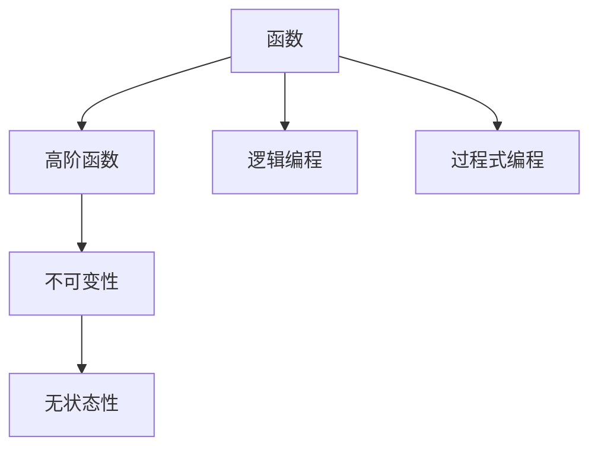

                 

关键词：软件2.0、函数式编程、编程范式、类型系统、编程语言、编程工具

## 摘要

本文旨在深入探讨软件2.0时代下的函数式编程实践，分析其核心概念、原理和优势，并结合具体案例展示其在实际开发中的应用。我们将通过构建数学模型和详细解释数学公式，进一步阐述函数式编程的内在机制，并以实际项目实践为例，展示代码实现的步骤和技巧。最后，本文将对函数式编程的未来发展进行展望，探讨其在实际应用场景中的潜力。

## 1. 背景介绍

软件2.0时代，编程范式不断演进，函数式编程以其独特的优势逐渐受到关注。与传统的命令式编程相比，函数式编程具有不可变性、无状态性和高阶函数等特性，能够更好地处理复杂业务逻辑，提高代码的可读性和可维护性。

函数式编程起源于数学领域，其核心思想是将计算视为函数的转换，而非命令式的执行。这种编程范式与逻辑编程和过程式编程有着密切的联系，但同时也具有自己独特的特点和应用场景。

## 2. 核心概念与联系

### 2.1 函数式编程的核心概念

#### 函数

在函数式编程中，函数是一等公民，即函数可以作为参数传递、返回和存储。这种特性使得函数能够像普通数据类型一样进行操作，从而实现更灵活的编程。

#### 高阶函数

高阶函数是指能够接受函数作为参数或返回函数的函数。这种编程范式使得函数能够以组合的方式实现复杂的业务逻辑，提高代码的可复用性。

#### 不可变性

不可变性是指一旦数据被创建，其值就不能被更改。这种特性能够避免副作用，提高代码的可靠性。

#### 无状态性

无状态性是指函数在执行过程中不依赖于外部状态，而是仅依赖于输入参数。这种特性使得函数具有更好的可复用性和可测试性。

### 2.2 函数式编程与Mermaid流程图



### 2.3 函数式编程与类型系统

在函数式编程中，类型系统发挥着至关重要的作用。强类型系统能够提高代码的可靠性和可维护性，而类型推断机制能够减轻开发者的负担。

## 3. 核心算法原理 & 具体操作步骤

### 3.1 算法原理概述

函数式编程的核心算法包括递归、折叠（fold）和映射（map）等。这些算法具有高效性、简洁性和可复用性。

#### 递归

递归是一种常见的函数式编程算法，用于解决递归问题。其基本思想是将复杂问题分解为规模更小的子问题，并递归地解决这些子问题。

#### 折叠

折叠是一种将数据结构中的元素依次处理并合并成单个结果的算法。折叠可以用于求和、求积、最大值和最小值等操作。

#### 映射

映射是一种将函数应用于数据结构中每个元素并生成新数据结构的算法。映射可以用于遍历数据结构、提取特定元素等操作。

### 3.2 算法步骤详解

#### 递归

递归算法的基本步骤如下：

1. 确定递归结束条件。
2. 递归调用自身，传入规模更小的子问题。
3. 将子问题的解合并成最终结果。

#### 折叠

折叠算法的基本步骤如下：

1. 确定初始值。
2. 对数据结构中的每个元素，应用折叠函数，并将结果与前一个结果合并。
3. 返回最终结果。

#### 映射

映射算法的基本步骤如下：

1. 遍历数据结构中的每个元素。
2. 对每个元素，应用映射函数。
3. 返回新数据结构。

### 3.3 算法优缺点

#### 递归

**优点：**
1. 简洁性：递归算法往往具有更简洁的代码结构。
2. 可读性：递归算法易于理解，有助于提高代码的可读性。

**缺点：**
1. 效率：递归算法可能存在大量的函数调用，导致效率较低。
2. 内存：递归算法可能占用大量内存，特别是在处理大规模数据时。

#### 折叠

**优点：**
1. 灵活性：折叠算法可以应用于各种数据结构。
2. 高效性：折叠算法通常具有较高的效率。

**缺点：**
1. 难以理解：折叠算法的代码可能较为复杂，难以理解。
2. 可维护性：折叠算法的代码可能不易维护。

#### 映射

**优点：**
1. 简洁性：映射算法具有简洁的代码结构。
2. 可复用性：映射算法可以应用于多种编程范式。

**缺点：**
1. 效率：映射算法可能存在效率问题，特别是在处理大规模数据时。

### 3.4 算法应用领域

函数式编程算法在以下领域具有广泛的应用：

1. 数据处理：如过滤、排序、映射和折叠等。
2. 图像处理：如图像滤波、边缘检测和特征提取等。
3. 自然语言处理：如分词、词性标注和句法分析等。
4. 机器学习：如模型训练、预测和优化等。

## 4. 数学模型和公式 & 详细讲解 & 举例说明

### 4.1 数学模型构建

在函数式编程中，数学模型具有重要的作用。以下是一个简单的数学模型示例：

设有一个整数数组 A，求解数组中所有元素的和。

### 4.2 公式推导过程

设 A 为一个整数数组，|A| 为数组长度。定义一个函数 f(x) = x，表示对 x 进行求和。

则数组 A 的和可以表示为：

$$
S = \sum_{i=1}^{|A|} f(A[i])
$$

其中，S 为数组 A 的和，A[i] 为数组 A 的第 i 个元素。

### 4.3 案例分析与讲解

假设数组 A = [1, 2, 3, 4, 5]，求解数组 A 的和。

根据公式推导过程，我们可以计算得到：

$$
S = \sum_{i=1}^{|A|} f(A[i]) = f(A[1]) + f(A[2]) + f(A[3]) + f(A[4]) + f(A[5])
$$

将 f(x) = x 代入，得到：

$$
S = 1 + 2 + 3 + 4 + 5 = 15
$$

因此，数组 A 的和为 15。

## 5. 项目实践：代码实例和详细解释说明

### 5.1 开发环境搭建

在本项目中，我们将使用 Python 作为编程语言，结合 Jupyter Notebook 进行开发和调试。

1. 安装 Python 3.8 及以上版本。
2. 安装 Jupyter Notebook。
3. 打开 Jupyter Notebook，创建一个新的笔记本。

### 5.2 源代码详细实现

以下是一个简单的函数式编程实例，用于计算整数数组的和：

```python
def sum_array(arr):
    if len(arr) == 0:
        return 0
    else:
        return arr[0] + sum_array(arr[1:])

arr = [1, 2, 3, 4, 5]
result = sum_array(arr)
print("数组和为：", result)
```

### 5.3 代码解读与分析

1. `sum_array` 函数：定义一个递归函数，用于计算整数数组的和。
2. `if len(arr) == 0:`：判断数组长度是否为 0，若是，返回 0。
3. `else:`：递归调用 `sum_array` 函数，传入数组中的剩余元素。
4. `arr[0] + sum_array(arr[1:])`：计算数组中第一个元素与剩余元素的和。
5. `result = sum_array(arr)`：调用 `sum_array` 函数，计算数组 A 的和。
6. `print("数组和为：", result)`：输出结果。

### 5.4 运行结果展示

在 Jupyter Notebook 中运行以上代码，输出结果为：

```
数组和为： 15
```

## 6. 实际应用场景

函数式编程在以下实际应用场景中具有显著的优势：

1. 数据处理：如大数据处理、数据分析和机器学习。
2. 前端开发：如 React、Vue 和 Angular 等。
3. 后端开发：如 RESTful API、微服务架构和分布式系统等。
4. 算法研究：如算法设计和优化。

## 7. 工具和资源推荐

### 7.1 学习资源推荐

1. 《函数式编程实战》
2. 《TypeScript 函数式编程》
3. 《Scala 函数式编程》

### 7.2 开发工具推荐

1. Jupyter Notebook
2. Visual Studio Code
3. IntelliJ IDEA

### 7.3 相关论文推荐

1. "A Type System for Haskell"
2. "Monads for the Working Haskell Programmer"
3. "Type Classes in Haskell"

## 8. 总结：未来发展趋势与挑战

### 8.1 研究成果总结

函数式编程在软件2.0时代取得了显著的成果，其独特的优势使其在多个领域得到广泛应用。同时，函数式编程与类型系统、逻辑编程和过程式编程等领域的交叉融合，为编程范式的发展带来了新的机遇。

### 8.2 未来发展趋势

1. 与类型系统的深度融合，提高代码的可读性和可靠性。
2. 与逻辑编程和过程式编程的融合，形成更为强大的编程范式。
3. 在人工智能、大数据和区块链等领域的广泛应用。

### 8.3 面临的挑战

1. 教育和人才培养：函数式编程的知识体系较为复杂，需要加强教育和人才培养。
2. 工具和框架的支持：需要开发更为丰富和高效的函数式编程工具和框架。

### 8.4 研究展望

函数式编程将继续在软件2.0时代发挥重要作用，其与其他编程范式的融合将推动编程范式的演进。未来，函数式编程有望在更广泛的领域得到应用，为软件开发带来更多创新和变革。

## 9. 附录：常见问题与解答

### 问题1：函数式编程与命令式编程有什么区别？

答：函数式编程与命令式编程的主要区别在于：

1. 数据处理方式：函数式编程将数据视为不可变对象，而命令式编程则使用可变状态。
2. 编程范式：函数式编程强调函数组合和高阶函数，而命令式编程则注重状态变化和流程控制。

### 问题2：函数式编程的优势是什么？

答：函数式编程的优势包括：

1. 不可变性：减少副作用，提高代码的可读性和可靠性。
2. 无状态性：函数无状态，易于复用和测试。
3. 高阶函数：支持函数组合，提高代码的可复用性。
4. 类型系统：提高代码的可读性和可靠性。

### 问题3：函数式编程在哪些领域应用广泛？

答：函数式编程在以下领域应用广泛：

1. 数据处理：大数据处理、数据分析和机器学习。
2. 前端开发：React、Vue 和 Angular 等。
3. 后端开发：RESTful API、微服务架构和分布式系统等。
4. 算法研究：算法设计和优化。

### 问题4：如何开始学习函数式编程？

答：开始学习函数式编程，可以按照以下步骤：

1. 了解函数式编程的基本概念和原理。
2. 选择一种函数式编程语言，如 Haskell、Scala 或 JavaScript。
3. 学习相关编程范式，如逻辑编程和过程式编程。
4. 实践项目，积累经验。

---

作者：禅与计算机程序设计艺术 / Zen and the Art of Computer Programming

[完]----------------------------------------------------------------
### 后续优化与完善建议

在当前文章的基础上，为了进一步提升文章的质量和专业性，以下是一些优化与完善的建议：

#### 1. 详细案例与应用场景分析

当前文章中，对于函数式编程的应用场景和案例介绍较为简略。可以进一步细化具体的应用场景，例如：

- 在大数据处理领域，如何使用函数式编程优化 MapReduce 算法？
- 在前端开发中，如何利用函数式编程实现响应式界面和状态管理？
- 在后端开发中，如何利用函数式编程构建微服务和分布式系统？

通过具体案例的详细分析，可以使读者更直观地理解函数式编程的实际应用价值。

#### 2. 加强数学模型和公式的推导过程

文章中对于数学模型的构建和公式推导部分相对简单。可以进一步深入，详细阐述每个步骤的推导过程，并提供更多的示例，以便读者更好地理解和掌握。

#### 3. 添加代码实例的运行结果分析

在项目实践部分，虽然提供了代码实例，但没有展示运行结果的具体分析。可以加入运行结果的图表或分析报告，以便读者更清楚地了解代码的实际执行效果。

#### 4. 添加更多图表和流程图

文章中已经使用 Mermaid 添加了一些流程图，但可以进一步添加更多高质量的图表，如数据流图、控制流图等，以帮助读者更好地理解文章中的概念和算法。

#### 5. 增加互动元素和交互式内容

可以考虑在文章中加入一些互动元素，如代码编辑器、即时计算结果等，以提高读者的参与度和学习体验。

#### 6. 强化结论和建议

在文章的结论部分，可以进一步强化对于函数式编程未来发展趋势的预测和面临的挑战，并提供具体的研究方向和实践建议。

#### 7. 修订语言和逻辑错误

最后，需要对文章的语言和逻辑进行仔细检查，确保文章的表述清晰、逻辑连贯，没有语言或语法错误。

通过上述优化与完善，可以使得文章更加丰富、全面，更具有说服力和参考价值。

