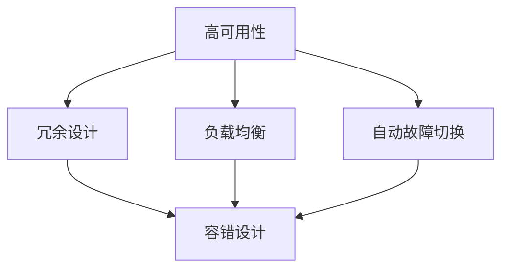

                 

关键词：软件2.0，高可用性，容错设计，系统架构，云计算，分布式系统，持续集成，持续交付

摘要：随着软件系统的复杂性不断增加，高可用性和容错设计成为了确保系统稳定运行的关键因素。本文将深入探讨软件2.0时代的高可用性与容错设计，从核心概念、算法原理、数学模型、项目实践等多个角度进行分析，旨在为开发者提供全面的指导。

## 1. 背景介绍

在当今的信息化时代，软件系统已成为各行各业的核心竞争力。然而，随着软件系统规模的不断扩大和用户需求的不断变化，系统的可用性和稳定性面临巨大挑战。高可用性（High Availability，简称HA）和容错设计（Fault Tolerance，简称FT）作为保证系统可靠运行的重要手段，逐渐受到了广泛关注。

高可用性通常指系统在长时间内能够正常运行，不出现停机或故障。它通常通过冗余设计、负载均衡、自动故障切换等技术手段来实现。而容错设计则是指系统在出现故障时能够自动恢复，确保系统继续正常运行。两者共同构成了现代软件系统的基石。

在软件2.0时代，随着云计算、大数据、物联网等技术的广泛应用，软件系统的规模和复杂性进一步增加，对高可用性和容错设计提出了更高的要求。本文将从多个角度对高可用性与容错设计进行深入探讨，帮助开发者构建更加稳定可靠的软件系统。

## 2. 核心概念与联系

在探讨高可用性与容错设计之前，我们需要先了解一些核心概念和它们之间的关系。

### 2.1 高可用性（HA）

高可用性是指系统在长时间内能够正常运行，不出现停机或故障。它通常通过以下几种技术手段来实现：

- **冗余设计**：在系统中增加冗余组件，确保在某一组件发生故障时，其他组件可以接替其工作。
- **负载均衡**：将系统的负载分布到多个节点上，避免单个节点过载导致故障。
- **自动故障切换**：在检测到故障时，自动将系统切换到备用节点，确保系统继续运行。

### 2.2 容错设计（FT）

容错设计是指系统在出现故障时能够自动恢复，确保系统继续正常运行。它通常包括以下几种技术手段：

- **冗余组件**：与高可用性类似，通过增加冗余组件来避免故障影响。
- **错误检测与纠正**：在系统运行过程中检测错误，并尝试纠正错误，确保系统继续运行。
- **自我修复**：系统在检测到故障时，自动进行修复，确保系统恢复正常运行。

### 2.3 高可用性与容错设计的关系

高可用性和容错设计是相互关联的，它们共同构成了现代软件系统的基石。高可用性侧重于确保系统在长时间内能够正常运行，而容错设计则侧重于在系统出现故障时能够自动恢复。两者缺一不可，相辅相成，共同保障了系统的稳定运行。

为了更好地理解高可用性与容错设计，我们可以通过以下 Mermaid 流程图来展示它们之间的关系：



## 3. 核心算法原理 & 具体操作步骤

### 3.1 算法原理概述

高可用性和容错设计涉及多种算法原理，主要包括：

- **冗余设计**：通过增加冗余组件来提高系统的可用性。
- **负载均衡**：通过将系统的负载分布到多个节点上来提高系统的性能和可用性。
- **自动故障切换**：通过检测故障并自动切换到备用节点来确保系统的持续运行。
- **错误检测与纠正**：通过在系统运行过程中检测错误并尝试纠正错误来提高系统的稳定性。

### 3.2 算法步骤详解

以下是实现高可用性和容错设计的主要步骤：

1. **需求分析**：确定系统的可用性要求和容错设计目标。
2. **系统架构设计**：根据需求分析，设计系统的架构，包括冗余组件、负载均衡策略和故障切换机制。
3. **组件冗余**：增加冗余组件，确保在某一组件发生故障时，其他组件可以接替其工作。
4. **负载均衡**：实现负载均衡策略，将系统的负载分布到多个节点上。
5. **故障检测**：通过监控工具实时监控系统的运行状态，检测故障。
6. **故障切换**：在检测到故障时，自动将系统切换到备用节点。
7. **错误检测与纠正**：在系统运行过程中检测错误，并尝试纠正错误。
8. **自我修复**：在检测到故障时，自动进行修复，确保系统恢复正常运行。

### 3.3 算法优缺点

每种算法都有其优缺点，以下是对常见算法优缺点的简要分析：

- **冗余设计**：优点是提高系统的可用性和稳定性，缺点是增加了系统的复杂度和成本。
- **负载均衡**：优点是提高系统的性能和可用性，缺点是可能导致资源浪费和负载不均衡。
- **自动故障切换**：优点是确保系统的持续运行，缺点是切换过程中可能存在延迟。
- **错误检测与纠正**：优点是提高系统的稳定性，缺点是可能引入误报和误判。

### 3.4 算法应用领域

高可用性和容错设计广泛应用于各种领域，包括：

- **金融行业**：确保金融交易系统的稳定运行，避免交易中断和损失。
- **电信行业**：确保通信网络的稳定运行，提高通信质量。
- **互联网行业**：确保网站和应用服务的稳定运行，提高用户体验。
- **工业控制**：确保工业控制系统的高可靠性和稳定性。

## 4. 数学模型和公式 & 详细讲解 & 举例说明

### 4.1 数学模型构建

在讨论高可用性与容错设计时，我们通常使用以下数学模型来描述系统的可用性和故障概率。

- **可用性（A）**：系统在给定时间内正常运行的概率，可用性可以用以下公式表示：

  $$ A = 1 - P(F) $$

  其中，$P(F)$ 表示系统故障的概率。

- **故障概率（$P(F)$）**：系统在给定时间内发生故障的概率，可用以下公式表示：

  $$ P(F) = P(A_{1} \cap A_{2} \cap ... \cap A_{n}) $$

  其中，$A_{1}, A_{2}, ..., A_{n}$ 表示系统中的各个组件。

### 4.2 公式推导过程

为了推导高可用性和故障概率的公式，我们可以使用概率论中的乘法公式。

1. **单组件故障概率**：假设每个组件在给定时间内发生故障的概率为 $p$，则每个组件正常工作的概率为 $1-p$。
2. **多组件故障概率**：对于由 $n$ 个组件组成的系统，所有组件同时故障的概率为 $p^{n}$，即：

   $$ P(F) = p^{n} $$
3. **高可用性**：根据概率论中的对立事件，系统在给定时间内正常运行的概率为：

   $$ A = 1 - P(F) = 1 - p^{n} $$

### 4.3 案例分析与讲解

假设我们有一个由三个组件组成的系统，每个组件在给定时间内发生故障的概率为 $0.1$。我们需要计算系统的可用性和故障概率。

1. **单组件故障概率**：$p = 0.1$
2. **多组件故障概率**：$P(F) = 0.1^{3} = 0.001$
3. **高可用性**：$A = 1 - P(F) = 1 - 0.001 = 0.999$

根据计算结果，系统的可用性为 $0.999$，即系统在给定时间内正常运行的概率为 $99.9\%$。

## 5. 项目实践：代码实例和详细解释说明

### 5.1 开发环境搭建

在开始编写代码之前，我们需要搭建一个适合进行高可用性和容错设计开发的环境。以下是一个简单的开发环境搭建步骤：

1. **安装操作系统**：选择一个适合进行开发操作系统的版本，例如 Ubuntu 20.04。
2. **安装开发工具**：安装必要的开发工具，如 GCC、make、git 等。
3. **安装数据库**：选择一个适合进行数据存储的数据库，如 MySQL、PostgreSQL 等。
4. **安装消息队列**：选择一个适合进行消息队列管理的消息队列，如 RabbitMQ、Kafka 等。

### 5.2 源代码详细实现

以下是一个简单的示例，演示如何实现高可用性和容错设计。

```python
import time
import threading

def main():
    while True:
        try:
            # 检测系统状态
            if check_system_status():
                # 系统正常运行，继续执行任务
                execute_task()
            else:
                # 系统故障，进行容错处理
                recover_system()
        except Exception as e:
            # 捕获异常，进行错误处理
            handle_exception(e)
        time.sleep(1)

def check_system_status():
    # 实现系统状态检测逻辑
    # 返回 True 表示系统正常运行，返回 False 表示系统故障
    return True

def execute_task():
    # 实现任务执行逻辑
    print("执行任务")

def recover_system():
    # 实现系统恢复逻辑
    print("系统恢复")

def handle_exception(e):
    # 实现异常处理逻辑
    print("异常处理：", e)

if __name__ == "__main__":
    main()
```

### 5.3 代码解读与分析

以下是代码的详细解读与分析：

- **main 函数**：主函数，负责实现系统的运行流程。
- **check_system_status 函数**：检测系统状态，返回 True 表示系统正常运行，返回 False 表示系统故障。
- **execute_task 函数**：执行任务，实现具体的任务逻辑。
- **recover_system 函数**：实现系统恢复逻辑。
- **handle_exception 函数**：实现异常处理逻辑。

通过以上代码，我们可以实现一个简单的高可用性和容错设计的系统。在实际开发过程中，我们可以根据需求扩展和优化代码，实现更复杂的容错机制。

## 6. 实际应用场景

高可用性和容错设计在实际应用场景中具有重要意义。以下是一些典型应用场景：

- **金融交易系统**：金融交易系统对稳定性要求极高，一旦出现故障可能导致严重的经济损失。通过高可用性和容错设计，确保金融交易系统能够持续稳定运行，避免交易中断和损失。
- **电商系统**：电商系统在面对海量用户请求时，需要确保系统的稳定性和性能。通过高可用性和容错设计，可以避免系统过载和故障，提高用户体验。
- **通信系统**：通信系统需要确保通信的稳定性和可靠性。通过高可用性和容错设计，可以避免通信中断，提高通信质量。
- **工业控制系统**：工业控制系统对稳定性和可靠性要求极高，一旦出现故障可能导致严重后果。通过高可用性和容错设计，确保工业控制系统的高可靠性和稳定性。

## 7. 未来应用展望

随着云计算、大数据、物联网等技术的不断发展，软件系统的规模和复杂性将进一步增加，对高可用性和容错设计提出了更高的要求。未来，高可用性和容错设计将在以下方面取得重要进展：

- **自动化**：通过引入自动化工具和平台，实现高可用性和容错设计的自动化部署和管理，降低运维成本。
- **智能化**：利用人工智能技术，实现故障预测和智能修复，提高系统的稳定性和可靠性。
- **分布式**：随着分布式系统的广泛应用，高可用性和容错设计将更加关注分布式系统的优化和改进，提高系统的整体性能和稳定性。
- **云计算与边缘计算**：结合云计算和边缘计算的优势，实现高可用性和容错设计的灵活部署，满足不同场景的需求。

## 8. 工具和资源推荐

为了更好地进行高可用性和容错设计，以下是一些推荐的学习资源和开发工具：

- **学习资源**：
  - 《高可用架构：Web体系结构设计与实践》
  - 《Distributed Systems: Concepts and Design》
  - 《大规模分布式存储系统：原理解析与架构实战》
- **开发工具**：
  - Kubernetes：用于容器编排和分布式系统管理的工具。
  - Prometheus：用于监控系统性能和健康状况的工具。
  - Grafana：用于数据可视化和监控告警的工具。

## 9. 总结：未来发展趋势与挑战

随着软件系统的规模和复杂性不断增加，高可用性和容错设计在未来将继续发挥重要作用。然而，未来也面临许多挑战，如自动化、智能化、分布式系统等方面的优化和改进。为了应对这些挑战，我们需要不断学习和探索，积累经验，提高技术水平。只有通过持续的技术创新和实践，才能构建更加稳定可靠的软件系统。

## 10. 附录：常见问题与解答

**Q1：高可用性和容错设计的主要区别是什么？**

高可用性主要关注系统在长时间内能够正常运行，不出现停机或故障。而容错设计则侧重于在系统出现故障时能够自动恢复，确保系统继续正常运行。两者共同构成了现代软件系统的基石。

**Q2：如何评估系统的高可用性？**

评估系统的高可用性通常可以从以下几个方面进行：

- **可用性指标**：如平均无故障时间（MTTF）、平均故障恢复时间（MTTR）等。
- **故障概率**：计算系统在给定时间内发生故障的概率。
- **用户体验**：通过模拟不同故障情况，评估系统对用户的影响。

**Q3：如何实现负载均衡？**

负载均衡可以通过以下几种技术手段实现：

- **硬件负载均衡器**：如 F5 BIG-IP 等。
- **软件负载均衡器**：如 Nginx、HAProxy 等。
- **分布式负载均衡**：通过分布式架构实现负载均衡。

**Q4：如何实现自动故障切换？**

自动故障切换可以通过以下步骤实现：

- **故障检测**：通过监控工具实时监控系统的运行状态，检测故障。
- **故障定位**：确定故障发生的位置和原因。
- **故障切换**：在检测到故障时，自动将系统切换到备用节点。

**Q5：如何进行错误检测与纠正？**

错误检测与纠正可以通过以下技术手段实现：

- **校验和**：对数据进行校验和计算，检测数据是否发生错误。
- **冗余编码**：通过冗余编码提高数据的可靠性。
- **错误纠正码**：如 Hamming 码、Reed-Solomon 码等，实现数据的错误纠正。

作者：禅与计算机程序设计艺术 / Zen and the Art of Computer Programming
```

