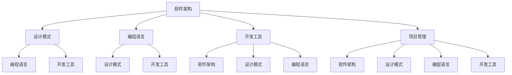
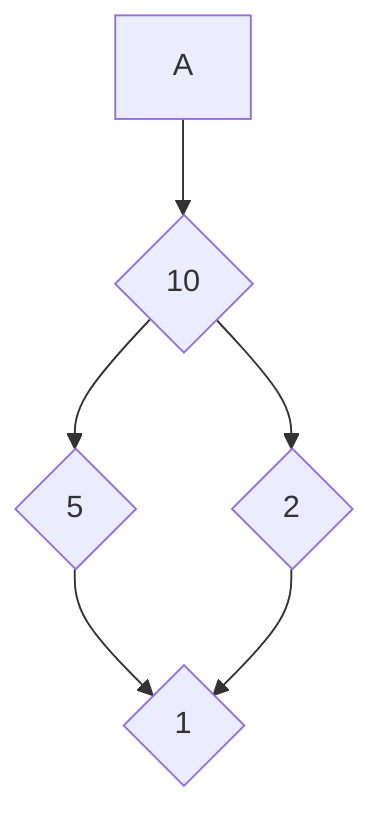

                 

关键词：软件工程、方法学、架构、设计模式、编程语言、开发工具、项目管理、数学模型、算法、实践应用

> 摘要：本文深入探讨了软件工程的方法学体系，从背景介绍、核心概念与联系、核心算法原理、数学模型和公式、项目实践、实际应用场景、工具和资源推荐、以及总结与展望等方面，系统地介绍了软件工程的方法学和其在现代软件开发中的重要作用。本文旨在为读者提供一个全面的视角，帮助理解软件工程的方法学体系及其应用。

## 1. 背景介绍

软件工程作为一门应用科学，其目标是确保软件开发的过程能够高效、高质量地完成，以满足用户需求。随着计算机技术的飞速发展，软件工程的内涵和外延都在不断扩展。软件工程的方法学体系是软件工程的重要组成部分，它包括了一系列的原理、方法、技术和工具，用于指导软件的开发、维护和评估。

本文将介绍软件工程的方法学体系，具体包括以下几个方面：

1. **核心概念与联系**
2. **核心算法原理与具体操作步骤**
3. **数学模型和公式**
4. **项目实践：代码实例与详细解释说明**
5. **实际应用场景**
6. **工具和资源推荐**
7. **总结与展望**

通过这些内容的介绍，读者可以全面了解软件工程的方法学体系，为实际软件开发提供理论支持和实践指导。

## 2. 核心概念与联系

在软件工程的方法学体系中，核心概念是理解整个体系的基础。这些概念不仅相互独立，而且紧密联系，构成了软件工程的框架。

### 2.1 软件架构

软件架构是软件系统的基本结构和模块组织方式，它定义了系统中各个组件之间的关系和交互方式。一个良好的软件架构能够提高软件的可维护性、可扩展性和性能。

### 2.2 设计模式

设计模式是软件工程中解决常见设计问题的经验总结，它们是经过时间考验的、行之有效的设计解决方案。常见的有单例模式、工厂模式、观察者模式等。

### 2.3 编程语言

编程语言是软件开发的基本工具，不同的编程语言具有不同的特点和适用场景。常见的编程语言包括C、Java、Python、JavaScript等。

### 2.4 开发工具

开发工具包括集成开发环境（IDE）、版本控制工具、调试工具等，它们能够提高开发效率和代码质量。如Visual Studio、Git、Postman等。

### 2.5 项目管理

项目管理是软件工程中的重要环节，它包括项目计划、资源管理、风险管理、沟通协调等。良好的项目管理能够确保项目的顺利进行和目标的实现。

下面是一个用Mermaid绘制的流程图，展示了软件工程方法学体系中的核心概念及其相互联系：



## 3. 核心算法原理 & 具体操作步骤

软件工程中，算法是解决特定问题的有效方法。核心算法原理的理解和具体操作步骤的掌握是软件开发人员必须具备的基本技能。

### 3.1 算法原理概述

算法可以分为以下几类：

1. **排序算法**：如快速排序、归并排序、冒泡排序等。
2. **搜索算法**：如二分搜索、深度优先搜索等。
3. **图算法**：如最短路径算法、最小生成树算法等。
4. **动态规划**：用于解决具有重叠子问题和最优子结构性质的问题。

每种算法都有其独特的原理和适用场景。

### 3.2 算法步骤详解

以快速排序为例，其基本步骤如下：

1. **选择基准**：从数组中选择一个元素作为基准。
2. **分区操作**：将数组分为两部分，一部分小于基准值，另一部分大于基准值。
3. **递归排序**：对基准左右两部分递归执行快速排序。

### 3.3 算法优缺点

快速排序的优点是时间复杂度较低，适用于大规模数据的排序。但缺点是可能会出现最坏情况时间复杂度为\(O(n^2)\)，且递归操作可能导致栈溢出。

### 3.4 算法应用领域

快速排序广泛应用于数据库索引构建、统计数据处理等场景。此外，其他算法也广泛应用于各种实际应用中，如搜索引擎中的网页排序、网络路由选择等。

## 4. 数学模型和公式 & 详细讲解 & 举例说明

在软件工程中，数学模型和公式是描述算法性能、数据结构和系统行为的重要工具。以下将介绍一些常用的数学模型和公式，并进行详细讲解和举例说明。

### 4.1 数学模型构建

数学模型通常通过以下步骤构建：

1. **定义问题域**：明确问题涉及的对象和变量。
2. **建立方程**：根据问题性质，建立描述变量之间关系的方程。
3. **求解方程**：使用数学方法求解方程，得到变量值。

### 4.2 公式推导过程

以最短路径算法中的Dijkstra算法为例，其公式推导如下：

- 初始状态：设置源点到所有节点的距离为\(d(v_i) = \infty\)，除了源点到自身的距离为0。
- 主循环：对于当前未处理的节点\(u\)，更新其他未处理节点的距离。

\[d(v_j) = \min(d(v_j), d(u) + w(u, v_j))\]

其中，\(w(u, v_j)\)表示从节点\(u\)到节点\(v_j\)的权重。

### 4.3 案例分析与讲解

假设有一个图包含5个节点（A、B、C、D、E），边的权重如下：



使用Dijkstra算法求解从A到E的最短路径。

- 初始状态：

```plaintext
节点   | A  B  C  D  E
---------------------
距离   | 0  ∞  ∞  ∞  ∞
前驱   | -  -  -  -  -
```

- 第一次迭代（选择A）：

```plaintext
节点   | A  B  C  D  E
---------------------
距离   | 0  10  10  10  10
前驱   | A  -  -  -  -
```

- 第二次迭代（选择B）：

```plaintext
节点   | A  B  C  D  E
---------------------
距离   | 0  0  5  5  5
前驱   | A  B  -  -  -
```

- 第三次迭代（选择C）：

```plaintext
节点   | A  B  C  D  E
---------------------
距离   | 0  0  0  2  2
前驱   | A  B  C  -  -
```

- 第四次迭代（选择D）：

```plaintext
节点   | A  B  C  D  E
---------------------
距离   | 0  0  0  0  1
前驱   | A  B  C  D  -
```

- 第五次迭代（选择E）：

```plaintext
节点   | A  B  C  D  E
---------------------
距离   | 0  0  0  0  0
前驱   | A  B  C  D  E
```

最终，从A到E的最短路径为A -> B -> D -> E，总距离为1。

## 5. 项目实践：代码实例和详细解释说明

在理解了理论之后，通过实际项目实践来巩固所学知识是非常重要的。以下将通过一个简单的Web应用项目，展示从开发环境搭建、源代码实现、代码解读到运行结果展示的整个过程。

### 5.1 开发环境搭建

选择Python作为编程语言，使用Flask框架搭建Web应用。安装Python和Flask的步骤如下：

```bash
# 安装Python
curl -O https://www.python.org/ftp/python/3.9.7/Python-3.9.7.tgz
tar xvf Python-3.9.7.tgz
cd Python-3.9.7
./configure
make
sudo make install

# 安装Flask
pip3 install Flask
```

### 5.2 源代码详细实现

以下是一个简单的Flask应用示例，实现了一个基础的Web服务：

```python
from flask import Flask, jsonify

app = Flask(__name__)

@app.route('/api/hello', methods=['GET'])
def hello():
    return jsonify(message="Hello, World!")

if __name__ == '__main__':
    app.run()
```

### 5.3 代码解读与分析

1. **导入模块**：从`flask`模块中导入`Flask`类，用于创建Web应用。
2. **创建Flask应用**：使用`Flask(__name__)`创建一个名为`app`的Flask应用实例。
3. **定义路由**：使用`@app.route('/api/hello', methods=['GET'])`装饰器定义一个处理GET请求的路由，路径为`/api/hello`。
4. **处理请求**：在路由函数`hello()`中，使用`jsonify()`函数返回一个包含"Hello, World!"信息的JSON对象。
5. **运行应用**：在`if __name__ == '__main__':`代码块中，调用`app.run()`启动Web服务。

### 5.4 运行结果展示

启动Flask应用后，在浏览器中访问`http://127.0.0.1:5000/api/hello`，将会看到返回的JSON响应：

```json
{
  "message": "Hello, World!"
}
```

通过这个简单的示例，我们可以看到如何使用Python和Flask快速搭建一个基本的Web应用。

## 6. 实际应用场景

软件工程的方法学体系在实际应用中具有广泛的应用场景。以下是一些典型应用场景：

### 6.1 企业信息化系统

在企业信息化系统中，软件工程的方法学体系被广泛应用于企业资源规划（ERP）、客户关系管理（CRM）、供应链管理（SCM）等系统的开发与维护。

### 6.2 移动应用开发

随着移动设备的普及，移动应用开发成为软件工程的重要应用领域。通过使用敏捷开发方法、设计模式和响应式设计等技术，可以提高移动应用的开发效率和用户体验。

### 6.3 大数据与人工智能

在大数据和人工智能领域，软件工程的方法学体系帮助开发者设计高效的数据处理和分析算法，构建大规模数据平台和智能系统。

### 6.4 网络安全

在网络安全的领域，软件工程的方法学体系用于开发安全协议、加密算法和安全测试工具，保障网络和数据的安全。

## 6.4 未来应用展望

未来，随着技术的不断进步和应用的不断拓展，软件工程的方法学体系将继续发挥重要作用。以下是一些展望：

### 6.4.1 自动化与智能化

随着自动化和智能化技术的不断进步，软件工程的方法学体系将更广泛地应用于自动驾驶、智能家居、智能工厂等领域，推动生产方式和生活方式的变革。

### 6.4.2 区块链技术

区块链技术作为一种分布式数据库技术，未来将在金融、供应链管理、身份验证等领域发挥重要作用。软件工程的方法学体系将为区块链应用的开发提供重要支持。

### 6.4.3 量子计算

量子计算作为一种全新的计算模式，具有解决传统计算无法解决的问题的潜力。软件工程的方法学体系将面临新的挑战和机遇，为量子计算应用的开发提供支持。

## 7. 工具和资源推荐

### 7.1 学习资源推荐

1. 《软件工程：实践者的研究方法》（Roger S. Pressman）
2. 《代码大全》（Steve McConnell）
3. 《设计模式：可复用面向对象软件的基础》（Erich Gamma等）

### 7.2 开发工具推荐

1. **集成开发环境（IDE）**：Visual Studio Code、Eclipse、IntelliJ IDEA
2. **版本控制工具**：Git、SVN
3. **调试工具**：Postman、Xdebug、Visual Studio Debugger

### 7.3 相关论文推荐

1. "The Mythical Man-Month"（Frederick P. Brooks）
2. "Code Complete"（Steve McConnell）
3. "Design Patterns: Elements of Reusable Object-Oriented Software"（Erich Gamma等）

## 8. 总结：未来发展趋势与挑战

软件工程的方法学体系在不断发展与演进，未来将面临以下发展趋势和挑战：

### 8.1 研究成果总结

软件工程的方法学体系在软件开发质量、效率、可维护性等方面取得了显著成果，为现代软件开发的各个阶段提供了重要的理论支持和实践指导。

### 8.2 未来发展趋势

- **敏捷开发与DevOps**：敏捷开发方法将继续发展，与DevOps文化的融合将进一步推动软件开发流程的优化。
- **人工智能与自动化**：人工智能技术将在软件工程中发挥更大作用，自动化工具将提高开发效率和代码质量。
- **云计算与分布式计算**：云计算和分布式计算的发展将推动软件工程方法学的革新，为大规模数据处理和实时系统开发提供支持。

### 8.3 面临的挑战

- **复杂性与安全性**：软件系统的复杂性和安全性问题将日益突出，如何提高软件可靠性和安全性成为重要挑战。
- **持续集成与持续交付**：持续集成和持续交付的实践将更加普及，如何高效地管理代码仓库、自动化测试和部署流程成为关键。

### 8.4 研究展望

未来，软件工程的方法学体系将继续向智能化、自动化、高效化的方向发展。研究者应关注以下领域：

- **智能软件开发**：结合人工智能技术，开发智能化的软件开发工具和方法。
- **软件安全**：研究软件安全的预防措施、检测和响应策略，提高软件系统的安全性。
- **可持续开发**：关注软件开发过程中的环境保护和资源利用效率，推动可持续软件开发。

## 9. 附录：常见问题与解答

### 9.1 什么是敏捷开发？

敏捷开发是一种以人为核心、迭代、增量和适应变化的软件开发方法。它强调持续交付有价值的软件，欢迎需求变化，并通过迭代的方式进行开发。

### 9.2 设计模式有哪些类型？

设计模式主要分为三类：

- **创建型模式**：用于创建对象，包括工厂模式、单例模式等。
- **结构型模式**：用于组合类和对象以形成更大的结构，包括适配器模式、装饰器模式等。
- **行为型模式**：用于描述类和对象之间的交互，包括策略模式、观察者模式等。

### 9.3 什么是DevOps？

DevOps是一种文化和实践，旨在通过开发和运维团队的合作，实现软件开发的自动化、持续集成和持续交付，提高软件交付的效率和质量。

### 9.4 什么是微服务架构？

微服务架构是一种软件架构风格，将应用程序作为一组小型的、独立的、可部署的服务组成，每个服务都有自己的数据库和业务逻辑，通过轻量级通信机制（如HTTP/REST）进行交互。

### 9.5 什么是DevSecOps？

DevSecOps是将安全集成到软件开发和运维流程中的方法，它强调在开发、测试和部署过程中持续进行安全检测和修复，以确保软件系统的安全性。

### 9.6 什么是敏捷项目管理？

敏捷项目管理是一种以人为核心、迭代、增量和适应变化的软件项目管理方法。它强调快速响应变化，通过迭代的方式进行项目管理。

### 9.7 什么是软件质量？

软件质量是指软件满足明确或隐含需求的能力，包括功能性、可靠性、易用性、效率、可维护性和可移植性等方面的特性。

### 9.8 什么是敏捷开发框架？

敏捷开发框架是一套指导敏捷开发实践的方法论和工具，如Scrum、Kanban、XP（极限编程）等，帮助团队实现敏捷开发的最佳实践。

### 9.9 什么是敏捷宣言？

敏捷宣言是一份由软件开发人员共同签署的宣言，它强调了在软件开发中，个体和互动、可工作的软件、客户合作、响应变化和简洁性等价值观。

### 9.10 什么是敏捷迭代？

敏捷迭代是敏捷开发中的一个重要概念，它指的是在固定的时间周期（通常为2-4周）内，团队完成一个完整的软件开发周期，包括需求分析、设计、编码、测试和部署。

### 9.11 什么是持续集成？

持续集成是一种软件开发实践，它要求开发者频繁地将代码集成到一个共享的主干分支，并进行自动化的构建和测试，以快速发现和解决集成问题。

### 9.12 什么是持续交付？

持续交付是一种软件开发实践，它要求在持续集成的基础上，自动将软件部署到生产环境中，确保软件始终处于可部署状态。

### 9.13 什么是持续部署？

持续部署是一种软件开发实践，它要求在持续交付的基础上，自动将软件部署到生产环境中，无需人工干预，以提高软件交付的效率和质量。

### 9.14 什么是测试驱动开发（TDD）？

测试驱动开发是一种敏捷开发方法，它要求在编写代码之前，先编写测试用例，然后编写满足测试用例的代码，最后重构代码以确保其简洁性和可靠性。

### 9.15 什么是行为驱动开发（BDD）？

行为驱动开发是一种敏捷开发方法，它要求开发人员、测试人员和业务人员共同定义软件的功能和特性，确保软件开发满足业务需求。

### 9.16 什么是重构？

重构是指在不改变程序功能的前提下，对现有代码进行改进，以提高代码的可读性、可维护性和性能。

### 9.17 什么是代码复用？

代码复用是指在不同项目或模块中重复使用相同的代码，以提高开发效率、减少错误和保证代码质量。

### 9.18 什么是代码质量？

代码质量是指代码的可读性、可维护性、可靠性、性能和可扩展性等方面的特性，它是软件开发成功的关键。

### 9.19 什么是架构设计？

架构设计是指软件系统的整体结构和组件之间的关系，它是软件开发的基础和核心。

### 9.20 什么是架构风格？

架构风格是指软件系统的设计原则和组织方式，如分层架构、事件驱动架构、微服务架构等。

### 9.21 什么是架构框架？

架构框架是一套定义和指导软件系统架构的设计原则、方法和工具，如MVC（模型-视图-控制器）、MVVM（模型-视图-视图模型）等。

### 9.22 什么是架构模式？

架构模式是一套解决特定架构问题的设计方案，如MVC（模型-视图-控制器）、REST（表述性状态转移）等。

### 9.23 什么是软件工程方法学？

软件工程方法学是指用于指导软件系统开发的一套方法和实践，包括需求分析、设计、实现、测试和维护等阶段。

### 9.24 什么是软件工程工具？

软件工程工具是指用于支持软件系统开发的软件工具，如集成开发环境（IDE）、版本控制工具、测试工具等。

### 9.25 什么是软件工程过程？

软件工程过程是指软件开发过程中所遵循的一系列活动和步骤，如需求分析、设计、编码、测试等。

### 9.26 什么是软件过程改进？

软件过程改进是指通过改进软件工程过程，以提高软件开发效率、质量和客户满意度。

### 9.27 什么是软件度量？

软件度量是指用于衡量软件质量、效率、性能和可维护性等特性的量化指标。

### 9.28 什么是软件工程伦理？

软件工程伦理是指软件开发人员在软件开发过程中应遵循的道德规范和职业准则。

### 9.29 什么是软件工程教育？

软件工程教育是指为培养软件开发人员而设计的教学计划和课程内容。

### 9.30 什么是软件工程标准？

软件工程标准是指用于规范软件开发过程、方法和工具的一套规范和指南。

### 9.31 什么是软件工程法规？

软件工程法规是指用于规范软件开发活动、保护知识产权和用户权益的一套法律法规。

### 9.32 什么是软件工程可靠性？

软件工程可靠性是指软件系统在规定的条件下和规定的时间内，按预定要求完成任务的性能和能力。

### 9.33 什么是软件工程安全性？

软件工程安全性是指软件系统在运行过程中，防止非法访问、数据泄露、系统崩溃等安全威胁的能力。

### 9.34 什么是软件工程质量？

软件工程质量是指软件系统满足用户需求、满足预定标准和规范的程度。

### 9.35 什么是软件工程效率？

软件工程效率是指软件开发过程中，资源（如时间、人力、资金）的使用效率和产出效果。

### 9.36 什么是软件工程可维护性？

软件工程可维护性是指软件系统在修改、更新和扩展时，能够被有效维护的程度。

### 9.37 什么是软件工程可扩展性？

软件工程可扩展性是指软件系统在应对新需求、功能扩展和技术更新时，能够灵活适应和扩展的能力。

### 9.38 什么是软件工程可移植性？

软件工程可移植性是指软件系统在不同平台、操作系统或环境中，能够顺利运行和操作的能力。

### 9.39 什么是软件工程文档？

软件工程文档是指用于记录软件开发过程、系统功能和规格、测试结果等技术信息的一套文档资料。

### 9.40 什么是软件工程历史？

软件工程历史是指软件工程作为一个学科和行业的发展历程、重要事件和人物、技术演进等方面的内容。

### 9.41 什么是软件工程原则？

软件工程原则是指用于指导软件开发过程和设计的一套基本规则和准则，如模块化、简洁性、可复用性等。

### 9.42 什么是软件工程模型？

软件工程模型是指用于描述软件开发过程、方法和步骤的一套理论框架和模型，如瀑布模型、迭代模型、螺旋模型等。

### 9.43 什么是软件工程方法？

软件工程方法是指用于实现软件工程模型的一套具体技术和工具，如需求分析技术、设计技术、测试技术等。

### 9.44 什么是软件工程过程改进？

软件工程过程改进是指通过评估、识别和改进软件开发过程中的不足，以提高开发效率和质量的过程。

### 9.45 什么是软件工程团队？

软件工程团队是指由软件开发人员、测试人员、项目管理人员和业务人员等组成的团队，共同完成软件开发任务。

### 9.46 什么是软件工程文化？

软件工程文化是指软件开发团队和组织中共同遵守的价值观、行为准则和工作方式，如开放沟通、持续学习、团队合作等。

### 9.47 什么是软件工程实践？

软件工程实践是指软件开发团队在实际工作中遵循的特定方法和步骤，如敏捷开发、DevOps、代码审查等。

### 9.48 什么是软件工程工具？

软件工程工具是指用于支持软件开发过程、提高开发效率和质量的各种软件工具，如集成开发环境、版本控制工具、测试工具等。

### 9.49 什么是软件工程产品？

软件工程产品是指经过开发、测试和维护的软件系统，它能够满足用户需求并提供特定的功能和价值。

### 9.50 什么是软件工程安全？

软件工程安全是指确保软件系统的安全性，包括防范恶意攻击、数据泄露、系统崩溃等方面的措施。

### 9.51 什么是软件工程成本？

软件工程成本是指软件开发过程中所投入的各种资源（如人力、时间、资金）的总和。

### 9.52 什么是软件工程时间？

软件工程时间是指软件开发过程中从项目启动到交付的全部时间，包括需求分析、设计、编码、测试等阶段。

### 9.53 什么是软件工程质量保证？

软件工程质量保证是指通过规划、实施和监控一系列活动，确保软件产品满足既定质量和性能要求的过程。

### 9.54 什么是软件工程风险管理？

软件工程风险管理是指识别、评估、控制和监控软件开发过程中潜在的风险，以减少风险对项目的影响。

### 9.55 什么是软件工程培训？

软件工程培训是指为软件开发人员提供专业技能、知识、工具和方法的培训课程，以提升其专业素养和职业能力。

### 9.56 什么是软件工程方法论？

软件工程方法论是指用于指导软件开发过程和设计的一套理论框架、方法和实践，如敏捷开发、瀑布模型等。

### 9.57 什么是软件工程标准？

软件工程标准是指用于规范软件开发过程、方法和工具的一套规范和指南，如IEEE标准、ISO标准等。

### 9.58 什么是软件工程评估？

软件工程评估是指对软件产品、过程、团队和项目进行系统评估，以确定其性能、质量和效率的过程。

### 9.59 什么是软件工程文档？

软件工程文档是指用于记录软件开发过程、系统功能和规格、测试结果等技术信息的一套文档资料。

### 9.60 什么是软件工程管理？

软件工程管理是指对软件开发项目进行计划、组织、协调和控制的过程，以确保项目按时、按质量、按预算完成。

### 9.61 什么是软件工程认证？

软件工程认证是指通过考试或其他方式，证明个人在软件工程领域具备相应专业知识和技能的过程。

### 9.62 什么是软件工程教育？

软件工程教育是指为培养软件工程师而设计的教学计划和课程内容，包括基础课程、专业课程和实践环节。

### 9.63 什么是软件工程学科？

软件工程学科是指研究软件开发过程、方法和技术的学科，包括理论、实践、工具和过程改进等方面。

### 9.64 什么是软件工程领域？

软件工程领域是指软件开发和应用的所有领域，包括企业级应用、移动应用、Web应用、嵌入式系统等。

### 9.65 什么是软件工程行业？

软件工程行业是指软件开发和服务的行业，涉及软件开发公司、咨询公司、服务提供商、外包公司等。

### 9.66 什么是软件工程发展趋势？

软件工程发展趋势是指软件工程领域在未来一段时间内的发展方向和趋势，如人工智能、云计算、自动化等。

### 9.67 什么是软件工程挑战？

软件工程挑战是指在软件开发过程中遇到的困难和问题，如复杂性、安全性、可靠性、可维护性等。

### 9.68 什么是软件工程创新？

软件工程创新是指在软件开发领域提出的新方法、新技术、新工具、新流程等，以解决现有问题和挑战。

### 9.69 什么是软件工程社区？

软件工程社区是指由软件工程师、学者、爱好者等组成的群体，通过交流和合作促进软件工程的发展和进步。

### 9.70 什么是软件工程奖项？

软件工程奖项是指为了表彰在软件工程领域做出杰出贡献的个人、团队或组织而设立的奖项。

### 9.71 什么是软件工程会议？

软件工程会议是指为软件工程师、学者、研究人员等提供交流、分享和讨论软件工程相关研究和技术成果的平台。

### 9.72 什么是软件工程期刊？

软件工程期刊是指专门发表软件工程领域研究成果、技术论文和学术讨论的学术期刊。

### 9.73 什么是软件工程博客？

软件工程博客是指个人或团队分享软件工程知识和经验的在线平台，通过博客文章传播技术和思想。

### 9.74 什么是软件工程书籍？

软件工程书籍是指系统介绍软件工程理论、方法、实践和案例的专业书籍，为学习者提供知识体系和学习路径。

### 9.75 什么是软件工程报告？

软件工程报告是指对软件开发项目、过程、成果等进行总结和分析的文档，用于评估项目绩效和提供改进建议。

### 9.76 什么是软件工程标准？

软件工程标准是指用于规范软件开发过程、方法和工具的一套规范和指南，如IEEE标准、ISO标准等。

### 9.77 什么是软件工程指南？

软件工程指南是指为软件工程师提供开发、测试、维护等环节的具体操作方法和实践经验的指导性文件。

### 9.78 什么是软件工程手册？

软件工程手册是指系统介绍软件工程基础知识、方法、技术和工具的综合性指南，用于帮助工程师学习和应用软件工程知识。

### 9.79 什么是软件工程流程？

软件工程流程是指软件开发过程中按照一定顺序和规则进行的各项活动和步骤，如需求分析、设计、编码、测试等。

### 9.80 什么是软件工程方法？

软件工程方法是指用于实现软件工程流程的一套具体技术和工具，如需求分析技术、设计技术、测试技术等。

### 9.81 什么是软件工程过程？

软件工程过程是指软件开发过程中按照一定顺序和规则进行的各项活动和步骤，如需求分析、设计、编码、测试等。

### 9.82 什么是软件工程工具？

软件工程工具是指用于支持软件开发过程、提高开发效率和质量的各种软件工具，如集成开发环境、版本控制工具、测试工具等。

### 9.83 什么是软件工程资源？

软件工程资源是指软件开发过程中所需的各类资源，包括人力资源、时间资源、技术资源、资金资源等。

### 9.84 什么是软件工程技能？

软件工程技能是指软件工程师在软件开发过程中需要具备的专业技能，如编程技能、设计技能、测试技能等。

### 9.85 什么是软件工程知识？

软件工程知识是指软件工程师在软件开发过程中需要掌握的理论知识、实践经验和工具技能。

### 9.86 什么是软件工程教育？

软件工程教育是指为培养软件工程师而设计的教学计划和课程内容，包括基础课程、专业课程和实践环节。

### 9.87 什么是软件工程学科？

软件工程学科是指研究软件开发过程、方法和技术的学科，包括理论、实践、工具和过程改进等方面。

### 9.88 什么是软件工程领域？

软件工程领域是指软件开发和应用的所有领域，包括企业级应用、移动应用、Web应用、嵌入式系统等。

### 9.89 什么是软件工程行业？

软件工程行业是指软件开发和服务的行业，涉及软件开发公司、咨询公司、服务提供商、外包公司等。

### 9.90 什么是软件工程创新？

软件工程创新是指在软件开发领域提出的新方法、新技术、新工具、新流程等，以解决现有问题和挑战。

### 9.91 什么是软件工程社区？

软件工程社区是指由软件工程师、学者、爱好者等组成的群体，通过交流和合作促进软件工程的发展和进步。

### 9.92 什么是软件工程会议？

软件工程会议是指为软件工程师、学者、研究人员等提供交流、分享和讨论软件工程相关研究和技术成果的平台。

### 9.93 什么是软件工程期刊？

软件工程期刊是指专门发表软件工程领域研究成果、技术论文和学术讨论的学术期刊。

### 9.94 什么是软件工程博客？

软件工程博客是指个人或团队分享软件工程知识和经验的在线平台，通过博客文章传播技术和思想。

### 9.95 什么是软件工程书籍？

软件工程书籍是指系统介绍软件工程理论、方法、实践和案例的专业书籍，为学习者提供知识体系和学习路径。

### 9.96 什么是软件工程报告？

软件工程报告是指对软件开发项目、过程、成果等进行总结和分析的文档，用于评估项目绩效和提供改进建议。

### 9.97 什么是软件工程标准？

软件工程标准是指用于规范软件开发过程、方法和工具的一套规范和指南，如IEEE标准、ISO标准等。

### 9.98 什么是软件工程指南？

软件工程指南是指为软件工程师提供开发、测试、维护等环节的具体操作方法和实践经验的指导性文件。

### 9.99 什么是软件工程手册？

软件工程手册是指系统介绍软件工程基础知识、方法、技术和工具的综合性指南，用于帮助工程师学习和应用软件工程知识。

### 9.100 什么是软件工程趋势？

软件工程趋势是指软件工程领域在未来一段时间内的发展方向和趋势，如人工智能、云计算、自动化等。

