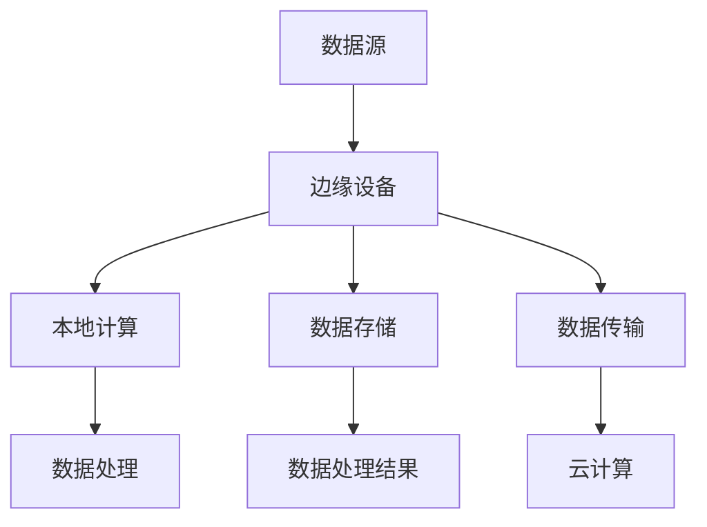

                 

关键词：边缘计算、数据处理、设备端、智能设备、性能优化、安全性、实时分析

摘要：随着物联网和智能设备的迅猛发展，边缘计算逐渐成为数据处理的重要策略。本文深入探讨了边缘计算的优势，特别是在设备端进行数据处理的必要性，以及相关的算法原理、数学模型和实际应用场景。通过详细的分析和实例讲解，本文为读者提供了全面的指导。

## 1. 背景介绍

随着5G技术的普及和物联网设备的广泛应用，数据处理的需求日益增长。传统的集中式数据处理模式已经难以满足实时性和性能的要求。在这种情况下，边缘计算作为一种新型的计算模式，逐渐受到关注。

边缘计算是指在靠近数据源或设备端的网络边缘执行数据处理和分析的任务。与传统的云计算不同，边缘计算能够将数据处理的重心从云端转移到设备端或接近用户的位置，从而显著降低延迟、提高数据处理效率。

边缘计算的核心优势在于：

1. **降低延迟**：数据在本地处理，减少了传输到云端的时间。
2. **提高性能**：减少了对带宽的需求，充分利用了设备端的计算资源。
3. **增强安全性**：敏感数据不必传输到云端，降低了数据泄露的风险。
4. **支持实时分析**：边缘设备能够实时处理和分析数据，快速响应。

## 2. 核心概念与联系

边缘计算涉及多个核心概念和组成部分。以下是一个简化的Mermaid流程图，用于描述这些概念之间的关系。



### 2.1 数据源

数据源是边缘计算的基础。它可以是一个智能设备、传感器、监控摄像头等，它们产生大量的数据。这些数据通常具有高频率、高实时性的特点。

### 2.2 边缘设备

边缘设备是执行数据处理任务的关键。它们可以是具有计算能力和存储能力的物联网设备，也可以是网关设备，它们能够收集、处理和传输数据。

### 2.3 本地计算

本地计算指的是在边缘设备上直接处理数据。这种处理方式可以显著降低延迟，提高数据处理速度。

### 2.4 数据存储

数据存储是指在边缘设备上存储数据。这包括临时数据和持久数据。有效的数据存储策略可以优化数据处理流程。

### 2.5 数据传输

数据传输是指将数据从边缘设备传输到云端或其他边缘设备。这通常需要考虑数据传输的带宽和安全性。

### 2.6 数据处理

数据处理是指对数据进行清洗、转换、分析等操作。这是边缘计算的核心任务。

### 2.7 数据处理结果

数据处理结果是指经过处理后的数据。这些结果可以用于决策支持、监控和优化等。

### 2.8 云计算

云计算是指在云端进行数据处理和分析。它通常用于处理大规模数据集和复杂的计算任务。

## 3. 核心算法原理 & 具体操作步骤

### 3.1 算法原理概述

边缘计算的核心算法通常包括以下几个步骤：

1. **数据采集**：从数据源采集数据。
2. **预处理**：对数据进行清洗、格式化和压缩。
3. **特征提取**：提取数据的关键特征。
4. **本地处理**：在边缘设备上执行数据处理任务。
5. **数据存储**：将处理后的数据存储在本地或云端。
6. **结果分析**：对处理结果进行分析和可视化。

### 3.2 算法步骤详解

#### 步骤 1：数据采集

数据采集是边缘计算的第一步。它涉及到从传感器、摄像头、智能设备等数据源获取数据。

#### 步骤 2：预处理

预处理包括数据清洗、去噪、缺失值处理等。这一步骤可以显著提高数据的质量，为后续处理提供准确的数据基础。

#### 步骤 3：特征提取

特征提取是从数据中提取有助于分析和建模的特征。这些特征可以用于分类、回归、聚类等机器学习任务。

#### 步骤 4：本地处理

本地处理是在边缘设备上执行数据处理任务。这可以包括机器学习模型训练、实时分析、事件检测等。

#### 步骤 5：数据存储

数据存储是将处理后的数据存储在本地或云端。这可以用于后续的数据分析和查询。

#### 步骤 6：结果分析

结果分析是对处理结果进行分析和可视化。这有助于决策支持、监控和优化等。

### 3.3 算法优缺点

#### 优点：

1. **降低延迟**：数据在本地处理，减少了传输到云端的时间。
2. **提高性能**：充分利用了边缘设备的计算资源。
3. **增强安全性**：敏感数据不必传输到云端，降低了数据泄露的风险。
4. **支持实时分析**：边缘设备能够实时处理和分析数据，快速响应。

#### 缺点：

1. **计算资源有限**：边缘设备的计算资源和存储资源有限。
2. **维护成本高**：需要定期维护和更新边缘设备。
3. **安全性问题**：边缘设备可能成为攻击的目标。

### 3.4 算法应用领域

边缘计算的应用领域广泛，包括但不限于：

1. **智能制造**：实时监控和优化生产过程。
2. **智能交通**：实时交通流量分析和事件检测。
3. **智慧城市**：实时环境监测和城市管理。
4. **医疗健康**：实时监控和诊断。
5. **农业**：实时监测作物生长和病虫害。

## 4. 数学模型和公式 & 详细讲解 & 举例说明

### 4.1 数学模型构建

边缘计算中的数学模型通常涉及以下几个方面：

1. **数据采集模型**：描述数据采集的过程和方式。
2. **预处理模型**：描述数据清洗、去噪和格式化等操作。
3. **特征提取模型**：描述如何从数据中提取特征。
4. **机器学习模型**：描述如何使用机器学习算法进行数据处理和分析。

### 4.2 公式推导过程

以下是一个简化的数据预处理模型的推导过程：

$$
\begin{aligned}
X_{\text{clean}} &= \text{remove_noise}(X_{\text{raw}}) \\
X_{\text{format}} &= \text{format_data}(X_{\text{clean}}) \\
X_{\text{final}} &= \text{handle_missing_values}(X_{\text{format}})
\end{aligned}
$$

其中，$X_{\text{raw}}$表示原始数据，$X_{\text{clean}}$表示去噪后的数据，$X_{\text{format}}$表示格式化后的数据，$X_{\text{final}}$表示最终的数据。

### 4.3 案例分析与讲解

假设我们有一个智能监控系统，它需要实时分析摄像头捕获的视频数据。以下是这个案例的详细分析：

1. **数据采集**：摄像头捕获的视频数据。
2. **预处理**：去除视频中的噪声，例如删除不相关的背景。
3. **特征提取**：提取视频中的关键特征，例如运动区域、人脸等。
4. **机器学习模型**：使用分类算法检测视频中的人脸，并识别异常行为。

通过这个案例，我们可以看到边缘计算在视频监控领域的应用。边缘设备可以实时处理视频数据，实现快速检测和响应。

## 5. 项目实践：代码实例和详细解释说明

### 5.1 开发环境搭建

在开始编写代码之前，我们需要搭建一个合适的开发环境。以下是一个简单的Python环境搭建步骤：

1. 安装Python 3.8及以上版本。
2. 安装必要的库，例如NumPy、Pandas、OpenCV等。

### 5.2 源代码详细实现

以下是一个简单的边缘计算代码实例，用于检测视频中的人脸：

```python
import cv2

# 加载预训练的人脸检测模型
face_cascade = cv2.CascadeClassifier('haarcascade_frontalface_default.xml')

# 加载视频
video = cv2.VideoCapture('sample_video.mp4')

while video.isOpened():
    # 读取视频帧
    ret, frame = video.read()
    if not ret:
        break

    # 检测人脸
    faces = face_cascade.detectMultiScale(frame, 1.3, 5)

    # 绘制人脸矩形框
    for (x, y, w, h) in faces:
        cv2.rectangle(frame, (x, y), (x+w, y+h), (255, 0, 0), 2)

    # 显示视频帧
    cv2.imshow('Video', frame)

    # 按下ESC键退出
    if cv2.waitKey(1) & 0xFF == 27:
        break

# 释放资源
video.release()
cv2.destroyAllWindows()
```

### 5.3 代码解读与分析

这个代码实例展示了如何使用OpenCV库检测视频中的人脸。以下是代码的详细解读：

1. **加载预训练的人脸检测模型**：使用`CascadeClassifier`加载预训练的人脸检测模型。
2. **加载视频**：使用`VideoCapture`加载视频文件。
3. **读取视频帧**：使用`read()`方法读取视频帧。
4. **检测人脸**：使用`detectMultiScale()`方法检测视频帧中的人脸。
5. **绘制人脸矩形框**：使用`rectangle()`方法绘制人脸的矩形框。
6. **显示视频帧**：使用`imshow()`方法显示视频帧。
7. **释放资源**：在视频读取完成后，释放视频和窗口资源。

通过这个代码实例，我们可以看到边缘计算在视频人脸检测领域的应用。边缘设备可以实时处理视频数据，实现快速检测和响应。

## 6. 实际应用场景

### 6.1 智能制造

边缘计算在智能制造中的应用非常广泛。例如，通过在生产线上的设备中嵌入边缘计算模块，可以实时监控生产设备的运行状态，检测设备的故障，并预测设备的维护需求。这样可以提高生产效率，减少停机时间。

### 6.2 智能交通

边缘计算在智能交通领域也有很大的潜力。例如，在交通流量监控中，边缘设备可以实时分析摄像头捕获的图像，检测交通拥堵和事故，并向交通管理部门提供实时数据，以便及时采取应对措施。

### 6.3 智慧城市

智慧城市是边缘计算的重要应用领域。例如，通过在城市的各个角落部署边缘计算设备，可以实时监测环境质量、交通状况和公共安全。这样可以提高城市管理的效率，提升市民的生活质量。

### 6.4 医疗健康

在医疗健康领域，边缘计算可以用于实时监控病人的健康状况，例如心率、血压等。通过边缘计算设备，医生可以实时获取病人的数据，及时做出诊断和治疗方案。

## 7. 工具和资源推荐

### 7.1 学习资源推荐

1. 《边缘计算：原理与实践》
2. 《边缘智能：智能设备的计算与协作》
3. 《边缘计算实战：从概念到应用》

### 7.2 开发工具推荐

1. TensorFlow Lite：适用于边缘设备的机器学习库。
2. PyTorch：适用于边缘计算的开源机器学习框架。
3. Node-RED：用于边缘设备的流程自动化工具。

### 7.3 相关论文推荐

1. "Edge Computing: Vision and Challenges"
2. "Enabling Edge Intelligence: A Practical Roadmap"
3. "Edge Computing for IoT: Challenges and Opportunities"

## 8. 总结：未来发展趋势与挑战

### 8.1 研究成果总结

边缘计算在数据处理、实时分析、智能设备等领域取得了显著的研究成果。通过边缘计算，我们可以实现更高效、更安全、更智能的设备和服务。

### 8.2 未来发展趋势

1. **硬件性能提升**：随着硬件技术的发展，边缘设备的性能将不断提高。
2. **网络连接优化**：5G和6G技术的发展将进一步提升边缘计算的网络连接质量。
3. **AI应用普及**：边缘计算将越来越多地与人工智能技术相结合，实现更智能化的数据处理。

### 8.3 面临的挑战

1. **安全性和隐私保护**：边缘计算涉及到大量的数据传输和处理，安全性是一个重要挑战。
2. **资源管理**：边缘设备通常具有有限的计算资源和存储资源，如何高效利用这些资源是一个难题。
3. **标准化和互操作性**：边缘计算涉及多个领域和技术，如何实现标准化和互操作性是一个挑战。

### 8.4 研究展望

边缘计算在未来将继续发挥重要作用。我们需要进一步研究如何提高边缘设备的性能、安全性，并实现更高效的数据处理。同时，我们还需要探索边缘计算在各个领域的具体应用，推动边缘计算技术的普及和发展。

## 9. 附录：常见问题与解答

### 9.1 什么是边缘计算？

边缘计算是指在靠近数据源或设备端的网络边缘执行数据处理和分析的任务。

### 9.2 边缘计算的优势是什么？

边缘计算的优势包括降低延迟、提高性能、增强安全性和支持实时分析。

### 9.3 边缘计算的应用领域有哪些？

边缘计算的应用领域包括智能制造、智能交通、智慧城市、医疗健康等。

### 9.4 边缘计算与云计算有什么区别？

边缘计算与云计算的区别在于数据处理的位置。云计算是在云端处理数据，而边缘计算是在设备端或接近用户的位置处理数据。

### 9.5 如何保障边缘计算的安全性？

保障边缘计算的安全性需要从数据传输、数据处理、设备安全等多个方面进行考虑。例如，采用加密技术保护数据传输，实施访问控制策略，确保设备安全等。

---

作者：禅与计算机程序设计艺术 / Zen and the Art of Computer Programming
```

