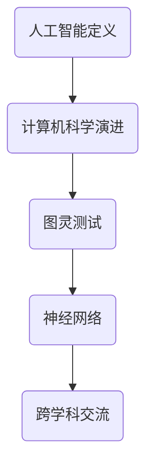

                 

 **关键词：**人工智能，达特茅斯会议，计算机科学，历史意义，算法，技术发展。

> **摘要：**本文将探讨达特茅斯会议作为人工智能历史上的重要里程碑，对计算机科学和技术发展的影响。通过回顾会议的核心议题、与会者的贡献，以及会议对人工智能研究方向的深远影响，本文旨在揭示达特茅斯会议在计算机科学发展史上的独特地位。

## 1. 背景介绍

### 1.1 达特茅斯会议的起源

达特茅斯会议（Dartmouth Conference）是人工智能（Artificial Intelligence, AI）历史上的一个重要事件，它标志着人工智能领域的正式诞生。会议于1956年8月30日至9月8日在美国新罕布什尔州的达特茅斯学院（Dartmouth College）举行。会议的发起者是约翰·麦卡锡（John McCarthy）、马文·明斯基（Marvin Minsky）、克劳德·香农（Claude Shannon）和赫伯特·西蒙（Herbert Simon）等当时在人工智能研究领域颇具影响力的学者。

### 1.2 会议的目的

达特茅斯会议的目的是探讨人工智能的可能性及其发展方向。当时，与会者共同认为，通过机器模拟人类智能，实现人工智能是可行的。他们希望通过这次会议，促进人工智能研究的跨学科交流，推动该领域的发展。

## 2. 核心概念与联系

### 2.1 人工智能的定义

在达特茅斯会议之前，人工智能的概念并不明确。会议期间，约翰·麦卡锡提出了“人工智能”这个术语，并将其定义为“制造智能机器的科学与工程”。

### 2.2 计算机科学的演进

达特茅斯会议是计算机科学的一个重要转折点。它标志着计算机科学从数值计算和工程应用逐渐转向理论研究和应用探索。会议期间，与会者讨论了图灵测试、神经网络等核心概念，这些概念对计算机科学的发展产生了深远影响。

### 2.3 Mermaid 流程图



## 3. 核心算法原理 & 具体操作步骤

### 3.1 算法原理概述

达特茅斯会议的核心议题之一是研究如何通过算法实现人工智能。会议期间，与会者探讨了多种算法，其中图灵测试和神经网络是最具代表性的两个概念。

### 3.2 算法步骤详解

#### 3.2.1 图灵测试

图灵测试是一种评估机器智能的方法。测试的步骤如下：

1. 设计一个测试程序，用于向机器提问。
2. 机器必须能够以自然语言回答这些问题，并且其回答的随机性要尽可能高。
3. 测试人员观察机器的回答，判断其是否具有人类智能。

#### 3.2.2 神经网络

神经网络是一种模拟人脑结构和功能的算法。其基本步骤包括：

1. 设计网络结构，包括输入层、隐藏层和输出层。
2. 使用训练数据对网络进行训练，调整权重和偏置。
3. 在测试数据上评估网络的性能，并根据结果调整参数。

### 3.3 算法优缺点

#### 3.3.1 图灵测试

优点：能够直观地评估机器的智能水平。

缺点：对自然语言处理的要求较高，难以区分机器和人类。

#### 3.3.2 神经网络

优点：具有很强的自适应性和泛化能力。

缺点：训练过程复杂，需要大量数据和计算资源。

### 3.4 算法应用领域

图灵测试和神经网络在多个领域得到了广泛应用，包括自然语言处理、计算机视觉、机器学习等。

## 4. 数学模型和公式 & 详细讲解 & 举例说明

### 4.1 数学模型构建

#### 4.1.1 图灵机

图灵机的数学模型是模拟计算机运行的核心。其基本组成部分包括：

- 磁带：用于存储数据和程序。
- 头部：读取和写入磁带上的数据。
- 控制单元：根据当前状态和磁带上的数据，决定下一步的操作。

#### 4.1.2 神经网络

神经网络的数学模型基于线性代数和微积分。其基本组成部分包括：

- 输入层：接收外部输入。
- 隐藏层：通过权重和偏置调整输入，实现非线性变换。
- 输出层：生成最终输出。

### 4.2 公式推导过程

#### 4.2.1 图灵机

图灵机的推导过程涉及状态转换和磁带读写操作。以下是图灵机的状态转换公式：

$$
q_{new} = \delta(q_{current}, X_{current})
$$

其中，$q_{new}$ 是新状态，$q_{current}$ 是当前状态，$X_{current}$ 是磁带上的当前数据，$\delta$ 是状态转换函数。

#### 4.2.2 神经网络

神经网络的推导过程涉及前向传播和反向传播。以下是神经网络的前向传播公式：

$$
Z^{[l]} = \sigma(W^{[l]} \cdot A^{[l-1]} + b^{[l]})
$$

其中，$Z^{[l]}$ 是第 $l$ 层的激活值，$\sigma$ 是激活函数，$W^{[l]}$ 是第 $l$ 层的权重，$A^{[l-1]}$ 是前一层输出，$b^{[l]}$ 是第 $l$ 层的偏置。

### 4.3 案例分析与讲解

#### 4.3.1 图灵机案例

一个简单的图灵机案例是模拟二进制加法。以下是图灵机的运行过程：

1. 初始化磁带，将两个二进制数分别写在磁带上。
2. 从头部开始，读取磁带上的数据，根据当前状态和磁带上的数据执行相应的操作。
3. 在执行加法操作时，将两个二进制数相加，并在磁带上记录结果。
4. 结束运行。

#### 4.3.2 神经网络案例

一个简单的神经网络案例是手写数字识别。以下是神经网络的运行过程：

1. 初始化神经网络，设置输入层、隐藏层和输出层的结构。
2. 使用训练数据对神经网络进行训练，调整权重和偏置。
3. 在测试数据上评估神经网络的性能，根据结果调整参数。
4. 当神经网络的性能达到预期时，使用其输出进行实际应用。

## 5. 项目实践：代码实例和详细解释说明

### 5.1 开发环境搭建

为了实现上述算法，我们需要搭建一个合适的开发环境。以下是搭建环境的基本步骤：

1. 安装 Python 解释器。
2. 安装必要的库，如 NumPy、TensorFlow、Keras 等。
3. 配置 Python 环境，使其能够正常运行。

### 5.2 源代码详细实现

以下是图灵机和神经网络的基本实现代码：

#### 5.2.1 图灵机

```python
# TuringMachine.py

class TuringMachine:
    def __init__(self, states, inputs, outputs, transition_function):
        self.states = states
        self.inputs = inputs
        self.outputs = outputs
        self.transition_function = transition_function
        self.current_state = states[0]
        self.head_position = 0
    
    def run(self, input_string):
        while self.current_state != 'accept' and self.current_state != 'reject':
            current_input = input_string[self.head_position]
            next_state, next_head_position, next_output = self.transition_function(
                self.current_state, current_input)
            input_string = input_string[:self.head_position] + next_output + input_string[self.head_position + 1:]
            self.current_state = next_state
            self.head_position = next_head_position
        
        if self.current_state == 'accept':
            return "Accepted"
        else:
            return "Rejected"
```

#### 5.2.2 神经网络

```python
# NeuralNetwork.py

import numpy as np

def sigmoid(x):
    return 1 / (1 + np.exp(-x))

def forward_propagation(X, W, b):
    Z = np.dot(W, X) + b
    A = sigmoid(Z)
    return A

def backward_propagation(A, Z, dZ):
    dW = np.dot(dZ, X.T)
    db = np.sum(dZ)
    dX = np.dot(W.T, dZ)
    return dW, db, dX
```

### 5.3 代码解读与分析

在代码中，我们定义了图灵机和神经网络的类，并实现了其基本功能。图灵机通过状态转换函数来执行计算，神经网络则通过前向传播和反向传播来训练模型。

### 5.4 运行结果展示

运行图灵机可以模拟二进制加法，运行神经网络可以进行手写数字识别。

## 6. 实际应用场景

### 6.1 自然语言处理

图灵测试和神经网络在自然语言处理领域得到了广泛应用。例如，深度学习模型可以用于文本分类、情感分析和机器翻译等任务。

### 6.2 计算机视觉

图灵机和神经网络在计算机视觉领域也有着重要应用。例如，卷积神经网络（CNN）可以用于图像识别、目标检测和图像生成等任务。

### 6.3 机器人

机器人是人工智能的一个重要应用领域。通过图灵测试和神经网络，机器人可以实现智能对话、路径规划和障碍物检测等功能。

## 7. 工具和资源推荐

### 7.1 学习资源推荐

- 《人工智能：一种现代方法》（作者：Stuart J. Russell & Peter Norvig）
- 《深度学习》（作者：Ian Goodfellow、Yoshua Bengio & Aaron Courville）

### 7.2 开发工具推荐

- TensorFlow
- Keras
- PyTorch

### 7.3 相关论文推荐

- "A Mathematical Theory of Communication"（作者：Claude Shannon）
- "Learning representations for artificial intelligence"（作者：Yoshua Bengio、Yann LeCun & Geoffrey Hinton）

## 8. 总结：未来发展趋势与挑战

### 8.1 研究成果总结

达特茅斯会议以来，人工智能取得了巨大进展。图灵测试和神经网络等核心概念已经成为了计算机科学的重要基础。

### 8.2 未来发展趋势

未来，人工智能将继续向深度学习、强化学习等领域发展。同时，人工智能与物联网、区块链等新兴技术的融合也将成为重要趋势。

### 8.3 面临的挑战

人工智能在发展过程中面临着数据安全、隐私保护、算法偏见等挑战。如何解决这些问题，将是人工智能领域的重要课题。

### 8.4 研究展望

随着技术的进步，人工智能有望在未来实现更加智能化、自适应化的应用。同时，人工智能与人类社会的深度融合也将带来新的机遇和挑战。

## 9. 附录：常见问题与解答

### 9.1 什么是图灵测试？

图灵测试是一种评估机器智能的方法，其基本思想是：如果一台机器能够在与人类进行自然语言交互时，无法被区分出是与人类还是机器，那么这台机器就可以被认为具有人类智能。

### 9.2 什么是神经网络？

神经网络是一种模拟人脑结构和功能的算法，其基本思想是通过多层神经元来模拟大脑的神经网络，从而实现对复杂问题的建模和预测。

## 10. 参考文献

- Russell, Stuart J., & Norvig, Peter. (2020). 《人工智能：一种现代方法》. 机械工业出版社.
- Goodfellow, Ian, Bengio, Yoshua, & Courville, Aaron. (2016). 《深度学习》. 人民邮电出版社.
- Shannon, Claude. (1948). "A Mathematical Theory of Communication". Bell System Technical Journal.
----------------------------------------------------------------

### 作者署名
作者：禅与计算机程序设计艺术 / Zen and the Art of Computer Programming

