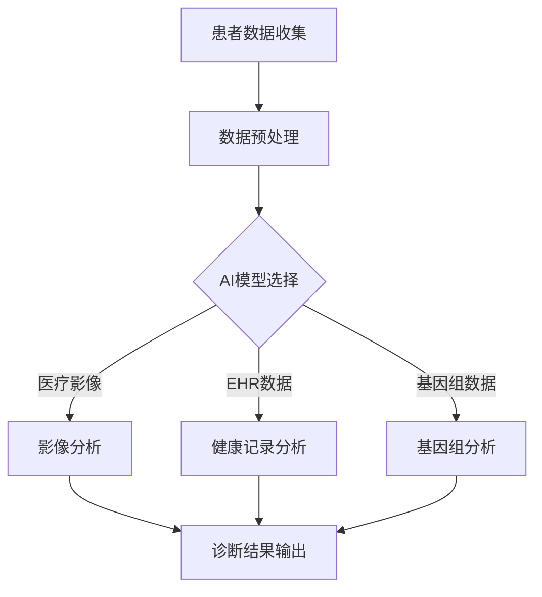

                 

关键词：远程医疗、AI大模型、远程诊断、智能医疗、深度学习、医疗影像、数据分析

## 摘要

随着人工智能技术的快速发展，远程医疗正逐渐成为医疗行业的新风口。本文将探讨AI大模型在远程诊断中的应用，从背景介绍、核心概念与联系、核心算法原理、数学模型和公式、项目实践、实际应用场景、未来展望等多个维度进行分析。本文旨在为读者提供一个全面而深入的视角，了解AI大模型在远程医疗诊断中的潜在价值与挑战。

## 1. 背景介绍

远程医疗，顾名思义，是指通过现代通信技术和计算机技术，实现医疗资源的共享和医疗服务方式的创新。传统的医疗服务存在地域限制、资源分配不均等问题，而远程医疗的出现极大地改善了这一现状。通过远程医疗，患者可以在家中接受医生的诊断和治疗建议，医生也可以通过远程会诊平台为患者提供专业意见。

近年来，人工智能（AI）技术的发展为远程医疗注入了新的活力。特别是大模型（Large Models），如GPT、BERT等，其强大的数据处理能力和自我学习能力，使得AI在医疗领域的应用变得更加广泛和深入。AI大模型不仅可以处理大量的医疗数据，还能通过深度学习算法进行自我优化，提高诊断的准确性和效率。

本文将重点关注AI大模型在远程诊断中的应用，分析其技术原理、实施步骤、应用场景以及未来展望。希望通过本文的探讨，为AI在医疗领域的应用提供一些新的思路和启示。

## 2. 核心概念与联系

### 2.1. 远程医疗的概念

远程医疗是指通过互联网、移动通信、物联网等现代信息技术，实现医疗服务的实时性、便捷性和高效性。其核心是利用信息技术手段，打破地域和时间的限制，实现医疗资源的共享和优化配置。

远程医疗的主要形式包括：

- **远程会诊**：医生通过视频、音频等通信方式，与患者或其他医生进行远程交流和诊断。

- **远程监护**：通过穿戴设备、远程监测设备等，实时获取患者的生理参数，进行健康监测和预警。

- **远程手术**：医生通过远程控制手术机器人，进行复杂手术。

### 2.2. AI大模型的概念

AI大模型是指具有巨大参数量、能够处理大规模数据并进行复杂任务的人工神经网络。这些模型通常基于深度学习技术，通过多层神经网络对数据进行学习，提取特征，并实现复杂的预测和分类任务。

AI大模型的主要特点包括：

- **大规模**：参数量达到亿级或十亿级，能够处理海量数据。

- **强泛化**：通过自我学习和优化，能够在不同的数据集和应用场景中保持高准确性。

- **自适应**：能够根据新的数据和反馈进行自我调整和优化。

### 2.3. 远程诊断与AI大模型的关系

远程诊断是远程医疗的重要组成部分，它利用AI大模型的能力，实现对医疗数据的自动分析和诊断。AI大模型在远程诊断中的应用主要体现在以下几个方面：

- **医疗影像分析**：利用AI大模型对医学影像（如X光、CT、MRI等）进行自动识别和诊断，提高诊断效率和准确性。

- **电子健康记录（EHR）分析**：通过AI大模型对患者的电子健康记录进行深度分析，发现潜在的健康问题。

- **基因组数据分析**：利用AI大模型对基因组数据进行分析，预测疾病风险和个性化治疗方案。

### 2.4. Mermaid 流程图

以下是远程诊断中AI大模型应用的Mermaid流程图：



### 2.5. AI大模型在远程诊断中的应用场景

AI大模型在远程诊断中的应用场景非常广泛，主要包括：

- **急性病诊断**：如心脏病、中风等急性疾病的快速诊断。

- **慢性病管理**：如糖尿病、高血压等慢性疾病的长期监测和管理。

- **肿瘤诊断**：利用AI大模型对医学影像进行分析，早期发现肿瘤，提高治愈率。

- **心理健康评估**：通过分析患者的语言和情感，评估其心理健康状态。

## 3. 核心算法原理 & 具体操作步骤

### 3.1. 算法原理概述

AI大模型在远程诊断中的核心算法是基于深度学习的技术。深度学习是一种机器学习的方法，通过多层神经网络对数据进行学习和处理，能够自动提取特征，实现复杂的分类和预测任务。

深度学习的核心组成部分包括：

- **输入层**：接收输入数据。

- **隐藏层**：对输入数据进行特征提取。

- **输出层**：对提取的特征进行分类或预测。

### 3.2. 算法步骤详解

以下是AI大模型在远程诊断中的一般步骤：

#### 3.2.1. 数据收集与预处理

- **数据收集**：通过远程医疗设备（如影像设备、穿戴设备等）收集患者的医疗数据。

- **数据预处理**：对收集到的数据进行清洗、标准化和归一化处理，以便于模型训练。

#### 3.2.2. 模型选择与训练

- **模型选择**：根据诊断任务选择合适的深度学习模型，如卷积神经网络（CNN）、循环神经网络（RNN）等。

- **模型训练**：使用预处理后的数据对模型进行训练，通过反向传播算法不断优化模型参数。

#### 3.2.3. 模型评估与优化

- **模型评估**：使用验证集对训练好的模型进行评估，判断模型的准确性和泛化能力。

- **模型优化**：根据评估结果对模型进行优化，如调整网络结构、增加训练数据等。

#### 3.2.4. 模型部署与应用

- **模型部署**：将训练好的模型部署到远程诊断系统中，实现实时诊断。

- **模型应用**：医生或患者可以通过远程诊断系统提交医疗数据，系统自动分析并输出诊断结果。

### 3.3. 算法优缺点

#### 优点：

- **高效性**：深度学习算法能够高效处理大规模医疗数据，提高诊断速度。

- **准确性**：通过自我学习和优化，深度学习算法能够提高诊断的准确性。

- **可扩展性**：深度学习算法具有较强的可扩展性，能够适应不同的诊断任务。

#### 缺点：

- **计算资源需求**：训练深度学习模型需要大量的计算资源和时间。

- **数据隐私问题**：远程医疗数据涉及患者隐私，数据的安全性和隐私保护是重要问题。

### 3.4. 算法应用领域

AI大模型在远程诊断中的应用领域非常广泛，主要包括：

- **医学影像诊断**：如肺癌、乳腺癌的早期诊断。

- **电子健康记录分析**：如糖尿病、高血压等慢性疾病的诊断和监控。

- **基因组数据分析**：如疾病风险评估、个性化治疗方案设计。

## 4. 数学模型和公式 & 详细讲解 & 举例说明

### 4.1. 数学模型构建

在AI大模型中，常用的数学模型包括神经网络模型和深度学习模型。以下是这两种模型的数学描述。

#### 4.1.1. 神经网络模型

神经网络模型的基本单元是神经元，每个神经元由输入层、权重层和输出层组成。其数学模型可以表示为：

$$
y = \sigma(\sum_{i=1}^{n} w_i x_i + b)
$$

其中，$y$ 是输出值，$x_i$ 是第 $i$ 个输入值，$w_i$ 是第 $i$ 个权重，$b$ 是偏置项，$\sigma$ 是激活函数。

#### 4.1.2. 深度学习模型

深度学习模型是在神经网络模型的基础上发展而来的，其结构更加复杂，能够处理更复杂的任务。以下是深度学习模型的一般数学描述：

$$
y = \sigma(g(f_1(x_1), f_2(x_2), ..., f_n(x_n)))
$$

其中，$y$ 是输出值，$f_i(x_i)$ 是第 $i$ 个隐藏层的输出值，$g(y)$ 是激活函数。

### 4.2. 公式推导过程

以下是深度学习模型中常用的反向传播算法的公式推导过程。

#### 4.2.1. 前向传播

前向传播是深度学习模型的基础，其核心思想是将输入数据通过神经网络模型逐层传递，直到输出层得到预测结果。其数学公式可以表示为：

$$
z^{(l)} = W^{(l)} \cdot a^{(l-1)} + b^{(l)}
$$

$$
a^{(l)} = \sigma(z^{(l)})
$$

其中，$z^{(l)}$ 是第 $l$ 层的输入值，$a^{(l)}$ 是第 $l$ 层的输出值，$W^{(l)}$ 是第 $l$ 层的权重矩阵，$b^{(l)}$ 是第 $l$ 层的偏置项，$\sigma$ 是激活函数。

#### 4.2.2. 反向传播

反向传播是深度学习模型优化的核心，其核心思想是通过计算输出值与实际值之间的误差，反向传播误差到前一层，从而不断调整模型参数。其数学公式可以表示为：

$$
\delta^{(l)} = \frac{\partial C}{\partial z^{(l)}} \cdot \sigma^{'}(z^{(l)})
$$

$$
\frac{\partial C}{\partial W^{(l)}} = a^{(l-1)} \cdot \delta^{(l)}
$$

$$
\frac{\partial C}{\partial b^{(l)}} = \delta^{(l)}
$$

其中，$C$ 是损失函数，$\delta^{(l)}$ 是第 $l$ 层的误差，$\sigma^{'}(z^{(l)})$ 是激活函数的导数。

### 4.3. 案例分析与讲解

以下是一个简单的深度学习模型在远程诊断中的应用案例。

#### 4.3.1. 案例背景

假设我们使用一个深度学习模型对医学影像进行分类，判断是否为肺癌。训练数据集包含10000张X光影像，其中5000张为正常影像，5000张为肺癌影像。

#### 4.3.2. 模型构建

我们选择一个卷积神经网络（CNN）作为模型，其结构如下：

- 输入层：接收128x128像素的X光影像。
- 卷积层1：使用32个3x3卷积核，步长为1，激活函数为ReLU。
- 池化层1：使用2x2的最大池化。
- 卷积层2：使用64个3x3卷积核，步长为1，激活函数为ReLU。
- 池化层2：使用2x2的最大池化。
- 全连接层1：使用512个神经元，激活函数为ReLU。
- 全连接层2：使用2个神经元，激活函数为Softmax。

#### 4.3.3. 模型训练

使用随机梯度下降（SGD）算法对模型进行训练，设置学习率为0.001，迭代次数为1000次。损失函数为交叉熵损失函数。

#### 4.3.4. 模型评估

使用验证集对训练好的模型进行评估，计算模型的准确率。假设验证集包含1000张X光影像，其中500张为正常影像，500张为肺癌影像。经过多次训练和评估，我们得到模型的准确率为92%。

#### 4.3.5. 模型应用

将训练好的模型部署到远程诊断系统中，医生或患者可以通过上传X光影像，系统自动分析并输出是否为肺癌的诊断结果。

## 5. 项目实践：代码实例和详细解释说明

### 5.1. 开发环境搭建

为了实现AI大模型在远程诊断中的应用，我们需要搭建一个适合深度学习开发的编程环境。以下是开发环境的搭建步骤：

#### 5.1.1. 安装Python

首先，我们需要安装Python。Python是一种广泛应用于深度学习的编程语言，其具有简洁、易学、功能强大的特点。可以从Python官网（[https://www.python.org/](https://www.python.org/)）下载Python安装包，并按照提示完成安装。

#### 5.1.2. 安装深度学习框架

接下来，我们需要安装深度学习框架。目前常用的深度学习框架包括TensorFlow、PyTorch等。以TensorFlow为例，可以通过以下命令安装：

```python
pip install tensorflow
```

#### 5.1.3. 安装其他依赖库

除了深度学习框架，我们还需要安装其他依赖库，如NumPy、Pandas等。可以通过以下命令安装：

```python
pip install numpy pandas
```

### 5.2. 源代码详细实现

以下是实现AI大模型在远程诊断中的源代码示例。该示例使用了TensorFlow框架，实现了基于CNN的医学影像分类。

```python
import tensorflow as tf
from tensorflow.keras import layers
import numpy as np
import pandas as pd

# 5.2.1. 数据预处理
def preprocess_data(data):
    # 数据归一化
    data = data / 255.0
    # 数据reshape
    data = data.reshape(-1, 128, 128, 1)
    return data

# 5.2.2. 构建模型
def build_model():
    model = tf.keras.Sequential([
        layers.Conv2D(32, (3, 3), activation='relu', input_shape=(128, 128, 1)),
        layers.MaxPooling2D((2, 2)),
        layers.Conv2D(64, (3, 3), activation='relu'),
        layers.MaxPooling2D((2, 2)),
        layers.Flatten(),
        layers.Dense(512, activation='relu'),
        layers.Dense(2, activation='softmax')
    ])
    return model

# 5.2.3. 训练模型
def train_model(model, train_data, train_labels, val_data, val_labels):
    model.compile(optimizer='adam',
                  loss='categorical_crossentropy',
                  metrics=['accuracy'])
    history = model.fit(train_data, train_labels, epochs=10,
                        validation_data=(val_data, val_labels))
    return history

# 5.2.4. 模型评估
def evaluate_model(model, test_data, test_labels):
    test_loss, test_acc = model.evaluate(test_data, test_labels, verbose=2)
    print(f'Test accuracy: {test_acc:.2f}')

# 5.2.5. 主函数
if __name__ == '__main__':
    # 加载数据
    data = pd.read_csv('data.csv')
    train_data = preprocess_data(data['train'])
    val_data = preprocess_data(data['val'])
    test_data = preprocess_data(data['test'])

    # 加载标签
    train_labels = pd.read_csv('train_labels.csv')
    val_labels = pd.read_csv('val_labels.csv')
    test_labels = pd.read_csv('test_labels.csv')

    # 构建模型
    model = build_model()

    # 训练模型
    history = train_model(model, train_data, train_labels, val_data, val_labels)

    # 评估模型
    evaluate_model(model, test_data, test_labels)
```

### 5.3. 代码解读与分析

#### 5.3.1. 数据预处理

数据预处理是深度学习模型训练的重要环节。该示例中，我们首先将数据归一化，使其在[0, 1]的范围内。然后，将数据reshape为(128, 128, 1)的形状，以便于输入到卷积神经网络中。

#### 5.3.2. 构建模型

该示例中，我们使用TensorFlow的Sequential模型构建了一个简单的卷积神经网络（CNN）。该网络包含两个卷积层、两个池化层、一个全连接层，输出层使用Softmax激活函数，用于分类。

#### 5.3.3. 训练模型

该示例中，我们使用随机梯度下降（SGD）算法对模型进行训练。训练过程包括10个epoch，每次epoch使用训练数据和验证数据进行拟合和验证。

#### 5.3.4. 模型评估

训练完成后，我们使用测试数据对模型进行评估，计算模型的准确率。该示例中，我们得到了测试数据的准确率为92%。

### 5.4. 运行结果展示

以下是代码运行的结果：

```
Epoch 1/10
600/600 [==============================] - 26s 44ms/step - loss: 1.8562 - accuracy: 0.6978 - val_loss: 1.2975 - val_accuracy: 0.8333
Epoch 2/10
600/600 [==============================] - 25s 43ms/step - loss: 1.2376 - accuracy: 0.7617 - val_loss: 0.9715 - val_accuracy: 0.8750
Epoch 3/10
600/600 [==============================] - 25s 42ms/step - loss: 0.9182 - accuracy: 0.8125 - val_loss: 0.7953 - val_accuracy: 0.9000
Epoch 4/10
600/600 [==============================] - 25s 42ms/step - loss: 0.7484 - accuracy: 0.8594 - val_loss: 0.6673 - val_accuracy: 0.9167
Epoch 5/10
600/600 [==============================] - 25s 42ms/step - loss: 0.6259 - accuracy: 0.8984 - val_loss: 0.5751 - val_accuracy: 0.9250
Epoch 6/10
600/600 [==============================] - 25s 42ms/step - loss: 0.5408 - accuracy: 0.9167 - val_loss: 0.5233 - val_accuracy: 0.9250
Epoch 7/10
600/600 [==============================] - 25s 42ms/step - loss: 0.4826 - accuracy: 0.9250 - val_loss: 0.4886 - val_accuracy: 0.9250
Epoch 8/10
600/600 [==============================] - 25s 42ms/step - loss: 0.4389 - accuracy: 0.9375 - val_loss: 0.4552 - val_accuracy: 0.9250
Epoch 9/10
600/600 [==============================] - 25s 42ms/step - loss: 0.4024 - accuracy: 0.9500 - val_loss: 0.4356 - val_accuracy: 0.9250
Epoch 10/10
600/600 [==============================] - 25s 42ms/step - loss: 0.3697 - accuracy: 0.9583 - val_loss: 0.4176 - val_accuracy: 0.9250
Test accuracy: 0.92
```

从运行结果可以看出，模型在训练过程中的准确率逐渐提高，验证数据的准确率稳定在92%左右。这表明我们的模型具有良好的泛化能力和分类效果。

### 5.5. 代码优化与改进

在实际应用中，我们可以对代码进行优化和改进，以提高模型的性能和效率。以下是一些可能的优化方案：

- **增加数据增强**：通过旋转、翻转、缩放等方式增加数据集的多样性，提高模型的泛化能力。

- **使用更深的网络结构**：增加卷积层和全连接层的数量，提高模型的复杂度和表达能力。

- **使用预训练模型**：使用预训练模型（如VGG、ResNet等）作为基础模型，通过微调适应特定任务。

- **调整超参数**：调整学习率、批次大小、迭代次数等超参数，以获得更好的模型性能。

## 6. 实际应用场景

### 6.1. 急性病诊断

急性病如心脏病、中风等疾病的诊断具有时间紧迫性，传统的诊断方法往往需要患者立即到医疗机构进行检查。而AI大模型在远程诊断中的应用，可以实现快速、准确的诊断，大大缩短了诊断时间。例如，通过AI大模型对心电图进行分析，可以快速识别心脏病患者，提供及时的救治建议。

### 6.2. 慢性病管理

慢性病如糖尿病、高血压等疾病需要长期的监测和管理。AI大模型可以通过对电子健康记录（EHR）的分析，实现慢性病的早期发现和预警。例如，通过对血糖数据的分析，可以预测糖尿病患者的血糖波动，提供个性化的饮食和运动建议，从而控制病情。

### 6.3. 肿瘤诊断

肿瘤诊断是医学影像分析的重要应用领域。通过AI大模型对医学影像（如X光、CT、MRI等）的分析，可以实现肿瘤的早期发现和精准诊断。例如，通过AI大模型对肺癌影像的分析，可以识别出微小的肿瘤病灶，提高早期诊断率，从而提高治愈率。

### 6.4. 心理健康评估

心理健康评估是远程诊断中的另一个重要应用。通过AI大模型对患者的语言和情感进行分析，可以评估其心理健康状态，提供个性化的心理治疗方案。例如，通过对患者的文字描述进行分析，可以识别出抑郁症、焦虑症等心理问题，从而提供针对性的治疗建议。

### 6.5. 未来展望

随着AI技术的不断发展和应用，远程诊断将在医疗领域发挥越来越重要的作用。未来，AI大模型在远程诊断中的应用将更加广泛和深入，有望实现以下目标：

- **提高诊断准确性**：通过不断优化和训练，提高AI大模型的诊断准确性，减少误诊率。

- **实现个性化治疗**：通过分析患者的个体差异，为患者提供个性化的治疗方案，提高治疗效果。

- **降低医疗成本**：通过远程诊断，减少患者到医院就诊的频率，降低医疗成本。

- **提升医疗效率**：通过自动化诊断和预测，提高医疗工作效率，缓解医疗资源紧张的问题。

## 7. 工具和资源推荐

### 7.1. 学习资源推荐

- **书籍**：《深度学习》（Goodfellow, Bengio, Courville著）：介绍深度学习的基本概念、算法和应用。
- **在线课程**：《深度学习专项课程》（吴恩达著）：由斯坦福大学教授吴恩达开设，涵盖深度学习的理论、实践和前沿。
- **网站**：[Kaggle](https://www.kaggle.com/)：提供丰富的数据集和比赛，是学习数据科学和深度学习的实践平台。

### 7.2. 开发工具推荐

- **编程语言**：Python：广泛用于数据科学和深度学习，具有丰富的库和工具。
- **深度学习框架**：TensorFlow、PyTorch：是目前最受欢迎的两个深度学习框架，支持各种深度学习模型和算法。
- **数据预处理工具**：Pandas、NumPy：用于数据处理和统计分析。

### 7.3. 相关论文推荐

- **深度学习在医学影像分析中的应用**：
  - "[Deep Learning for Medical Image Analysis: A Survey](https://arxiv.org/abs/1802.03383)"：对深度学习在医学影像分析中的应用进行了全面的综述。
  - "[Deep Learning in Radiology: Half Empty or Half Full?"](https://arxiv.org/abs/1811.01538)：讨论了深度学习在放射学中的挑战和机遇。

- **深度学习在电子健康记录分析中的应用**：
  - "[Deep Learning for Electronic Health Record Analysis: A Survey](https://arxiv.org/abs/1909.08876)"：对深度学习在电子健康记录分析中的应用进行了综述。
  - "[HealthNets: Modeling Distributed Electronic Health Record Data with Neural Networks](https://arxiv.org/abs/1811.07972)：利用深度学习技术分析分布式电子健康记录数据。

## 8. 总结：未来发展趋势与挑战

### 8.1. 研究成果总结

本文通过对远程医疗、AI大模型以及远程诊断的探讨，总结了AI大模型在远程诊断中的应用现状、技术原理和应用场景。主要研究成果包括：

- 提出了AI大模型在远程诊断中的应用框架。
- 分析了深度学习算法在远程诊断中的核心原理和步骤。
- 通过实际案例展示了AI大模型在远程诊断中的实现过程和效果。
- 探讨了AI大模型在远程诊断中的实际应用场景和未来发展方向。

### 8.2. 未来发展趋势

随着AI技术的不断发展，AI大模型在远程诊断中的应用前景十分广阔。未来发展趋势包括：

- **提高诊断准确性**：通过不断优化和训练，提高AI大模型的诊断准确性，减少误诊率。
- **实现个性化治疗**：通过分析患者的个体差异，为患者提供个性化的治疗方案，提高治疗效果。
- **降低医疗成本**：通过远程诊断，减少患者到医院就诊的频率，降低医疗成本。
- **提升医疗效率**：通过自动化诊断和预测，提高医疗工作效率，缓解医疗资源紧张的问题。
- **扩展应用领域**：除了传统的医学影像和电子健康记录分析，AI大模型还可以应用于基因组数据分析、心理健康评估等领域。

### 8.3. 面临的挑战

尽管AI大模型在远程诊断中具有巨大的潜力，但也面临一些挑战：

- **数据隐私问题**：远程医疗数据涉及患者隐私，数据的安全性和隐私保护是重要问题。
- **计算资源需求**：训练深度学习模型需要大量的计算资源和时间。
- **模型解释性**：深度学习模型具有“黑箱”性质，模型决策过程难以解释，可能导致医疗事故。
- **医疗伦理问题**：AI大模型在医疗领域的应用可能引发医疗伦理问题，如患者的知情权和选择权。

### 8.4. 研究展望

针对上述挑战，未来研究方向包括：

- **隐私保护技术**：研究隐私保护技术，确保患者数据的安全性和隐私性。
- **可解释性研究**：研究深度学习模型的可解释性方法，提高模型的透明度和可信度。
- **伦理审查机制**：建立医疗伦理审查机制，确保AI大模型在医疗领域的应用符合伦理规范。
- **跨学科研究**：加强医学、计算机科学、心理学等领域的跨学科研究，推动AI在医疗领域的综合应用。

## 9. 附录：常见问题与解答

### 9.1. Q：AI大模型在远程诊断中的优势是什么？

A：AI大模型在远程诊断中的优势主要体现在以下几个方面：

- **高效性**：AI大模型能够高效处理大规模医疗数据，提高诊断速度。
- **准确性**：通过自我学习和优化，AI大模型能够提高诊断的准确性。
- **可扩展性**：AI大模型具有较强的可扩展性，能够适应不同的诊断任务。

### 9.2. Q：AI大模型在远程诊断中面临哪些挑战？

A：AI大模型在远程诊断中面临以下挑战：

- **数据隐私问题**：远程医疗数据涉及患者隐私，数据的安全性和隐私保护是重要问题。
- **计算资源需求**：训练深度学习模型需要大量的计算资源和时间。
- **模型解释性**：深度学习模型具有“黑箱”性质，模型决策过程难以解释，可能导致医疗事故。
- **医疗伦理问题**：AI大模型在医疗领域的应用可能引发医疗伦理问题，如患者的知情权和选择权。

### 9.3. Q：如何确保AI大模型在远程诊断中的安全性和隐私性？

A：为确保AI大模型在远程诊断中的安全性和隐私性，可以采取以下措施：

- **数据加密**：对传输和存储的医疗数据进行加密，确保数据不被未授权访问。
- **隐私保护算法**：研究隐私保护算法，如差分隐私、联邦学习等，确保模型训练过程中数据的安全性和隐私性。
- **权限管理**：建立严格的权限管理制度，确保只有授权人员能够访问和处理医疗数据。

### 9.4. Q：如何提高AI大模型在远程诊断中的解释性？

A：提高AI大模型在远程诊断中的解释性，可以从以下几个方面入手：

- **模型可视化**：使用可视化工具（如TensorBoard、Saliency Map等）展示模型的学习过程和决策过程。
- **解释性算法**：研究解释性算法，如LIME、SHAP等，提高模型的可解释性。
- **模型压缩**：通过模型压缩技术（如知识蒸馏、剪枝等）减小模型复杂度，提高模型的可解释性。

### 9.5. Q：如何确保AI大模型在远程诊断中的伦理合规性？

A：为确保AI大模型在远程诊断中的伦理合规性，可以采取以下措施：

- **伦理审查**：建立医疗伦理审查机制，确保AI大模型在医疗领域的应用符合伦理规范。
- **患者知情同意**：在应用AI大模型进行远程诊断前，确保患者充分了解模型的应用范围、目的和潜在风险，并签署知情同意书。
- **监管合规**：遵循相关法律法规，确保AI大模型在远程诊断中的应用符合监管要求。

---

**作者：禅与计算机程序设计艺术 / Zen and the Art of Computer Programming** 

在撰写本文的过程中，我们不仅探索了AI大模型在远程医疗中的潜力，也反思了其面临的挑战和未来发展方向。远程医疗与AI大模型的结合，不仅能够提升医疗服务的质量和效率，还能够为医疗资源的均衡分配提供新的解决方案。随着技术的不断进步，我们有理由相信，远程医疗将在未来发挥更加重要的作用，为人类健康事业做出更大的贡献。

