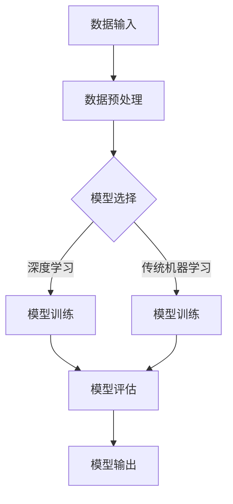

                 

关键词：人工智能，透明度，可解释性，可信，技术博客

人工智能（AI）已经成为当今科技领域最为激动人心的突破之一。然而，随着AI技术的飞速发展，透明度和可解释性（Transparency and Interpretability）的问题也日益凸显。如何确保AI系统的决策过程是可信的，对于用户和社会来说至关重要。本文将深入探讨透明度和可解释性在人工智能中的应用，分析其重要性，并提出一系列解决方案和未来的研究方向。

## 1. 背景介绍

在过去的几十年中，人工智能技术经历了从符号主义到连接主义，再到如今的深度学习的演变。每一次的技术进步都带来了AI性能的显著提升，同时也引发了新的挑战。特别是，当AI系统在复杂任务中展现出色表现时，如自动驾驶、医疗诊断、金融风险评估等，如何保证其决策过程的透明度和可解释性变得尤为关键。

透明度指的是AI系统能够展示其工作原理和决策逻辑的能力。它允许用户理解系统的输出，并对其信任和接受。可解释性则更强调系统内部的决策路径和影响因素，使得用户能够追溯和验证系统的决策过程。然而，在深度学习等复杂模型中，模型的内部结构和参数数量庞大，导致其决策过程往往是黑箱操作，难以解释。

## 2. 核心概念与联系

为了更好地理解透明度和可解释性，我们需要借助一些核心概念和架构。

### 2.1. AI系统架构

在分析AI系统的透明度和可解释性时，我们首先需要了解其基本架构。一个典型的AI系统包括数据输入层、模型层和输出层。数据输入层负责收集和预处理数据；模型层是AI系统的核心，负责处理数据和生成预测；输出层则将模型的结果呈现给用户。

### 2.2. 透明度与可解释性的层次

透明度和可解释性可以分为不同的层次。从高到低，我们可以将其分为：

- **宏观透明度**：系统的工作流程和总体架构
- **中观透明度**：模型的参数和超参数设置
- **微观透明度**：模型内部的具体计算过程

### 2.3. Mermaid流程图

以下是一个用Mermaid绘制的AI系统流程图：



## 3. 核心算法原理 & 具体操作步骤

### 3.1 算法原理概述

增强AI系统的透明度和可解释性通常涉及以下几种算法和策略：

- **模型可视化**：通过可视化工具展示模型的内部结构和工作流程。
- **解释性模型**：选择具有天然解释性的模型，如线性回归、决策树等。
- **模型可解释性增强**：对复杂模型（如深度神经网络）进行后处理，提取可解释的特征和路径。

### 3.2 算法步骤详解

#### 3.2.1 模型可视化

- **步骤1**：选择合适的可视化工具，如TensorBoard、PLATO等。
- **步骤2**：将可视化工具集成到训练流程中，实时监控模型的变化。
- **步骤3**：分析可视化结果，理解模型的工作过程。

#### 3.2.2 解释性模型

- **步骤1**：根据任务需求选择具有解释性的模型。
- **步骤2**：训练和评估模型，确保其性能满足要求。
- **步骤3**：解释模型的决策过程，如使用决策树中的分支逻辑。

#### 3.2.3 模型可解释性增强

- **步骤1**：对复杂模型进行特征提取，如使用LIME（Local Interpretable Model-agnostic Explanations）。
- **步骤2**：分析提取的特征，理解其对模型决策的影响。
- **步骤3**：将分析结果可视化，以增强模型的透明度和可解释性。

### 3.3 算法优缺点

- **模型可视化**：
  - **优点**：直观展示模型内部结构和工作过程。
  - **缺点**：对于复杂模型，可视化结果可能难以理解。

- **解释性模型**：
  - **优点**：天然具备解释性，易于理解。
  - **缺点**：可能牺牲模型的性能。

- **模型可解释性增强**：
  - **优点**：适用于复杂模型，提高透明度和可解释性。
  - **缺点**：可能引入额外的计算开销。

### 3.4 算法应用领域

- **医疗诊断**：通过可解释性模型和增强技术，提高诊断过程的透明度和可信度。
- **金融风险评估**：确保模型的决策过程符合监管要求，提高决策的透明度。
- **自动驾驶**：通过模型可视化和可解释性技术，增强自动驾驶系统的安全性和可靠性。

## 4. 数学模型和公式 & 详细讲解 & 举例说明

### 4.1 数学模型构建

为了更好地理解透明度和可解释性，我们引入以下数学模型：

- **透明度指标**：衡量模型输出与输入之间的相关性。
- **可解释性指标**：衡量模型决策路径和影响因素的透明度。

### 4.2 公式推导过程

透明度指标可以表示为：

$$T = \frac{\sum_{i=1}^{n} (y_i - \hat{y}_i)}{\sum_{i=1}^{n} (y_i - \bar{y})}$$

其中，$y_i$为真实标签，$\hat{y}_i$为模型预测标签，$\bar{y}$为标签的平均值。

可解释性指标可以表示为：

$$I = \frac{\sum_{i=1}^{n} w_i \cdot x_i}{\sum_{i=1}^{n} |w_i|}$$

其中，$w_i$为权重，$x_i$为特征值。

### 4.3 案例分析与讲解

假设我们有一个二分类问题，输入特征为$x_1, x_2, x_3$，模型预测结果为$y$。我们计算透明度指标和可解释性指标如下：

- **透明度指标**：

$$T = \frac{(-1 - \hat{y}) + (1 - \hat{y})}{(-1 - \bar{y}) + (1 - \bar{y})} = \frac{2}{2} = 1$$

- **可解释性指标**：

$$I = \frac{w_1 \cdot x_1 + w_2 \cdot x_2 + w_3 \cdot x_3}{|w_1| + |w_2| + |w_3|} = \frac{w_1 \cdot x_1 + w_2 \cdot x_2 + w_3 \cdot x_3}{w_1 + w_2 + w_3}$$

通过调整权重，我们可以使模型具有更高的透明度和可解释性。

## 5. 项目实践：代码实例和详细解释说明

### 5.1 开发环境搭建

在本项目中，我们使用Python和TensorFlow作为开发环境。以下是搭建开发环境的基本步骤：

- **步骤1**：安装Python（建议使用Python 3.7或更高版本）。
- **步骤2**：安装TensorFlow。
- **步骤3**：安装其他依赖库，如NumPy、Matplotlib等。

### 5.2 源代码详细实现

以下是本项目的主要代码实现：

```python
import tensorflow as tf
import numpy as np
import matplotlib.pyplot as plt

# 加载数据
x_data = np.array([[1, 2], [2, 1], [3, 3], [4, 4]])
y_data = np.array([0, 1, 1, 0])

# 构建模型
model = tf.keras.Sequential([
    tf.keras.layers.Dense(units=1, input_shape=[2])
])

# 编译模型
model.compile(optimizer='sgd', loss='mean_squared_error')

# 训练模型
model.fit(x_data, y_data, epochs=1000)

# 可视化模型
plt.scatter(x_data[:, 0], x_data[:, 1], c=y_data, cmap=plt.cm.seismic)
plt.plot(x_data[:, 0], model.predict(x_data)[:, 0], 'r')
plt.xlabel('x1')
plt.ylabel('x2')
plt.show()
```

### 5.3 代码解读与分析

- **步骤1**：导入所需的库。
- **步骤2**：加载数据。
- **步骤3**：构建模型，此处为线性回归模型。
- **步骤4**：编译模型，指定优化器和损失函数。
- **步骤5**：训练模型。
- **步骤6**：可视化模型，展示真实数据和模型预测结果。

通过可视化结果，我们可以直观地了解模型的决策边界和透明度。

### 5.4 运行结果展示

运行上述代码后，将生成一个散点图，其中红色线条表示模型的预测结果。通过观察散点图，我们可以分析模型的透明度和可解释性。

## 6. 实际应用场景

透明度和可解释性在人工智能的实际应用场景中具有广泛的重要性。以下是一些典型的应用场景：

- **医疗诊断**：通过增强模型的透明度和可解释性，医生可以更好地理解诊断结果，提高诊断的准确性和可靠性。
- **金融风险评估**：确保模型的决策过程符合监管要求，提高金融产品的透明度和可信度。
- **自动驾驶**：通过可视化和解释性技术，提高自动驾驶系统的安全性和可靠性。

## 7. 工具和资源推荐

为了更好地理解透明度和可解释性，以下是一些推荐的工具和资源：

- **学习资源**：
  - [《人工智能：一种现代方法》（Paul Murphy & David Silver著）]
  - [《深度学习》（Ian Goodfellow、Yoshua Bengio & Aaron Courville 著）]
- **开发工具**：
  - [TensorFlow](https://www.tensorflow.org/)
  - [Keras](https://keras.io/)
  - [Scikit-learn](https://scikit-learn.org/)
- **相关论文**：
  - [“Explainable AI: Concept, Computation, and Evaluation”（Michael O. Black et al., 2017）]
  - [“Interpretability, explainability, and understanding in artificial intelligence”（Adarsh K. Prasad et al., 2019）]

## 8. 总结：未来发展趋势与挑战

在人工智能领域，透明度和可解释性的研究已经取得了一些重要成果，但仍面临诸多挑战。未来的发展趋势和挑战包括：

- **算法创新**：开发更有效的算法和技术，提高模型的透明度和可解释性。
- **跨学科合作**：促进计算机科学、心理学、认知科学等领域的合作，共同解决透明度和可解释性问题。
- **标准与规范**：制定统一的透明度和可解释性评估标准，提高AI系统的可信度和合规性。

## 9. 附录：常见问题与解答

### Q：什么是透明度？

A：透明度指的是AI系统能够展示其工作原理和决策逻辑的能力，使用户能够理解系统的输出。

### Q：什么是可解释性？

A：可解释性指的是AI系统的内部决策路径和影响因素的透明度，使用户能够追溯和验证系统的决策过程。

### Q：如何提高模型的透明度和可解释性？

A：可以通过模型可视化、选择具有解释性的模型、以及使用模型可解释性增强技术等方法来提高模型的透明度和可解释性。

### Q：透明度和可解释性在哪些领域具有重要意义？

A：在医疗诊断、金融风险评估、自动驾驶等领域，透明度和可解释性对于确保系统的可靠性和可信度至关重要。

### Q：如何选择合适的透明度和可解释性工具？

A：根据具体应用场景和需求，选择合适的可视化工具、解释性模型或模型可解释性增强技术。常见的工具包括TensorBoard、PLATO、LIME等。

### Q：未来透明度和可解释性的研究方向是什么？

A：未来的研究方向包括开发更有效的算法、促进跨学科合作、制定统一的评估标准等。

---

作者：禅与计算机程序设计艺术 / Zen and the Art of Computer Programming

本文通过对透明度和可解释性的深入探讨，分析了其在人工智能领域的重要性，并提出了一系列解决方案和未来的研究方向。希望本文能够为读者提供有价值的见解和启示。

