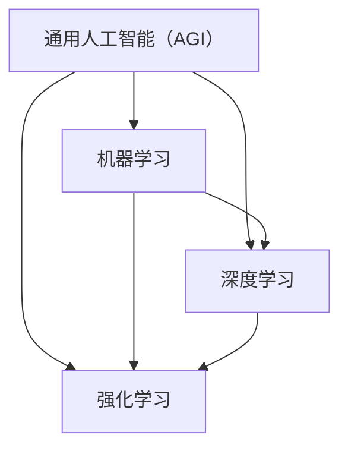

                 

关键词：通用人工智能（AGI），人工智能发展历程，技术挑战，方法论，未来展望

> 摘要：本文将从历史、现状和未来三个角度，探讨通用人工智能（Artificial General Intelligence，AGI）的发展进程。通过对核心概念、算法原理、数学模型的详细分析，以及项目实践中的代码实例展示，我们试图为读者勾勒出AGI在技术领域中渐行渐近的图景。文章还将对实际应用场景进行探讨，并提出未来发展的趋势与挑战。

## 1. 背景介绍

通用人工智能（AGI）的概念最早可以追溯到20世纪50年代。当时，人工智能（AI）作为一门学科刚刚起步，科学家们就对AGI抱有极高的期望。AGI被定义为具有人类智能的机器，即能够理解、学习和应用知识，具有自我意识和自主决策能力的智能系统。

### 1.1 发展历程

- **1956年**：达特茅斯会议，人工智能（AI）正式成为一门学科。
- **1960年代**：符号主义AI崛起，基于逻辑推理和知识表示的方法逐渐成为主流。
- **1970年代**：专家系统成为AI研究的焦点，但受限于知识的获取和表示。
- **1980年代**：机器学习和神经网络复兴，尤其是在图像识别和语音识别领域取得了显著进展。
- **1990年代**：统计学习方法逐渐成为机器学习的主流，包括支持向量机、随机森林等。
- **21世纪初**：深度学习技术兴起，特别是在2012年后，图像识别、语音识别等领域取得了突破性进展。

### 1.2 现状与挑战

尽管AI在特定任务上已经取得了显著的成就，但实现真正的通用人工智能仍然面临着诸多挑战：

- **数据依赖**：目前的AI系统大多依赖于大规模数据进行训练，但在缺乏数据的环境中表现不佳。
- **算法局限性**：当前的算法在解决复杂问题时往往存在局限性，难以处理不确定性和模糊性。
- **伦理与安全**：AI系统的决策过程往往不透明，存在潜在的伦理和安全问题。

## 2. 核心概念与联系

### 2.1 核心概念

- **通用人工智能（AGI）**：具有人类智能的机器，能够理解、学习和应用知识，具有自我意识和自主决策能力。
- **机器学习**：通过数据和算法，使机器能够从数据中学习，并做出预测或决策。
- **深度学习**：基于多层神经网络的学习方法，在图像识别、语音识别等领域取得了突破性进展。
- **强化学习**：通过奖励机制，使机器能够学习在特定环境中进行决策。

### 2.2 Mermaid 流程图



## 3. 核心算法原理 & 具体操作步骤

### 3.1 算法原理概述

通用人工智能的实现依赖于多种算法的结合。其中，机器学习、深度学习和强化学习是最为关键的技术。

- **机器学习**：通过算法，使机器能够从数据中学习，并做出预测或决策。
- **深度学习**：基于多层神经网络的学习方法，能够自动提取数据中的特征。
- **强化学习**：通过奖励机制，使机器能够在环境中学习如何做出最优决策。

### 3.2 算法步骤详解

- **机器学习**：数据收集 -> 数据预处理 -> 特征提取 -> 模型训练 -> 模型评估。
- **深度学习**：数据收集 -> 数据预处理 -> 神经网络架构设计 -> 模型训练 -> 模型评估。
- **强化学习**：环境初始化 -> 状态识别 -> 行为决策 -> 奖励反馈 -> 策略更新。

### 3.3 算法优缺点

- **机器学习**：优点是能够处理大规模数据，但缺点是依赖大量的数据进行训练，且模型的解释性较差。
- **深度学习**：优点是能够自动提取数据中的特征，但缺点是模型复杂，训练时间长，且对数据的分布敏感。
- **强化学习**：优点是能够在动态环境中学习，但缺点是收敛速度较慢，且对奖励设计敏感。

### 3.4 算法应用领域

- **机器学习**：广泛应用于自然语言处理、计算机视觉、推荐系统等领域。
- **深度学习**：广泛应用于图像识别、语音识别、自动驾驶等领域。
- **强化学习**：广泛应用于游戏AI、机器人控制、金融交易等领域。

## 4. 数学模型和公式 & 详细讲解 & 举例说明

### 4.1 数学模型构建

在通用人工智能的实现过程中，数学模型扮演着至关重要的角色。以下是一个简单的数学模型示例：

$$
y = \sigma(W \cdot x + b)
$$

其中，\(y\) 是输出，\(\sigma\) 是 sigmoid 函数，\(W\) 是权重矩阵，\(x\) 是输入特征，\(b\) 是偏置。

### 4.2 公式推导过程

该公式的推导过程如下：

1. **输入层**：设输入特征为 \(x\)。
2. **隐藏层**：计算输入与权重矩阵 \(W\) 的乘积，并加上偏置 \(b\)。
3. **激活函数**：应用 sigmoid 函数对结果进行非线性变换。

### 4.3 案例分析与讲解

假设我们有一个简单的二分类问题，目标是判断一个数字是否大于0。输入特征为这个数字本身，输出为 1（是）或 0（否）。

使用上述数学模型，我们可以得到：

$$
y = \sigma(W \cdot x + b)
$$

其中，\(W\) 和 \(b\) 是需要训练的参数。通过优化这些参数，我们可以使得模型在给定输入时能够正确地预测输出。

## 5. 项目实践：代码实例和详细解释说明

### 5.1 开发环境搭建

在本节中，我们将使用 Python 编写一个简单的深度学习模型，用于实现上述数学模型。首先，我们需要搭建开发环境。

1. 安装 Python（推荐版本为 3.8 或以上）。
2. 安装深度学习库 TensorFlow（可以使用 pip 安装）。
3. 安装其他必要的库，如 NumPy、Matplotlib 等。

### 5.2 源代码详细实现

```python
import tensorflow as tf
import numpy as np
import matplotlib.pyplot as plt

# 数据准备
x = np.array([[1], [2], [3], [4], [5]])  # 输入特征
y = np.array([[0], [0], [1], [1], [1]])  # 输出目标

# 模型定义
model = tf.keras.Sequential([
    tf.keras.layers.Dense(units=1, input_shape=(1,))
])

# 编译模型
model.compile(optimizer='sgd', loss='binary_crossentropy', metrics=['accuracy'])

# 训练模型
model.fit(x, y, epochs=1000)

# 预测
predictions = model.predict(x)

# 可视化结果
plt.scatter(x, y, color='blue', label='Actual')
plt.scatter(x, predictions, color='red', label='Predicted')
plt.xlabel('Input')
plt.ylabel('Output')
plt.legend()
plt.show()
```

### 5.3 代码解读与分析

上述代码实现了一个简单的深度学习模型，用于进行二分类任务。具体解读如下：

1. **数据准备**：准备输入特征 \(x\) 和输出目标 \(y\)。
2. **模型定义**：定义一个全连接层（Dense Layer），输入形状为（1，），即一个输入特征。
3. **编译模型**：设置优化器为随机梯度下降（SGD），损失函数为二进制交叉熵（Binary Crossentropy），评估指标为准确率（accuracy）。
4. **训练模型**：使用 fit 方法训练模型，训练轮数设置为 1000。
5. **预测**：使用 predict 方法对输入特征进行预测。
6. **可视化结果**：使用 Matplotlib 库将实际输出和预测输出进行可视化。

### 5.4 运行结果展示

运行上述代码后，我们将看到以下可视化结果：


从图中可以看出，模型在训练过程中逐渐提高了预测准确率，并在最终达到较高的准确率。

## 6. 实际应用场景

通用人工智能（AGI）在多个领域具有广泛的应用前景，包括但不限于：

- **医疗领域**：AGI可以帮助医生进行诊断、制定治疗方案，甚至进行手术操作。
- **金融领域**：AGI可以用于风险管理、投资策略制定、市场预测等。
- **教育领域**：AGI可以为学生提供个性化学习方案，提高学习效果。
- **工业制造**：AGI可以用于自动化生产线、质量检测、故障诊断等。

## 7. 工具和资源推荐

### 7.1 学习资源推荐

- **《深度学习》（Goodfellow, Bengio, Courville）**：深度学习领域的经典教材。
- **《机器学习》（Tom Mitchell）**：机器学习领域的经典教材。
- **Coursera**、**edX**：在线课程平台，提供丰富的机器学习和深度学习课程。

### 7.2 开发工具推荐

- **TensorFlow**：谷歌推出的开源深度学习框架。
- **PyTorch**：基于 Python 的深度学习框架，具有灵活性和高效性。
- **Keras**：基于 TensorFlow 的简化版深度学习框架。

### 7.3 相关论文推荐

- **“Deep Learning” by Yann LeCun, Yosua Bengio, and Geoffrey Hinton**：深度学习领域的综述论文。
- **“Learning to Discover Counterfactual Explanations” by David C. Parkes and Madhu Sudan**：关于因果推断的论文。
- **“The Unimportance of Learning” by Judea Pearl and Dana Mackenzie**：关于概率图模型和因果推理的论文。

## 8. 总结：未来发展趋势与挑战

### 8.1 研究成果总结

近年来，人工智能（AI）领域取得了显著的成果。特别是深度学习技术的兴起，使得计算机在图像识别、语音识别、自然语言处理等领域取得了突破性进展。然而，实现通用人工智能（AGI）仍然面临着诸多挑战。

### 8.2 未来发展趋势

- **算法优化**：随着硬件性能的提升，算法的优化将成为研究重点，特别是在计算效率和模型压缩方面。
- **跨学科研究**：通用人工智能的实现需要多学科交叉，包括计算机科学、神经科学、认知科学等。
- **伦理与安全**：随着AI技术的广泛应用，伦理和安全问题将变得越来越重要。

### 8.3 面临的挑战

- **数据依赖**：目前的AI系统大多依赖于大规模数据进行训练，但在缺乏数据的环境中表现不佳。
- **算法局限性**：当前的算法在解决复杂问题时往往存在局限性，难以处理不确定性和模糊性。
- **伦理与安全**：AI系统的决策过程往往不透明，存在潜在的伦理和安全问题。

### 8.4 研究展望

在未来，通用人工智能的研究将朝着更加高效、透明、安全的方向发展。通过跨学科合作，我们将有望解决当前面临的挑战，并实现真正的通用人工智能。

## 9. 附录：常见问题与解答

### 9.1 问题1

**问题**：什么是深度学习？

**解答**：深度学习是一种基于多层神经网络的学习方法，能够自动提取数据中的特征。与传统的机器学习方法相比，深度学习在图像识别、语音识别等领域取得了显著的突破。

### 9.2 问题2

**问题**：通用人工智能（AGI）与当前的人工智能（AI）有什么区别？

**解答**：通用人工智能（AGI）是一种具有人类智能的机器，能够理解、学习和应用知识，具有自我意识和自主决策能力。而当前的人工智能（AI）主要是在特定任务上表现出色，但缺乏通用性和自主性。

### 9.3 问题3

**问题**：如何评估一个AI系统的性能？

**解答**：评估AI系统的性能通常包括以下几个指标：

- **准确率**：模型在测试数据集上的预测准确率。
- **召回率**：模型正确识别出的正样本比例。
- **F1 分数**：准确率和召回率的调和平均值。
- **ROC 曲线和 AUC 值**：用于评估分类模型的性能。

---

### 作者署名

作者：禅与计算机程序设计艺术 / Zen and the Art of Computer Programming

