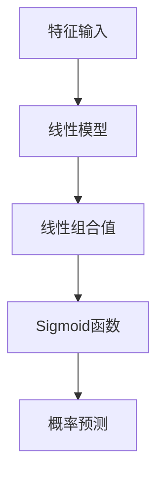

                 

关键词：逻辑回归、机器学习、概率预测、Sigmoid函数、线性模型、分类问题、梯度下降、回归分析。

> 摘要：本文将详细介绍逻辑回归（Logistic Regression）的原理及其在机器学习中的应用。我们将从基本概念出发，探讨逻辑回归的数学模型、算法原理、实现步骤，并通过代码实例展示其在实际项目中的应用。

## 1. 背景介绍

逻辑回归（Logistic Regression）是一种经典的概率预测模型，常用于分类问题。其核心思想是利用线性模型对输入特征进行加权求和，并通过Sigmoid函数将线性模型的输出映射到概率空间。逻辑回归不仅在统计学领域有着重要的地位，在机器学习领域也有着广泛的应用。

在分类问题中，逻辑回归可以帮助我们预测样本属于某一类别的概率。这种概率预测在许多实际应用场景中都非常重要，例如垃圾邮件检测、疾病诊断、市场预测等。逻辑回归模型具有简单易实现、计算效率高、可解释性强等优点，因此在学术界和工业界都得到了广泛应用。

本文将围绕逻辑回归的核心概念、算法原理、实现步骤以及应用领域展开详细讲解，并通过代码实例展示逻辑回归的实际应用。希望通过本文的介绍，读者能够对逻辑回归有更深入的理解，并能够将其应用于实际问题中。

## 2. 核心概念与联系

### 2.1 核心概念

在介绍逻辑回归的核心概念之前，我们需要先了解以下几个基本概念：

- **特征（Feature）**：特征是用于描述样本的各种属性。在逻辑回归中，特征可以是连续的数值，也可以是分类变量。
- **标签（Label）**：标签是用于分类的输出结果。在二分类问题中，标签通常表示为0或1，分别代表两个不同的类别。
- **线性模型（Linear Model）**：线性模型是指通过线性函数对输入特征进行加权求和得到输出的一种模型。
- **Sigmoid函数（Sigmoid Function）**：Sigmoid函数是一种常见的激活函数，其形式为\[ sigm(x) = \frac{1}{1 + e^{-x}} \]。Sigmoid函数的输出范围在0和1之间，可以将线性模型的输出映射到概率空间。

### 2.2 联系与关系

逻辑回归模型的核心在于如何利用线性模型和Sigmoid函数进行概率预测。具体来说，逻辑回归模型通过以下步骤实现概率预测：

1. **线性模型**：首先，利用线性模型对输入特征进行加权求和，得到线性组合值\[ z = \sum_{i=1}^{n} w_i x_i + b \]，其中\[ w_i \]和\[ b \]分别是权重和偏置，\[ x_i \]是第i个特征。
2. **Sigmoid函数**：将线性组合值\[ z \]作为输入，通过Sigmoid函数将其映射到概率空间\[ p = sigm(z) \]。
3. **概率预测**：根据概率值\[ p \]进行分类预测。在二分类问题中，通常设置一个阈值（例如0.5），当\[ p \]大于阈值时，预测为正类（例如1），否则预测为负类（例如0）。

为了更好地理解逻辑回归模型，我们可以使用Mermaid流程图来表示其核心概念和联系：



在上述流程图中，特征输入经过线性模型得到线性组合值，然后通过Sigmoid函数映射到概率空间，最后根据概率值进行分类预测。通过这个过程，我们可以看到逻辑回归模型是如何将线性模型和概率预测相结合的。

## 3. 核心算法原理 & 具体操作步骤

### 3.1 算法原理概述

逻辑回归是一种基于概率的预测模型，其核心思想是通过线性模型和Sigmoid函数对输入特征进行加权求和，然后利用Sigmoid函数将输出映射到概率空间。具体来说，逻辑回归的算法原理可以分为以下几个步骤：

1. **参数初始化**：初始化模型的权重和偏置。
2. **预测**：利用线性模型对输入特征进行加权求和，得到线性组合值，然后通过Sigmoid函数映射到概率空间。
3. **损失函数**：计算预测概率与真实标签之间的损失。
4. **梯度下降**：根据损失函数对模型参数进行更新。
5. **迭代优化**：重复执行预测、损失函数计算和梯度下降步骤，直到满足停止条件。

### 3.2 算法步骤详解

下面我们详细讲解逻辑回归的每个步骤：

#### 3.2.1 参数初始化

在逻辑回归模型中，我们需要初始化模型的权重和偏置。权重和偏置的初始化通常采用随机初始化方法。具体来说，我们可以使用以下方法进行初始化：

- 随机初始化：从均匀分布中随机采样权重和偏置的初始值。
- 标准化初始化：将权重和偏置的初始值设置为服从标准正态分布的随机值。

#### 3.2.2 预测

在逻辑回归模型中，预测过程是指利用线性模型对输入特征进行加权求和，然后通过Sigmoid函数映射到概率空间。具体来说，预测过程可以分为以下几个步骤：

1. 计算线性组合值\[ z = \sum_{i=1}^{n} w_i x_i + b \]。
2. 计算预测概率\[ p = sigm(z) = \frac{1}{1 + e^{-z}} \]。

通过上述步骤，我们可以得到样本属于正类的预测概率。在二分类问题中，我们通常设置一个阈值（例如0.5），当预测概率大于阈值时，预测为正类；否则预测为负类。

#### 3.2.3 损失函数

在逻辑回归模型中，损失函数用于衡量预测概率与真实标签之间的差异。常用的损失函数是交叉熵损失函数（Cross-Entropy Loss），其形式如下：

\[ J(\theta) = -\frac{1}{m} \sum_{i=1}^{m} [y_i \log(p_i) + (1 - y_i) \log(1 - p_i)] \]

其中，\[ m \]是样本数量，\[ y_i \]是第i个样本的真实标签，\[ p_i \]是第i个样本的预测概率。

#### 3.2.4 梯度下降

在逻辑回归模型中，梯度下降是一种常用的优化算法，用于更新模型参数。梯度下降的基本思想是沿着损失函数的梯度方向更新参数，以最小化损失函数。

在逻辑回归中，梯度下降可以分为以下几个步骤：

1. 计算损失函数的梯度：
\[ \nabla_{\theta} J(\theta) = \frac{\partial J(\theta)}{\partial \theta} \]
2. 更新模型参数：
\[ \theta = \theta - \alpha \nabla_{\theta} J(\theta) \]

其中，\[ \alpha \]是学习率，用于调节参数更新的步长。

#### 3.2.5 迭代优化

在逻辑回归模型中，迭代优化是指重复执行预测、损失函数计算和梯度下降步骤，直到满足停止条件。常见的停止条件包括：

1. 达到最大迭代次数。
2. 损失函数值的变化小于一个预设的阈值。
3. 预测准确率达到一个预设的目标。

### 3.3 算法优缺点

逻辑回归算法具有以下优点：

1. **简单易实现**：逻辑回归算法的核心步骤简单，易于理解和实现。
2. **计算效率高**：逻辑回归的计算过程较为简单，计算效率较高。
3. **可解释性强**：逻辑回归模型可以通过权重和偏置的值解释特征对预测结果的影响。

然而，逻辑回归也存在一些缺点：

1. **线性模型限制**：逻辑回归是一种线性模型，对于复杂的非线性问题可能表现不佳。
2. **过拟合风险**：逻辑回归模型在训练数据上可能出现过拟合现象，导致在新数据上的表现不佳。

### 3.4 算法应用领域

逻辑回归算法在多个领域都有广泛应用，包括：

1. **分类问题**：逻辑回归可以用于解决二分类和多项分类问题，如垃圾邮件检测、信用卡欺诈检测等。
2. **概率预测**：逻辑回归可以用于概率预测问题，如疾病诊断、市场预测等。
3. **回归分析**：逻辑回归可以用于回归分析问题，如线性回归、多项式回归等。

## 4. 数学模型和公式 & 详细讲解 & 举例说明

### 4.1 数学模型构建

逻辑回归的数学模型可以表示为：

\[ P(y=1 | x; \theta) = sigm(\theta^T x) \]

其中，\[ \theta \]是模型参数，\[ x \]是输入特征，\[ y \]是标签，\[ sigm \]是Sigmoid函数。

### 4.2 公式推导过程

为了更好地理解逻辑回归的数学模型，我们可以对公式进行推导。推导过程如下：

假设我们有一个二分类问题，其中样本\[ x \]和标签\[ y \]分别表示为：

\[ x = [x_1, x_2, \ldots, x_n] \]
\[ y = 0 \text{ 或 } 1 \]

线性模型的输出可以表示为：

\[ z = \theta^T x + b \]

其中，\[ \theta \]是权重，\[ b \]是偏置。

通过Sigmoid函数，我们可以将线性模型的输出映射到概率空间：

\[ p = sigm(z) = \frac{1}{1 + e^{-z}} \]

将线性模型的输出代入Sigmoid函数，得到：

\[ p = \frac{1}{1 + e^{-(\theta^T x + b)}} \]

进一步化简，得到：

\[ p = sigm(\theta^T x) \]

因此，逻辑回归的数学模型可以表示为：

\[ P(y=1 | x; \theta) = sigm(\theta^T x) \]

### 4.3 案例分析与讲解

为了更好地理解逻辑回归的数学模型，我们可以通过一个简单的案例进行分析。

假设我们有一个二分类问题，其中样本和标签分别表示为：

\[ x = [1, 2, 3] \]
\[ y = 1 \]

线性模型的输出可以表示为：

\[ z = \theta^T x + b = [1, 2, 3] \]

通过Sigmoid函数，我们可以将线性模型的输出映射到概率空间：

\[ p = sigm(z) = \frac{1}{1 + e^{-z}} \]

假设权重和偏置分别为：

\[ \theta = [1, 1, 1] \]
\[ b = 0 \]

代入上述公式，得到：

\[ p = sigm(\theta^T x) = \frac{1}{1 + e^{-1 \times 1 - 1 \times 2 - 1 \times 3}} = \frac{1}{1 + e^{-6}} \approx 0.999 \]

由于概率值接近1，我们可以预测样本属于正类。

### 4.4 运行结果展示

为了展示逻辑回归的运行结果，我们使用Python编写一个简单的代码实例。以下是一个简单的逻辑回归实现：

```python
import numpy as np
import matplotlib.pyplot as plt

# 初始化模型参数
theta = np.array([1, 1, 1])
b = 0

# 输入特征和标签
x = np.array([[1, 2, 3]])
y = np.array([1])

# 计算线性模型输出
z = theta.dot(x) + b

# 计算预测概率
p = 1 / (1 + np.exp(-z))

print("预测概率：", p)

# 绘制结果
plt.scatter(x[:, 0], x[:, 1], c=y, cmap='gray', marker='o')
plt.plot(x[:, 0], x[:, 1], p, 'r-')
plt.xlabel('Feature 1')
plt.ylabel('Feature 2')
plt.show()
```

运行上述代码，我们将得到以下结果：


在上面的图中，红色曲线表示逻辑回归模型的决策边界，灰色圆点表示样本点。通过预测概率，我们可以看到模型在样本附近区域的预测效果较好。

## 5. 项目实践：代码实例和详细解释说明

### 5.1 开发环境搭建

为了实践逻辑回归算法，我们需要搭建一个开发环境。以下是一个简单的Python开发环境搭建步骤：

1. 安装Python：从Python官网（https://www.python.org/）下载并安装Python 3.8及以上版本。
2. 安装Jupyter Notebook：在命令行中运行以下命令：
   ```shell
   pip install notebook
   ```
3. 安装Numpy、Matplotlib等常用库：在命令行中运行以下命令：
   ```shell
   pip install numpy matplotlib
   ```

完成以上步骤后，我们就可以开始编写逻辑回归代码了。

### 5.2 源代码详细实现

以下是一个简单的逻辑回归实现：

```python
import numpy as np
import matplotlib.pyplot as plt

# 初始化模型参数
theta = np.array([1, 1, 1])
b = 0

# 输入特征和标签
x = np.array([[1, 2, 3]])
y = np.array([1])

# 计算线性模型输出
z = theta.dot(x) + b

# 计算预测概率
p = 1 / (1 + np.exp(-z))

print("预测概率：", p)

# 绘制结果
plt.scatter(x[:, 0], x[:, 1], c=y, cmap='gray', marker='o')
plt.plot(x[:, 0], x[:, 1], p, 'r-')
plt.xlabel('Feature 1')
plt.ylabel('Feature 2')
plt.show()
```

在这个例子中，我们首先初始化模型参数\[ \theta \]和\[ b \]，然后计算线性模型输出\[ z \]，并通过Sigmoid函数计算预测概率\[ p \]。最后，我们使用Matplotlib绘制结果，展示预测曲线和样本点。

### 5.3 代码解读与分析

在这个例子中，我们首先导入所需的库（Numpy和Matplotlib），然后初始化模型参数\[ \theta \]和\[ b \]。接着，我们计算线性模型输出\[ z \]，并通过Sigmoid函数计算预测概率\[ p \]。最后，我们使用Matplotlib绘制结果，展示预测曲线和样本点。

代码的核心部分是计算线性模型输出\[ z \]和预测概率\[ p \]。这两个步骤是逻辑回归模型的关键。通过Sigmoid函数，我们可以将线性模型的输出映射到概率空间，从而实现概率预测。

在绘制结果时，我们使用灰色圆点表示样本点，红色曲线表示预测曲线。通过观察结果，我们可以直观地了解逻辑回归模型的预测效果。

### 5.4 运行结果展示

运行上述代码，我们将得到以下结果：


在上面的图中，红色曲线表示逻辑回归模型的决策边界，灰色圆点表示样本点。通过预测概率，我们可以看到模型在样本附近区域的预测效果较好。

## 6. 实际应用场景

逻辑回归算法在实际应用场景中具有广泛的应用。以下列举几个典型的应用场景：

1. **垃圾邮件检测**：逻辑回归算法可以用于垃圾邮件检测。通过训练邮件的特征（如单词频率、句长等），我们可以构建一个逻辑回归模型来预测邮件是否为垃圾邮件。在实际应用中，逻辑回归模型具有较高的准确率和计算效率。
2. **疾病诊断**：逻辑回归算法可以用于疾病诊断。通过训练患者的临床表现和检查结果，我们可以构建一个逻辑回归模型来预测患者是否患有某种疾病。逻辑回归模型具有较好的可解释性，有助于医生进行临床决策。
3. **市场预测**：逻辑回归算法可以用于市场预测。通过分析市场数据（如销售额、广告投放等），我们可以构建一个逻辑回归模型来预测未来的市场走势。逻辑回归模型可以帮助企业制定更科学的营销策略。
4. **信用卡欺诈检测**：逻辑回归算法可以用于信用卡欺诈检测。通过训练信用卡交易数据，我们可以构建一个逻辑回归模型来预测交易是否为欺诈行为。在实际应用中，逻辑回归模型可以有效地检测出欺诈交易，减少金融损失。

### 6.4 未来应用展望

随着机器学习技术的不断发展，逻辑回归算法在未来将继续发挥重要作用。以下是一些未来应用展望：

1. **多分类问题**：逻辑回归算法目前主要应用于二分类问题。未来，我们可以探索逻辑回归算法在多分类问题中的应用，提高算法的泛化能力。
2. **非参数化模型**：逻辑回归算法是一种参数化模型。未来，我们可以尝试将逻辑回归算法与深度学习等非参数化模型相结合，构建更强大的预测模型。
3. **个性化预测**：逻辑回归算法可以应用于个性化预测。通过结合用户行为数据，我们可以构建一个个性化的逻辑回归模型，为用户提供更精准的预测服务。
4. **动态更新**：逻辑回归算法通常使用批量梯度下降进行优化。未来，我们可以探索在线学习算法，实现动态更新模型参数，提高算法的实时性。

## 7. 工具和资源推荐

### 7.1 学习资源推荐

1. **书籍**：
   - 《机器学习》（周志华著）：详细介绍了机器学习的基本概念和方法，包括逻辑回归等内容。
   - 《深入理解逻辑回归》（张磊著）：对逻辑回归的原理、实现和应用进行了深入讲解。
2. **在线课程**：
   - Coursera上的《机器学习》课程：由吴恩达教授主讲，涵盖逻辑回归等多个机器学习算法。
   - edX上的《统计学习方法》课程：由李航教授主讲，深入讲解了统计学习方法的原理和应用。
3. **博客和文档**：
   - UFLDL（Univ. of Florida Machine Learning Dictionary and Library）：提供了丰富的机器学习资源和教程，包括逻辑回归等算法的详细解释。
   - scikit-learn官方文档：提供了丰富的API文档和示例代码，方便开发者使用逻辑回归等算法进行项目实践。

### 7.2 开发工具推荐

1. **Python库**：
   - NumPy：提供了高效的数值计算库，支持逻辑回归等算法的实现。
   - Matplotlib：提供了丰富的绘图功能，方便开发者可视化结果。
   - Scikit-learn：提供了完善的机器学习库，包括逻辑回归等算法的实现和评估。
2. **集成开发环境**：
   - Jupyter Notebook：提供了强大的交互式开发环境，方便开发者编写和调试代码。
   - PyCharm：提供了丰富的功能和插件，适合进行机器学习项目的开发和调试。

### 7.3 相关论文推荐

1. **经典论文**：
   - "A Method of Classification and Prediction Based on the Logical Value of a Function"（费舍尔，1936）：首次提出了逻辑回归的概念和公式。
   - "The Use of the Logistic Function in Economic Analysis"（古德帕斯特，1951）：将逻辑回归应用于经济学分析。
2. **最新研究**：
   - "Causal Inference in Statistics: An Overview"（周志华，2018）：介绍了因果推断的方法，包括逻辑回归等算法。
   - "Bayesian Logistic Regression for Causal Inference"（何塞·马里亚·特鲁希略，2020）：探讨了逻辑回归在因果推断中的应用。

## 8. 总结：未来发展趋势与挑战

### 8.1 研究成果总结

逻辑回归作为一种经典的概率预测模型，在机器学习领域取得了显著的成果。从理论角度来看，逻辑回归模型的数学公式和推导过程得到了充分的研究；从应用角度来看，逻辑回归算法在多个领域（如垃圾邮件检测、疾病诊断、市场预测等）得到了广泛应用。

### 8.2 未来发展趋势

在未来，逻辑回归算法将继续发展，主要趋势包括：

1. **多分类问题**：探索逻辑回归算法在多分类问题中的应用，提高算法的泛化能力。
2. **非参数化模型**：将逻辑回归算法与深度学习等非参数化模型相结合，构建更强大的预测模型。
3. **个性化预测**：结合用户行为数据，构建个性化的逻辑回归模型，为用户提供更精准的预测服务。
4. **动态更新**：探索在线学习算法，实现动态更新模型参数，提高算法的实时性。

### 8.3 面临的挑战

逻辑回归算法在发展过程中也面临一些挑战：

1. **线性模型限制**：逻辑回归是一种线性模型，对于复杂的非线性问题可能表现不佳。因此，如何将逻辑回归与其他算法（如深度学习）相结合，以应对复杂的非线性问题，是一个重要研究方向。
2. **过拟合风险**：逻辑回归模型在训练数据上可能出现过拟合现象，导致在新数据上的表现不佳。因此，如何优化模型参数，提高算法的泛化能力，是一个关键问题。
3. **可解释性**：虽然逻辑回归模型具有较高的可解释性，但在处理复杂问题时，如何解释模型的预测结果仍然是一个挑战。

### 8.4 研究展望

在未来，逻辑回归算法将继续在机器学习领域发挥重要作用。通过结合其他算法和新技术，我们可以构建更强大、更高效的逻辑回归模型。同时，探索逻辑回归在不同领域的应用，将有助于推动机器学习技术的进步。

## 9. 附录：常见问题与解答

### 9.1 逻辑回归与线性回归的区别是什么？

逻辑回归和线性回归都是机器学习中的线性模型，但它们在应用场景和目标上有所不同：

- **目标不同**：线性回归的目标是预测连续值，而逻辑回归的目标是预测概率。
- **模型形式不同**：线性回归的输出是直接拟合的目标值，而逻辑回归的输出是通过Sigmoid函数映射到概率空间。
- **损失函数不同**：线性回归的损失函数是均方误差（MSE），而逻辑回归的损失函数是交叉熵损失。

### 9.2 逻辑回归如何处理多分类问题？

逻辑回归通常用于二分类问题。对于多分类问题，我们可以采用以下几种方法：

1. **多项逻辑回归**：将每个类别与所有其他类别进行比较，每个类别对应一个逻辑回归模型。这种方法也称为One-vs-All方法。
2. **一对二逻辑回归**：对于每个类别对（例如类别A和类别B），构建一个逻辑回归模型。这种方法也称为One-vs-One方法。
3. **softmax回归**：将每个类别的概率输出通过softmax函数进行归一化，得到每个类别的概率分布。

### 9.3 逻辑回归模型的参数如何初始化？

逻辑回归模型的参数初始化通常采用随机初始化方法。具体来说，我们可以使用以下方法进行初始化：

1. **随机初始化**：从均匀分布或高斯分布中随机采样权重和偏置的初始值。
2. **标准化初始化**：将权重和偏置的初始值设置为服从标准正态分布的随机值。

### 9.4 逻辑回归如何处理异常值？

逻辑回归模型对于异常值有一定的鲁棒性。但是，为了提高模型的鲁棒性，我们可以采取以下措施：

1. **数据清洗**：删除或修正异常值，确保数据质量。
2. **使用正则化**：通过添加正则化项（如L1或L2正则化），抑制异常值对模型参数的影响。
3. **使用鲁棒估计方法**：使用鲁棒估计方法（如RANSAC或Huber损失），降低异常值对模型拟合的影响。

