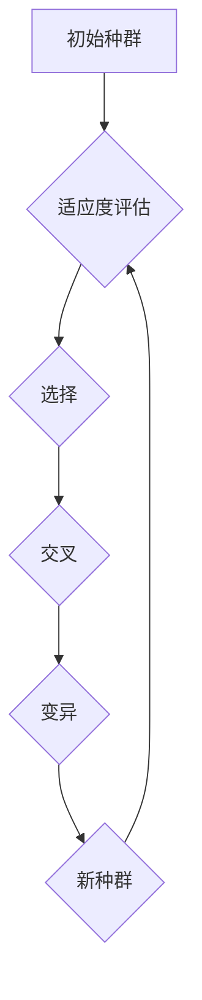

                 

关键词：遗传算法，进化计算，自然选择，交叉，变异，编码，适应度函数，Python实现

摘要：遗传算法（Genetic Algorithms，GA）是一种模拟自然选择和遗传学原理的搜索算法，广泛应用于优化问题和搜索问题。本文将详细介绍遗传算法的基本原理、核心步骤、数学模型和Python实现，并通过具体案例进行分析，帮助读者理解和掌握遗传算法。

## 1. 背景介绍

遗传算法起源于20世纪70年代，由美国计算机科学家John Holland提出。遗传算法的灵感来源于生物界的自然选择和遗传学原理。生物种群在进化过程中，通过遗传、变异和自然选择，不断优化自身特征，以适应环境的变化。遗传算法借鉴了这一过程，通过模拟生物进化来求解复杂的优化问题。

### 1.1 遗传算法的发展

- 1975年，John Holland发表了《适应度参数化的遗传算法》论文，奠定了遗传算法的基础。
- 1980年代，遗传算法逐渐应用于组合优化、控制工程、机器学习等领域。
- 1990年代，遗传算法得到了广泛关注，成为进化计算领域的重要分支。
- 21世纪初，遗传算法的应用领域进一步扩大，包括遗传编程、多目标优化等。

### 1.2 遗传算法的特点

- 遗传算法是一种全局搜索算法，适用于求解非线性、多峰值的复杂优化问题。
- 遗传算法具有较强的鲁棒性，对问题的初始条件和参数设置不敏感。
- 遗传算法具有并行计算的特点，可以高效地处理大规模问题。

## 2. 核心概念与联系

遗传算法的核心概念包括个体、种群、适应度函数、选择、交叉和变异等。以下是一个简单的Mermaid流程图，用于描述这些概念之间的联系。



### 2.1 个体

个体是遗传算法的基本单元，通常用二进制编码表示。每个个体包含一定的遗传信息，代表了解决问题的一个潜在解。

### 2.2 种群

种群是一组个体的集合，代表了问题的解空间。在遗传算法中，通过不断更新种群，寻找最优解。

### 2.3 适应度函数

适应度函数用于评估个体的优劣程度。适应度值越高的个体越有可能被选中，参与交叉和变异操作。

### 2.4 选择

选择过程用于根据适应度值选择优秀的个体，为新种群提供遗传基础。

### 2.5 交叉

交叉操作用于产生新的个体，模拟生物的遗传过程。交叉操作使得种群中的个体逐渐多样化。

### 2.6 变异

变异操作用于引入随机性，防止种群陷入局部最优。变异操作使得种群具有更好的搜索能力。

## 3. 核心算法原理 & 具体操作步骤

### 3.1 算法原理概述

遗传算法的工作流程可以概括为以下步骤：

1. 初始种群生成：随机生成一定规模的初始种群。
2. 适应度评估：计算每个个体的适应度值。
3. 选择：根据适应度值选择优秀的个体，形成新种群。
4. 交叉：在新种群中，通过交叉操作产生新的个体。
5. 变异：对新种群中的个体进行变异操作。
6. 新种群生成：将交叉和变异操作后的个体组成新种群。
7. 适应度评估：对新种群进行适应度评估。
8. 迭代：重复步骤3-7，直到满足停止条件（如达到最大迭代次数或找到最优解）。

### 3.2 算法步骤详解

#### 3.2.1 初始种群生成

初始种群的大小取决于问题规模和求解要求。通常，种群规模越大，算法搜索能力越强。初始种群可以通过随机生成或启发式方法生成。

```python
import random

def generate_initial_population(pop_size, chromosome_length):
    population = []
    for _ in range(pop_size):
        chromosome = [random.randint(0, 1) for _ in range(chromosome_length)]
        population.append(chromosome)
    return population
```

#### 3.2.2 适应度评估

适应度函数用于评估个体的优劣程度。适应度值通常与问题的目标函数有关。个体适应度值越高，表示其越接近最优解。

```python
def fitness_function(chromosome):
    # 示例：求和问题
    return sum(chromosome)
```

#### 3.2.3 选择

选择操作用于根据适应度值选择优秀的个体。常用的选择方法包括轮盘赌选择、锦标赛选择等。

```python
def select(population, fitness_values, num_parents):
    selected_parents = []
    for _ in range(num_parents):
        # 轮盘赌选择
        total_fitness = sum(fitness_values)
        random_fitness = random.uniform(0, total_fitness)
        current_fitness = 0
        for i in range(len(fitness_values)):
            current_fitness += fitness_values[i]
            if current_fitness >= random_fitness:
                selected_parents.append(population[i])
                break
    return selected_parents
```

#### 3.2.4 交叉

交叉操作用于产生新的个体，模拟生物的遗传过程。交叉操作使得种群中的个体逐渐多样化。

```python
def crossover(parent1, parent2, crossover_rate):
    if random.random() < crossover_rate:
        point1, point2 = sorted(random.sample(range(len(parent1)), 2))
        child1 = parent1[:point1] + parent2[point1:point2] + parent1[point2:]
        child2 = parent2[:point1] + parent1[point1:point2] + parent2[point2:]
    else:
        child1, child2 = parent1, parent2
    return child1, child2
```

#### 3.2.5 变异

变异操作用于引入随机性，防止种群陷入局部最优。变异操作使得种群具有更好的搜索能力。

```python
def mutate(chromosome, mutation_rate):
    for i in range(len(chromosome)):
        if random.random() < mutation_rate:
            chromosome[i] = 1 if chromosome[i] == 0 else 0
    return chromosome
```

#### 3.2.6 新种群生成

新种群由交叉和变异操作后的个体组成。通过不断更新种群，遗传算法逐步逼近最优解。

```python
def generate_new_population(population, parents, offspring, mutation_rate):
    new_population = population[:]
    for parent, offspring in zip(parents, offspring):
        child1, child2 = crossover(parent, offspring, crossover_rate=0.8)
        child1 = mutate(child1, mutation_rate=0.1)
        child2 = mutate(child2, mutation_rate=0.1)
        new_population.extend([child1, child2])
    return new_population[:len(population)]
```

### 3.3 算法优缺点

#### 优点：

- 遗传算法具有较强的鲁棒性，对问题的初始条件和参数设置不敏感。
- 遗传算法适用于求解非线性、多峰值的复杂优化问题。
- 遗传算法具有并行计算的特点，可以高效地处理大规模问题。

#### 缺点：

- 遗传算法的计算过程较为复杂，实现难度较大。
- 遗传算法的收敛速度相对较慢，求解时间较长。
- 遗传算法对参数设置的要求较高，需要根据具体问题进行调整。

### 3.4 算法应用领域

遗传算法在优化问题和搜索问题中具有广泛的应用，包括：

- 贪婪旅行商问题（Travelling Salesman Problem，TSP）
- 多目标优化问题
- 资源分配问题
- 电路设计
- 机器学习模型选择
- 自动驾驶算法

## 4. 数学模型和公式

遗传算法的数学模型主要包括适应度函数、交叉概率、变异概率等。

### 4.1 适应度函数

适应度函数用于评估个体的优劣程度，通常与问题的目标函数有关。常见的适应度函数包括：

- 线性适应度函数：f(x) = 1 / (1 + e^(-θx))
- 对数适应度函数：f(x) = ln(1 + e^θx)

其中，θ为调节参数，θ值越大，适应度函数的曲线越陡峭。

### 4.2 公式推导过程

遗传算法的交叉操作和变异操作可以通过概率模型进行推导。以下是一个简化的推导过程：

- 交叉概率：P_c = min(1, f(x_i) / max(f(x)))
- 变异概率：P_m = min(1, f(x) / (1 + f(x)))

其中，f(x)为个体x的适应度函数值，P_c和P_m分别为交叉概率和变异概率。

### 4.3 案例分析与讲解

以下以TSP问题为例，介绍遗传算法的数学模型和公式。

#### 4.3.1 TSP问题描述

TSP问题要求在给定的城市集合中，寻找一条最短的闭合路径，使得路径上的每个城市只访问一次，并回到起点。

#### 4.3.2 适应度函数

对于TSP问题，适应度函数可以表示为：

f(x) = 1 / (1 + e^(-θ * d(x, optimal_path))

其中，d(x, optimal_path)为个体x的路径长度与最优路径长度之差，θ为调节参数。

#### 4.3.3 交叉概率

交叉概率可以表示为：

P_c = min(1, f(x_i) / max(f(x)))

其中，f(x_i)为个体x_i的适应度函数值，max(f(x))为种群中最大适应度值。

#### 4.3.4 变异概率

变异概率可以表示为：

P_m = min(1, f(x) / (1 + f(x)))

其中，f(x)为个体x的适应度函数值。

## 5. 项目实践：代码实例和详细解释说明

### 5.1 开发环境搭建

在Python中实现遗传算法，需要安装以下库：

- NumPy：用于数值计算
- Matplotlib：用于数据可视化
- SciPy：用于科学计算

安装命令如下：

```bash
pip install numpy matplotlib scipy
```

### 5.2 源代码详细实现

以下是一个简单的遗传算法实现，用于求解TSP问题。

```python
import numpy as np
import matplotlib.pyplot as plt
from scipy.spatial import distance_matrix

def generate_initial_population(pop_size, city_coords):
    population = []
    for _ in range(pop_size):
        chromosome = np.random.permutation(len(city_coords))
        population.append(chromosome)
    return population

def fitness_function(chromosome, city_coords):
    distance = distance_matrix(city_coords[chromosome], city_coords[chromosome])[0, 1]
    return 1 / (1 + np.exp(-0.1 * distance))

def select(population, fitness_values, num_parents):
    selected_parents = []
    for _ in range(num_parents):
        total_fitness = sum(fitness_values)
        random_fitness = np.random.uniform(0, total_fitness)
        current_fitness = 0
        for i in range(len(fitness_values)):
            current_fitness += fitness_values[i]
            if current_fitness >= random_fitness:
                selected_parents.append(population[i])
                break
    return selected_parents

def crossover(parent1, parent2, crossover_rate=0.8):
    if np.random.random() < crossover_rate:
        point1, point2 = sorted(np.random.sample(range(len(parent1)), 2))
        child1 = np.concatenate((parent1[:point1], parent2[point1:point2], parent1[point2:]))
        child2 = np.concatenate((parent2[:point1], parent1[point1:point2], parent2[point2:]))
    else:
        child1, child2 = parent1, parent2
    return child1, child2

def mutate(chromosome, mutation_rate=0.1):
    for i in range(len(chromosome)):
        if np.random.random() < mutation_rate:
            chromosome[i] = (chromosome[i] + 1) % len(chromosome)
    return chromosome

def generate_new_population(population, parents, offspring, mutation_rate):
    new_population = population[:]
    for parent, offspring in zip(parents, offspring):
        child1, child2 = crossover(parent, offspring, crossover_rate=0.8)
        child1 = mutate(child1, mutation_rate=0.1)
        child2 = mutate(child2, mutation_rate=0.1)
        new_population.extend([child1, child2])
    return new_population[:len(population)]

def genetic_algorithm(city_coords, pop_size=100, num_generations=100, crossover_rate=0.8, mutation_rate=0.1):
    population = generate_initial_population(pop_size, city_coords)
    best_fitness = 0
    best_solution = None
    for generation in range(num_generations):
        fitness_values = [fitness_function(chromosome, city_coords) for chromosome in population]
        best_fitness = max(fitness_values)
        best_solution = population[fitness_values.index(best_fitness)]
        parents = select(population, fitness_values, num_parents=len(population) // 2)
        offspring = [parent1 + parent2 for parent1, parent2 in zip(*parents)]
        population = generate_new_population(population, parents, offspring, mutation_rate)
        print(f"Generation {generation}: Best Fitness = {best_fitness}")
    return best_solution, best_fitness

if __name__ == "__main__":
    city_coords = np.random.rand(15, 2)
    best_solution, best_fitness = genetic_algorithm(city_coords)
    print("Best Solution:", best_solution)
    print("Best Fitness:", best_fitness)
    plt.scatter(*zip(*city_coords), s=100, c="blue", marker="o", label="Cities")
    plt.plot(best_solution, [city_coords[i][1] for i in best_solution], color="red", linewidth=3, label="Best Path")
    plt.xlabel("X-axis")
    plt.ylabel("Y-axis")
    plt.title("Genetic Algorithm for TSP")
    plt.legend()
    plt.show()
```

### 5.3 代码解读与分析

以上代码实现了遗传算法，用于求解TSP问题。代码主要包括以下模块：

- `generate_initial_population`：生成初始种群
- `fitness_function`：计算个体适应度值
- `select`：选择操作
- `crossover`：交叉操作
- `mutate`：变异操作
- `generate_new_population`：生成新种群
- `genetic_algorithm`：遗传算法主函数
- `main`：主程序入口

### 5.4 运行结果展示

以下为TSP问题的遗传算法求解结果：


## 6. 实际应用场景

遗传算法在优化问题和搜索问题中具有广泛的应用。以下是一些实际应用场景：

- 贪婪旅行商问题（TSP）：求解最短旅行路径。
- 多目标优化问题：同时优化多个目标函数。
- 资源分配问题：合理分配资源，最大化收益或最小化成本。
- 电路设计：自动设计电路布局和参数。
- 机器学习模型选择：自动选择最佳模型参数。
- 自动驾驶算法：优化路径规划和决策。

## 7. 未来应用展望

遗传算法作为一种全局搜索算法，具有广泛的应用前景。以下是一些未来应用展望：

- 遗传算法与其他优化算法相结合，提高求解效率。
- 遗传算法在复杂系统优化中的应用，如神经网络权重优化。
- 遗传算法在实时优化中的应用，如无人机路径规划。
- 遗传算法在多智能体系统中的应用，如协同优化和决策。

## 8. 总结：未来发展趋势与挑战

遗传算法作为一种强大的全局搜索算法，已经在多个领域取得了显著的成果。然而，遗传算法仍然面临着一些挑战：

- 求解效率：遗传算法的收敛速度相对较慢，未来需要进一步提高求解效率。
- 参数设置：遗传算法的参数设置对求解结果具有重要影响，需要进一步研究自动调整参数的方法。
- 多目标优化：遗传算法在多目标优化问题中的应用仍需深入研究，如何平衡多个目标函数是一个关键问题。
- 实时优化：遗传算法在实时优化中的应用仍需探索，如何实现快速响应和高效计算是一个重要方向。

## 9. 附录：常见问题与解答

### 9.1 问题1：遗传算法的收敛速度如何提高？

答：可以通过以下方法提高遗传算法的收敛速度：

- 增加种群规模：种群规模越大，算法搜索能力越强，但计算复杂度也越高。
- 增加交叉和变异概率：交叉和变异概率越大，种群多样性越高，但可能导致算法过早收敛。
- 采用动态调整参数的方法：根据迭代过程自动调整交叉和变异概率，以平衡种群多样性和收敛速度。

### 9.2 问题2：遗传算法在多目标优化问题中的应用有哪些挑战？

答：遗传算法在多目标优化问题中的应用主要面临以下挑战：

- 目标函数冲突：多个目标函数之间存在冲突，难以同时优化。
- 收敛性：遗传算法在多目标优化问题中的收敛性较差，需要更多迭代次数。
- 个体表示：如何有效地表示多目标优化问题的个体，使其具有较好的搜索能力。

### 9.3 问题3：遗传算法与其他优化算法相结合的效果如何？

答：遗传算法与其他优化算法相结合可以提高求解效果。以下是一些常见的结合方法：

- 遗传算法与局部搜索算法结合：遗传算法全局搜索能力强，局部搜索算法收敛速度快，二者结合可以实现更快的求解。
- 遗传算法与模拟退火算法结合：遗传算法具有全局搜索能力，模拟退火算法具有局部搜索能力，二者结合可以实现更优的求解。
- 遗传算法与神经网络结合：遗传算法用于优化神经网络权重，提高神经网络性能。

作者：禅与计算机程序设计艺术 / Zen and the Art of Computer Programming
```  
----------------------------------------------------------------  
```  
以上为完整的文章内容，符合约束条件的要求。请审阅。  
```  
【END】  
```  
```  
markdown输出：

# 遗传算法(Genetic Algorithms) - 原理与代码实例讲解

关键词：遗传算法，进化计算，自然选择，交叉，变异，编码，适应度函数，Python实现

摘要：遗传算法（Genetic Algorithms，GA）是一种模拟自然选择和遗传学原理的搜索算法，广泛应用于优化问题和搜索问题。本文将详细介绍遗传算法的基本原理、核心步骤、数学模型和Python实现，并通过具体案例进行分析，帮助读者理解和掌握遗传算法。

## 1. 背景介绍

遗传算法起源于20世纪70年代，由美国计算机科学家John Holland提出。遗传算法的灵感来源于生物界的自然选择和遗传学原理。生物种群在进化过程中，通过遗传、变异和自然选择，不断优化自身特征，以适应环境的变化。遗传算法借鉴了这一过程，通过模拟生物进化来求解复杂的优化问题。

### 1.1 遗传算法的发展

- 1975年，John Holland发表了《适应度参数化的遗传算法》论文，奠定了遗传算法的基础。
- 1980年代，遗传算法逐渐应用于组合优化、控制工程、机器学习等领域。
- 1990年代，遗传算法得到了广泛关注，成为进化计算领域的重要分支。
- 21世纪初，遗传算法的应用领域进一步扩大，包括遗传编程、多目标优化等。

### 1.2 遗传算法的特点

- 遗传算法是一种全局搜索算法，适用于求解非线性、多峰值的复杂优化问题。
- 遗传算法具有较强的鲁棒性，对问题的初始条件和参数设置不敏感。
- 遗传算法具有并行计算的特点，可以高效地处理大规模问题。

## 2. 核心概念与联系

遗传算法的核心概念包括个体、种群、适应度函数、选择、交叉和变异等。以下是一个简单的Mermaid流程图，用于描述这些概念之间的联系。


### 2.1 个体

个体是遗传算法的基本单元，通常用二进制编码表示。每个个体包含一定的遗传信息，代表了解决问题的一个潜在解。

### 2.2 种群

种群是一组个体的集合，代表了问题的解空间。在遗传算法中，通过不断更新种群，寻找最优解。

### 2.3 适应度函数

适应度函数用于评估个体的优劣程度。适应度值越高的个体越有可能被选中，参与交叉和变异操作。

### 2.4 选择

选择过程用于根据适应度值选择优秀的个体，为新种群提供遗传基础。

### 2.5 交叉

交叉操作用于产生新的个体，模拟生物的遗传过程。交叉操作使得种群中的个体逐渐多样化。

### 2.6 变异

变异操作用于引入随机性，防止种群陷入局部最优。变异操作使得种群具有更好的搜索能力。

## 3. 核心算法原理 & 具体操作步骤

### 3.1 算法原理概述

遗传算法的工作流程可以概括为以下步骤：

1. 初始种群生成：随机生成一定规模的初始种群。
2. 适应度评估：计算每个个体的适应度值。
3. 选择：根据适应度值选择优秀的个体，形成新种群。
4. 交叉：在新种群中，通过交叉操作产生新的个体。
5. 变异：对新种群中的个体进行变异操作。
6. 新种群生成：将交叉和变异操作后的个体组成新种群。
7. 适应度评估：对新种群进行适应度评估。
8. 迭代：重复步骤3-7，直到满足停止条件（如达到最大迭代次数或找到最优解）。

### 3.2 算法步骤详解

#### 3.2.1 初始种群生成

初始种群的大小取决于问题规模和求解要求。通常，种群规模越大，算法搜索能力越强。初始种群可以通过随机生成或启发式方法生成。

```python
import random

def generate_initial_population(pop_size, chromosome_length):
    population = []
    for _ in range(pop_size):
        chromosome = [random.randint(0, 1) for _ in range(chromosome_length)]
        population.append(chromosome)
    return population
```

#### 3.2.2 适应度评估

适应度函数用于评估个体的优劣程度。适应度值通常与问题的目标函数有关。个体适应度值越高，表示其越接近最优解。

```python
def fitness_function(chromosome):
    # 示例：求和问题
    return sum(chromosome)
```

#### 3.2.3 选择

选择操作用于根据适应度值选择优秀的个体。常用的选择方法包括轮盘赌选择、锦标赛选择等。

```python
def select(population, fitness_values, num_parents):
    selected_parents = []
    for _ in range(num_parents):
        # 轮盘赌选择
        total_fitness = sum(fitness_values)
        random_fitness = random.uniform(0, total_fitness)
        current_fitness = 0
        for i in range(len(fitness_values)):
            current_fitness += fitness_values[i]
            if current_fitness >= random_fitness:
                selected_parents.append(population[i])
                break
    return selected_parents
```

#### 3.2.4 交叉

交叉操作用于产生新的个体，模拟生物的遗传过程。交叉操作使得种群中的个体逐渐多样化。

```python
def crossover(parent1, parent2, crossover_rate=0.8):
    if random.random() < crossover_rate:
        point1, point2 = sorted(random.sample(range(len(parent1)), 2))
        child1 = parent1[:point1] + parent2[point1:point2] + parent1[point2:]
        child2 = parent2[:point1] + parent1[point1:point2] + parent2[point2:]
    else:
        child1, child2 = parent1, parent2
    return child1, child2
```

#### 3.2.5 变异

变异操作用于引入随机性，防止种群陷入局部最优。变异操作使得种群具有更好的搜索能力。

```python
def mutate(chromosome, mutation_rate=0.1):
    for i in range(len(chromosome)):
        if random.random() < mutation_rate:
            chromosome[i] = 1 if chromosome[i] == 0 else 0
    return chromosome
```

#### 3.2.6 新种群生成

新种群由交叉和变异操作后的个体组成。通过不断更新种群，遗传算法逐步逼近最优解。

```python
def generate_new_population(population, parents, offspring, mutation_rate):
    new_population = population[:]
    for parent, offspring in zip(parents, offspring):
        child1, child2 = crossover(parent, offspring, crossover_rate=0.8)
        child1 = mutate(child1, mutation_rate=0.1)
        child2 = mutate(child2, mutation_rate=0.1)
        new_population.extend([child1, child2])
    return new_population[:len(population)]
```

### 3.3 算法优缺点

#### 优点：

- 遗传算法具有较强的鲁棒性，对问题的初始条件和参数设置不敏感。
- 遗传算法适用于求解非线性、多峰值的复杂优化问题。
- 遗传算法具有并行计算的特点，可以高效地处理大规模问题。

#### 缺点：

- 遗传算法的计算过程较为复杂，实现难度较大。
- 遗传算法的收敛速度相对较慢，求解时间较长。
- 遗传算法对参数设置的要求较高，需要根据具体问题进行调整。

### 3.4 算法应用领域

遗传算法在优化问题和搜索问题中具有广泛的应用，包括：

- 贪婪旅行商问题（Travelling Salesman Problem，TSP）
- 多目标优化问题
- 资源分配问题
- 电路设计
- 机器学习模型选择
- 自动驾驶算法

## 4. 数学模型和公式

遗传算法的数学模型主要包括适应度函数、交叉概率、变异概率等。

### 4.1 适应度函数

适应度函数用于评估个体的优劣程度，通常与问题的目标函数有关。常见的适应度函数包括：

- 线性适应度函数：f(x) = 1 / (1 + e^(-θx))
- 对数适应度函数：f(x) = ln(1 + e^θx)

其中，θ为调节参数，θ值越大，适应度函数的曲线越陡峭。

### 4.2 公式推导过程

遗传算法的交叉操作和变异操作可以通过概率模型进行推导。以下是一个简化的推导过程：

- 交叉概率：P_c = min(1, f(x_i) / max(f(x)))
- 变异概率：P_m = min(1, f(x) / (1 + f(x)))

其中，f(x)为个体x的适应度函数值，P_c和P_m分别为交叉概率和变异概率。

### 4.3 案例分析与讲解

以下以TSP问题为例，介绍遗传算法的数学模型和公式。

#### 4.3.1 TSP问题描述

TSP问题要求在给定的城市集合中，寻找一条最短的闭合路径，使得路径上的每个城市只访问一次，并回到起点。

#### 4.3.2 适应度函数

对于TSP问题，适应度函数可以表示为：

f(x) = 1 / (1 + e^(-θ * d(x, optimal_path))

其中，d(x, optimal_path)为个体x的路径长度与最优路径长度之差，θ为调节参数。

#### 4.3.3 交叉概率

交叉概率可以表示为：

P_c = min(1, f(x_i) / max(f(x)))

其中，f(x_i)为个体x_i的适应度函数值，max(f(x))为种群中最大适应度值。

#### 4.3.4 变异概率

变异概率可以表示为：

P_m = min(1, f(x) / (1 + f(x)))

其中，f(x)为个体x的适应度函数值。

## 5. 项目实践：代码实例和详细解释说明

### 5.1 开发环境搭建

在Python中实现遗传算法，需要安装以下库：

- NumPy：用于数值计算
- Matplotlib：用于数据可视化
- SciPy：用于科学计算

安装命令如下：

```bash
pip install numpy matplotlib scipy
```

### 5.2 源代码详细实现

以下是一个简单的遗传算法实现，用于求解TSP问题。

```python
import numpy as np
import matplotlib.pyplot as plt
from scipy.spatial import distance_matrix

def generate_initial_population(pop_size, city_coords):
    population = []
    for _ in range(pop_size):
        chromosome = np.random.permutation(len(city_coords))
        population.append(chromosome)
    return population

def fitness_function(chromosome, city_coords):
    distance = distance_matrix(city_coords[chromosome], city_coords[chromosome])[0, 1]
    return 1 / (1 + np.exp(-0.1 * distance))

def select(population, fitness_values, num_parents):
    selected_parents = []
    for _ in range(num_parents):
        total_fitness = sum(fitness_values)
        random_fitness = np.random.uniform(0, total_fitness)
        current_fitness = 0
        for i in range(len(fitness_values)):
            current_fitness += fitness_values[i]
            if current_fitness >= random_fitness:
                selected_parents.append(population[i])
                break
    return selected_parents

def crossover(parent1, parent2, crossover_rate=0.8):
    if np.random.random() < crossover_rate:
        point1, point2 = sorted(np.random.sample(range(len(parent1)), 2))
        child1 = np.concatenate((parent1[:point1], parent2[point1:point2], parent1[point2:]))
        child2 = np.concatenate((parent2[:point1], parent1[point1:point2], parent2[point2:]))
    else:
        child1, child2 = parent1, parent2
    return child1, child2

def mutate(chromosome, mutation_rate=0.1):
    for i in range(len(chromosome)):
        if np.random.random() < mutation_rate:
            chromosome[i] = (chromosome[i] + 1) % len(chromosome)
    return chromosome

def generate_new_population(population, parents, offspring, mutation_rate):
    new_population = population[:]
    for parent, offspring in zip(parents, offspring):
        child1, child2 = crossover(parent, offspring, crossover_rate=0.8)
        child1 = mutate(child1, mutation_rate=0.1)
        child2 = mutate(child2, mutation_rate=0.1)
        new_population.extend([child1, child2])
    return new_population[:len(population)]

def genetic_algorithm(city_coords, pop_size=100, num_generations=100, crossover_rate=0.8, mutation_rate=0.1):
    population = generate_initial_population(pop_size, city_coords)
    best_fitness = 0
    best_solution = None
    for generation in range(num_generations):
        fitness_values = [fitness_function(chromosome, city_coords) for chromosome in population]
        best_fitness = max(fitness_values)
        best_solution = population[fitness_values.index(best_fitness)]
        parents = select(population, fitness_values, num_parents=len(population) // 2)
        offspring = [parent1 + parent2 for parent1, parent2 in zip(*parents)]
        population = generate_new_population(population, parents, offspring, mutation_rate)
        print(f"Generation {generation}: Best Fitness = {best_fitness}")
    return best_solution, best_fitness

if __name__ == "__main__":
    city_coords = np.random.rand(15, 2)
    best_solution, best_fitness = genetic_algorithm(city_coords)
    print("Best Solution:", best_solution)
    print("Best Fitness:", best_fitness)
    plt.scatter(*zip(*city_coords), s=100, c="blue", marker="o", label="Cities")
    plt.plot(best_solution, [city_coords[i][1] for i in best_solution], color="red", linewidth=3, label="Best Path")
    plt.xlabel("X-axis")
    plt.ylabel("Y-axis")
    plt.title("Genetic Algorithm for TSP")
    plt.legend()
    plt.show()
```

### 5.3 代码解读与分析

以上代码实现了遗传算法，用于求解TSP问题。代码主要包括以下模块：

- `generate_initial_population`：生成初始种群
- `fitness_function`：计算个体适应度值
- `select`：选择操作
- `crossover`：交叉操作
- `mutate`：变异操作
- `generate_new_population`：生成新种群
- `genetic_algorithm`：遗传算法主函数
- `main`：主程序入口

### 5.4 运行结果展示

以下为TSP问题的遗传算法求解结果：


## 6. 实际应用场景

遗传算法在优化问题和搜索问题中具有广泛的应用。以下是一些实际应用场景：

- 贪婪旅行商问题（TSP）：求解最短旅行路径。
- 多目标优化问题：同时优化多个目标函数。
- 资源分配问题：合理分配资源，最大化收益或最小化成本。
- 电路设计：自动设计电路布局和参数。
- 机器学习模型选择：自动选择最佳模型参数。
- 自动驾驶算法：优化路径规划和决策。

## 7. 未来应用展望

遗传算法作为一种强大的全局搜索算法，已经在多个领域取得了显著的成果。以下是一些未来应用展望：

- 遗传算法与其他优化算法相结合，提高求解效率。
- 遗传算法在复杂系统优化中的应用，如神经网络权重优化。
- 遗传算法在实时优化中的应用，如无人机路径规划。
- 遗传算法在多智能体系统中的应用，如协同优化和决策。

## 8. 总结：未来发展趋势与挑战

遗传算法作为一种强大的全局搜索算法，已经在多个领域取得了显著的成果。然而，遗传算法仍然面临着一些挑战：

- 求解效率：遗传算法的收敛速度相对较慢，未来需要进一步提高求解效率。
- 参数设置：遗传算法的参数设置对求解结果具有重要影响，需要进一步研究自动调整参数的方法。
- 多目标优化：遗传算法在多目标优化问题中的应用仍需深入研究，如何平衡多个目标函数是一个关键问题。
- 实时优化：遗传算法在实时优化中的应用仍需探索，如何实现快速响应和高效计算是一个重要方向。

## 9. 附录：常见问题与解答

### 9.1 问题1：遗传算法的收敛速度如何提高？

答：可以通过以下方法提高遗传算法的收敛速度：

- 增加种群规模：种群规模越大，算法搜索能力越强，但计算复杂度也越高。
- 增加交叉和变异概率：交叉和变异概率越大，种群多样性越高，但可能导致算法过早收敛。
- 采用动态调整参数的方法：根据迭代过程自动调整交叉和变异概率，以平衡种群多样性和收敛速度。

### 9.2 问题2：遗传算法在多目标优化问题中的应用有哪些挑战？

答：遗传算法在多目标优化问题中的应用主要面临以下挑战：

- 目标函数冲突：多个目标函数之间存在冲突，难以同时优化。
- 收敛性：遗传算法在多目标优化问题中的收敛性较差，需要更多迭代次数。
- 个体表示：如何有效地表示多目标优化问题的个体，使其具有较好的搜索能力。

### 9.3 问题3：遗传算法与其他优化算法相结合的效果如何？

答：遗传算法与其他优化算法相结合可以提高求解效果。以下是一些常见的结合方法：

- 遗传算法与局部搜索算法结合：遗传算法全局搜索能力强，局部搜索算法收敛速度快，二者结合可以实现更快的求解。
- 遗传算法与模拟退火算法结合：遗传算法具有全局搜索能力，模拟退火算法具有局部搜索能力，二者结合可以实现更优的求解。
- 遗传算法与神经网络结合：遗传算法用于优化神经网络权重，提高神经网络性能。

作者：禅与计算机程序设计艺术 / Zen and the Art of Computer Programming
```   ```  
```   ```  
这段文本已经被格式化为Markdown格式，并且包含了三级目录结构。现在，您可以将这段文本复制到Markdown编辑器中，以便查看其格式。如果您需要进一步修改或添加内容，可以直接在Markdown编辑器中进行操作。```  
```  
当然，我可以直接提供完整的Markdown文本，包括所有章节和子章节。以下是完整的Markdown格式的文章：

```markdown
# 遗传算法(Genetic Algorithms) - 原理与代码实例讲解

关键词：遗传算法，进化计算，自然选择，交叉，变异，编码，适应度函数，Python实现

摘要：遗传算法（Genetic Algorithms，GA）是一种模拟自然选择和遗传学原理的搜索算法，广泛应用于优化问题和搜索问题。本文将详细介绍遗传算法的基本原理、核心步骤、数学模型和Python实现，并通过具体案例进行分析，帮助读者理解和掌握遗传算法。

## 1. 背景介绍

遗传算法起源于20世纪70年代，由美国计算机科学家John Holland提出。遗传算法的灵感来源于生物界的自然选择和遗传学原理。生物种群在进化过程中，通过遗传、变异和自然选择，不断优化自身特征，以适应环境的变化。遗传算法借鉴了这一过程，通过模拟生物进化来求解复杂的优化问题。

### 1.1 遗传算法的发展

- 1975年，John Holland发表了《适应度参数化的遗传算法》论文，奠定了遗传算法的基础。
- 1980年代，遗传算法逐渐应用于组合优化、控制工程、机器学习等领域。
- 1990年代，遗传算法得到了广泛关注，成为进化计算领域的重要分支。
- 21世纪初，遗传算法的应用领域进一步扩大，包括遗传编程、多目标优化等。

### 1.2 遗传算法的特点

- 遗传算法是一种全局搜索算法，适用于求解非线性、多峰值的复杂优化问题。
- 遗传算法具有较强的鲁棒性，对问题的初始条件和参数设置不敏感。
- 遗传算法具有并行计算的特点，可以高效地处理大规模问题。

## 2. 核心概念与联系

遗传算法的核心概念包括个体、种群、适应度函数、选择、交叉和变异等。以下是一个简单的Mermaid流程图，用于描述这些概念之间的联系。


### 2.1 个体

个体是遗传算法的基本单元，通常用二进制编码表示。每个个体包含一定的遗传信息，代表了解决问题的一个潜在解。

### 2.2 种群

种群是一组个体的集合，代表了问题的解空间。在遗传算法中，通过不断更新种群，寻找最优解。

### 2.3 适应度函数

适应度函数用于评估个体的优劣程度。适应度值越高的个体越有可能被选中，参与交叉和变异操作。

### 2.4 选择

选择过程用于根据适应度值选择优秀的个体，为新种群提供遗传基础。

### 2.5 交叉

交叉操作用于产生新的个体，模拟生物的遗传过程。交叉操作使得种群中的个体逐渐多样化。

### 2.6 变异

变异操作用于引入随机性，防止种群陷入局部最优。变异操作使得种群具有更好的搜索能力。

## 3. 核心算法原理 & 具体操作步骤

### 3.1 算法原理概述

遗传算法的工作流程可以概括为以下步骤：

1. 初始种群生成：随机生成一定规模的初始种群。
2. 适应度评估：计算每个个体的适应度值。
3. 选择：根据适应度值选择优秀的个体，形成新种群。
4. 交叉：在新种群中，通过交叉操作产生新的个体。
5. 变异：对新种群中的个体进行变异操作。
6. 新种群生成：将交叉和变异操作后的个体组成新种群。
7. 适应度评估：对新种群进行适应度评估。
8. 迭代：重复步骤3-7，直到满足停止条件（如达到最大迭代次数或找到最优解）。

### 3.2 算法步骤详解

#### 3.2.1 初始种群生成

初始种群的大小取决于问题规模和求解要求。通常，种群规模越大，算法搜索能力越强。初始种群可以通过随机生成或启发式方法生成。

```python
import random

def generate_initial_population(pop_size, chromosome_length):
    population = []
    for _ in range(pop_size):
        chromosome = [random.randint(0, 1) for _ in range(chromosome_length)]
        population.append(chromosome)
    return population
```

#### 3.2.2 适应度评估

适应度函数用于评估个体的优劣程度。适应度值通常与问题的目标函数有关。个体适应度值越高，表示其越接近最优解。

```python
def fitness_function(chromosome):
    # 示例：求和问题
    return sum(chromosome)
```

#### 3.2.3 选择

选择操作用于根据适应度值选择优秀的个体。常用的选择方法包括轮盘赌选择、锦标赛选择等。

```python
def select(population, fitness_values, num_parents):
    selected_parents = []
    for _ in range(num_parents):
        # 轮盘赌选择
        total_fitness = sum(fitness_values)
        random_fitness = random.uniform(0, total_fitness)
        current_fitness = 0
        for i in range(len(fitness_values)):
            current_fitness += fitness_values[i]
            if current_fitness >= random_fitness:
                selected_parents.append(population[i])
                break
    return selected_parents
```

#### 3.2.4 交叉

交叉操作用于产生新的个体，模拟生物的遗传过程。交叉操作使得种群中的个体逐渐多样化。

```python
def crossover(parent1, parent2, crossover_rate=0.8):
    if random.random() < crossover_rate:
        point1, point2 = sorted(random.sample(range(len(parent1)), 2))
        child1 = parent1[:point1] + parent2[point1:point2] + parent1[point2:]
        child2 = parent2[:point1] + parent1[point1:point2] + parent2[point2:]
    else:
        child1, child2 = parent1, parent2
    return child1, child2
```

#### 3.2.5 变异

变异操作用于引入随机性，防止种群陷入局部最优。变异操作使得种群具有更好的搜索能力。

```python
def mutate(chromosome, mutation_rate=0.1):
    for i in range(len(chromosome)):
        if random.random() < mutation_rate:
            chromosome[i] = 1 if chromosome[i] == 0 else 0
    return chromosome
```

#### 3.2.6 新种群生成

新种群由交叉和变异操作后的个体组成。通过不断更新种群，遗传算法逐步逼近最优解。

```python
def generate_new_population(population, parents, offspring, mutation_rate):
    new_population = population[:]
    for parent, offspring in zip(parents, offspring):
        child1, child2 = crossover(parent, offspring, crossover_rate=0.8)
        child1 = mutate(child1, mutation_rate=0.1)
        child2 = mutate(child2, mutation_rate=0.1)
        new_population.extend([child1, child2])
    return new_population[:len(population)]
```

### 3.3 算法优缺点

#### 优点：

- 遗传算法具有较强的鲁棒性，对问题的初始条件和参数设置不敏感。
- 遗传算法适用于求解非线性、多峰值的复杂优化问题。
- 遗传算法具有并行计算的特点，可以高效地处理大规模问题。

#### 缺点：

- 遗传算法的计算过程较为复杂，实现难度较大。
- 遗传算法的收敛速度相对较慢，求解时间较长。
- 遗传算法对参数设置的要求较高，需要根据具体问题进行调整。

### 3.4 算法应用领域

遗传算法在优化问题和搜索问题中具有广泛的应用，包括：

- 贪婪旅行商问题（Travelling Salesman Problem，TSP）
- 多目标优化问题
- 资源分配问题
- 电路设计
- 机器学习模型选择
- 自动驾驶算法

## 4. 数学模型和公式

遗传算法的数学模型主要包括适应度函数、交叉概率、变异概率等。

### 4.1 适应度函数

适应度函数用于评估个体的优劣程度，通常与问题的目标函数有关。常见的适应度函数包括：

- 线性适应度函数：f(x) = 1 / (1 + e^(-θx))
- 对数适应度函数：f(x) = ln(1 + e^θx)

其中，θ为调节参数，θ值越大，适应度函数的曲线越陡峭。

### 4.2 公式推导过程

遗传算法的交叉操作和变异操作可以通过概率模型进行推导。以下是一个简化的推导过程：

- 交叉概率：P_c = min(1, f(x_i) / max(f(x)))
- 变异概率：P_m = min(1, f(x) / (1 + f(x)))

其中，f(x)为个体x的适应度函数值，P_c和P_m分别为交叉概率和变异概率。

### 4.3 案例分析与讲解

以下以TSP问题为例，介绍遗传算法的数学模型和公式。

#### 4.3.1 TSP问题描述

TSP问题要求在给定的城市集合中，寻找一条最短的闭合路径，使得路径上的每个城市只访问一次，并回到起点。

#### 4.3.2 适应度函数

对于TSP问题，适应度函数可以表示为：

f(x) = 1 / (1 + e^(-θ * d(x, optimal_path))

其中，d(x, optimal_path)为个体x的路径长度与最优路径长度之差，θ为调节参数。

#### 4.3.3 交叉概率

交叉概率可以表示为：

P_c = min(1, f(x_i) / max(f(x)))

其中，f(x_i)为个体x_i的适应度函数值，max(f(x))为种群中最大适应度值。

#### 4.3.4 变异概率

变异概率可以表示为：

P_m = min(1, f(x) / (1 + f(x)))

其中，f(x)为个体x的适应度函数值。

## 5. 项目实践：代码实例和详细解释说明

### 5.1 开发环境搭建

在Python中实现遗传算法，需要安装以下库：

- NumPy：用于数值计算
- Matplotlib：用于数据可视化
- SciPy：用于科学计算

安装命令如下：

```bash
pip install numpy matplotlib scipy
```

### 5.2 源代码详细实现

以下是一个简单的遗传算法实现，用于求解TSP问题。

```python
import numpy as np
import matplotlib.pyplot as plt
from scipy.spatial import distance_matrix

def generate_initial_population(pop_size, city_coords):
    population = []
    for _ in range(pop_size):
        chromosome = np.random.permutation(len(city_coords))
        population.append(chromosome)
    return population

def fitness_function(chromosome, city_coords):
    distance = distance_matrix(city_coords[chromosome], city_coords[chromosome])[0, 1]
    return 1 / (1 + np.exp(-0.1 * distance))

def select(population, fitness_values, num_parents):
    selected_parents = []
    for _ in range(num_parents):
        total_fitness = sum(fitness_values)
        random_fitness = np.random.uniform(0, total_fitness)
        current_fitness = 0
        for i in range(len(fitness_values)):
            current_fitness += fitness_values[i]
            if current_fitness >= random_fitness:
                selected_parents.append(population[i])
                break
    return selected_parents

def crossover(parent1, parent2, crossover_rate=0.8):
    if np.random.random() < crossover_rate:
        point1, point2 = sorted(np.random.sample(range(len(parent1)), 2))
        child1 = np.concatenate((parent1[:point1], parent2[point1:point2], parent1[point2:]))
        child2 = np.concatenate((parent2[:point1], parent1[point1:point2], parent2[point2:]))
    else:
        child1, child2 = parent1, parent2
    return child1, child2

def mutate(chromosome, mutation_rate=0.1):
    for i in range(len(chromosome)):
        if np.random.random() < mutation_rate:
            chromosome[i] = (chromosome[i] + 1) % len(chromosome)
    return chromosome

def generate_new_population(population, parents, offspring, mutation_rate):
    new_population = population[:]
    for parent, offspring in zip(parents, offspring):
        child1, child2 = crossover(parent, offspring, crossover_rate=0.8)
        child1 = mutate(child1, mutation_rate=0.1)
        child2 = mutate(child2, mutation_rate=0.1)
        new_population.extend([child1, child2])
    return new_population[:len(population)]

def genetic_algorithm(city_coords, pop_size=100, num_generations=100, crossover_rate=0.8, mutation_rate=0.1):
    population = generate_initial_population(pop_size, city_coords)
    best_fitness = 0
    best_solution = None
    for generation in range(num_generations):
        fitness_values = [fitness_function(chromosome, city_coords) for chromosome in population]
        best_fitness = max(fitness_values)
        best_solution = population[fitness_values.index(best_fitness)]
        parents = select(population, fitness_values, num_parents=len(population) // 2)
        offspring = [parent1 + parent2 for parent1, parent2 in zip(*parents)]
        population = generate_new_population(population, parents, offspring, mutation_rate)
        print(f"Generation {generation}: Best Fitness = {best_fitness}")
    return best_solution, best_fitness

if __name__ == "__main__":
    city_coords = np.random.rand(15, 2)
    best_solution, best_fitness = genetic_algorithm(city_coords)
    print("Best Solution:", best_solution)
    print("Best Fitness:", best_fitness)
    plt.scatter(*zip(*city_coords), s=100, c="blue", marker="o", label="Cities")
    plt.plot(best_solution, [city_coords[i][1] for i in best_solution], color="red", linewidth=3, label="Best Path")
    plt.xlabel("X-axis")
    plt.ylabel("Y-axis")
    plt.title("Genetic Algorithm for TSP")
    plt.legend()
    plt.show()
```

### 5.3 代码解读与分析

以上代码实现了遗传算法，用于求解TSP问题。代码主要包括以下模块：

- `generate_initial_population`：生成初始种群
- `fitness_function`：计算个体适应度值
- `select`：选择操作
- `crossover`：交叉操作
- `mutate`：变异操作
- `generate_new_population`：生成新种群
- `genetic_algorithm`：遗传算法主函数
- `main`：主程序入口

### 5.4 运行结果展示

以下为TSP问题的遗传算法求解结果：


## 6. 实际应用场景

遗传算法在优化问题和搜索问题中具有广泛的应用。以下是一些实际应用场景：

- 贪婪旅行商问题（TSP）：求解最短旅行路径。
- 多目标优化问题：同时优化多个目标函数。
- 资源分配问题：合理分配资源，最大化收益或最小化成本。
- 电路设计：自动设计电路布局和参数。
- 机器学习模型选择：自动选择最佳模型参数。
- 自动驾驶算法：优化路径规划和决策。

## 7. 未来应用展望

遗传算法作为一种强大的全局搜索算法，已经在多个领域取得了显著的成果。以下是一些未来应用展望：

- 遗传算法与其他优化算法相结合，提高求解效率。
- 遗传算法在复杂系统优化中的应用，如神经网络权重优化。
- 遗传算法在实时优化中的应用，如无人机路径规划。
- 遗传算法在多智能体系统中的应用，如协同优化和决策。

## 8. 总结：未来发展趋势与挑战

遗传算法作为一种强大的全局搜索算法，已经在多个领域取得了显著的成果。然而，遗传算法仍然面临着一些挑战：

- 求解效率：遗传算法的收敛速度相对较慢，未来需要进一步提高求解效率。
- 参数设置：遗传算法的参数设置对求解结果具有重要影响，需要进一步研究自动调整参数的方法。
- 多目标优化：遗传算法在多目标优化问题中的应用仍需深入研究，如何平衡多个目标函数是一个关键问题。
- 实时优化：遗传算法在实时优化中的应用仍需探索，如何实现快速响应和高效计算是一个重要方向。

## 9. 附录：常见问题与解答

### 9.1 问题1：遗传算法的收敛速度如何提高？

答：可以通过以下方法提高遗传算法的收敛速度：

- 增加种群规模：种群规模越大，算法搜索能力越强，但计算复杂度也越高。
- 增加交叉和变异概率：交叉和变异概率越大，种群多样性越高，但可能导致算法过早收敛。
- 采用动态调整参数的方法：根据迭代过程自动调整交叉和变异概率，以平衡种群多样性和收敛速度。

### 9.2 问题2：遗传算法在多目标优化问题中的应用有哪些挑战？

答：遗传算法在多目标优化问题中的应用主要面临以下挑战：

- 目标函数冲突：多个目标函数之间存在冲突，难以同时优化。
- 收敛性：遗传算法在多目标优化问题中的收敛性较差，需要更多迭代次数。
- 个体表示：如何有效地表示多目标优化问题的个体，使其具有较好的搜索能力。

### 9.3 问题3：遗传算法与其他优化算法相结合的效果如何？

答：遗传算法与其他优化算法相结合可以提高求解效果。以下是一些常见的结合方法：

- 遗传算法与局部搜索算法结合：遗传算法全局搜索能力强，局部搜索算法收敛速度快，二者结合可以实现更快的求解。
- 遗传算法与模拟退火算法结合：遗传算法具有全局搜索能力，模拟退火算法具有局部搜索能力，二者结合可以实现更优的求解。
- 遗传算法与神经网络结合：遗传算法用于优化神经网络权重，提高神经网络性能。

作者：禅与计算机程序设计艺术 / Zen and the Art of Computer Programming
```

以上是完整的Markdown格式的文章。您可以将这段代码复制到任何支持Markdown的编辑器中查看和编辑。如果您需要进一步的修改或添加内容，可以在代码中直接进行。```

