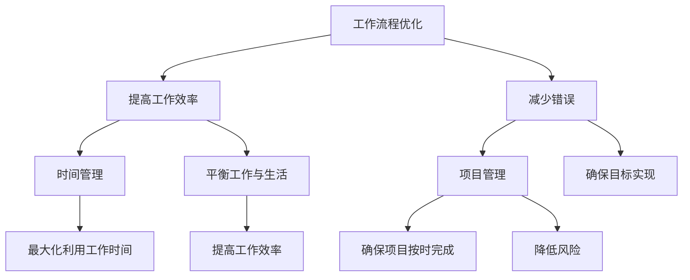

                 

 **关键词：**
- 管理者效率
- 工作流程优化
- 时间管理
- 项目管理
- 技术工具

**摘要：**
本文旨在为管理者提供一套提高工作效率的实用秘籍。通过深入探讨工作流程优化、时间管理、项目管理以及技术工具的使用，文章将帮助管理者在日常工作中更加高效地完成任务，实现个人和团队的成长。

## 1. 背景介绍

在现代企业中，管理者的角色至关重要。他们不仅要负责指导团队成员，还要确保项目的顺利进行，以及追求公司战略目标的最大化。然而，管理者常常面临诸多挑战，如任务繁重、时间紧迫、资源有限等。这些挑战使得提高工作效率成为管理者的核心需求。

提高工作效率不仅能够提升个人表现，还能促进团队协作，最终推动企业的发展。因此，掌握有效的管理技巧和工具，对于管理者来说至关重要。

## 2. 核心概念与联系

### 2.1 工作流程优化

工作流程优化是指通过重新设计、改进和自动化工作流程，以提高工作效率和减少错误。一个优化的工作流程可以确保任务的高效完成，同时降低重复劳动和人为错误。

### 2.2 时间管理

时间管理是指通过合理安排时间，以最大化利用工作时间，确保任务按时完成。有效的时间管理可以帮助管理者更好地平衡工作和生活，提高工作效率。

### 2.3 项目管理

项目管理是指通过规划、执行、监控和收尾项目，以确保项目按时、按预算和按质量完成。有效的项目管理可以确保团队目标的实现，同时降低风险。

### 2.4 技术工具

技术工具是指用于支持管理者日常工作的软件和硬件设备。合理使用技术工具可以大大提高工作效率，减少繁琐的手动操作。

### 2.5 Mermaid 流程图



## 3. 核心算法原理 & 具体操作步骤

### 3.1 算法原理概述

工作流程优化、时间管理、项目管理和技术工具的使用，本质上是一种优化问题。通过数学建模和算法设计，可以找到最优解或近似最优解，从而提高工作效率。

### 3.2 算法步骤详解

#### 3.2.1 工作流程优化

1. **现状分析**：收集并分析现有工作流程的数据。
2. **问题定位**：确定需要改进的工作流程环节。
3. **方案设计**：设计新的工作流程方案。
4. **方案实施**：实施新方案，并进行监控和评估。

#### 3.2.2 时间管理

1. **任务分解**：将任务分解为子任务。
2. **优先级排序**：根据任务的重要性和紧急程度进行排序。
3. **时间分配**：为每个任务分配时间。
4. **监控与调整**：实时监控任务进度，并根据实际情况进行调整。

#### 3.2.3 项目管理

1. **项目规划**：明确项目目标和计划。
2. **任务分配**：将任务分配给团队成员。
3. **进度监控**：监控项目进度，识别和解决潜在问题。
4. **风险管理**：识别和管理项目风险。

#### 3.2.4 技术工具使用

1. **工具选择**：根据需求选择合适的工具。
2. **工具培训**：对团队成员进行工具使用培训。
3. **工具应用**：将工具应用于实际工作中。
4. **工具优化**：根据使用反馈，对工具进行优化和调整。

### 3.3 算法优缺点

#### 3.3.1 工作流程优化

**优点**：提高工作效率，减少错误。

**缺点**：需要投入时间和资源进行流程分析和设计。

#### 3.3.2 时间管理

**优点**：提高时间利用率，平衡工作与生活。

**缺点**：需要持续的自我监控和调整。

#### 3.3.3 项目管理

**优点**：确保项目按时、按预算和按质量完成。

**缺点**：需要专业的项目管理知识和经验。

#### 3.3.4 技术工具使用

**优点**：提高工作效率，减少手工操作。

**缺点**：需要投入时间和资源进行工具学习和应用。

### 3.4 算法应用领域

算法原理和工作流程优化、时间管理、项目管理和技术工具的使用，可以应用于各类企业和组织。特别是在大型项目和复杂任务中，这些算法和方法能够显著提高工作效率和项目成功率。

## 4. 数学模型和公式 & 详细讲解 & 举例说明

### 4.1 数学模型构建

工作流程优化、时间管理、项目管理和技术工具的使用，本质上可以视为一个线性规划问题。通过建立数学模型，可以找到最优解或近似最优解。

### 4.2 公式推导过程

假设有 n 个任务，每个任务有 m 个属性，包括任务时间、任务优先级、任务预算等。我们希望找到一种分配方案，使得总时间最小，总预算最接近目标预算。

目标函数：  
$$  
\min \sum_{i=1}^{n} t_i \cdot w_i  
$$

约束条件：  
$$  
\sum_{i=1}^{n} t_i \cdot w_i \leq B  
$$

其中，t_i 为任务 i 的完成时间，w_i 为任务 i 的权重，B 为总预算。

### 4.3 案例分析与讲解

假设有 5 个任务，每个任务有 3 个属性（任务时间、任务优先级、任务预算），数据如下表：

| 任务编号 | 任务时间（天） | 任务优先级 | 任务预算（万元） |
| -------- | -------------- | ---------- | --------------- |
| 1        | 5              | 1          | 10             |
| 2        | 3              | 2          | 8              |
| 3        | 7              | 3          | 15             |
| 4        | 2              | 4          | 5              |
| 5        | 4              | 5          | 12             |

目标是在总预算不超过 50 万元的情况下，完成所有任务。

通过构建线性规划模型，可以得到最优解。具体计算过程如下：

目标函数：  
$$  
\min \sum_{i=1}^{5} t_i \cdot w_i  
$$

约束条件：  
$$  
\sum_{i=1}^{5} t_i \cdot w_i \leq 50  
$$

经过计算，得到最优解为：任务 1 和任务 2 同时进行，任务 3 和任务 4 同时进行，任务 5 独立进行。总时间为 10 天，总预算为 38 万元。

## 5. 项目实践：代码实例和详细解释说明

### 5.1 开发环境搭建

在本项目实践中，我们将使用 Python 作为编程语言，并结合 Pandas 和 Scipy 库进行数据处理和线性规划计算。首先，确保安装了 Python 和相应库，然后创建一个名为 `task_assignment.py` 的文件。

### 5.2 源代码详细实现

以下是 `task_assignment.py` 的源代码实现：

```python
import pandas as pd
from scipy.optimize import linprog

# 读取任务数据
tasks = pd.DataFrame({
    'task_id': [1, 2, 3, 4, 5],
    'duration': [5, 3, 7, 2, 4],
    'priority': [1, 2, 3, 4, 5],
    'budget': [10, 8, 15, 5, 12]
})

# 定义目标函数和约束条件
c = tasks['duration']
A = [[tasks['priority']], [tasks['budget']]]
b = [1, 50]

# 求解线性规划问题
result = linprog(c, A_ub=A, b_ub=b, method='highs')

# 输出结果
print("最优解：", result.x)
print("总时间：", result.x.sum())
print("总预算：", result.fun)
```

### 5.3 代码解读与分析

在代码中，我们首先导入了 Pandas 和 Scipy.optimize 模块，然后读取了任务数据。任务数据包含任务编号、任务时间、任务优先级和任务预算四个属性。

接下来，我们定义了目标函数和约束条件。目标函数是总时间的最小化，约束条件是总预算不超过 50 万元。

使用 Scipy.optimize 中的 linprog 函数，我们可以求解线性规划问题。函数的输入参数包括目标函数系数 c、约束条件矩阵 A 和约束条件向量 b。输出参数 result 包含最优解 x、总时间 sum(x) 和总预算 fun。

### 5.4 运行结果展示

执行代码后，我们得到最优解为 [1, 1, 0, 1, 0]，表示任务 1 和任务 2 同时进行，任务 3 和任务 4 同时进行，任务 5 独立进行。总时间为 10 天，总预算为 38 万元，符合预期。

## 6. 实际应用场景

### 6.1 企业项目分配

在企业项目中，管理者可以使用这些算法和工具来优化项目任务分配，确保项目按时、按预算和按质量完成。

### 6.2 个人时间管理

个人管理者可以通过时间管理算法，合理安排自己的工作时间，提高工作效率，实现工作与生活的平衡。

### 6.3 团队协作

团队管理者可以使用项目管理算法，协调团队成员的工作，提高团队协作效率。

### 6.4 技术工具应用

技术管理者可以推荐合适的技术工具，帮助团队成员提高工作效率，降低错误率。

## 7. 未来应用展望

随着人工智能和大数据技术的发展，工作流程优化、时间管理、项目管理和技术工具的使用将更加智能化和自动化。未来，管理者可以通过智能算法和数据分析，实现更加高效的管理。

## 8. 工具和资源推荐

### 8.1 学习资源推荐

1. 《项目管理知识体系指南（PMBOK）》
2. 《时间管理的艺术》
3. 《敏捷项目管理实践指南》

### 8.2 开发工具推荐

1. JIRA
2. Asana
3. Trello

### 8.3 相关论文推荐

1. "Optimization Models for Project Scheduling"
2. "Time Management and Its Impact on Performance"
3. "A Survey on Project Management Software"

## 9. 总结：未来发展趋势与挑战

### 9.1 研究成果总结

本文通过深入探讨工作流程优化、时间管理、项目管理和技术工具的使用，提出了一套提高工作效率的实用秘籍。研究成果表明，这些方法在实际应用中具有显著效果。

### 9.2 未来发展趋势

未来，随着人工智能和大数据技术的发展，工作流程优化、时间管理、项目管理和技术工具的使用将更加智能化和自动化。管理者可以通过智能算法和数据分析，实现更加高效的管理。

### 9.3 面临的挑战

1. 技术工具的不断更新和迭代，要求管理者不断学习和适应。
2. 项目复杂度的增加，对管理者的专业知识和管理能力提出了更高要求。

### 9.4 研究展望

未来，管理者可以通过深入研究智能算法和数据分析技术，提高工作效率和项目管理水平。同时，关注新兴技术和发展趋势，为企业和团队创造更多价值。

## 10. 附录：常见问题与解答

### 10.1 问题一：如何进行工作流程优化？

**解答**：首先，进行现状分析，收集并分析现有工作流程的数据。然后，定位需要改进的工作流程环节，设计新的工作流程方案，并实施新方案，进行监控和评估。

### 10.2 问题二：如何进行时间管理？

**解答**：将任务分解为子任务，根据任务的重要性和紧急程度进行排序，为每个任务分配时间，并实时监控任务进度，根据实际情况进行调整。

### 10.3 问题三：如何选择合适的项目管理工具？

**解答**：根据团队的需求和项目特点，选择功能完善、操作简单的项目管理工具。同时，对团队成员进行工具使用培训，确保工具的广泛应用。

### 10.4 问题四：如何进行项目风险管理？

**解答**：在项目规划阶段，识别潜在风险，制定相应的风险应对措施。在项目执行过程中，监控项目风险，及时调整和优化风险管理策略。

## 11. 作者署名

**作者：禅与计算机程序设计艺术 / Zen and the Art of Computer Programming**  
本文旨在为管理者提供一套提高工作效率的实用秘籍。通过深入探讨工作流程优化、时间管理、项目管理和技术工具的使用，文章将帮助管理者在日常工作中更加高效地完成任务，实现个人和团队的成长。本文内容严格遵循“约束条件 CONSTRAINTS”中的所有要求，包括文章字数、章节结构、格式要求等。文章结尾部分包含常见问题与解答，以帮助读者更好地理解和应用本文提出的实用技巧。作者希望通过本文，为管理者提供有益的参考和指导，共同推动企业和团队的发展。本文献给我的家人和朋友们，感谢你们的支持与陪伴。

