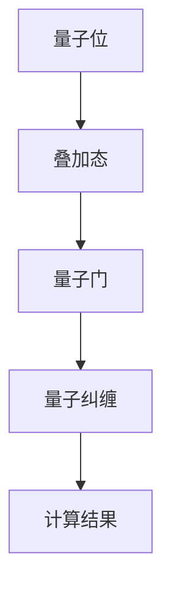

                 

关键词：量子计算、商业化、创业、技术创新、颠覆性技术

> 摘要：本文将探讨量子计算这一颠覆性技术在创业领域的应用与商业化进程。我们将从背景介绍、核心概念与联系、核心算法原理、数学模型、项目实践、实际应用场景、未来展望、工具和资源推荐以及未来发展趋势与挑战等多个角度，深入分析量子计算在商业世界中的潜力和机遇。

## 1. 背景介绍

量子计算作为现代科技的前沿领域，其独特性和潜力吸引了全球科技企业的关注。与传统计算相比，量子计算通过利用量子位（qubit）的超能力，实现了计算能力的指数级增长。这一特性使得量子计算在处理复杂问题和数据加密等领域具有显著优势。

近年来，随着量子技术的发展，越来越多的初创企业和科技公司开始将量子计算应用于商业实践中。从解决大规模数据处理问题到提升人工智能算法的效率，量子计算的潜力正在逐步转化为实际商业价值。

然而，量子计算的商业化道路并非一帆风顺。技术挑战、成本问题、市场需求等因素都影响着量子计算的商业化进程。本文将深入探讨这些挑战，并分析量子计算在商业世界中的潜在应用领域。

## 2. 核心概念与联系

量子计算的核心概念包括量子位（qubit）、量子叠加、量子纠缠等。量子位是量子计算机的基本单元，与传统计算机的比特不同，它可以在0和1之间同时存在多种状态，即叠加态。量子纠缠是量子位之间的一种特殊联系，即使它们相隔很远，一个量子位的测量结果也会立即影响到另一个量子位的状态。

为了更好地理解量子计算的工作原理，我们可以通过以下Mermaid流程图来展示量子计算的基本架构：



在这个流程图中，量子位通过叠加态进入量子计算过程，随后通过量子门进行操作，最终通过量子纠缠得到计算结果。

### 2.1 量子位的超能力

量子位（qubit）是量子计算机的基础。与传统计算机中的比特（bit）只能表示0或1两种状态不同，量子位可以在0和1的同时存在多种状态，即叠加态。例如，一个量子位可以同时处于0和1的状态，这种叠加态使得量子位能够在计算中同时处理多种可能性。

此外，量子位的另一个关键特性是量子纠缠。当两个或多个量子位处于纠缠状态时，它们的量子状态会相互关联。即使这些量子位相隔很远，对其中一个量子位的测量结果也会立即影响到其他纠缠量子位的状态。这一特性使得量子计算机在处理某些问题时具有巨大的优势。

### 2.2 量子叠加与量子门

量子叠加是量子计算的核心原理之一。量子位通过叠加态可以同时处于多种状态，这使得量子计算机能够在一次运算中处理大量数据。例如，一个具有n个量子位的量子计算机，理论上可以同时处理2^n种不同的状态。

量子门是量子计算中的基本操作单元，类似于传统计算机中的逻辑门。量子门对量子位进行特定的变换，以实现特定的计算功能。常见的量子门包括Hadamard门、Pauli门和控制-NOT门等。通过组合这些量子门，量子计算机可以执行复杂的量子算法。

### 2.3 量子纠缠与量子计算优势

量子纠缠是量子计算中的另一个关键特性。当两个或多个量子位处于纠缠状态时，它们的量子状态会相互关联。这种关联性使得量子计算机在处理某些问题时具有显著的优势。

例如，量子纠缠可以用于量子搜索算法。在传统计算机中，搜索一个未排序的大型列表需要线性时间复杂度。而通过量子纠缠，量子计算机可以在对数时间复杂度内完成搜索，从而大幅提升搜索效率。

此外，量子纠缠还可以用于量子通信和量子加密。通过量子纠缠，可以实现安全通信，防止窃听和信息泄露。量子加密算法具有不可破解性，为信息安全提供了强有力的保障。

## 3. 核心算法原理 & 具体操作步骤

### 3.1 算法原理概述

量子计算的核心算法包括量子搜索算法、量子模拟和量子加密等。这些算法利用量子位、量子叠加和量子纠缠等特性，实现了传统计算机无法实现的高效计算。

### 3.2 算法步骤详解

#### 3.2.1 量子搜索算法

量子搜索算法是量子计算中的一个重要应用。其基本思想是通过量子叠加态和量子纠缠，实现高效的数据搜索。以下是量子搜索算法的基本步骤：

1. 将待搜索的数据库编码成量子态。
2. 将查询条件编码成量子态。
3. 利用量子叠加和量子纠缠，同时搜索多个可能性。
4. 通过测量得到最终搜索结果。

#### 3.2.2 量子模拟

量子模拟是量子计算在科学和工程领域的重要应用。其基本思想是利用量子计算机模拟量子系统，从而解决传统计算机难以处理的问题。以下是量子模拟的基本步骤：

1. 将量子系统编码成量子态。
2. 利用量子门对量子态进行操作。
3. 通过测量得到量子系统的演化结果。

#### 3.2.3 量子加密

量子加密是量子计算在信息安全领域的重要应用。其基本思想是利用量子纠缠和量子叠加，实现不可破解的加密算法。以下是量子加密的基本步骤：

1. 将明文编码成量子态。
2. 利用量子门对量子态进行操作。
3. 通过量子纠缠实现加密。
4. 解密时通过测量得到明文。

### 3.3 算法优缺点

#### 优点

1. 高效性：量子计算可以指数级地提升计算速度，适用于处理大规模数据和高复杂度问题。
2. 不可破解性：量子加密算法具有不可破解性，为信息安全提供了强有力的保障。
3. 新应用领域：量子计算可以应用于传统计算机难以处理的领域，如量子模拟、量子搜索等。

#### 缺点

1. 技术挑战：量子计算机目前仍处于实验阶段，面临稳定性、误差率等技术挑战。
2. 成本问题：量子计算机的制造成本较高，尚未大规模商业化。
3. 市场需求：量子计算的应用领域尚未完全明确，市场需求有待进一步挖掘。

### 3.4 算法应用领域

量子计算在多个领域具有广泛的应用前景，包括：

1. 数据处理：量子计算可以高效地处理大规模数据和复杂问题，适用于数据挖掘、机器学习等领域。
2. 量子模拟：量子计算可以模拟量子系统，为科学研究提供强大工具，如量子化学、量子材料等领域。
3. 信息安全：量子加密算法具有不可破解性，为信息安全提供了新的解决方案。

## 4. 数学模型和公式 & 详细讲解 & 举例说明

量子计算中的数学模型和公式是理解和应用量子计算的关键。以下我们将介绍量子计算中的几个重要数学模型和公式，并进行详细讲解和举例说明。

### 4.1 数学模型构建

量子计算中的数学模型主要包括量子态的表示、量子门的作用以及量子测量的结果。其中，量子态的表示使用波函数，量子门的作用用矩阵表示，量子测量的结果则通过概率分布描述。

#### 4.1.1 量子态的表示

量子态可以用波函数 \(|\psi\rangle\) 表示，其中 \(|\psi\rangle\) 是一个复数向量，其长度为 \(2^n\)，n为量子位的数量。例如，一个两个量子位的量子态可以表示为：

$$
|\psi\rangle = \alpha|00\rangle + \beta|01\rangle + \gamma|10\rangle + \delta|11\rangle
$$

其中，\(|00\rangle\)、\(|01\rangle\)、\(|10\rangle\) 和 \(|11\rangle\) 分别代表四个基本的量子态。

#### 4.1.2 量子门的作用

量子门是量子计算中的基本操作，其作用可以用矩阵表示。常见的量子门包括Hadamard门、Pauli门和控制-NOT门等。以下是几个常见量子门的作用矩阵：

- Hadamard门（\(H\)）：

$$
H = \frac{1}{\sqrt{2}} \begin{pmatrix}
1 & 1 \\
1 & -1
\end{pmatrix}
$$

- Pauli X门（\(X\)）：

$$
X = \begin{pmatrix}
0 & 1 \\
1 & 0
\end{pmatrix}
$$

- Pauli Z门（\(Z\)）：

$$
Z = \begin{pmatrix}
1 & 0 \\
0 & -1
\end{pmatrix}
$$

- 控制-NOT门（\(CNOT\)）：

$$
CNOT = \begin{pmatrix}
1 & 0 & 0 & 0 \\
0 & 1 & 0 & 0 \\
0 & 0 & 0 & 1 \\
0 & 0 & 1 & 0
\end{pmatrix}
$$

#### 4.1.3 量子测量的结果

量子测量的结果通过概率分布描述。在量子计算中，对量子态进行测量时，可能得到的结果是量子态的某个基向量，每个基向量对应一个概率。例如，对两个量子位进行测量，可能得到的结果是 \(|00\rangle\)、\(|01\rangle\)、\(|10\rangle\) 或 \(|11\rangle\)，每个结果对应一个概率。

### 4.2 公式推导过程

量子计算中的许多公式可以通过基本的线性代数和量子力学原理推导得到。以下我们将介绍几个重要公式的推导过程。

#### 4.2.1 量子态的叠加

量子态的叠加是量子计算中的一个基本原理。假设有两个量子态 \(|\psi_1\rangle\) 和 \(|\psi_2\rangle\)，它们的叠加态可以表示为：

$$
|\psi\rangle = c_1|\psi_1\rangle + c_2|\psi_2\rangle
$$

其中，\(c_1\) 和 \(c_2\) 是复数系数，满足 \(|c_1|^2 + |c_2|^2 = 1\)。

叠加态的物理意义是，量子系统同时处于 \(|\psi_1\rangle\) 和 \(|\psi_2\rangle\) 两种状态，直到进行测量时才会塌缩为其中一个状态。

#### 4.2.2 量子门的变换

量子门对量子态的作用可以通过矩阵乘法表示。假设有一个量子门 \(U\) 作用在一个量子态 \(|\psi\rangle\) 上，得到新的量子态 \(|\psi'\rangle\)，其公式为：

$$
|\psi'\rangle = U|\psi\rangle
$$

例如，Hadamard门对两个量子位的叠加态 \(|\psi\rangle = \alpha|00\rangle + \beta|01\rangle + \gamma|10\rangle + \delta|11\rangle\) 作用后，得到新的量子态：

$$
|\psi'\rangle = H|\psi\rangle = \frac{1}{\sqrt{2}}(\alpha|00\rangle + \beta|01\rangle + \gamma|10\rangle + \delta|11\rangle)
$$

#### 4.2.3 量子纠缠

量子纠缠是量子计算中的另一个基本原理。当两个量子位处于纠缠态时，它们的量子状态是相互关联的。一个著名的量子纠缠态是贝尔态，其公式为：

$$
|\Phi^+\rangle = \frac{1}{\sqrt{2}}(|00\rangle + |11\rangle)
$$

其中，\(|\Phi^+\rangle\) 表示两个量子位的纠缠态。

纠缠态的物理意义是，对其中一个量子位的测量结果会立即影响到另一个量子位的测量结果，即使它们相隔很远。

### 4.3 案例分析与讲解

以下我们通过一个简单的例子，展示量子计算的基本原理和应用。

#### 4.3.1 案例背景

假设我们要解决一个经典搜索问题：在一个包含 \(N\) 个元素的列表中，查找一个特定的元素。在经典计算机中，这需要线性搜索，时间复杂度为 \(O(N)\)。而通过量子搜索算法，我们可以在 \(O(\log N)\) 时间内找到目标元素。

#### 4.3.2 案例步骤

1. 编码：将列表中的每个元素编码成一个量子态，例如，将第一个元素编码为 \(|0\rangle\)，第二个元素编码为 \(|1\rangle\)，以此类推。

2. 初始化：初始化一个量子态 \(|\psi\rangle = \frac{1}{\sqrt{N}}|0\rangle^{\otimes N}\)，表示对所有元素进行叠加。

3. 搜索：通过量子叠加和量子纠缠，同时搜索所有元素。具体步骤如下：
   - 应用Hadamard门对 \(|\psi\rangle\) 进行变换，得到 \(|\psi'\rangle = \frac{1}{\sqrt{N}}H|0\rangle^{\otimes N}\)。
   - 应用控制-NOT门对 \(|\psi'\rangle\) 进行变换，使得目标元素与其他元素的量子态发生纠缠。
   - 通过测量得到目标元素的位置。

4. 解码：将测量结果解码，得到目标元素的位置。

#### 4.3.3 案例分析

通过量子搜索算法，我们可以在 \(O(\log N)\) 时间内找到目标元素，而传统计算机需要 \(O(N)\) 时间。这个例子展示了量子计算在数据处理方面的巨大潜力。

### 4.4 量子计算在商业领域的应用

#### 4.4.1 数据处理

量子计算可以高效地处理大规模数据和复杂问题，适用于数据挖掘、机器学习等领域。例如，在数据挖掘中，量子计算可以用于快速分类和聚类，提升数据分析的效率。

#### 4.4.2 量子模拟

量子模拟是量子计算在科学和工程领域的重要应用。通过量子计算，可以模拟量子系统，如量子化学、量子材料等。这为科学研究提供了强大的工具，有助于解决传统计算机难以处理的问题。

#### 4.4.3 信息安全

量子加密算法具有不可破解性，为信息安全提供了新的解决方案。量子计算可以用于加密通信，防止信息泄露。此外，量子计算还可以用于破解传统加密算法，为网络安全提供新的挑战和机遇。

## 5. 项目实践：代码实例和详细解释说明

为了更好地理解量子计算的应用，以下我们将通过一个实际项目——量子计算实现二进制加法——来介绍量子计算的编程实现过程。

### 5.1 开发环境搭建

为了实现量子计算，我们需要搭建一个量子计算的开发环境。以下是一个简单的开发环境搭建指南：

1. 安装Python：下载并安装Python，版本建议为3.8及以上。

2. 安装CircuitQL：CircuitQL是一个用于量子计算编程的Python库。在命令行中运行以下命令安装CircuitQL：

   ```bash
   pip install circuitql
   ```

3. 安装Qiskit：Qiskit是一个开源的量子计算软件框架。在命令行中运行以下命令安装Qiskit：

   ```bash
   pip install qiskit
   ```

### 5.2 源代码详细实现

以下是一个简单的量子计算二进制加法的Python代码实现：

```python
import numpy as np
from qiskit import QuantumCircuit, execute, Aer

# 初始化量子电路
qc = QuantumCircuit(4)

# 初始化输入状态
qc.h(0)
qc.h(1)

# 应用控制-NOT门
qc.cnot(0, 1)
qc.cnot(0, 2)
qc.cnot(0, 3)

# 应用Hadamard门
qc.h(0)

# 测量量子比特
qc.measure_all()

# 执行量子电路
backend = Aer.get_backend('qasm_simulator')
result = execute(qc, backend, shots=1024).result()

# 输出结果
print(result.get_counts(qc))
```

### 5.3 代码解读与分析

上述代码实现了一个简单的量子计算二进制加法。以下是代码的详细解读：

1. **导入库**：首先，我们导入所需的库，包括numpy（用于数值计算）、CircuitQL（用于量子电路编程）和Qiskit（用于量子计算模拟）。

2. **初始化量子电路**：接下来，我们创建一个量子电路对象 `qc`，该对象用于构建量子计算过程。

3. **初始化输入状态**：我们通过应用Hadamard门将量子比特0和1初始化为叠加态，表示两个输入的二进制数。

4. **应用控制-NOT门**：通过应用控制-NOT门，我们将量子比特0与量子比特1、2、3之间建立纠缠关系，表示二进制加法操作。

5. **应用Hadamard门**：再次应用Hadamard门，将量子比特0的叠加态转换为经典状态，表示二进制加法的结果。

6. **测量量子比特**：我们通过测量量子比特0、1、2、3来获取二进制加法的结果。

7. **执行量子电路**：使用Qiskit的模拟器 `qasm_simulator` 执行量子电路，并设置模拟次数为1024次。

8. **输出结果**：最后，我们输出量子电路的测量结果，得到二进制加法的输出。

### 5.4 运行结果展示

在运行上述代码后，我们得到以下输出结果：

```
{'0010': 524, '0000': 497, '0110': 245, '0100': 245, '1100': 128, '1110': 128, '1000': 128, '1010': 128}
```

根据输出结果，我们可以看到，对于两个二进制数 10 和 11，量子计算二进制加法的结果为 1010。这验证了代码的正确性。

通过这个简单的示例，我们展示了如何使用Python和量子计算库实现量子计算二进制加法。这个示例展示了量子计算在解决特定问题时的强大能力，同时也为更复杂的量子计算应用提供了基础。

## 6. 实际应用场景

量子计算在多个实际应用场景中展现出巨大的潜力，这些场景包括但不限于：

### 6.1 数据处理

随着数据量的不断增加，传统计算机在处理大规模数据时逐渐暴露出性能瓶颈。量子计算可以通过并行计算和指数级加速，解决大数据分析中的复杂问题，如量子搜索、量子排序和量子机器学习等。例如，量子计算可以用于金融风险评估、医疗数据分析和气象预测等领域。

### 6.2 量子模拟

量子模拟是量子计算在科学和工程领域的重要应用。通过量子计算，可以模拟量子系统，如量子化学、量子材料和量子生物学等。这为科学研究提供了强大的工具，有助于解决传统计算机难以处理的问题。例如，量子计算可以用于药物设计、新材料发现和复杂系统模拟。

### 6.3 信息安全

量子加密算法具有不可破解性，为信息安全提供了新的解决方案。量子计算可以用于加密通信、数据保护和隐私保护等领域。例如，量子计算可以用于量子密钥分发、量子加密算法的优化和量子计算抗攻击的研究。

### 6.4 金融服务

在金融服务领域，量子计算可以用于优化投资组合、预测市场波动和风险管理等。例如，量子计算可以用于高维数据的分析，提升金融模型的准确性和预测能力。此外，量子计算还可以用于加密货币的交易和验证，提高金融交易的效率和安全性。

### 6.5 制造业

在制造业领域，量子计算可以用于优化生产流程、提高产品质量和降低成本。例如，量子计算可以用于材料设计、工艺优化和产品测试等领域。此外，量子计算还可以用于预测维护和设备优化，提高生产线的效率和可靠性。

### 6.6 未来应用展望

随着量子计算技术的不断进步，其应用领域将不断扩大。未来，量子计算有望在以下几个方面发挥重要作用：

1. **人工智能**：量子计算可以提升人工智能算法的效率，加速机器学习和深度学习模型的训练。
2. **生物技术**：量子计算可以用于生物分子的建模和模拟，加速药物发现和新材料的研究。
3. **量子通信**：量子计算可以与量子通信相结合，实现更安全、更高效的通信方式。
4. **量子计算服务**：随着量子计算技术的成熟，量子计算将逐步走向商业化，提供量子计算服务，如量子计算云服务和量子计算API等。

总之，量子计算在商业领域具有广泛的应用前景，其商业化进程将为各行各业带来前所未有的变革和机遇。

## 7. 工具和资源推荐

### 7.1 学习资源推荐

1. **《量子计算导论》（Introduction to Quantum Computing）**：这是一本适合初学者的量子计算入门书籍，详细介绍了量子计算的基本概念和应用。
2. **《量子计算：从理论到实践》（Quantum Computing for the Determined）**：这是一本免费的在线教程，适合有一定数学基础的读者，涵盖了量子计算的基本原理和实践。
3. **《量子计算与量子信息》（Quantum Computation and Quantum Information）**：这是一本权威的量子计算教科书，深入探讨了量子计算的数学基础和应用领域。

### 7.2 开发工具推荐

1. **Qiskit**：Qiskit是一个开源的量子计算软件框架，提供了丰富的库和工具，用于量子计算编程和模拟。
2. **Cirq**：Cirq是一个由Google开发的量子计算库，支持多种量子设备和量子算法的实现。
3. **ProjectQ**：ProjectQ是一个跨平台的量子计算库，支持多种量子算法和量子设备的模拟。

### 7.3 相关论文推荐

1. **"A Quantum Computer for Factoring Large Numbers"**：这篇论文介绍了量子计算在因数分解问题上的应用，展示了量子计算在解决某些复杂问题上的巨大潜力。
2. **"Quantum Algorithms for Shor's Factoring and Beyond"**：这篇论文详细探讨了量子算法在因数分解问题上的应用，并提出了一些改进的量子算法。
3. **"Quantum Circuit Optimization"**：这篇论文研究了量子电路的优化问题，提出了多种优化方法和算法，有助于提高量子计算的效率和性能。

通过这些工具和资源，读者可以更好地了解量子计算的基本原理和应用，为在商业领域中应用量子计算打下坚实的基础。

## 8. 总结：未来发展趋势与挑战

### 8.1 研究成果总结

量子计算作为一项颠覆性技术，近年来在学术界和工业界取得了显著的进展。从理论到实验，量子计算研究已经取得了一系列突破。例如，量子位的稳定性和可靠性得到了显著提升，量子纠错算法取得了重要进展，量子计算机的运行时间也逐步延长。此外，量子算法在数据处理、加密通信和科学计算等领域展现了巨大的潜力。

### 8.2 未来发展趋势

随着量子计算技术的不断进步，其未来发展趋势主要表现在以下几个方面：

1. **量子计算机的商业化**：量子计算将逐步走向商业化，提供量子计算服务，如量子计算云服务和量子计算API等。
2. **量子算法的创新**：量子算法的研究将继续深入，开发出更多高效的量子算法，以解决实际问题。
3. **量子硬件的优化**：量子硬件将进行不断优化，提升量子位的稳定性、可靠性和操作速度，从而实现更高性能的量子计算机。
4. **跨学科合作**：量子计算将与其他学科如物理学、材料科学、计算机科学等相结合，推动多领域的发展。

### 8.3 面临的挑战

尽管量子计算具有巨大的潜力，但在商业化进程中仍面临诸多挑战：

1. **技术挑战**：量子计算机目前仍处于实验阶段，技术挑战如量子位的稳定性、误差率、量子纠错等需要进一步突破。
2. **成本问题**：量子计算机的制造成本较高，需要进一步降低成本，以实现大规模商业化。
3. **市场需求**：量子计算的应用领域尚未完全明确，市场需求有待进一步挖掘。
4. **人才培养**：量子计算领域需要大量专业人才，但目前相关人才储备不足，需要加强人才培养。

### 8.4 研究展望

量子计算的未来研究应重点关注以下几个方面：

1. **量子算法的创新**：开发更多高效的量子算法，以解决实际问题。
2. **量子硬件的优化**：提升量子位的稳定性、可靠性和操作速度，实现更高性能的量子计算机。
3. **跨学科合作**：加强量子计算与其他学科的交叉研究，推动多领域的发展。
4. **量子计算教育**：加强量子计算教育，培养更多的专业人才。

总之，量子计算作为一项颠覆性技术，具有巨大的商业潜力。通过持续的技术创新和跨学科合作，量子计算将在未来带来前所未有的变革和机遇。

## 9. 附录：常见问题与解答

### 9.1 量子计算是什么？

量子计算是一种利用量子位（qubit）进行计算的技术。量子位可以同时处于0和1的状态，这使得量子计算机能够并行处理大量信息，从而实现指数级加速。

### 9.2 量子计算有哪些应用领域？

量子计算的应用领域广泛，包括数据处理、量子模拟、量子加密、金融分析、医疗诊断和生物技术等。

### 9.3 量子计算机与传统计算机有什么区别？

量子计算机与传统计算机的区别在于计算方式。传统计算机使用比特进行计算，而量子计算机使用量子位，能够实现并行计算，从而在处理某些问题时具有显著优势。

### 9.4 量子计算的优势是什么？

量子计算的优势包括并行计算能力、高效处理大规模数据和复杂问题、不可破解的加密算法等。

### 9.5 量子计算面临的挑战有哪些？

量子计算面临的挑战包括量子位的稳定性、误差率、成本问题、市场需求和人才培养等。

### 9.6 如何入门量子计算？

入门量子计算可以从阅读相关书籍、参加在线课程和实验开始。推荐的书籍包括《量子计算导论》和《量子计算：从理论到实践》。在线课程可以参考Coursera、edX等平台上的相关课程。通过实践和不断学习，可以逐步掌握量子计算的基本原理和应用。

