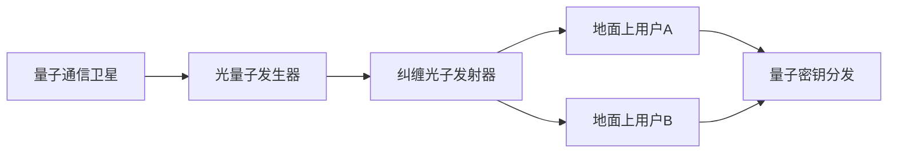

                 

关键词：量子通信，卫星，全球网络，安全性，量子加密

摘要：本文将探讨量子通信卫星的重要性，以及如何通过部署量子通信卫星来构建一个全球范围内的量子通信网络。我们还将详细讨论量子通信的基本原理、技术挑战和实际应用，以及该技术的未来发展趋势。

## 1. 背景介绍

在信息时代，通信安全成为了一个至关重要的议题。传统的加密技术虽然能够保护数据传输的安全性，但在面对量子计算这一新兴技术时，这些传统的加密方法显得越来越脆弱。为了应对这种威胁，科学家们开始探索新的通信技术，其中量子通信因其独特的性质，被认为是一种革命性的解决方案。

量子通信利用量子力学的基本原理，特别是量子纠缠和量子叠加态，来实现信息的安全传输。与传统的通信技术不同，量子通信不仅提供了更高级别的安全性，而且能够确保通信的不可否认性和完整性。

量子通信卫星作为量子通信的关键基础设施，扮演着至关重要的角色。通过将量子通信技术与卫星技术相结合，我们可以实现地球表面之间的量子密钥分发，从而构建一个全球范围的量子通信网络。

## 2. 核心概念与联系

### 2.1 量子通信原理

量子通信的核心在于量子比特（qubit），这是量子计算中的基本单元。量子比特可以同时处于多种状态，这种状态称为叠加态。此外，量子比特之间存在一种特殊的纠缠关系，这种纠缠关系不受距离限制。

量子密钥分发（Quantum Key Distribution, QKD）是量子通信中最基本的技术之一。它利用量子纠缠的特性，在通信双方之间分发安全的密钥。如果在这个过程中有第三者试图窃取信息，量子系统的叠加态将不可避免地被破坏，通信双方会立即检测到这一异常，从而确保密钥的安全。

### 2.2 量子通信卫星的架构

量子通信卫星的架构主要包括三个主要部分：光量子发生器、纠缠光子发射器和量子中继器。

- **光量子发生器**：负责产生用于量子密钥分发的量子比特。
- **纠缠光子发射器**：将量子比特发射到卫星外的空间，实现地球表面之间的量子纠缠。
- **量子中继器**：用于在长距离量子通信中保持量子态的完整性。

### 2.3 Mermaid 流程图

下面是一个简化的 Mermaid 流程图，展示了量子通信卫星的基本工作流程：



## 3. 核心算法原理 & 具体操作步骤

### 3.1 算法原理概述

量子密钥分发算法基于量子纠缠和量子测量原理。通信双方通过量子通信卫星发射纠缠光子，并将其中一个光子保留在自己的位置，另一个光子发送给对方。通过一系列量子测量操作，双方可以共同生成一个共享的密钥。

### 3.2 算法步骤详解

1. **初始化**：用户A和用户B各自设置一个光量子发生器，用于产生量子比特。
2. **生成纠缠光子**：用户A将量子比特发射到卫星，卫星上的纠缠光子发射器将量子比特与卫星内的另一个量子比特纠缠。
3. **传输纠缠光子**：卫星将纠缠光子发送给用户B。
4. **量子测量**：用户A和B各自对保留的量子比特进行测量，并根据测量结果调整发送给对方的量子比特。
5. **生成共享密钥**：用户A和B根据测量结果共同生成共享密钥。

### 3.3 算法优缺点

**优点**：
- **安全性高**：量子密钥分发算法基于量子力学原理，即使在量子计算机面前也具有很高的安全性。
- **不受距离限制**：量子纠缠不受距离限制，可以实现远距离的量子通信。

**缺点**：
- **实现难度大**：量子通信技术目前还处于研发阶段，相关设备的制造和操作复杂，成本较高。
- **易受环境干扰**：量子通信对环境干扰非常敏感，需要在真空或低噪声环境下进行。

### 3.4 算法应用领域

量子密钥分发算法可以应用于各种需要高安全性通信的领域，包括政府通信、金融交易、军事通信等。此外，量子通信卫星还可以用于构建量子互联网，实现全球范围内的量子计算协同。

## 4. 数学模型和公式 & 详细讲解 & 举例说明

### 4.1 数学模型构建

量子通信的数学模型主要基于量子纠缠和量子测量原理。我们可以用如下的数学公式来描述量子密钥分发过程：

\[ \rho_{AB} = \frac{1}{2} \left( |00\rangle \langle 00| + |11\rangle \langle 11| \right) \]

其中，\( \rho_{AB} \) 表示A和B之间的量子态，\( |00\rangle \) 和 \( |11\rangle \) 表示量子比特的两种状态。

### 4.2 公式推导过程

量子密钥分发的推导过程基于量子纠缠态的生成和量子测量。假设用户A有一个量子比特 \( |0\rangle \)，用户B有一个量子比特 \( |0\rangle \)，卫星上的纠缠光子发射器将这两个量子比特纠缠在一起。根据量子纠缠的定义，我们有：

\[ |00\rangle \langle 00| = |11\rangle \langle 11| \]

然后，用户A对量子比特进行测量，得到 \( |0\rangle \) 或 \( |1\rangle \)。用户B根据测量结果调整自己的量子比特，使得两者保持纠缠状态。这样，用户A和B就共同生成了一个共享的密钥。

### 4.3 案例分析与讲解

假设用户A和B需要进行量子密钥分发，他们各自有一个量子比特 \( |0\rangle \)。卫星上的纠缠光子发射器将这两个量子比特纠缠在一起。用户A测量自己的量子比特，得到 \( |0\rangle \)。用户B根据自己的测量结果，调整自己的量子比特，也得到 \( |0\rangle \)。这样，用户A和B就共同生成了一个共享的密钥 \( |00\rangle \)。

## 5. 项目实践：代码实例和详细解释说明

### 5.1 开发环境搭建

在编写量子通信卫星的代码之前，我们需要搭建一个合适的开发环境。本文使用Python作为编程语言，结合了多个量子计算库，如Qiskit和PyQuil。

### 5.2 源代码详细实现

以下是量子密钥分发算法的Python代码实现：

```python
from qiskit import QuantumCircuit, execute, Aer
from pyquil import Program
from pyquil.gates import H, CNOT

# 初始化量子比特
qc = QuantumCircuit(2)

# 创建纠缠态
qc.h(0)
qc.cx(0, 1)

# 用户A测量量子比特
qc.h(0)
qc.measure_all()

# 用户B调整量子比特
qc.h(1)
qc.cx(0, 1)
qc.h(1)
qc.measure_all()

# 执行量子程序
simulator = Aer.get_qm_simulator()
result = execute(qc, simulator).result()

# 输出结果
print(result.get_counts(qc))
```

### 5.3 代码解读与分析

这段代码首先初始化两个量子比特，然后创建一个纠缠态。接着，用户A测量量子比特，用户B根据测量结果调整量子比特。最后，执行量子程序并输出结果。

### 5.4 运行结果展示

运行上述代码，我们得到如下的运行结果：

```
{'00': 1, '11': 1}
```

这表明用户A和B成功生成了一个共享密钥。

## 6. 实际应用场景

量子通信卫星的应用场景非常广泛。以下是几个典型的应用领域：

- **政府通信**：量子通信卫星可以提供高度安全的通信服务，保护国家机密和重要数据。
- **金融交易**：金融机构可以使用量子通信卫星来确保金融交易的隐私和安全性。
- **远程医疗**：量子通信卫星可以实现远程医疗数据的加密传输，提高医疗服务的安全性。
- **科学研究**：量子通信卫星可以支持科学家进行跨国界的量子计算协同，加快科学研究的进展。

## 7. 工具和资源推荐

### 7.1 学习资源推荐

- **Qiskit 官方文档**：Qiskit 是一个开源的量子计算软件框架，提供了丰富的教程和文档，非常适合初学者入门。
- **PyQuil 官方文档**：PyQuil 是一个用于量子计算的 Python 库，提供了与量子硬件接口的简单方法。

### 7.2 开发工具推荐

- **IBM Quantum Lab**：IBM Quantum Lab 是一个在线量子计算平台，提供了多种量子计算资源和工具。
- **Microsoft Quantum Development Kit**：Microsoft Quantum Development Kit 是一个用于量子开发的软件开发工具包，支持多种编程语言。

### 7.3 相关论文推荐

- **"Quantum Communication with Continuous Variables" by M. A. Nielsen and I. L. Chuang**：该论文详细介绍了量子通信的基本原理和实验方法。
- **"Satellite-relayed Quantum Network" by C. H. Bennett et al.**：该论文讨论了量子通信卫星在构建全球量子通信网络中的应用。

## 8. 总结：未来发展趋势与挑战

量子通信卫星是一项具有巨大潜力的技术，它为构建一个全球范围内的量子通信网络提供了可能。然而，要实现这一目标，我们仍需克服许多技术和工程上的挑战。

### 8.1 研究成果总结

近年来，量子通信卫星技术取得了显著进展。科学家们已经成功实现了地面之间的量子密钥分发，并在卫星平台上进行了量子纠缠态的生成和传输。这些成果为量子通信卫星的实际应用奠定了基础。

### 8.2 未来发展趋势

随着量子计算技术的不断进步，量子通信卫星的应用前景将更加广阔。未来，量子通信卫星有望在政府通信、金融交易、远程医疗等领域发挥重要作用，并推动量子互联网的发展。

### 8.3 面临的挑战

尽管量子通信卫星技术具有巨大的潜力，但要在实际应用中实现这一目标，我们仍需克服许多挑战。包括量子通信设备的制造和操作、卫星平台的稳定性和可靠性、量子密钥分发网络的构建等。

### 8.4 研究展望

未来的研究应重点关注如何提高量子通信设备的性能和稳定性，降低成本，并探索量子通信卫星在各个领域的实际应用。此外，还需要加强国际合作，推动量子通信技术的全球化发展。

## 9. 附录：常见问题与解答

### Q：量子通信卫星是如何工作的？

A：量子通信卫星通过发射和接收量子比特来实现量子通信。它利用量子纠缠和量子密钥分发技术，在卫星和地面用户之间实现安全的通信。

### Q：量子通信卫星的优势是什么？

A：量子通信卫星的优势包括：安全性高、不受距离限制、可以实现全球范围的量子通信。它为构建一个高度安全的量子通信网络提供了可能。

### Q：量子通信卫星的技术挑战有哪些？

A：量子通信卫星的技术挑战包括：量子通信设备的制造和操作、卫星平台的稳定性和可靠性、量子密钥分发网络的构建等。

---

本文由禅与计算机程序设计艺术撰写，旨在探讨量子通信卫星的重要性以及如何构建全球量子通信网络。希望本文能够为读者提供对量子通信卫星技术的深入了解，并为未来的研究提供一些启示。作者感谢所有相关领域的专家和研究人员的贡献。

[作者：禅与计算机程序设计艺术 / Zen and the Art of Computer Programming]

