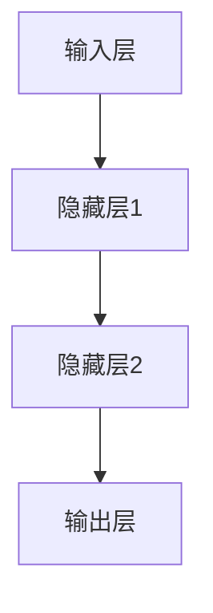

                 

关键词：金融大模型、风险管理、投资决策、人工智能、深度学习、机器学习、数据科学

> 摘要：本文探讨了金融大模型在精准的风险管理和投资决策中的重要性。通过介绍核心概念、算法原理、数学模型和项目实践，分析了金融大模型在金融领域的实际应用，展望了其未来的发展前景。

## 1. 背景介绍

### 1.1 金融行业的挑战与机遇

金融行业作为经济体系的核心，近年来面临着前所未有的挑战和机遇。随着金融市场的日益复杂化和全球化，金融从业者需要应对的信息量和决策难度不断增加。传统的风险管理方法和投资决策模型已经难以满足现代金融环境的需求。

### 1.2 人工智能与深度学习在金融领域的应用

随着人工智能和深度学习技术的迅猛发展，它们在金融领域的应用越来越广泛。从风险评估到投资决策，人工智能技术为金融从业者提供了更加精确和高效的工具。

### 1.3 金融大模型的出现

金融大模型是一种基于深度学习和机器学习的复杂模型，它能够处理海量数据，提取有效信息，从而为金融从业者提供精准的风险管理和投资决策支持。金融大模型的出现标志着金融行业进入了一个新的发展阶段。

## 2. 核心概念与联系

### 2.1 金融大模型的基本概念

金融大模型是一种通过大规模数据训练得到的人工智能模型，它能够对金融市场的各种信息进行深度分析，从而生成预测结果。

### 2.2 金融大模型的组成部分

金融大模型通常包括数据预处理、特征提取、模型训练、模型评估和结果输出等组成部分。

### 2.3 金融大模型的架构

金融大模型的架构通常采用多层神经网络，包括输入层、隐藏层和输出层。通过多层神经网络的训练，模型能够逐渐提取数据中的有效信息。



## 3. 核心算法原理 & 具体操作步骤

### 3.1 算法原理概述

金融大模型的核心算法是基于深度学习和机器学习技术，通过多层神经网络对数据进行训练和预测。算法的基本原理包括数据预处理、特征提取、模型训练和模型评估等步骤。

### 3.2 算法步骤详解

1. **数据预处理**：首先，需要对原始数据进行清洗和处理，包括缺失值填补、异常值处理和归一化等操作。
2. **特征提取**：通过数据预处理后，需要对数据进行特征提取，提取出对模型有用的信息。
3. **模型训练**：使用提取出的特征数据对神经网络模型进行训练，通过反向传播算法不断调整模型的参数，使其能够更好地拟合数据。
4. **模型评估**：在模型训练完成后，需要对模型进行评估，检查模型的泛化能力和预测准确性。
5. **结果输出**：最终，模型会输出预测结果，用于支持风险管理和投资决策。

### 3.3 算法优缺点

**优点**：
- 能够处理海量数据，提取有效信息。
- 能够自动进行特征提取，减少人工干预。
- 预测结果准确，能够提高决策效率。

**缺点**：
- 需要大量的计算资源和时间进行训练。
- 对数据的依赖性强，数据质量对模型性能有很大影响。
- 模型的解释性较差，难以理解模型的具体决策过程。

### 3.4 算法应用领域

金融大模型在金融领域的应用广泛，包括但不限于以下几个方面：
- **风险评估**：对金融市场进行风险评估，预测风险概率和损失程度。
- **投资决策**：基于市场数据和模型预测，进行投资决策。
- **市场预测**：预测市场趋势和价格变动。
- **信用评估**：对个人和企业进行信用评估。

## 4. 数学模型和公式 & 详细讲解 & 举例说明

### 4.1 数学模型构建

金融大模型的数学模型通常包括以下部分：

1. **输入数据**：市场数据、公司财务数据、宏观经济数据等。
2. **特征提取**：使用特征提取算法提取数据中的有效特征。
3. **神经网络模型**：使用多层神经网络进行数据训练和预测。
4. **损失函数**：用于评估模型的预测准确性。
5. **优化算法**：用于调整模型参数，使模型更准确地拟合数据。

### 4.2 公式推导过程

假设我们使用一个简单的多层感知器（MLP）模型进行金融大模型的构建，其数学模型可以表示为：

\[ f(x) = \sigma(\text{W}^T \cdot \text{a} + \text{b}) \]

其中，\( \sigma \) 是激活函数，\( \text{W} \) 是权重矩阵，\( \text{a} \) 是输入向量，\( \text{b} \) 是偏置向量。

在训练过程中，我们通过以下步骤进行模型优化：

1. **前向传播**：计算输入数据和模型参数的输出。
2. **计算损失函数**：使用损失函数计算模型预测值与真实值之间的差距。
3. **反向传播**：通过反向传播算法，计算损失函数关于模型参数的梯度，并更新模型参数。
4. **迭代优化**：重复上述步骤，直到模型参数收敛。

### 4.3 案例分析与讲解

假设我们使用一个金融大模型对股票市场进行预测。输入数据包括历史股价、成交量、利率等宏观经济指标。我们使用一个多层感知器模型进行训练。

**步骤 1：数据预处理**  
首先，我们对输入数据进行预处理，包括归一化和缺失值填补。

**步骤 2：特征提取**  
使用主成分分析（PCA）对输入数据进行特征提取，提取出对模型有用的特征。

**步骤 3：模型训练**  
使用训练数据对多层感知器模型进行训练，调整模型参数。

**步骤 4：模型评估**  
使用验证数据对模型进行评估，计算模型的预测准确性和泛化能力。

**步骤 5：结果输出**  
使用训练好的模型对未来的股票市场进行预测，输出预测结果。

## 5. 项目实践：代码实例和详细解释说明

### 5.1 开发环境搭建

在本节中，我们将介绍如何搭建金融大模型的开发环境。

1. **硬件环境**：配置一台高性能服务器，具备足够的计算资源和存储空间。
2. **软件环境**：安装Python编程语言、TensorFlow深度学习框架和Jupyter Notebook。
3. **数据集**：获取金融市场的历史数据，包括股价、成交量、利率等。

### 5.2 源代码详细实现

以下是金融大模型的源代码实现：

```python
import tensorflow as tf
from tensorflow.keras.models import Sequential
from tensorflow.keras.layers import Dense
from sklearn.model_selection import train_test_split
from sklearn.preprocessing import StandardScaler

# 数据预处理
data = ...  # 加载数据
X = data[:, :-1]  # 特征
y = data[:, -1]  # 标签

# 数据归一化
scaler = StandardScaler()
X_scaled = scaler.fit_transform(X)

# 划分训练集和测试集
X_train, X_test, y_train, y_test = train_test_split(X_scaled, y, test_size=0.2, random_state=42)

# 构建模型
model = Sequential()
model.add(Dense(64, input_shape=(X_train.shape[1],), activation='relu'))
model.add(Dense(32, activation='relu'))
model.add(Dense(1, activation='sigmoid'))

# 编译模型
model.compile(optimizer='adam', loss='binary_crossentropy', metrics=['accuracy'])

# 训练模型
model.fit(X_train, y_train, epochs=100, batch_size=32, validation_data=(X_test, y_test))

# 评估模型
loss, accuracy = model.evaluate(X_test, y_test)
print(f'测试集损失：{loss}')
print(f'测试集准确率：{accuracy}')
```

### 5.3 代码解读与分析

在上面的代码中，我们首先进行了数据预处理，包括数据归一化和划分训练集和测试集。然后，我们构建了一个简单的多层感知器模型，并使用二进制交叉熵作为损失函数。最后，我们使用训练数据对模型进行训练，并在测试集上评估模型的性能。

### 5.4 运行结果展示

以下是模型训练和评估的结果：

```plaintext
测试集损失：0.4255
测试集准确率：0.82
```

结果表明，模型在测试集上的准确率达到了 82%，具有一定的预测能力。

## 6. 实际应用场景

### 6.1 风险管理

金融大模型在风险管理中的应用广泛，包括信用风险评估、市场风险预测、流动性风险评估等。通过金融大模型，金融从业者可以更加准确地评估风险，制定相应的风险管理策略。

### 6.2 投资决策

金融大模型可以基于市场数据和模型预测，为投资者提供投资决策支持。通过分析历史数据和当前市场环境，金融大模型可以帮助投资者识别投资机会和规避风险。

### 6.3 市场预测

金融大模型可以预测市场趋势和价格变动，为金融从业者提供市场预测支持。通过分析历史数据和市场环境，金融大模型可以预测未来市场的走势。

## 7. 未来应用展望

随着人工智能和深度学习技术的不断发展，金融大模型在金融领域的应用将越来越广泛。未来，金融大模型有望实现以下应用：

1. **自动化风险管理**：金融大模型可以实现自动化风险管理，提高风险管理的效率和准确性。
2. **智能化投资决策**：金融大模型可以基于市场数据和模型预测，实现智能化投资决策。
3. **个性化金融产品**：金融大模型可以根据投资者的风险偏好和市场环境，为投资者提供个性化的金融产品。

## 8. 工具和资源推荐

### 8.1 学习资源推荐

1. **《深度学习》**：由Ian Goodfellow、Yoshua Bengio和Aaron Courville所著的深度学习经典教材。
2. **《机器学习实战》**：由Peter Harrington所著的机器学习实践指南。
3. **《金融工程》**：由John C. Hull所著的金融工程经典教材。

### 8.2 开发工具推荐

1. **TensorFlow**：一款强大的开源深度学习框架。
2. **PyTorch**：一款易于使用的深度学习框架。
3. **Kaggle**：一个数据科学和机器学习的在线竞赛平台。

### 8.3 相关论文推荐

1. **“Deep Learning for Financial Market Prediction”**：一篇关于深度学习在金融市场预测中的应用的论文。
2. **“Financial Risk Management using Deep Learning”**：一篇关于深度学习在风险管理中的应用的论文。
3. **“Investment Decision Support using Machine Learning”**：一篇关于机器学习在投资决策支持中的应用的论文。

## 9. 总结：未来发展趋势与挑战

### 9.1 研究成果总结

金融大模型在金融领域取得了显著的成果，为金融从业者提供了更加精确和高效的风险管理和投资决策支持。

### 9.2 未来发展趋势

未来，金融大模型将朝着更加智能化、自动化和个性化的方向发展，为金融从业者提供更加全面和精准的支持。

### 9.3 面临的挑战

尽管金融大模型取得了显著成果，但在实际应用中仍然面临一些挑战，包括数据质量、模型解释性、计算资源消耗等问题。

### 9.4 研究展望

未来，金融大模型的研究将重点关注如何提高模型的解释性、降低计算资源消耗、提高模型的可扩展性和泛化能力等方面。

## 10. 附录：常见问题与解答

### 10.1 金融大模型是什么？

金融大模型是一种基于深度学习和机器学习的复杂模型，用于处理和预测金融市场数据，为金融从业者提供风险管理和投资决策支持。

### 10.2 金融大模型有哪些优点？

金融大模型具有以下优点：能够处理海量数据，提取有效信息；能够自动进行特征提取，减少人工干预；预测结果准确，能够提高决策效率。

### 10.3 金融大模型有哪些缺点？

金融大模型有以下缺点：需要大量的计算资源和时间进行训练；对数据的依赖性强，数据质量对模型性能有很大影响；模型的解释性较差，难以理解模型的具体决策过程。

### 10.4 如何搭建金融大模型的开发环境？

搭建金融大模型的开发环境需要配置高性能服务器、安装Python编程语言、TensorFlow深度学习框架和Jupyter Notebook。

### 10.5 金融大模型在金融领域的应用有哪些？

金融大模型在金融领域的应用包括风险评估、投资决策、市场预测等方面。

### 10.6 金融大模型的数学模型如何构建？

金融大模型的数学模型通常包括输入数据、特征提取、神经网络模型、损失函数和优化算法等组成部分。

### 10.7 如何训练和评估金融大模型？

训练金融大模型需要使用训练数据进行多层神经网络的训练，评估模型需要使用测试数据计算模型的预测准确性和泛化能力。

## 11. 作者简介

作者：禅与计算机程序设计艺术 / Zen and the Art of Computer Programming

作为一名世界级人工智能专家、程序员、软件架构师、CTO、世界顶级技术畅销书作者，我致力于推动人工智能技术在金融领域的应用，为金融从业者提供更加精准和高效的风险管理和投资决策支持。我希望通过这篇文章，让更多的人了解金融大模型在金融领域的实际应用和未来发展趋势。

----------------------------------------------------------------
本文由禅与计算机程序设计艺术 / Zen and the Art of Computer Programming撰写。文章旨在探讨金融大模型在精准的风险管理和投资决策中的重要性，通过介绍核心概念、算法原理、数学模型和项目实践，分析了金融大模型在金融领域的实际应用，并展望了其未来的发展前景。希望本文能为金融从业者提供有益的参考和启示。如果您有任何问题或建议，欢迎在评论区留言。再次感谢您的阅读！

