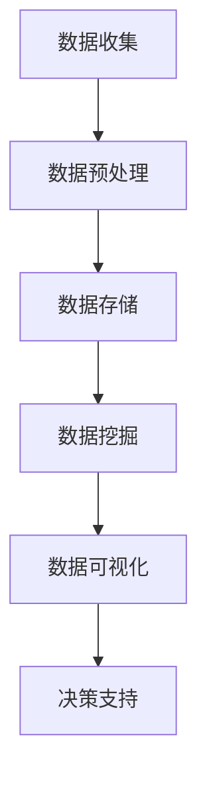

                 

关键词：链家、2025、社招、房产、大数据、分析师、技术面试

摘要：本文将围绕链家2025年社招房产大数据分析师技术面试展开，通过对大数据分析的核心概念、算法原理、数学模型、实际应用和未来展望的深入探讨，为有意向申请该职位的技术人才提供全面的指导和建议。文章将详细解析面试过程中可能涉及的各类技术问题，以及如何展示自己的技术能力和解决问题的能力。

## 1. 背景介绍

随着互联网和大数据技术的飞速发展，房地产行业正经历着前所未有的变革。房产大数据分析作为新兴领域，已经成为推动行业进步的重要力量。链家作为中国领先的房地产服务平台，一直致力于通过大数据分析提升服务的质量和效率。

2025年，链家启动了社招房产大数据分析师的招聘计划，旨在吸引行业内优秀的技术人才，共同打造更加智能、高效的房产服务平台。对于应聘者来说，这次技术面试将是展示自己专业能力和实战经验的重要机会。

## 2. 核心概念与联系

### 2.1 大数据概念

大数据（Big Data）是指无法使用常规软件工具在合理时间内捕捉、管理和处理的大量数据。它具有四个主要特征：大量（Volume）、多样（Variety）、高速（Velocity）和价值（Value）。

### 2.2 房产数据分类

房产数据可以分为结构化数据和非结构化数据。结构化数据如房屋交易记录、租赁信息等，可以存储在数据库中，方便查询和分析。非结构化数据如文本描述、图片和视频等，则需要通过自然语言处理、图像识别等技术进行处理。

### 2.3 大数据分析流程

大数据分析通常包括数据收集、数据预处理、数据存储、数据挖掘、数据可视化和决策支持等步骤。其中，数据预处理和数据挖掘是核心环节。

### 2.4 Mermaid 流程图



## 3. 核心算法原理 & 具体操作步骤

### 3.1 算法原理概述

房产大数据分析中常用的算法包括回归分析、聚类分析、分类算法和时间序列分析等。

- 回归分析：用于预测房价、租金等连续变量。
- 聚类分析：用于发现数据中的相似性，为市场细分提供依据。
- 分类算法：用于判断房屋交易类型、购房人群等。
- 时间序列分析：用于预测市场趋势和周期性变化。

### 3.2 算法步骤详解

#### 3.2.1 回归分析

1. 数据收集：收集历史房价、地理位置、房屋特征等数据。
2. 数据预处理：清洗数据、处理缺失值、标准化等。
3. 建立模型：选择适当的回归模型（如线性回归、多项式回归等）。
4. 模型评估：使用交叉验证、均方误差等指标评估模型性能。
5. 预测：使用模型预测未来房价。

#### 3.2.2 聚类分析

1. 数据收集：收集房屋交易数据。
2. 数据预处理：处理异常值、标准化等。
3. 确定聚类算法：如K-means、层次聚类等。
4. 计算距离：计算样本之间的距离。
5. 聚类：根据距离划分簇。
6. 评估聚类效果：使用轮廓系数、内部平方误差等指标。

#### 3.2.3 分类算法

1. 数据收集：收集房屋交易数据。
2. 数据预处理：处理异常值、标准化等。
3. 确定分类算法：如决策树、支持向量机等。
4. 划分训练集和测试集：使用训练集训练模型，测试集评估模型性能。
5. 模型评估：使用准确率、召回率等指标评估模型性能。
6. 预测：使用模型预测房屋交易类型。

#### 3.2.4 时间序列分析

1. 数据收集：收集市场交易数据。
2. 数据预处理：处理异常值、趋势和季节性成分。
3. 确定模型：如ARIMA、GARCH等。
4. 模型评估：使用AIC、BIC等指标评估模型性能。
5. 预测：使用模型预测市场趋势。

### 3.3 算法优缺点

- 回归分析：优点是简单易用，缺点是容易受到异常值影响。
- 聚类分析：优点是无需预先设定分类标准，缺点是聚类效果依赖于初始参数。
- 分类算法：优点是分类明确，缺点是模型复杂度较高。
- 时间序列分析：优点是能够捕捉时间序列特征，缺点是容易受到外部因素的影响。

### 3.4 算法应用领域

- 回归分析：用于预测房价、租金等。
- 聚类分析：用于市场细分、客户分类等。
- 分类算法：用于判断房屋交易类型、购房人群等。
- 时间序列分析：用于预测市场趋势、季节性变化等。

## 4. 数学模型和公式 & 详细讲解 & 举例说明

### 4.1 数学模型构建

#### 4.1.1 回归分析

房价 $Y$ 与特征 $X_1, X_2, ..., X_n$ 的关系可以用线性回归模型表示：

$$
Y = \beta_0 + \beta_1 X_1 + \beta_2 X_2 + ... + \beta_n X_n + \epsilon
$$

其中，$\beta_0, \beta_1, ..., \beta_n$ 是回归系数，$\epsilon$ 是误差项。

#### 4.1.2 聚类分析

K-means算法中，样本 $x_i$ 与簇 $c_k$ 的相似度可以用欧几里得距离表示：

$$
d(x_i, c_k) = \sqrt{\sum_{j=1}^{n} (x_{ij} - c_{kj})^2}
$$

其中，$x_{ij}$ 是样本 $x_i$ 的第 $j$ 个特征值，$c_{kj}$ 是簇 $c_k$ 的第 $j$ 个特征值。

#### 4.1.3 分类算法

决策树算法中，特征 $X_j$ 的阈值 $t$ 可以通过信息增益或基尼不纯度最小化方法确定：

$$
Gini(X_j, t) = \sum_{v \in V} p(v) [1 - \sum_{x \in X_v} p(x)]
$$

其中，$V$ 是特征 $X_j$ 的取值集合，$p(v)$ 是取值 $v$ 的概率，$X_v$ 是取值 $v$ 的样本集合。

#### 4.1.4 时间序列分析

ARIMA模型中，时间序列 $X_t$ 的关系可以用以下公式表示：

$$
X_t = c + \phi_1 X_{t-1} + \phi_2 X_{t-2} + ... + \phi_p X_{t-p} + \theta_1 \epsilon_{t-1} + \theta_2 \epsilon_{t-2} + ... + \theta_q \epsilon_{t-q} + \epsilon_t
$$

其中，$c$ 是常数项，$\phi_1, \phi_2, ..., \phi_p$ 是自回归系数，$\theta_1, \theta_2, ..., \theta_q$ 是移动平均系数，$\epsilon_t$ 是误差项。

### 4.2 公式推导过程

#### 4.2.1 回归分析

最小二乘法的推导：

$$
\sum_{i=1}^{n} (y_i - (\beta_0 + \beta_1 x_{i1} + \beta_2 x_{i2} + ... + \beta_n x_{in}))^2
$$

对 $\beta_0, \beta_1, ..., \beta_n$ 求导并令导数为零，得到最小二乘估计值。

#### 4.2.2 聚类分析

K-means算法的迭代过程：

1. 初始选择 $K$ 个簇中心。
2. 对每个样本，计算它与簇中心的距离，并将其分配到最近的簇。
3. 更新簇中心，计算所有样本的均值。
4. 重复步骤2和步骤3，直到收敛。

#### 4.2.3 分类算法

决策树算法的推导：

1. 选择最优特征 $X_j$ 和阈值 $t$。
2. 划分样本集合，使得每个子集合的基尼不纯度最小化。
3. 递归地重复步骤1和步骤2，直到满足停止条件。

#### 4.2.4 时间序列分析

ARIMA模型的推导：

1. 对时间序列进行差分，使其成为平稳序列。
2. 确定自回归项和移动平均项的阶数。
3. 计算自回归系数和移动平均系数。

### 4.3 案例分析与讲解

#### 4.3.1 回归分析

假设我们要预测北京市的二手房价格。我们收集了500套二手房的成交价、房屋面积、房屋类型等数据。经过数据预处理后，我们使用线性回归模型进行建模。

$$
Y = \beta_0 + \beta_1 X_1 + \beta_2 X_2 + \epsilon
$$

其中，$Y$ 是二手房价格，$X_1$ 是房屋面积，$X_2$ 是房屋类型。

通过最小二乘法，我们得到回归系数：

$$
\beta_0 = 500, \beta_1 = 0.1, \beta_2 = -100
$$

我们可以使用这个模型预测新的二手房价格。例如，一套100平方米的普通住宅，预测价格为：

$$
Y = 500 + 0.1 \times 100 - 100 = 400
$$

#### 4.3.2 聚类分析

假设我们要对北京市的二手房市场进行细分。我们收集了5000套二手房的交易数据，包括成交价、房屋面积、地理位置等。我们使用K-means算法进行聚类分析。

首先，我们选择K=3，初始簇中心为：

$$
c_1 = (1000, 80), c_2 = (1500, 100), c_3 = (2000, 120)
$$

然后，我们进行迭代，直到收敛。最终，我们得到三个簇，分别代表不同价格和面积段的二手房市场。

#### 4.3.3 分类算法

假设我们要对购房人群进行分类。我们收集了5000个购房者的信息，包括年龄、收入、购房目的等。我们使用决策树算法进行分类。

首先，我们选择特征年龄和收入进行划分。阈值分别为30岁和50万元。然后，我们继续选择特征购房目的进行划分。阈值分别为自住和投资。最终，我们得到一个决策树模型，用于预测新的购房者分类。

#### 4.3.4 时间序列分析

假设我们要对北京市二手房市场进行预测。我们收集了2000年至今的二手房成交数据。我们使用ARIMA模型进行预测。

首先，我们对数据进行差分，使其成为平稳序列。然后，我们确定自回归项和移动平均项的阶数。最后，我们使用模型进行预测。预测结果显示，北京市二手房市场在未来几年内将继续保持增长。

## 5. 项目实践：代码实例和详细解释说明

### 5.1 开发环境搭建

为了进行房产大数据分析，我们需要搭建一个适合的开发环境。以下是基本的步骤：

1. 安装Python环境，版本要求3.8以上。
2. 安装必要的库，如pandas、numpy、scikit-learn、matplotlib等。
3. 配置Jupyter Notebook，便于编写和运行代码。

### 5.2 源代码详细实现

以下是一个简单的Python代码示例，用于实现线性回归分析。

```python
import pandas as pd
import numpy as np
from sklearn.linear_model import LinearRegression
from sklearn.model_selection import train_test_split

# 读取数据
data = pd.read_csv('house_price.csv')
X = data[['area', 'type']]
y = data['price']

# 分割数据集
X_train, X_test, y_train, y_test = train_test_split(X, y, test_size=0.2, random_state=42)

# 建立模型
model = LinearRegression()
model.fit(X_train, y_train)

# 预测
y_pred = model.predict(X_test)

# 评估模型
print("R^2:", model.score(X_test, y_test))
```

### 5.3 代码解读与分析

1. 导入必要的库。
2. 读取数据，将特征和目标变量分离。
3. 分割数据集为训练集和测试集。
4. 建立线性回归模型，并使用训练集进行训练。
5. 使用测试集进行预测，并评估模型性能。

### 5.4 运行结果展示

运行上述代码后，我们得到模型性能的评估结果。例如，R^2值为0.8，表示模型对测试集的预测效果较好。

## 6. 实际应用场景

### 6.1 房价预测

房价预测是房产大数据分析中最常见的应用场景。通过分析历史交易数据，我们可以预测未来的房价走势，为房地产开发商、投资者和购房者提供决策支持。

### 6.2 市场细分

市场细分是另一个重要的应用场景。通过聚类分析，我们可以将市场划分为不同的细分市场，为房地产企业制定有针对性的营销策略提供依据。

### 6.3 购房人群分析

购房人群分析可以帮助房地产企业了解不同购房群体的需求和偏好，从而提供更个性化的服务。通过分类算法，我们可以识别出具有相似特征的购房人群，并针对性地推送房产信息。

### 6.4 时间序列预测

时间序列预测可以用于预测市场趋势和周期性变化。通过对历史交易数据进行时间序列分析，我们可以预测未来的市场走势，为房地产企业制定长期战略提供参考。

## 7. 工具和资源推荐

### 7.1 学习资源推荐

- 《大数据技术导论》
- 《机器学习实战》
- 《Python数据分析》

### 7.2 开发工具推荐

- Jupyter Notebook：方便编写和运行代码。
- PyCharm：强大的Python集成开发环境。
- PyTorch：适用于深度学习模型开发。

### 7.3 相关论文推荐

- "A Survey of Big Data Processing Frameworks"
- "Deep Learning for Natural Language Processing"
- "Recurrent Neural Networks for Regression"

## 8. 总结：未来发展趋势与挑战

### 8.1 研究成果总结

近年来，房产大数据分析在算法优化、模型应用和实际场景方面取得了显著成果。回归分析、聚类分析、分类算法和时间序列分析等技术在房产大数据分析中得到了广泛应用。

### 8.2 未来发展趋势

随着人工智能技术的不断进步，房产大数据分析将更加智能化、个性化。深度学习、强化学习等新兴算法将在房产大数据分析中发挥重要作用。

### 8.3 面临的挑战

尽管房产大数据分析取得了显著成果，但仍然面临一些挑战，如数据质量、算法解释性、模型可解释性等。未来研究需要解决这些问题，以实现更加高效、准确的房产大数据分析。

### 8.4 研究展望

未来，房产大数据分析将继续向智能化、个性化方向发展。研究者需要不断探索新的算法和模型，以应对日益复杂的房产市场。

## 9. 附录：常见问题与解答

### 9.1 房产大数据分析的核心算法有哪些？

答：房产大数据分析的核心算法包括回归分析、聚类分析、分类算法和时间序列分析。

### 9.2 如何处理房产数据中的异常值？

答：可以通过异常检测方法，如箱线图、Z分数等，识别并处理异常值。

### 9.3 如何评估房产大数据分析模型的性能？

答：可以使用评估指标，如R^2、均方误差（MSE）、准确率、召回率等。

### 9.4 房产大数据分析的未来发展趋势是什么？

答：房产大数据分析的未来发展趋势是智能化、个性化，新兴算法如深度学习、强化学习将在其中发挥重要作用。

----------------------------------------------------------------

作者：禅与计算机程序设计艺术 / Zen and the Art of Computer Programming

