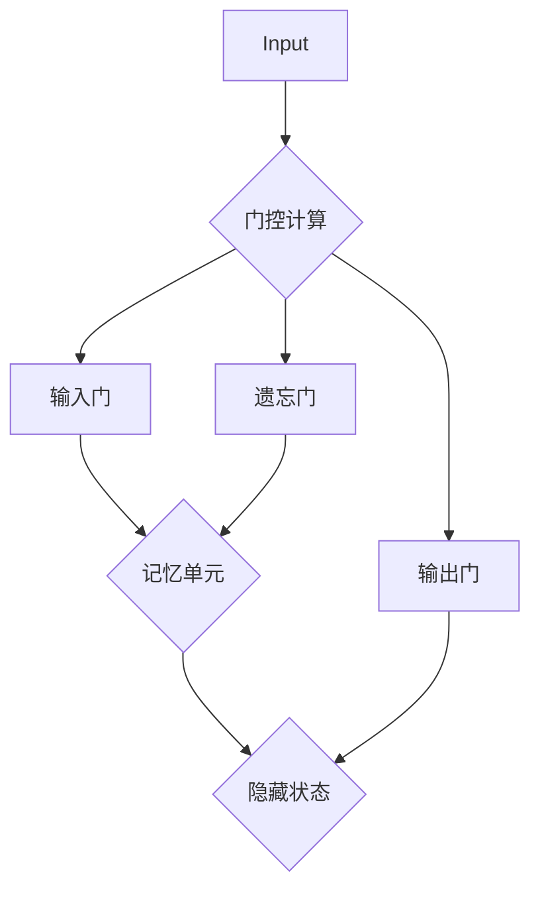

                 

关键词：长短期记忆网络（LSTM）、神经网络、序列模型、时间序列分析、机器学习、深度学习

## 摘要

本文将深入探讨长短期记忆网络（LSTM）的基本原理、数学模型及其在时间序列分析、序列建模中的应用。我们将通过具体的算法步骤、数学公式推导以及代码实例，来解析LSTM如何在深度学习领域中发挥重要作用。本文旨在为读者提供一个全面、系统的LSTM知识体系，帮助读者理解LSTM的核心概念、应用场景和未来发展趋势。

## 1. 背景介绍

长短期记忆网络（Long Short-Term Memory，简称LSTM）是循环神经网络（Recurrent Neural Network，RNN）的一种改进型架构，由Hochreiter和Schmidhuber在1997年首次提出。LSTM旨在解决传统RNN在处理长序列数据时出现的梯度消失和梯度爆炸问题，从而改善模型在长期依赖关系上的表现。

### 1.1 RNN的不足

传统的循环神经网络（RNN）在处理序列数据时，存在以下问题：

- **梯度消失和梯度爆炸**：在反向传播过程中，梯度可能会变得非常小（消失）或者非常大（爆炸），导致训练过程不稳定。
- **长期依赖问题**：RNN难以捕捉序列中长远的依赖关系，因此在处理长序列数据时表现不佳。

### 1.2 LSTM的提出

为了解决上述问题，Hochreiter和Schmidhuber提出了LSTM。LSTM通过引入门控机制，使得模型能够有效地控制信息的流动，从而在长时间范围内保持有效的梯度传递。这使得LSTM在处理序列数据时，能够更好地捕捉长期依赖关系。

## 2. 核心概念与联系

### 2.1 LSTM的结构

LSTM的基本结构包含三个门控单元和一个记忆单元：

- **输入门（Input Gate）**：控制新的信息是否被存储到记忆单元中。
- **遗忘门（Forget Gate）**：控制记忆单元中哪些信息应该被遗忘。
- **输出门（Output Gate）**：控制记忆单元中哪些信息应该被输出到下一个隐藏状态。

记忆单元（Cell State）在整个网络中流动，使得LSTM能够在时间序列中保持长期的依赖关系。

### 2.2 LSTM与RNN的联系

LSTM是RNN的一种扩展，继承了RNN处理序列数据的能力。同时，LSTM通过门控机制解决了RNN在处理长期依赖关系时的不足。

### 2.3 LSTM与GRU的联系

门控循环单元（Gated Recurrent Unit，GRU）是LSTM的简化版。GRU将LSTM的三个门控单元简化为两个，同时引入更新门（Update Gate）和重置门（Reset Gate），使得模型在计算上更加高效。然而，GRU在捕捉长期依赖关系上可能不如LSTM。

### 2.4 LSTM的Mermaid流程图



## 3. 核心算法原理 & 具体操作步骤

### 3.1 算法原理概述

LSTM通过门控机制和记忆单元来处理序列数据。在每一个时间步，LSTM会根据当前输入和隐藏状态，通过输入门、遗忘门和输出门来更新记忆单元和隐藏状态。

### 3.2 算法步骤详解

1. **输入门（Input Gate）**

   输入门的目的是决定新的输入信息中哪些部分应该更新记忆单元。计算过程如下：

   $$i_t = \sigma(W_{ix}x_t + W_{ih}h_{t-1} + b_i)$$

   其中，$i_t$ 表示输入门的状态，$W_{ix}$ 和 $W_{ih}$ 分别是输入和隐藏状态到输入门的权重矩阵，$b_i$ 是偏置项，$\sigma$ 是sigmoid函数。

2. **遗忘门（Forget Gate）**

   遗忘门的目的是决定哪些信息应该从记忆单元中丢弃。计算过程如下：

   $$f_t = \sigma(W_{fx}x_t + W_{fh}h_{t-1} + b_f)$$

   其中，$f_t$ 表示遗忘门的状态，$W_{fx}$ 和 $W_{fh}$ 分别是输入和隐藏状态到遗忘门的权重矩阵，$b_f$ 是偏置项。

3. **记忆单元的更新**

   根据遗忘门的状态，记忆单元中的旧信息会被丢弃。新信息通过输入门被更新到记忆单元中：

   $$g_t = \tanh(W_{cx}x_t + W_{ch}h_{t-1} + b_c)$$

   $$C_t = f_t \odot C_{t-1} + i_t \odot g_t$$

   其中，$g_t$ 表示候选值，$\odot$ 表示点乘操作，$C_t$ 表示新的记忆单元状态。

4. **输出门（Output Gate）**

   输出门的目的是决定记忆单元中哪些信息应该被输出到下一个隐藏状态。计算过程如下：

   $$o_t = \sigma(W_{ox}x_t + W_{oh}h_{t-1} + b_o)$$

   $$h_t = o_t \odot \tanh(C_t)$$

   其中，$h_t$ 表示新的隐藏状态，$o_t$ 表示输出门的状态。

### 3.3 算法优缺点

**优点：**

- **解决长期依赖问题**：通过门控机制和记忆单元，LSTM能够有效地捕捉序列中的长期依赖关系。
- **梯度消失和梯度爆炸问题**：LSTM通过门控机制控制梯度流动，从而避免了梯度消失和梯度爆炸问题。

**缺点：**

- **计算复杂度高**：LSTM的网络结构复杂，导致计算成本较高。
- **参数较多**：由于门控机制和记忆单元的存在，LSTM的参数数量较多，训练过程较长。

### 3.4 算法应用领域

LSTM在以下领域有着广泛的应用：

- **时间序列分析**：用于预测股票价格、天气变化等。
- **自然语言处理**：用于文本生成、机器翻译等。
- **语音识别**：用于语音信号的序列建模。

## 4. 数学模型和公式 & 详细讲解 & 举例说明

### 4.1 数学模型构建

LSTM的数学模型主要由以下几个部分组成：

- **输入门（Input Gate）**：
  $$i_t = \sigma(W_{ix}x_t + W_{ih}h_{t-1} + b_i)$$

- **遗忘门（Forget Gate）**：
  $$f_t = \sigma(W_{fx}x_t + W_{fh}h_{t-1} + b_f)$$

- **输出门（Output Gate）**：
  $$o_t = \sigma(W_{ox}x_t + W_{oh}h_{t-1} + b_o)$$

- **记忆单元的更新**：
  $$g_t = \tanh(W_{cx}x_t + W_{ch}h_{t-1} + b_c)$$
  $$C_t = f_t \odot C_{t-1} + i_t \odot g_t$$

- **隐藏状态更新**：
  $$h_t = o_t \odot \tanh(C_t)$$

### 4.2 公式推导过程

LSTM的公式推导主要分为以下几个步骤：

1. **输入门（Input Gate）**：

   输入门的计算过程是输入和隐藏状态的线性组合，然后通过sigmoid函数进行激活。这表示输入门的状态取决于当前输入和之前的隐藏状态。

2. **遗忘门（Forget Gate）**：

   遗忘门的计算过程与输入门类似，但这里的目标是决定记忆单元中哪些信息应该被遗忘。因此，遗忘门的状态反映了记忆单元中的信息重要性。

3. **记忆单元的更新**：

   记忆单元的更新由遗忘门和输入门共同决定。遗忘门决定哪些信息应该被丢弃，输入门决定哪些新信息应该被存储。

4. **输出门（Output Gate）**：

   输出门决定记忆单元中的哪些信息应该被输出到隐藏状态。这确保了隐藏状态能够反映序列中的重要信息。

### 4.3 案例分析与讲解

**案例：** 股票价格预测

在这个案例中，我们将使用LSTM模型来预测股票价格。我们使用过去一段时间内的股票价格数据作为输入，目标是预测未来的股票价格。

**步骤：**

1. **数据预处理**：将股票价格数据进行归一化处理，使其在相同的范围内。

2. **构建LSTM模型**：使用TensorFlow或PyTorch等深度学习框架，构建LSTM模型。模型的输入层、隐藏层和输出层分别对应输入序列、隐藏状态和输出序列。

3. **训练模型**：使用历史数据对模型进行训练。在训练过程中，模型会调整权重和偏置，以最小化预测误差。

4. **预测股票价格**：使用训练好的模型对未来的股票价格进行预测。这可以通过将未来的股票价格数据输入到模型中，得到预测的股票价格序列。

5. **评估模型性能**：使用验证集和测试集来评估模型的性能。常用的评估指标包括均方误差（MSE）和准确率（Accuracy）。

## 5. 项目实践：代码实例和详细解释说明

### 5.1 开发环境搭建

在开始编写LSTM的代码实例之前，我们需要搭建一个适合开发深度学习项目的环境。以下是一个简单的步骤：

1. **安装Python**：确保系统上安装了Python 3.6及以上版本。
2. **安装TensorFlow**：使用pip命令安装TensorFlow。

   ```shell
   pip install tensorflow
   ```

3. **安装其他依赖库**：如NumPy、Pandas等。

   ```shell
   pip install numpy pandas matplotlib
   ```

### 5.2 源代码详细实现

下面是一个使用TensorFlow构建LSTM模型的简单例子：

```python
import tensorflow as tf
from tensorflow.keras.models import Sequential
from tensorflow.keras.layers import LSTM, Dense

# 数据预处理
# ...（此处省略数据加载和预处理代码）

# 构建LSTM模型
model = Sequential()
model.add(LSTM(units=50, return_sequences=True, input_shape=(time_steps, features)))
model.add(LSTM(units=50, return_sequences=False))
model.add(Dense(units=1))

# 编译模型
model.compile(optimizer='adam', loss='mean_squared_error')

# 训练模型
model.fit(x_train, y_train, epochs=100, batch_size=32)

# 预测股票价格
predictions = model.predict(x_test)

# 评估模型性能
# ...（此处省略评估代码）
```

### 5.3 代码解读与分析

在这个例子中，我们使用了TensorFlow的Sequential模型来构建一个简单的LSTM网络。模型包含两个LSTM层和一个全连接层（Dense）。

- **LSTM层**：第一个LSTM层接受输入序列，并返回序列的隐藏状态。`return_sequences=True` 参数表示我们希望得到序列的输出。第二个LSTM层接受前一个LSTM层的输出，并返回一个单一的隐藏状态。`return_sequences=False` 参数表示我们只需要最后一个时间步的输出。
- **全连接层**：最后的全连接层用于预测输出序列。

在训练模型时，我们使用了均方误差（MSE）作为损失函数，并选择了adam优化器。训练完成后，我们可以使用模型对测试集进行预测，并评估模型的性能。

### 5.4 运行结果展示

以下是模型的训练和预测结果的展示：

```python
# 训练模型
history = model.fit(x_train, y_train, epochs=100, batch_size=32, validation_split=0.2)

# 预测股票价格
predictions = model.predict(x_test)

# 评估模型性能
mse = model.evaluate(x_test, y_test)
print(f"Test MSE: {mse}")
```

模型的训练和评估结果将显示在控制台上。通过这些结果，我们可以了解模型在不同数据集上的性能。

## 6. 实际应用场景

### 6.1 时间序列分析

LSTM在时间序列分析中有着广泛的应用。例如，在金融领域，LSTM可以用于预测股票价格、外汇汇率等。在气象学领域，LSTM可以用于预测天气变化、降水量等。

### 6.2 自然语言处理

在自然语言处理领域，LSTM被广泛应用于文本生成、机器翻译、情感分析等任务。例如，LSTM可以用于生成自然流畅的文本，或者用于将一种语言的文本翻译成另一种语言的文本。

### 6.3 语音识别

LSTM在语音识别中也发挥着重要作用。通过将语音信号转换为序列数据，LSTM可以有效地捕捉语音信号中的长期依赖关系，从而提高识别的准确性。

## 7. 工具和资源推荐

### 7.1 学习资源推荐

- **《深度学习》（Goodfellow, Bengio, Courville著）**：这是一本关于深度学习的经典教材，涵盖了LSTM的基本原理和应用。
- **《序列模型与深度学习》（Graves著）**：这本书详细介绍了LSTM和其他序列模型的基本原理和应用。

### 7.2 开发工具推荐

- **TensorFlow**：这是一个流行的深度学习框架，提供了丰富的API和工具，适用于构建LSTM模型。
- **PyTorch**：这是一个开源的深度学习库，提供了灵活的动态计算图，适用于研究和个人项目。

### 7.3 相关论文推荐

- **《Long Short-Term Memory》**（Hochreiter和Schmidhuber，1997）：这是LSTM的原始论文，详细介绍了LSTM的基本原理和结构。
- **《Gated Recurrent Unit》**（Cho等，2014）：这是GRU的论文，介绍了GRU相对于LSTM的改进。

## 8. 总结：未来发展趋势与挑战

### 8.1 研究成果总结

LSTM作为一种强大的序列建模工具，已经在多个领域取得了显著的成果。通过门控机制和记忆单元，LSTM能够有效地捕捉序列中的长期依赖关系，从而在时间序列分析、自然语言处理和语音识别等领域表现出色。

### 8.2 未来发展趋势

- **更高效的算法**：随着计算能力的提升，研究人员将继续优化LSTM算法，提高其计算效率和模型性能。
- **多模态学习**：LSTM可以与其他神经网络（如卷积神经网络）结合，用于处理多模态数据，例如图像和文本。

### 8.3 面临的挑战

- **计算成本**：LSTM的结构复杂，参数数量较多，导致计算成本较高。
- **模型解释性**：尽管LSTM能够捕捉长期依赖关系，但其内部机制较为复杂，难以解释。

### 8.4 研究展望

LSTM在深度学习领域的应用前景广阔。未来，我们期待看到更多基于LSTM的创新模型和算法，以及其在更多领域的应用。

## 9. 附录：常见问题与解答

### 9.1 什么是LSTM？

LSTM（Long Short-Term Memory）是一种改进的循环神经网络（RNN），旨在解决RNN在处理长序列数据时出现的梯度消失和梯度爆炸问题，从而更好地捕捉序列中的长期依赖关系。

### 9.2 LSTM与RNN有什么区别？

LSTM是RNN的一种改进型架构，通过引入门控机制和记忆单元，解决了RNN在处理长期依赖关系时的不足。相比RNN，LSTM能够更好地保持长期的梯度传递。

### 9.3 如何训练LSTM模型？

训练LSTM模型需要准备序列数据，并将其输入到LSTM模型中。在训练过程中，模型会调整权重和偏置，以最小化预测误差。常用的训练方法包括随机梯度下降（SGD）和Adam优化器。

### 9.4 LSTM在哪些领域有应用？

LSTM在时间序列分析、自然语言处理、语音识别等领域有着广泛的应用。例如，在金融领域，LSTM可以用于预测股票价格；在自然语言处理领域，LSTM可以用于文本生成和机器翻译。

## 作者署名

作者：禅与计算机程序设计艺术 / Zen and the Art of Computer Programming
----------------------------------------------------------------

